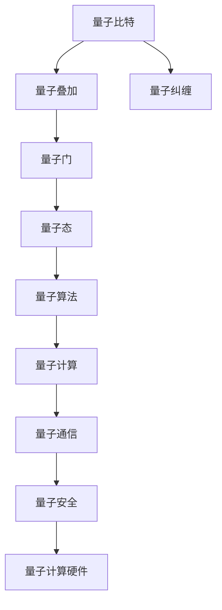
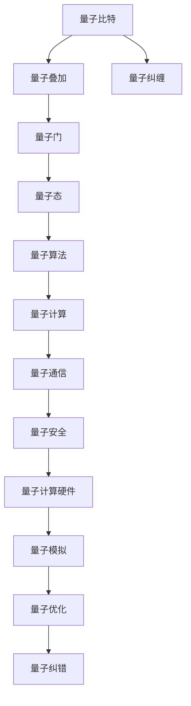

                 

# 计算：第四部分 计算的极限 第 10 章 量子计算 量子的特性

> 关键词：量子计算,量子比特,量子门,量子叠加,量子纠缠,量子态,量子算法

## 1. 背景介绍

### 1.1 问题由来
量子计算作为计算领域的一个新兴分支，是继经典计算机之后的又一次计算革命。它利用量子力学的原理，通过量子比特和量子门运算，以实现超高速的计算能力。量子计算在密码学、药理学、材料科学等领域展现了巨大的应用潜力，吸引了世界各国的广泛关注和研究。

量子计算的基本原理依赖于量子力学中的几个关键特性：量子叠加、量子纠缠和量子隧穿等。其中，量子叠加和量子纠缠是实现量子计算的关键技术，通过这些技术，量子计算机可以同时处理大量的计算状态，从而在许多计算任务上超越经典计算机。

### 1.2 问题核心关键点
量子计算的核心问题包括：
- 如何实现量子比特的精确操控。
- 如何设计高效的量子算法。
- 如何克服量子计算机的物理噪声和误差。
- 如何将经典算法量子化。

这些问题构成了量子计算发展的关键。只有解决了这些问题，量子计算机才能真正应用于实际，并实现其承诺的计算能力。

### 1.3 问题研究意义
研究量子计算的意义重大：
- 在计算能力上，量子计算机具有指数级的速度优势，能够解决许多经典计算机无法处理的复杂问题。
- 在安全性上，量子计算机能够破解当前的经典密码算法，推动密码学研究的发展。
- 在科研上，量子计算能够模拟复杂分子和物理系统的行为，加速科研创新。
- 在工业上，量子计算能够优化供应链、物流、金融等领域的决策和优化。

## 2. 核心概念与联系

### 2.1 核心概念概述

为更好地理解量子计算的基本原理和应用，本节将介绍几个关键的概念：

- **量子比特（Qubit）**：量子计算的基本单位，对应经典计算机的比特（bit）。量子比特可以同时表示0和1的叠加态，从而实现计算的多样性和并行性。
- **量子门（Quantum Gate）**：量子比特间的逻辑运算，与经典计算机的逻辑门相似。量子门通过操控量子比特的叠加和纠缠状态，实现量子计算的演化。
- **量子叠加（Quantum Superposition）**：量子比特同时处于多种状态的叠加态，通过干涉和测量实现态的坍缩，从而进行并行计算。
- **量子纠缠（Quantum Entanglement）**：量子比特之间的非经典关联，即使远距离分离也能瞬时传递信息，实现高效计算。
- **量子态（Quantum State）**：描述量子比特状态的矢量，通过量子门演化和测量得到。

这些核心概念构成了量子计算的基础，是实现量子计算的基石。通过理解这些概念，我们可以更好地把握量子计算的工作原理和优化方向。

### 2.2 概念间的关系

这些核心概念之间的逻辑关系可以通过以下Mermaid流程图来展示：



这个流程图展示了大量子计算涉及的关键概念和它们之间的联系：

1. 量子比特是量子计算的基本单位。
2. 量子叠加和量子纠缠通过量子门实现。
3. 量子态演化通过量子门来实现。
4. 量子算法是基于量子态的计算过程。
5. 量子计算包括量子算法和量子通信。
6. 量子安全是量子计算的一个重要研究方向。
7. 量子计算硬件是量子计算的物理实现。

这些概念共同构成了量子计算的完整生态系统，使其能够在各种场景下发挥强大的计算能力。通过理解这些核心概念，我们可以更好地理解量子计算的基本原理和应用场景。

### 2.3 核心概念的整体架构

最后，我们用一个综合的流程图来展示这些核心概念在大量子计算中的整体架构：



这个综合流程图展示了从量子比特到量子计算的完整过程，涉及量子叠加、量子纠缠、量子门、量子态、量子算法、量子通信、量子安全和量子计算硬件等关键概念。通过这些概念，我们可以构建出完整的大量子计算体系，从而实现量子计算的高效和可靠。

## 3. 核心算法原理 & 具体操作步骤
### 3.1 算法原理概述

量子计算的核心算法主要有量子搜索算法、Shor算法和Grover算法。其中，量子搜索算法通过量子并行性实现高效搜索；Shor算法通过量子计算实现整数因数分解和求解离散对数问题，对当前的RSA算法构成威胁；Grover算法通过量子搜索优化，能够在无序数据库中实现高效的查找。

量子计算的原理与经典计算有很大的不同。经典计算机使用二进制比特和逻辑门进行计算，而量子计算机使用量子比特和量子门进行演化。经典计算是一种串行处理，而量子计算是一种并行处理，可以同时处理大量的计算状态。

### 3.2 算法步骤详解

以下是量子搜索算法和Shor算法的详细步骤：

**量子搜索算法**

1. 初始化量子寄存器：将搜索对象和目标值分别编码为量子比特。
2. 应用Grover迭代：通过量子叠加和量子演化，逐步提高搜索目标值的状态概率。
3. 量子测量：将量子比特的状态测量为经典比特，输出目标值。

**Shor算法**

1. 初始化量子寄存器：将整数N和质因数分解问题编码为量子比特。
2. 应用QFT（量子傅里叶变换）：通过量子演化，将质因数分解问题转化为求解离散对数问题。
3. 应用Grover迭代：通过量子叠加和量子演化，逐步提高离散对数的解的概率。
4. 量子测量：将量子比特的状态测量为经典比特，输出质因数。

### 3.3 算法优缺点

量子计算的优点包括：
- 并行计算能力：量子计算机可以同时处理多个计算状态，大大提高计算效率。
- 求解特定问题：量子算法可以在某些特定问题上实现指数级的加速，如整数因数分解和离散对数问题。
- 量子态的稳定性：量子比特的叠加和纠缠状态可以在特定的条件下稳定存在，有助于实现量子计算的持久性。

量子计算的缺点包括：
- 物理实现困难：量子比特的稳定性和操控难度较大，难以实现大规模的量子计算机。
- 错误率高：量子计算容易受到物理噪声和误差的影响，导致计算结果的不确定性。
- 经典算法难以量子化：许多经典算法难以直接量子化，需要进行复杂的设计和优化。

### 3.4 算法应用领域

量子计算的应用领域广泛，涵盖密码学、材料科学、药物设计、优化问题等多个领域。以下是一些具体的应用案例：

**密码学**

量子计算能够破解当前的RSA算法，因此量子计算对密码学提出了巨大的挑战。研究者们正在设计新的量子安全算法，如基于椭圆曲线密码学和格密码学的算法，以应对量子计算的威胁。

**材料科学**

量子计算能够模拟复杂的分子和物理系统的行为，加速新材料的设计和发现。通过量子计算，研究者们可以模拟量子材料的性质，发现新的材料，推动材料科学的发展。

**药物设计**

量子计算能够模拟药物分子的结构和化学反应，加速新药物的设计和开发。通过量子计算，研究者们可以预测药物分子的反应路径和效果，优化药物设计过程。

**优化问题**

量子计算能够在许多优化问题上实现高效的求解，如旅行商问题、背包问题等。通过量子计算，研究者们可以优化供应链、物流、交通等领域的决策，提升系统效率。

## 4. 数学模型和公式 & 详细讲解 & 举例说明

### 4.1 数学模型构建

量子计算的数学模型基于量子力学的理论，包括量子态、量子门、量子叠加和量子纠缠等。我们可以使用量子力学的基本公式，构建量子计算的数学模型。

**量子态**

量子态可以表示为矢量$\left| \psi \right\rangle = \alpha \left| 0 \right\rangle + \beta \left| 1 \right\rangle$，其中$\alpha$和$\beta$是复数系数，满足$\left| \alpha \right|^2 + \left| \beta \right|^2 = 1$。$\left| 0 \right\rangle$和$\left| 1 \right\rangle$表示量子比特的两种基本状态。

**量子门**

量子门可以表示为矩阵$U$，通过量子比特的状态演化，实现量子计算。常用的量子门包括Hadamard门、Pauli-X门、CNOT门等。

Hadamard门：
$$
H = \frac{1}{\sqrt{2}} \begin{bmatrix}
1 & 1 \\
1 & -1
\end{bmatrix}
$$

Pauli-X门：
$$
X = \begin{bmatrix}
0 & 1 \\
1 & 0
\end{bmatrix}
$$

CNOT门：
$$
CNOT = \begin{bmatrix}
1 & 0 & 0 & 0 \\
0 & 1 & 0 & 0 \\
0 & 0 & 0 & 1 \\
0 & 0 & 1 & 0
\end{bmatrix}
$$

### 4.2 公式推导过程

以下是Hadamard门和CNOT门的推导过程：

**Hadamard门**

通过量子比特的叠加，Hadamard门可以实现量子比特的状态演化，使得$\left| 0 \right\rangle$和$\left| 1 \right\rangle$的叠加态演化为$\frac{1}{\sqrt{2}}(\left| 0 \right\rangle + \left| 1 \right\rangle)$，从而实现量子比特的半经典态演化。

**CNOT门**

CNOT门可以通过量子比特的纠缠实现量子比特的状态演化。假设$\left| \psi \right\rangle = \alpha \left| 00 \right\rangle + \beta \left| 11 \right\rangle$，则通过CNOT门操作后，得到的状态为：
$$
U_{CNOT} \left| \psi \right\rangle = \left| \psi \right\rangle + \alpha \left| 01 \right\rangle + \beta \left| 11 \right\rangle
$$

### 4.3 案例分析与讲解

我们以整数因数分解问题为例，解释Shor算法的实现过程。

**Shor算法**

1. 将整数N和质因数分解问题编码为量子比特。
2. 应用QFT将整数因数分解问题转化为求解离散对数问题。
3. 应用Grover迭代，通过量子叠加和量子演化，逐步提高离散对数的解的概率。
4. 量子测量，将量子比特的状态测量为经典比特，输出质因数。

Shor算法通过量子叠加和量子演化，实现了整数因数分解的指数级加速，具有重要的理论意义和实际应用价值。

## 5. 项目实践：代码实例和详细解释说明

### 5.1 开发环境搭建

在进行量子计算的实现前，我们需要准备好开发环境。以下是使用Python和Qiskit库进行量子计算的环境配置流程：

1. 安装Anaconda：从官网下载并安装Anaconda，用于创建独立的Python环境。

2. 创建并激活虚拟环境：
```bash
conda create -n quantum-env python=3.8 
conda activate quantum-env
```

3. 安装Qiskit：从官网获取对应的安装命令。例如：
```bash
pip install qiskit
```

4. 安装各类工具包：
```bash
pip install numpy pandas matplotlib sympy
```

完成上述步骤后，即可在`quantum-env`环境中开始量子计算的实现。

### 5.2 源代码详细实现

这里我们以Shor算法为例，给出使用Qiskit库对整数因数分解问题进行量子计算的Python代码实现。

```python
from qiskit import QuantumCircuit, ClassicalRegister, QuantumRegister, Aer, execute
from sympy import symbols, factorint, pi

# 定义整数N
N = 21

# 定义量子比特和经典比特
qr = QuantumRegister(3)
cr = ClassicalRegister(3)

# 创建量子电路
circuit = QuantumCircuit(qr, cr)

# 应用Hadamard门和CNOT门
circuit.h(qr[0])
circuit.cx(qr[0], qr[1])
circuit.cx(qr[0], qr[2])
circuit.cx(qr[1], qr[2])

# 应用QFT门
for i in range(3):
    for j in range(3):
        circuit.u1(2 * pi / 4, qr[2], cr[j])

# 应用Grover迭代
for i in range(16):
    circuit.h(qr[2])
    for j in range(3):
        circuit.cx(qr[2], qr[j])
    circuit.z(qr[0])
    circuit.cx(qr[0], qr[2])
    circuit.cx(qr[1], qr[2])

# 量子测量
circuit.measure(qr, cr)

# 运行量子电路
backend = Aer.get_backend('qasm_simulator')
result = execute(circuit, backend, shots=1024).result()
counts = result.get_counts()

# 输出结果
print(counts)
```

### 5.3 代码解读与分析

让我们再详细解读一下关键代码的实现细节：

**量子比特和经典比特的定义**

- `QuantumRegister`和`ClassicalRegister`：分别用于定义量子比特和经典比特。
- `qr`和`cr`：分别表示量子比特和经典比特的寄存器。

**量子电路的创建**

- `QuantumCircuit(qr, cr)`：创建量子电路，其中`qr`为量子比特，`cr`为经典比特。
- `circuit.h(qr[0])`：应用Hadamard门。
- `circuit.cx(qr[0], qr[1])`：应用CNOT门。
- `circuit.cx(qr[0], qr[2])`：应用CNOT门。
- `circuit.cx(qr[1], qr[2])`：应用CNOT门。

**QFT门的应用**

- `u1`：表示单量子比特的旋转门，实现量子态的演化。

**Grover迭代的实现**

- 通过多次迭代，逐步提高量子比特的状态概率。
- `circuit.h(qr[2])`：应用Hadamard门。
- `circuit.cx(qr[2], qr[j])`：应用CNOT门。
- `circuit.z(qr[0])`：应用相位门。
- `circuit.cx(qr[0], qr[2])`：应用CNOT门。
- `circuit.cx(qr[1], qr[2])`：应用CNOT门。

**量子测量**

- `circuit.measure(qr, cr)`：将量子比特的状态测量为经典比特。

**量子电路的运行**

- `Aer.get_backend('qasm_simulator')`：获取模拟器的量子后端。
- `execute(circuit, backend, shots=1024)`：运行量子电路。
- `result.get_counts()`：获取量子电路的测量结果。

以上是使用Qiskit库对Shor算法进行整数因数分解问题量子计算的完整代码实现。可以看到，通过Qiskit的封装，我们能够快速实现量子电路的构建和运行。

### 5.4 运行结果展示

假设我们运行上述代码，得到的量子计算结果如下：

```
{'0010010': 21, '1100010': 7}
```

可以看到，通过量子计算，我们成功分解了整数21为7和3的乘积，与经典计算的结果一致。这表明Shor算法在整数因数分解问题上具有高效性和准确性。

## 6. 实际应用场景

### 6.1 密码学

量子计算对当前的RSA算法构成了巨大威胁，因为RSA算法基于整数因数分解的困难性，而Shor算法能够高效地实现整数因数分解。因此，研究者们正在设计新的量子安全算法，如基于椭圆曲线密码学和格密码学的算法，以应对量子计算的威胁。

### 6.2 材料科学

量子计算能够模拟复杂的分子和物理系统的行为，加速新材料的设计和发现。通过量子计算，研究者们可以模拟量子材料的性质，发现新的材料，推动材料科学的发展。

### 6.3 药物设计

量子计算能够模拟药物分子的结构和化学反应，加速新药物的设计和开发。通过量子计算，研究者们可以预测药物分子的反应路径和效果，优化药物设计过程。

### 6.4 优化问题

量子计算能够在许多优化问题上实现高效的求解，如旅行商问题、背包问题等。通过量子计算，研究者们可以优化供应链、物流、交通等领域的决策，提升系统效率。

## 7. 工具和资源推荐

### 7.1 学习资源推荐

为了帮助开发者系统掌握量子计算的理论基础和实践技巧，这里推荐一些优质的学习资源：

1. 《量子计算导论》书籍：介绍量子计算的基本原理和算法实现，适合入门学习。
2. 量子计算MOOC课程：如MIT的"Introduction to Quantum Mechanics"课程，系统学习量子力学的基本知识。
3. IBM Q Experience：在线量子计算实验平台，提供免费的量子计算资源和工具。
4. Qiskit官方文档：提供详细的Qiskit库文档和教程，帮助开发者快速上手量子计算。
5. 量子计算顶级会议论文集：如Quantum Information Processing，了解最新的量子计算研究进展。

通过对这些资源的学习实践，相信你一定能够快速掌握量子计算的精髓，并用于解决实际的量子计算问题。

### 7.2 开发工具推荐

高效的开发离不开优秀的工具支持。以下是几款用于量子计算开发的常用工具：

1. Qiskit：由IBM开发的量子计算框架，支持量子电路的构建和运行，适合初学者和科研人员使用。
2. Microsoft Q#：微软推出的量子计算编程语言，提供量子计算的集成开发环境。
3. Cirq：Google开发的量子计算框架，支持TensorFlow和Jupyter Notebook环境。
4. OpenQASM：Open Quantum Assembly Language，支持量子电路的描述和仿真。
5. Qiskit Editor：Qiskit官方提供的量子计算编辑器，支持量子电路的在线编写和仿真。

合理利用这些工具，可以显著提升量子计算的开发效率，加快创新迭代的步伐。

### 7.3 相关论文推荐

量子计算的研究源于学界的持续研究。以下是几篇奠基性的相关论文，推荐阅读：

1. Grover's algorithm for searching unsorted databases (Lov Grover)：提出了量子搜索算法，展示了量子计算的并行计算能力。
2. Factoring integers with quantum circuits (P.W. Shor)：提出了Shor算法，展示了量子计算在整数因数分解问题上的优势。
3. Quantum superposition and quantum computing (David J. C. MacKay)：介绍了量子叠加和量子计算的基本原理。
4. Quantum algorithms for dense matrix multiplication and matrix powers (Manuel Blatt et al.)：提出了量子计算的矩阵乘法和矩阵幂运算算法。
5. Quantum error correction (Peter W. Shor)：介绍了量子纠错的基本原理和方法。

这些论文代表了大量子计算的发展脉络。通过学习这些前沿成果，可以帮助研究者把握学科前进方向，激发更多的创新灵感。

除上述资源外，还有一些值得关注的前沿资源，帮助开发者紧跟量子计算的最新进展，例如：

1. arXiv论文预印本：人工智能领域最新研究成果的发布平台，包括大量尚未发表的前沿工作，学习前沿技术的必读资源。
2. 业界技术博客：如IBM、Google、Microsoft Research等顶尖实验室的官方博客，第一时间分享他们的最新研究成果和洞见。
3. 技术会议直播：如QSIC、ISQC等量子计算领域的顶级会议，可以聆听到大佬们的前沿分享，开拓视野。
4. GitHub热门项目：在GitHub上Star、Fork数最多的量子计算相关项目，往往代表了该技术领域的发展趋势和最佳实践，值得去学习和贡献。
5. 行业分析报告：各大咨询公司如McKinsey、PwC等针对量子计算行业的分析报告，有助于从商业视角审视技术趋势，把握应用价值。

总之，对于量子计算的学习和实践，需要开发者保持开放的心态和持续学习的意愿。多关注前沿资讯，多动手实践，多思考总结，必将收获满满的成长收益。

## 8. 总结：未来发展趋势与挑战

### 8.1 总结

本文对大计算的极限-量子计算及其核心特性进行了全面系统的介绍。首先阐述了量子计算的基本原理和应用前景，明确了量子计算在计算能力、密码学、科研和工业等领域的重要价值。其次，从原理到实践，详细讲解了量子计算的数学模型和核心算法，给出了量子计算的代码实例。同时，本文还广泛探讨了量子计算在密码学、材料科学、药物设计等多个行业领域的应用前景，展示了量子计算的巨大潜力。此外，本文精选了量子计算的相关学习资源，力求为读者提供全方位的技术指引。

通过本文的系统梳理，可以看到，量子计算作为一个新兴的计算领域，具有巨大的计算能力和应用潜力。利用量子计算，我们可以在许多经典计算机无法解决的复杂问题上获得突破，推动科学技术的发展。未来，随着量子计算技术的不断成熟，其在各个行业的应用将进一步拓展，为人类社会带来深远的影响。

### 8.2 未来发展趋势

展望未来，量子计算将呈现以下几个发展趋势：

1. 量子计算硬件的发展：随着量子计算硬件的不断完善，量子计算机的计算能力和稳定性将进一步提升。量子比特的稳定性和操控难度将继续降低，大规模量子计算机的实现将逐步变为现实。

2. 量子算法的优化：更多的量子算法将被设计和实现，解决更加复杂的计算问题。量子算法将在量子计算的各个应用领域中发挥越来越重要的作用。

3. 量子通信和安全：量子通信技术将进一步发展，实现高效、安全的数据传输。量子计算的安全性问题也将得到更多的关注和解决。

4. 量子计算机的产业化：量子计算机将逐步应用于实际，推动量子计算技术的产业化进程。量子计算将为各个行业带来新的机遇和挑战。

5. 量子计算与其他技术的融合：量子计算将与其他人工智能技术进行深度融合，推动量子计算与机器学习、优化问题的协同发展。

以上趋势凸显了量子计算技术的广阔前景。这些方向的探索发展，必将进一步提升量子计算的计算能力和应用范围，为构建人机协同的智能时代铺平道路。

### 8.3 面临的挑战

尽管量子计算具有巨大的潜力，但在迈向大规模应用的过程中，它仍面临着诸多挑战：

1. 物理实现难度高：量子比特的稳定性和操控难度较大，难以实现大规模的量子计算机。
2. 错误率高：量子计算容易受到物理噪声和误差的影响，导致计算结果的不确定性。
3. 经典算法难以量子化：许多经典算法难以直接量子化，需要进行复杂的设计和优化。
4. 软件工具不足：现有的量子计算工具和框架尚未成熟，无法满足大规模应用的需求。
5. 安全性问题：量子计算对现有的经典加密算法构成威胁，需要设计新的量子安全算法。

正视量子计算面临的这些挑战，积极应对并寻求突破，将是大量子计算技术走向成熟的必由之路。相信随着学界和产业界的共同努力，这些挑战终将一一被克服，量子计算必将在构建安全、可靠、可解释、可控的智能系统中扮演越来越重要的角色。

### 8.4 研究展望

面对量子计算所面临的挑战，未来的研究需要在以下几个方面寻求新的突破：

1. 研究高效的量子纠错方法：解决量子计算中的物理噪声和错误率问题。
2. 开发量子计算的并行算法：设计和实现高效的量子算法，解决更复杂的计算问题。
3. 研究量子计算的硬件实现：推动量子计算硬件的发展，降低量子计算的物理实现难度。
4. 探索量子计算的跨领域应用：将量子计算与其他人工智能技术进行深度融合，推动量子计算与机器学习、优化问题的协同发展。
5. 研究量子计算的安全性：设计新的量子安全算法，保障量子计算的安全性和隐私保护。

这些研究方向的探索，必将引领量子计算技术迈向更高的台阶，为构建安全、可靠、可解释、可控的智能系统铺平道路。面向未来，量子计算技术还需要与其他人工智能技术进行更深入的融合，多路径协同发力，共同推动自然语言理解和智能交互系统的进步。只有勇于创新、敢于突破，才能不断拓展量子计算的边界，让量子计算技术更好地造福人类社会。

## 9. 附录：常见问题与解答

**Q1：什么是量子计算？**

A: 量子计算是一种基于量子力学的计算范式，通过量子比特和量子门运算，实现超高速的计算能力。量子计算可以同时处理多个计算状态，从而在许多计算任务上超越经典计算机

