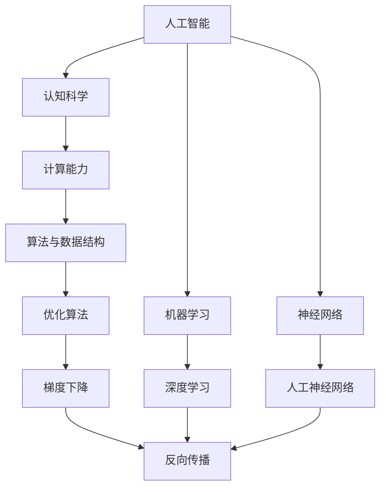

                 

# 计算：第四部分 计算的极限 第 12 章 机器能思考吗

## 1. 背景介绍

### 1.1 问题由来

计算机科学作为一门学科，自20世纪40年代兴起以来，已经取得了显著的进展。从最初的电子管计算机到现在的量子计算机，从冯·诺依曼架构到深度学习，计算机科学不断拓展其计算能力，向着无限可能前进。然而，当我们尝试在计算机中模拟人的认知功能时，一个深刻的问题出现了：机器能否思考？

### 1.2 问题核心关键点

机器思考的问题，不仅是一个理论问题，更是一个技术挑战。它涉及人工智能、认知科学、计算机科学等多个领域，旨在探索计算机是否具备人类智能，以及如何实现。以下是这个问题的几个核心关键点：

1. **人工智能的边界**：机器能否达到甚至超越人类智慧的水平？
2. **认知机制的模拟**：机器能否模拟人的认知过程，如感知、推理、决策等？
3. **信息处理能力**：机器能否像人一样处理复杂信息，并进行有效的知识表达和提取？
4. **思维与行为的结合**：机器能否在思维与行为之间建立合理的联系，产生创造性思维和自主决策？

## 2. 核心概念与联系

### 2.1 核心概念概述

要回答机器是否能思考，首先需要理解几个核心概念：

- **人工智能（AI）**：通过计算机程序模拟人类智能行为的技术。
- **认知科学**：研究人类认知过程的科学，包括感知、记忆、思维等。
- **计算能力**：计算机执行各种计算任务的能力，包括算术运算、逻辑推理等。
- **机器学习**：通过数据训练，使机器自动提升其性能和决策能力的技术。
- **神经网络**：模拟人脑神经元之间连接的计算模型，用于处理和学习复杂数据。

这些概念之间存在密切联系，共同构成了研究机器能否思考的基础。

### 2.2 概念间的关系

通过Mermaid流程图，我们可以更加直观地展示这些概念之间的关系：



这个流程图展示了人工智能、认知科学、计算能力以及机器学习、神经网络等关键概念之间的内在联系：

1. **人工智能与认知科学**：人工智能借鉴了认知科学的原理，试图模拟人类智能。
2. **计算能力与机器学习**：计算能力是实现机器学习的基础，机器学习通过数据训练提升计算能力。
3. **神经网络与深度学习**：神经网络是深度学习的基础，深度学习通过多层次的神经网络模型，处理复杂数据。
4. **算法与数据结构**：优化算法和数据结构是实现机器学习算法高效性的关键。

这些概念之间的联系，为研究机器能否思考提供了理论基础和实际手段。

## 3. 核心算法原理 & 具体操作步骤

### 3.1 算法原理概述

机器能否思考，可以通过模仿人类认知过程来实现。这一过程大致可以分为以下几个步骤：

1. **感知**：机器通过传感器接收外界信息，并将其转化为数字信号。
2. **处理**：机器利用算法和神经网络对数字信号进行处理和分析，提取有价值的信息。
3. **决策**：机器根据处理结果，做出相应的决策或输出。

### 3.2 算法步骤详解

以深度学习为例，机器的思考过程可以详细描述如下：

1. **输入层**：将原始数据（如图像、文本等）输入到神经网络。
2. **隐藏层**：通过多层神经元对输入数据进行处理，提取特征。
3. **输出层**：根据处理结果输出分类或预测结果。

以下是一个简单的深度学习框架，用于手写数字识别：

```python
import tensorflow as tf

# 定义模型
model = tf.keras.Sequential([
    tf.keras.layers.Flatten(input_shape=(28, 28)),
    tf.keras.layers.Dense(128, activation='relu'),
    tf.keras.layers.Dropout(0.2),
    tf.keras.layers.Dense(10, activation='softmax')
])

# 编译模型
model.compile(optimizer='adam',
              loss='sparse_categorical_crossentropy',
              metrics=['accuracy'])

# 训练模型
model.fit(x_train, y_train, epochs=5, batch_size=32)

# 评估模型
model.evaluate(x_test, y_test)
```

### 3.3 算法优缺点

深度学习作为实现机器思考的主要技术，具有以下优点：

1. **强大的特征提取能力**：通过多层神经元，能够自动提取输入数据的高级特征。
2. **高效的计算能力**：利用并行计算和GPU加速，能够在短时间内处理大量数据。
3. **灵活的模型结构**：可以根据任务需求，设计不同的神经网络结构。

但同时，深度学习也存在一些缺点：

1. **数据依赖性高**：需要大量标注数据进行训练，数据获取和处理成本高。
2. **模型复杂性**：模型结构和参数众多，难以理解和调试。
3. **过拟合风险**：在训练过程中容易发生过拟合，影响模型泛化能力。

### 3.4 算法应用领域

深度学习在多个领域已经得到了广泛应用，包括但不限于：

1. **计算机视觉**：图像识别、物体检测、人脸识别等。
2. **自然语言处理**：机器翻译、文本分类、情感分析等。
3. **语音识别**：语音合成、语音识别、情感识别等。
4. **医疗诊断**：医学图像分析、疾病预测等。
5. **自动驾驶**：环境感知、路径规划、决策制定等。

## 4. 数学模型和公式 & 详细讲解 & 举例说明

### 4.1 数学模型构建

深度学习模型的数学模型主要包括以下几个组成部分：

1. **输入层**：$x \in \mathbb{R}^n$，表示输入数据的向量形式。
2. **隐藏层**：$h = W_hx + b_h$，表示输入数据通过权重矩阵$W_h$和偏置向量$b_h$的线性变换。
3. **激活函数**：$f(x) = \sigma(W_fx + b_f)$，表示激活函数的非线性变换。
4. **输出层**：$y = W_ox + b_o$，表示输出结果的线性变换。

### 4.2 公式推导过程

以二分类任务为例，推导逻辑回归模型的公式：

$$
\begin{aligned}
& y = W_hx + b_h \\
& z = f(h) = \sigma(W_fh + b_f) \\
& \hat{y} = W_oy + b_o
\end{aligned}
$$

其中，$\sigma$为sigmoid激活函数，$W_f, b_f$为隐藏层的权重和偏置，$W_o, b_o$为输出层的权重和偏置。

### 4.3 案例分析与讲解

以下是一个手写数字识别模型的详细实现：

```python
import tensorflow as tf

# 定义模型
model = tf.keras.Sequential([
    tf.keras.layers.Flatten(input_shape=(28, 28)),
    tf.keras.layers.Dense(128, activation='relu'),
    tf.keras.layers.Dropout(0.2),
    tf.keras.layers.Dense(10, activation='softmax')
])

# 编译模型
model.compile(optimizer='adam',
              loss='sparse_categorical_crossentropy',
              metrics=['accuracy'])

# 训练模型
model.fit(x_train, y_train, epochs=5, batch_size=32)

# 评估模型
model.evaluate(x_test, y_test)
```

## 5. 项目实践：代码实例和详细解释说明

### 5.1 开发环境搭建

进行深度学习项目实践，需要搭建相应的开发环境。以下是一个简单的Python开发环境配置流程：

1. 安装Anaconda：
```bash
conda install anaconda
```

2. 创建虚拟环境：
```bash
conda create -n myenv python=3.8
conda activate myenv
```

3. 安装TensorFlow：
```bash
pip install tensorflow
```

4. 安装TensorBoard：
```bash
pip install tensorboard
```

5. 安装NumPy和SciPy：
```bash
pip install numpy scipy
```

### 5.2 源代码详细实现

以下是一个简单的手写数字识别项目，使用TensorFlow实现：

```python
import tensorflow as tf

# 定义模型
model = tf.keras.Sequential([
    tf.keras.layers.Flatten(input_shape=(28, 28)),
    tf.keras.layers.Dense(128, activation='relu'),
    tf.keras.layers.Dropout(0.2),
    tf.keras.layers.Dense(10, activation='softmax')
])

# 编译模型
model.compile(optimizer='adam',
              loss='sparse_categorical_crossentropy',
              metrics=['accuracy'])

# 训练模型
model.fit(x_train, y_train, epochs=5, batch_size=32)

# 评估模型
model.evaluate(x_test, y_test)
```

### 5.3 代码解读与分析

上述代码实现了一个简单的深度学习模型，用于手写数字识别。其主要步骤如下：

1. 定义模型：使用`tf.keras.Sequential`定义模型，包含一个Flatten层、一个Dense层、一个Dropout层和一个Dense层。
2. 编译模型：使用`model.compile`定义优化器、损失函数和评价指标。
3. 训练模型：使用`model.fit`训练模型，指定训练集和测试集。
4. 评估模型：使用`model.evaluate`评估模型性能。

## 6. 实际应用场景

### 6.1 智能推荐系统

在电商平台上，智能推荐系统可以基于用户的历史行为数据，推荐用户可能感兴趣的商品。深度学习模型可以根据用户的浏览记录、购买记录等数据，提取用户的兴趣特征，进行推荐。

### 6.2 语音识别

语音识别技术可以将人类的语音转换为文本，广泛应用于智能家居、智能客服等领域。深度学习模型可以通过声学模型和语言模型，实现高精度的语音识别。

### 6.3 医学影像分析

医学影像分析是深度学习在医疗领域的重要应用之一。深度学习模型可以自动识别医学影像中的异常情况，辅助医生进行诊断。

### 6.4 自动驾驶

自动驾驶技术需要处理大量的传感器数据，如激光雷达、摄像头等，深度学习模型可以用于环境感知、路径规划和决策制定。

## 7. 工具和资源推荐

### 7.1 学习资源推荐

以下是一些深度学习学习的优质资源：

1. 《深度学习》书籍：Ian Goodfellow等著，全面介绍了深度学习的原理和应用。
2. Coursera深度学习课程：由Andrew Ng讲授，适合初学者入门。
3. Kaggle竞赛平台：参加Kaggle竞赛，实战练习深度学习模型。

### 7.2 开发工具推荐

以下是一些常用的深度学习开发工具：

1. TensorFlow：由Google开发，支持GPU加速，功能强大。
2. PyTorch：由Facebook开发，易于使用，社区活跃。
3. Keras：基于TensorFlow和Theano，提供了简单易用的API。

### 7.3 相关论文推荐

以下是一些深度学习领域的前沿论文：

1. Deep Learning（Ian Goodfellow等著）：全面介绍深度学习的原理和应用。
2. AlexNet论文：提出深度卷积神经网络，开启了深度学习时代。
3. ResNet论文：提出残差连接，解决了深度网络训练困难的问题。

## 8. 总结：未来发展趋势与挑战

### 8.1 研究成果总结

深度学习在多个领域已经取得了显著的进展，推动了人工智能技术的快速发展。其核心原理是利用神经网络模型，通过反向传播算法优化模型参数，提升模型性能。

### 8.2 未来发展趋势

未来，深度学习将向着更加智能化、普适化和高效化的方向发展：

1. **智能化**：深度学习将更加注重模型可解释性和知识表示能力，实现更加智能的推理和决策。
2. **普适化**：深度学习将在更多领域得到应用，如医疗、金融、教育等，提升各行业的智能化水平。
3. **高效化**：深度学习将进一步优化模型结构和算法，提高计算效率，实现实时化的推理和预测。

### 8.3 面临的挑战

深度学习在发展过程中也面临着诸多挑战：

1. **数据依赖性**：需要大量标注数据进行训练，数据获取和处理成本高。
2. **模型复杂性**：模型结构和参数众多，难以理解和调试。
3. **泛化能力**：在处理新数据时，深度学习模型容易出现泛化能力不足的问题。

### 8.4 研究展望

为了应对这些挑战，未来的研究需要关注以下几个方面：

1. **无监督学习和自适应学习**：探索无需大量标注数据的深度学习方法，实现模型的自适应学习。
2. **模型压缩和加速**：优化模型结构和算法，提高计算效率，实现高效推理。
3. **可解释性**：增强深度学习模型的可解释性，实现更加透明和可信的推理过程。

## 9. 附录：常见问题与解答

**Q1：深度学习模型如何处理噪声数据？**

A: 深度学习模型可以通过正则化、Dropout等技术，降低噪声数据对模型的影响。同时，在训练过程中，可以采用数据增强等技术，扩充数据集，提高模型鲁棒性。

**Q2：深度学习模型如何避免过拟合？**

A: 深度学习模型可以通过增加数据量、使用正则化技术、采用Dropout等方法，避免过拟合问题。在模型设计上，可以引入批归一化、残差连接等技术，提高模型泛化能力。

**Q3：深度学习模型的训练过程如何加速？**

A: 深度学习模型的训练过程可以通过GPU加速、分布式训练、模型压缩等方法，提高训练效率。在模型设计上，可以引入小批量梯度下降、混合精度训练等技术，加快训练速度。

**Q4：深度学习模型如何应用于多任务学习？**

A: 深度学习模型可以通过多任务学习，实现同时解决多个相关任务的目的。在模型设计上，可以采用共享层、多任务损失函数等方法，提升模型的多任务学习能力。

**Q5：深度学习模型如何处理大规模数据？**

A: 深度学习模型可以通过分布式训练、模型压缩等方法，处理大规模数据。在数据处理上，可以采用数据分批、数据并行等技术，提高数据处理效率。

---

作者：禅与计算机程序设计艺术 / Zen and the Art of Computer Programming

