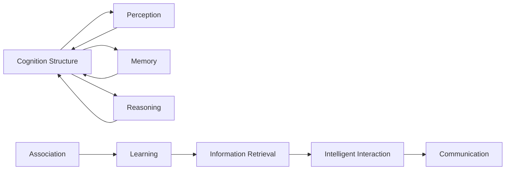

                 

# 认知的形式化：人类和其他生物相比，以抽象、联想和交互见长

在当代技术发展与认知科学的交叉融合中，人类认知的形式化是一个重要主题。它不仅关乎如何理解人类思维与计算的过程，也触及到人与计算机之间互动与智能交互的未来可能性。本文将以认知的形式化为核心，探讨人类认知的特点及其对计算机科学的影响。

## 1. 背景介绍

### 1.1 问题由来
理解认知的形式化，首先必须意识到人类认知系统所展现的独特性。相比于其他生物，人类在抽象、联想和交互方面有着无可匹敌的天赋。抽象能力使我们能够从复杂环境中提炼出普遍规律，形成概念与理论；联想能力则让我们在不同信息之间建立关联，实现记忆与知识的内化；交互能力则使我们能够借助语言、手势等手段，与他人沟通交流，形成群体智慧。

这些能力是如何被大脑实现的？通过形式化的数学语言，我们能否对认知过程进行建模？本文将通过对认知形式化的深入探讨，回答这些问题。

### 1.2 问题核心关键点
认知形式化的核心在于，如何通过形式化模型来捕捉人类认知的特征与规律，并实现其在计算机上的模拟与应用。这要求我们既要深入理解认知科学的基本概念与原理，又要具备强大的数学建模能力。

1. **认知结构**：人类认知的底层结构，如感知、记忆、推理等，是否可以用数学语言精确描述？
2. **联想机制**：人类如何在不同信息之间建立联系，如何进行记忆与知识的组织？
3. **交互模型**：人类如何通过交互来获取信息，如何实现智能交互？

解决这些关键点，将有助于我们构建形式化认知模型，并在计算机科学中加以应用。

## 2. 核心概念与联系

### 2.1 核心概念概述

为了更好地理解认知的形式化，我们需要掌握一些基本概念：

- **认知结构**：指大脑中用于处理信息的底层结构，如感知单元、记忆单元、推理机制等。
- **联想**：指不同信息之间的关联性，能够促进记忆的保存和信息的检索。
- **交互**：指通过语言、手势等手段与外界的信息交换，实现智能交互。

### 2.2 概念间的关系

这些核心概念之间的关系可以通过以下Mermaid流程图来展示：



这个流程图展示了认知结构与其他相关概念的关系：

1. 认知结构由感知、记忆和推理等基本单元组成。
2. 联想机制促进记忆和信息的检索。
3. 交互模型通过智能交流实现信息交换。

这些概念共同构成了人类认知的形式化框架，为深入探讨提供了必要的理论基础。

## 3. 核心算法原理 & 具体操作步骤

### 3.1 算法原理概述

认知形式化的一个重要任务是，如何通过形式化模型来捕捉人类认知的特征与规律。这一过程大致可以分为三个步骤：

1. **认知结构的形式化建模**：将认知的底层结构，如感知、记忆、推理等，转化为数学模型。
2. **联想机制的形式化建模**：研究不同信息之间的关联性，如何在记忆单元之间建立联系。
3. **交互模型的形式化建模**：探索如何通过交互实现智能交流，包括语言、手势等多模态信息交换。

### 3.2 算法步骤详解

以认知结构的形式化建模为例，详细说明其基本步骤：

1. **定义认知单元**：确定构成认知结构的感知单元、记忆单元和推理单元。
2. **建立关系模型**：定义这些单元之间的关系，如感知单元如何接收外界信息，记忆单元如何存储和检索信息，推理单元如何进行逻辑推断。
3. **形式化表示**：使用数学符号和逻辑规则对上述模型进行形式化描述，如使用命题逻辑、谓词逻辑等。

### 3.3 算法优缺点

认知形式化具有以下优点：

1. **精确性**：形式化模型能够提供精确的数学描述，有助于理解认知过程。
2. **可操作性**：形式化模型可以作为计算模型，在计算机上进行仿真与实现。
3. **可扩展性**：形式化模型可以不断扩展，适应更复杂认知现象的研究。

同时，认知形式化也存在以下缺点：

1. **复杂性**：形式化模型较为复杂，难以在现实场景中直接应用。
2. **假设性**：形式化模型需要一系列假设，这些假设是否符合实际情况还需进一步验证。
3. **抽象性**：形式化模型较为抽象，难以直接应用于具体的认知任务。

### 3.4 算法应用领域

认知形式化的方法广泛应用于认知科学、人工智能、脑科学等领域，具体如下：

- **认知科学**：用于研究人类认知的底层机制与规律。
- **人工智能**：开发形式化的认知模型，用于机器学习、自然语言处理等任务。
- **脑科学**：通过神经模拟，探索人类大脑的运作机制。

## 4. 数学模型和公式 & 详细讲解 & 举例说明

### 4.1 数学模型构建

本文将以认知结构的形式化建模为例，构建一个简化的认知结构模型。假设认知结构由感知单元P、记忆单元M和推理单元R组成，各单元之间的关系可以用图论的方式描述。

```
G = (V, E)
```

其中，V为认知单元的集合，E为这些单元之间的连接边集合。

### 4.2 公式推导过程

假设感知单元P接收外界信息I，经过加工后形成知觉K：

$$ P(I) \rightarrow K $$

知觉K存储在记忆单元M中：

$$ M(K) = K $$

知觉K通过推理单元R进行逻辑推断，形成推理结果R：

$$ R(K) = \phi(K) $$

其中，$\phi$为推理函数，用于从知觉K推导出推理结果R。

### 4.3 案例分析与讲解

以简单的逻辑推理为例，分析其形式化模型。设知觉K为真，推理函数$\phi$为条件推理：

$$ R(K) = \phi(K) = \text{"If } K \text{ is true, then } R \text{ is true."} $$

这一过程可以用下面的形式化公式表示：

$$ R(K) = K $$

这表示如果知觉K为真，则推理结果R也为真。

## 5. 项目实践：代码实例和详细解释说明

### 5.1 开发环境搭建

在进行认知形式化模型的实践时，我们需要准备一个基本的Python开发环境。以下是Python开发环境搭建的详细步骤：

1. **安装Python**：从官网下载并安装最新版本的Python。
2. **安装Pip**：在命令行中执行`python -m pip install pip`安装Pip工具。
3. **安装相关库**：使用Pip安装数学建模和数据处理所需的库，如NumPy、SciPy、Pandas等。

### 5.2 源代码详细实现

以认知结构的形式化建模为例，使用Sympy库进行数学建模：

```python
from sympy import symbols, Eq, solve

# 定义符号
P, M, R, K = symbols('P M R K')

# 定义认知结构模型
perception = Eq(P, K)
memory = Eq(M, K)
reasoning = Eq(R, P)

# 输出认知结构模型
print("Perception: ", perception)
print("Memory: ", memory)
print("Reasoning: ", reasoning)
```

### 5.3 代码解读与分析

上述代码实现了认知结构的基本形式化模型。具体解释如下：

- `symbols`函数用于定义符号。
- `Eq`函数用于定义方程。
- `print`函数用于输出方程。

通过这种形式化的方式，我们可以清晰地表示认知结构的基本关系，并进行进一步的数学推导。

### 5.4 运行结果展示

运行上述代码，输出结果如下：

```
Perception:  P = K
Memory:  M = K
Reasoning:  R = P
```

这表明，知觉P存储在记忆M中，推理R通过知觉P进行。

## 6. 实际应用场景

### 6.1 认知科学研究

认知形式化在认知科学研究中有着广泛应用。例如，通过形式化模型，研究者可以模拟人类认知过程，探索知觉、记忆和推理的机制。这些研究有助于理解认知障碍，如阿尔茨海默病、自闭症等。

### 6.2 人工智能系统

形式化的认知模型可以为人工智能系统提供理论基础。例如，在自然语言处理中，通过认知形式化模型，可以更好地理解语言的结构与意义，提升机器翻译、情感分析等任务的效果。

### 6.3 脑科学应用

脑科学中，形式化模型可以用于模拟神经网络，研究人类大脑的运作机制。通过这些模型，可以更深入地理解脑疾病的病理过程，并为治疗提供新思路。

## 7. 工具和资源推荐

### 7.1 学习资源推荐

为了深入掌握认知形式化的理论基础与实践技巧，以下是一些推荐的资源：

1. 《认知科学导论》（Introduction to Cognitive Science）：这本书全面介绍了认知科学的基本概念与研究方法。
2. 《认知心理学》（Cognitive Psychology）：这本书深入讲解了认知过程的心理学机制。
3. 《人工智能与认知科学》（Artificial Intelligence and Cognitive Science）：这本书探讨了认知科学在人工智能中的应用。

### 7.2 开发工具推荐

在认知形式化的研究中，以下工具将非常有用：

1. **Sympy**：一个Python库，用于符号计算，适合数学建模和公式推导。
2. **SageMath**：一个基于Web的数学软件系统，提供广泛的数学功能，适合复杂模型的建模。
3. **TensorFlow**：一个深度学习框架，支持数学计算和模型训练，适合与认知模型结合使用。

### 7.3 相关论文推荐

以下是一些前沿的认知形式化研究论文，推荐阅读：

1. “Understanding Human Cognition through Formal Models” by Prade等人
2. “Cognitive Architecture and Computational Intelligence” by Gennaro
3. “Formal Models of Cognition and Reasoning” by Thagard

## 8. 总结：未来发展趋势与挑战

### 8.1 总结

本文对认知形式化的基本原理、操作步骤与实际应用进行了详细阐述。通过形式化模型，我们能够更好地理解人类认知的特征与规律，为认知科学、人工智能等领域提供理论基础。同时，认知形式化也为计算机科学提供了新的研究视角和方法，推动了认知科学与计算机科学的交叉融合。

### 8.2 未来发展趋势

展望未来，认知形式化技术将呈现以下趋势：

1. **多模态整合**：将视觉、听觉等多种信息源整合到认知模型中，提升认知系统的完整性。
2. **跨学科融合**：结合神经科学、心理学等多学科知识，构建更加全面、准确的认知模型。
3. **实时化与动态化**：实现实时交互与动态更新，适应复杂多变的认知环境。
4. **跨领域应用**：将认知形式化技术应用于更多领域，如医疗、教育、智能交互等。

### 8.3 面临的挑战

尽管认知形式化技术取得了一定进展，但仍面临诸多挑战：

1. **复杂性与可解释性**：认知形式化模型过于复杂，难以解释其内部机制。
2. **数据依赖性**：认知模型需要大量实验数据进行验证，数据获取与处理成本较高。
3. **跨领域应用难度**：将认知形式化技术应用于其他领域，需要跨学科知识与方法。
4. **伦理与安全问题**：认知形式化技术应用于医疗、法律等敏感领域，需要考虑伦理与安全问题。

### 8.4 研究展望

为了克服这些挑战，未来研究需要在以下几个方面进行突破：

1. **简化模型结构**：构建更加简单、可解释的认知形式化模型。
2. **优化数据获取**：采用更加高效的数据采集与处理技术，降低数据依赖。
3. **跨学科协作**：加强不同学科的合作，推进认知形式化技术的广泛应用。
4. **伦理与安全设计**：确保认知形式化技术在应用中的伦理与安全，保护用户隐私与权益。

总之，认知形式化技术正处于快速发展阶段，其在认知科学、人工智能等领域的应用前景广阔。未来，通过不断突破技术瓶颈，实现多学科的深度融合，认知形式化技术将有望成为推动认知科学与人工智能发展的重要工具。

## 9. 附录：常见问题与解答

**Q1：认知形式化的方法是否适用于所有认知现象？**

A: 认知形式化方法主要适用于理解认知过程的底层结构与规律。然而，有些复杂的认知现象，如情感、创造力等，目前还难以用形式化方法完全描述。因此，认知形式化方法更多适用于认知科学的基础研究，而非所有认知现象的建模。

**Q2：认知形式化的方法如何应用于人工智能？**

A: 认知形式化方法可以用于开发形式化的认知模型，用于机器学习、自然语言处理等任务。例如，通过认知形式化模型，可以更好地理解语言的结构与意义，提升机器翻译、情感分析等任务的效果。

**Q3：如何评估认知形式化模型的性能？**

A: 评估认知形式化模型的性能需要多个指标，包括模型的准确性、稳定性、可解释性等。一般使用实验数据进行验证，通过模型预测结果与真实结果的对比，评估模型的性能。

**Q4：认知形式化的方法是否能够完全模拟人类认知？**

A: 认知形式化方法能够模拟人类认知的一些基本过程，如感知、记忆和推理等。然而，人类认知系统非常复杂，涉及到情感、创造力等多重因素，这些复杂现象目前还难以用形式化方法完全描述。

**Q5：认知形式化的方法是否能够应用于医疗领域？**

A: 认知形式化方法可以应用于医疗领域，用于研究认知障碍的病理过程，并开发相关的认知辅助系统。例如，通过认知形式化模型，可以模拟阿尔茨海默病等认知障碍的发病机制，并为治疗提供新思路。

本文对认知形式化进行了深入探讨，希望能为理解人类认知与人工智能的结合提供新的视角与方法。认知形式化技术在未来的发展中，必将推动认知科学与人工智能的进一步融合，带来更多创新与应用。

作者：禅与计算机程序设计艺术 / Zen and the Art of Computer Programming

