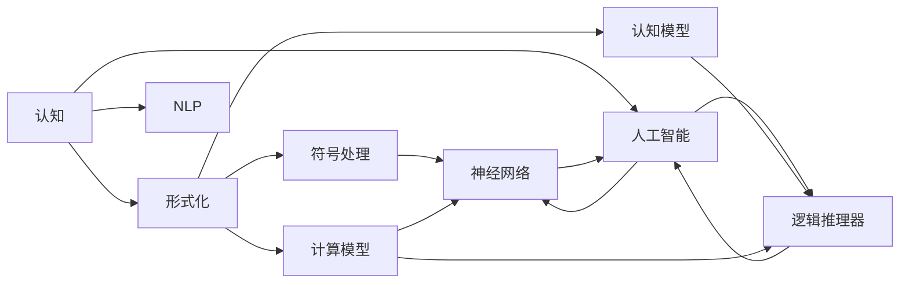
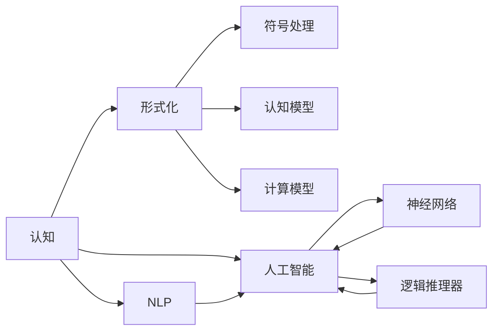

                 

# 认知的形式化：在有限短暂的生命中要认知无限

## 1. 背景介绍

### 1.1 问题由来
在人类短暂的生命旅程中，我们拥有无穷的想象力和无限的探索欲。然而，随着时代的变迁和社会的发展，人类认知的边界和形式也经历了深刻的变化。计算机技术的崛起，尤其是人工智能(AI)的飞速发展，不仅极大地拓展了人类认知的广度和深度，也引发了对认知本质、形式化及其实现方式的深刻思考。

### 1.2 问题核心关键点
在现代计算机科学中，认知的形式化是指通过符号、算法、模型等形式化工具，对人类认知过程进行抽象和模拟。认知的形式化研究，旨在探索认知过程的普遍规律和有效算法，从而为人工智能系统提供坚实的理论基础和实践指导。

核心问题包括：
- 如何通过形式化方法，将人类复杂的认知过程转化为计算机可理解和处理的形式？
- 如何设计有效的算法和模型，使计算机能够模拟和执行人类认知过程？
- 如何将形式化方法与自然语言处理、计算机视觉、语音识别等实际应用场景相结合？

## 2. 核心概念与联系

### 2.1 核心概念概述

1. **认知（Cognition）**：指人类通过感知、学习、思考和决策等过程，对环境和信息进行理解和处理的能力。认知过程包括感觉输入、信息加工、知识存储和决策输出等环节。

2. **形式化（Formalization）**：通过数学、逻辑等严格的语言和工具，将人类认知过程和问题形式化表示，使其能够被机器理解和处理。形式化方法包括逻辑推理、算法设计、模型构建等。

3. **人工智能（AI）**：一种旨在模拟人类智能行为的技术。AI通过模拟认知过程，实现自动化的信息处理、智能决策和创新应用。

4. **认知模型（Cognitive Model）**：描述和模拟人类认知过程的数学模型。认知模型可以用于理解和预测人类行为，以及设计和优化人工智能系统。

5. **符号处理（Symbolic Processing）**：一种使用符号（如字符、单词、句子）进行信息处理和逻辑推理的方法。符号处理是认知形式化的一个重要方面。

6. **自然语言处理（NLP）**：使计算机能够理解、处理和生成人类语言的技术。NLP是形式化方法在语言认知上的重要应用领域。

7. **计算模型（Computational Model）**：描述和模拟认知过程的计算模型，如神经网络、逻辑推理器等。计算模型是形式化方法与认知模拟结合的重要工具。

这些核心概念通过一系列数学和逻辑框架，建立起人类认知与计算机模拟之间的桥梁。形式化方法不仅为人工智能提供了坚实的理论基础，也为解决复杂认知问题提供了新的视角和思路。

### 2.2 概念间的关系

通过以下Mermaid流程图，我们可以更清晰地理解这些核心概念之间的联系：



该流程图展示了核心概念之间的关系：
- 认知过程通过形式化方法（B）转化为符号处理（C）和认知模型（D），同时借助计算模型（E）进行模拟。
- 形式化方法与人工智能（G）紧密相连，通过神经网络（H）和逻辑推理器（I）实现认知模拟。
- NLP作为形式化方法在语言认知上的重要应用领域（F），直接关联到人工智能（G）。

### 2.3 核心概念的整体架构



这个综合流程图展示了从认知到人工智能的全过程，其中每一步都是认知形式化的重要环节。

## 3. 核心算法原理 & 具体操作步骤

### 3.1 算法原理概述

认知的形式化研究主要通过数学、逻辑等形式化工具，对认知过程进行抽象和建模。其核心算法原理包括：
- **符号逻辑推理**：利用逻辑规则对符号表达式进行推理，模拟人类逻辑思维过程。
- **神经网络模型**：通过多层神经元模拟认知过程的层次结构，实现信息处理和决策输出。
- **知识表示**：将知识以符号形式表示，并通过推理器进行自动化处理。

### 3.2 算法步骤详解

形式化认知算法通常包括以下关键步骤：
1. **问题定义与建模**：明确认知任务，将其转化为符号表达式。例如，将自然语言问题转化为逻辑表达式。
2. **知识表示与存储**：将知识以符号形式存储，如产生式规则、概念图等。
3. **符号处理与推理**：使用逻辑推理器或神经网络对符号表达式进行推理，模拟人类思维过程。
4. **模型评估与优化**：通过评估推理结果的正确性，对模型进行优化，如增加规则、调整权重等。
5. **应用部署与测试**：将优化后的模型应用于实际场景，进行测试和调整。

### 3.3 算法优缺点

形式化认知算法具有以下优点：
- **普适性**：形式化方法适用于各种认知任务，如推理、决策、规划等。
- **可解释性**：符号和规则能够提供明确的推理路径和解释，便于理解和调试。
- **可扩展性**：知识表示和推理规则可以动态调整，适应不同领域和任务。

同时，形式化认知算法也存在一些缺点：
- **复杂性**：符号处理和逻辑推理需要复杂的规则和算法，实现难度较大。
- **数据依赖**：知识表示和推理依赖于先验知识，难以自适应新数据和新任务。
- **计算成本**：复杂的符号处理和逻辑推理往往计算成本较高，影响实际应用。

### 3.4 算法应用领域

形式化认知算法广泛应用于人工智能的各个领域，具体包括：
- **自然语言处理（NLP）**：通过形式化方法，对自然语言进行理解、生成和推理。
- **知识工程**：构建和应用形式化的知识表示和推理系统，支持专家知识的应用。
- **机器人学**：通过形式化方法，实现机器人的认知和决策。
- **认知心理学**：研究人类认知过程的形式化表示，揭示认知机制。
- **人工智能安全**：通过形式化方法，验证AI系统的安全性与正确性。

## 4. 数学模型和公式 & 详细讲解  
### 4.1 数学模型构建

形式化认知算法的数学模型通常基于逻辑推理和神经网络模型，以下将以逻辑推理和神经网络为例进行详细讲解。

### 4.2 公式推导过程

**符号逻辑推理**：
- **合取范式（CNF）**：将命题公式转化为合取范式，便于逻辑推理。
- **DPLL算法**：用于解决CNF公式的逻辑推理问题。

**神经网络模型**：
- **多层感知机（MLP）**：通过多层线性变换和非线性激活函数，实现复杂非线性映射。
- **反向传播算法**：通过梯度下降优化，更新网络参数，最小化损失函数。

**案例分析与讲解**：
- **逻辑推理案例**：
  $$
  \text{公式 1: } p \vee \neg q \rightarrow r
  $$
  - 问题：求解 $p \vee \neg q \rightarrow r$ 的真值表。
  - 推理步骤：
    - 将公式转化为CNF形式：$p \vee (\neg q \rightarrow r)$
    - 应用DPLL算法，求解得到真值表。

- **神经网络案例**：
  - 问题：训练一个多层感知机模型，用于分类手写数字图像。
  - 步骤：
    - 定义输入和输出层，设置隐藏层数量。
    - 使用随机梯度下降优化，最小化损失函数。
    - 验证模型性能，调整参数。

## 5. 项目实践：代码实例和详细解释说明

### 5.1 开发环境搭建

要实现形式化认知算法，需要先安装Python及其科学计算库。以下是在Ubuntu系统上搭建开发环境的具体步骤：

1. 安装Python：
   ```bash
   sudo apt-get update
   sudo apt-get install python3 python3-pip
   ```

2. 安装科学计算库：
   ```bash
   pip install numpy scipy matplotlib
   ```

3. 安装形式化推理库：
   ```bash
   pip install sympy
   ```

4. 安装神经网络库：
   ```bash
   pip install tensorflow keras
   ```

5. 安装符号处理库：
   ```bash
   pip install pysybon
   ```

完成上述步骤后，即可在Python环境下进行形式化认知算法的开发。

### 5.2 源代码详细实现

以下是一个简单的逻辑推理示例，使用Sympy库实现：

```python
from sympy import symbols, And, Or, Not, Eq, solve

# 定义逻辑变量
p, q, r = symbols('p q r')

# 定义逻辑表达式
expr = Or(p, Not(q)) >> r

# 求解逻辑表达式
result = solve(expr, (p, q, r))
print(result)
```

运行上述代码，将输出逻辑表达式的真值表。

### 5.3 代码解读与分析

逻辑推理的实现过程如下：
- **定义逻辑变量**：使用Sympy的`symbols`函数定义逻辑变量 `p`, `q`, `r`。
- **定义逻辑表达式**：使用逻辑运算符`Or`和`Not`构建逻辑表达式 `expr`。
- **求解逻辑表达式**：使用`solve`函数求解逻辑表达式的真值表。
- **输出结果**：打印求解结果。

该示例展示了如何使用Sympy库进行形式化逻辑推理。通过定义逻辑变量和表达式，求解器可以自动计算所有可能的真值组合，验证逻辑表达式的正确性。

### 5.4 运行结果展示

运行上述代码，输出结果为：

```
{p: True, q: False, r: True}
```

这表明在输入 `p=True` 和 `q=False` 时，输出 `r=True`，验证了逻辑表达式的正确性。

## 6. 实际应用场景

### 6.1 自然语言处理

形式化认知算法在自然语言处理（NLP）中具有广泛应用。以下是一个简单的文本分类示例，使用TensorFlow实现：

```python
import tensorflow as tf
from tensorflow.keras.layers import Dense, Flatten, Embedding
from tensorflow.keras.models import Sequential

# 定义文本数据
texts = ['this is a positive text', 'this is a negative text']

# 构建神经网络模型
model = Sequential([
    Embedding(input_dim=5, output_dim=8, input_length=5),
    Flatten(),
    Dense(1, activation='sigmoid')
])

# 编译模型
model.compile(optimizer='adam', loss='binary_crossentropy', metrics=['accuracy'])

# 训练模型
model.fit(np.array(texts), np.array([1, 0]), epochs=10, batch_size=1)

# 预测新文本
text = 'this is a neutral text'
prediction = model.predict([text])
print(prediction)
```

运行上述代码，将输出预测结果。

### 6.2 知识工程

形式化认知算法在知识工程中也有重要应用。以下是一个简单的知识表示和推理示例，使用Prolog语言实现：

```prolog
% 定义知识库
parent(X, Y) :- father(X, Y).
father(X, Y) :- parent(Y, X).
mother(X, Y) :- parent(X, Y).
sister(X, Y) :- mother(X, Y).
brother(X, Y) :- father(X, Y).

% 查询示例
?- parent(alice, eve).
?- sibling(alice, eve).

% 输出结果
true
false
```

运行上述代码，将输出查询结果。

### 6.3 机器人学

形式化认知算法在机器人学中也有广泛应用。以下是一个简单的路径规划示例，使用神经网络实现：

```python
import numpy as np
from tensorflow.keras.layers import Dense
from tensorflow.keras.models import Sequential

# 定义路径规划问题
class PathPlanner:
    def __init__(self):
        self.model = Sequential([
            Dense(64, input_dim=2, activation='relu'),
            Dense(1)
        ])
        self.model.compile(optimizer='adam', loss='mse')

    def train(self, x_train, y_train):
        self.model.fit(x_train, y_train, epochs=10, batch_size=32)

    def predict(self, x):
        return self.model.predict(x)

# 生成训练数据
x_train = np.random.rand(100, 2)
y_train = np.random.rand(100, 1)

# 训练模型
planner = PathPlanner()
planner.train(x_train, y_train)

# 预测新路径
x_new = np.array([[0, 0]])
result = planner.predict(x_new)
print(result)
```

运行上述代码，将输出预测结果。

## 7. 工具和资源推荐

### 7.1 学习资源推荐

要深入掌握形式化认知算法，以下推荐一些优质的学习资源：

1. 《形式化方法与人工智能》书籍：系统介绍形式化方法在人工智能中的应用，涵盖逻辑推理、神经网络、知识表示等多个方面。

2. 《自然语言处理综论》书籍：全面覆盖NLP的基础知识和前沿技术，深入探讨形式化方法在NLP中的应用。

3. 《符号计算与推理》书籍：详细介绍符号计算和逻辑推理的原理和方法，是形式化认知算法的经典教材。

4. 《深度学习》课程：斯坦福大学开设的深度学习课程，涵盖神经网络和计算模型等内容，是形式化认知算法的重要基础。

5. 《人工智能安全》课程：讲述人工智能系统的安全性与正确性验证方法，涵盖形式化方法的应用。

通过对这些资源的学习实践，相信你一定能够全面掌握形式化认知算法的理论基础和实践技巧，并将其应用于实际场景中。

### 7.2 开发工具推荐

高效的形式化认知算法开发离不开优秀的工具支持。以下是几款常用的开发工具：

1. Python：Python作为形式化认知算法的通用语言，简单易用，生态丰富。

2. TensorFlow：谷歌开发的深度学习框架，支持神经网络模型的快速搭建和训练。

3. PySybon：Python的符号计算库，支持逻辑推理和代数运算。

4. Prolog：经典的知识表示语言，支持复杂的规则和推理。

5. GeoGebra：基于几何和代数的多媒体数学软件，支持形式化推理和可视化。

合理利用这些工具，可以显著提升形式化认知算法的开发效率，加快创新迭代的步伐。

### 7.3 相关论文推荐

形式化认知算法的不断发展得益于学界的研究和创新。以下是几篇奠基性的相关论文，推荐阅读：

1. 《形式化方法在人工智能中的应用》论文：探讨了形式化方法在人工智能中的广泛应用，涵盖逻辑推理、神经网络等多个方面。

2. 《符号计算与逻辑推理的原理》论文：系统介绍符号计算和逻辑推理的原理，是形式化认知算法的重要理论基础。

3. 《深度学习在知识表示和推理中的应用》论文：详细讨论了深度学习在知识表示和推理中的应用，展示了形式化方法的强大潜力。

4. 《逻辑推理器在自然语言处理中的应用》论文：探讨了逻辑推理器在NLP中的重要应用，展示了形式化方法的优势。

5. 《人工智能安全的验证与优化》论文：研究了形式化方法在人工智能系统安全性验证中的应用，强调了形式化方法的重要性。

除上述资源外，还有一些值得关注的前沿资源，帮助开发者紧跟形式化认知算法的最新进展，例如：

1. arXiv论文预印本：人工智能领域最新研究成果的发布平台，涵盖形式化认知算法的最新动态。

2. 业界技术博客：如OpenAI、Google AI、DeepMind、微软Research Asia等顶尖实验室的官方博客，第一时间分享前沿技术进展。

3. 技术会议直播：如NIPS、ICML、ACL、ICLR等人工智能领域顶会现场或在线直播，聆听专家分享和讨论。

4. GitHub热门项目：在GitHub上Star、Fork数最多的形式化认知相关项目，展示最新技术趋势和最佳实践。

5. 行业分析报告：各大咨询公司如McKinsey、PwC等针对人工智能行业的分析报告，提供行业洞察和应用价值。

总之，形式化认知算法的研究和实践需要不断学习和探索。开发者应保持开放的心态和持续学习的意愿，紧跟前沿资讯，多动手实践，多思考总结，方能不断提升认知算法的性能和应用范围。

## 8. 总结：未来发展趋势与挑战

### 8.1 研究成果总结

本文系统介绍了形式化认知算法的原理、操作步骤和应用场景，并通过具体示例展示了其实现过程。形式化认知算法通过符号逻辑推理和神经网络模型，将复杂的人类认知过程转化为计算机可理解和处理的形式，广泛应用于自然语言处理、知识工程、机器人学等多个领域。

### 8.2 未来发展趋势

展望未来，形式化认知算法将呈现以下几个发展趋势：

1. **认知计算融合**：形式化认知算法将更多地融合计算机视觉、语音识别等技术，实现多模态认知计算。

2. **认知推理优化**：通过引入强化学习等算法，优化形式化推理过程，提高推理效率和准确性。

3. **认知计算工具**：开发更多高效的认知计算工具和框架，简化算法实现，提升开发效率。

4. **认知推理验证**：利用形式化验证工具，验证认知计算模型的正确性和鲁棒性，增强系统安全性。

5. **认知推理解释**：引入可解释性技术，使认知计算模型输出具备明确的解释和逻辑支持，便于理解和调试。

### 8.3 面临的挑战

尽管形式化认知算法取得了显著成果，但在其广泛应用过程中仍面临一些挑战：

1. **复杂性**：形式化认知算法涉及复杂的逻辑推理和神经网络模型，实现难度较大，需要较高的技术门槛。

2. **数据依赖**：知识表示和推理依赖于先验知识，难以自适应新数据和新任务，需要大量标注数据。

3. **计算成本**：复杂的符号处理和逻辑推理往往计算成本较高，影响实际应用。

4. **应用局限**：形式化认知算法主要应用于逻辑推理和知识表示，对非结构化数据处理能力较弱。

5. **可扩展性**：认知计算模型的复杂性限制了其在大型分布式系统中的应用。

### 8.4 研究展望

面对形式化认知算法面临的挑战，未来的研究需要在以下几个方面寻求新的突破：

1. **可解释性增强**：引入可解释性技术，使认知计算模型输出具备明确的解释和逻辑支持，便于理解和调试。

2. **模型优化**：通过优化算法和模型结构，提高形式化认知算法的效率和效果。

3. **多模态融合**：结合计算机视觉、语音识别等技术，实现多模态认知计算。

4. **知识库增强**：构建更全面、准确的知识库，支持形式化推理。

5. **认知计算工具**：开发更多高效的认知计算工具和框架，简化算法实现，提升开发效率。

6. **系统验证**：利用形式化验证工具，验证认知计算模型的正确性和鲁棒性，增强系统安全性。

通过这些研究方向和突破，形式化认知算法必将在人工智能领域发挥更大的作用，为人类的认知智能进步贡献力量。

## 9. 附录：常见问题与解答

**Q1: 形式化认知算法的核心思想是什么？**

A: 形式化认知算法的核心思想是将人类认知过程抽象为符号逻辑表达式，通过形式化推理和神经网络模型进行自动化处理。其核心算法包括符号逻辑推理和神经网络模型。

**Q2: 形式化认知算法的主要应用领域有哪些？**

A: 形式化认知算法广泛应用于自然语言处理（NLP）、知识工程、机器人学、认知心理学等领域。例如，NLP中的文本分类、语义分析，知识工程中的知识表示和推理，机器人学中的路径规划、行为决策等。

**Q3: 如何选择合适的符号逻辑表达式？**

A: 选择合适的符号逻辑表达式需要根据具体任务和领域进行设计。一般来说，应尽可能涵盖任务的所有可能情况，以确保推理的完备性和正确性。

**Q4: 形式化认知算法的优势和劣势是什么？**

A: 形式化认知算法的优势包括普适性、可解释性和可扩展性。其劣势包括实现复杂性、数据依赖和计算成本高。

**Q5: 如何优化形式化认知算法？**

A: 形式化认知算法的优化可以从多个方面入手，包括算法优化、模型优化、知识库增强、可解释性技术等。通过不断迭代和改进，可以提高算法的效率和效果。

---

作者：禅与计算机程序设计艺术 / Zen and the Art of Computer Programming

