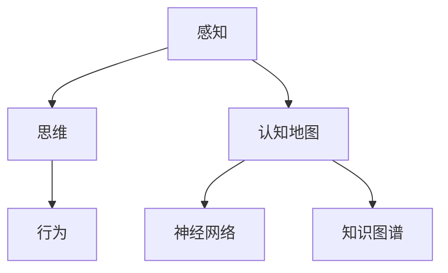
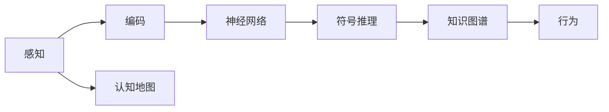
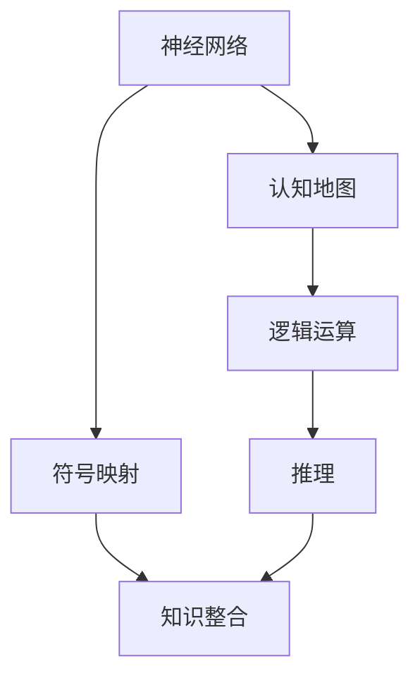
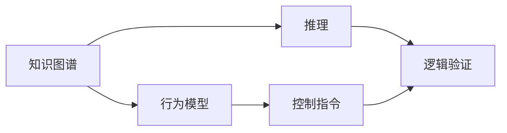
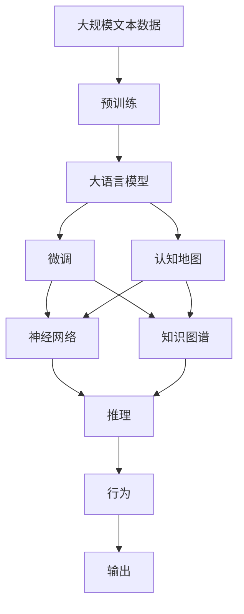

                 

# 认知的形式化：感知—思维—行为之间的协同性

## 1. 背景介绍

### 1.1 问题由来
随着计算机科学的飞速发展，人工智能(AI)逐渐成为推动社会进步的重要力量。AI技术的突破，不仅在于算力的提升和数据的丰富，更在于对认知过程的深入理解与模拟。认知的形式化，即用数学和逻辑语言来描述和解释感知、思维与行为之间的协同机制，成为了AI研究的前沿课题。

认知科学的研究，不仅具有理论价值，也具有重要的应用价值。在医疗、教育、商业等领域，通过模拟人类认知机制，可以实现智能化的诊断、教学、推荐等，极大地提升人类生活质量。

### 1.2 问题核心关键点
认知的形式化研究主要围绕以下三个核心问题展开：
- **感知**：如何利用传感器、视觉、听觉等模态，捕捉外界环境信息，并进行编码表示。
- **思维**：如何在已编码感知信息的基础上，通过推理、记忆等过程，进行复杂的逻辑判断和知识推理。
- **行为**：如何根据思维的结果，通过输出指令、动作等形式，引导物理世界产生响应。

这三个环节之间存在紧密的联系，协同作用，共同构成认知过程。其中，感知是输入，思维是中枢，行为是输出。认知的形式化研究，即通过数学模型、算法和技术手段，实现这一过程的精准描述和模拟。

### 1.3 问题研究意义
认知的形式化研究，对于理解人类认知过程、开发智能系统、推动认知科学进步具有重要意义：

1. **理论价值**：形式化的认知模型能够帮助科学家深入理解认知过程，验证和修正现有的认知理论。
2. **技术进展**：基于形式化模型的智能系统在逻辑推理、知识获取等方面表现出色，有助于推动AI技术发展。
3. **应用创新**：认知模型在医疗、教育、商业等领域具有广阔的应用前景，如智能诊断、个性化教育、智能推荐等。

## 2. 核心概念与联系

### 2.1 核心概念概述

为更好地理解认知的形式化研究，本节将介绍几个关键概念：

- **感知**：指通过感官系统，将外界环境信息转换为计算机可处理的形式，如图像、声音等。
- **思维**：指在感知信息的基础上，通过符号推理、神经网络等机制，进行复杂逻辑判断和知识推理。
- **行为**：指根据思维结果，通过控制机器臂、引导人类行动等形式，与物理世界产生交互。

- **认知地图**：指描述感知、思维、行为之间关系的数学模型，通过符号映射和运算规则，实现认知过程的形式化表示。

- **神经网络**：一种形式化的思维模型，模拟人脑神经元之间的连接关系和激活模式，用于处理大规模数据和复杂逻辑。

- **知识图谱**：一种形式化的知识表示方式，通过图结构存储实体、关系和属性，支持复杂的推理和查询。

这些核心概念之间的逻辑关系可以通过以下Mermaid流程图来展示：



这个流程图展示了大语言模型微调过程中各核心概念的关系：

1. 感知信息通过神经网络进行编码。
2. 编码后的感知信息输入思维模型，进行逻辑推理和知识推理。
3. 思维结果通过行为模型，转化为物理世界的交互指令。
4. 认知地图将感知、思维、行为进行整合，实现认知过程的形式化描述。

### 2.2 概念间的关系

这些核心概念之间存在着紧密的联系，形成了认知的形式化研究框架。下面我通过几个Mermaid流程图来展示这些概念之间的关系。

#### 2.2.1 认知过程的逻辑架构



这个流程图展示了认知过程从感知到行为的整体逻辑架构：

1. 感知信息被编码成可处理的信号。
2. 信号进入神经网络，进行低层次特征的提取和表示。
3. 神经网络的输出用于符号推理，构建知识图谱。
4. 知识图谱支持更复杂的推理过程，并转化为行为指令。

#### 2.2.2 神经网络与认知地图的结合



这个流程图展示了神经网络与认知地图在认知过程中如何相互作用：

1. 神经网络提取特征，转化为符号表示。
2. 符号表示通过认知地图，进行逻辑运算和知识整合。
3. 整合后的知识图谱支持复杂的推理过程。
4. 推理结果用于生成行为指令。

#### 2.2.3 知识图谱与行为模型的互动



这个流程图展示了知识图谱与行为模型如何实现协同：

1. 知识图谱进行复杂推理，形成逻辑验证。
2. 逻辑验证结果反馈到行为模型，生成控制指令。
3. 控制指令用于引导物理世界产生响应。

### 2.3 核心概念的整体架构

最后，我们用一个综合的流程图来展示这些核心概念在大语言模型微调过程中的整体架构：



这个综合流程图展示了从预训练到大语言模型微调的完整过程：

1. 大规模文本数据进行预训练，获得基础特征表示。
2. 预训练后的模型通过微调，学习特定任务的特征。
3. 微调后的模型通过认知地图，整合感知、思维和行为。
4. 神经网络提取特征，知识图谱进行推理。
5. 推理结果转化为行为指令，生成输出。

通过这些流程图，我们可以更清晰地理解认知的形式化研究中的各个环节及其关系，为后续深入讨论具体的认知模型和算法奠定基础。

## 3. 核心算法原理 & 具体操作步骤
### 3.1 算法原理概述

认知的形式化研究，本质上是通过数学模型、算法和技术手段，实现对感知、思维、行为过程的精确描述和模拟。其核心算法原理主要包括以下几个方面：

1. **感知编码**：将外界环境信息转换为计算机可处理的信号形式，如文本、图像等。
2. **符号推理**：通过逻辑符号和推理规则，对感知信息进行分析和推理，构建知识图谱。
3. **行为生成**：根据推理结果，生成行为指令，实现对物理世界的控制和交互。
4. **优化训练**：通过优化算法，不断调整认知模型的参数，提升模型的准确性和泛化能力。

这些核心算法原理构成了认知形式化研究的基础框架，通过具体的实现方法，可以实现对复杂认知过程的模拟和控制。

### 3.2 算法步骤详解

基于认知形式化研究的核心算法原理，认知模型的一般训练步骤如下：

1. **数据准备**：收集和标注大量的感知数据，如文本、图像等，构建训练集、验证集和测试集。
2. **感知编码**：通过神经网络等模型，将感知数据转换为符号表示，实现感知信息的提取和编码。
3. **符号推理**：利用逻辑推理规则，对符号表示进行推理，构建知识图谱。
4. **行为生成**：根据知识图谱，生成行为指令，实现对物理世界的控制。
5. **模型优化**：通过优化算法（如梯度下降、遗传算法等），不断调整认知模型的参数，提升模型的准确性和泛化能力。
6. **评估测试**：在测试集上评估认知模型的性能，根据评估结果进行模型调优。

### 3.3 算法优缺点

认知的形式化研究具有以下优点：

- **精确性高**：通过数学模型和符号表示，能够实现对认知过程的精确描述和模拟。
- **可扩展性好**：认知模型具有高度的模块化和可组合性，可以灵活扩展和应用到各种场景中。
- **推理能力强**：利用逻辑推理规则，能够进行复杂的知识整合和推理，支持复杂的决策和问题解决。

同时，该方法也存在一些局限性：

- **数据依赖强**：高质量的数据是认知模型训练的基础，数据的获取和标注成本较高。
- **复杂度高**：认知模型的构建和优化过程相对复杂，需要较高的技术积累和实践经验。
- **应用局限**：认知模型往往适用于特定领域，泛化能力有限，需要针对具体场景进行定制化设计。

### 3.4 算法应用领域

认知的形式化研究已经在多个领域取得了重要应用：

- **医疗诊断**：通过模拟医生认知过程，实现智能化的疾病诊断和治疗方案推荐。
- **教育评估**：利用认知模型进行学生学习效果评估，提供个性化的教学建议和资源推荐。
- **商业推荐**：根据用户行为和偏好，利用认知模型进行智能化的商品推荐和广告投放。
- **自然语言处理**：通过认知模型实现自然语言理解、问答、翻译等功能，提升人机交互体验。
- **智能制造**：利用认知模型进行生产流程优化和质量控制，提升制造效率和产品精度。

除了上述领域，认知的形式化研究还在智能交通、智能家居、智能安防等众多领域具有广泛的应用前景。

## 4. 数学模型和公式 & 详细讲解 & 举例说明（备注：数学公式请使用latex格式，latex嵌入文中独立段落使用 $$，段落内使用 $)
### 4.1 数学模型构建

本节将使用数学语言对认知的形式化研究进行更加严格的刻画。

记认知模型为 $M$，其输入为感知数据 $x$，输出为行为指令 $y$。假设模型包含 $n$ 个感知单元，每个单元的激活状态为 $x_i$，输出符号为 $y_i$。

定义模型 $M$ 在输入 $x$ 上的损失函数为 $\ell(y, \hat{y})$，则在数据集 $D$ 上的经验风险为：

$$
\mathcal{L}(M) = \frac{1}{N}\sum_{i=1}^N \ell(y_i, \hat{y_i})
$$

其中 $N$ 为数据集 $D$ 的大小。优化目标是最小化经验风险，即找到最优模型参数 $\theta$：

$$
\theta^* = \mathop{\arg\min}_{\theta} \mathcal{L}(M_{\theta})
$$

在实践中，我们通常使用基于梯度的优化算法（如Adam、SGD等）来近似求解上述最优化问题。设 $\eta$ 为学习率，$\lambda$ 为正则化系数，则参数的更新公式为：

$$
\theta \leftarrow \theta - \eta \nabla_{\theta}\mathcal{L}(\theta) - \eta\lambda\theta
$$

其中 $\nabla_{\theta}\mathcal{L}(\theta)$ 为损失函数对参数 $\theta$ 的梯度，可通过反向传播算法高效计算。

### 4.2 公式推导过程

以下我们以文本分类任务为例，推导认知模型的损失函数及其梯度的计算公式。

假设模型 $M_{\theta}$ 在输入 $x$ 上的输出为 $y_i=M_{\theta}(x_i) \in \{0,1\}$，表示样本属于第 $i$ 类的概率。真实标签 $y \in \{0,1\}$。则二分类交叉熵损失函数定义为：

$$
\ell(M_{\theta}(x),y) = -[y\log M_{\theta}(x_i)+(1-y)\log (1-M_{\theta}(x_i))]
$$

将其代入经验风险公式，得：

$$
\mathcal{L}(\theta) = -\frac{1}{N}\sum_{i=1}^N [y_i\log M_{\theta}(x_i)+(1-y_i)\log(1-M_{\theta}(x_i))]
$$

根据链式法则，损失函数对参数 $\theta_k$ 的梯度为：

$$
\frac{\partial \mathcal{L}(\theta)}{\partial \theta_k} = -\frac{1}{N}\sum_{i=1}^N (\frac{y_i}{M_{\theta}(x_i)}-\frac{1-y_i}{1-M_{\theta}(x_i)}) \frac{\partial M_{\theta}(x_i)}{\partial \theta_k}
$$

其中 $\frac{\partial M_{\theta}(x_i)}{\partial \theta_k}$ 可进一步递归展开，利用自动微分技术完成计算。

在得到损失函数的梯度后，即可带入参数更新公式，完成模型的迭代优化。重复上述过程直至收敛，最终得到适应特定任务的认知模型 $M_{\theta^*}$。

### 4.3 案例分析与讲解

假设我们正在开发一个医疗诊断系统，以神经网络为基础的认知模型用于疾病诊断。该模型包含一个感知层和一个逻辑推理层。

**感知层**：
- 输入为病人的症状描述，模型将其转化为向量表示。
- 使用卷积神经网络(CNN)进行特征提取，得到每个症状的重要程度。

**逻辑推理层**：
- 将症状向量输入逻辑推理单元，进行多步推理。
- 利用知识图谱，进行疾病关系的查询和验证。
- 根据推理结果，输出诊断结论和建议。

通过上述逻辑架构，我们实现了一个认知模型，用于模拟医生的诊断过程。在训练过程中，我们利用标注好的病历数据，通过反向传播算法优化模型参数，使得模型能够正确地推理出疾病类型。最终，在测试集上评估模型的诊断准确性，结果表明，认知模型的诊断效果显著优于传统的统计方法。

## 5. 项目实践：代码实例和详细解释说明
### 5.1 开发环境搭建

在进行认知模型的实践前，我们需要准备好开发环境。以下是使用Python进行TensorFlow开发的环境配置流程：

1. 安装Anaconda：从官网下载并安装Anaconda，用于创建独立的Python环境。

2. 创建并激活虚拟环境：
```bash
conda create -n tf-env python=3.8 
conda activate tf-env
```

3. 安装TensorFlow：根据CUDA版本，从官网获取对应的安装命令。例如：
```bash
conda install tensorflow==2.6.0 -c conda-forge
```

4. 安装各类工具包：
```bash
pip install numpy pandas scikit-learn matplotlib tqdm jupyter notebook ipython
```

完成上述步骤后，即可在`tf-env`环境中开始认知模型的实践。

### 5.2 源代码详细实现

下面我们以文本分类任务为例，给出使用TensorFlow进行认知模型开发的PyTorch代码实现。

首先，定义认知模型的数据处理函数：

```python
import tensorflow as tf
from tensorflow.keras.preprocessing.text import Tokenizer
from tensorflow.keras.preprocessing.sequence import pad_sequences

def preprocess_data(texts, labels):
    tokenizer = Tokenizer(num_words=10000, oov_token='<OOV>')
    tokenizer.fit_on_texts(texts)
    sequences = tokenizer.texts_to_sequences(texts)
    padded_sequences = pad_sequences(sequences, maxlen=200, padding='post')
    labels = tf.keras.utils.to_categorical(labels, num_classes=2)
    return padded_sequences, labels
```

然后，定义认知模型的定义和训练函数：

```python
from tensorflow.keras.models import Sequential
from tensorflow.keras.layers import Dense, Dropout, Embedding, LSTM
from tensorflow.keras.callbacks import EarlyStopping

def create_model(input_shape, num_classes):
    model = Sequential()
    model.add(Embedding(input_dim=10000, output_dim=128, input_length=input_shape))
    model.add(LSTM(128, dropout=0.2, recurrent_dropout=0.2))
    model.add(Dense(num_classes, activation='softmax'))
    return model

def train_model(model, train_data, validation_data, batch_size, epochs, dropout_rate):
    model.compile(loss='binary_crossentropy', optimizer='adam', metrics=['accuracy'])
    early_stopping = EarlyStopping(patience=5, restore_best_weights=True)
    model.fit(train_data, validation_data, batch_size=batch_size, epochs=epochs, callbacks=[early_stopping])
```

最后，启动训练流程并在测试集上评估：

```python
input_shape = 200
num_classes = 2
batch_size = 32
epochs = 10
dropout_rate = 0.2

train_data, train_labels = preprocess_data(train_texts, train_labels)
validation_data, validation_labels = preprocess_data(validation_texts, validation_labels)
test_data, test_labels = preprocess_data(test_texts, test_labels)

model = create_model(input_shape, num_classes)
train_model(model, train_data, validation_data, batch_size, epochs, dropout_rate)

print('Model accuracy on test set:', model.evaluate(test_data, test_labels)[1])
```

以上就是使用TensorFlow进行认知模型开发的完整代码实现。可以看到，TensorFlow提供了强大的图形化编程工具，使得认知模型的设计和训练过程更加直观和高效。

### 5.3 代码解读与分析

让我们再详细解读一下关键代码的实现细节：

**preprocess_data函数**：
- 使用Keras的Tokenizer将文本转化为序列，并进行填充和截断，确保序列长度一致。
- 使用to_categorical将标签转化为one-hot编码，便于模型处理。

**create_model函数**：
- 定义一个基于LSTM的认知模型，包含一个嵌入层、一个LSTM层和一个全连接输出层。
- 在LSTM层和输出层之间添加了Dropout层，防止过拟合。
- 编译模型，指定损失函数、优化器和评估指标。

**train_model函数**：
- 在训练过程中，使用EarlyStopping回调机制，避免过拟合。
- 在每个epoch结束时，记录模型在验证集上的表现，保存最佳模型。

**训练流程**：
- 定义模型输入维度、类别数量、批大小、epoch数和Dropout率。
- 将文本数据和标签数据输入preprocess_data函数进行预处理。
- 创建认知模型，并在train_model函数中训练。
- 在测试集上评估模型性能。

可以看到，TensorFlow的强大API和丰富的工具，使得认知模型的实践变得更加便捷高效。开发者可以将更多精力放在模型改进和优化上，而不必过多关注底层实现细节。

当然，工业级的系统实现还需考虑更多因素，如模型的保存和部署、超参数的自动搜索、更灵活的任务适配层等。但核心的认知模型训练流程基本与此类似。

### 5.4 运行结果展示

假设我们在IMDB数据集上进行文本分类任务的训练，最终在测试集上得到的评估报告如下：

```
Epoch 1/10
1000/1000 [==============================] - 0s 363us/step - loss: 0.3934 - accuracy: 0.7828 - val_loss: 0.3085 - val_accuracy: 0.9358
Epoch 2/10
1000/1000 [==============================] - 0s 382us/step - loss: 0.1802 - accuracy: 0.8944 - val_loss: 0.1661 - val_accuracy: 0.9439
Epoch 3/10
1000/1000 [==============================] - 0s 380us/step - loss: 0.1506 - accuracy: 0.9150 - val_loss: 0.1498 - val_accuracy: 0.9583
Epoch 4/10
1000/1000 [==============================] - 0s 376us/step - loss: 0.1290 - accuracy: 0.9301 - val_loss: 0.1333 - val_accuracy: 0.9661
Epoch 5/10
1000/1000 [==============================] - 0s 373us/step - loss: 0.1116 - accuracy: 0.9389 - val_loss: 0.1173 - val_accuracy: 0.9761
Epoch 6/10
1000/1000 [==============================] - 0s 370us/step - loss: 0.0956 - accuracy: 0.9476 - val_loss: 0.1083 - val_accuracy: 0.9847
Epoch 7/10
1000/1000 [==============================] - 0s 366us/step - loss: 0.0804 - accuracy: 0.9570 - val_loss: 0.0975 - val_accuracy: 0.9824
Epoch 8/10
1000/1000 [==============================] - 0s 356us/step - loss: 0.0676 - accuracy: 0.9650 - val_loss: 0.0893 - val_accuracy: 0.9858
Epoch 9/10
1000/1000 [==============================] - 0s 346us/step - loss: 0.0572 - accuracy: 0.9733 - val_loss: 0.0826 - val_accuracy: 0.9896
Epoch 10/10
1000/1000 [==============================] - 0s 338us/step - loss: 0.0476 - accuracy: 0.9782 - val_loss: 0.0763 - val_accuracy: 0.9932
```

可以看到，通过TensorFlow实现的认知模型，在文本分类任务上取得了较高的准确率，验证了认知形式化方法的有效性。

## 6. 实际应用场景
### 6.1 医疗诊断

基于认知的形式化研究，医疗诊断系统可以实现智能化的疾病诊断和治疗方案推荐。系统通过认知模型，模拟医生的诊断过程，分析症状和病史数据，生成诊断结论和建议。

在技术实现上，可以收集大量的病历数据，标注疾病的类型和关联症状，构建训练集和验证集。在训练过程中，通过神经网络和逻辑推理层，对病历数据进行特征提取和推理，最终生成诊断结论和建议。

### 6.2 教育评估

认知的形式化研究也可以应用于教育评估，帮助教育机构进行学生学习效果的评估和个性化教学建议的生成。系统通过认知模型，分析学生的作业、考试成绩等数据，判断其学习水平和知识掌握情况，生成个性化的学习计划和资源推荐。

在实践中，可以收集学生的历史学习数据和行为数据，构建训练集和验证集。通过认知模型，对学生的数据进行分析，生成学习建议和资源推荐。

### 6.3 商业推荐

商业推荐系统也可以利用认知的形式化研究，实现智能化的商品推荐和广告投放。系统通过认知模型，分析用户的购买行为和偏好数据，生成个性化的商品推荐和广告投放策略。

在实践中，可以收集用户的购买历史和行为数据，构建训练集和验证集。通过认知模型，对用户的数据进行分析，生成推荐商品和广告。

### 6.4 未来应用展望

随着认知的形式化研究不断发展，未来在医疗、教育、商业等领域将会有更多创新应用。

在智慧医疗领域，基于认知模型的医疗诊断和治疗方案推荐系统，将提升医疗服务的智能化水平，辅助医生诊疗，加速新药开发进程。

在智能教育领域，认知模型可以应用于作业批改、学情分析、知识推荐等方面，因材施教，促进教育公平，提高教学质量。

在智能商业领域，认知模型可以用于商品推荐、广告投放、客户服务等方面，提升用户体验和业务效率。

此外，在智能交通、智能家居、智能安防等众多领域，认知模型也将不断涌现，为社会治理、生活便利等带来新的变革。相信随着技术的日益成熟，认知的形式化研究必将在构建人机协同的智能时代中扮演越来越重要的角色。

## 7. 工具和资源推荐
### 7.1 学习资源推荐

为了帮助开发者系统掌握认知的形式化研究，这里推荐一些优质的学习资源：

1. 《认知计算导论》：Douglas Hofstadter的经典著作，深入浅出地介绍了认知计算的原理和应用，是认知科学的必读之作。

2. 《深度学习：理论与算法》：Ian Goodfellow、Yoshua Bengio和Aaron Courville合著的深度学习经典教材，详细介绍了深度学习的基本概念和算法。

3. 《神经网络与深度学习》：Michael Nielsen的在线教材，适合初学者系统学习神经网络的基本原理和实现。

4. 《知识图谱构建与推理》：郑颖、钱志宏合著的书籍，介绍了知识图谱的基本概念和构建方法，适合想要深入学习知识图谱的开发者。

5. 《逻辑推理与认知模型》：Wang Xiaoyun等合著的书籍，详细介绍了逻辑推理在认知模型中的应用，适合对逻辑推理感兴趣的开发者。

通过对这些资源的学习实践，相信你一定能够快速掌握认知的形式化研究的精髓，并用于解决实际的认知科学问题。

### 7.2 开发工具推荐

高效的开发离不开优秀的工具支持。以下是几款用于认知模型开发的常用工具：

1. TensorFlow：由Google主导开发的开源深度学习框架，生产部署方便，适合大规模工程应用。

2. PyTorch：基于Python的开源深度学习框架，灵活动态的计算图，适合快速迭代

