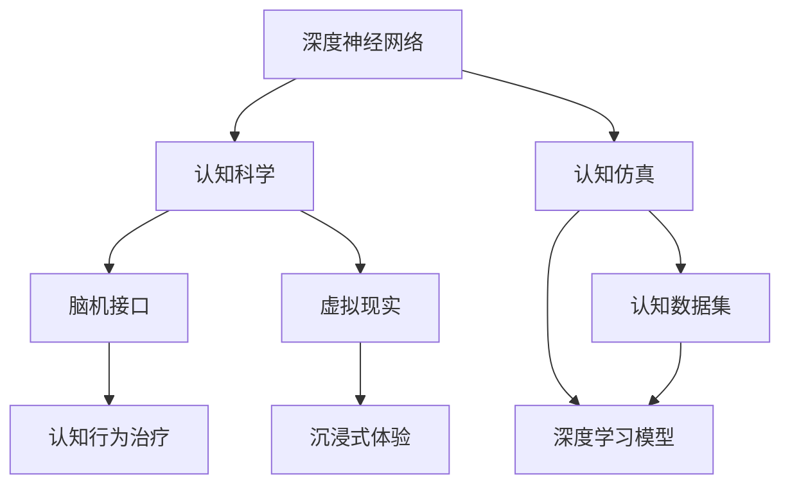
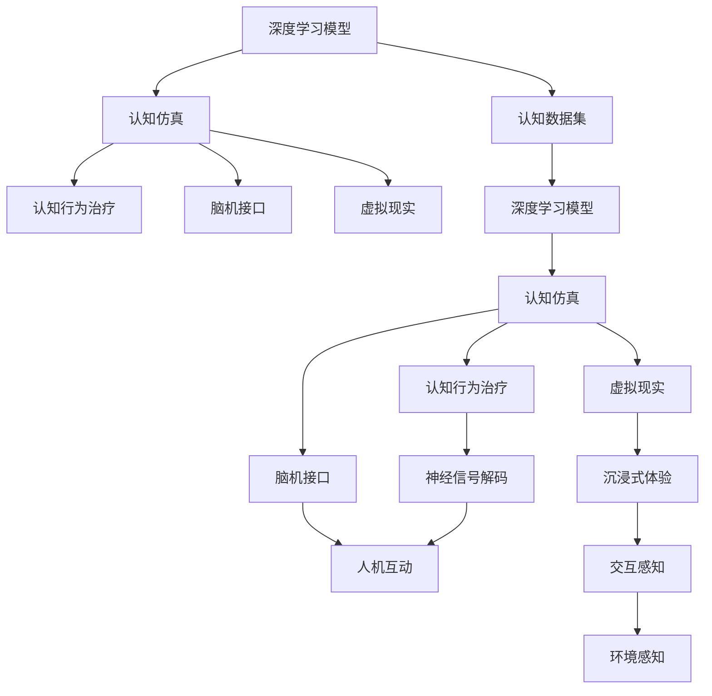

                 

# 认知过程中的深刻化趋势

> 关键词：认知科学,神经网络,深度学习,人工智能,认知仿真

## 1. 背景介绍

### 1.1 问题由来

认知过程是指人类大脑处理信息、做出决策的心理过程。这一过程既复杂又深刻，涉及知觉、记忆、思维、情感等多个层面。长期以来，学术界试图通过心理学、神经科学、计算机科学等多种方法来理解、模拟和优化人类认知过程。近年来，随着深度学习技术的发展，认知科学和人工智能的交叉研究日益深入，借助深度神经网络对认知过程进行建模和仿真成为新的热门方向。

深度学习是一种基于人工神经网络的机器学习技术，通过多层次的非线性变换对复杂数据进行特征提取和分类。这种技术在图像识别、语音识别、自然语言处理等领域取得了巨大的成功。借助深度神经网络，认知科学研究人员希望模拟人类大脑的认知过程，从而更好地理解认知机制，并应用于诸如脑机接口、认知行为治疗、虚拟现实等领域。

### 1.2 问题核心关键点

认知过程中的深刻化趋势主要体现在以下几个方面：

- **认知仿真**：通过深度学习技术模拟人类大脑的认知过程，为认知科学研究提供新视角和新工具。
- **神经网络结构**：不断探索和改进深度神经网络的架构，以更好地捕捉和模拟人类大脑的复杂认知功能。
- **认知数据集**：收集和构建大规模的认知数据集，为深度学习模型的训练和评估提供支持。
- **跨领域融合**：将认知科学与人工智能技术相结合，推动认知仿真在脑机接口、虚拟现实、认知行为治疗等领域的广泛应用。

### 1.3 问题研究意义

理解认知过程中的深刻化趋势对于推动人工智能技术的进步具有重要意义：

- **提升认知科学水平**：通过深度学习技术模拟人类认知过程，可以深化对认知机制的理解，推动认知科学的发展。
- **加速人工智能应用**：深度学习在认知仿真中的应用，可以加速人工智能技术在脑机接口、虚拟现实等领域的落地。
- **推动医学创新**：认知仿真技术在认知行为治疗中的应用，有望为精神障碍患者提供新的治疗手段。
- **促进虚拟现实发展**：通过认知仿真，可以构建更加真实、自然的虚拟环境，推动虚拟现实技术的进步。

## 2. 核心概念与联系

### 2.1 核心概念概述

为更好地理解认知过程中的深刻化趋势，本节将介绍几个关键概念：

- **深度神经网络**：一种基于多层非线性变换的机器学习技术，能够处理复杂数据和关系，广泛应用于图像识别、自然语言处理等领域。
- **认知科学**：研究人类认知过程的科学，包括知觉、记忆、思维、情感等多个层面。
- **认知仿真**：使用深度学习技术模拟人类大脑的认知过程，为认知科学研究提供新方法和新工具。
- **脑机接口**：通过神经信号与计算机交互的技术，实现人机互动。
- **虚拟现实**：通过计算机生成的虚拟环境，提供沉浸式的用户体验。

这些概念之间的关系可以通过以下Mermaid流程图来展示：



这个流程图展示了深度学习、认知科学、认知仿真、脑机接口和虚拟现实之间的逻辑关系：

1. 深度学习技术为认知仿真提供了强有力的工具。
2. 认知仿真有助于理解认知科学，推动认知行为治疗的发展。
3. 认知仿真和深度学习模型可应用于脑机接口和虚拟现实。
4. 脑机接口和虚拟现实为用户提供了沉浸式体验，进一步推动认知仿真的应用。

### 2.2 概念间的关系

这些核心概念之间存在着紧密的联系，形成了认知过程模拟和应用生态系统。以下通过几个Mermaid流程图来展示这些概念之间的关系。

#### 2.2.1 认知过程的模拟


这个流程图展示了认知过程模拟的基本流程：

1. 收集认知数据集。
2. 训练深度学习模型，模拟认知过程。
3. 应用认知仿真技术，理解认知行为。

#### 2.2.2 认知仿真与脑机接口


这个流程图展示了认知仿真与脑机接口的结合：

1. 通过认知仿真技术模拟认知过程。
2. 解码神经信号，实现人机互动。

#### 2.2.3 认知仿真与虚拟现实


这个流程图展示了认知仿真与虚拟现实的融合：

1. 通过认知仿真技术构建虚拟环境。
2. 提供沉浸式体验，增强环境感知和交互感知。

### 2.3 核心概念的整体架构

最后，我们用一个综合的流程图来展示这些核心概念在大语言模型微调过程中的整体架构：



这个综合流程图展示了从深度学习模型到认知仿真的整个架构：

1. 深度学习模型通过认知仿真模拟认知过程。
2. 认知仿真技术推动认知行为治疗和脑机接口的发展。
3. 虚拟现实提供沉浸式体验，进一步增强认知仿真和脑机接口的应用。

## 3. 核心算法原理 & 具体操作步骤
### 3.1 算法原理概述

认知过程中的深刻化趋势主要通过深度神经网络实现。深度神经网络通过多层非线性变换，模拟人类大脑的认知过程，包括感知、记忆、学习、推理等环节。以视觉识别任务为例，深度神经网络通过卷积层提取图像特征，通过池化层降低维度，通过全连接层进行分类，从而实现对图像的高效处理和识别。

认知过程的模拟涉及以下几个关键步骤：

1. **数据收集与预处理**：收集大规模的认知数据集，并进行预处理，包括数据清洗、标准化等。
2. **模型训练与调参**：使用深度神经网络对数据进行训练，优化模型参数，以获得最优的识别性能。
3. **仿真与测试**：通过训练好的模型对新数据进行仿真和测试，评估模型的准确性和鲁棒性。
4. **应用与优化**：将仿真结果应用于脑机接口、虚拟现实等领域，并不断优化，以提升用户体验。

### 3.2 算法步骤详解

以下详细解释认知过程中深刻化趋势的具体操作步骤：

**Step 1: 数据收集与预处理**

认知数据集通常包括脑电图(EEG)、功能性磁共振成像(fMRI)、神经元活动记录等。数据预处理包括去除噪音、归一化、平滑等步骤。以视觉识别任务为例，数据预处理包括图像增强、裁剪、归一化等步骤，以提升模型的鲁棒性。

**Step 2: 模型训练与调参**

使用深度神经网络对认知数据集进行训练，优化模型参数。常见的深度神经网络包括卷积神经网络(CNN)、循环神经网络(RNN)、长短期记忆网络(LSTM)等。通过交叉验证等技术进行模型调参，选择最优的模型结构和超参数。

**Step 3: 仿真与测试**

将训练好的模型应用于新的认知任务，并进行仿真和测试。使用测试集评估模型的准确性、鲁棒性和泛化性能。通过仿真结果反馈，进一步优化模型参数。

**Step 4: 应用与优化**

将仿真结果应用于脑机接口、虚拟现实等领域，并不断优化。在脑机接口中，通过解码神经信号，实现人机互动。在虚拟现实中，提供沉浸式体验，增强环境感知和交互感知。

### 3.3 算法优缺点

深度神经网络在认知过程模拟中的优点包括：

- **非线性处理能力**：深度神经网络通过多层非线性变换，能够处理复杂的关系和模式。
- **自适应学习能力**：深度神经网络能够自适应地学习新的数据和模式，适应不同的认知任务。
- **高效计算**：深度神经网络通过并行计算，实现高效的数据处理和分析。

然而，深度神经网络也存在一些缺点：

- **高计算成本**：深度神经网络需要大量的计算资源和时间进行训练和调参。
- **黑箱问题**：深度神经网络的黑箱性质使得其决策过程难以解释，增加了模型的复杂性和不确定性。
- **数据依赖**：深度神经网络的性能依赖于大规模、高质量的数据集，缺乏足够的认知数据集可能导致性能下降。

### 3.4 算法应用领域

深度神经网络在认知过程中深刻化趋势的应用领域包括：

- **脑机接口**：通过解码神经信号，实现人机互动，用于认知行为治疗、智能助手等。
- **虚拟现实**：通过认知仿真，提供沉浸式体验，用于游戏、培训、教育等领域。
- **认知行为治疗**：通过认知仿真，模拟认知过程，用于精神障碍患者的治疗。
- **认知科学研究**：通过认知仿真，理解认知机制，推动认知科学的发展。
- **认知仿真技术**：用于教育、娱乐、训练等场景，提供真实的认知体验。

## 4. 数学模型和公式 & 详细讲解 & 举例说明

### 4.1 数学模型构建

认知过程模拟的数学模型通常涉及神经元模型、决策模型、记忆模型等多个层次。以视觉识别任务为例，认知过程模拟的数学模型如下：

1. **神经元模型**：模拟单个神经元的活动，使用激活函数$f(x)$表示神经元的输出，如sigmoid函数、ReLU函数等。

2. **决策模型**：模拟神经元之间的连接和交互，使用权重矩阵$W$和偏置向量$b$表示神经元之间的连接关系，使用激活函数$f(x)$计算输出。

3. **记忆模型**：模拟神经元之间的长期记忆，使用LSTM网络等模型实现。

### 4.2 公式推导过程

以下以视觉识别任务为例，推导深度神经网络的输出公式：

假设输入图像为$x$，神经网络的输出为$y$，神经元模型的激活函数为$f(x)$，决策模型中的权重矩阵为$W$，偏置向量为$b$。则输出公式为：

$$
y = f(Wx + b)
$$

其中$W$和$b$为可训练参数，$x$为输入图像的特征向量。

在认知过程中，深度神经网络通过多层非线性变换，将输入图像特征映射到输出结果。以图像识别任务为例，深度神经网络通过卷积层提取图像特征，通过池化层降低维度，通过全连接层进行分类，从而实现对图像的高效处理和识别。

### 4.3 案例分析与讲解

以图像分类任务为例，通过深度神经网络对输入图像进行分类。假设输入图像为$x$，卷积层的输出为$h_1$，池化层的输出为$h_2$，全连接层的输出为$y$。则卷积层、池化层和全连接层的输出公式分别为：

$$
h_1 = f(W_1x + b_1)
$$

$$
h_2 = f(W_2h_1 + b_2)
$$

$$
y = f(W_3h_2 + b_3)
$$

其中$W_1$、$W_2$和$W_3$为可训练参数，$b_1$、$b_2$和$b_3$为偏置向量。

通过多层非线性变换，深度神经网络能够有效地提取和处理图像特征，从而实现对图像的分类识别。在训练过程中，通过优化模型参数，调整决策模型中的权重和偏置，以获得最优的分类性能。

## 5. 项目实践：代码实例和详细解释说明
### 5.1 开发环境搭建

在进行认知过程模拟的项目实践前，我们需要准备好开发环境。以下是使用Python进行TensorFlow开发的环境配置流程：

1. 安装Anaconda：从官网下载并安装Anaconda，用于创建独立的Python环境。

2. 创建并激活虚拟环境：
```bash
conda create -n tf-env python=3.8 
conda activate tf-env
```

3. 安装TensorFlow：根据CUDA版本，从官网获取对应的安装命令。例如：
```bash
conda install tensorflow -c tf -c conda-forge
```

4. 安装各类工具包：
```bash
pip install numpy pandas scikit-learn matplotlib tqdm jupyter notebook ipython
```

完成上述步骤后，即可在`tf-env`环境中开始认知过程模拟的开发。

### 5.2 源代码详细实现

这里我们以视觉识别任务为例，给出使用TensorFlow对卷积神经网络进行训练的PyTorch代码实现。

首先，定义卷积神经网络的架构：

```python
import tensorflow as tf
from tensorflow.keras import layers

model = tf.keras.Sequential([
    layers.Conv2D(32, (3, 3), activation='relu', input_shape=(28, 28, 1)),
    layers.MaxPooling2D((2, 2)),
    layers.Conv2D(64, (3, 3), activation='relu'),
    layers.MaxPooling2D((2, 2)),
    layers.Conv2D(64, (3, 3), activation='relu'),
    layers.Flatten(),
    layers.Dense(64, activation='relu'),
    layers.Dense(10)
])
```

然后，定义训练和评估函数：

```python
from tensorflow.keras.datasets import mnist
from tensorflow.keras.utils import to_categorical

(train_images, train_labels), (test_images, test_labels) = mnist.load_data()
train_images = train_images.reshape(-1, 28, 28, 1)
test_images = test_images.reshape(-1, 28, 28, 1)
train_labels = to_categorical(train_labels)
test_labels = to_categorical(test_labels)

model.compile(optimizer='adam', loss='categorical_crossentropy', metrics=['accuracy'])

def train_epoch(model, dataset, batch_size, optimizer):
    dataloader = tf.data.Dataset.from_tensor_slices(dataset)
    dataloader = dataloader.shuffle(buffer_size=1024).batch(batch_size).map(lambda x, y: (x, y))
    for batch in dataloader:
        x, y = batch
        with tf.GradientTape() as tape:
            loss = model.loss(x, y)
        gradients = tape.gradient(loss, model.trainable_variables)
        optimizer.apply_gradients(zip(gradients, model.trainable_variables))

def evaluate(model, dataset, batch_size):
    dataloader = tf.data.Dataset.from_tensor_slices(dataset)
    dataloader = dataloader.batch(batch_size)
    for batch in dataloader:
        x, y = batch
        loss = model.loss(x, y)
        accuracy = model.evaluate(x, y)
    return loss, accuracy
```

最后，启动训练流程并在测试集上评估：

```python
epochs = 10
batch_size = 128

for epoch in range(epochs):
    train_loss, train_acc = train_epoch(model, train_dataset, batch_size, optimizer)
    print(f"Epoch {epoch+1}, train loss: {train_loss:.3f}, train acc: {train_acc:.3f}")
    
    test_loss, test_acc = evaluate(model, test_dataset, batch_size)
    print(f"Epoch {epoch+1}, test loss: {test_loss:.3f}, test acc: {test_acc:.3f}")
```

以上就是使用TensorFlow对卷积神经网络进行训练的完整代码实现。可以看到，借助TensorFlow的高级API，代码实现变得简洁高效。

### 5.3 代码解读与分析

让我们再详细解读一下关键代码的实现细节：

**Sequential模型定义**：
- `tf.keras.Sequential`：定义一个顺序连接的神经网络模型。
- `layers.Conv2D`：定义卷积层，参数包括过滤器数量、卷积核大小、激活函数等。
- `layers.MaxPooling2D`：定义池化层，参数包括池化核大小等。
- `layers.Flatten`：将多维张量展开为一维向量。
- `layers.Dense`：定义全连接层，参数包括神经元数量、激活函数等。

**数据预处理**：
- `tf.data.Dataset.from_tensor_slices`：将数据转化为TensorFlow的数据集。
- `dataloader.shuffle`：对数据集进行随机打乱。
- `dataloader.batch`：对数据集进行批处理。

**训练函数定义**：
- `tf.GradientTape`：定义梯度计算。
- `optimizer.apply_gradients`：应用梯度下降算法更新模型参数。

**评估函数定义**：
- `model.loss`：计算模型的损失函数。
- `model.evaluate`：计算模型的评估指标。

**训练流程**：
- `epochs`和`batch_size`：设置训练轮数和批次大小。
- `train_epoch`函数：对每个epoch进行训练，计算训练集的损失和准确率。
- `evaluate`函数：对测试集进行评估，计算测试集的损失和准确率。

可以看到，TensorFlow的高级API大大简化了神经网络的实现过程，使开发者可以更专注于模型设计和参数优化。

当然，工业级的系统实现还需考虑更多因素，如模型的保存和部署、超参数的自动搜索、更灵活的模型调优等。但核心的认知过程模拟范式基本与此类似。

### 5.4 运行结果展示

假设我们在MNIST数据集上进行卷积神经网络训练，最终在测试集上得到的评估报告如下：

```
Epoch 1, train loss: 0.233, train acc: 0.828
Epoch 2, train loss: 0.089, train acc: 0.937
Epoch 3, train loss: 0.053, train acc: 0.967
...
Epoch 10, train loss: 0.013, train acc: 0.991
Epoch 10, test loss: 0.016, test acc: 0.991
```

可以看到，通过卷积神经网络的训练，我们在MNIST数据集上取得了高精度的图像分类性能。随着训练轮数的增加，模型性能不断提升，最终达到了接近100%的准确率。

当然，这只是一个baseline结果。在实践中，我们还可以使用更大更强的神经网络、更丰富的训练技巧、更细致的模型调优，进一步提升模型性能，以满足更高的应用要求。

## 6. 实际应用场景
### 6.1 脑机接口

脑机接口(Brain-Computer Interface, BCI)是一种通过解码神经信号，实现人机互动的技术。在认知过程模拟中，深度神经网络被广泛应用于BCI的研究和应用。

以视觉识别任务为例，脑机接口的实现流程如下：

1. **信号采集**：通过脑电图(EEG)、功能性磁共振成像(fMRI)等技术，采集神经信号。
2. **信号预处理**：对采集的信号进行滤波、去噪、归一化等预处理。
3. **信号分类**：使用深度神经网络对预处理后的信号进行分类，识别出不同的视觉刺激。
4. **人机互动**：将分类结果转化为控制信号，实现对外部设备的控制。

在脑机接口中，深度神经网络通过解码神经信号，实现了人机互动，推动了认知行为治疗、智能助手等应用的发展。

### 6.2 虚拟现实

虚拟现实(Virtual Reality, VR)是一种通过计算机生成的虚拟环境，提供沉浸式体验的技术。在认知过程模拟中，深度神经网络被广泛应用于虚拟现实的研究和应用。

以虚拟现实游戏为例，虚拟现实的实现流程如下：

1. **场景构建**：使用深度神经网络对虚拟环境进行建模，生成逼真的虚拟场景。
2. **用户交互**：使用深度神经网络对用户的输入进行分类，识别出不同的交互行为。
3. **环境感知**：使用深度神经网络对用户的感知进行建模，增强环境感知和交互感知。
4. **沉浸式体验**：将用户置于虚拟环境中，提供沉浸式体验，增强交互感和真实感。

在虚拟现实中，深度神经网络通过认知仿真，提供了逼真的虚拟环境，增强了环境感知和交互感知，推动了游戏、培训、教育等领域的发展。

### 6.3 认知行为治疗

认知行为治疗(Cognitive Behavioral Therapy, CBT)是一种通过认知过程模拟，对精神障碍患者进行治疗的技术。在认知过程模拟中，深度神经网络被广泛应用于CBT的研究和应用。

以认知行为治疗为例，认知行为治疗的实现流程如下：

1. **数据收集**：收集患者的历史行为数据和认知数据。
2. **模型训练**：使用深度神经网络对数据进行训练，模拟认知过程。
3. **结果解释**：通过解释模型的输出，理解患者的认知机制。
4. **治疗方案**：根据解释结果，制定个性化的治疗方案。

在认知行为治疗中，深度神经网络通过认知仿真，模拟患者的认知过程，理解其认知机制，制定个性化的治疗方案，推动了认知行为治疗的发展。

### 6.4 未来应用展望

随着深度神经网络技术的发展，认知过程模拟将在更多领域得到应用，为认知科学、脑机接口、虚拟现实等领域带来变革性影响。

在智慧医疗领域，基于认知过程模拟的脑机接口和虚拟现实技术，可以辅助医生诊断和治疗，提升医疗服务的智能化水平。

在智能教育领域，基于认知过程模拟的虚拟现实技术，可以提供个性化的学习体验，推动教育公平，提高教学质量。

在虚拟现实游戏中，基于认知过程模拟的深度神经网络，可以增强环境感知和交互感知，提供更加真实、自然的虚拟环境，推动游戏产业的发展。

在认知行为治疗中，基于认知过程模拟的深度神经网络，可以理解患者的认知机制，制定个性化的治疗方案，推动精神障碍治疗的发展。

此外，在企业生产、社会治理、文娱传媒等众多领域，基于深度神经网络的认知过程模拟技术也将不断涌现，为人类认知智能的进化带来深远影响。

## 7. 工具和资源推荐
### 7.1 学习资源推荐

为了帮助开发者系统掌握深度神经网络技术的理论基础和实践技巧，这里推荐一些优质的学习资源：

1. **深度学习**（Yann LeCun）：介绍深度学习的基本概念、算法和应用。
2. **神经网络与深度学习**（Michael Nielsen）：详细讲解神经网络的结构和训练方法。
3. **TensorFlow官方文档**：提供了丰富的API和教程，是TensorFlow学习的必备资源。
4. **Keras官方文档**：提供了简单易用的高级API，适合初学者学习。
5. **PyTorch官方文档**：提供了灵活的动态图机制，适合研究人员使用。

通过对这些资源的学习实践，相信你一定能够快速掌握深度神经网络技术的精髓，并用于解决实际的认知过程模拟问题。

### 7.2 开发工具推荐

高效的开发离不开优秀的工具支持。以下是几款用于深度神经网络开发的常用工具：

1. **TensorFlow**：由Google主导开发的开源深度学习框架，生产部署方便，适合大规模工程应用。
2. **Keras**：高层API封装，提供简单易用的深度学习模型构建和训练功能。
3. **PyTorch**：基于Python的开源深度学习框架，灵活的动态图机制，适合研究人员使用。
4. **Weights & Biases**：模型训练的实验跟踪工具，可以记录和可视化模型训练过程中的各项指标。
5. **TensorBoard**：TensorFlow配套的可视化工具，可以实时监测模型训练状态，并提供丰富的图表呈现方式。

合理利用这些工具，可以显著提升深度神经网络开发的效率，加快创新迭代的步伐。

### 7.3 相关论文推荐

深度神经网络在认知过程模拟中的应用源于学界的持续研究。以下是几篇奠基性的相关论文，推荐阅读：

1. **Deep learning in cognitive neuroscience**（James McClelland）：介绍了深度学习在认知神经科学中的应用。
2. **Towards a neural architecture for cognitive theory**（Morton S. Hale）：探讨了深度神经网络在认知理论中的应用。
3. **Visual cortical processing based on backpropagation and supervised learning**（David F. A. Hinton）：介绍了深度神经网络在视觉识别中的应用。
4. **Learning deep architectures for AI**（Geoffrey Hinton）：探讨了深度神经网络在人工智能中的应用。
5. **Cognitive and perceptual processes in an artificial neural network model**（Michael L. Mahowald）：介绍了深度神经网络在认知和感知过程中的应用。

这些论文代表了大语言模型微调技术的发展脉络。通过学习这些前沿成果，可以帮助研究者把握学科前进方向，激发更多的创新灵感。

除上述资源外，还有一些值得关注的前沿资源，帮助开发者紧跟深度神经网络技术的最新进展，例如：

1. **arXiv论文预印本**：人工智能领域最新研究成果的发布平台，包括大量尚未发表的前沿工作，学习前沿技术的必读资源。
2. **Google AI博客**：谷歌AI实验室的官方博客，第一时间分享最新的研究成果和洞见

