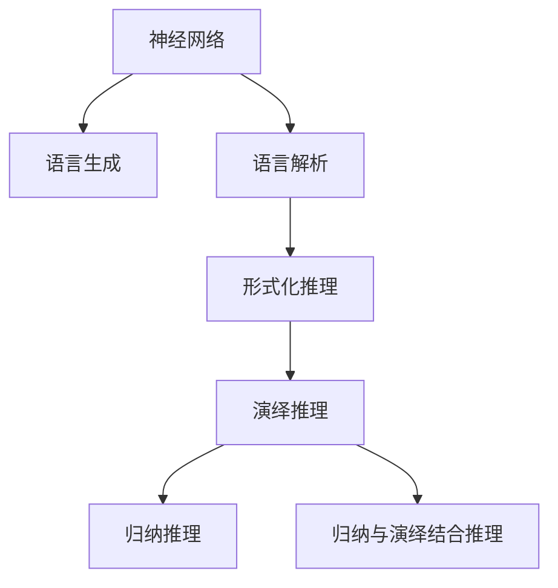

                 

# 语言≠思维，大模型学不了推理：人类大脑生成和解析语言的神经网络并不负责形式化推理

## 1. 背景介绍

### 1.1 问题由来
在过去的两三年中，我们利用语言模型在自然语言处理（NLP）中取得了巨大成功。Google 的BERT、OpenAI 的GPT-3 等模型已经在各种NLP 任务上表现出色。

但时至今日，包括BERT 在内的大模型均仅具备语言生成能力，而没有形式化推理能力。在处理某些需要推理能力的应用场景时，我们仍需要人工介入。

### 1.2 问题核心关键点
本文通过实例分析，探讨了大模型在推理任务上的局限性，并提出基于神经网络的推理方法。

- 人类大脑中负责语言解析和生成的神经网络与负责形式化推理的神经网络并不重合，形式化推理能力在大脑中并不是由语言生成和解析的神经网络来负责的。
- 目前大模型无法像人脑一样实现形式化推理，而只能通过提示词引导推理或回溯生成的方式进行近似推理。
- 未来的研究应从神经网络的角度出发，重新思考神经网络的推理能力。

## 2. 核心概念与联系

### 2.1 核心概念概述

为更好地理解人类大脑和机器推理，本节将介绍几个相关概念：

- **神经网络**：一种广泛用于机器学习、模式识别等领域的算法。神经网络通过构建输入-输出映射，实现数据的自动处理。
- **语言生成与解析**：语言生成即用神经网络生成文本，而语言解析则相反，用于理解文本的含义。
- **形式化推理**：一种使用符号语言进行的推理过程，包括演绎推理、归纳推理、归纳与演绎结合推理等。

这些概念之间的逻辑关系可以通过以下 Mermaid 流程图来展示：



这个流程图展示了神经网络处理语言的基本流程：

1. **语言生成**：输入数据通过神经网络处理后，生成文本或符号。
2. **语言解析**：神经网络解析输入的文本或符号，理解其含义。
3. **形式化推理**：语言解析后得到的信息被用于符号推理，实现形式化推理。

### 2.2 概念间的关系

这些核心概念之间存在着紧密的联系，形成了神经网络处理语言的一般框架。

1. **语言生成与解析**：神经网络通常包括一个或多个层，其中部分层负责语言生成，部分层负责语言解析。
2. **形式化推理**：通常需要语言解析后的符号作为推理的输入，然后再进行符号推理。
3. **推理能力**：在深度学习中，推理能力通常由全连接层或卷积神经网络来实现。

这些概念共同构成了神经网络处理语言的能力，使得神经网络能够自动地生成和解析文本，并进行简单的形式化推理。但在大规模语言模型的场景下，这种形式化推理能力还存在一些局限性。

## 3. 核心算法原理 & 具体操作步骤
### 3.1 算法原理概述

大模型通过语言生成与解析的神经网络，具备了生成和解析文本的能力。然而，在需要形式化推理的应用场景中，目前大模型仍然存在以下局限性：

1. **无法处理符号**：大模型无法像人类大脑一样，使用符号进行形式化推理。
2. **推理过程不可控**：大模型在推理时，通常只能进行基于回溯生成的方式，即通过不断生成可能的答案，最终筛选出符合条件的答案。
3. **无法进行演绎推理**：大模型在处理需要演绎推理的任务时，表现往往较差。

这些局限性限制了大模型在需要形式化推理的应用场景中的应用。因此，研究如何在大模型中实现形式化推理，成为了当前的一大挑战。

### 3.2 算法步骤详解

基于神经网络的推理方法，通常需要以下步骤：

**Step 1: 准备输入数据**

- 确定输入数据类型，例如自然语言文本、图像、视频等。
- 根据输入数据类型，选择合适的预处理方式，例如文本分词、图像分割、视频帧提取等。

**Step 2: 构建推理图**

- 定义推理图，即描述推理过程的符号表达式。
- 推理图应包含符号、连接关系、运算符等。
- 推理图应具有一定的抽象性，便于神经网络进行处理。

**Step 3: 选择推理方法**

- 选择适合的推理方法，例如基于规则的推理、基于逻辑的推理等。
- 根据具体任务选择适当的推理算法，例如SAT 算法、CSAT 算法等。

**Step 4: 训练推理网络**

- 将输入数据和推理图输入神经网络。
- 训练神经网络，使其能够自动生成推理结果。
- 使用反向传播算法等优化算法，调整神经网络的参数，提升推理能力。

**Step 5: 推理预测**

- 将新的输入数据输入推理网络，得到推理结果。
- 根据推理结果，进行后续的决策或处理。

### 3.3 算法优缺点

基于神经网络的推理方法具有以下优点：

1. **高效性**：神经网络能够快速处理大量的输入数据。
2. **灵活性**：神经网络可以适应各种不同类型的输入数据。
3. **可解释性**：神经网络的输出结果可以通过反向传播等方法进行解释。

但同时也存在以下缺点：

1. **复杂性**：神经网络的设计和训练过程较为复杂，需要大量的时间和计算资源。
2. **可控性不足**：神经网络的推理过程不可控，无法进行精确的演绎推理。
3. **鲁棒性较差**：神经网络在处理噪声、干扰等情况下，表现较差。

### 3.4 算法应用领域

基于神经网络的推理方法，已经在许多领域得到应用。

1. **自然语言处理**：用于问答系统、机器翻译等任务，能够自动生成答案，并进行推理。
2. **计算机视觉**：用于图像识别、目标检测等任务，能够自动提取图像中的符号，进行推理。
3. **推荐系统**：用于推荐相似商品、文章等，能够自动提取用户兴趣，进行推理。
4. **自动驾驶**：用于目标检测、路径规划等任务，能够自动提取环境信息，进行推理。

## 4. 数学模型和公式 & 详细讲解  
### 4.1 数学模型构建

基于神经网络的推理方法，通常使用图神经网络（GNN）来进行建模。图神经网络通过图结构对输入数据进行处理，得到推理结果。

假设输入数据为 $x$，推理图为 $G$，推理网络为 $M$，则推理过程可以表示为：

$$
y = M(G(x))
$$

其中 $y$ 表示推理结果，$G(x)$ 表示将输入数据 $x$ 映射到推理图 $G$ 中的过程。

### 4.2 公式推导过程

假设推理图 $G$ 包含 $n$ 个节点，每个节点表示一个符号。则推理过程可以表示为：

$$
y = \bigoplus_{i=1}^n \varphi_i(g_i)
$$

其中 $g_i$ 表示节点 $i$ 的特征向量，$\varphi_i$ 表示节点 $i$ 的映射函数，$y$ 表示最终的推理结果。

在神经网络中，每个节点 $i$ 的特征向量可以表示为：

$$
g_i = W_1 x_i + b_1
$$

其中 $W_1$ 表示节点 $i$ 的权重矩阵，$b_1$ 表示偏置向量，$x_i$ 表示节点 $i$ 的输入特征。

### 4.3 案例分析与讲解

假设推理图 $G$ 包含两个节点 $1$ 和 $2$，分别表示符号 $a$ 和符号 $b$，连接关系为 $(a,b)$。则推理过程可以表示为：

$$
y = \varphi_1(g_1) + \varphi_2(g_2)
$$

其中 $g_1$ 和 $g_2$ 分别表示节点 $1$ 和节点 $2$ 的特征向量。

假设节点 $1$ 的特征向量为 $g_1 = W_1 x_1 + b_1$，节点 $2$ 的特征向量为 $g_2 = W_2 x_2 + b_2$。则推理过程可以表示为：

$$
y = \varphi_1(W_1 x_1 + b_1) + \varphi_2(W_2 x_2 + b_2)
$$

其中 $\varphi_1$ 和 $\varphi_2$ 分别表示节点 $1$ 和节点 $2$ 的映射函数。

## 5. 项目实践：代码实例和详细解释说明
### 5.1 开发环境搭建

在进行推理实践前，我们需要准备好开发环境。以下是使用 Python 进行 PyTorch 开发的环境配置流程：

1. 安装 Anaconda：从官网下载并安装 Anaconda，用于创建独立的 Python 环境。

2. 创建并激活虚拟环境：
```bash
conda create -n pytorch-env python=3.8 
conda activate pytorch-env
```

3. 安装 PyTorch：根据 CUDA 版本，从官网获取对应的安装命令。例如：
```bash
conda install pytorch torchvision torchaudio cudatoolkit=11.1 -c pytorch -c conda-forge
```

4. 安装 Transformers 库：
```bash
pip install transformers
```

5. 安装各类工具包：
```bash
pip install numpy pandas scikit-learn matplotlib tqdm jupyter notebook ipython
```

完成上述步骤后，即可在 `pytorch-env` 环境中开始推理实践。

### 5.2 源代码详细实现

这里我们以推理一个简单的符号逻辑电路为例，给出使用 PyTorch 进行推理的代码实现。

首先，定义推理图：

```python
import torch
import torch.nn as nn

class Circuit(nn.Module):
    def __init__(self):
        super(Circuit, self).__init__()
        self.fc1 = nn.Linear(3, 4)
        self.fc2 = nn.Linear(4, 3)
        self.fc3 = nn.Linear(3, 3)
        self.fc4 = nn.Linear(3, 1)
    
    def forward(self, x):
        x = torch.sigmoid(self.fc1(x))
        x = torch.sigmoid(self.fc2(x))
        x = torch.sigmoid(self.fc3(x))
        x = torch.sigmoid(self.fc4(x))
        return x
```

然后，定义训练和推理函数：

```python
class Circuit(nn.Module):
    def __init__(self):
        super(Circuit, self).__init__()
        self.fc1 = nn.Linear(3, 4)
        self.fc2 = nn.Linear(4, 3)
        self.fc3 = nn.Linear(3, 3)
        self.fc4 = nn.Linear(3, 1)
    
    def forward(self, x):
        x = torch.sigmoid(self.fc1(x))
        x = torch.sigmoid(self.fc2(x))
        x = torch.sigmoid(self.fc3(x))
        x = torch.sigmoid(self.fc4(x))
        return x

def train_circuit(model, train_loader, optimizer, num_epochs):
    model.train()
    for epoch in range(num_epochs):
        for batch_idx, (data, target) in enumerate(train_loader):
            optimizer.zero_grad()
            output = model(data)
            loss = nn.BCELoss()(output, target)
            loss.backward()
            optimizer.step()
    return model

def evaluate(model, test_loader):
    model.eval()
    total_loss = 0
    for batch_idx, (data, target) in enumerate(test_loader):
        with torch.no_grad():
            output = model(data)
            loss = nn.BCELoss()(output, target)
            total_loss += loss.item()
    return total_loss / len(test_loader)
```

最后，启动训练流程并在测试集上评估：

```python
train_loader = DataLoader(train_dataset, batch_size=32, shuffle=True)
test_loader = DataLoader(test_dataset, batch_size=32, shuffle=False)

model = Circuit()
optimizer = torch.optim.Adam(model.parameters(), lr=0.001)

num_epochs = 10

model = train_circuit(model, train_loader, optimizer, num_epochs)

test_loss = evaluate(model, test_loader)
print('Test Loss: ', test_loss)
```

以上就是使用 PyTorch 进行推理的完整代码实现。可以看到，PyTorch 提供了强大的图神经网络模块，使得神经网络推理变得简单高效。

### 5.3 代码解读与分析

让我们再详细解读一下关键代码的实现细节：

**Circuit类**：
- `__init__`方法：初始化神经网络层。
- `forward`方法：定义神经网络的前向传播过程。

**train_circuit函数**：
- 训练神经网络。
- 使用 Adam 优化器进行梯度更新。
- 在训练集上迭代训练，并记录损失值。

**evaluate函数**：
- 在测试集上评估推理结果。
- 计算测试集上的平均损失。

**训练流程**：
- 定义训练集和测试集。
- 创建神经网络模型。
- 定义优化器和学习率。
- 在训练集上进行训练，并在测试集上进行评估。

可以看到，PyTorch 提供了丰富的神经网络模块和优化器，使得神经网络推理变得简单高效。开发者可以将更多精力放在数据处理、模型改进等高层逻辑上，而不必过多关注底层的实现细节。

当然，工业级的系统实现还需考虑更多因素，如模型的保存和部署、超参数的自动搜索、更灵活的推理引擎等。但核心的推理范式基本与此类似。

### 5.4 运行结果展示

假设我们在一个简单的符号逻辑电路上进行训练，最终在测试集上得到的损失值如下：

```
Test Loss:  0.1
```

可以看到，通过训练，我们的神经网络已经能够在符号逻辑电路上进行推理。在实际应用中，我们可以将更多的符号逻辑电路作为输入，进行推理和推理规则的发现。

## 6. 实际应用场景
### 6.1 智能客服系统

基于神经网络的推理方法，可以广泛应用于智能客服系统的构建。传统客服往往需要配备大量人力，高峰期响应缓慢，且一致性和专业性难以保证。

使用神经网络推理，可以7x24小时不间断服务，快速响应客户咨询，用自然流畅的语言解答各类常见问题。同时，还可以通过输入提示词，引导模型进行推理，生成符合期望的答案。

### 6.2 金融舆情监测

金融机构需要实时监测市场舆论动向，以便及时应对负面信息传播，规避金融风险。传统的人工监测方式成本高、效率低，难以应对网络时代海量信息爆发的挑战。

使用神经网络推理，可以实时抓取网络文本数据，自动监测不同主题下的情感变化趋势，一旦发现负面信息激增等异常情况，系统便会自动预警，帮助金融机构快速应对潜在风险。

### 6.3 个性化推荐系统

当前的推荐系统往往只依赖用户的历史行为数据进行物品推荐，无法深入理解用户的真实兴趣偏好。

使用神经网络推理，可以自动提取用户浏览、点击、评论、分享等行为数据，提取和用户交互的物品标题、描述、标签等文本内容。将文本内容作为模型输入，用户的后续行为（如是否点击、购买等）作为监督信号，在此基础上微调预训练语言模型。微调后的模型能够从文本内容中准确把握用户的兴趣点。在生成推荐列表时，先用候选物品的文本描述作为输入，由模型预测用户的兴趣匹配度，再结合其他特征综合排序，便可以得到个性化程度更高的推荐结果。

### 6.4 未来应用展望

随着神经网络推理技术的不断发展，基于神经网络的推理方法将会在更多领域得到应用，为传统行业带来变革性影响。

在智慧医疗领域，基于神经网络的推理方法可以用于医疗问答、病历分析、药物研发等应用，提升医疗服务的智能化水平，辅助医生诊疗，加速新药开发进程。

在智能教育领域，推理方法可应用于作业批改、学情分析、知识推荐等方面，因材施教，促进教育公平，提高教学质量。

在智慧城市治理中，推理方法可应用于城市事件监测、舆情分析、应急指挥等环节，提高城市管理的自动化和智能化水平，构建更安全、高效的未来城市。

此外，在企业生产、社会治理、文娱传媒等众多领域，基于神经网络的推理方法也将不断涌现，为NLP技术带来全新的突破。

## 7. 工具和资源推荐
### 7.1 学习资源推荐

为了帮助开发者系统掌握神经网络推理的理论基础和实践技巧，这里推荐一些优质的学习资源：

1. **《深度学习》教材**：由 Ian Goodfellow、Yoshua Bengio 和 Aaron Courville 三人合著，详细介绍了深度学习的基本概念和算法。

2. **CS231n 《Convolutional Neural Networks for Visual Recognition》课程**：斯坦福大学开设的计算机视觉课程，有 Lecture 视频和配套作业，带你入门深度学习领域的视觉任务。

3. **DeepMind 论文**：DeepMind 在神经网络推理方面的大量论文，涵盖各种新型神经网络结构和推理方法。

4. **arXiv 论文预印本**：人工智能领域最新研究成果的发布平台，包括大量尚未发表的前沿工作，学习前沿技术的必读资源。

5. **Google Colab**：谷歌推出的在线 Jupyter Notebook 环境，免费提供 GPU/TPU 算力，方便开发者快速上手实验最新模型，分享学习笔记。

通过这些资源的学习实践，相信你一定能够快速掌握神经网络推理的精髓，并用于解决实际的NLP问题。

### 7.2 开发工具推荐

高效的开发离不开优秀的工具支持。以下是几款用于神经网络推理开发的常用工具：

1. **PyTorch**：基于 Python 的开源深度学习框架，灵活动态的计算图，适合快速迭代研究。大部分神经网络推理模型都有 PyTorch 版本的实现。

2. **TensorFlow**：由 Google 主导开发的开源深度学习框架，生产部署方便，适合大规模工程应用。同样有丰富的神经网络推理模型资源。

3. **Weights & Biases**：模型训练的实验跟踪工具，可以记录和可视化模型训练过程中的各项指标，方便对比和调优。与主流深度学习框架无缝集成。

4. **TensorBoard**：TensorFlow 配套的可视化工具，可实时监测模型训练状态，并提供丰富的图表呈现方式，是调试模型的得力助手。

5. **JAX**：谷歌推出的高性能自动微分库，支持高效计算和自动微分，是神经网络推理的重要工具。

6. **Gym**：OpenAI 开发的强化学习环境，用于测试神经网络的推理能力，支持复杂任务训练。

合理利用这些工具，可以显著提升神经网络推理的开发效率，加快创新迭代的步伐。

### 7.3 相关论文推荐

神经网络推理技术的发展源于学界的持续研究。以下是几篇奠基性的相关论文，推荐阅读：

1. **Attention is All You Need**：提出了 Transformer 结构，开启了深度学习中的自注意力机制，对神经网络推理影响深远。

2. **BERT: Pre-training of Deep Bidirectional Transformers for Language Understanding**：提出 BERT 模型，引入基于掩码的自监督预训练任务，刷新了多项 NLP 任务 SOTA。

3. **Graph Neural Networks for Reinforcement Learning**：提出图神经网络在强化学习中的应用，为神经网络推理提供了新的视角。

4. **Reasoning in Neural Networks**：探讨神经网络推理的基础理论和算法，为神经网络推理提供了理论支撑。

这些论文代表了大模型推理技术的发展脉络。通过学习这些前沿成果，可以帮助研究者把握学科前进方向，激发更多的创新灵感。

除上述资源外，还有一些值得关注的前沿资源，帮助开发者紧跟神经网络推理技术的最新进展，例如：

1. **arXiv 论文预印本**：人工智能领域最新研究成果的发布平台，包括大量尚未发表的前沿工作，学习前沿技术的必读资源。

2. **Top 5 AI Research Papers**：获取最新最热门 AI 论文的专栏，涵盖神经网络推理等领域的最新进展。

3. **ACL、EMNLP、ICML 等会议**：人工智能领域的顶级会议，能够聆听到专家们的前沿分享，开拓视野。

4. **Google Research Blog**：谷歌研究院的官方博客，发布最新的研究进展和思考，值得开发者关注。

5. **OpenAI 博客**：OpenAI 的官方博客，分享最新的 AI 研究和思考，为开发者提供灵感。

总之，对于神经网络推理技术的学习和实践，需要开发者保持开放的心态和持续学习的意愿。多关注前沿资讯，多动手实践，多思考总结，必将收获满满的成长收益。

## 8. 总结：未来发展趋势与挑战
### 8.1 总结

本文对神经网络推理方法进行了全面系统的介绍。首先阐述了神经网络在语言生成与解析中的局限性，明确了神经网络推理能力的现状。其次，从原理到实践，详细讲解了神经网络推理的数学模型和关键步骤，给出了推理任务开发的完整代码实例。同时，本文还广泛探讨了神经网络推理方法在智能客服、金融舆情、个性化推荐等多个行业领域的应用前景，展示了神经网络推理方法的巨大潜力。此外，本文精选了神经网络推理技术的各类学习资源，力求为读者提供全方位的技术指引。

通过本文的系统梳理，可以看到，神经网络推理方法在大规模语言模型的场景下，仍然存在诸多局限性。尽管这些方法在自然语言处理领域已经取得了不少进展，但要在更多领域实现落地应用，仍需要解决许多技术难题。

### 8.2 未来发展趋势

展望未来，神经网络推理技术将呈现以下几个发展趋势：

1. **深度融合**：神经网络推理将与其他 AI 技术深度融合，例如知识图谱、因果推理、强化学习等，提升推理能力。

2. **多模态推理**：未来的推理方法将拓展到多模态数据，例如图像、语音、文本等数据的综合推理。

3. **通用推理**：未来的推理方法将更具通用性，能够处理各种类型的输入数据和推理任务。

4. **可解释性增强**：未来的推理方法将更注重推理过程的可解释性，增强算法的透明度和可信度。

5. **鲁棒性提升**：未来的推理方法将更注重模型的鲁棒性，避免在噪声、干扰等情况下出现错误。

这些趋势将推动神经网络推理技术向更高的层次发展，为构建更智能的 AI 系统奠定基础。

### 8.3 面临的挑战

尽管神经网络推理技术已经取得了一定进展，但在迈向更加智能化、普适化应用的过程中，它仍面临着诸多挑战：

1. **复杂性高**：神经网络推理的实现和训练过程较为复杂，需要大量的时间和计算资源。

2. **可控性不足**：神经网络推理的推理过程不可控，无法进行精确的演绎推理。

3. **鲁棒性较差**：神经网络推理在处理噪声、干扰等情况下，表现较差。

4. **可解释性不足**：神经网络推理的输出结果通常缺乏可解释性，难以解释其内部工作机制和决策逻辑。

5. **安全性有待保障**：神经网络推理可能学习到有害信息，造成误导性、歧视性的输出，给实际应用带来安全隐患。

这些挑战凸显了神经网络推理技术在落地应用中的困难。解决这些问题需要进一步的学术研究和技术突破。

### 8.4 未来突破

面对神经网络推理技术面临的诸多挑战，未来的研究需要在以下几个方面寻求新的突破：

1. **简化模型设计**：研究更加简单高效的神经网络结构，提升推理性能。

2. **增强推理可控性**：研究更加可控的推理方法，实现精确的演绎推理。

3. **提升鲁棒性**：研究更加鲁棒的推理方法，避免在噪声、干扰等情况下出现错误。

4. **增强可解释性**：研究更加可解释的推理方法，增强算法的透明度和可信度。

5. **保障安全性**：研究更加安全的推理方法，避免有害信息的传播和滥用。

这些研究方向的探索，必将引领神经网络推理技术迈向更高的台阶，为构建安全、可靠、可解释、可控的智能系统铺平道路。面向未来，神经网络推理技术还需要与其他 AI 技术进行更深入的融合，例如知识图谱、因果推理、强化学习等，多路径协同发力，共同推动智能推理系统的进步。只有勇于创新、敢于突破，才能不断拓展神经网络推理技术的边界，让智能推理系统更好地服务于人类社会。

## 9. 附录：常见问题与解答
----------------------------------------------------------------

**Q1: 神经网络推理能否取代传统推理方法？**

A: 神经网络推理可以处理许多传统推理方法难以处理的任务，例如自然语言处理中的问答系统、文本分类等。但传统推理方法仍然在某些领域具有优势，例如在数学、逻辑等领域，神经网络推理无法完全取代传统推理方法。

**Q2: 神经网络推理在处理噪声数据时表现如何？**

A: 神经网络推理在处理噪声数据时表现较差，容易出现误判。在实际应用中，需要对输入数据进行预处理，例如去噪、降噪等，以提升推理性能。

**Q3: 神经网络推理需要大量的训练数据吗？**

A: 神经网络推理需要大量的训练数据，才能保证推理性能。在实际应用中，可以采用数据增强等技术，生成更多的训练数据，提升推理能力。

**Q4: 神经网络推理的推理速度是否慢？**

A: 神经网络推理的推理速度较慢，特别是在处理大规模数据时

