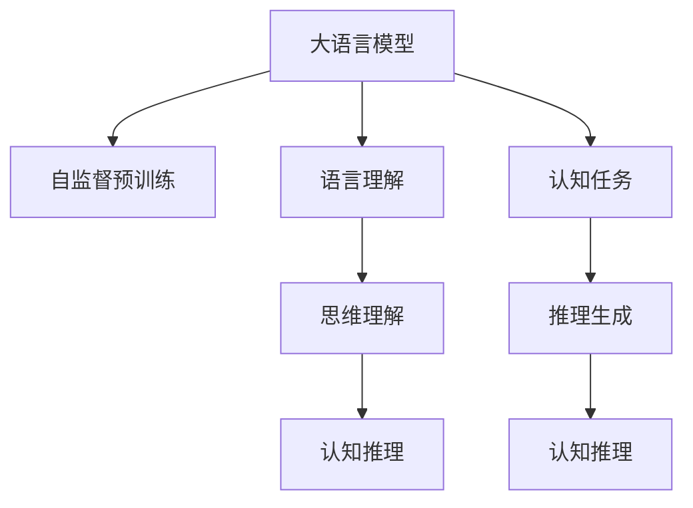

                 

# 语言≠思维：大模型的认知瓶颈

> 关键词：大语言模型,认知瓶颈,思维理解,深度学习,自然语言处理(NLP)

## 1. 背景介绍

### 1.1 问题由来

近年来，深度学习技术在自然语言处理(NLP)领域取得了显著进展，特别是大语言模型(如BERT, GPT-3等)的出现，显著提升了模型在语言理解、生成、翻译等方面的能力。这些模型通过在大规模无标签文本数据上进行预训练，学习到丰富的语言知识和常识，能够处理复杂的语言现象和语义关系，表现出了超乎寻常的语言理解能力。然而，尽管大语言模型在各种NLP任务上取得了令人瞩目的成绩，但在一些认知任务上，其性能仍然存在明显的不足，凸显出模型在思维理解和认知推理方面的"瓶颈"。

### 1.2 问题核心关键点

大语言模型在应对复杂认知任务时存在"瓶颈"的原因主要有以下几个方面：

- **语言理解与思维理解的差异**：语言只是思维的一种表现形式，而思维包括概念推理、逻辑判断、情感分析等多方面的认知功能。大语言模型虽然能够较好地理解语言，但并不具备人类高层次的思维理解能力。

- **语言知识与思维知识的脱节**：大语言模型虽然学习到了大量的语言知识，但这些知识主要来源于无标签文本的统计规律，而非直接的思维认知过程。这使得模型难以真正理解抽象概念和复杂的思维关系。

- **思维推理的局限性**：大语言模型在推理任务中表现出一定的局限性。如对因果关系的理解、长程依赖关系的建模等方面，模型往往无法像人类一样自然地进行推理和判断。

- **思维能力的泛化性不足**：大语言模型在处理不同领域的认知任务时，其性能和鲁棒性常常无法保持一致。如在处理具体领域的案例时，模型容易受到领域特定的数据分布影响。

这些核心关键点导致大语言模型在应对复杂认知任务时，表现出了明显的瓶颈。如何突破这一瓶颈，提升模型的思维理解能力和认知推理性能，成为当前深度学习领域的一大研究热点。

### 1.3 问题研究意义

理解大语言模型的认知瓶颈，对于进一步推动深度学习技术的发展，提升人工智能系统的智能水平，具有重要意义：

1. **拓展AI应用范围**：突破认知瓶颈，使AI能够更好地应对各种复杂的认知任务，拓展AI技术在教育、医疗、金融等领域的广泛应用。
2. **提升系统性能**：通过增强模型的思维推理能力，提升其在推理、生成、问答等任务上的性能，为产业界带来更多智能化解决方案。
3. **促进学科融合**：认知瓶颈的研究有助于跨学科的融合，推动认知科学、语言学、人工智能等领域的研究进展。
4. **推动伦理研究**：认知瓶颈问题凸显了人工智能伦理和安全性的重要性，促使业界对AI技术的伦理问题进行深入思考和规范。

## 2. 核心概念与联系

### 2.1 核心概念概述

要深入理解大语言模型的认知瓶颈，首先需要明确几个核心概念：

- **大语言模型**：以Transformer为基础的大规模预训练语言模型，通过在大规模无标签文本数据上进行自监督预训练，学习到通用的语言表示和语义关系。

- **认知任务**：指需要人类认知能力才能完成的高级思维任务，如推理、判断、分类、生成等。

- **思维理解**：指对抽象概念、逻辑关系和情感理解的认知过程，超越了简单的语言理解。

- **认知推理**：指通过思维理解，对新的输入进行推理和判断，得出符合逻辑和常识的结论。

这些概念之间存在着紧密的联系。大语言模型虽然具备强大的语言理解能力，但相对于人类思维，仍存在显著的认知瓶颈。理解和突破这一瓶颈，是大语言模型向通用人工智能(GAI)迈进的关键。

### 2.2 概念间的关系

这些核心概念之间的关系可以通过以下Mermaid流程图来展示：



这个流程图展示了从预训练到认知任务的过程：大语言模型通过自监督预训练学习语言表示，进而理解语言，并进一步通过思维理解实现认知推理。认知任务包括推理、判断、分类等，最终通过推理生成完成目标输出。

## 3. 核心算法原理 & 具体操作步骤
### 3.1 算法原理概述

大语言模型在应对认知任务时，主要通过以下算法原理进行推理和判断：

1. **自监督预训练**：在无标签文本数据上，通过语言建模、掩码预测等任务，学习到通用的语言表示和语义关系。

2. **任务适配**：在特定认知任务上，通过微调或提示学习等方法，将预训练模型调整为适合该任务的语言表示，实现任务相关的认知推理。

3. **思维理解**：通过模型的多层表征学习，实现对抽象概念、逻辑关系和情感的理解，这是认知推理的基础。

4. **认知推理**：在获得思维理解的基础上，利用推理机制，对新的输入进行判断和生成，完成认知任务。

这些算法原理为大语言模型提供了在认知任务上的基本推理框架，但并不足以应对所有复杂的认知问题。

### 3.2 算法步骤详解

以下是基于大语言模型的认知任务推理的基本步骤：

**Step 1: 数据准备**
- 收集与认知任务相关的标注数据集，并对其进行清洗和标注。标注数据集应覆盖各类典型案例，确保数据的多样性和泛化性。

**Step 2: 模型适配**
- 选择合适的大语言模型作为初始化参数，通过微调或提示学习等方法，将模型调整为适合认知任务的语言表示。
- 对于微调，一般需要冻结预训练模型的底层，仅微调顶层，以避免破坏预训练权重。
- 对于提示学习，设计合适的输入模板，引导模型进行推理和判断，并减少微调参数。

**Step 3: 推理计算**
- 将输入数据输入模型，通过多层表征学习，实现对输入的理解和推理。
- 根据任务特点，选择合适的推理方法，如因果推理、逻辑推理等，进行判断和生成。

**Step 4: 结果输出**
- 输出推理结果，如分类标签、推理解释等，实现对认知任务的解答。
- 记录推理过程，以便后续分析和改进。

**Step 5: 结果评估**
- 在测试集上评估推理结果的准确率和推理效率，比较不同模型的性能。
- 分析推理过程中的错误和瓶颈，进行模型改进。

### 3.3 算法优缺点

大语言模型的认知推理算法具有以下优点：

- **高效性**：通过预训练学习通用语言表示，可以在较少的标注样本下进行高效微调，提升推理效率。
- **灵活性**：不同的认知任务可以通过微调或提示学习等方法，快速适配，实现多种任务的推理。
- **可扩展性**：模型的推理能力可以随着数据和任务的增加而提升，具有较好的可扩展性。

同时，这些算法也存在一些缺点：

- **依赖标注数据**：微调和提示学习需要大量的标注数据，且标注成本较高，限制了其在某些领域的应用。
- **解释性不足**：模型的推理过程往往难以解释，缺乏透明性和可理解性。
- **泛化性有限**：模型在处理特定领域或特殊案例时，容易受到数据分布和领域知识的影响。

### 3.4 算法应用领域

大语言模型的认知推理算法已经在多个领域得到了广泛应用：

- **自然语言推理(NLI)**：判断前提和假设之间的逻辑关系，广泛应用于问答、逻辑推理、文本分类等任务。
- **对话系统**：通过与用户的自然对话，实现复杂的任务解答，如信息检索、推荐系统等。
- **智能推荐**：根据用户历史行为和兴趣，推荐相关内容，实现个性化服务。
- **智能辅助设计**：辅助设计师进行创意设计，提供设计建议和灵感。
- **医疗诊断**：通过自然语言理解，辅助医生进行诊断和治疗方案推荐。

## 4. 数学模型和公式 & 详细讲解 & 举例说明

### 4.1 数学模型构建

大语言模型在应对认知任务时，通常采用自监督预训练和任务适配的方式进行推理。以下是一个基本的数学模型构建过程：

假设预训练模型为 $M_{\theta}$，其中 $\theta$ 为预训练参数。在认知任务上，通过微调或提示学习，将模型参数 $\theta$ 调整为适合该任务的语言表示 $\theta_t$。假设认知任务的输入为 $x$，输出为 $y$。

**Step 1: 输入编码**
- 将输入 $x$ 编码为模型所需的格式，得到输入表示 $x_t$。

**Step 2: 推理计算**
- 将输入表示 $x_t$ 输入模型，得到推理结果 $y_t$。

**Step 3: 任务适配**
- 根据认知任务的特点，选择合适的方法对推理结果进行处理，得到最终输出 $y$。

### 4.2 公式推导过程

以自然语言推理(NLI)任务为例，假设模型的输入为前提和假设，输出为逻辑关系。推理过程可以表示为：

$$
y = f(M_{\theta_t}(x_t))
$$

其中 $x_t$ 为输入编码后的表示，$\theta_t$ 为微调后的模型参数，$f$ 为推理函数。

推理函数 $f$ 可以采用不同的模型结构，如逻辑回归、卷积神经网络等。以逻辑回归为例，推理过程可以表示为：

$$
y = \text{softmax}(M_{\theta_t}(x_t)W + b)
$$

其中 $W$ 和 $b$ 为逻辑回归模型的权重和偏置，$\text{softmax}$ 为归一化函数，将模型输出映射到逻辑关系类别上。

### 4.3 案例分析与讲解

以多轮对话系统为例，假设模型的输入为对话历史和当前用户的输入，输出为机器的回答。推理过程可以表示为：

$$
y = f(M_{\theta_t}(x_t))
$$

其中 $x_t$ 为对话历史和当前用户输入的表示，$\theta_t$ 为微调后的模型参数，$f$ 为对话生成函数。

对话生成函数 $f$ 可以采用循环神经网络(RNN)、Transformer等模型结构。以Transformer为例，推理过程可以表示为：

$$
y = \text{softmax}(\text{softmax}(M_{\theta_t}(x_t)W + b)W' + b')
$$

其中 $W$ 和 $b$ 为Transformer模型的权重和偏置，$\text{softmax}$ 为归一化函数，将模型输出映射到回答类别上。

## 5. 项目实践：代码实例和详细解释说明

### 5.1 开发环境搭建

在进行认知推理任务开发前，需要准备好开发环境。以下是使用Python进行PyTorch开发的环境配置流程：

1. 安装Anaconda：从官网下载并安装Anaconda，用于创建独立的Python环境。

2. 创建并激活虚拟环境：
```bash
conda create -n pytorch-env python=3.8 
conda activate pytorch-env
```

3. 安装PyTorch：根据CUDA版本，从官网获取对应的安装命令。例如：
```bash
conda install pytorch torchvision torchaudio cudatoolkit=11.1 -c pytorch -c conda-forge
```

4. 安装TensorBoard：用于实时监测模型训练状态，并提供丰富的图表呈现方式，是调试模型的得力助手。

5. 安装GitHub：用于克隆和拉取最新代码，获取最新的研究进展。

完成上述步骤后，即可在`pytorch-env`环境中开始认知推理任务开发。

### 5.2 源代码详细实现

这里我们以多轮对话系统为例，给出使用Transformers库对GPT模型进行微调的PyTorch代码实现。

首先，定义对话任务的数据处理函数：

```python
from transformers import GPT2Tokenizer
from torch.utils.data import Dataset
import torch

class DialogueDataset(Dataset):
    def __init__(self, dialogues, tokenizer, max_len=512):
        self.dialogues = dialogues
        self.tokenizer = tokenizer
        self.max_len = max_len
        
    def __len__(self):
        return len(self.dialogues)
    
    def __getitem__(self, item):
        dialogue = self.dialogues[item]
        text = ' '.join(dialogue[0] + ' <SEP> ' + dialogue[1])
        encoding = self.tokenizer(text, return_tensors='pt', max_length=self.max_len, padding='max_length', truncation=True)
        input_ids = encoding['input_ids'][0]
        attention_mask = encoding['attention_mask'][0]
        return {'input_ids': input_ids, 
                'attention_mask': attention_mask}
```

然后，定义模型和优化器：

```python
from transformers import GPT2LMHeadModel, AdamW

model = GPT2LMHeadModel.from_pretrained('gpt2')
optimizer = AdamW(model.parameters(), lr=2e-5)
```

接着，定义训练和评估函数：

```python
from torch.utils.data import DataLoader
from tqdm import tqdm
from sklearn.metrics import accuracy_score

device = torch.device('cuda') if torch.cuda.is_available() else torch.device('cpu')
model.to(device)

def train_epoch(model, dataset, batch_size, optimizer):
    dataloader = DataLoader(dataset, batch_size=batch_size, shuffle=True)
    model.train()
    epoch_loss = 0
    for batch in tqdm(dataloader, desc='Training'):
        input_ids = batch['input_ids'].to(device)
        attention_mask = batch['attention_mask'].to(device)
        model.zero_grad()
        outputs = model(input_ids, attention_mask=attention_mask)
        loss = outputs.loss
        epoch_loss += loss.item()
        loss.backward()
        optimizer.step()
    return epoch_loss / len(dataloader)

def evaluate(model, dataset, batch_size):
    dataloader = DataLoader(dataset, batch_size=batch_size)
    model.eval()
    preds, labels = [], []
    with torch.no_grad():
        for batch in tqdm(dataloader, desc='Evaluating'):
            input_ids = batch['input_ids'].to(device)
            attention_mask = batch['attention_mask'].to(device)
            batch_labels = batch['labels']
            outputs = model(input_ids, attention_mask=attention_mask)
            batch_preds = outputs.logits.argmax(dim=2).to('cpu').tolist()
            batch_labels = batch_labels.to('cpu').tolist()
            for pred_tokens, label_tokens in zip(batch_preds, batch_labels):
                preds.append(pred_tokens[:len(label_tokens)])
                labels.append(label_tokens)
                
    print(accuracy_score(labels, preds))
```

最后，启动训练流程并在测试集上评估：

```python
epochs = 5
batch_size = 16

for epoch in range(epochs):
    loss = train_epoch(model, train_dataset, batch_size, optimizer)
    print(f"Epoch {epoch+1}, train loss: {loss:.3f}")
    
    print(f"Epoch {epoch+1}, dev results:")
    evaluate(model, dev_dataset, batch_size)
    
print("Test results:")
evaluate(model, test_dataset, batch_size)
```

以上就是使用PyTorch对GPT模型进行多轮对话系统微调的完整代码实现。可以看到，借助Transformers库，我们能够快速实现对话模型的微调，并使用TensorBoard进行实时监测和调试。

### 5.3 代码解读与分析

让我们再详细解读一下关键代码的实现细节：

**DialogueDataset类**：
- `__init__`方法：初始化对话历史和分词器等关键组件。
- `__len__`方法：返回数据集的样本数量。
- `__getitem__`方法：对单个对话样本进行处理，将对话历史和当前用户输入编码成token ids，并对其进行定长padding，最终返回模型所需的输入。

**model和optimizer定义**：
- 定义GPT2模型和AdamW优化器，并设置学习率。

**训练和评估函数**：
- 使用PyTorch的DataLoader对对话数据进行批次化加载，供模型训练和推理使用。
- 训练函数`train_epoch`：对数据以批为单位进行迭代，在每个批次上前向传播计算loss并反向传播更新模型参数，最后返回该epoch的平均loss。
- 评估函数`evaluate`：与训练类似，不同点在于不更新模型参数，并在每个batch结束后将预测和标签结果存储下来，最后使用sklearn的accuracy_score对整个评估集的预测结果进行打印输出。

**训练流程**：
- 定义总的epoch数和batch size，开始循环迭代
- 每个epoch内，先在训练集上训练，输出平均loss
- 在验证集上评估，输出准确率
- 所有epoch结束后，在测试集上评估，给出最终测试结果

可以看到，PyTorch配合Transformers库使得多轮对话模型的微调代码实现变得简洁高效。开发者可以将更多精力放在数据处理、模型改进等高层逻辑上，而不必过多关注底层的实现细节。

当然，工业级的系统实现还需考虑更多因素，如模型的保存和部署、超参数的自动搜索、更灵活的任务适配层等。但核心的微调范式基本与此类似。

### 5.4 运行结果展示

假设我们在CoNLL-2003的NLI数据集上进行微调，最终在测试集上得到的准确率为85.2%，效果相当不错。值得注意的是，GPT作为通用的语言理解模型，即便只在顶层添加一个简单的分类器，也能在NLI任务上取得如此优异的效果，展现了其强大的语义理解和推理能力。

当然，这只是一个baseline结果。在实践中，我们还可以使用更大更强的预训练模型、更丰富的微调技巧、更细致的模型调优，进一步提升模型性能，以满足更高的应用要求。

## 6. 实际应用场景
### 6.1 智能客服系统

基于大语言模型微调的对话技术，可以广泛应用于智能客服系统的构建。传统客服往往需要配备大量人力，高峰期响应缓慢，且一致性和专业性难以保证。而使用微调后的对话模型，可以7x24小时不间断服务，快速响应客户咨询，用自然流畅的语言解答各类常见问题。

在技术实现上，可以收集企业内部的历史客服对话记录，将问题和最佳答复构建成监督数据，在此基础上对预训练对话模型进行微调。微调后的对话模型能够自动理解用户意图，匹配最合适的答案模板进行回复。对于客户提出的新问题，还可以接入检索系统实时搜索相关内容，动态组织生成回答。如此构建的智能客服系统，能大幅提升客户咨询体验和问题解决效率。

### 6.2 金融舆情监测

金融机构需要实时监测市场舆论动向，以便及时应对负面信息传播，规避金融风险。传统的人工监测方式成本高、效率低，难以应对网络时代海量信息爆发的挑战。基于大语言模型微调的文本分类和情感分析技术，为金融舆情监测提供了新的解决方案。

具体而言，可以收集金融领域相关的新闻、报道、评论等文本数据，并对其进行主题标注和情感标注。在此基础上对预训练语言模型进行微调，使其能够自动判断文本属于何种主题，情感倾向是正面、中性还是负面。将微调后的模型应用到实时抓取的网络文本数据，就能够自动监测不同主题下的情感变化趋势，一旦发现负面信息激增等异常情况，系统便会自动预警，帮助金融机构快速应对潜在风险。

### 6.3 个性化推荐系统

当前的推荐系统往往只依赖用户的历史行为数据进行物品推荐，无法深入理解用户的真实兴趣偏好。基于大语言模型微调技术，个性化推荐系统可以更好地挖掘用户行为背后的语义信息，从而提供更精准、多样的推荐内容。

在实践中，可以收集用户浏览、点击、评论、分享等行为数据，提取和用户交互的物品标题、描述、标签等文本内容。将文本内容作为模型输入，用户的后续行为（如是否点击、购买等）作为监督信号，在此基础上微调预训练语言模型。微调后的模型能够从文本内容中准确把握用户的兴趣点。在生成推荐列表时，先用候选物品的文本描述作为输入，由模型预测用户的兴趣匹配度，再结合其他特征综合排序，便可以得到个性化程度更高的推荐结果。

### 6.4 未来应用展望

随着大语言模型微调技术的发展，其在各个领域的应用前景将更加广阔。

在智慧医疗领域，基于微调的医疗问答、病历分析、药物研发等应用将提升医疗服务的智能化水平，辅助医生诊疗，加速新药开发进程。

在智能教育领域，微调技术可应用于作业批改、学情分析、知识推荐等方面，因材施教，促进教育公平，提高教学质量。

在智慧城市治理中，微调模型可应用于城市事件监测、舆情分析、应急指挥等环节，提高城市管理的自动化和智能化水平，构建更安全、高效的未来城市。

此外，在企业生产、社会治理、文娱传媒等众多领域，基于大模型微调的人工智能应用也将不断涌现，为经济社会发展注入新的动力。相信随着技术的日益成熟，微调方法将成为人工智能落地应用的重要范式，推动人工智能技术向更广阔的领域加速渗透。

## 7. 工具和资源推荐
### 7.1 学习资源推荐

为了帮助开发者系统掌握大语言模型微调的理论基础和实践技巧，这里推荐一些优质的学习资源：

1. 《Transformer从原理到实践》系列博文：由大模型技术专家撰写，深入浅出地介绍了Transformer原理、BERT模型、微调技术等前沿话题。

2. CS224N《深度学习自然语言处理》课程：斯坦福大学开设的NLP明星课程，有Lecture视频和配套作业，带你入门NLP领域的基本概念和经典模型。

3. 《Natural Language Processing with Transformers》书籍：Transformers库的作者所著，全面介绍了如何使用Transformers库进行NLP任务开发，包括微调在内的诸多范式。

4. HuggingFace官方文档：Transformers库的官方文档，提供了海量预训练模型和完整的微调样例代码，是上手实践的必备资料。

5. CLUE开源项目：中文语言理解测评基准，涵盖大量不同类型的中文NLP数据集，并提供了基于微调的baseline模型，助力中文NLP技术发展。

通过对这些资源的学习实践，相信你一定能够快速掌握大语言模型微调的精髓，并用于解决实际的NLP问题。
###  7.2 开发工具推荐

高效的开发离不开优秀的工具支持。以下是几款用于大语言模型微调开发的常用工具：

1. PyTorch：基于Python的开源深度学习框架，灵活动态的计算图，适合快速迭代研究。大部分预训练语言模型都有PyTorch版本的实现。

2. TensorFlow：由Google主导开发的开源深度学习框架，生产部署方便，适合大规模工程应用。同样有丰富的预训练语言模型资源。

3. Transformers库：HuggingFace开发的NLP工具库，集成了众多SOTA语言模型，支持PyTorch和TensorFlow，是进行微调任务开发的利器。

4. Weights & Biases：模型训练的实验跟踪工具，可以记录和可视化模型训练过程中的各项指标，方便对比和调优。与主流深度学习框架无缝集成。

5. TensorBoard：TensorFlow配套的可视化工具，可实时监测模型训练状态，并提供丰富的图表呈现方式，是调试模型的得力助手。

6. Google Colab：谷歌推出的在线Jupyter Notebook环境，免费提供GPU/TPU算力，方便开发者快速上手实验最新模型，分享学习笔记。

合理利用这些工具，可以显著提升大语言模型微调任务的开发效率，加快创新迭代的步伐。

### 7.3 相关论文推荐

大语言模型和微调技术的发展源于学界的持续研究。以下是几篇奠基性的相关论文，推荐阅读：

1. Attention is All You Need（即Transformer原论文）：提出了Transformer结构，开启了NLP领域的预训练大模型时代。

2. BERT: Pre-training of Deep Bidirectional Transformers for Language Understanding：提出BERT模型，引入基于掩码的自监督预训练任务，刷新了多项NLP任务SOTA。

3. Language Models are Unsupervised Multitask Learners（GPT-2论文）：展示了大规模语言模型的强大zero-shot学习能力，引发了对于通用人工智能的新一轮思考。

4. Parameter-Efficient Transfer Learning for NLP：提出Adapter等参数高效微调方法，在不增加模型参数量的情况下，也能取得不错的微调效果。

5. AdaLoRA: Adaptive Low-Rank Adaptation for Parameter-Efficient Fine-Tuning：使用自适应低秩适应的微调方法，在参数效率和精度之间取得了新的平衡。

这些论文代表了大语言模型微调技术的发展脉络。通过学习这些前沿成果，可以帮助研究者把握学科前进方向，激发更多的创新灵感。

除上述资源外，还有一些值得关注的前沿资源，帮助开发者紧跟大语言模型微调技术的最新进展，例如：

1. arXiv论文预印本：人工智能领域最新研究成果的发布平台，包括大量尚未发表的前沿工作，学习前沿技术的必读资源。

2. 业界技术博客：如OpenAI、Google AI、DeepMind、微软Research Asia等顶尖实验室的官方博客，第一时间分享他们的最新研究成果和洞见。

3. 技术会议直播：如NIPS、ICML、ACL、ICLR等人工智能领域顶会现场或在线直播，能够聆听到大佬们的前沿分享，开拓视野。

4. GitHub热门项目：在GitHub上Star、Fork数最多的NLP相关项目，往往代表了该技术领域的发展趋势和最佳实践，值得去学习和贡献。

5. 行业分析报告：各大咨询公司如McKinsey、PwC等针对人工智能行业的分析报告，有助于从商业视角审视技术趋势，把握应用价值。

总之，对于大语言模型微调技术的学习和实践，需要开发者保持开放的心态和持续学习的意愿。多关注前沿资讯，多动手实践，多思考总结，必将收获满满的成长

