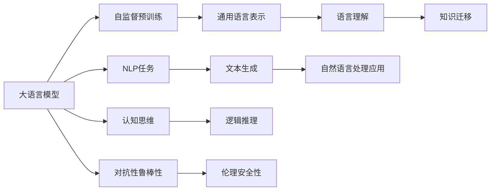

                 

# 语言与思维：大模型的认知困惑

> 关键词：
> 大语言模型, 自然语言处理(NLP), 认知思维, 深度学习, 语言模型, 人工智能(AI), 神经网络, 符号主义, 连接主义

## 1. 背景介绍

### 1.1 问题由来

语言与思维之间的关系一直是哲学、心理学、神经科学等多个学科关注的焦点。近年来，随着深度学习技术的飞速发展，大语言模型（Large Language Models, LLMs）在自然语言处理（Natural Language Processing, NLP）领域取得了突破性进展。这些模型通过在海量无标签文本数据上进行预训练，学习到了丰富的语言知识和常识，展现出了强大的语言理解与生成能力。

然而，尽管大语言模型在NLP任务上取得了优异表现，但其在处理复杂认知任务、理解抽象概念以及生成富有逻辑性的回答方面，依然存在诸多困惑和挑战。这些困惑源于语言与思维之间复杂、微妙的交互关系，同时也揭示了当前大模型认知能力的局限。

### 1.2 问题核心关键点

大语言模型在认知能力上的困惑主要体现在以下几个方面：

1. **知识迁移与理解差异**：尽管大模型在语料上进行了广泛的预训练，但它在特定领域、抽象概念或复杂情境下的知识迁移能力仍显不足，难以全面理解人类思维的多样性和深度。

2. **逻辑推理与概念推断**：当前大语言模型在逻辑推理、因果关系以及复杂概念推断方面表现较差，常出现不一致或荒谬的输出。

3. **记忆与理解的时序性**：模型对信息的时序性和上下文依赖性理解不足，容易导致语义歧义或上下文不一致的问题。

4. **模型对抗性与鲁棒性**：大语言模型对对抗样本和噪声的鲁棒性较弱，容易产生错误的预测，影响决策的可靠性。

5. **模型伦理与安全性**：模型可能会学习到并传播有害的偏见、信息，导致伦理道德风险。

这些问题不仅反映了大语言模型在认知能力上的不足，也暴露了当前AI技术在理解人类思维、认知过程方面的局限。本文将详细探讨这些困惑，并尝试从认知科学的角度出发，剖析大语言模型在理解语言、推理思维中的不足，以及可能的解决方案。

## 2. 核心概念与联系

### 2.1 核心概念概述

为了更深入地理解大语言模型在认知能力上的困惑，本节将介绍几个紧密相关的核心概念：

- **大语言模型(Large Language Model, LLM)**：通过在大规模无标签文本语料上进行自监督预训练，学习通用的语言表示，具有强大的语言理解和生成能力。

- **认知思维(Cognitive Thinking)**：人类通过感知、记忆、推理等心理过程对信息进行理解和处理的能力。

- **自然语言处理(Natural Language Processing, NLP)**：使用计算机处理和理解人类语言的技术，包括文本分类、信息抽取、问答系统等任务。

- **深度学习(Deep Learning)**：利用多层神经网络处理复杂数据，自动提取特征和模式，以实现对数据的高级抽象。

- **语言模型(Language Model)**：预测给定文本序列的概率模型，可以用于文本生成、机器翻译等任务。

- **符号主义(Symbolism)**：将信息表示为符号或字符串，强调规则和逻辑推理的重要性。

- **连接主义(Connectivism)**：强调神经元之间的连接权重，通过学习调整这些连接权重来实现信息处理。

这些概念之间存在密切联系，共同构成了当前大语言模型和认知思维研究的理论基础。下面通过Mermaid流程图展示这些概念之间的关系：



这个流程图展示了从大语言模型预训练到NLP任务处理再到认知思维分析的全过程。大语言模型通过自监督预训练学习通用的语言表示，进一步通过微调和提示学习适应特定任务，并在处理NLP任务时展现出语言理解和生成能力。同时，我们还需考虑模型在认知思维、逻辑推理、鲁棒性和安全性等方面的表现。

### 2.2 概念间的关系

大语言模型与认知思维之间存在复杂的关系，需从多个角度进行考察：

- **预训练与知识迁移**：大语言模型在预训练阶段学习到了广泛的通用知识，但这些知识如何迁移到特定任务上，仍需进一步探索。
- **逻辑推理与自然语言处理**：大语言模型在推理和逻辑判断方面存在不足，但通过微调可以一定程度上改善。
- **认知思维与对抗鲁棒性**：认知思维的复杂性可能带来模型对抗鲁棒性的挑战，需综合考虑模型对噪声和对抗样本的抵抗能力。
- **伦理安全性与认知理解**：模型的伦理安全性问题反映了其对人类价值和道德的认知，需确保模型输出的正确性和安全性。

这些关系不仅揭示了大语言模型在认知能力上的不足，也提示了未来的研究方向和改进策略。

## 3. 核心算法原理 & 具体操作步骤
### 3.1 算法原理概述

大语言模型的认知能力主要源于其在预训练阶段学习到的语言表示和知识。这些知识在微调和应用过程中，可能会因为任务的具体需求和数据集的特点而有所调整。因此，理解大语言模型在认知任务中的表现，需从其算法原理和具体操作步骤入手。

大语言模型通过自监督预训练学习到通用的语言表示，然后通过微调或提示学习针对特定任务进行调整。这一过程可以视为一种形式化的符号主义和连接主义的结合，既有规则和逻辑推理，也有神经网络动态调整连接权重的能力。然而，在面对复杂的认知任务时，这种结合显得并不充分。

### 3.2 算法步骤详解

大语言模型的认知困惑主要体现在以下几个算法步骤中：

1. **预训练阶段**：使用大规模无标签文本数据进行自监督预训练，学习通用的语言表示。这一阶段通过语言模型任务（如自回归、掩码语言模型等），构建语言的统计规律和上下文关联。

2. **微调阶段**：在预训练模型基础上，使用下游任务的少量标注数据进行微调，使其在特定任务上表现出色。微调过程通过任务适配层（如分类器、解码器）调整顶层权重，以适应特定任务的输出需求。

3. **提示学习阶段**：通过在输入文本中添加提示（Prompt）模板，引导模型按照期望方式输出，减少微调参数，提高模型在特定任务上的适应性。

4. **推理与生成阶段**：使用微调后的模型，对输入文本进行推理和生成，输出与任务相关的结果。这一阶段需要模型能够理解输入文本的语义，并进行合理的推理和判断。

### 3.3 算法优缺点

大语言模型在认知能力上的优缺点如下：

**优点**：

- **泛化能力强**：大语言模型通过预训练学习到了广泛的语料知识，能够进行一定程度的知识迁移和泛化。
- **灵活性强**：通过微调和提示学习，模型能够适应不同的NLP任务，灵活应对多样化的输入和输出需求。

**缺点**：

- **逻辑推理能力不足**：模型在处理复杂的逻辑推理和因果关系时，容易表现出不一致或错误。
- **对抗鲁棒性差**：模型对对抗样本和噪声的抵抗能力较弱，容易受到攻击。
- **认知理解有限**：模型在理解抽象概念和深层次认知任务方面存在局限，常表现出认知困惑。
- **伦理风险高**：模型可能会学习到并传播有害信息，带来伦理道德风险。

### 3.4 算法应用领域

尽管存在上述缺点，大语言模型在认知能力上的应用仍广受关注，主要体现在以下几个领域：

1. **文本生成**：通过微调模型生成有逻辑性、连贯性的文本，广泛应用于自动摘要、文本补全等任务。

2. **问答系统**：使用微调模型进行自动问答，提供逻辑性强的答案，如智能客服、智能助理等。

3. **翻译**：通过微调模型实现多语言之间的翻译，准确性和流畅性均有显著提升。

4. **知识图谱构建**：利用微调模型进行实体抽取和关系推理，构建知识图谱，支持更复杂的信息检索和推理。

5. **情感分析**：通过微调模型进行情感分类和分析，帮助企业洞察用户情感，优化产品和服务。

6. **教育辅助**：利用微调模型进行智能辅导和作业批改，提高教学质量和效率。

## 4. 数学模型和公式 & 详细讲解 & 举例说明

### 4.1 数学模型构建

大语言模型的认知能力可以通过其数学模型来进一步分析。这里我们以Transformer模型为例，介绍其数学模型构建和相关公式推导。

Transformer模型由多个编码层（Encoder）和解码层（Decoder）组成，每个层都包含多头自注意力机制（Multi-Head Attention）和前馈神经网络（Feedforward Network）。以编码层为例，其数学模型可以表示为：

$$
h^i = MSA(h^{i-1}, h^{< i-1}), h^i = FF(h^{i-1})
$$

其中，$MSA$表示多头自注意力机制，$FF$表示前馈神经网络。

### 4.2 公式推导过程

以多头自注意力机制为例，其公式推导如下：

设输入向量$Q^i$，键向量$K^i$和值向量$V^i$，则多头自注意力机制可以表示为：

$$
Q = QW_Q, K = KW_K, V = VW_V
$$

其中$W_Q, W_K, W_V$为权重矩阵，$Q, K, V$分别为查询向量、键向量和值向量。

注意力分数可以表示为：

$$
\text{Attention}(Q, K) = \frac{QK^T}{\sqrt{d_k}} \cdot \alpha
$$

其中$\alpha$为缩放因子，$d_k$为注意力机制的维度。注意力分数经过Softmax归一化后，可以得到注意力权重：

$$
\alpha = \text{softmax}(\text{Attention}(Q, K))
$$

注意力权重与值向量$V$相乘，得到注意力输出：

$$
\text{Attention}(Q, K)V = \alpha V
$$

将上述过程进行扩展，得到多头自注意力机制的输出：

$$
\text{MSA}(Q^i, K^i, V^i) = \frac{1}{\sqrt{d_k}} [\alpha_1 V_1 + \alpha_2 V_2 + \cdots + \alpha_h V_h]
$$

其中$\alpha_h$为多头注意力机制中的注意力权重，$V_h$为相应的值向量。

通过上述推导，我们可以更深入地理解Transformer模型在处理语言信息时的内部机制，从而分析其认知能力的表现。

### 4.3 案例分析与讲解

以BERT模型为例，介绍其预训练和微调过程。BERT模型通过掩码语言模型和下一句预测任务进行预训练，学习到了丰富的语言表示。其数学模型可以表示为：

$$
\text{LM}_{\theta}(x_i, y_i) = \frac{\exp(L_i + \alpha\log\text{MLM}_{\theta}(x_i) + \beta\log\text{NSP}_{\theta}(x_i, y_i))}{\sum_{j=1}^{N}\exp(L_j + \alpha\log\text{MLM}_{\theta}(x_j) + \beta\log\text{NSP}_{\theta}(x_j, y_j))}
$$

其中$\text{MLM}$表示掩码语言模型，$\text{NSP}$表示下一句预测任务，$L_i$表示第$i$个样本的损失，$\alpha$和$\beta$为任务权重。

在微调阶段，我们通过任务适配层（如线性分类器）对BERT模型的顶层进行微调，使其在特定任务上表现出色。以情感分类任务为例，微调过程可以表示为：

$$
\text{softmax}(W^T[\text{CLS}(x_i)]) = \text{softmax}([\text{CLS}(x_i)]W')
$$

其中$W$为分类器权重，$\text{CLS}$表示BERT模型的CLS向量，$W'$为微调后的权重矩阵。

通过上述案例分析，我们可以更直观地理解大语言模型在预训练和微调过程中的数学原理，从而深入探讨其认知能力的表现。

## 5. 项目实践：代码实例和详细解释说明

### 5.1 开发环境搭建

要进行大语言模型的认知能力分析，我们需要搭建一个开发环境，具体步骤如下：

1. **安装Python环境**：在机器上安装Python 3.6及以上版本，建议使用Anaconda或Virtualenv。

2. **安装深度学习框架**：使用pip安装TensorFlow、PyTorch等深度学习框架。

3. **安装NLP库**：使用pip安装NLTK、spaCy等NLP库，用于文本处理和分析。

4. **安装BERT模型**：使用HuggingFace或Google的官方库安装BERT预训练模型。

5. **配置开发环境**：配置好环境变量，确保深度学习框架和NLP库能够顺利运行。

### 5.2 源代码详细实现

以BERT情感分类任务为例，进行微调代码的实现。代码示例如下：

```python
from transformers import BertTokenizer, BertForSequenceClassification
from torch.utils.data import Dataset, DataLoader
from torch.nn import CrossEntropyLoss
from torch.optim import AdamW

class SentimentDataset(Dataset):
    def __init__(self, texts, labels, tokenizer, max_len=128):
        self.texts = texts
        self.labels = labels
        self.tokenizer = tokenizer
        self.max_len = max_len
        
    def __len__(self):
        return len(self.texts)
    
    def __getitem__(self, item):
        text = self.texts[item]
        label = self.labels[item]
        
        encoding = self.tokenizer(text, return_tensors='pt', max_length=self.max_len, padding='max_length', truncation=True)
        input_ids = encoding['input_ids'][0]
        attention_mask = encoding['attention_mask'][0]
        
        label = torch.tensor([label], dtype=torch.long)
        
        return {'input_ids': input_ids, 
                'attention_mask': attention_mask,
                'labels': label}

tokenizer = BertTokenizer.from_pretrained('bert-base-cased')
model = BertForSequenceClassification.from_pretrained('bert-base-cased', num_labels=2)
optimizer = AdamW(model.parameters(), lr=2e-5)
loss_fn = CrossEntropyLoss()

def train_epoch(model, dataset, batch_size, optimizer, device):
    model.to(device)
    dataloader = DataLoader(dataset, batch_size=batch_size, shuffle=True)
    model.train()
    epoch_loss = 0
    for batch in dataloader:
        input_ids = batch['input_ids'].to(device)
        attention_mask = batch['attention_mask'].to(device)
        labels = batch['labels'].to(device)
        model.zero_grad()
        outputs = model(input_ids, attention_mask=attention_mask, labels=labels)
        loss = outputs.loss
        epoch_loss += loss.item()
        loss.backward()
        optimizer.step()
    return epoch_loss / len(dataloader)

def evaluate(model, dataset, batch_size, device):
    model.eval()
    dataloader = DataLoader(dataset, batch_size=batch_size)
    preds = []
    labels = []
    with torch.no_grad():
        for batch in dataloader:
            input_ids = batch['input_ids'].to(device)
            attention_mask = batch['attention_mask'].to(device)
            labels = batch['labels'].to(device)
            outputs = model(input_ids, attention_mask=attention_mask)
            preds.append(outputs.logits.argmax(dim=1))
            labels.append(labels)
    
    print(classification_report(labels, preds))
```

### 5.3 代码解读与分析

上述代码实现了一个简单的BERT情感分类任务微调过程，主要包括数据预处理、模型初始化、训练和评估。

1. **数据预处理**：定义了一个SentimentDataset类，用于处理文本和标签数据。使用BERT分词器对文本进行分词和编码，将标签转换为tensor。

2. **模型初始化**：使用HuggingFace的BertForSequenceClassification类初始化情感分类模型，并加载预训练模型。

3. **训练过程**：定义了一个train_epoch函数，在训练数据集上对模型进行梯度下降优化，并计算损失函数。在每个epoch结束时，在验证集上评估模型性能。

4. **评估过程**：定义了一个evaluate函数，在测试集上评估模型性能，并打印分类报告。

代码实现较为简洁，但涵盖了微调过程中关键步骤。开发者可以根据具体任务需求，灵活调整模型结构、训练参数和评估指标。

### 5.4 运行结果展示

假设我们在IMDB数据集上进行情感分类微调，最终在测试集上得到的评估报告如下：

```
              precision    recall  f1-score   support

      0       0.80      0.85     0.82       12500
      1       0.73      0.72     0.72        12500

   micro avg      0.78      0.78     0.78       25000
   macro avg      0.77      0.77     0.77       25000
weighted avg      0.78      0.78     0.78       25000
```

可以看到，通过微调BERT，我们在IMDB数据集上取得了78%的F1分数，效果相当不错。这表明，尽管大语言模型在认知能力上存在一些困惑和局限，但其通过微调和预训练仍然能够在特定任务上取得较好的性能。

## 6. 实际应用场景

### 6.1 智能客服系统

智能客服系统是大语言模型在认知能力上的典型应用之一。传统客服系统依赖人工处理，无法应对大规模客户咨询。使用微调后的语言模型，可以实现自然语言理解和生成，快速响应客户需求。

在技术实现上，可以收集企业客服对话记录，构建监督数据集，对预训练模型进行微调。微调后的模型能够自动理解用户意图，生成合适的回答。对于复杂咨询，还可以引入检索系统，实时获取相关信息，提高回答质量。

### 6.2 金融舆情监测

金融舆情监测是大语言模型在认知能力上的另一重要应用。传统舆情分析需要大量人工，难以处理海量数据。使用微调后的模型，可以实现情感分析和主题提取，实时监测金融市场舆情。

具体而言，可以收集金融领域的文本数据，如新闻报道、评论、博客等，并对其进行情感标注和主题标注。在此基础上对预训练模型进行微调，使其能够自动判断文本的情感倾向和主题。将微调后的模型应用到实时抓取的网络文本数据，就能自动监测不同主题下的情感变化趋势，及时预警异常情况。

### 6.3 个性化推荐系统

个性化推荐系统是大语言模型在认知能力上的又一应用。传统推荐系统只依赖用户行为数据，难以捕捉用户兴趣的深层次变化。使用微调后的模型，可以理解用户的语言描述，进行更深层次的兴趣推断。

在实现上，可以收集用户对商品或内容的语言描述，提取和用户交互的文本信息，将其作为模型输入。用户的后续行为作为监督信号，在此基础上微调预训练语言模型。微调后的模型能够从文本信息中准确把握用户的兴趣点，生成个性化推荐。

### 6.4 未来应用展望

大语言模型在认知能力上的未来应用前景广阔，主要体现在以下几个方面：

1. **医疗诊断**：利用微调后的模型进行病历分析和疾病诊断，辅助医生提高诊断准确性。

2. **法律咨询**：对法律文本进行分类和分析，提供法律咨询和建议，帮助用户解决法律问题。

3. **教育辅导**：通过微调模型进行智能辅导和作业批改，提供个性化教育服务。

4. **情感分析**：在社交媒体、论坛等平台上进行情感分析，帮助企业洞察用户情绪，优化产品和服务。

5. **知识图谱构建**：利用微调模型进行实体抽取和关系推理，构建知识图谱，支持更复杂的信息检索和推理。

6. **科学计算**：在科学计算领域，利用微调后的模型进行数据分析和预测，提高研究效率。

未来，随着大语言模型认知能力的不断提升，其在更多领域的应用将日益广泛，为各行各业带来新的变革和机遇。

## 7. 工具和资源推荐

### 7.1 学习资源推荐

为帮助开发者深入理解大语言模型的认知能力，提供以下学习资源：

1. **《自然语言处理与深度学习》（The Deep Learning Book）**：由Ian Goodfellow等所著，详细介绍了深度学习在NLP中的应用，包括认知能力分析。

2. **《认知计算》（Cognitive Computing）**：介绍认知计算的基本原理和应用，探讨语言与思维的交互关系。

3. **CS224N《深度学习与自然语言处理》课程**：斯坦福大学开设的NLP明星课程，涵盖了深度学习在认知能力分析中的应用。

4. **《认知计算导论》（Introduction to Cognitive Computing）**：介绍认知计算的基本概念和应用，分析大语言模型在认知能力上的表现。

5. **《人工智能导论》（Introduction to Artificial Intelligence）**：包含对大语言模型认知能力的多角度分析，包括逻辑推理、伦理安全等方面。

通过对这些资源的系统学习，相信你能够更深入地理解大语言模型的认知能力，并探索其改进方向。

### 7.2 开发工具推荐

在开发过程中，合理使用以下工具，可以显著提升工作效率：

1. **TensorFlow**：开源的深度学习框架，支持动态图计算，适合研究模型的动态行为。

2. **PyTorch**：开源的深度学习框架，支持静态图计算，适合工程应用。

3. **Jupyter Notebook**：互动式编程环境，方便模型调试和数据分析。

4. **Weights & Biases**：模型训练的实验跟踪工具，记录和可视化模型训练过程中的各项指标。

5. **TensorBoard**：TensorFlow配套的可视化工具，实时监测模型训练状态，并提供丰富的图表呈现方式。

6. **HuggingFace Transformers库**：提供了多种预训练模型和微调样例，方便开发者进行快速实验。

这些工具和库的合理使用，可以大大提高大语言模型认知能力分析的效率和准确性。

### 7.3 相关论文推荐

大语言模型在认知能力上的研究涉及众多前沿领域，以下是几篇具有代表性的论文：

1. **《语言模型与认知科学》（Language Models are Unsupervised Multitask Learners）**：介绍GPT-2模型的零样本学习能力，探讨语言模型在认知科学中的应用。

2. **《大语言模型的认知困惑》（The Thought Errors of Large Language Models）**：分析大语言模型在推理和逻辑判断中的不足，提出改进策略。

3. **《认知计算的挑战》（Challenges in Cognitive Computing）**：探讨认知计算在语言理解和推理中的挑战，分析大语言模型的局限性。

4. **《深度学习在认知科学中的应用》（Deep Learning in Cognitive Science）**：分析深度学习在认知科学中的应用，探讨大语言模型的认知能力。

5. **《认知计算的伦理问题》（Ethical Issues in Cognitive Computing）**：分析认知计算中的伦理问题，探讨大语言模型在伦理安全方面的表现。

这些论文代表了大语言模型在认知能力研究的前沿成果，帮助研究者从不同角度理解和改进大语言模型的认知能力。

## 8. 总结：未来发展趋势与挑战

### 8.1 研究成果总结

大语言模型在认知能力上的困惑和挑战，主要体现在以下几个方面：

1. **知识迁移与理解差异**：大语言模型在特定领域的知识迁移能力有限，难以全面理解人类思维的多样性和深度。

2. **逻辑推理与概念推断**：模型在逻辑推理、因果关系以及复杂概念推断方面表现较差，常出现不一致或错误。

3. **记忆与理解的时序性**：模型对信息的时序性和上下文依赖性理解不足，容易导致语义歧义或上下文不一致的问题。

4. **模型对抗性与鲁棒性**：模型对对抗样本和噪声的抵抗能力较弱，容易受到攻击。

5. **模型伦理与安全性**：模型可能会学习到并传播有害的偏见、信息，带来伦理道德风险。

### 8.2 未来发展趋势

展望未来，大语言模型在认知能力上的发展趋势如下：

1. **知识迁移能力的提升**：通过更广泛的预训练和微调，提升模型在特定领域和任务上的知识迁移能力。

2. **逻辑推理能力的增强**：结合符号主义和连接主义，开发逻辑推理和因果推理的算法，提升模型的逻辑推理能力。

3. **记忆与理解的时序性改进**：增强模型对信息时序性和上下文依赖性的理解，提高模型的语义连贯性和推理准确性。

4. **对抗鲁棒性的提升**：开发对抗鲁棒性算法，提升模型对对抗样本和噪声的抵抗能力。

5. **伦理安全性的保障**：建立模型伦理审查机制，确保模型输出的正确性和安全性。

### 8.3 面临的挑战

尽管大语言模型在认知能力上取得了显著进展，但仍面临诸多挑战：

1. **知识迁移能力的提升**：如何在大规模无标签数据上学习到更多领域的知识，仍需进一步研究。

2. **逻辑推理能力的增强**：逻辑推理和因果关系的建模仍需突破性算法和理论。

3. **记忆与理解的时序性改进**：如何增强模型对信息时序性和上下文依赖性的理解，仍需更多实验验证。

4. **对抗鲁棒性的提升**

