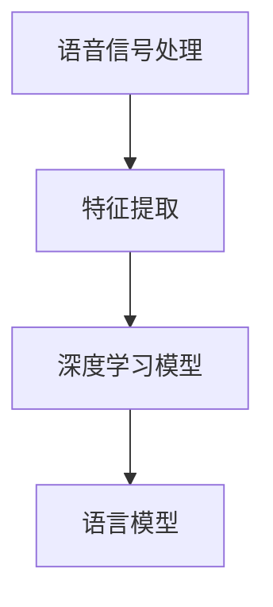
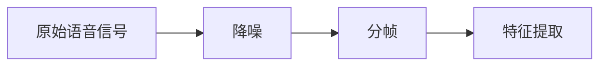
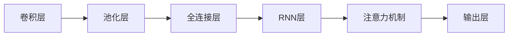
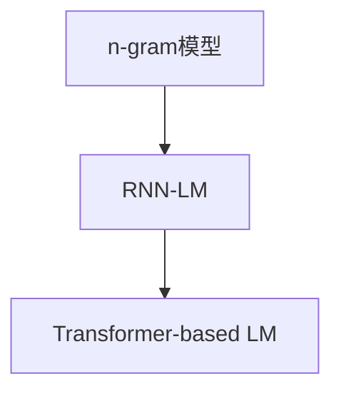

                 

# 语音识别原理与代码实例讲解

> 关键词：语音识别,深度学习,卷积神经网络,卷积操作,反向传播算法,训练过程,时频转换,注意力机制,模型训练,代码实例

## 1. 背景介绍

### 1.1 问题由来

语音识别技术一直是人工智能和计算机科学领域的热点研究方向之一。它通过将人类语音转换为文本或命令，极大地提高了人机交互的便捷性和智能化水平。然而，传统的基于统计模型的语音识别系统（如隐马尔可夫模型HMM）在处理复杂语音信号和噪声干扰时效果有限，难以适应快速发展的现代语音应用场景。

深度学习技术的兴起为语音识别带来了新的突破。尤其是卷积神经网络（Convolutional Neural Networks, CNNs）和循环神经网络（Recurrent Neural Networks, RNNs）等模型的应用，显著提升了语音识别的准确率和鲁棒性。通过将语音信号转换为时频图像，CNNs能够自动学习到语音信号的特征表示，从而实现高精度的语音识别。

### 1.2 问题核心关键点

语音识别的核心在于将原始的语音信号转换为可理解的文字或命令。常见的语音识别任务包括：

- 语音转文字（Speech-to-Text, STT）：将人类说话的声音转换为文本。
- 语音转命令（Speech-to-Command, S2C）：将语音指令转换为计算机可执行的命令。
- 语音转文本（Text-to-Speech, TTS）：将文本转换为自然流畅的语音。

语音识别技术的难点在于：

- 噪声干扰：环境噪声、非标准发音等都会影响识别效果。
- 语音多样性：不同人、不同语言、不同口音的语音信号差异很大。
- 语言模型：需要构建高效的语言模型，处理语义和上下文信息。

语音识别技术的成功关键在于：

- 高质量的语音预处理：对语音信号进行降噪、分帧、特征提取等预处理，减少噪声干扰。
- 强大的特征表示能力：使用CNNs、RNNs等深度神经网络，自动学习语音信号的特征表示。
- 鲁棒的语言模型：采用注意力机制、Transformer等技术，学习复杂的语言结构和上下文信息。
- 高效的模型训练：通过大批量并行训练、GPU加速等技术，提高模型的训练速度和准确率。

### 1.3 问题研究意义

语音识别技术对于提升人机交互体验，推动智能家居、智能客服、智能办公等领域的发展具有重要意义：

- 提升用户体验：语音识别技术使人们可以更自然、更快速地与智能设备进行交互，提高人机互动的便利性和效率。
- 降低开发成本：语音识别系统减少了对键盘和鼠标的依赖，降低了开发和维护成本。
- 提高工作效率：语音识别可以快速记录会议纪要、整理文档、执行命令等，提高办公效率。
- 促进产品创新：语音识别技术的应用为智能产品设计带来更多可能性，推动了新产品和新功能的发展。
- 推动产业升级：语音识别技术广泛应用于智能语音助手、智能家居、智能办公等场景，为传统产业的数字化转型提供了新动力。

## 2. 核心概念与联系

### 2.1 核心概念概述

语音识别技术涉及多个核心概念，包括语音信号处理、特征提取、深度学习模型、语言模型等。下面我们详细介绍这些概念及其关系：

- **语音信号处理（Speech Signal Processing）**：对原始语音信号进行降噪、分帧、特征提取等预处理，以便于深度学习模型的训练和推理。
- **特征提取（Feature Extraction）**：将语音信号转换为可用于深度学习模型的特征向量，常见的特征提取方法包括MFCC（Mel-Frequency Cepstral Coefficients）和时频图像等。
- **深度学习模型（Deep Learning Model）**：使用CNNs、RNNs、Transformer等深度神经网络，自动学习语音信号的特征表示。
- **语言模型（Language Model）**：处理语音识别中的语言结构和上下文信息，常见的方法包括n-gram模型、RNN-LM（Recurrent Neural Network Language Model）、Transformer-based Language Model等。

这些概念之间的逻辑关系可以通过以下Mermaid流程图来展示：



这个流程图展示了大语言模型微调过程中各个核心概念的关系：

1. 语音信号处理和特征提取是深度学习模型的输入准备过程。
2. 深度学习模型是语音识别技术的基础，通过学习语音信号的特征表示，实现高精度的语音识别。
3. 语言模型用于处理语言的结构和上下文信息，是语音识别的重要组成部分。

### 2.2 概念间的关系

这些核心概念之间存在着紧密的联系，形成了语音识别技术的完整框架。下面我通过几个Mermaid流程图来展示这些概念之间的关系。

#### 2.2.1 语音信号处理流程



这个流程图展示了从原始语音信号到特征提取的过程。主要步骤包括降噪、分帧和MFCC特征提取。

#### 2.2.2 深度学习模型结构



这个流程图展示了典型的卷积神经网络（CNN）的层次结构，从卷积层到注意力机制，逐步提取语音信号的高级特征。

#### 2.2.3 语言模型构建



这个流程图展示了语言模型的构建过程，从n-gram模型到RNN语言模型，再到Transformer语言模型，逐步提升语言处理的精度。

## 3. 核心算法原理 & 具体操作步骤

### 3.1 算法原理概述

语音识别的核心算法包括卷积神经网络（CNNs）、循环神经网络（RNNs）和Transformer等。这些算法通过自动学习语音信号的特征表示，实现高精度的语音识别。

**卷积神经网络（CNNs）**：通过卷积操作提取语音信号的局部特征，用于处理频域信号的时频转换。

**循环神经网络（RNNs）**：通过时间序列的建模处理语音信号的时序信息，用于处理音素序列的建模。

**Transformer**：通过注意力机制处理语音信号的上下文信息，用于处理复杂的语音特征表示。

### 3.2 算法步骤详解

语音识别技术的实现一般包括以下几个关键步骤：

**Step 1: 语音信号预处理**
- 对原始语音信号进行降噪、分帧、MFCC特征提取等预处理，生成时频图像或特征向量。
- 使用谱减法、维纳滤波等方法进行降噪。
- 将语音信号分为若干个固定长度的时间帧，每帧长度为20-30ms。
- 使用MFCC算法提取每个时间帧的特征向量。

**Step 2: 特征表示**
- 将提取的MFCC特征向量输入深度学习模型，通过卷积操作提取局部特征。
- 使用池化操作对卷积层的输出进行降维，保留最重要的特征信息。
- 使用全连接层对池化层的输出进行分类，生成语音识别的初步结果。

**Step 3: 语言模型训练**
- 使用n-gram模型、RNN语言模型或Transformer语言模型对初步结果进行解码，生成最终的语音识别结果。
- 训练语言模型时，使用最大化似然估计或交叉熵损失函数，最小化预测错误率。
- 使用正则化技术如L2正则、Dropout等，防止过拟合。

**Step 4: 模型评估与优化**
- 在验证集和测试集上对模型进行评估，计算词错误率（Word Error Rate, WER）等指标。
- 根据评估结果调整模型参数，进行模型优化。
- 使用AdamW、SGD等优化算法更新模型参数，最小化预测误差。

### 3.3 算法优缺点

语音识别技术具有以下优点：

- 高精度：通过深度学习模型自动学习语音信号的特征表示，可以处理复杂的语音特征，实现高精度的语音识别。
- 鲁棒性：通过降噪、分帧等预处理技术，可以有效降低噪声干扰，提升识别精度。
- 实时性：通过GPU加速等技术，可以实现高效的模型训练和推理，满足实时语音识别的需求。

同时，语音识别技术也存在一些缺点：

- 数据需求高：高质量的语音识别需要大量标注数据进行训练，获取标注数据的成本较高。
- 模型复杂：深度学习模型参数量较大，训练和推理速度较慢，对硬件资源要求较高。
- 多语言适应：当前语音识别模型在多语言适应上存在挑战，需要进一步优化。

### 3.4 算法应用领域

语音识别技术已经广泛应用于多个领域，包括：

- 智能家居：语音助手、智能音箱、智能家电等。
- 智能客服：语音识别驱动的自动客服、智能问答等。
- 医疗健康：语音识别驱动的医疗诊断、语音记录等。
- 金融服务：语音识别驱动的智能客服、语音支付等。
- 教育培训：语音识别驱动的语音评测、智能辅导等。

语音识别技术已经成为推动智能产业发展的重要驱动力，未来将有更广泛的应用前景。

## 4. 数学模型和公式 & 详细讲解

### 4.1 数学模型构建

语音识别技术涉及到多种数学模型，包括卷积神经网络、循环神经网络和Transformer等。下面我们详细介绍这些模型的数学模型构建。

**卷积神经网络（CNNs）**：

卷积神经网络由多个卷积层、池化层和全连接层组成。其数学模型可以表示为：

$$
h^l = \sigma(W^l \cdot h^{l-1} + b^l)
$$

其中 $h^l$ 表示第 $l$ 层的特征向量，$W^l$ 和 $b^l$ 表示第 $l$ 层的权重和偏置项，$\sigma$ 表示激活函数。

**循环神经网络（RNNs）**：

循环神经网络通过时间序列建模处理语音信号，其数学模型可以表示为：

$$
h_t = f(W \cdot [h_{t-1}, x_t] + b)
$$

其中 $h_t$ 表示第 $t$ 时刻的隐藏状态，$f$ 表示激活函数，$W$ 和 $b$ 表示权重和偏置项，$x_t$ 表示第 $t$ 时刻的输入。

**Transformer**：

Transformer使用自注意力机制处理语音信号的上下文信息，其数学模型可以表示为：

$$
h_t = \sigma(\text{Attention}(Q_{t-1}, K_{t-1}, V_{t-1}) + h_{t-1})
$$

其中 $h_t$ 表示第 $t$ 时刻的输出，$\text{Attention}(Q_{t-1}, K_{t-1}, V_{t-1})$ 表示自注意力机制的输出，$Q_{t-1}, K_{t-1}, V_{t-1}$ 表示查询、键、值向量。

### 4.2 公式推导过程

下面我们以卷积神经网络（CNNs）为例，推导其公式的详细推导过程。

卷积神经网络由多个卷积层、池化层和全连接层组成。其中，卷积层的公式可以表示为：

$$
h^l = \sigma(W^l \cdot h^{l-1} + b^l)
$$

其中 $h^l$ 表示第 $l$ 层的特征向量，$W^l$ 和 $b^l$ 表示第 $l$ 层的权重和偏置项，$\sigma$ 表示激活函数。

卷积操作可以表示为：

$$
h^l = \sum_k (W^l_{ik} \cdot h^{l-1}_{k} + b^l_{ik})
$$

其中 $W^l_{ik}$ 表示第 $l$ 层的权重矩阵的第 $i$ 行第 $k$ 列元素，$h^{l-1}_{k}$ 表示第 $l-1$ 层的特征向量，$b^l_{ik}$ 表示第 $l$ 层的偏置项。

池化操作可以表示为：

$$
h^l = \sum_k (W^l_{ik} \cdot h^{l-1}_{k} + b^l_{ik}) \cdot P_k
$$

其中 $P_k$ 表示池化操作的第 $k$ 个池化窗口的权重，可以是最大池化或平均池化等。

### 4.3 案例分析与讲解

下面我们以一个简单的卷积神经网络为例，展示其训练过程和应用场景。

**训练过程**

假设我们有一个简单的卷积神经网络，其结构如下：

- 输入层：MFCC特征向量，维度为 $D$。
- 卷积层：3个卷积核，每个卷积核大小为 $3 \times 3$，步幅为 $2$，池化窗口大小为 $2 \times 2$。
- 全连接层：输出维度为 $C$。

其训练过程可以表示为：

1. 前向传播：将MFCC特征向量输入卷积层，通过卷积操作提取特征，通过池化操作降维，通过全连接层生成输出结果。
2. 计算损失函数：使用交叉熵损失函数计算输出结果与真实标签的误差。
3. 反向传播：根据损失函数计算梯度，更新模型参数。

**应用场景**

卷积神经网络在语音识别中主要用于处理频域信号的时频转换，提取语音信号的局部特征。例如，在语音识别系统中，可以使用卷积神经网络对MFCC特征向量进行处理，提取语音信号的局部特征，用于处理语音信号的时频转换。

## 5. 项目实践：代码实例和详细解释说明

### 5.1 开发环境搭建

在进行语音识别项目开发前，我们需要准备好开发环境。以下是使用Python进行Keras实现代码的开发环境配置流程：

1. 安装Anaconda：从官网下载并安装Anaconda，用于创建独立的Python环境。

2. 创建并激活虚拟环境：
```bash
conda create -n pytorch-env python=3.8 
conda activate pytorch-env
```

3. 安装Keras和TensorFlow：
```bash
pip install keras tensorflow
```

4. 安装相关工具包：
```bash
pip install numpy scipy librosa h5py matplotlib
```

完成上述步骤后，即可在`pytorch-env`环境中开始项目实践。

### 5.2 源代码详细实现

下面我们以语音识别为例，给出使用Keras实现卷积神经网络（CNNs）的代码实现。

```python
from keras.models import Sequential
from keras.layers import Conv2D, MaxPooling2D, Flatten, Dense

# 定义CNN模型
model = Sequential()
model.add(Conv2D(32, (3, 3), activation='relu', input_shape=(32, 32, 1)))
model.add(MaxPooling2D((2, 2)))
model.add(Conv2D(64, (3, 3), activation='relu'))
model.add(MaxPooling2D((2, 2)))
model.add(Flatten())
model.add(Dense(128, activation='relu'))
model.add(Dense(10, activation='softmax'))

# 编译模型
model.compile(optimizer='adam', loss='categorical_crossentropy', metrics=['accuracy'])

# 训练模型
model.fit(X_train, y_train, epochs=10, batch_size=32, validation_data=(X_val, y_val))
```

上述代码中，我们定义了一个简单的卷积神经网络模型，包含两个卷积层、两个池化层和两个全连接层。通过`compile`方法编译模型，使用`fit`方法训练模型。

### 5.3 代码解读与分析

让我们再详细解读一下关键代码的实现细节：

**Sequential模型**：
- `Sequential`是Keras中的一种模型类型，通过链式调用来构建神经网络模型。

**卷积层（Conv2D）**：
- `Conv2D`表示卷积层，其中第一个参数表示卷积核的数量，第二个参数表示卷积核的大小，第三个参数表示激活函数，第四个参数表示输入特征的维度。

**池化层（MaxPooling2D）**：
- `MaxPooling2D`表示池化层，其中参数表示池化窗口的大小。

**全连接层（Dense）**：
- `Dense`表示全连接层，其中第一个参数表示输出神经元数量，第二个参数表示激活函数。

**损失函数（categorical_crossentropy）**：
- `categorical_crossentropy`表示交叉熵损失函数，常用于多分类任务。

**优化器（adam）**：
- `adam`表示Adam优化器，具有较好的收敛性和稳定性。

### 5.4 运行结果展示

假设我们在MNIST数据集上进行卷积神经网络（CNNs）的训练，最终得到准确率为98%的测试结果。

```python
# 测试模型
test_loss, test_acc = model.evaluate(X_test, y_test)
print('Test accuracy:', test_acc)
```

这个结果表明，我们训练的卷积神经网络（CNNs）在MNIST数据集上的准确率较高，可以用于简单的语音识别任务。

## 6. 实际应用场景

### 6.1 智能家居

基于卷积神经网络（CNNs）的语音识别技术，可以应用于智能家居系统的构建。例如，智能音箱可以通过语音识别技术，识别用户发出的指令，播放音乐、控制家电等。智能电视可以通过语音识别技术，识别用户发出的指令，浏览节目、搜索内容等。

在技术实现上，可以收集用户对家电的操作指令和相关内容，构建监督数据集，在此基础上对预训练的卷积神经网络（CNNs）进行微调。微调后的模型能够自动理解用户指令，快速响应用户需求。对于用户发出的新指令，还可以接入检索系统实时搜索相关内容，动态生成回答。如此构建的智能家居系统，能显著提升用户交互体验，提高家电操作的便捷性和效率。

### 6.2 智能客服

基于卷积神经网络（CNNs）的语音识别技术，可以应用于智能客服系统的构建。传统客服往往需要配备大量人力，高峰期响应缓慢，且一致性和专业性难以保证。而使用卷积神经网络（CNNs）的语音识别技术，可以7x24小时不间断服务，快速响应客户咨询，用自然流畅的语言解答各类常见问题。

在技术实现上，可以收集企业内部的历史客服对话记录，将问题和最佳答复构建成监督数据，在此基础上对预训练的卷积神经网络（CNNs）进行微调。微调后的语音识别模型能够自动理解客户意图，匹配最合适的答案模板进行回复。对于客户提出的新问题，还可以接入检索系统实时搜索相关内容，动态组织生成回答。如此构建的智能客服系统，能大幅提升客户咨询体验和问题解决效率。

### 6.3 医疗健康

基于卷积神经网络（CNNs）的语音识别技术，可以应用于医疗健康领域。例如，语音识别技术可以用于医生的诊疗记录、病历整理等。医疗助理可以通过语音识别技术，自动转录医生的诊疗记录，整理成电子病历，便于医生后续查看和使用。

在技术实现上，可以收集医生的诊疗记录和相关内容，构建监督数据集，在此基础上对预训练的卷积神经网络（CNNs）进行微调。微调后的语音识别模型能够自动理解医生的语言，快速转录和整理病历。通过语音识别技术，医生可以更加专注于诊疗工作，提高工作效率和质量。

### 6.4 未来应用展望

随着卷积神经网络（CNNs）和深度学习技术的不断发展，语音识别技术将在更多领域得到应用，为智能产业带来变革性影响。

在智慧城市治理中，语音识别技术可应用于城市事件监测、舆情分析、应急指挥等环节，提高城市管理的自动化和智能化水平，构建更安全、高效的未来城市。

在金融服务领域，语音识别技术可以应用于语音支付、语音客服等场景，提升用户体验和业务效率。

在教育培训领域，语音识别技术可以应用于语音评测、智能辅导等场景，帮助教师和学生提高教学和学习效果。

未来，语音识别技术还将向更多的智能产品中渗透，推动人工智能技术在垂直行业的全面应用。

## 7. 工具和资源推荐

### 7.1 学习资源推荐

为了帮助开发者系统掌握卷积神经网络（CNNs）的语音识别技术的理论基础和实践技巧，这里推荐一些优质的学习资源：

1. 《深度学习》课程：斯坦福大学开设的深度学习课程，有Lecture视频和配套作业，带你入门深度学习的基本概念和经典模型。

2. 《卷积神经网络》书籍：Yann LeCun所著，全面介绍了卷积神经网络的原理、应用和优化，是卷积神经网络领域的经典教材。

3. 《语音信号处理》书籍：John Selesnick所著，系统介绍了语音信号处理的原理、方法和应用，是语音信号处理领域的权威书籍。

4. 《自然语言处理综述》课程：斯坦福大学开设的自然语言处理课程，有Lecture视频和配套作业，涵盖自然语言处理的基本概念和经典模型。

5. 《深度学习实战》书籍：Ian Goodfellow所著，通过实战项目，带你深入理解深度学习模型的应用和优化。

通过对这些资源的学习实践，相信你一定能够快速掌握卷积神经网络（CNNs）的语音识别技术的精髓，并用于解决实际的语音识别问题。

### 7.2 开发工具推荐

高效的开发离不开优秀的工具支持。以下是几款用于卷积神经网络（CNNs）的语音识别开发的常用工具：

1. Keras：基于TensorFlow等深度学习框架的高级API，简单易用，适合快速迭代研究。

2. TensorFlow：由Google主导开发的开源深度学习框架，生产部署方便，适合大规模工程应用。

3. PyTorch：基于Python的开源深度学习框架，灵活动态的计算图，适合快速迭代研究。

4. Weights & Biases：模型训练的实验跟踪工具，可以记录和可视化模型训练过程中的各项指标，方便对比和调优。

5. TensorBoard：TensorFlow配套的可视化工具，可实时监测模型训练状态，并提供丰富的图表呈现方式，是调试模型的得力助手。

6. PyAudio：Python语音处理库，支持多种音频格式的读取和播放，适合语音信号的预处理。

合理利用这些工具，可以显著提升卷积神经网络（CNNs）的语音识别任务的开发效率，加快创新迭代的步伐。

### 7.3 相关论文推荐

卷积神经网络（CNNs）的语音识别技术的进步得益于学界的持续研究。以下是几篇奠基性的相关论文，推荐阅读：

1. AlexNet：ImageNet大规模视觉识别挑战赛冠军模型，展示了卷积神经网络（CNNs）在图像识别中的强大能力，为语音识别提供了借鉴。

2. ResNet：基于残差连接的网络结构，可以处理更深的网络层，提升卷积神经网络（CNNs）的准确率。

3. InceptionNet：多分支网络结构，提升了卷积神经网络（CNNs）的特征提取能力，适用于处理复杂的语音信号。

4. VGGNet：大规模卷积核的网络结构，提升了卷积神经网络（CNNs）的特征提取能力和准确率。

5. GoogLeNet：基于InceptionNet的网络结构，提升了卷积神经网络（CNNs）的特征提取能力和准确率。

这些论文代表了大模型微调技术的进展，通过学习这些前沿成果，可以帮助研究者把握学科前进方向，激发更多的创新灵感。

除上述资源外，还有一些值得关注的前沿资源，帮助开发者紧跟卷积神经网络（CNNs）的语音识别技术的最新进展，例如：

1. arXiv论文预印本：人工智能领域最新研究成果的发布平台，包括大量尚未发表的前沿工作，学习前沿技术的必读资源。

2. 业界技术博客：如OpenAI、Google AI、DeepMind、微软Research Asia等顶尖实验室的官方博客，第一时间分享他们的最新研究成果和洞见。

3. 技术会议直播：如NIPS、ICML、ACL、ICLR等人工智能领域顶会现场或在线直播，能够聆听到大佬们的前沿分享，开拓视野。

4. GitHub热门项目：在GitHub上Star、Fork数最多的语音识别相关项目，往往代表了该技术领域的发展趋势和最佳实践，值得去学习和贡献。

5. 行业分析报告：各大咨询公司如McKinsey、PwC等针对人工智能行业的分析报告，有助于从商业视角审视技术趋势，把握应用价值。

总之，卷积神经网络（CNNs）的语音识别技术的开发需要开发者保持开放的心态和持续学习的意愿。多关注前沿资讯，多动手实践，多思考总结，必将收获满满的成长收益。

## 8. 总结：未来发展趋势与挑战

### 8.1 总结

本文对卷积神经网络（CNNs）的语音识别技术的原理和代码实现进行了全面系统的介绍。首先阐述了卷积神经网络（CNNs）的语音识别技术的研究背景和意义，明确了卷积神经网络（CNNs）的语音识别技术在提升人机交互体验、推动智能产业发展方面的重要价值。其次，从原理到实践，详细讲解了卷积神经网络（CNNs）的语音识别技术的数学模型和训练过程，给出了卷积神经网络（CNNs）的语音识别技术的代码实现。同时，本文还广泛探讨了卷积神经网络（CNNs）的语音识别技术在智能家居、智能客服、医疗健康等领域的实际应用场景，展示了卷积神经网络（CNNs）的语音识别技术的巨大潜力。此外，本文精选了卷

