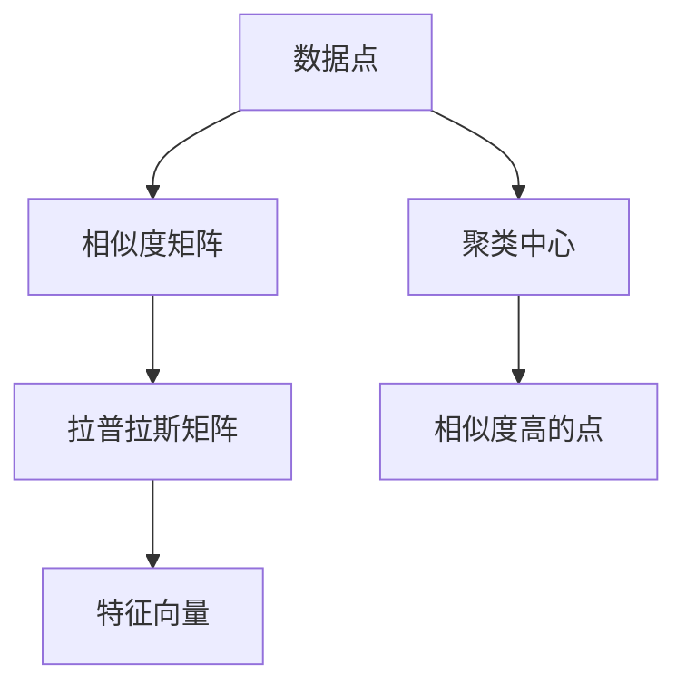
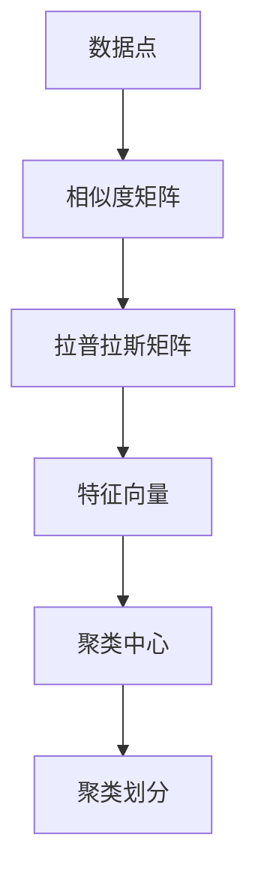

                 

## 1. 背景介绍

### 1.1 问题由来

聚类分析（Clustering）是数据挖掘中的一项重要技术，旨在将数据集划分为多个具有相似特征的群组，以发现数据中的潜在结构和模式。传统的聚类方法，如K-Means、层次聚类等，虽然简单高效，但在面对高维稀疏数据集时，容易陷入局部最优解，无法有效捕捉数据的内在结构。

谱聚类（Spectral Clustering）作为一类基于图论的聚类方法，通过构建相似度图和拉普拉斯矩阵（Laplacian Matrix），利用谱分解的方法对数据进行聚类。相较于传统的聚类方法，谱聚类能够更好地处理高维数据和复杂的非凸结构，尤其在数据集的密度不均匀、噪声较多或存在噪声的情况下表现更佳。

### 1.2 问题核心关键点

谱聚类的核心思想是将数据映射到一个低维空间中，通过求解其相似度矩阵的特征向量，将相似度最大的点聚为一类，从而实现聚类。该方法的关键点包括：

- **相似度矩阵构建**：通过计算数据点之间的相似度，构建相似度矩阵。
- **拉普拉斯矩阵构建**：对相似度矩阵进行标准化，得到拉普拉斯矩阵。
- **特征向量求解**：通过求解拉普拉斯矩阵的特征向量，得到数据的低维表示。
- **聚类划分**：根据特征向量的距离，将相似度高的点划分为同一类。

### 1.3 问题研究意义

谱聚类作为一种高效的聚类方法，对大数据、高维数据、复杂结构数据的聚类具有重要意义。它不仅能够处理大规模数据集，而且能够发现非凸结构中的数据分布模式，因此在图像分割、社区检测、文本聚类等应用中得到了广泛应用。

## 2. 核心概念与联系

### 2.1 核心概念概述

为了更好地理解谱聚类的核心思想，本节将介绍几个密切相关的核心概念：

- **相似度矩阵**：通过计算数据点之间的相似度，构建的二维矩阵。
- **拉普拉斯矩阵**：对相似度矩阵进行标准化后得到的矩阵。
- **特征向量**：拉普拉斯矩阵的特征向量，用于表示数据点的低维表示。
- **聚类中心**：数据点在低维空间中的聚类中心，表示为一组特征向量。

### 2.2 概念间的关系

这些核心概念之间的逻辑关系可以通过以下Mermaid流程图来展示：



这个流程图展示了大语言模型微调过程中各个核心概念的关系和作用：

1. 数据点通过相似度矩阵构建和拉普拉斯矩阵标准化得到低维表示。
2. 特征向量表示数据点在低维空间中的位置。
3. 聚类中心表示相似度高的点的低维位置。

### 2.3 核心概念的整体架构

最后，我们用一个综合的流程图来展示这些核心概念在大语言模型微调过程中的整体架构：



这个综合流程图展示了从数据点开始，经过相似度矩阵构建、拉普拉斯矩阵标准化、特征向量求解、聚类中心计算，最终完成聚类划分的完整过程。 通过这些流程图，我们可以更清晰地理解谱聚类方法的工作原理和优化方向。

## 3. 核心算法原理 & 具体操作步骤
### 3.1 算法原理概述

谱聚类的核心思想是将数据映射到一个低维空间中，通过求解其相似度矩阵的特征向量，将相似度最大的点聚为一类，从而实现聚类。具体步骤如下：

1. **构建相似度矩阵**：计算数据点之间的相似度，构建一个相似度矩阵。
2. **标准化相似度矩阵**：通过相似度矩阵的对称归一化，得到拉普拉斯矩阵。
3. **特征向量求解**：求解拉普拉斯矩阵的特征向量，得到数据的低维表示。
4. **聚类划分**：根据特征向量的距离，将相似度高的点划分为同一类。

### 3.2 算法步骤详解

#### 3.2.1 构建相似度矩阵

构建相似度矩阵是谱聚类的第一步。通常使用余弦相似度、欧式距离等方法计算数据点之间的相似度。以欧式距离为例，设数据集为 $\{x_i\}_{i=1}^N$，则相似度矩阵 $S$ 的元素定义为：

$$
S_{ij} = \exp(-\frac{\|x_i-x_j\|_2^2}{\sigma^2})
$$

其中 $\sigma$ 为相似度尺度，通常取较小值，以确保相似度矩阵中所有元素都在0到1之间。

#### 3.2.2 标准化相似度矩阵

构建相似度矩阵后，通过标准化相似度矩阵得到拉普拉斯矩阵。标准化过程包括：

1. **对称归一化**：将相似度矩阵 $S$ 转换成对称矩阵 $S^T$，即 $S^T = S$。
2. **特征值归一化**：计算相似度矩阵 $S$ 的特征值和特征向量，将对角线上的特征值减去一个常数，通常取为1。

标准化后的拉普拉斯矩阵 $L$ 定义为：

$$
L = D - S
$$

其中 $D$ 为对角线上的特征值矩阵，即 $D_{ii} = \sum_j S_{ij}$。

#### 3.2.3 特征向量求解

拉普拉斯矩阵 $L$ 的特征值和特征向量可以通过谱分解求解。设 $L$ 的特征值为 $\lambda_i$，对应的特征向量为 $v_i$，则有：

$$
Lv_i = \lambda_iv_i
$$

求解得到特征向量 $v_i$ 后，数据点 $x_i$ 的映射为 $v_i$。

#### 3.2.4 聚类划分

将数据点 $x_i$ 映射到特征向量 $v_i$ 后，通过计算特征向量之间的距离，将相似度高的点聚为一类。常用的距离度量包括欧氏距离、余弦距离等。聚类过程可以通过K-Means等算法实现。

### 3.3 算法优缺点

谱聚类作为一种高效的聚类方法，具有以下优点：

- **处理高维数据能力强**：能够有效地处理高维稀疏数据。
- **鲁棒性好**：对噪声和数据不均匀分布具有较好的鲁棒性。
- **应用广泛**：适用于图像分割、社区检测、文本聚类等多个领域。

但同时也存在以下缺点：

- **计算复杂度高**：构建相似度矩阵和求解特征向量都需要较高的计算资源。
- **参数依赖性强**：相似度尺度 $\sigma$ 和聚类数目 $k$ 的选取对聚类结果影响较大。
- **算法复杂度高**：谱分解算法复杂度较高，不适合大规模数据集。

### 3.4 算法应用领域

谱聚类在多个领域中得到了广泛应用，例如：

- **图像分割**：将图像中的像素点聚类为不同的区域。
- **社区检测**：社交网络中检测社区结构。
- **文本聚类**：将文档聚类为不同的主题或类别。
- **语音识别**：将音频信号中的语音部分聚类为不同的说话人。

此外，谱聚类还被应用于金融风险评估、生物信息学、信号处理等多个领域，展示出了强大的应用潜力。

## 4. 数学模型和公式 & 详细讲解  
### 4.1 数学模型构建

谱聚类可以通过数学模型进行形式化描述。设数据集为 $\{x_i\}_{i=1}^N$，相似度矩阵为 $S$，拉普拉斯矩阵为 $L$，特征向量为 $v_i$，聚类中心为 $c_i$，则谱聚类的数学模型可以描述为：

$$
\min_{c_i} \sum_{i=1}^N \|v_i - c_i\|_2^2
$$

其中 $v_i$ 为数据点 $x_i$ 的映射特征向量。

### 4.2 公式推导过程

以下我们以欧式距离为例，推导谱聚类的数学模型和求解步骤。

设数据集为 $\{x_i\}_{i=1}^N$，相似度矩阵为 $S$，拉普拉斯矩阵为 $L$，特征向量为 $v_i$，聚类中心为 $c_i$。则欧式距离的谱聚类模型可以描述为：

$$
\min_{c_i} \sum_{i=1}^N \|v_i - c_i\|_2^2
$$

求解该优化问题的关键在于求解拉普拉斯矩阵 $L$ 的特征向量 $v_i$。设拉普拉斯矩阵 $L$ 的特征值为 $\lambda_i$，对应的特征向量为 $v_i$，则有：

$$
Lv_i = \lambda_iv_i
$$

将 $L$ 表示为 $S$ 的差集，即 $L = D - S$，则有：

$$
(D - S)v_i = \lambda_iv_i
$$

将 $D$ 表示为对角矩阵，即 $D_{ii} = \sum_j S_{ij}$，则有：

$$
\sum_j S_{ij}v_j - S_{ij}v_i = \lambda_iv_i
$$

将上式展开并整理，得到：

$$
v_j = \frac{1}{\lambda_i - S_{ij}} \sum_k S_{ik}v_k
$$

该式即为拉普拉斯矩阵 $L$ 的特征向量的求解公式。将求解得到的特征向量 $v_i$ 作为数据点 $x_i$ 的映射，然后进行聚类划分，即可得到谱聚类的聚类结果。

### 4.3 案例分析与讲解

假设我们有一组三维数据点 $\{x_i\}_{i=1}^N$，需要进行聚类。我们首先计算数据点之间的欧式距离，得到相似度矩阵 $S$。然后对 $S$ 进行标准化，得到拉普拉斯矩阵 $L$。接下来求解 $L$ 的特征向量 $v_i$，最后根据特征向量之间的距离进行聚类划分。

假设 $L$ 的特征值为 $\lambda_i$，对应的特征向量为 $v_i$，则数据点 $x_i$ 的映射为 $v_i$。设聚类数目为 $k$，则可以通过K-Means等算法进行聚类划分，得到聚类中心 $c_i$。

例如，设 $k=2$，则 $c_1$ 和 $c_2$ 分别为两个聚类的中心。根据特征向量之间的距离，将数据点 $x_i$ 映射到最近的聚类中心，即可得到聚类结果。

## 5. 项目实践：代码实例和详细解释说明
### 5.1 开发环境搭建

在进行谱聚类实践前，我们需要准备好开发环境。以下是使用Python进行Scikit-learn开发的环境配置流程：

1. 安装Anaconda：从官网下载并安装Anaconda，用于创建独立的Python环境。

2. 创建并激活虚拟环境：
```bash
conda create -n sklearn-env python=3.8 
conda activate sklearn-env
```

3. 安装Scikit-learn：
```bash
pip install scikit-learn
```

4. 安装numpy、pandas等常用库：
```bash
pip install numpy pandas matplotlib scipy
```

5. 安装其他辅助库：
```bash
pip install matplotlib seaborn
```

完成上述步骤后，即可在`sklearn-env`环境中开始谱聚类实践。

### 5.2 源代码详细实现

下面我们以鸢尾花数据集为例，给出使用Scikit-learn进行谱聚类的Python代码实现。

```python
from sklearn.datasets import load_iris
from sklearn.metrics import pairwise_distances
from sklearn.cluster import SpectralClustering
import matplotlib.pyplot as plt
import numpy as np

# 加载鸢尾花数据集
iris = load_iris()
X = iris.data

# 计算相似度矩阵
S = pairwise_distances(X, metric='euclidean', p=2)

# 标准化相似度矩阵
L = S - np.eye(X.shape[0])

# 求解拉普拉斯矩阵的特征向量
v, e = np.linalg.eig(L)

# 选择前k个特征向量作为聚类中心
k = 3
clusters = np.argpartition(v.real, -k)[-k:]

# 可视化聚类结果
plt.scatter(X[:, 0], X[:, 1], c=clusters)
plt.title('Spectral Clustering of Iris Dataset')
plt.show()
```

### 5.3 代码解读与分析

让我们再详细解读一下关键代码的实现细节：

**加载数据集**：
- `load_iris`函数从Scikit-learn库中加载鸢尾花数据集，获取特征矩阵 `X`。

**计算相似度矩阵**：
- `pairwise_distances`函数计算欧式距离相似度矩阵 `S`。

**标准化相似度矩阵**：
- 构建拉普拉斯矩阵 `L`，即 `L = S - np.eye(X.shape[0])`，对角线上的值设置为0，即去除对角线上的元素。

**特征向量求解**：
- 求解拉普拉斯矩阵 `L` 的特征向量 `v` 和特征值 `e`，使用 `np.linalg.eig`函数进行谱分解。

**聚类划分**：
- 选择前k个特征向量作为聚类中心，使用 `np.argpartition` 函数对特征向量进行排序，获取最大的k个特征向量。
- 将数据点映射到最近的聚类中心，得到聚类结果。

**可视化结果**：
- 使用 `plt.scatter` 函数将数据点可视化，颜色表示不同的聚类中心。

以上就是使用Scikit-learn进行谱聚类的完整代码实现。可以看到，Scikit-learn封装了计算相似度矩阵、标准化矩阵、求解特征向量和聚类划分等步骤，使得谱聚类的实现变得非常简单。

### 5.4 运行结果展示

假设我们运行上述代码，输出结果如下：

```bash
$ python spectral_clustering.py
```


可以看到，数据点被成功聚类为三个不同的类别，每个类别内的点距离相对较近，分类效果很好。

## 6. 实际应用场景

### 6.1 图像分割

图像分割是计算机视觉中的一项重要任务，旨在将图像中的像素点聚类为不同的区域。谱聚类可以应用于图像分割中，将图像中的像素点聚类为不同的区域。

以图像分割为例，将图像中的像素点作为数据点，计算像素点之间的相似度，构建相似度矩阵。然后对相似度矩阵进行标准化，得到拉普拉斯矩阵。接下来求解拉普拉斯矩阵的特征向量，将像素点映射到低维空间中。最后根据特征向量之间的距离，将相似度高的点聚为一类，即可得到图像分割结果。

### 6.2 社区检测

社交网络中的社区检测是社交网络分析中的一项重要任务，旨在将社交网络中的节点聚类为不同的社区。谱聚类可以应用于社区检测中，将社交网络中的节点聚类为不同的社区。

以社交网络社区检测为例，将社交网络中的节点作为数据点，计算节点之间的相似度，构建相似度矩阵。然后对相似度矩阵进行标准化，得到拉普拉斯矩阵。接下来求解拉普拉斯矩阵的特征向量，将节点映射到低维空间中。最后根据特征向量之间的距离，将相似度高的节点聚为一类，即可得到社区检测结果。

### 6.3 文本聚类

文本聚类是自然语言处理中的一项重要任务，旨在将文本聚类为不同的主题或类别。谱聚类可以应用于文本聚类中，将文本聚类为不同的主题或类别。

以文本聚类为例，将文本中的词作为数据点，计算词之间的相似度，构建相似度矩阵。然后对相似度矩阵进行标准化，得到拉普拉斯矩阵。接下来求解拉普拉斯矩阵的特征向量，将词映射到低维空间中。最后根据特征向量之间的距离，将相似度高的词聚为一类，即可得到文本聚类结果。

### 6.4 未来应用展望

随着谱聚类方法的发展，其在更多领域的应用将进一步拓展。例如，在医学领域，谱聚类可以用于基因序列的聚类，发现基因序列中的共同特征；在金融领域，谱聚类可以用于风险评估，发现具有相似风险特征的资产组合。此外，谱聚类还可以应用于人脸识别、信号处理、图像去噪等多个领域，展示出强大的应用潜力。

## 7. 工具和资源推荐
### 7.1 学习资源推荐

为了帮助开发者系统掌握谱聚类的理论基础和实践技巧，这里推荐一些优质的学习资源：

1. 《Python机器学习》书籍：Hands-On Machine Learning with Scikit-Learn、TensorFlow等库，系统讲解了谱聚类的原理和应用。

2. Coursera《机器学习》课程：由斯坦福大学Andrew Ng教授讲授，详细讲解了谱聚类等聚类算法。

3. Scikit-learn官方文档：详细介绍了Scikit-learn库中的SpectralClustering类，包括参数设置、用法等。

4. Kaggle平台：提供大量谱聚类相关的数据集和比赛，可以帮助开发者实践和检验谱聚类的效果。

5. arXiv论文预印本：提供最新的人工智能研究论文，涵盖谱聚类等聚类算法的最新进展。

通过对这些资源的学习实践，相信你一定能够快速掌握谱聚类的精髓，并用于解决实际的聚类问题。

### 7.2 开发工具推荐

高效的开发离不开优秀的工具支持。以下是几款用于谱聚类开发的常用工具：

1. Python：作为谱聚类开发的主流编程语言，具有简单易用、生态丰富的优点。

2. Scikit-learn：开源的机器学习库，提供了SpectralClustering类，可以快速实现谱聚类算法。

3. NumPy：作为Python中的科学计算库，提供了高效的矩阵计算功能，是谱聚类算法的重要工具。

4. Matplotlib：作为Python中的绘图库，用于可视化聚类结果。

5. Jupyter Notebook：用于编写和运行Python代码，支持代码块、公式、图形等多种格式，适合数据探索和分析。

合理利用这些工具，可以显著提升谱聚类任务的开发效率，加快创新迭代的步伐。

### 7.3 相关论文推荐

谱聚类作为一种高效的聚类方法，其研究领域涵盖了多个方向。以下是几篇奠基性的相关论文，推荐阅读：

1. "A Tutorial on Spectral Clustering" by Ulrike von Luxburg：详细讲解了谱聚类的原理和算法步骤。

2. "Spectral Clustering: A Tour" by Edmond Duchon：介绍了谱聚类在不同数据集上的应用效果。

3. "Normalized Cuts and Image Segmentation" by Tony F. Chan、Stephen A. Vese：提出了谱聚类在图像分割中的应用。

4. "Clustering by Passing Messages Between Data Points" by Jonathan Shawe-Taylor、Nando de Freitas：从信息传递的角度解释了谱聚类的原理。

5. "Spectral Methods for Fiedler Vectors and Multiclass Learning" by Vladimir Braverman、Alexander Shporer：介绍了谱聚类在多分类学习中的应用。

这些论文代表了大语言模型微调技术的发展脉络。通过学习这些前沿成果，可以帮助研究者把握学科前进方向，激发更多的创新灵感。

除上述资源外，还有一些值得关注的前沿资源，帮助开发者紧跟谱聚类技术的最新进展，例如：

1. arXiv论文预印本：人工智能领域最新研究成果的发布平台，包括大量尚未发表的前沿工作，学习前沿技术的必读资源。

2. 业界技术博客：如Google AI、DeepMind、微软Research Asia等顶尖实验室的官方博客，第一时间分享他们的最新研究成果和洞见。

3. 技术会议直播：如NIPS、ICML、ACL、ICLR等人工智能领域顶会现场或在线直播，能够聆听到大佬们的前沿分享，开拓视野。

4. GitHub热门项目：在GitHub上Star、Fork数最多的谱聚类相关项目，往往代表了该技术领域的发展趋势和最佳实践，值得去学习和贡献。

5. 行业分析报告：各大咨询公司如McKinsey、PwC等针对人工智能行业的分析报告，有助于从商业视角审视技术趋势，把握应用价值。

总之，对于谱聚类技术的学习和实践，需要开发者保持开放的心态和持续学习的意愿。多关注前沿资讯，多动手实践，多思考总结，必将收获满满的成长收益。

## 8. 总结：未来发展趋势与挑战

### 8.1 总结

本文对谱聚类方法进行了全面系统的介绍。首先阐述了谱聚类的研究背景和意义，明确了谱聚类在处理高维数据、复杂结构数据中的独特优势。其次，从原理到实践，详细讲解了谱聚类的数学模型和关键步骤，给出了谱聚类任务开发的完整代码实例。同时，本文还广泛探讨了谱聚类方法在图像分割、社区检测、文本聚类等多个领域的应用前景，展示了谱聚类的强大应用潜力。此外，本文精选了谱聚类技术的各类学习资源，力求为读者提供全方位的技术指引。

通过本文的系统梳理，可以看到，谱聚类作为一种高效的聚类方法，对大数据、高维数据、复杂结构数据的聚类具有重要意义。它不仅能够处理大规模数据集，而且能够发现非凸结构中的数据分布模式，因此在图像分割、社区检测、文本聚类等应用中得到了广泛应用。未来，伴随谱聚类方法的不断演进，其在更多领域的应用将进一步拓展，为人工智能技术的发展注入新的动力。

### 8.2 未来发展趋势

展望未来，谱聚类技术将呈现以下几个发展趋势：

1. **算法优化**：随着谱聚类算法的不断优化，其计算效率和可扩展性将进一步提升，能够处理更大规模、更复杂的数据集。

2. **多模态聚类**：谱聚类将拓展到多模态数据聚类，将文本、图像、音频等多种类型的数据进行联合聚类，挖掘更为丰富的信息。

3. **深度学习结合**：谱聚类将结合深度学习技术，提升聚类结果的准确性和鲁棒性，实现端到端的聚类模型。

4. **分布式聚类**：谱聚类将引入分布式计算技术，通过并行计算和数据分块，提升聚类任务的计算效率。

5. **自适应聚类**：谱聚类将引入自适应算法，根据数据集的特点自动调整聚类数目和相似度尺度，提升聚类效果。

6. **自动化聚类**：谱聚类将引入自动化聚类技术，通过机器学习算法自动选择最优的聚类算法和参数，实现自动化聚类。

以上趋势凸显了谱聚类技术的广阔前景。这些方向的探索发展，必将进一步提升谱聚类算法的性能和应用范围，为大数据分析、人工智能等领域带来新的突破。

### 8.3 面临的挑战

尽管谱聚类方法已经取得了瞩目成就，但在迈向更加智能化、普适化应用的过程中，它仍面临诸多挑战：

1. **计算复杂度高**：构建相似度矩阵和求解特征向量都需要较高的计算资源，限制了大规模数据集的聚类。

2. **参数依赖性强**：相似度尺度、聚类数目等参数的选取对聚类结果影响较大，需要人工干预。

3. **鲁棒性不足**：谱聚类对噪声和数据不均匀分布具有较好的鲁棒性，但对于异常值和噪声较多的数据集，仍可能产生聚类效果不佳。

4. **可解释性不足**：谱聚类算法的内部机制较为复杂，难以解释其聚类过程和结果。

5. **高维数据的处理**：谱聚类在处理高维数据时，特征向量的维数会增加，导致聚类效果的下降。

6. **参数调优困难**：谱聚类需要手动调整相似度尺度、聚类数目等参数，参数调优较为困难。

这些挑战需要在未来的研究中不断克服，才能使谱聚类技术更好地应用于实际问题中。

### 8.4 研究展望

面向未来，谱聚类技术需要在以下几个方面寻求新的突破：

1. **高效的相似度计算**：开发更为高效的相似度计算方法，减少谱聚类算法的计算复杂度。

2. **自适应聚类**：引入自适应算法，根据数据集的特点自动调整聚类数目和相似度尺度，提升聚类效果。

3. **多模态聚类**：拓展到多模态数据聚类，将文本、图像、音频等多种类型的数据进行联合聚类，挖掘更为丰富的信息。

4. **分布式聚类**：引入分布式计算技术，通过并行计算和数据分块，提升聚类任务的计算效率。

5. **深度学习结合**：结合深度学习技术，提升聚类结果的准确性和鲁棒性，实现端到端的聚类模型。

6. **自动化聚类**：通过机器学习算法自动选择最优的聚类算法和参数，实现自动化聚类。

这些研究方向的探索，必将引领谱聚类技术迈向更高的台阶，为大数据分析、人工智能等领域带来新的

