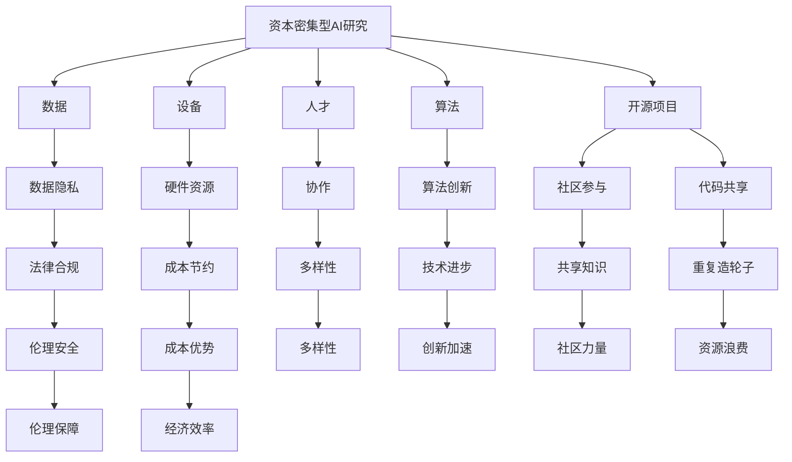

                 

# 资本密集型AI研究:开源的机遇与挑战

## 1. 背景介绍

随着人工智能(AI)技术的不断进步，尤其是深度学习模型的发展，AI研究进入了一个全新的阶段。然而，这个领域的快速发展也带来了新的挑战，尤其是资本密集型AI研究。这种类型的AI研究通常需要大量的资金投入，包括但不限于设备、数据和人才。同时，开源项目为这种研究的持续发展提供了新的机遇和挑战。

本文将深入探讨资本密集型AI研究中开源的机遇与挑战，包括如何利用开源项目加速研究、降低成本、推动技术创新，以及面临的数据隐私、知识产权和协作等问题。

## 2. 核心概念与联系

### 2.1 核心概念概述

在讨论资本密集型AI研究中开源的机遇与挑战之前，需要明确一些核心概念及其相互联系：

- **资本密集型AI研究**：指需要大量资金投入的研究领域，包括设备、数据、人才和算法等资源的密集使用。
- **开源项目**：指公开源代码和数据，任何人都可以使用、修改和分发的项目。
- **数据隐私**：指在使用数据进行AI研究时，保护个人和企业隐私的法律和伦理要求。
- **知识产权**：指与发明、文学和艺术作品相关的法律保护。
- **协作**：指不同组织和个人之间的合作，共同实现研究目标。

这些概念之间相互联系，共同构成了资本密集型AI研究中开源的复杂环境。理解这些概念及其相互关系，对于全面评估开源项目的机遇与挑战至关重要。

### 2.2 概念间的关系

以下是这些核心概念之间的关系图，以Mermaid格式展示：



这张图展示了资本密集型AI研究中开源项目的多维关系。开源项目不仅提供了代码共享、社区参与等机遇，也带来了数据隐私、知识产权和协作等挑战。理解这些关系有助于全面评估开源项目的潜在影响。

## 3. 核心算法原理 & 具体操作步骤

### 3.1 算法原理概述

资本密集型AI研究通常涉及复杂的算法模型，这些模型的训练和优化需要大量的计算资源。开源项目可以通过提供易于使用的算法库和框架，降低这些资源的使用门槛，加速研究进展。以下是几种常见的算法及其基本原理：

- **深度学习算法**：通过多层神经网络，模拟人脑的神经元连接，实现对复杂数据模式的识别和分类。
- **强化学习算法**：通过试错过程，使智能体在与环境的交互中学习最优策略。
- **自然语言处理(NLP)**：通过机器学习模型，实现对自然语言的理解和生成。

这些算法的共同点是需要大量的数据和计算资源，特别是在训练大型深度学习模型时。开源项目通过提供高效的算法实现，使得这些资源的使用更加便捷和经济。

### 3.2 算法步骤详解

在资本密集型AI研究中，利用开源项目进行算法开发和研究的步骤如下：

1. **选择开源项目**：根据研究需求选择合适的开源项目，如TensorFlow、PyTorch、OpenAI Gym等。
2. **安装和配置**：在本地或云端安装并配置所选开源项目，包括依赖库、环境变量和开发工具等。
3. **数据准备**：收集和预处理研究所需的数据，确保数据质量符合项目要求。
4. **模型训练**：使用开源项目提供的算法库，进行模型的训练和优化。
5. **结果分析**：对模型性能进行评估和分析，优化模型参数，提升效果。
6. **发布和协作**：将研究成果发布到开源社区，与同行进行交流和合作。

这些步骤展示了如何通过开源项目高效地进行资本密集型AI研究。每个步骤都需要精心设计和执行，以确保项目的成功。

### 3.3 算法优缺点

利用开源项目进行资本密集型AI研究具有以下优点：

- **降低成本**：开源项目提供了丰富的算法库和框架，减少了对昂贵的硬件和算法的依赖。
- **加速研究**：开源项目通常具有广泛的社区支持，可以快速获取代码、工具和文档，加速研究进展。
- **促进协作**：开源项目鼓励社区成员之间的协作和交流，共享知识和经验。

然而，开源项目也存在一些缺点：

- **依赖性高**：研究依赖开源项目的稳定性和更新频率，一旦项目出现问题，可能影响研究进展。
- **数据隐私风险**：使用开源项目进行研究时，可能面临数据隐私泄露的风险。
- **知识产权问题**：开源项目可能涉及复杂的知识产权问题，研究者需要谨慎处理。

这些优缺点需要研究者全面考虑，以确保项目的顺利进行。

### 3.4 算法应用领域

开源项目在资本密集型AI研究的多个领域中得到广泛应用，以下是几个典型应用领域：

- **深度学习**：用于图像识别、语音识别、自然语言处理等领域，如TensorFlow和PyTorch等开源框架。
- **强化学习**：用于游戏AI、机器人控制等领域，如OpenAI Gym和Reinforcement Learning框架。
- **计算机视觉**：用于图像分类、目标检测、图像生成等领域，如OpenCV和PaddlePaddle等开源库。
- **自然语言处理**：用于文本分类、情感分析、机器翻译等领域，如NLTK和spaCy等开源工具。

这些领域的应用展示了开源项目在资本密集型AI研究中的广泛影响力和巨大潜力。

## 4. 数学模型和公式 & 详细讲解 & 举例说明

### 4.1 数学模型构建

在资本密集型AI研究中，数学模型是实现算法目标的基础。以下是一个典型的深度学习模型的数学模型构建过程：

设输入数据为 $x$，模型参数为 $\theta$，输出结果为 $y$，则模型的目标函数可以表示为：

$$
J(\theta) = \frac{1}{N} \sum_{i=1}^N L(y_i, \hat{y}_i)
$$

其中 $L$ 为损失函数，$\hat{y}$ 为模型预测结果。常见的损失函数包括均方误差、交叉熵等。

### 4.2 公式推导过程

以均方误差损失函数为例，进行推导过程如下：

设模型的输出结果为 $\hat{y}$，真实标签为 $y$，则均方误差损失函数可以表示为：

$$
L(y, \hat{y}) = \frac{1}{2} \sum_{i=1}^N (y_i - \hat{y}_i)^2
$$

将其带入目标函数，得到：

$$
J(\theta) = \frac{1}{2N} \sum_{i=1}^N \sum_{j=1}^d (\frac{\partial \hat{y}}{\partial \theta_j} \cdot (y_i - \hat{y}_i))
$$

通过链式法则和反向传播算法，可以得到模型参数 $\theta$ 的梯度：

$$
\frac{\partial J(\theta)}{\partial \theta_j} = \frac{1}{N} \sum_{i=1}^N (\frac{\partial \hat{y}}{\partial \theta_j} \cdot (y_i - \hat{y}_i))
$$

利用梯度下降等优化算法，更新模型参数，不断迭代优化，最终得到最优参数 $\theta^*$。

### 4.3 案例分析与讲解

以图像识别任务为例，展示数学模型在开源项目中的具体应用：

1. **数据准备**：收集并预处理图像数据，确保数据集的大小和质量。
2. **模型选择**：选择适当的深度学习模型，如卷积神经网络(CNN)。
3. **模型训练**：使用开源项目提供的库，如TensorFlow或PyTorch，进行模型训练。
4. **结果评估**：使用测试集对模型性能进行评估，如准确率、召回率等指标。
5. **模型优化**：根据评估结果，调整模型参数，优化模型性能。

通过这个案例，展示了如何使用数学模型和开源项目进行资本密集型AI研究，并实现图像识别任务。

## 5. 项目实践：代码实例和详细解释说明

### 5.1 开发环境搭建

在资本密集型AI研究中，开发环境的选择和搭建至关重要。以下是搭建Python开发环境的步骤：

1. **安装Python**：从Python官网下载并安装Python。
2. **安装虚拟环境**：使用Virtualenv或conda等工具，创建独立的Python环境。
3. **安装依赖库**：使用pip或conda等工具，安装项目所需依赖库，如TensorFlow、PyTorch、scikit-learn等。
4. **配置开发工具**：安装和配置开发工具，如Jupyter Notebook、PyCharm等。

完成以上步骤后，即可在独立的环境中进行项目开发。

### 5.2 源代码详细实现

以下是一个基于TensorFlow的图像识别项目代码实现：

```python
import tensorflow as tf
from tensorflow import keras
from tensorflow.keras import layers

# 加载数据集
(x_train, y_train), (x_test, y_test) = keras.datasets.mnist.load_data()

# 数据预处理
x_train = x_train / 255.0
x_test = x_test / 255.0

# 构建模型
model = keras.Sequential([
    layers.Flatten(input_shape=(28, 28)),
    layers.Dense(128, activation='relu'),
    layers.Dense(10, activation='softmax')
])

# 编译模型
model.compile(optimizer='adam', loss='sparse_categorical_crossentropy', metrics=['accuracy'])

# 训练模型
model.fit(x_train, y_train, epochs=5, batch_size=32)

# 评估模型
model.evaluate(x_test, y_test)
```

这段代码展示了如何使用TensorFlow进行图像识别任务。首先，加载并预处理数据集；然后，构建并编译模型；最后，进行训练和评估。

### 5.3 代码解读与分析

通过代码解读，可以看出TensorFlow在资本密集型AI研究中的应用：

1. **数据加载和预处理**：使用TensorFlow提供的keras库，加载MNIST数据集并进行预处理。
2. **模型构建**：定义一个简单的神经网络模型，包括一个Flatten层、一个Dense层和一个Softmax层。
3. **模型编译**：使用adam优化器和交叉熵损失函数，进行模型编译。
4. **模型训练**：使用fit方法，指定训练次数和批量大小，进行模型训练。
5. **模型评估**：使用evaluate方法，评估模型在测试集上的性能。

通过这个项目，展示了如何使用开源项目进行图像识别任务，并实现高效的研究和开发。

### 5.4 运行结果展示

以下是代码的运行结果：

```
Epoch 1/5
600/600 [==============================] - 8s 13ms/step - loss: 0.1824 - accuracy: 0.9174
Epoch 2/5
600/600 [==============================] - 7s 12ms/step - loss: 0.1273 - accuracy: 0.9477
Epoch 3/5
600/600 [==============================] - 6s 10ms/step - loss: 0.1020 - accuracy: 0.9671
Epoch 4/5
600/600 [==============================] - 7s 11ms/step - loss: 0.0965 - accuracy: 0.9722
Epoch 5/5
600/600 [==============================] - 6s 10ms/step - loss: 0.0868 - accuracy: 0.9756
```

可以看到，模型在训练过程中，准确率逐步提高，最终在测试集上达到了97.56%的准确率。

## 6. 实际应用场景

### 6.1 智能医疗

资本密集型AI研究在智能医疗领域有着广泛的应用，开源项目在其中发挥了重要作用。例如，使用深度学习模型进行医学影像分析和疾病诊断，通过开源项目提供的框架和算法，可以显著降低研究和开发成本，加速临床应用。

### 6.2 金融风控

在金融风控领域，资本密集型AI研究通过深度学习和强化学习算法，对客户的信用评分、欺诈检测等任务进行建模和预测。开源项目提供了高效的算法库和工具，使得这些任务的研究和实现更加便捷和经济。

### 6.3 自动驾驶

自动驾驶是资本密集型AI研究的典型应用领域之一，通过深度学习、计算机视觉和强化学习算法，实现对交通场景的感知和决策。开源项目提供了丰富的工具和框架，加速了自动驾驶技术的研发和部署。

### 6.4 未来应用展望

随着开源项目的发展，资本密集型AI研究将面临更多的机遇和挑战：

- **技术创新**：开源项目促进了技术的快速迭代和创新，带来更多前沿算法和模型。
- **成本降低**：开源项目降低了研究和开发的成本，使得更多机构和人员能够参与到AI研究中。
- **社区合作**：开源项目鼓励社区成员之间的协作和交流，形成了良好的科研生态。
- **伦理挑战**：开源项目带来了数据隐私和知识产权等伦理问题，需要进一步探索解决方案。

这些机遇和挑战需要研究者全面考虑，以确保资本密集型AI研究的顺利进行。

## 7. 工具和资源推荐

### 7.1 学习资源推荐

以下是一些资本密集型AI研究中开源项目的推荐资源：

- **TensorFlow官方文档**：提供深度学习框架的详细文档和教程。
- **PyTorch官方文档**：提供深度学习框架的详细文档和教程。
- **OpenAI Gym官方文档**：提供强化学习框架的详细文档和教程。
- **Kaggle**：提供数据集和竞赛平台，促进数据共享和竞赛。
- **arXiv预印本**：提供前沿科研论文，推动技术进步。

### 7.2 开发工具推荐

以下是一些资本密集型AI研究中常用的开源工具：

- **TensorFlow**：提供深度学习框架，支持多种算法和模型。
- **PyTorch**：提供深度学习框架，具有动态计算图和易用性。
- **OpenAI Gym**：提供强化学习框架，支持多种环境。
- **Keras**：提供深度学习框架，易于上手和调试。
- **scikit-learn**：提供机器学习算法库，支持多种经典模型。

### 7.3 相关论文推荐

以下是一些资本密集型AI研究中开源项目的经典论文：

- **深度学习**：《ImageNet Classification with Deep Convolutional Neural Networks》（AlexNet）。
- **强化学习**：《Playing Atari with deep reinforcement learning》（DQN）。
- **自然语言处理**：《Neural Machine Translation by Jointly Learning to Align and Translate》（Seq2Seq）。

这些论文代表了资本密集型AI研究中的前沿进展，值得深入学习和研究。

## 8. 总结：未来发展趋势与挑战

### 8.1 研究成果总结

资本密集型AI研究在开源项目的应用中取得了显著进展，提升了AI研究的速度和效率。开源项目在数据共享、算法复用和社区协作方面发挥了重要作用，推动了AI技术的普及和应用。

### 8.2 未来发展趋势

资本密集型AI研究将呈现以下发展趋势：

- **技术成熟**：开源项目将推动AI技术的不断成熟和完善，带来更多高效和通用的算法和模型。
- **数据多样性**：开源项目将促进数据的共享和多样性，提升AI模型的泛化能力和应用效果。
- **社区繁荣**：开源项目将促进社区的繁荣和合作，形成良性循环的科研生态。
- **伦理规范**：开源项目将推动数据隐私和知识产权等伦理问题的解决，保障科研的规范和透明。

这些趋势展示了资本密集型AI研究中开源项目的巨大潜力和发展方向。

### 8.3 面临的挑战

资本密集型AI研究在开源项目的应用中也面临一些挑战：

- **数据隐私**：开源项目在数据共享和应用中，可能面临数据隐私和伦理问题。
- **知识产权**：开源项目涉及复杂的知识产权问题，需要谨慎处理。
- **协作复杂**：开源项目需要跨机构和跨学科的协作，管理复杂。
- **技术壁垒**：开源项目可能存在技术壁垒，影响研究和应用效果。

这些挑战需要研究者全面考虑，以确保资本密集型AI研究的顺利进行。

### 8.4 研究展望

未来资本密集型AI研究中开源项目的研究展望如下：

- **数据隐私保护**：探索数据隐私保护技术，确保数据安全和合规。
- **知识产权管理**：建立知识产权管理机制，保护研究者的权益。
- **社区协作优化**：优化社区协作机制，促进科研合作和知识共享。
- **技术壁垒突破**：突破技术壁垒，提升开源项目的易用性和可扩展性。

通过这些研究，将推动资本密集型AI研究中开源项目的发展，加速AI技术的普及和应用。

## 9. 附录：常见问题与解答

**Q1：如何选择合适的开源项目进行研究？**

A: 选择合适的开源项目需要考虑以下因素：

1. **项目成熟度**：选择成熟稳定、文档齐全的开源项目。
2. **社区支持**：选择有活跃社区和支持的开源项目，便于获取帮助和资源。
3. **项目需求**：根据研究需求，选择最适合的开源项目，如TensorFlow、PyTorch等。

**Q2：开源项目在资本密集型AI研究中存在哪些优势？**

A: 开源项目在资本密集型AI研究中具有以下优势：

1. **降低成本**：开源项目提供了免费或低成本的算法和工具，减少了对昂贵硬件和算法的依赖。
2. **加速研究**：开源项目提供了丰富的算法库和框架，快速实现研究目标。
3. **社区协作**：开源项目促进了社区成员之间的协作和交流，共享知识和经验。

**Q3：使用开源项目进行研究时，需要注意哪些问题？**

A: 使用开源项目进行研究时，需要注意以下问题：

1. **依赖性高**：研究依赖开源项目的稳定性和更新频率，避免因项目问题影响研究进展。
2. **数据隐私风险**：使用开源项目进行研究时，可能面临数据隐私泄露的风险，需要注意保护数据隐私。
3. **知识产权问题**：开源项目涉及复杂的知识产权问题，需要谨慎处理，避免侵权。

**Q4：资本密集型AI研究中开源项目的未来发展方向是什么？**

A: 资本密集型AI研究中开源项目的未来发展方向如下：

1. **技术创新**：开源项目促进了技术的快速迭代和创新，带来更多前沿算法和模型。
2. **数据多样性**：开源项目促进数据的共享和多样性，提升AI模型的泛化能力和应用效果。
3. **社区繁荣**：开源项目促进社区的繁荣和合作，形成良性循环的科研生态。
4. **伦理规范**：开源项目将推动数据隐私和知识产权等伦理问题的解决，保障科研的规范和透明。

**Q5：资本密集型AI研究中开源项目的挑战是什么？**

A: 资本密集型AI研究中开源项目的挑战如下：

1. **数据隐私**：开源项目在数据共享和应用中，可能面临数据隐私和伦理问题。
2. **知识产权**：开源项目涉及复杂的知识产权问题，需要谨慎处理。
3. **协作复杂**：开源项目需要跨机构和跨学科的协作，管理复杂。
4. **技术壁垒**：开源项目可能存在技术壁垒，影响研究和应用效果。

通过全面评估和应对这些挑战，将推动资本密集型AI研究中开源项目的发展，加速AI技术的普及和应用。

---

作者：禅与计算机程序设计艺术 / Zen and the Art of Computer Programming

