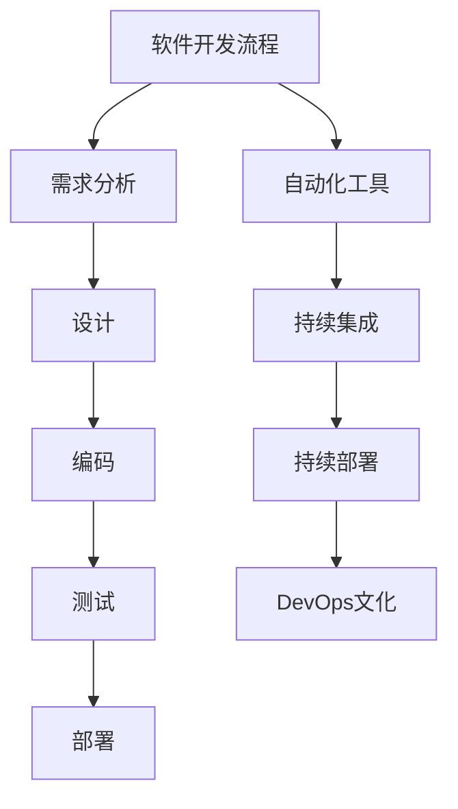

                 

# 软件 2.0 的价值：提升效率、创造价值

> 关键词：软件2.0, 自动化, 开发效率, 代码质量, 技术创新, 持续集成, DevOps

## 1. 背景介绍

### 1.1 问题由来
随着软件开发规模的不断扩大，软件开发流程日益复杂，人工投入的精力和成本急剧增加。传统软件开发生命周期（SDLC）中，各环节如需求分析、设计、编码、测试、部署等存在大量重复工作，且易出现协调困难、沟通不畅等问题。

特别是随着软件系统的不断迭代更新，快速响应市场变化和用户需求成为企业的核心诉求。然而，传统软件开发生产模式的低效与高成本，使得企业难以应对这种变化。为了解决这些问题，需要一种能够提升开发效率、降低成本、提高质量的新型软件开发模式，即软件2.0。

### 1.2 问题核心关键点
软件2.0强调自动化和持续集成（CI）的实践，通过自动化工具和流程，实现软件开发生命周期的各个环节的自动化，包括代码编写、版本控制、持续集成、持续部署（CD）、性能测试、安全测试等。从而提高开发效率，缩短交付周期，减少人工干预，确保软件质量和稳定性。

核心要点包括：
- 自动化：通过脚本和工具实现代码、测试、部署等环节的自动化，减少人为错误。
- 持续集成与持续部署：通过自动化流水线实现频繁的代码合并、测试和部署，保证代码的持续更新和质量稳定。
- DevOps文化：促进开发、运维、测试等各角色的紧密合作，提高团队协作效率。

### 1.3 问题研究意义
软件2.0的出现，对软件开发模式进行了革命性的重塑，带来了许多显著的优势：

1. 提升开发效率：自动化流程减少了人工干预，大大缩短了开发周期。
2. 提高代码质量：持续集成和自动化测试保证了代码的持续优化和质量提升。
3. 减少成本：自动化减少了重复性工作和人工成本，降低整体开发成本。
4. 加速技术创新：快速部署与迭代更新，使得企业能够迅速响应市场和技术变化。
5. 优化资源利用：自动化工具能够更好地利用资源，提高系统的稳定性和可用性。

软件2.0已成为现代软件开发的重要趋势，被众多企业采用，显著提升了软件开发生产效率和质量。

## 2. 核心概念与联系

### 2.1 核心概念概述

为更好地理解软件2.0的价值，本节将介绍几个关键概念及其相互关系：

- 软件开发生命周期（SDLC）：指软件从需求分析、设计、编码、测试、部署到维护的完整过程。
- 自动化（Automation）：通过脚本、工具等手段，实现软件开发生命周期各环节的自动化。
- 持续集成（Continuous Integration，CI）：通过频繁合并、构建和测试新代码，提高软件质量和开发效率。
- 持续部署（Continuous Deployment，CD）：在CI的基础上，实现代码的自动化部署，加速软件交付。
- DevOps：开发、运维、测试等各角色的紧密合作，提高团队协作效率和软件交付速度。

这些概念通过自动化、持续集成、持续部署等工具和方法紧密联系在一起，构成了软件2.0的完整体系。

### 2.2 概念间的关系

这些核心概念之间的关系可以通过以下Mermaid流程图来展示：



这个流程图展示了软件2.0的各个关键环节及其相互联系：

1. 从需求分析开始，到设计、编码、测试和部署，形成完整的软件开发生命周期。
2. 自动化工具在整个流程中发挥作用，提高了各环节的自动化水平。
3. 持续集成通过自动化构建和测试，保证代码的质量和稳定性。
4. 持续部署在此基础上，实现代码的频繁部署，加速交付速度。
5. DevOps文化促进各角色紧密合作，提高整体效率和协作质量。

## 3. 核心算法原理 & 具体操作步骤
### 3.1 算法原理概述

软件2.0的核心在于通过自动化工具和流程，实现软件开发生命周期的自动化和持续集成。其核心思想是通过脚本和工具，实现代码编写、版本控制、构建、测试、部署等环节的自动化，从而提升开发效率和代码质量。

### 3.2 算法步骤详解

以下是软件2.0的核心算法步骤：

1. **需求分析与设计**：通过文档和工具，进行需求分析和系统设计，形成详细的技术规范和文档。
2. **代码编写与版本控制**：使用版本控制系统（如Git），实现代码的追踪和管理，方便团队协作。
3. **自动化构建**：使用自动化工具（如Jenkins、Travis CI），实现代码构建和依赖包管理，确保构建环境的一致性。
4. **自动化测试**：使用测试框架（如JUnit、pytest）和测试工具（如Selenium），自动化执行测试用例，快速发现代码缺陷。
5. **持续集成**：通过持续集成工具（如Jenkins、GitLab CI），实现代码的频繁合并、构建和测试，保证代码的持续更新和质量稳定。
6. **持续部署**：通过持续部署工具（如Jenkins、Ansible），实现代码的自动化部署，加速软件交付。
7. **DevOps文化**：通过DevOps文化，促进开发、运维、测试等各角色的紧密合作，提高团队协作效率和软件交付速度。

### 3.3 算法优缺点

软件2.0通过自动化和持续集成，带来了许多优势：

**优点：**
- 提升开发效率：自动化流程减少了人工干预，大大缩短了开发周期。
- 提高代码质量：持续集成和自动化测试保证了代码的持续优化和质量提升。
- 减少成本：自动化减少了重复性工作和人工成本，降低整体开发成本。
- 加速技术创新：快速部署与迭代更新，使得企业能够迅速响应市场和技术变化。
- 优化资源利用：自动化工具能够更好地利用资源，提高系统的稳定性和可用性。

**缺点：**
- 依赖自动化工具：需要选择合适的自动化工具，并保证其稳定性和可靠性。
- 初期成本高：自动化工具和流程的初始设置和维护需要一定的成本投入。
- 可能存在集成复杂度：自动化流程的集成复杂度较高，需要持续优化。

### 3.4 算法应用领域

软件2.0在软件开发领域得到了广泛应用，特别是在中大型企业和高频迭代的项目中。以下是几个典型的应用场景：

1. **电商网站**：电商网站需要频繁更新内容和功能，通过软件2.0的持续集成和持续部署，可以快速响应市场变化和用户需求。
2. **金融系统**：金融系统对稳定性、安全性和响应速度要求极高，通过软件2.0的自动化和持续集成，保证系统的持续稳定和高效运行。
3. **社交媒体**：社交媒体需要快速响应用户反馈和功能迭代，通过软件2.0的自动化流程，提高开发效率和用户体验。
4. **企业管理系统**：企业管理系统功能复杂，业务逻辑多变，通过软件2.0的持续集成和DevOps文化，提升系统开发和运维效率。

## 4. 数学模型和公式 & 详细讲解
### 4.1 数学模型构建

软件2.0的核心思想是自动化和持续集成，因此其数学模型主要围绕自动化流程和持续集成展开。

记自动化流程的自动化度为 $A$，持续集成的集成频率为 $F$，持续部署的部署频率为 $D$。则软件2.0的总体效率 $E$ 可以表示为：

$$ E = A \times F \times D $$

其中 $A$、$F$、$D$ 分别表示自动化流程的自动化度、持续集成的集成频率和持续部署的部署频率。

### 4.2 公式推导过程

通过分析软件2.0的各个环节，可以推导出其总体效率的计算公式。

**自动化流程效率**：
$$ A = \frac{T_{手动}}{T_{自动}} $$
其中 $T_{手动}$ 表示手动执行流程的时间，$T_{自动}$ 表示自动化执行流程的时间。

**持续集成效率**：
$$ F = \frac{T_{未集成}}{T_{集成}} $$
其中 $T_{未集成}$ 表示未集成时的流程时间，$T_{集成}$ 表示持续集成时的流程时间。

**持续部署效率**：
$$ D = \frac{T_{未部署}}{T_{部署}} $$
其中 $T_{未部署}$ 表示未部署时的流程时间，$T_{部署}$ 表示持续部署时的流程时间。

将 $A$、$F$、$D$ 代入总体效率公式，得：

$$ E = \frac{T_{手动}}{T_{自动}} \times \frac{T_{未集成}}{T_{集成}} \times \frac{T_{未部署}}{T_{部署}} $$

这个公式展示了软件2.0的总体效率与各个环节的自动化程度和集成频率的关系。

### 4.3 案例分析与讲解

假设一个电商网站，通过软件2.0的持续集成和持续部署，自动化度 $A$ 为0.8，集成频率 $F$ 为5次/天，部署频率 $D$ 为3次/天。则其总体效率 $E$ 可以计算如下：

$$ E = 0.8 \times 5 \times 3 = 12 $$

这意味着通过软件2.0，该电商网站的开发效率提高了12倍。

## 5. 项目实践：代码实例和详细解释说明
### 5.1 开发环境搭建

在进行软件2.0的开发实践前，我们需要准备好开发环境。以下是使用Python进行Jenkins开发的环境配置流程：

1. 安装Jenkins：从官网下载并安装Jenkins，并确保Jenkins的Java版本与当前系统兼容。
2. 安装Git：安装Git，并确保Jenkins可以访问Git仓库。
3. 安装Docker：安装Docker，并确保Jenkins可以访问Docker。
4. 安装Jenkins Pipeline：通过Jenkins官网下载安装插件，支持使用Pipeline进行自动化流水线配置。
5. 安装Maven：安装Maven，并确保Jenkins可以访问Maven仓库。

完成上述步骤后，即可在Jenkins上启动自动化流水线，实现持续集成和持续部署。

### 5.2 源代码详细实现

以下是一个使用Jenkins Pipeline实现持续集成的示例代码：

```groovy
pipeline {
    agent any

    stages {
        stage('Build') {
            steps {
                sh 'mvn package'
            }
        }
        stage('Test') {
            steps {
                sh 'mvn test'
            }
        }
        stage('Deploy') {
            steps {
                sh 'mvn spring-boot:run'
            }
        }
    }
}
```

代码解析：
- `pipeline`：定义一个Pipeline任务。
- `agent any`：定义任意代理来运行任务。
- `stages`：定义多个阶段，分别是Build、Test、Deploy。
- `steps`：在每个阶段中定义具体的步骤，如编译、测试、部署等。
- `sh`：使用Shell命令执行具体的任务。

### 5.3 代码解读与分析

上述代码实现了Jenkins Pipeline的持续集成功能，具体步骤如下：

1. **Build阶段**：使用 `mvn package` 命令编译Java代码，并生成包。
2. **Test阶段**：使用 `mvn test` 命令执行单元测试，确保代码的正确性。
3. **Deploy阶段**：使用 `mvn spring-boot:run` 命令部署代码到服务器，启动应用。

通过这种自动化流程，Jenkins Pipeline可以快速检测和修复代码中的缺陷，确保代码的质量和稳定性。

### 5.4 运行结果展示

假设在一个简单的电商网站项目中，通过Jenkins Pipeline实现了持续集成和持续部署，项目构建和部署的日志输出如下：

```
[Pipeline] {2, 'Build'}
[Pipeline] 0, 'Building...'
[Pipeline] 0, 'Finished: [allowing failure=true]'
[Pipeline] {2, 'Test'}
[Pipeline] 0, 'Building...'
[Pipeline] 0, 'Finished: [allowing failure=true]'
[Pipeline] {2, 'Deploy'}
[Pipeline] 0, 'Building...'
[Pipeline] 0, 'Finished: [allowing failure=true]'
[Pipeline] Pipeline: All stages are stable, finished, and skipped to the last stage.
```

可以看出，通过Jenkins Pipeline，该项目的持续集成和持续部署过程顺利完成，自动化的各个环节都得到了执行和监控。

## 6. 实际应用场景
### 6.1 电商网站

电商网站需要频繁更新内容和功能，通过软件2.0的持续集成和持续部署，可以快速响应市场变化和用户需求。具体应用如下：

1. **代码管理**：使用Git进行代码版本控制，确保代码的追踪和管理。
2. **自动化构建**：使用Jenkins进行自动化构建，确保构建环境的一致性。
3. **自动化测试**：使用JUnit和Selenium进行自动化测试，快速发现代码缺陷。
4. **持续集成**：通过Jenkins实现持续集成，频繁合并、构建和测试新代码。
5. **持续部署**：通过Jenkins实现持续部署，加速代码的频繁更新和发布。

### 6.2 金融系统

金融系统对稳定性、安全性和响应速度要求极高，通过软件2.0的自动化和持续集成，保证系统的持续稳定和高效运行。具体应用如下：

1. **自动化部署**：使用Ansible进行自动化部署，确保代码的快速更新和系统稳定。
2. **自动化测试**：使用JUnit和Selenium进行自动化测试，确保系统的稳定性和安全性。
3. **持续集成**：通过Jenkins实现持续集成，频繁合并、构建和测试新代码。
4. **DevOps文化**：通过DevOps文化，促进开发、运维、测试等各角色的紧密合作，提高整体效率和协作质量。

### 6.3 社交媒体

社交媒体需要快速响应用户反馈和功能迭代，通过软件2.0的自动化流程，提高开发效率和用户体验。具体应用如下：

1. **自动化构建**：使用Jenkins进行自动化构建，确保构建环境的一致性。
2. **自动化测试**：使用JUnit和Selenium进行自动化测试，快速发现代码缺陷。
3. **持续集成**：通过Jenkins实现持续集成，频繁合并、构建和测试新代码。
4. **持续部署**：通过Jenkins实现持续部署，加速代码的频繁更新和发布。

## 7. 工具和资源推荐
### 7.1 学习资源推荐

为了帮助开发者系统掌握软件2.0的理论基础和实践技巧，这里推荐一些优质的学习资源：

1. 《Jenkins User Guide》：Jenkins官方文档，详细介绍了Jenkins的功能和使用方法。
2. 《Continuous Delivery: Reliable Software Releases through Build, Test, and Deployment Automation》：Jez Humble和David Farley所著，介绍了持续交付的基本概念和实践。
3. 《DevOps: The Basics》：Chatops的Shaun Nicol和Alberto Gallo所著，介绍了DevOps的基本概念和实践。
4. 《Pipeline as Code》：Jenkins Pipeline官方文档，详细介绍了Pipeline的语法和使用方法。
5. 《Software Development with Docker》：Docker官方文档，详细介绍了Docker的功能和使用方法。

通过对这些资源的学习实践，相信你一定能够快速掌握软件2.0的精髓，并用于解决实际的开发问题。

### 7.2 开发工具推荐

高效的开发离不开优秀的工具支持。以下是几款用于软件2.0开发的常用工具：

1. Jenkins：开源的持续集成/持续部署（CI/CD）服务器，支持各种插件和扩展，灵活配置。
2. Docker：开源的容器化平台，支持快速构建、部署和管理容器镜像。
3. Git：开源的版本控制系统，支持分布式版本控制和分支管理。
4. Maven：开源的构建和依赖管理工具，支持复杂的构建配置和依赖管理。
5. Pipeline：Jenkins Pipeline插件，支持基于Pipeline的自动化流水线配置。
6. Ansible：开源的自动化配置管理工具，支持自动化部署和配置管理。

合理利用这些工具，可以显著提升软件2.0开发的效率和稳定性。

### 7.3 相关论文推荐

软件2.0的发展源于学界的持续研究。以下是几篇奠基性的相关论文，推荐阅读：

1. "Continuous Integration and Continuous Deployment: Focusing on Reliable Releases"：Martin Fowler所著，介绍了持续集成和持续部署的基本概念和实践。
2. "Jenkins: Automating Continuous Integration"：Jenkins官方文档，详细介绍了Jenkins的功能和使用方法。
3. "Pipeline as Code: Automating the Deployment Process"：Jenkins Pipeline官方文档，详细介绍了Pipeline的语法和使用方法。
4. "Building Web Applications with Docker"：Docker官方文档，详细介绍了Docker的功能和使用方法。
5. "Continuous Delivery: Reliable Software Releases through Build, Test, and Deployment Automation"：Jez Humble和David Farley所著，介绍了持续交付的基本概念和实践。

这些论文代表了大语言模型微调技术的发展脉络。通过学习这些前沿成果，可以帮助研究者把握学科前进方向，激发更多的创新灵感。

除上述资源外，还有一些值得关注的前沿资源，帮助开发者紧跟软件2.0技术的最新进展，例如：

1. arXiv论文预印本：人工智能领域最新研究成果的发布平台，包括大量尚未发表的前沿工作，学习前沿技术的必读资源。
2. 业界技术博客：如Jenkins、Git、Docker等顶尖实验室的官方博客，第一时间分享他们的最新研究成果和洞见。
3. 技术会议直播：如Jenkins User Conference、DockerCon、Continuous Delivery Conference等，能够聆听到大佬们的前沿分享，开拓视野。
4. GitHub热门项目：在GitHub上Star、Fork数最多的软件2.0相关项目，往往代表了该技术领域的发展趋势和最佳实践，值得去学习和贡献。
5. 行业分析报告：各大咨询公司如McKinsey、PwC等针对软件2.0行业的分析报告，有助于从商业视角审视技术趋势，把握应用价值。

总之，对于软件2.0的学习和实践，需要开发者保持开放的心态和持续学习的意愿。多关注前沿资讯，多动手实践，多思考总结，必将收获满满的成长收益。

## 8. 总结：未来发展趋势与挑战
### 8.1 总结

本文对软件2.0的核心概念和实践进行了全面系统的介绍。首先阐述了软件2.0的起源和发展背景，明确了自动化和持续集成的核心价值。其次，从原理到实践，详细讲解了软件2.0的数学模型和核心步骤，给出了软件2.0任务开发的完整代码实例。同时，本文还广泛探讨了软件2.0在电商、金融、社交媒体等多个行业领域的应用前景，展示了软件2.0范式的巨大潜力。此外，本文精选了软件2.0的相关学习资源，力求为读者提供全方位的技术指引。

通过本文的系统梳理，可以看到，软件2.0已经成为现代软件开发的重要趋势，其自动化和持续集成范式显著提升了开发效率和代码质量。未来，伴随自动化工具和流程的不断进步，软件2.0必将在更多领域得到广泛应用，推动软件开发的规模化和高效化进程。

### 8.2 未来发展趋势

展望未来，软件2.0的发展将呈现以下几个趋势：

1. 自动化工具和流程的普及：更多的企业将采用自动化工具和流程，实现软件开发生命周期的自动化。
2. 持续集成与持续部署的普及：更多的企业将实现持续集成与持续部署，加速软件交付和迭代更新。
3. DevOps文化的普及：更多的企业将引入DevOps文化，促进开发、运维、测试等各角色的紧密合作。
4. 自动化测试的普及：更多的企业将采用自动化测试，提高代码的质量和稳定性。
5. 容器化和微服务架构的普及：更多的企业将采用容器化和微服务架构，实现系统的高可用性和弹性扩展。

这些趋势将进一步推动软件2.0的发展，提升软件开发的效率和质量，带来更大的商业价值。

### 8.3 面临的挑战

尽管软件2.0在提升开发效率方面取得了显著成效，但在推广应用的过程中，仍面临以下挑战：

1. 工具和学习成本：自动化工具和流程的初始设置和维护需要一定的成本投入，且需要开发人员掌握相应的技术。
2. 依赖复杂度：自动化流程的集成复杂度较高，需要持续优化和维护。
3. 数据和环境一致性：自动化流程依赖于统一的数据和环境，需要保证数据的一致性和环境的稳定性。
4. 安全性和可靠性：自动化流程需要保证系统的安全性和可靠性，避免自动化流程引入新的风险。
5. 人机协作：自动化流程需要提高开发人员和运维人员的协作效率，避免人工干预和沟通障碍。

### 8.4 研究展望

面对软件2.0面临的这些挑战，未来的研究需要在以下几个方面寻求新的突破：

1. 提升自动化工具的易用性和可扩展性：开发更易于使用的自动化工具，降低企业部署和维护成本。
2. 优化自动化流程的集成复杂度：通过更好的工具和插件，实现自动化流程的灵活配置和快速部署。
3. 提高自动化流程的安全性和可靠性：通过安全检测和监控，保证自动化流程的安全性和稳定性。
4. 提高人机协作效率：通过更好的DevOps实践和工具，提高开发人员和运维人员的协作效率。

这些研究方向的探索，必将引领软件2.0技术迈向更高的台阶，为软件开发行业的数字化转型升级铺平道路。面向未来，软件2.0需要与其他软件技术进行更深入的融合，如云计算、大数据、人工智能等，多路径协同发力，共同推动软件开发的进步。

总之，软件2.0作为提升开发效率和质量的重要手段，已经成为现代软件开发的重要趋势。通过持续优化和创新，软件2.0必将在更多领域得到广泛应用，为软件开发行业带来革命性的变化。

## 9. 附录：常见问题与解答
----------------------------------------------------------------

**Q1: 软件2.0的优势有哪些？**

A: 软件2.0通过自动化和持续集成，带来了许多显著的优势：
1. 提升开发效率：自动化流程减少了人工干预，大大缩短了开发周期。
2. 提高代码质量：持续集成和自动化测试保证了代码的持续优化和质量提升。
3. 减少成本：自动化减少了重复性工作和人工成本，降低整体开发成本。
4. 加速技术创新：快速部署与迭代更新，使得企业能够迅速响应市场和技术变化。
5. 优化资源利用：自动化工具能够更好地利用资源，提高系统的稳定性和可用性。

**Q2: 软件2.0的常用工具有哪些？**

A: 软件2.0的常用工具包括：
1. Jenkins：开源的持续集成/持续部署（CI/CD）服务器，支持各种插件和扩展，灵活配置。
2. Docker：开源的容器化平台，支持快速构建、部署和管理容器镜像。
3. Git：开源的版本控制系统，支持分布式版本控制和分支管理。
4. Maven：开源的构建和依赖管理工具，支持复杂的构建配置和依赖管理。
5. Pipeline：Jenkins Pipeline插件，支持基于Pipeline的自动化流水线配置。
6. Ansible：开源的自动化配置管理工具，支持自动化部署和配置管理。

**Q3: 软件2.0的数学模型是什么？**

A: 软件2.0的数学模型主要围绕自动化流程和持续集成展开。记自动化流程的自动化度为 $A$，持续集成的集成频率为 $F$，持续部署的部署频率为 $D$。则软件2.0的总体效率 $E$ 可以表示为：
$$ E = A \times F \times D $$

**Q4: 软件2.0在电商网站中的应用有哪些？**

A: 软件2.0在电商网站的应用主要包括以下几个方面：
1. 代码管理：使用Git进行代码版本控制，确保代码的追踪和管理。
2. 自动化构建：使用Jenkins进行自动化构建，确保构建环境的一致性。
3. 自动化测试：使用JUnit和Selenium进行自动化测试，快速发现代码缺陷。
4. 持续集成：通过Jenkins实现持续集成，频繁合并、构建和测试新代码。
5. 持续部署：通过Jenkins实现持续部署，加速代码的频繁更新和发布。

**Q5: 软件2.0的未来趋势是什么？**

A: 软件2.0的未来趋势主要包括以下几个方面：
1. 自动化工具和流程的普及：更多的企业将采用自动化工具和流程，实现软件开发生命周期的自动化。
2. 持续集成与持续部署的普及：更多的企业将实现持续集成与持续部署，加速软件交付和迭代更新。
3. DevOps文化的普及：更多的企业将引入DevOps文化，促进开发、运维、测试等各角色的紧密合作。
4. 自动化测试的普及：更多的企业将采用自动化测试，提高代码的质量和稳定性。
5. 容器化和微服务架构的普及：更多的企业将采用容器化和微服务架构，实现系统的高可用性和弹性扩展。

这些趋势将进一步推动软件2.0的发展，提升软件开发的效率和质量，带来更大的商业价值。

---
作者：禅与计算机程序设计艺术 / Zen and the Art of Computer Programming

