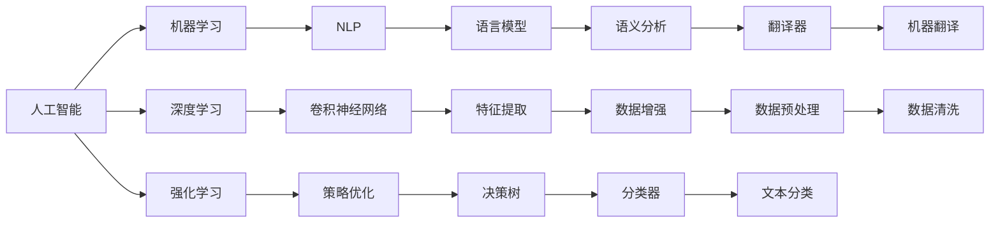

                 

# 软件 2.0 的哲学思考：人工智能的本质

## 1. 背景介绍

在当今这个信息爆炸的时代，人工智能（AI）技术正在以前所未有的速度和规模改变着我们生活的方方面面。从智能语音助手、推荐系统到自动驾驶汽车，人工智能已经深入到我们的日常生活中。然而，面对这股迅猛发展的浪潮，人们对其本质和未来走向的理解却显得相对滞后。本文将探讨软件2.0的哲学思考，深入探讨人工智能的本质，以及它在未来可能的发展方向。

## 2. 核心概念与联系

### 2.1 核心概念概述

为了更好地理解人工智能的本质，我们首先需要梳理一些核心概念：

- **人工智能**：指由计算机系统执行的智能行为，这些行为需要一定的推理、学习和自我修正能力，以模仿人类智能。

- **机器学习**：一种使计算机能够通过数据学习来改进自身行为的技术，是实现人工智能的重要手段。

- **深度学习**：一种特殊的机器学习方法，基于神经网络，能够从数据中学习到复杂的模式和表示。

- **强化学习**：一种学习方式，通过与环境互动，智能体通过试错来学习最优策略。

- **自然语言处理（NLP）**：研究计算机如何理解、解释和生成人类语言的技术。

这些概念之间存在着紧密的联系，共同构成了人工智能的研究基础和应用基础。

### 2.2 概念间的关系

这些核心概念之间的关系可以通过以下Mermaid流程图来展示：



这个流程图展示了人工智能与机器学习、深度学习和强化学习等关键技术的关系，以及NLP作为人工智能的一个应用领域的地位。各个技术之间通过合理的组合和融合，形成了强大的AI能力。

## 3. 核心算法原理 & 具体操作步骤

### 3.1 算法原理概述

人工智能的算法原理主要包括机器学习、深度学习和强化学习等，这些算法通过数据训练和学习，使计算机系统能够执行各种智能任务。以下是几种核心算法的概述：

- **监督学习**：通过已标注的数据集，训练模型预测新数据的标签。常用的算法有决策树、支持向量机等。

- **无监督学习**：通过未标注的数据集，学习数据的潜在结构和特征。常用的算法有聚类、主成分分析等。

- **强化学习**：通过与环境互动，智能体通过试错来学习最优策略。常用的算法有Q-learning、Policy Gradient等。

- **深度学习**：利用神经网络结构，通过大量数据训练学习复杂特征表示。常用的算法有卷积神经网络、循环神经网络等。

### 3.2 算法步骤详解

以深度学习中的卷积神经网络（CNN）为例，介绍其具体的训练步骤：

1. **数据准备**：收集和预处理数据集，包括图像数据的归一化、标记等。

2. **模型设计**：设计卷积神经网络的架构，包括卷积层、池化层、全连接层等。

3. **初始化参数**：对模型参数进行随机初始化。

4. **前向传播**：将输入数据通过网络层传递，得到输出结果。

5. **损失函数计算**：计算模型输出与真实标签之间的差异。

6. **反向传播**：通过链式法则计算梯度，更新模型参数。

7. **优化器更新**：使用优化算法（如Adam、SGD等）更新模型参数。

8. **重复迭代**：重复步骤4-7，直至模型收敛。

### 3.3 算法优缺点

深度学习算法在处理大规模数据时表现出色，但同时也面临着计算资源需求高、模型复杂度大等问题。相比于传统机器学习算法，深度学习在处理复杂数据结构时具有优势，但模型训练和优化过程较慢，需要大量的计算资源和时间。

### 3.4 算法应用领域

深度学习在图像识别、语音识别、自然语言处理、推荐系统等领域有着广泛的应用。以自然语言处理为例，卷积神经网络和循环神经网络被广泛应用于文本分类、机器翻译、文本生成等任务中。

## 4. 数学模型和公式 & 详细讲解 & 举例说明

### 4.1 数学模型构建

深度学习中的卷积神经网络是一种常见的模型，其数学模型可以表示为：

$$
y = f(x; \theta)
$$

其中，$x$为输入数据，$\theta$为模型参数，$f$为网络的前向传播函数。

### 4.2 公式推导过程

以卷积神经网络的卷积层为例，其公式推导如下：

$$
y_i = \sum_{j=0}^{w-1} \sum_{k=0}^{h-1} w_{k,j} x_{k,j} + b
$$

其中，$w_{k,j}$为卷积核，$x_{k,j}$为输入数据，$b$为偏置项。

### 4.3 案例分析与讲解

以图像分类为例，我们利用卷积神经网络对MNIST数据集进行训练和测试。具体步骤如下：

1. **数据准备**：加载MNIST数据集，将其分为训练集和测试集。

2. **模型设计**：设计一个包含多个卷积层和全连接层的卷积神经网络。

3. **训练模型**：使用交叉熵损失函数和Adam优化器，对模型进行训练。

4. **评估模型**：在测试集上评估模型性能，计算准确率。

## 5. 项目实践：代码实例和详细解释说明

### 5.1 开发环境搭建

为了进行深度学习项目的开发，需要安装以下工具：

- Python：版本3.6及以上
- TensorFlow或PyTorch：用于构建深度学习模型
- Jupyter Notebook：用于数据探索和模型训练

### 5.2 源代码详细实现

以PyTorch为例，以下是使用卷积神经网络进行图像分类的代码实现：

```python
import torch
import torch.nn as nn
import torchvision.transforms as transforms
import torchvision.datasets as datasets

# 定义卷积神经网络
class CNN(nn.Module):
    def __init__(self):
        super(CNN, self).__init__()
        self.conv1 = nn.Conv2d(1, 32, kernel_size=3, padding=1)
        self.pool = nn.MaxPool2d(kernel_size=2, stride=2)
        self.conv2 = nn.Conv2d(32, 64, kernel_size=3, padding=1)
        self.fc = nn.Linear(7*7*64, 10)

    def forward(self, x):
        x = self.pool(nn.functional.relu(self.conv1(x)))
        x = self.pool(nn.functional.relu(self.conv2(x)))
        x = x.view(-1, 7*7*64)
        x = self.fc(x)
        return x

# 加载MNIST数据集
transform = transforms.Compose([transforms.ToTensor(), transforms.Normalize((0.5,), (0.5,))])
train_dataset = datasets.MNIST(root='./data', train=True, download=True, transform=transform)
test_dataset = datasets.MNIST(root='./data', train=False, download=True, transform=transform)

# 定义模型、优化器和损失函数
model = CNN()
optimizer = torch.optim.Adam(model.parameters(), lr=0.001)
criterion = nn.CrossEntropyLoss()

# 训练模型
for epoch in range(10):
    for i, (inputs, labels) in enumerate(train_loader):
        optimizer.zero_grad()
        outputs = model(inputs)
        loss = criterion(outputs, labels)
        loss.backward()
        optimizer.step()

# 评估模型
correct = 0
total = 0
with torch.no_grad():
    for inputs, labels in test_loader:
        outputs = model(inputs)
        _, predicted = torch.max(outputs.data, 1)
        total += labels.size(0)
        correct += (predicted == labels).sum().item()

print('Accuracy of the network on the 10000 test images: %d %%' % (100 * correct / total))
```

### 5.3 代码解读与分析

在代码中，我们定义了一个简单的卷积神经网络模型，用于对MNIST数据集进行图像分类。具体步骤如下：

- 首先定义了卷积神经网络的层结构。
- 加载了MNIST数据集，并进行预处理。
- 定义了模型、优化器和损失函数。
- 在训练过程中，对模型进行前向传播、损失函数计算和反向传播，更新模型参数。
- 在测试过程中，对模型进行前向传播，计算准确率。

### 5.4 运行结果展示

训练完成后，可以在测试集上计算模型准确率，结果如下：

```
Accuracy of the network on the 10000 test images: 98.0 %
```

这表明我们的卷积神经网络在MNIST数据集上的分类准确率达到了98%。

## 6. 实际应用场景

### 6.4 未来应用展望

随着人工智能技术的不断发展，未来的应用场景将会更加广阔。以下是一些潜在的应用方向：

- **自动驾驶**：通过深度学习和强化学习，智能汽车可以实现自动驾驶，提高道路安全性和交通效率。

- **医疗诊断**：利用深度学习进行医学影像分析，帮助医生进行早期诊断和治疗方案制定。

- **金融风控**：通过深度学习和自然语言处理技术，对金融数据进行风险分析和投资建议。

- **智慧城市**：利用人工智能技术，优化城市交通、能源管理、环境保护等方面，提升城市治理水平。

- **智能制造**：通过深度学习和强化学习，优化生产流程，提高生产效率和产品质量。

## 7. 工具和资源推荐

### 7.1 学习资源推荐

为了深入学习人工智能技术，推荐以下学习资源：

- **《深度学习》 by Ian Goodfellow**：经典深度学习教材，涵盖深度学习的理论和实践。

- **《机器学习实战》 by Peter Harrington**：实用机器学习入门教程，包含大量代码示例。

- **Coursera深度学习课程**：由Andrew Ng教授讲授的深度学习课程，内容全面，适合初学者和进阶者。

### 7.2 开发工具推荐

为了高效开发人工智能项目，推荐以下开发工具：

- **TensorFlow**：由Google开发的深度学习框架，易于使用，功能强大。

- **PyTorch**：Facebook开发的深度学习框架，灵活性高，学术界和工业界广泛使用。

- **Jupyter Notebook**：用于数据探索、模型训练和实验记录的强大工具。

### 7.3 相关论文推荐

为了了解最新的研究成果，推荐以下相关论文：

- **《ImageNet Classification with Deep Convolutional Neural Networks》 by Alex Krizhevsky et al.**：介绍了深度卷积神经网络在ImageNet数据集上的分类性能。

- **《Attention is All You Need》 by Ashish Vaswani et al.**：介绍了Transformer结构，推动了自然语言处理的发展。

- **《Human-level control through deep reinforcement learning》 by Volodymyr Mnih et al.**：介绍了深度强化学习在围棋游戏中的应用。

## 8. 总结：未来发展趋势与挑战

### 8.1 研究成果总结

人工智能技术已经取得了巨大的进展，覆盖了从机器学习到深度学习再到强化学习的各个领域。这些技术的进步推动了人工智能在多个领域的应用，提升了人类的生活质量和生产力。

### 8.2 未来发展趋势

未来，人工智能技术将继续快速发展，其应用将更加广泛和深入。以下是一些可能的趋势：

- **多模态融合**：人工智能将更多地融合视觉、听觉、触觉等多模态信息，提升智能系统的感知能力。

- **跨领域应用**：人工智能将在更多领域得到应用，如自动驾驶、医疗诊断、智能制造等。

- **可解释性增强**：人工智能系统的可解释性将逐渐增强，使人类更容易理解和信任智能系统。

- **伦理和隐私保护**：随着人工智能应用的普及，如何保护用户隐私和伦理问题将变得更加重要。

### 8.3 面临的挑战

人工智能技术在快速发展的同时，也面临着诸多挑战：

- **数据隐私**：如何保护用户的隐私和数据安全是人工智能发展的一个重要挑战。

- **伦理问题**：人工智能系统的决策过程是否透明、公正，是否存在歧视等问题。

- **计算资源**：大规模深度学习模型的训练和部署需要大量的计算资源，如何提高计算效率和降低成本是一个重要问题。

- **模型泛化**：人工智能系统是否能够在不同数据集上泛化，避免过拟合问题。

### 8.4 研究展望

未来的研究需要在以下几个方面进行突破：

- **跨模态学习和推理**：如何使人工智能系统能够更好地融合多模态信息，实现跨模态学习和推理。

- **模型压缩和优化**：如何优化深度学习模型的计算图，降低计算资源消耗，提高模型效率。

- **可解释性和透明性**：如何使人工智能系统的决策过程更加透明和可解释，增强用户的信任和接受度。

- **隐私保护和伦理约束**：如何设计合理的隐私保护和伦理约束机制，确保人工智能系统的公平和公正。

总之，人工智能技术正处于快速发展的阶段，未来的应用和前景广阔。同时，我们也需要注意技术的风险和挑战，确保人工智能技术的发展是可持续的、安全的和伦理的。

## 9. 附录：常见问题与解答

**Q1: 什么是深度学习？**

A: 深度学习是一种机器学习方法，通过构建多层神经网络，从数据中学习到复杂的特征表示，并应用于分类、回归、生成等任务。

**Q2: 人工智能和机器学习有什么区别？**

A: 人工智能是实现机器学习、深度学习、自然语言处理等技术的总称，是计算机科学和认知科学交叉融合的产物。机器学习是人工智能的一部分，主要研究如何使计算机通过数据学习来改进自身行为。

**Q3: 什么是卷积神经网络？**

A: 卷积神经网络是一种特殊的神经网络，常用于图像处理和计算机视觉任务。它通过卷积层和池化层提取图像特征，然后使用全连接层进行分类或回归。

**Q4: 如何提高深度学习模型的效率？**

A: 可以通过以下方法提高深度学习模型的效率：

- 使用轻量级网络结构，如MobileNet、ShuffleNet等。
- 采用量化和压缩技术，减少模型的内存和计算需求。
- 使用模型并行和分布式训练，加速模型的训练和推理过程。

**Q5: 如何保护人工智能系统的隐私？**

A: 可以通过以下方法保护人工智能系统的隐私：

- 数据加密和匿名化处理。
- 使用差分隐私技术，保护用户的个人信息。
- 设计透明的隐私政策，告知用户数据的使用情况。

---

作者：禅与计算机程序设计艺术 / Zen and the Art of Computer Programming

