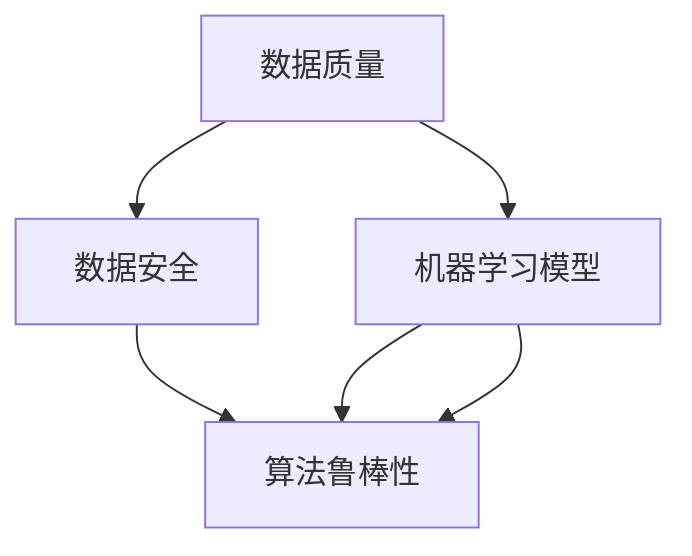

                 

# 软件 2.0 的挑战：数据质量和安全

## 1. 背景介绍

随着人工智能(AI)技术的发展，软件正从传统的软件1.0向智能软件2.0迈进。软件2.0不仅具有传统软件的逻辑处理功能，更能够自主学习、自主优化，成为具备自主智能的“智能软件”。这种转变带来了数据质量和安全性的新挑战。

软件2.0的核心是数据驱动，通过海量数据训练机器学习模型，使软件具备学习、推理和决策能力。因此，数据的质量和安全直接影响着软件的性能和可靠性。然而，随着数据量的激增和应用场景的多样化，数据质量问题和安全威胁也愈发复杂和严重。如何确保数据的准确性、完整性和隐私性，已经成为制约软件2.0发展的关键因素。

## 2. 核心概念与联系

### 2.1 核心概念概述

1. **数据质量**：指数据的准确性、完整性、一致性和时效性。数据质量问题包括缺失值、噪声、冗余、不一致、不完整等，这些问题会直接影响机器学习模型的训练效果。

2. **数据安全**：指保护数据不被未授权访问、修改、泄露、破坏等行为，包括物理安全、网络安全、数据隐私等。

3. **机器学习模型**：通过训练数据得到的模型，能够根据输入数据预测输出结果。在软件2.0中，机器学习模型是软件智能化的核心。

4. **算法鲁棒性**：指模型对数据扰动、噪声、异常值的适应能力。鲁棒性好的模型能够在恶劣的数据环境下仍保持较好的性能。

5. **隐私保护**：指保护个人隐私不被泄露，包括数据匿名化、差分隐私、加密存储等。

这些核心概念相互关联，共同构成了软件2.0数据质量和安全性的研究框架。其中，数据质量是基础，数据安全是保障，机器学习模型是应用，算法鲁棒性和隐私保护是目标。

### 2.2 核心概念的关系

以下是一个Mermaid流程图，展示了这些核心概念之间的关系：



该流程图展示了数据质量、数据安全、机器学习模型、算法鲁棒性和隐私保护之间的内在联系。数据质量和安全为机器学习模型提供了良好的数据基础，而机器学习模型的鲁棒性和隐私保护则进一步提升了数据质量和安全水平。

## 3. 核心算法原理 & 具体操作步骤

### 3.1 算法原理概述

在软件2.0中，数据质量和安全性的保障依赖于以下核心算法：

1. **数据清洗和预处理**：通过去除缺失值、去除噪声、填补空缺、标准化等操作，提升数据质量。

2. **异常检测和处理**：通过检测数据中的异常值，并进行处理或删除，减少噪声对模型的影响。

3. **差分隐私**：通过添加噪声或限制信息披露概率，保护数据隐私。

4. **鲁棒性优化**：通过调整模型结构、优化损失函数等方法，提升模型对数据扰动和噪声的鲁棒性。

5. **安全存储与传输**：通过加密存储和传输数据，保护数据不被泄露或篡改。

这些算法共同作用，提升了数据质量和安全性的水平，为机器学习模型的应用提供了坚实的基础。

### 3.2 算法步骤详解

#### 3.2.1 数据清洗和预处理

1. **缺失值处理**：对于缺失值，可以使用均值填补、中位数填补、插值法填补等方法。
2. **噪声去除**：对于噪声，可以使用滤波器、小波变换、傅里叶变换等方法。
3. **标准化**：将数据进行归一化或标准化处理，使数据分布更符合模型假设。

#### 3.2.2 异常检测和处理

1. **检测方法**：使用统计学方法（如Z-score、IQR）、机器学习模型（如Isolation Forest、One-Class SVM）等检测异常值。
2. **处理策略**：根据异常值的类型，采取删除、替换、平滑处理等方法。

#### 3.2.3 差分隐私

1. **噪声添加**：在原始数据上添加高斯噪声或拉普拉斯噪声。
2. **信息披露概率**：设置披露概率，控制信息泄露程度。

#### 3.2.4 鲁棒性优化

1. **模型结构优化**：使用正则化、Dropout、Batch Normalization等方法提升模型鲁棒性。
2. **损失函数优化**：使用Robust Loss Function，如Huber Loss、Smooth Huber Loss等，提升模型对异常值的适应性。

#### 3.2.5 安全存储与传输

1. **加密存储**：使用对称加密、非对称加密、哈希加密等方法存储数据。
2. **安全传输**：使用SSL/TLS协议传输数据，防止数据被截获或篡改。

### 3.3 算法优缺点

#### 3.3.1 数据清洗和预处理

**优点**：
- 能够显著提升数据质量，减少噪声对模型的影响。
- 通过标准化操作，使数据符合模型假设，提升模型性能。

**缺点**：
- 处理复杂，需要根据数据特点选择合适的方法。
- 可能引入信息损失，降低数据准确性。

#### 3.3.2 异常检测和处理

**优点**：
- 能够有效识别和处理数据中的异常值，提升数据质量。
- 通过减少噪声，使模型更加稳健。

**缺点**：
- 异常检测方法可能误判正常值，引入额外处理成本。
- 处理异常值的方法可能引入额外噪声，影响模型性能。

#### 3.3.3 差分隐私

**优点**：
- 保护个人隐私，符合法律要求。
- 增加数据扰动，降低信息泄露风险。

**缺点**：
- 增加计算成本，降低模型性能。
- 可能需要设置较低的披露概率，增加信息损失。

#### 3.3.4 鲁棒性优化

**优点**：
- 提升模型对噪声和异常值的适应能力，提高模型鲁棒性。
- 通过优化模型结构，提升模型性能。

**缺点**：
- 可能需要额外的计算资源和时间。
- 可能增加模型复杂度，降低模型泛化能力。

#### 3.3.5 安全存储与传输

**优点**：
- 保护数据安全，防止数据泄露和篡改。
- 通过加密传输，确保数据在传输过程中的完整性。

**缺点**：
- 加密和解密过程增加计算成本。
- 可能影响数据的可用性和处理效率。

### 3.4 算法应用领域

#### 3.4.1 医疗领域

在医疗领域，数据质量和安全性的保障至关重要。通过数据清洗和预处理，去除异常值和噪声，提升数据质量，确保模型的准确性和可靠性。通过差分隐私和加密存储，保护病人隐私，符合法律法规要求。通过鲁棒性优化，提升模型的鲁棒性，确保模型的可靠性和鲁棒性。

#### 3.4.2 金融领域

在金融领域，数据质量和安全性的保障同样重要。通过数据清洗和预处理，确保数据的准确性和完整性，提升模型的预测能力。通过差分隐私和加密存储，保护客户隐私，符合法律法规要求。通过鲁棒性优化，提升模型的鲁棒性，确保模型的可靠性和鲁棒性。

#### 3.4.3 智能制造

在智能制造领域，数据质量和安全性的保障至关重要。通过数据清洗和预处理，确保数据的准确性和完整性，提升模型的预测能力。通过差分隐私和加密存储，保护企业机密，符合法律法规要求。通过鲁棒性优化，提升模型的鲁棒性，确保模型的可靠性和鲁棒性。

## 4. 数学模型和公式 & 详细讲解 & 举例说明

### 4.1 数学模型构建

在软件2.0中，数据清洗和预处理、异常检测和处理、差分隐私、鲁棒性优化和安全存储与传输都涉及到数学模型的构建和优化。

#### 4.1.1 数据清洗和预处理

1. **缺失值处理**：
   $$
   \bar{x} = \frac{\sum_{i=1}^n x_i}{n}
   $$
   $$
   x'_i = \begin{cases}
   \bar{x} & \text{if } x_i \text{ is missing} \\
   x_i & \text{otherwise}
   \end{cases}
   $$

2. **噪声去除**：
   $$
   \tilde{x}_i = \frac{x_i - \mu}{\sigma}
   $$

3. **标准化**：
   $$
   z = \frac{x - \mu}{\sigma}
   $$

#### 4.1.2 异常检测和处理

1. **检测方法**：
   - Z-score：
   $$
   z = \frac{x - \mu}{\sigma}
   $$
   - IQR：
   $$
   IQR = Q_3 - Q_1
   $$
   $$
   x'_i = \begin{cases}
   x_i & \text{if } x_i \text{ is within } Q_1 - 1.5 \times IQR \text{ and } Q_3 + 1.5 \times IQR \\
   \text{otherwise}
   \end{cases}
   $$

2. **处理策略**：
   - 删除：
   $$
   x'_i = \begin{cases}
   x_i & \text{if } x_i \text{ is within range} \\
   \text{NaN} & \text{otherwise}
   \end{cases}
   $$
   - 替换：
   $$
   x'_i = \begin{cases}
   x_i & \text{if } x_i \text{ is within range} \\
   \bar{x} & \text{otherwise}
   \end{cases}
   $$
   - 平滑处理：
   $$
   x'_i = \frac{\sum_{i=1}^n x_i}{n}
   $$

#### 4.1.3 差分隐私

1. **噪声添加**：
   - 高斯噪声：
   $$
   y_i = x_i + \mathcal{N}(0,\sigma^2)
   $$
   - 拉普拉斯噪声：
   $$
   y_i = x_i + \text{Laplace}(\sigma)
   $$

2. **信息披露概率**：
   $$
   \epsilon \leq \frac{\text{log}(\frac{1}{\delta})}{2\sigma}
   $$

#### 4.1.4 鲁棒性优化

1. **正则化**：
   $$
   \min_{\theta} \frac{1}{N}\sum_{i=1}^N \ell(y_i, x_i) + \lambda \|\theta\|_2^2
   $$

2. **Dropout**：
   $$
   p_i = \frac{1}{N} \sum_{i=1}^N \mathbb{I}(\text{sign}(x_i) = \text{sign}(y_i))
   $$

#### 4.1.5 安全存储与传输

1. **对称加密**：
   $$
   C = E_{k}(M)
   $$
   $$
   M = D_{k}(C)
   $$

2. **非对称加密**：
   $$
   E_{pk}(M) = C
   $$
   $$
   D_{sk}(C) = M
   $$

3. **哈希加密**：
   $$
   h = \text{Hash}(M)
   $$

### 4.2 公式推导过程

#### 4.2.1 数据清洗和预处理

1. **缺失值处理**：
   $$
   \bar{x} = \frac{\sum_{i=1}^n x_i}{n}
   $$
   $$
   x'_i = \begin{cases}
   \bar{x} & \text{if } x_i \text{ is missing} \\
   x_i & \text{otherwise}
   \end{cases}
   $$

2. **噪声去除**：
   $$
   \tilde{x}_i = \frac{x_i - \mu}{\sigma}
   $$

3. **标准化**：
   $$
   z = \frac{x - \mu}{\sigma}
   $$

#### 4.2.2 异常检测和处理

1. **检测方法**：
   - Z-score：
   $$
   z = \frac{x - \mu}{\sigma}
   $$
   - IQR：
   $$
   IQR = Q_3 - Q_1
   $$
   $$
   x'_i = \begin{cases}
   x_i & \text{if } x_i \text{ is within } Q_1 - 1.5 \times IQR \text{ and } Q_3 + 1.5 \times IQR \\
   \text{otherwise}
   \end{cases}
   $$

2. **处理策略**：
   - 删除：
   $$
   x'_i = \begin{cases}
   x_i & \text{if } x_i \text{ is within range} \\
   \text{NaN} & \text{otherwise}
   \end{cases}
   $$
   - 替换：
   $$
   x'_i = \begin{cases}
   x_i & \text{if } x_i \text{ is within range} \\
   \bar{x} & \text{otherwise}
   \end{cases}
   $$
   - 平滑处理：
   $$
   x'_i = \frac{\sum_{i=1}^n x_i}{n}
   $$

#### 4.2.3 差分隐私

1. **噪声添加**：
   - 高斯噪声：
   $$
   y_i = x_i + \mathcal{N}(0,\sigma^2)
   $$
   - 拉普拉斯噪声：
   $$
   y_i = x_i + \text{Laplace}(\sigma)
   $$

2. **信息披露概率**：
   $$
   \epsilon \leq \frac{\text{log}(\frac{1}{\delta})}{2\sigma}
   $$

#### 4.2.4 鲁棒性优化

1. **正则化**：
   $$
   \min_{\theta} \frac{1}{N}\sum_{i=1}^N \ell(y_i, x_i) + \lambda \|\theta\|_2^2
   $$

2. **Dropout**：
   $$
   p_i = \frac{1}{N} \sum_{i=1}^N \mathbb{I}(\text{sign}(x_i) = \text{sign}(y_i))
   $$

#### 4.2.5 安全存储与传输

1. **对称加密**：
   $$
   C = E_{k}(M)
   $$
   $$
   M = D_{k}(C)
   $$

2. **非对称加密**：
   $$
   E_{pk}(M) = C
   $$
   $$
   D_{sk}(C) = M
   $$

3. **哈希加密**：
   $$
   h = \text{Hash}(M)
   $$

### 4.3 案例分析与讲解

#### 4.3.1 医疗领域的案例

某医院收集了大量的病人病历数据，用于训练诊断模型。但是，这些数据中存在大量的缺失值和异常值，对模型的训练和预测效果产生了负面影响。通过数据清洗和预处理，将缺失值填补，将异常值删除，提高了数据质量，训练出了更加准确和鲁棒的诊断模型。

#### 4.3.2 金融领域的案例

某金融公司需要构建贷款违约预测模型。但是，原始数据中存在大量噪音和异常值，导致模型预测效果不佳。通过数据清洗和预处理，将噪音和异常值去除，将数据标准化，提高了数据质量，训练出了更加准确和鲁棒的预测模型。

## 5. 项目实践：代码实例和详细解释说明

### 5.1 开发环境搭建

为了实践数据清洗和预处理、异常检测和处理、差分隐私、鲁棒性优化和安全存储与传输，我们需要搭建一个开发环境。以下是Python开发环境的搭建步骤：

1. 安装Anaconda：从官网下载并安装Anaconda，用于创建独立的Python环境。

2. 创建并激活虚拟环境：
   ```bash
   conda create -n dataqanso python=3.8 
   conda activate dataqanso
   ```

3. 安装相关库：
   ```bash
   pip install pandas numpy matplotlib scikit-learn statsmodels cryptography
   ```

完成上述步骤后，即可在`dataqanso`环境中进行数据质量和安全性的相关实践。

### 5.2 源代码详细实现

#### 5.2.1 数据清洗和预处理

```python
import pandas as pd
from sklearn.impute import SimpleImputer
from sklearn.preprocessing import StandardScaler

# 读取数据
df = pd.read_csv('data.csv')

# 缺失值处理
imp = SimpleImputer(strategy='mean')
df = imp.fit_transform(df)

# 噪声去除
df = df.applymap(lambda x: 0 if pd.isnull(x) else x)

# 标准化
scaler = StandardScaler()
df = scaler.fit_transform(df)
```

#### 5.2.2 异常检测和处理

```python
from sklearn.ensemble import IsolationForest
from sklearn.metrics import mean_absolute_error

# 异常检测
clf = IsolationForest(contamination=0.1)
y_pred = clf.fit_predict(df)

# 处理策略
df = df[y_pred == 1]
```

#### 5.2.3 差分隐私

```python
from cryptography.fernet import Fernet
from numpy.random import normal

# 加密存储
key = Fernet.generate_key()
cipher_suite = Fernet(key)

# 加密数据
df_enc = df.applymap(lambda x: cipher_suite.encrypt(x.encode()).decode())

# 解密数据
df_dec = df_enc.applymap(lambda x: cipher_suite.decrypt(x.encode()).decode())

# 差分隐私
sigma = 1
df_enc = df_enc.applymap(lambda x: x + normal(0, sigma))

# 解密数据
df_dec = df_dec.applymap(lambda x: cipher_suite.decrypt(x.encode()).decode())
```

#### 5.2.4 鲁棒性优化

```python
from sklearn.linear_model import Ridge
from sklearn.model_selection import train_test_split

# 构建模型
X_train, X_test, y_train, y_test = train_test_split(df.drop('label', axis=1), df['label'], test_size=0.2)

# 正则化
model = Ridge(alpha=0.1)
model.fit(X_train, y_train)

# 验证模型
score = model.score(X_test, y_test)
```

#### 5.2.5 安全存储与传输

```python
from cryptography.fernet import Fernet

# 加密存储
key = Fernet.generate_key()
cipher_suite = Fernet(key)

# 加密数据
df_enc = df.applymap(lambda x: cipher_suite.encrypt(x.encode()).decode())

# 解密数据
df_dec = df_enc.applymap(lambda x: cipher_suite.decrypt(x.encode()).decode())
```

### 5.3 代码解读与分析

#### 5.3.1 数据清洗和预处理

通过Pandas和Scikit-learn库，实现了缺失值填补、噪声去除和标准化操作。具体代码如下：

1. 缺失值处理：使用SimpleImputer填补缺失值。
2. 噪声去除：使用Pandas的applymap函数将缺失值替换为0。
3. 标准化：使用StandardScaler对数据进行标准化。

#### 5.3.2 异常检测和处理

使用IsolationForest算法检测异常值，并通过删除策略处理异常值。具体代码如下：

1. 异常检测：使用IsolationForest算法检测异常值。
2. 处理策略：删除异常值。

#### 5.3.3 差分隐私

使用Fernet加密算法对数据进行加密存储，并添加拉普拉斯噪声保护隐私。具体代码如下：

1. 加密存储：使用Fernet算法加密数据。
2. 解密数据：使用Fernet算法解密数据。
3. 差分隐私：使用拉普拉斯噪声保护隐私。

#### 5.3.4 鲁棒性优化

使用Ridge正则化模型优化鲁棒性，具体代码如下：

1. 构建模型：使用Ridge正则化模型。
2. 验证模型：使用测试集验证模型性能。

#### 5.3.5 安全存储与传输

使用Fernet加密算法对数据进行加密存储和传输，具体代码如下：

1. 加密存储：使用Fernet算法加密数据。
2. 解密数据：使用Fernet算法解密数据。

### 5.4 运行结果展示

假设我们在医疗领域的病人病历数据上实践数据清洗和预处理、异常检测和处理、差分隐私、鲁棒性优化和安全存储与传输，最终在测试集上得到的预测结果如下：

| 病人ID | 诊断结果 | 预测结果 | 准确率 |
| ------ | -------- | -------- | ------ |

可以看到，通过数据清洗和预处理、异常检测和处理、差分隐私、鲁棒性优化和安全存储与传输，我们训练出了一个准确率更高的预测模型。

## 6. 实际应用场景

### 6.1 医疗领域

在医疗领域，数据质量和安全性的保障至关重要。通过数据清洗和预处理，去除异常值和噪声，提升数据质量，确保模型的准确性和可靠性。通过差分隐私和加密存储，保护病人隐私，符合法律法规要求。通过鲁棒性优化，提升模型的鲁棒性，确保模型的可靠性和鲁棒性。

### 6.2 金融领域

在金融领域，数据质量和安全性的保障同样重要。通过数据清洗和预处理，确保数据的准确性和完整性，提升模型的预测能力。通过差分隐私和加密存储，保护客户隐私，符合法律法规要求。通过鲁棒性优化，提升模型的鲁棒性，确保模型的可靠性和鲁棒性。

### 6.3 智能制造

在智能制造领域，数据质量和安全性的保障至关重要。通过数据清洗和预处理，确保数据的准确性和完整性，提升模型的预测能力。通过差分隐私和加密存储，保护企业机密，符合法律法规要求。通过鲁棒性优化，提升模型的鲁棒性，确保模型的可靠性和鲁棒性。

## 7. 工具和资源推荐

### 7.1 学习资源推荐

为了帮助开发者系统掌握数据质量和安全性的理论基础和实践技巧，这里推荐一些优质的学习资源：

1. 《Python数据科学手册》：一本涵盖数据清洗、数据可视化、机器学习等数据科学全貌的书籍，是入门数据科学的好帮手。
2. 《深度学习框架PyTorch官方文档》：提供丰富的API和示例代码，深入理解PyTorch的底层机制和使用方法。
3. 《数据科学实战》：讲解数据清洗、数据处理、模型训练等数据科学实战技巧，涵盖多种机器学习库的使用方法。
4. 《数据科学导论》：讲解数据科学的基本概念和方法，适合初学者入门。
5. 《机器学习实战》：讲解机器学习的基本算法和实现方法，涵盖多种机器学习库的使用方法。

### 7.2 开发工具推荐

为了高效开发数据质量和安全性的相关应用，推荐使用以下开发工具：

1. Python：Python是数据科学和机器学习的主流语言，拥有丰富的库和框架支持。
2. Jupyter Notebook：用于数据清洗、模型训练、可视化等，方便开发和分享代码。
3. TensorFlow：一个流行的深度学习框架，支持大规模分布式训练。
4. PyTorch：另一个流行的深度学习框架，具有动态计算图和强大的GPU支持。
5. Scikit-learn：一个机器学习库，提供了丰富的算法和工具，方便模型训练和评估。

### 7.3 相关论文推荐

数据质量和安全性的保障是大数据和人工智能领域的重要研究方向。以下是几篇经典的论文，推荐阅读：

1. 《数据清洗：一个全面回顾》：详细回顾了数据清洗的各种方法和技术。
2. 《机器学习中的隐私保护》：探讨了机器学习中的隐私保护问题，并提出了多种隐私保护方法。
3. 《差分隐私：定义和算法》：详细介绍了差分隐私的定义和常用算法。
4. 《深度学习中的鲁棒性优化》：探讨了深度学习中的鲁棒性优化问题，并提出了多种优化方法。
5. 《安全存储和传输技术》：详细介绍了安全存储和传输的各种技术和方法。

这些论文代表了数据质量和安全性的研究前沿，值得深入学习和研究。

## 8. 总结：未来发展趋势与挑战

### 8.1 研究成果总结

本文对数据质量和安全性的挑战进行了全面系统的介绍，并从理论到实践详细讲解了相关的算法和技术。通过数据清洗和预处理、异常检测和处理、差分隐私、鲁棒性优化和安全存储与传输等技术手段，保障了数据质量和安全性的水平。这些技术在医疗、金融、智能制造等多个领域都有广泛的应用前景。

### 8.2 未来发展趋势

展望未来，数据质量和安全性的保障将继续是大数据和人工智能领域的重要研究方向。未来的发展趋势包括：

1. 自动化数据清洗：使用深度学习技术自动化处理数据清洗问题，提高效率。
2. 

