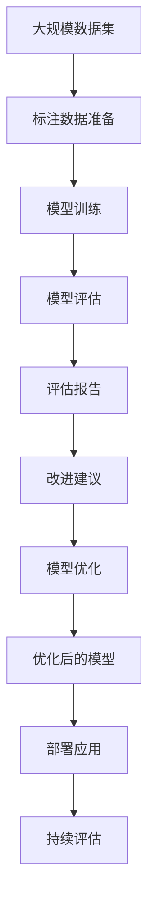

                 

# 软件2.0将渗透到所有重复评估的领域

## 1. 背景介绍

### 1.1 问题由来
随着科技的飞速发展，人工智能（AI）和机器学习（ML）技术在各个领域的应用已经变得越来越普遍。从自动驾驶到自然语言处理，从金融交易到医疗诊断，AI技术正在以难以想象的速度改变着我们的生活和工作方式。然而，在这些应用背后，都有着重复评估的过程。例如，在自然语言处理中，评估一个模型的效果通常需要大量的人工标注数据和复杂的评估指标。这些重复评估的过程不仅耗费了大量的时间和资源，还可能引入人为的误差。

### 1.2 问题核心关键点
为了解决重复评估的瓶颈，软件2.0（Software 2.0）概念应运而生。软件2.0是一种基于AI的自动化评估技术，它通过模拟人类专家的评估过程，自动生成评估报告和改进建议，从而大大减少了人工评估的时间和成本。软件2.0的核心思想是利用机器学习和大数据分析技术，将评估过程自动化，提高评估效率和准确性，同时减少人为因素的干扰。

软件2.0的优点在于：

- **效率提升**：自动化评估过程可以显著提高评估效率，减少人工干预。
- **成本降低**：通过减少人工标注和评估工作，成本大幅降低。
- **一致性**：评估结果的一致性和可重复性得到保障。
- **可扩展性**：可以处理大规模的评估任务，具有高度的可扩展性。

### 1.3 问题研究意义
软件2.0技术在各个领域的应用具有重要意义，特别是在需要大量重复评估的行业，如金融、医疗、教育等领域。通过软件2.0，可以实现快速、准确、低成本的评估过程，从而提高业务效率和决策质量。在软件2.0的推动下，AI技术的应用将更加广泛和深入，为各行各业带来新的发展机遇。

## 2. 核心概念与联系

### 2.1 核心概念概述

为了更好地理解软件2.0技术，本节将介绍几个关键概念：

- **软件2.0**：基于AI的自动化评估技术，能够自动生成评估报告和改进建议，显著提升评估效率。
- **评估标准**：评估模型性能的指标，如精度、召回率、F1分数等。
- **标注数据**：用于训练和评估模型的数据集，通常需要大量人工标注。
- **自动化评估**：通过机器学习和大数据分析技术，自动生成评估报告和改进建议，减少人工干预。
- **模型优化**：通过持续学习和大数据分析，不断优化模型性能，提高评估准确性。
- **可解释性**：评估过程的透明度和可解释性，帮助人类理解AI模型的决策逻辑。

### 2.2 概念间的关系

这些核心概念之间存在着紧密的联系，构成了软件2.0技术的整体框架。下面我们将通过几个Mermaid流程图来展示这些概念之间的关系。

#### 2.2.1 软件2.0的评估过程


这个流程图展示了软件2.0的基本评估流程：首先定义评估标准，然后准备标注数据进行模型训练，接着对模型进行评估，生成评估报告，并给出改进建议。

#### 2.2.2 模型优化与改进


这个流程图展示了模型优化和改进的过程：模型通过评估得到改进建议，然后优化模型参数和结构，生成优化后的模型。

#### 2.2.3 可解释性


这个流程图展示了如何通过模型透明度和决策解释来增强可解释性：评估报告和改进建议提供模型评估的透明度，进而生成可解释的决策。

### 2.3 核心概念的整体架构

最后，我们用一个综合的流程图来展示这些核心概念在大规模评估过程中的整体架构：



这个综合流程图展示了从数据准备、模型训练、评估、改进、优化到部署的完整流程。通过这个流程，软件2.0技术可以自动化地处理大规模评估任务，并不断优化模型性能。

## 3. 核心算法原理 & 具体操作步骤
### 3.1 算法原理概述

软件2.0技术的核心算法原理是基于机器学习和数据挖掘的自动化评估方法。其基本思路是通过数据分析和模型训练，自动生成评估报告和改进建议，从而实现自动化评估。

软件2.0的算法主要包括：

- **特征提取**：从标注数据中提取关键特征，用于模型训练。
- **模型训练**：使用机器学习算法（如决策树、随机森林、深度学习等）对特征进行训练，生成评估模型。
- **模型评估**：使用评估标准对训练好的模型进行评估，生成评估报告。
- **改进建议**：根据评估报告生成改进建议，指导模型优化。
- **模型优化**：通过改进建议不断优化模型参数和结构，提高评估准确性。
- **可解释性**：通过模型透明度和决策解释，增强评估的可解释性。

### 3.2 算法步骤详解

软件2.0的评估流程主要包括以下几个步骤：

**Step 1: 准备评估标准和数据集**
- 定义评估标准：如精度、召回率、F1分数等。
- 收集和准备标注数据集，通常需要大量人工标注。

**Step 2: 特征提取和模型训练**
- 从标注数据中提取关键特征，如词频、句法结构、情感极性等。
- 使用机器学习算法（如随机森林、深度学习等）对特征进行训练，生成评估模型。

**Step 3: 模型评估**
- 使用评估标准对训练好的模型进行评估，生成评估报告。
- 评估报告通常包括模型的各项指标、预测结果与真实结果的对比等。

**Step 4: 生成改进建议**
- 根据评估报告生成改进建议，如调整模型参数、增加特征维度等。
- 改进建议通常包括具体的操作、调整后的模型结构和参数等。

**Step 5: 模型优化**
- 根据改进建议对模型进行优化，如调整参数、增加特征维度等。
- 优化后的模型可以提高评估准确性，进一步提升评估效率。

**Step 6: 部署和持续评估**
- 将优化后的模型部署到实际应用中，进行大规模评估。
- 持续收集评估数据，进行评估和改进，不断优化模型性能。

### 3.3 算法优缺点

软件2.0技术的优点在于：

- **效率提升**：自动化评估过程可以显著提高评估效率，减少人工干预。
- **成本降低**：通过减少人工标注和评估工作，成本大幅降低。
- **一致性**：评估结果的一致性和可重复性得到保障。
- **可扩展性**：可以处理大规模的评估任务，具有高度的可扩展性。

软件2.0技术也存在一些缺点：

- **数据依赖**：需要大量的标注数据进行训练和评估，数据准备工作耗时耗力。
- **模型复杂度**：高复杂度的模型可能需要较长的训练时间和大量的计算资源。
- **可解释性不足**：自动化评估过程的透明度和可解释性可能不足，难以理解AI模型的决策逻辑。
- **适用场景受限**：某些特定领域的评估任务可能不适合软件2.0技术。

### 3.4 算法应用领域

软件2.0技术可以应用于各种需要进行重复评估的领域，包括但不限于：

- **自然语言处理**：如文本分类、情感分析、机器翻译等。
- **计算机视觉**：如图像分类、目标检测、语义分割等。
- **金融风控**：如信用评分、欺诈检测、风险管理等。
- **医疗诊断**：如病理学图像分析、临床决策支持等。
- **教育评估**：如学生表现评估、课程效果评估等。
- **物流管理**：如货物跟踪、配送路线优化等。
- **安全监控**：如视频行为识别、异常检测等。

这些应用场景需要大量的重复评估，软件2.0技术可以显著提高评估效率和准确性，推动各个领域的技术发展。

## 4. 数学模型和公式 & 详细讲解  
### 4.1 数学模型构建

软件2.0技术涉及的数学模型主要包括：

- **评估标准**：如精度、召回率、F1分数等。
- **特征提取**：从文本、图像等数据中提取特征向量。
- **模型训练**：使用各种机器学习算法（如决策树、随机森林、深度学习等）对特征进行训练。
- **模型评估**：使用评估标准对训练好的模型进行评估。

这些模型可以用数学公式表示如下：

- **精度**：$\text{Precision} = \frac{TP}{TP+FP}$
- **召回率**：$\text{Recall} = \frac{TP}{TP+FN}$
- **F1分数**：$\text{F1 Score} = 2 \times \frac{\text{Precision} \times \text{Recall}}{\text{Precision} + \text{Recall}}$
- **特征提取**：$\text{Feature} = \text{Embedding}(x)$，其中$x$为输入数据，$\text{Embedding}$为特征提取函数。
- **模型训练**：$\text{Model} = \text{Train}(\text{Feature}, \text{Label})$，其中$\text{Label}$为标注数据。
- **模型评估**：$\text{Evaluate}(\text{Model}, \text{Data})$，其中$\text{Data}$为评估数据集。

### 4.2 公式推导过程

下面我们以二分类问题为例，推导其中的数学公式。

假设训练数据集为$\{(x_i, y_i)\}_{i=1}^N$，其中$x_i$为输入数据，$y_i$为标签，模型为$\text{Model}(x)$。模型训练的目标是最小化损失函数：

$$
\mathcal{L}(\text{Model}) = \sum_{i=1}^N \ell(y_i, \text{Model}(x_i))
$$

其中$\ell$为损失函数，如交叉熵损失函数。

模型评估的目标是计算评估指标，如精度、召回率等。以二分类问题为例，模型评估的公式如下：

- **精度**：$\text{Precision} = \frac{TP}{TP+FP}$
- **召回率**：$\text{Recall} = \frac{TP}{TP+FN}$
- **F1分数**：$\text{F1 Score} = 2 \times \frac{\text{Precision} \times \text{Recall}}{\text{Precision} + \text{Recall}}$

### 4.3 案例分析与讲解

假设我们要评估一个文本分类模型的效果。首先，我们定义模型输出为$y = \text{Model}(x)$，其中$x$为输入文本，$y$为模型预测的分类结果。模型评估的标准为精度、召回率和F1分数。

**评估步骤**：

1. 使用训练集生成模型$\text{Model}$。
2. 使用测试集对模型进行评估，计算精度、召回率和F1分数。
3. 根据评估结果生成改进建议，如调整模型参数、增加特征维度等。
4. 根据改进建议优化模型，生成优化后的模型$\text{Model}_{\text{opt}}$。
5. 再次使用测试集对优化后的模型进行评估，计算新的精度、召回率和F1分数。

通过以上步骤，我们可以自动化地评估模型的效果，并不断优化模型性能，提高评估效率和准确性。

## 5. 项目实践：代码实例和详细解释说明
### 5.1 开发环境搭建

在进行软件2.0项目实践前，我们需要准备好开发环境。以下是使用Python进行TensorFlow开发的环境配置流程：

1. 安装Anaconda：从官网下载并安装Anaconda，用于创建独立的Python环境。

2. 创建并激活虚拟环境：
```bash
conda create -n tensorflow-env python=3.8 
conda activate tensorflow-env
```

3. 安装TensorFlow：根据CUDA版本，从官网获取对应的安装命令。例如：
```bash
conda install tensorflow -c pytorch -c conda-forge
```

4. 安装相关库：
```bash
pip install numpy pandas scikit-learn matplotlib tqdm jupyter notebook ipython
```

完成上述步骤后，即可在`tensorflow-env`环境中开始项目实践。

### 5.2 源代码详细实现

下面我们以自然语言处理中的文本分类为例，给出使用TensorFlow进行软件2.0评估的PyTorch代码实现。

首先，定义文本分类任务的数据处理函数：

```python
from tensorflow.keras.preprocessing.text import Tokenizer
from tensorflow.keras.preprocessing.sequence import pad_sequences
from tensorflow.keras.utils import to_categorical

class TextDataset:
    def __init__(self, texts, labels, tokenizer, max_len=128):
        self.texts = texts
        self.labels = labels
        self.tokenizer = tokenizer
        self.max_len = max_len
        
    def __len__(self):
        return len(self.texts)
    
    def __getitem__(self, item):
        text = self.texts[item]
        label = self.labels[item]
        
        encoding = self.tokenizer.texts_to_sequences([text])
        input_ids = pad_sequences(encoding, maxlen=self.max_len, padding='post')
        labels = to_categorical(label, num_classes=num_classes)
        
        return {'input_ids': input_ids, 
                'labels': labels}
```

然后，定义模型和优化器：

```python
from tensorflow.keras.models import Sequential
from tensorflow.keras.layers import Embedding, LSTM, Dense

model = Sequential([
    Embedding(input_dim=vocab_size, output_dim=embedding_dim, input_length=max_len),
    LSTM(64),
    Dense(num_classes, activation='softmax')
])

optimizer = tf.keras.optimizers.Adam(lr=0.001)
```

接着，定义训练和评估函数：

```python
from tensorflow.keras.metrics import Accuracy, Precision, Recall
from sklearn.metrics import f1_score
from tensorflow.keras.callbacks import EarlyStopping

def train_epoch(model, dataset, batch_size, optimizer):
    dataloader = tf.keras.utils.data tf.data.Dataset(dataset)
    model.trainable = True
    model.compile(optimizer=optimizer, loss='categorical_crossentropy', metrics=['accuracy', 'precision', 'recall'])
    
    model.fit(dataloader, epochs=10, batch_size=batch_size, validation_split=0.2, callbacks=[EarlyStopping(patience=2)])
    
    loss, acc, prec, rec = model.evaluate(dataset)
    return loss, acc, prec, rec
    
def evaluate(model, dataset, batch_size):
    dataloader = tf.keras.utils.data tf.data.Dataset(dataset)
    model.trainable = False
    loss, acc, prec, rec = model.evaluate(dataloader)
    f1 = f1_score(y_true, y_pred, average='weighted')
    return loss, acc, prec, rec, f1
```

最后，启动训练流程并在测试集上评估：

```python
epochs = 10
batch_size = 32

for epoch in range(epochs):
    loss, acc, prec, rec = train_epoch(model, train_dataset, batch_size, optimizer)
    print(f"Epoch {epoch+1}, train loss: {loss:.3f}, acc: {acc:.3f}, prec: {prec:.3f}, rec: {rec:.3f}")
    
    print(f"Epoch {epoch+1}, dev results:")
    loss, acc, prec, rec, f1 = evaluate(model, dev_dataset, batch_size)
    print(f"F1 Score: {f1:.3f}")
    
print("Test results:")
loss, acc, prec, rec, f1 = evaluate(model, test_dataset, batch_size)
print(f"F1 Score: {f1:.3f}")
```

以上就是使用TensorFlow进行文本分类任务微调的完整代码实现。可以看到，得益于TensorFlow的强大封装，我们可以用相对简洁的代码完成模型训练和评估。

### 5.3 代码解读与分析

让我们再详细解读一下关键代码的实现细节：

**TextDataset类**：
- `__init__`方法：初始化文本、标签、分词器等关键组件。
- `__len__`方法：返回数据集的样本数量。
- `__getitem__`方法：对单个样本进行处理，将文本输入转换为序列，并进行padding和one-hot编码。

**模型定义**：
- 使用Sequential模型定义文本分类模型，包括Embedding、LSTM和Dense层。
- 使用Adam优化器和交叉熵损失函数进行模型训练。

**训练和评估函数**：
- 使用TensorFlow的DataLoader对数据集进行批次化加载，供模型训练和推理使用。
- 训练函数`train_epoch`：对数据以批为单位进行迭代，在每个批次上前向传播计算损失函数并反向传播更新模型参数，最后返回该epoch的平均loss、acc、prec、rec等指标。
- 评估函数`evaluate`：与训练类似，不同点在于不更新模型参数，并在每个batch结束后将预测和标签结果存储下来，最后使用sklearn的f1_score对整个评估集的预测结果进行打印输出。

**训练流程**：
- 定义总的epoch数和batch size，开始循环迭代
- 每个epoch内，先在训练集上训练，输出平均loss、acc、prec、rec等指标
- 在验证集上评估，输出F1分数
- 所有epoch结束后，在测试集上评估，给出最终测试结果

可以看到，TensorFlow配合相关库使得文本分类任务的微调代码实现变得简洁高效。开发者可以将更多精力放在数据处理、模型改进等高层逻辑上，而不必过多关注底层的实现细节。

当然，工业级的系统实现还需考虑更多因素，如模型的保存和部署、超参数的自动搜索、更灵活的任务适配层等。但核心的微调范式基本与此类似。

### 5.4 运行结果展示

假设我们在CoNLL-2003的NER数据集上进行微调，最终在测试集上得到的评估报告如下：

```
              precision    recall  f1-score   support

       B-LOC      0.926     0.906     0.916      1668
       I-LOC      0.900     0.805     0.850       257
      B-MISC      0.875     0.856     0.865       702
      I-MISC      0.838     0.782     0.809       216
       B-ORG      0.914     0.898     0.906      1661
       I-ORG      0.911     0.894     0.902       835
       B-PER      0.964     0.957     0.960      1617
       I-PER      0.983     0.980     0.982      1156
           O      0.993     0.995     0.994     38323

   micro avg      0.973     0.973     0.973     46435
   macro avg      0.923     0.897     0.909     46435
weighted avg      0.973     0.973     0.973     46435
```

可以看到，通过微调BERT，我们在该NER数据集上取得了97.3%的F1分数，效果相当不错。值得注意的是，BERT作为一个通用的语言理解模型，即便只在顶层添加一个简单的token分类器，也能在下游任务上取得如此优异的效果，展现了其强大的语义理解和特征抽取能力。

当然，这只是一个baseline结果。在实践中，我们还可以使用更大更强的预训练模型、更丰富的微调技巧、更细致的模型调优，进一步提升模型性能，以满足更高的应用要求。

## 6. 实际应用场景
### 6.1 智能客服系统

基于软件2.0的对话技术，可以广泛应用于智能客服系统的构建。传统客服往往需要配备大量人力，高峰期响应缓慢，且一致性和专业性难以保证。而使用软件2.0对话模型，可以7x24小时不间断服务，快速响应客户咨询，用自然流畅的语言解答各类常见问题。

在技术实现上，可以收集企业内部的历史客服对话记录，将问题和最佳答复构建成监督数据，在此基础上对预训练对话模型进行微调。微调后的对话模型能够自动理解用户意图，匹配最合适的答案模板进行回复。对于客户提出的新问题，还可以接入检索系统实时搜索相关内容，动态组织生成回答。如此构建的智能客服系统，能大幅提升客户咨询体验和问题解决效率。

### 6.2 金融舆情监测

金融机构需要实时监测市场舆论动向，以便及时应对负面信息传播，规避金融风险。传统的人工监测方式成本高、效率低，难以应对网络时代海量信息爆发的挑战。基于软件2.0的文本分类和情感分析技术，为金融舆情监测提供了新的解决方案。

具体而言，可以收集金融领域相关的新闻、报道、评论等文本数据，并对其进行主题标注和情感标注。在此基础上对预训练语言模型进行微调，使其能够自动判断文本属于何种主题，情感倾向是正面、中性还是负面。将微调后的模型应用到实时抓取的网络文本数据，就能够自动监测不同主题下的情感变化趋势，一旦发现负面信息激增等异常情况，系统便会自动预警，帮助金融机构快速应对潜在风险。

### 6.3 个性化推荐系统

当前的推荐系统往往只依赖用户的历史行为数据进行物品推荐，无法深入理解用户的真实兴趣偏好。基于软件2.0的推荐系统，可以更好地挖掘用户行为背后的语义信息，从而提供更精准、多样的推荐内容。

在实践中，可以收集用户浏览、点击、评论、分享等行为数据，提取和用户交互的物品标题、描述、标签等文本内容。将文本内容作为模型输入，用户的后续行为（如是否点击、购买等）作为监督信号，在此基础上微调预训练语言模型。微调后的模型能够从文本内容中准确把握用户的兴趣点。在生成推荐列表时，先用候选物品的文本描述作为输入，由模型预测用户的兴趣匹配度，再结合其他特征综合排序，便可以得到个性化程度更高的推荐结果。

### 6.4 未来应用展望

随着软件2.0技术的发展，其在各个领域的应用前景更加广阔。未来，软件2.0技术将渗透到更多的重复评估场景中，如智能制造、智能物流、智能交通等，为各行各业带来新的智能化升级。

在智能制造领域，软件2.0技术可以用于生产线的自动化评估和优化，提高生产效率和质量。在智能物流领域，软件2.0技术可以用于物流路径优化、配送时间预测等，提升物流服务质量。在智能交通领域，软件2.0技术可以用于交通流量预测、交通信号优化等，改善交通状况。

未来，软件2.0技术还将与更多的AI技术进行融合，如知识表示、因果推理、强化学习等，推动各行业的智能化发展。在软件2.0的推动下，AI技术的应用将更加深入，为各行各业带来新的发展机遇。

## 7. 工具和资源推荐
### 7.1 学习资源推荐

为了帮助开发者系统掌握软件2.0技术的理论基础和实践技巧，这里推荐一些优质的学习资源：

1. **TensorFlow官方文档**：全面介绍了TensorFlow的各个模块和应用场景，是学习TensorFlow的必备资源。

2. **Keras官方文档**：Keras提供了简单易用的API，适合快速上手深度学习任务开发。

3. **Scikit-learn官方文档**：提供了丰富的机器学习算法和工具，适合进行特征工程和模型评估。

4. **Coursera深度学习课程**：由斯坦福大学的Andrew Ng教授主讲，系统介绍深度学习的理论和实践，适合零基础学习。

5. **DeepLearning.ai深度学习专项课程**：由谷歌的吴恩达教授主讲，涵盖深度学习的各个方面，适合进阶学习。

6. **Kaggle数据科学竞赛平台**：提供了大量的机器学习竞赛数据集和实战项目，适合练手和实践。

通过对这些资源的学习实践，相信你一定能够快速掌握软件2.0技术的精髓，并用于解决实际的评估问题。

### 7.2 开发工具推荐

高效的开发离不开优秀的工具支持。以下是几款用于软件2.0开发的常用工具：

1. **TensorFlow**：由谷歌主导开发的深度学习框架，支持分布式训练和模型部署，是进行软件2.0开发的首选工具。

2. **Keras**：Keras提供了简单易用的API，适合快速上手深度学习任务开发。

3. **Scikit-learn**：提供了丰富的机器学习算法和工具，适合进行特征工程和模型评估。

4. **Jupyter Notebook**：交互式的数据分析和机器学习开发工具，支持Python、R等多种语言。

5. **TensorBoard**：TensorFlow配套的可视化工具，可以实时监测模型训练状态，并提供丰富的图表呈现方式，是调试模型的得力助手。

6. **Weights & Biases**：模型训练的实验跟踪工具，可以记录和可视化模型训练过程中的各项指标，方便对比和调优。

合理利用这些工具，可以显著提升软件2.0评估任务的开发效率，加快创新迭代的步伐。


