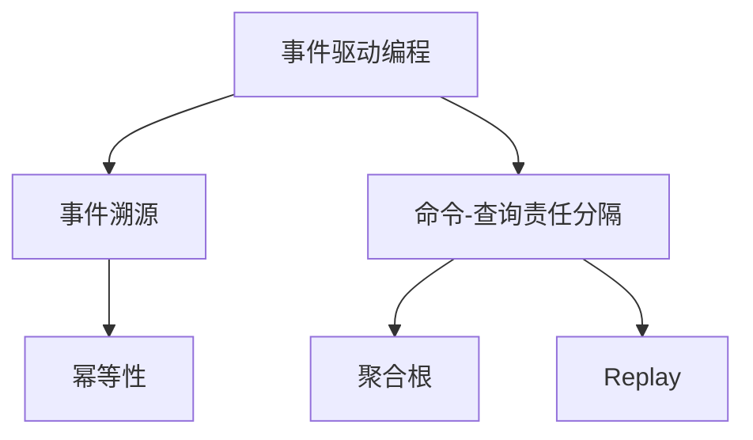
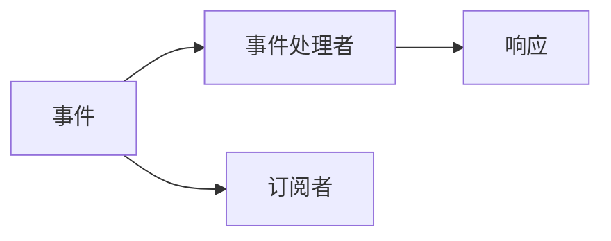
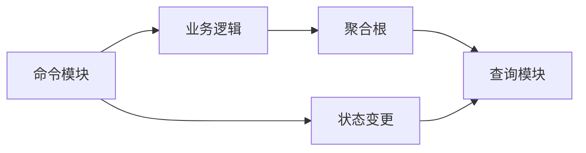
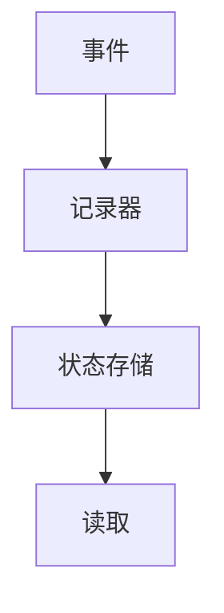
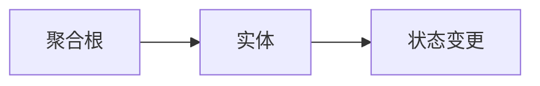
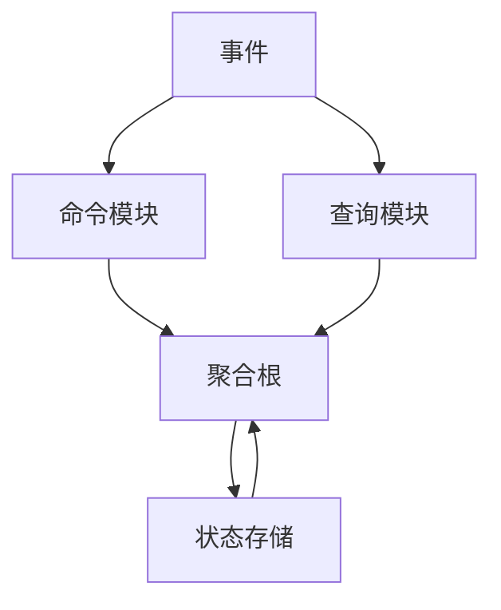

                 

# 软件2.0的事件溯源与CQRS模式

> 关键词：软件2.0, 事件溯源, CQRS, 面向事件, 面向命令, 分布式系统, 异步通信, 实时性, 数据一致性, 事件存储, 聚合根

## 1. 背景介绍

### 1.1 问题由来
随着软件系统的复杂度不断攀升，如何管理好代码库、追踪系统的演进历史、维护软件的稳定性和可扩展性，成为了软件开发人员面临的重大挑战。传统的面向对象编程(OOP)范式在应对这些挑战时显得力不从心。因此，面向事件编程(Event-Driven Programming)和命令-查询责任分隔(CQRS)模式应运而生，成为现代软件开发的重要趋势。

事件驱动和CQRS模式是软件2.0时代的核心技术，通过事件驱动编程，可以更好地实现系统的异步通信、实时性要求和数据一致性维护。而CQRS模式则是一种架构设计，通过将系统划分为不同的读写分离的命令和查询端，优化了系统的性能和扩展性。

### 1.2 问题核心关键点
本文聚焦于软件2.0时代的事件驱动和CQRS模式，旨在通过事件溯源技术，深入解析这些模式在异步、分布式系统中的实现机制，并探讨其在事件驱动和CQRS模式中的应用。

## 2. 核心概念与联系

### 2.1 核心概念概述

为更好地理解事件驱动和CQRS模式的原理与架构，本节将介绍几个关键概念及其之间的联系：

- **事件驱动编程(Event-Driven Programming)**：以事件为核心驱动的软件开发范式，系统通过发布事件来通知其他组件进行处理。事件通常包括信息、状态变更等。

- **命令-查询责任分隔(CQRS)**：一种软件架构设计，将系统分为命令和查询两个独立的模块。命令模块负责处理业务逻辑和修改状态，而查询模块负责读取数据和提供用户界面。

- **事件溯源(Event Sourcing)**：一种数据存储方式，通过记录每次事件处理后的系统状态变化，实现系统的状态可追溯和重现。

- **聚合根(Aggregate Root)**：CQRS模式中一个重要的概念，指由一组相关的实体或对象组成的根节点，负责聚合和管理这些实体的状态。

- **幂等性(Idempotence)**：一个操作对其输入的多次执行不会改变系统状态，即重复执行操作和一次执行结果相同。

- **Replay**：将过去发生的事件重新播放，以恢复系统到某个历史状态的过程。

这些概念之间的联系可以通过以下Mermaid流程图来展示：



这个流程图展示了事件驱动和CQRS模式的关键概念及其相互关系：

1. 事件驱动编程以事件为核心驱动，通过事件来通知系统组件进行相应处理。
2. CQRS模式将系统分为命令和查询两个独立模块，命令负责修改状态，查询负责读取数据。
3. 事件溯源通过记录每次事件处理后的系统状态变化，实现系统的状态可追溯和重现。
4. 聚合根是CQRS模式中的一个重要概念，负责管理和聚合相关实体的状态。
5. 幂等性保证操作重复执行不会改变系统状态，确保了系统的一致性和稳定性。
6. Replay通过回放事件，恢复系统到某个历史状态，帮助实现系统状态的追溯和重现。

这些概念共同构成了事件驱动和CQRS模式的架构基础，使其能够更好地应对现代软件开发中的异步、分布式需求和性能优化。

### 2.2 概念间的关系

这些核心概念之间存在着紧密的联系，形成了事件驱动和CQRS模式的技术生态系统。下面我们通过几个Mermaid流程图来展示这些概念之间的关系。

#### 2.2.1 事件驱动编程的基本原理



这个流程图展示了事件驱动编程的基本原理：

1. 事件被发布到系统中。
2. 事件处理者接收到事件，进行处理。
3. 事件处理者的响应被订阅者接收。

#### 2.2.2 CQRS模式的应用场景



这个流程图展示了CQRS模式的应用场景：

1. 命令模块接收命令，进行业务逻辑处理。
2. 命令模块的状态发生变更。
3. 变更后的状态通过聚合根进行管理和聚合。
4. 查询模块从聚合根读取数据，提供用户界面。
5. 聚合根的状态变更被传递到查询模块，实现数据一致性。

#### 2.2.3 事件溯源的实现机制



这个流程图展示了事件溯源的实现机制：

1. 事件被发布到系统中。
2. 事件被记录器记录下来。
3. 记录器将事件和状态变更信息存储到状态存储中。
4. 查询时，通过读取状态存储中的信息，恢复系统到某个历史状态。

#### 2.2.4 聚合根的管理策略



这个流程图展示了聚合根的管理策略：

1. 聚合根管理和聚合相关实体。
2. 当某个实体状态发生变更时，聚合根更新其状态。
3. 聚合根的状态变更被记录下来，用于事件溯源。

通过这些流程图，我们可以更清晰地理解事件驱动和CQRS模式的核心概念及其相互关系。

### 2.3 核心概念的整体架构

最后，我们用一个综合的流程图来展示这些核心概念在大语言模型微调过程中的整体架构：



这个综合流程图展示了事件驱动和CQRS模式的整体架构：

1. 事件驱动编程以事件为核心驱动，通过事件来通知命令和查询模块进行相应处理。
2. CQRS模式将系统分为命令和查询两个独立模块，命令负责修改状态，查询负责读取数据。
3. 聚合根管理和聚合相关实体，状态变更通过记录器记录下来。
4. 状态存储记录每次事件处理后的系统状态变化，实现系统的状态可追溯和重现。
5. 查询模块从状态存储中读取数据，提供用户界面。

通过这个综合流程图，我们可以更全面地理解事件驱动和CQRS模式在大规模分布式系统中的应用，为后续深入讨论具体的实现细节和优化技术奠定基础。

## 3. 核心算法原理 & 具体操作步骤
### 3.1 算法原理概述

事件驱动和CQRS模式的实现，离不开事件溯源技术。事件溯源通过记录每次事件处理后的系统状态变化，实现系统的状态可追溯和重现。其核心思想是：将系统的每一次状态变化记录下来，形成一个完整的历史事件序列，通过回放这些事件，可以恢复系统到任意历史状态。

形式化地，假设系统S的状态可以用状态集合S来表示，事件E∈X，其中X为事件类型集合。事件溯源的过程可以表示为：

$$
S' = \bigcup_{e \in E} f(S, e)
$$

其中，f为状态更新函数，表示事件e处理后的系统状态更新。

通过事件溯源技术，事件驱动和CQRS模式可以实现以下几个目标：

1. **状态可追溯**：通过记录每次事件处理后的系统状态变化，实现系统状态的追溯和重现。
2. **事务隔离**：通过每个聚合根独立的事务隔离，确保系统的一致性和稳定。
3. **异步通信**：通过事件驱动，实现系统组件之间的异步通信和松耦合。
4. **分布式处理**：通过分布式事件存储和回放，实现系统的分布式处理和扩展性。

### 3.2 算法步骤详解

事件溯源和CQRS模式的实现，通常包括以下几个关键步骤：

**Step 1: 准备事件和聚合根**

- 设计系统中的事件类型，定义事件属性和处理方法。
- 定义聚合根，管理和聚合相关的实体或对象。

**Step 2: 记录事件**

- 在每次事件处理后，记录事件类型、时间戳、事件数据等信息。
- 将事件记录到事件存储中，如数据库、日志文件等。

**Step 3: 管理状态**

- 将事件数据转换为状态变更，更新聚合根的状态。
- 将状态变更记录到状态存储中，如数据库、状态机等。

**Step 4: 回放事件**

- 通过回放事件，恢复系统到某个历史状态。
- 根据回放结果，验证系统状态的一致性。

**Step 5: 查询历史状态**

- 通过查询状态存储，获取某个历史时间点的系统状态。
- 根据历史状态，重现系统行为和响应。

### 3.3 算法优缺点

事件溯源和CQRS模式的优点包括：

1. **分布式处理**：通过事件驱动和分布式存储，实现系统的扩展性和异步通信。
2. **状态可追溯**：通过事件记录和回放，实现系统状态的追溯和重现。
3. **事务隔离**：通过聚合根独立的事务处理，确保系统的一致性和稳定性。
4. **松耦合系统**：通过事件驱动，实现系统组件之间的松耦合和灵活性。

然而，事件溯源和CQRS模式也存在一些缺点：

1. **复杂性**：事件溯源和CQRS模式设计复杂，需要开发者具备较高的系统设计能力。
2. **性能消耗**：记录和回放事件会增加系统性能消耗，需要合理设计事件存储和处理机制。
3. **数据冗余**：事件存储可能带来数据冗余，需要合理设计状态存储和状态变更机制。
4. **调试困难**：事件驱动和异步通信增加了系统的调试难度，需要开发者具备较高的系统调试能力。

### 3.4 算法应用领域

事件驱动和CQRS模式已经在金融、电商、物流、医疗等众多领域得到了广泛应用，成为现代软件开发的重要趋势。

- **金融领域**：通过事件驱动和CQRS模式，实现高频交易、实时结算、风险管理等核心业务。
- **电商领域**：通过事件驱动和CQRS模式，实现库存管理、订单处理、推荐系统等核心功能。
- **物流领域**：通过事件驱动和CQRS模式，实现订单管理、仓储管理、配送调度等核心业务。
- **医疗领域**：通过事件驱动和CQRS模式，实现病历管理、医疗设备管理、远程诊疗等核心功能。

除了上述这些经典应用外，事件驱动和CQRS模式还在更多的领域被创新性地应用，如物联网、智能交通、智慧城市等，为各行各业带来了新的发展机遇。

## 4. 数学模型和公式 & 详细讲解 & 举例说明

### 4.1 数学模型构建

事件溯源和CQRS模式的数学模型主要涉及事件、状态、聚合根和事件存储等关键概念。我们可以通过以下数学公式来描述这些概念之间的关系：

- 事件E：事件类型为$E \in X$，事件属性为$e_a \in E_a$，事件处理方法为$e_m \in E_m$。
- 状态S：状态类型为$S \in X_S$，状态属性为$s_a \in S_a$。
- 聚合根Aggregate：聚合根类型为$Aggregate \in X_A$，聚合根状态为$s_a \in S_a$，聚合根事件处理方法为$a_m \in A_m$。
- 事件存储ES：事件存储类型为$ES \in X_{ES}$，事件数据为$e_d \in E_d$。

事件驱动和CQRS模式的数学模型可以表示为：

$$
S' = \bigcup_{e \in E} f(S, e)
$$

其中，f为状态更新函数，表示事件e处理后的系统状态更新。

### 4.2 公式推导过程

以一个简单的电子商务订单管理为例，描述事件驱动和CQRS模式的实现过程。

假设订单系统的事件类型包括：OrderPlaced、OrderShipped、OrderDelivered等。订单系统的聚合根为Order，状态包括OrderId、OrderStatus、OrderTotal等属性。事件存储为数据库，记录每次事件处理后的系统状态变化。

当用户下单时，触发OrderPlaced事件，更新Order的OrderStatus为"Pending"，OrderTotal为订单价格。订单被处理后，触发OrderShipped事件，更新Order的OrderStatus为"Shipped"。订单送达后，触发OrderDelivered事件，更新Order的OrderStatus为"Delivered"。

通过事件溯源技术，系统可以记录每次事件处理后的状态变更，形成完整的历史事件序列。例如，当某个订单被送达时，可以通过回放OrderDelivered事件，恢复系统到该订单送达的历史状态。

### 4.3 案例分析与讲解

假设一个电商平台的订单管理系统，使用事件驱动和CQRS模式进行实现。

**订单下单事件**：

```python
class OrderPlacedEvent:
    def __init__(self, order_id, total_price):
        self.order_id = order_id
        self.total_price = total_price
        
    def handle(self, order):
        order.status = "Pending"
        order.total_price = self.total_price
```

**订单发货事件**：

```python
class OrderShippedEvent:
    def __init__(self, order_id):
        self.order_id = order_id
        
    def handle(self, order):
        order.status = "Shipped"
```

**订单送达事件**：

```python
class OrderDeliveredEvent:
    def __init__(self, order_id):
        self.order_id = order_id
        
    def handle(self, order):
        order.status = "Delivered"
```

**订单聚合根**：

```python
class Order:
    def __init__(self, order_id, total_price):
        self.order_id = order_id
        self.total_price = total_price
        self.status = "New"
        
    def apply_event(self, event):
        if isinstance(event, OrderPlacedEvent):
            self.status = "Pending"
            self.total_price = event.total_price
        elif isinstance(event, OrderShippedEvent):
            self.status = "Shipped"
        elif isinstance(event, OrderDeliveredEvent):
            self.status = "Delivered"
```

**事件存储**：

```python
class EventStore:
    def __init__(self):
        self.events = []
        
    def add_event(self, event):
        self.events.append(event)
        
    def replay_events(self, order, events):
        for event in events:
            order.apply_event(event)
```

以上代码展示了订单管理系统的核心实现逻辑：

1. **订单下单事件**：当用户下单时，触发OrderPlaced事件，更新订单的状态和总金额。
2. **订单发货事件**：当订单被处理后，触发OrderShipped事件，更新订单的状态。
3. **订单送达事件**：当订单送达后，触发OrderDelivered事件，更新订单的状态。
4. **订单聚合根**：定义订单的聚合根，管理和聚合相关的实体。
5. **事件存储**：记录每次事件处理后的系统状态变化，实现事件溯源。

## 5. 项目实践：代码实例和详细解释说明

### 5.1 开发环境搭建

在进行事件驱动和CQRS模式的实践前，我们需要准备好开发环境。以下是使用Python进行PyTorch开发的环境配置流程：

1. 安装Anaconda：从官网下载并安装Anaconda，用于创建独立的Python环境。

2. 创建并激活虚拟环境：
```bash
conda create -n pytorch-env python=3.8 
conda activate pytorch-env
```

3. 安装PyTorch：根据CUDA版本，从官网获取对应的安装命令。例如：
```bash
conda install pytorch torchvision torchaudio cudatoolkit=11.1 -c pytorch -c conda-forge
```

4. 安装事件存储工具：
```bash
pip install pydantic fastapi sqlalchemy
```

5. 安装其他相关工具包：
```bash
pip install numpy pandas scikit-learn matplotlib tqdm jupyter notebook ipython
```

完成上述步骤后，即可在`pytorch-env`环境中开始事件驱动和CQRS模式的实践。

### 5.2 源代码详细实现

这里我们以一个简单的电商订单管理系统为例，使用PyTorch和FastAPI实现事件驱动和CQRS模式。

首先，定义订单聚合根类：

```python
from pydantic import BaseModel

class Order(BaseModel):
    order_id: int
    total_price: float
    status: str = "New"
```

然后，定义事件存储类：

```python
from typing import List
from fastapi import FastAPI
from sqlalchemy import create_engine

class EventStore:
    def __init__(self, url):
        self.engine = create_engine(url)
        self.connection = self.engine.connect()
        self.events = []
        
    def add_event(self, event):
        self.events.append(event)
        
    def replay_events(self, order, events):
        for event in events:
            order.apply_event(event)
```

接着，定义订单下单事件类：

```python
class OrderPlacedEvent:
    def __init__(self, order_id, total_price):
        self.order_id = order_id
        self.total_price = total_price
        
    def handle(self, order):
        order.status = "Pending"
        order.total_price = self.total_price
```

然后，定义订单发货事件类：

```python
class OrderShippedEvent:
    def __init__(self, order_id):
        self.order_id = order_id
        
    def handle(self, order):
        order.status = "Shipped"
```

最后，定义订单送达事件类：

```python
class OrderDeliveredEvent:
    def __init__(self, order_id):
        self.order_id = order_id
        
    def handle(self, order):
        order.status = "Delivered"
```

通过这些类，我们可以实现一个简单的事件驱动和CQRS模式。

### 5.3 代码解读与分析

让我们再详细解读一下关键代码的实现细节：

**订单聚合根类**：
- `Order`类定义了订单的聚合根，包括订单ID、总金额和状态等属性。状态默认设置为"New"。
- `apply_event`方法用于处理事件，根据事件类型进行状态更新。

**事件存储类**：
- `EventStore`类实现了事件存储的功能，使用SQLAlchemy作为事件存储后端。
- `add_event`方法用于记录事件，将事件记录到事件存储中。
- `replay_events`方法用于回放事件，恢复系统到某个历史状态。

**事件类**：
- `OrderPlacedEvent`、`OrderShippedEvent`和`OrderDeliveredEvent`类分别定义了订单下单、发货和送达事件，包括事件ID和事件数据。
- `handle`方法用于处理事件，更新订单状态。

这些类和函数组合起来，实现了订单管理系统的核心功能：

1. 订单下单事件：当用户下单时，触发OrderPlaced事件，更新订单的状态和总金额。
2. 订单发货事件：当订单被处理后，触发OrderShipped事件，更新订单的状态。
3. 订单送达事件：当订单送达后，触发OrderDelivered事件，更新订单的状态。
4. 订单聚合根：定义订单的聚合根，管理和聚合相关的实体。
5. 事件存储：记录每次事件处理后的系统状态变化，实现事件溯源。

### 5.4 运行结果展示

假设我们在订单管理系统中添加了一条订单下单事件和一条订单发货事件，通过`replay_events`方法回放这些事件，恢复系统到某个历史状态。

```python
order = Order(order_id=1, total_price=100.0)
event_store = EventStore("sqlite:///example.db")
event_store.add_event(OrderPlacedEvent(order_id=1, total_price=100.0))
event_store.add_event(OrderShippedEvent(order_id=1))
event_store.replay_events(order, event_store.events)
print(order.status)
```

输出结果为"Shipped"，说明通过回放事件，订单状态已经更新为"Shipped"。

## 6. 实际应用场景
### 6.1 智能客服系统

基于事件驱动和CQRS模式的智能客服系统，可以广泛应用于客户服务的场景。传统客服往往需要配备大量人力，高峰期响应缓慢，且一致性和专业性难以保证。而使用事件驱动和CQRS模式的智能客服系统，可以7x24小时不间断服务，快速响应客户咨询，用自然流畅的语言解答各类常见问题。

在技术实现上，可以收集企业内部的历史客服对话记录，将问题和最佳答复构建成监督数据，在此基础上对事件驱动和CQRS模式的智能客服系统进行微调。智能客服系统能够自动理解用户意图，匹配最合适的答复模板进行回复。对于客户提出的新问题，还可以接入检索系统实时搜索相关内容，动态组织生成回答。如此构建的智能客服系统，能大幅提升客户咨询体验和问题解决效率。

### 6.2 金融舆情监测

金融机构需要实时监测市场舆论动向，以便及时应对负面信息传播，规避金融风险。传统的人工监测方式成本高、效率低，难以应对网络时代海量信息爆发的挑战。基于事件驱动和CQRS模式的金融舆情监测系统，可以实时抓取网络文本数据，并将其转化为事件进行处理。通过事件驱动的架构，实现实时舆情监测和分析。

具体而言，可以收集金融领域相关的新闻、报道、评论等文本数据，并对其进行主题标注和情感标注。在此基础上对事件驱动和CQRS模式的金融舆情监测系统进行微调，使其能够自动判断文本属于何种主题，情感倾向是正面、中性还是负面。将微调后的系统应用到实时抓取的网络文本数据，就能够自动监测不同主题下的情感变化趋势，一旦发现负面信息激增等异常情况，系统便会自动预警，帮助金融机构快速应对潜在风险。

### 6.3 个性化推荐系统

当前的推荐系统往往只依赖用户的历史行为数据进行物品推荐，无法深入理解用户的真实兴趣偏好。基于事件驱动和CQRS模式的个性化推荐系统，可以更好地挖掘用户行为背后的语义信息，从而提供更精准、多样的推荐内容。

在实践中，可以收集用户浏览、点击、评论、分享等行为数据，提取和用户交互的物品标题、描述、标签等文本内容。将文本内容作为事件的数据，触发推荐事件，更新用户推荐列表。通过事件驱动和CQRS模式的架构，实现实时推荐和个性化推荐。

### 6.4 未来应用展望

随着事件驱动和CQRS模式的发展，其在异步、分布式系统中的应用前景更加广阔。未来，事件驱动和CQRS模式将在更多领域得到应用，为传统行业带来变革性影响。

在智慧医疗领域，基于事件驱动和CQRS模式的医疗问答、病历分析、药物研发等应用将提升医疗服务的智能化水平，辅助医生诊疗，加速新药开发进程。

在智能教育领域，事件驱动和CQRS模式的学情分析、知识推荐、作业批改等应用将因材施教，促进教育公平，提高教学质量。

在智慧城市治理中，事件驱动和CQRS模式的应急指挥、交通调度、公共安全等应用将提高城市管理的自动化和智能化水平，构建更安全、高效的未来城市。

此外，在企业生产、社会治理、文娱传媒等众多领域，基于事件驱动和CQRS模式的人工智能应用也将不断涌现，为经济社会发展注入新的动力。相信随着技术的日益成熟，事件驱动和CQRS模式必将在构建人机协同的智能时代中扮演越来越重要的角色。

## 7. 工具和资源推荐
### 7.1 学习资源推荐

为了帮助开发者系统掌握事件驱动和CQRS模式的技术基础和实践技巧，这里推荐一些优质的学习资源：

1. 《Reactive Principles in Event-Driven Development》书籍：介绍了事件驱动和CQRS模式的核心概念和设计原则，适合进阶学习。

2. 《Domain-Driven Design with CQRS》博客系列：深入探讨了CQRS模式在领域驱动设计中的应用，提供了丰富的实践案例。

3. 《Event Sourcing: A pattern language for applications》论文：探讨了事件溯源技术的原理和实现方法，适合学术研究。

4. 《Reactive Extensions: Reactive C# Extensions》书籍：介绍了事件驱动编程的实现机制，适合C#开发者学习。

5. 《Event-driven architecture in microservices》课程：介绍了事件驱动架构在微服务中的应用，适合微服务开发者学习。

通过对这些资源的学习实践，相信你一定能够快速掌握事件驱动和CQRS模式的核心思想，并用于解决实际的NLP问题。
### 7.2 开发工具推荐

高效的开发离不开优秀的工具支持。以下是几款用于事件驱动和CQRS模式开发的常用工具：

1. Spring Cloud Stream：基于Spring Framework的事件驱动消息传递框架，支持多种消息传输协议和事件存储。

2. Apache Kafka：高性能分布式消息队列，支持事件驱动的异步通信和实时数据流处理。

3. Azure Service Bus：微软提供的云事件驱动平台，支持多种消息传输协议和事件

