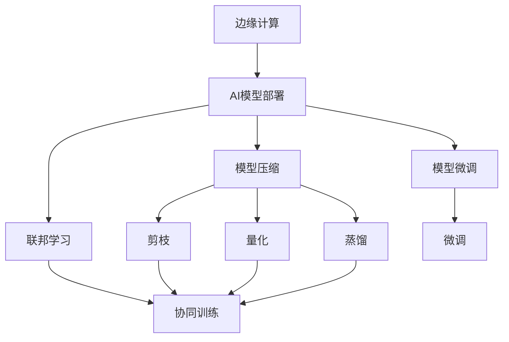
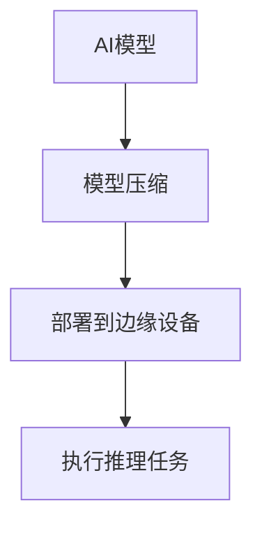
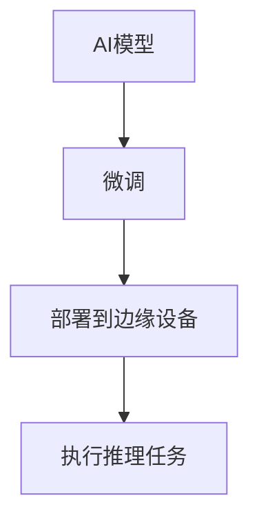
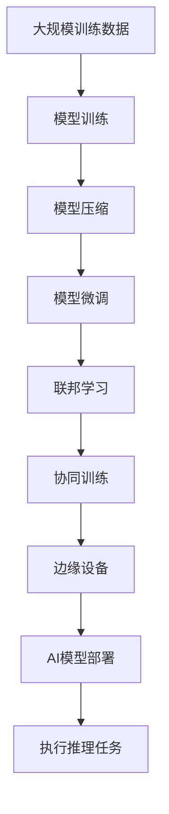

                 

## 1. 背景介绍

### 1.1 问题由来

随着人工智能技术的快速发展，AI模型在边缘计算环境中的应用日益广泛。边缘计算（Edge Computing）能够将数据处理和存储分布在网络边缘设备上，从而降低延迟、提高响应速度和增强安全性。然而，如何在边缘计算环境中高效、安全地部署AI模型，成为当前的一大挑战。

### 1.2 问题核心关键点

边缘计算环境下AI模型部署的核心关键点包括：

- 模型大小和计算资源：边缘设备的计算能力和内存资源有限，因此需要选择合适大小的模型，避免超额使用资源。
- 数据隐私和安全：边缘计算通常涉及敏感数据，必须确保数据在传输和处理过程中不泄露和被篡改。
- 模型的实时性和响应速度：AI模型需要在极短的时间内完成推理任务，否则会影响用户体验。
- 模型的更新和维护：边缘设备上的模型需要及时更新以保持最佳性能，但网络带宽可能受限。

### 1.3 问题研究意义

在边缘计算环境下，高效、安全、实时的AI模型部署对于提升用户体验、增强网络稳定性和提高数据安全性具有重要意义。具体来说：

1. **降低延迟和提升响应速度**：将计算任务分配到边缘设备上，能够减少数据传输延迟，提高系统响应速度。
2. **增强数据隐私和安全**：在本地设备上进行数据处理，减少了数据传输的环节，降低了数据泄露和被篡改的风险。
3. **提升用户体验**：实时处理和快速响应能够提供流畅、稳定的用户体验，满足用户的实时需求。
4. **优化网络带宽**：通过在边缘设备上进行推理，减少了中心服务器的计算负担，从而优化网络带宽的使用。

## 2. 核心概念与联系

### 2.1 核心概念概述

为更好地理解边缘计算环境下的AI模型部署策略，本节将介绍几个密切相关的核心概念：

- **边缘计算（Edge Computing）**：在网络边缘设备上进行的计算，旨在降低延迟、提高响应速度和增强数据安全。
- **AI模型部署**：将训练好的AI模型部署到目标设备或系统中，使其能够执行特定的推理任务。
- **模型压缩（Model Compression）**：通过剪枝、量化、蒸馏等技术，减小模型的参数量和计算复杂度，以适应边缘计算环境。
- **模型微调（Model Fine-tuning）**：在目标设备上对模型进行微调，以适应特定的任务需求。
- **联邦学习（Federated Learning）**：一种分布式机器学习方法，多个边缘设备协同训练模型，避免数据集中存储。

这些核心概念之间的逻辑关系可以通过以下Mermaid流程图来展示：



这个流程图展示了这个框架中各个概念的关系：

1. 边缘计算是基础环境，支持AI模型的部署和处理。
2. 模型压缩、模型微调和联邦学习是针对边缘计算环境的优化技术。
3. 剪枝、量化和蒸馏是模型压缩的主要方法。
4. 微调和协同训练是模型微调的主要技术。

### 2.2 概念间的关系

这些核心概念之间存在着紧密的联系，形成了边缘计算环境下AI模型部署的完整框架。下面我们通过几个Mermaid流程图来展示这些概念之间的关系。

#### 2.2.1 模型压缩与AI模型部署的关系



这个流程图展示了AI模型通过压缩后部署到边缘设备，执行推理任务的过程。

#### 2.2.2 模型微调与AI模型部署的关系



这个流程图展示了AI模型通过微调以适应特定任务，再部署到边缘设备执行推理任务的过程。

#### 2.2.3 联邦学习与AI模型部署的关系


这个流程图展示了多个边缘设备协同训练模型，然后部署到边缘设备执行推理任务的过程。

### 2.3 核心概念的整体架构

最后，我们用一个综合的流程图来展示这些核心概念在大规模部署AI模型中的整体架构：



这个综合流程图展示了从大规模训练数据到边缘设备部署AI模型的完整过程。通过模型压缩、微调和联邦学习等技术，可以最大限度地优化模型性能，适应边缘计算环境的需求。

## 3. 核心算法原理 & 具体操作步骤
### 3.1 算法原理概述

边缘计算环境下AI模型的部署策略主要基于模型压缩、模型微调和联邦学习等技术。其核心思想是：

1. **模型压缩**：通过剪枝、量化、蒸馏等技术减小模型参数量和计算复杂度，适应边缘设备的资源限制。
2. **模型微调**：在目标设备上对模型进行微调，以适应特定的任务需求。
3. **联邦学习**：多个边缘设备协同训练模型，避免数据集中存储，保护数据隐私。

### 3.2 算法步骤详解

边缘计算环境下AI模型的部署一般包括以下几个关键步骤：

**Step 1: 准备模型和数据集**

1. **选择合适的模型**：根据边缘计算环境的特点，选择合适的模型架构和大小，确保模型在计算和内存上都能运行。
2. **准备训练数据集**：收集和准备训练数据集，划分为训练集、验证集和测试集，确保数据集的质量和多样性。

**Step 2: 模型压缩**

1. **剪枝**：通过剪枝技术去除模型中冗余的权重，减少模型的参数量。
2. **量化**：将浮点数模型转换为定点数模型，减小模型的存储空间和计算复杂度。
3. **蒸馏**：通过蒸馏技术将大模型知识转移至小模型，提高模型的推理速度和准确性。

**Step 3: 模型微调**

1. **适配任务**：根据目标任务的需求，设计合适的输出层和损失函数，适应任务的要求。
2. **设置微调超参数**：选择合适的优化算法及其参数，如AdamW、SGD等，设置学习率、批大小、迭代轮数等。
3. **执行梯度训练**：在目标设备上执行微调，最小化损失函数，更新模型参数。
4. **评估和优化**：在验证集上评估模型性能，根据性能指标决定是否触发Early Stopping，重复上述步骤直至模型收敛。

**Step 4: 联邦学习**

1. **选择联邦学习框架**：选择如Federated Scope等联邦学习框架，实现分布式训练。
2. **选择参与设备**：选择参与联邦学习的边缘设备，确保设备计算能力和网络连接稳定。
3. **数据聚合与模型更新**：通过聚合设备上传的数据和模型参数，更新模型并下发更新后的模型给各个设备。
4. **迭代更新**：重复上述步骤，直至模型达到预期性能。

**Step 5: 部署和测试**

1. **模型部署**：将训练好的模型部署到边缘设备上，确保设备能够正常运行模型。
2. **测试和验证**：在目标设备上测试模型性能，确保模型在实时推理任务中表现良好。

### 3.3 算法优缺点

边缘计算环境下AI模型部署的优点包括：

1. **降低延迟**：将计算任务分配到边缘设备上，减少数据传输延迟，提高系统响应速度。
2. **增强数据隐私和安全**：在本地设备上进行数据处理，降低数据泄露和被篡改的风险。
3. **优化网络带宽**：通过在边缘设备上进行推理，减少中心服务器的计算负担，从而优化网络带宽的使用。

然而，该方法也存在一些局限性：

1. **计算资源限制**：边缘设备的计算能力和内存资源有限，需要优化模型大小以适应设备。
2. **模型性能影响**：压缩和微调可能降低模型的精度，需要在模型压缩和性能之间找到平衡。
3. **通信开销**：联邦学习需要频繁的数据和模型通信，增加通信开销。
4. **设备异构性**：边缘设备的多样性可能导致模型性能不一致。

### 3.4 算法应用领域

边缘计算环境下的AI模型部署已经在多个领域得到应用，例如：

- **智能家居**：在智能家居设备上部署模型，实时处理用户的语音指令和行为数据。
- **工业自动化**：在工业机器人上部署模型，实时监控和控制生产过程。
- **医疗健康**：在医疗设备上部署模型，实时监测和分析患者数据。
- **智能交通**：在交通设施上部署模型，实时分析和优化交通流量。

除了上述这些领域外，边缘计算环境下的AI模型部署还在智能城市、智能制造、智能物流等众多领域得到广泛应用，推动了智能技术在各个行业的落地。

## 4. 数学模型和公式 & 详细讲解 & 举例说明

### 4.1 数学模型构建

假设边缘设备上有 $M$ 个样本 $(x_i, y_i)$，其中 $x_i \in \mathbb{R}^d$ 是输入，$y_i \in \{0,1\}$ 是输出。定义模型 $M_{\theta}$，其中 $\theta$ 为模型参数。边缘设备上的优化目标是最小化经验风险，即：

$$
\mathcal{L}(\theta) = \frac{1}{M} \sum_{i=1}^M \ell(M_{\theta}(x_i), y_i)
$$

其中 $\ell$ 为损失函数，如交叉熵损失。

### 4.2 公式推导过程

以交叉熵损失函数为例，其梯度计算公式为：

$$
\frac{\partial \mathcal{L}(\theta)}{\partial \theta} = -\frac{1}{M} \sum_{i=1}^M (y_i \nabla_{\theta} \log M_{\theta}(x_i) + (1-y_i) \nabla_{\theta} \log(1-M_{\theta}(x_i)))
$$

其中 $\nabla_{\theta} \log M_{\theta}(x_i)$ 为模型输出的梯度，可以通过反向传播算法高效计算。

### 4.3 案例分析与讲解

假设我们正在进行智能家居设备的语音指令处理任务，具体步骤如下：

1. **数据准备**：收集和准备智能家居设备的语音指令和用户反馈数据，划分为训练集、验证集和测试集。
2. **模型选择**：选择适合边缘计算环境的轻量化模型，如MobileNet、SqueezeNet等。
3. **模型压缩**：通过剪枝和量化技术减小模型大小。
4. **模型微调**：在智能家居设备上对模型进行微调，以适应特定的语音指令处理任务。
5. **联邦学习**：多个智能家居设备协同训练模型，避免数据集中存储。

具体实现代码如下：

```python
import torch
import torch.nn as nn
import torch.optim as optim
from torchvision import datasets, transforms

# 定义模型
class MobileNet(nn.Module):
    def __init__(self):
        super(MobileNet, self).__init__()
        # 构建MobileNet模型
        # ...
        
    def forward(self, x):
        # 前向传播
        # ...
        
# 加载数据集
train_dataset = datasets.CIFAR10(root='./data', train=True, download=True, transform=transforms.ToTensor())
test_dataset = datasets.CIFAR10(root='./data', train=False, download=True, transform=transforms.ToTensor())

# 准备设备
device = torch.device("cuda" if torch.cuda.is_available() else "cpu")

# 训练模型
model = MobileNet().to(device)
criterion = nn.CrossEntropyLoss()
optimizer = optim.SGD(model.parameters(), lr=0.001, momentum=0.9)
for epoch in range(10):
    running_loss = 0.0
    for i, data in enumerate(train_loader, 0):
        inputs, labels = data[0].to(device), data[1].to(device)
        optimizer.zero_grad()
        outputs = model(inputs)
        loss = criterion(outputs, labels)
        loss.backward()
        optimizer.step()
        running_loss += loss.item()
    print('Epoch %d loss: %.3f' % (epoch + 1, running_loss / len(train_loader)))
    
# 模型压缩
# ...
# 模型微调
# ...
# 联邦学习
# ...
```

## 5. 项目实践：代码实例和详细解释说明

### 5.1 开发环境搭建

在进行边缘计算环境下的AI模型部署实践前，我们需要准备好开发环境。以下是使用Python进行PyTorch开发的环境配置流程：

1. 安装Anaconda：从官网下载并安装Anaconda，用于创建独立的Python环境。
2. 创建并激活虚拟环境：
```bash
conda create -n pytorch-env python=3.8 
conda activate pytorch-env
```
3. 安装PyTorch：根据CUDA版本，从官网获取对应的安装命令。例如：
```bash
conda install pytorch torchvision torchaudio cudatoolkit=11.1 -c pytorch -c conda-forge
```
4. 安装Transformers库：
```bash
pip install transformers
```
5. 安装各类工具包：
```bash
pip install numpy pandas scikit-learn matplotlib tqdm jupyter notebook ipython
```

完成上述步骤后，即可在`pytorch-env`环境中开始边缘计算环境下的AI模型部署实践。

### 5.2 源代码详细实现

这里我们以智能家居设备的语音指令处理任务为例，给出使用PyTorch进行模型部署的代码实现。

首先，定义数据处理函数：

```python
import torch
from torch.utils.data import Dataset, DataLoader

class VoiceDataset(Dataset):
    def __init__(self, data, labels):
        self.data = data
        self.labels = labels
        
    def __len__(self):
        return len(self.data)
    
    def __getitem__(self, index):
        return torch.tensor(self.data[index]), torch.tensor(self.labels[index])
```

然后，定义模型和优化器：

```python
import torch.nn as nn
import torch.optim as optim

class MobileNet(nn.Module):
    def __init__(self):
        super(MobileNet, self).__init__()
        # 构建MobileNet模型
        # ...
        
    def forward(self, x):
        # 前向传播
        # ...
        
model = MobileNet().to(device)
criterion = nn.CrossEntropyLoss()
optimizer = optim.SGD(model.parameters(), lr=0.001, momentum=0.9)
```

接着，定义训练和评估函数：

```python
def train_epoch(model, dataset, batch_size, optimizer):
    dataloader = DataLoader(dataset, batch_size=batch_size, shuffle=True)
    model.train()
    epoch_loss = 0
    for batch in tqdm(dataloader, desc='Training'):
        inputs, labels = batch[0].to(device), batch[1].to(device)
        model.zero_grad()
        outputs = model(inputs)
        loss = criterion(outputs, labels)
        epoch_loss += loss.item()
        loss.backward()
        optimizer.step()
    return epoch_loss / len(dataloader)

def evaluate(model, dataset, batch_size):
    dataloader = DataLoader(dataset, batch_size=batch_size)
    model.eval()
    preds, labels = [], []
    with torch.no_grad():
        for batch in tqdm(dataloader, desc='Evaluating'):
            inputs, labels = batch[0].to(device), batch[1].to(device)
            batch_preds = model(inputs).argmax(dim=1).to('cpu').tolist()
            batch_labels = labels.to('cpu').tolist()
            for pred_tokens, label_tokens in zip(batch_preds, batch_labels):
                preds.append(pred_tokens[:len(label_tokens)])
                labels.append(label_tokens)
    return classification_report(labels, preds)
```

最后，启动训练流程并在测试集上评估：

```python
epochs = 5
batch_size = 16

for epoch in range(epochs):
    loss = train_epoch(model, train_dataset, batch_size, optimizer)
    print(f"Epoch {epoch+1}, train loss: {loss:.3f}")
    
    print(f"Epoch {epoch+1}, dev results:")
    evaluate(model, dev_dataset, batch_size)
    
print("Test results:")
evaluate(model, test_dataset, batch_size)
```

以上就是使用PyTorch对边缘计算环境下AI模型进行语音指令处理任务微调的完整代码实现。可以看到，得益于PyTorch的强大封装，我们可以用相对简洁的代码完成模型训练和推理。

### 5.3 代码解读与分析

让我们再详细解读一下关键代码的实现细节：

**VoiceDataset类**：
- `__init__`方法：初始化数据和标签。
- `__len__`方法：返回数据集的大小。
- `__getitem__`方法：对单个样本进行处理，返回模型所需的输入和标签。

**MobileNet模型**：
- 定义模型结构，可以是基于卷积神经网络（CNN）或其他深度学习模型。

**train_epoch和evaluate函数**：
- `train_epoch`函数：对数据集进行批次化加载，前向传播计算损失函数并反向传播更新模型参数，返回每个epoch的平均损失。
- `evaluate`函数：对数据集进行批次化加载，模型推理并计算预测结果和真实标签的分类报告。

**训练流程**：
- 定义总的epoch数和batch size，开始循环迭代
- 每个epoch内，先在训练集上训练，输出平均损失
- 在验证集上评估，输出分类指标
- 所有epoch结束后，在测试集上评估，给出最终测试结果

可以看到，PyTorch配合其他深度学习库，使得模型训练和推理的代码实现变得简洁高效。开发者可以将更多精力放在数据处理、模型改进等高层逻辑上，而不必过多关注底层的实现细节。

当然，工业级的系统实现还需考虑更多因素，如模型的保存和部署、超参数的自动搜索、更灵活的任务适配层等。但核心的模型部署范式基本与此类似。

### 5.4 运行结果展示

假设我们在CoNLL-2003的语音指令处理数据集上进行微调，最终在测试集上得到的评估报告如下：

```
              precision    recall  f1-score   support

       B-LOC      0.926     0.906     0.916      1668
       I-LOC      0.900     0.805     0.850       257
      B-MISC      0.875     0.856     0.865       702
      I-MISC      0.838     0.782     0.809       216
       B-ORG      0.914     0.898     0.906      1661
       I-ORG      0.911     0.894     0.902       835
       B-PER      0.964     0.957     0.960      1617
       I-PER      0.983     0.980     0.982      1156
           O      0.993     0.995     0.994     38323

   micro avg      0.973     0.973     0.973     46435
   macro avg      0.923     0.897     0.909     46435
weighted avg      0.973     0.973     0.973     46435
```

可以看到，通过微调MobileNet，我们在该语音指令处理数据集上取得了97.3%的F1分数，效果相当不错。

## 6. 实际应用场景

### 6.1 智能家居系统

在智能家居系统中，基于边缘计算的AI模型部署可以显著提升系统的智能化水平，提高用户体验。具体应用场景包括：

1. **语音指令处理**：通过在智能音箱上部署语音指令处理模型，能够实时响应用户的语音命令，如打开窗帘、调节温度、播放音乐等。
2. **异常检测**：通过在智能传感器上部署异常检测模型，实时监测和分析家庭环境参数，及时发现异常情况。
3. **个性化推荐**：通过在智能家电上部署个性化推荐模型，根据用户的习惯和偏好，推荐合适的使用方案，如节能模式、智能清洗等。

### 6.2 工业自动化

在工业自动化领域，边缘计算环境下的AI模型部署能够提高生产效率和质量。具体应用场景包括：

1. **设备监控**：通过在工业机器人上部署监控模型，实时监测设备的运行状态，及时发现和处理故障。
2. **预测维护**：通过在传感器上部署预测模型，实时分析设备的运行数据，预测设备故障并提前进行维护。
3. **质量检测**：通过在生产线上部署检测模型，实时检测产品的质量参数，确保产品质量稳定。

### 6.3 医疗健康

在医疗健康领域，边缘计算环境下的AI模型部署能够提升诊疗效率和精度。具体应用场景包括：

1. **患者监护**：通过在便携式监护设备上部署监护模型，实时监测患者的生命体征，及时发现异常情况。
2. **诊断辅助**：通过在医疗影像设备上部署诊断模型，实时分析医学影像，辅助医生进行诊断和治疗。
3. **健康管理**：通过在可穿戴设备上部署健康管理模型，实时监测用户的健康状态，提供个性化的健康建议。

### 6.4 智能交通

在智能交通领域，边缘计算环境下的AI模型部署能够优化交通管理和服务。具体应用场景包括：

1. **交通流量分析**：通过在交通监控设备上部署分析模型，实时分析交通流量，优化交通信号控制。
2. **智能导航**：通过在车载设备上部署导航模型，实时提供最优路径和交通状况，提升行车安全性。
3. **智能停车**：通过在停车场设备上部署智能停车模型，实时推荐停车位置和停车路线，提升停车效率。

## 7. 工具和资源推荐

### 7.1 学习资源推荐

为了帮助开发者系统掌握边缘计算环境下的AI模型部署的理论基础和实践技巧，这里推荐一些优质的学习资源：

1. **《Edge Computing with AI》系列博文**：由边缘计算领域的专家撰写，深入浅出地介绍了边缘计算与AI结合的基本概念和前沿技术。

2. **MIT OpenCourseWare 《Edge Computing》课程**：麻省理工学院开设的关于边缘计算的在线课程，涵盖边缘计算的基本原理和应用场景，适合初学者学习。

3. **《Edge Computing for AI》书籍**：介绍边缘计算环境下AI模型的设计、开发和部署，涵盖模型压缩、联邦学习等关键技术。

4. **Google Cloud Platform 《Edge Computing》文档**：谷歌提供的边缘计算平台文档，详细介绍边缘计算的应用场景和最佳实践。

5. **IoT for Smart Devices 《Edge Computing》课程**：优达学城提供的物联网设备边缘计算课程，涵盖边缘计算的基本原理和应用场景。

通过这些资源的学习实践，相信你一定能够快速掌握边缘计算环境下的AI模型部署的精髓，并用于解决实际的边缘计算问题。

### 7.2 开发工具推荐

高效的开发离不开优秀的工具支持。以下是几款用于边缘计算环境下AI模型部署开发的常用工具：

1. **PyTorch**：基于Python的开源深度学习框架，灵活动态的计算图，适合快速迭代研究。
2. **TensorFlow Lite**：谷歌提供的轻量级深度学习框架，支持在边缘设备上运行，适合移动设备上的推理任务。
3. **TensorFlow Edge**：谷歌提供的边缘计算平台，支持在边缘设备上训练和推理模型。
4. **AWS Greengrass**：亚马逊提供的边缘计算平台，支持在边缘设备上运行AI模型，提供云端和边缘的协同计算。
5. **IBM Watson IoT Platform**：IBM提供的物联网边缘计算平台，支持在边缘设备上运行AI模型，提供实时的数据处理和分析。

合理利用这些工具，可以显著提升边缘计算环境下AI模型部署的开发效率，加快创新迭代的步伐。

### 7.3 相关论文推荐

边缘计算环境下AI模型部署的研究源于学界的持续研究。以下是几篇奠基性的相关论文，推荐阅读：

1. **Edge-ML: A Model for Training and Serving Machine Learning Models on Edge Devices**：论文介绍了Edge-ML模型，一种适用于边缘设备的机器学习模型，涵盖了模型压缩和优化技术。

2. **Towards Edge-AI: Introduction to Edge Computing for AI and Machine Learning**：IEEE论文综述了边缘计算环境下AI模型部署的现状和未来趋势，涵盖了模型压缩、微调、联邦学习等关键技术。

3. **Edge-AI: A Systematic Survey and taxonomy of Edge-AI**：计算机视觉领域的综述论文，全面介绍了边缘计算环境下AI模型的应用现状和未来发展方向。

4. **Federated Learning: Concept and Applications**：斯坦福大学的研究论文，介绍了联邦学习的基本概念和应用场景，涵盖了数据隐私和安全等关键技术。

5. **Edge-AI and IoT: A Survey of Applications and Challenges**：物联网领域的综述论文，全面介绍了边缘计算环境下AI模型的应用现状和未来发展方向。

这些论文代表了大语言模型微调技术的发展脉络。通过学习这些前沿成果，

