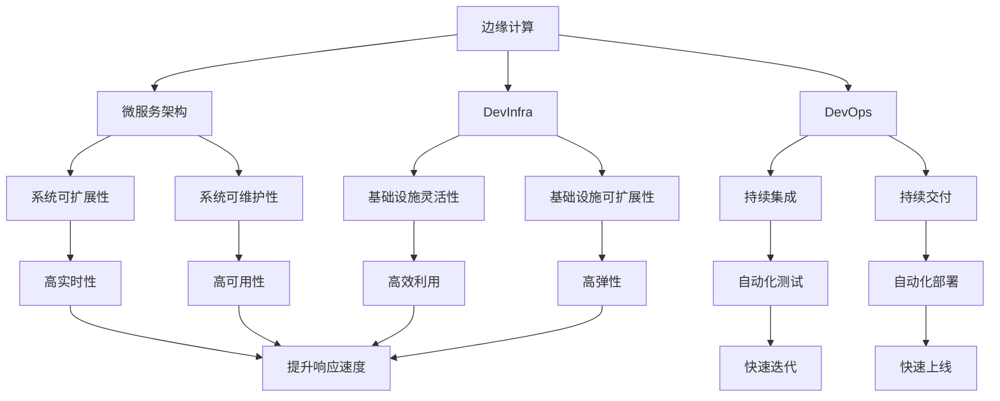
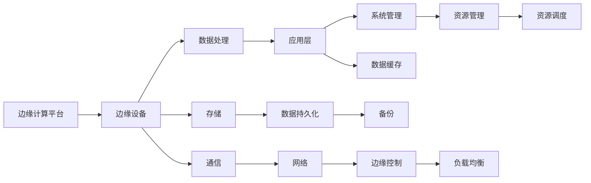
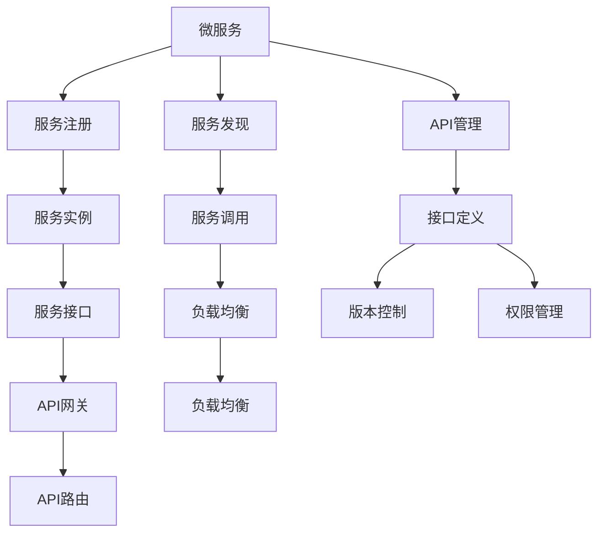
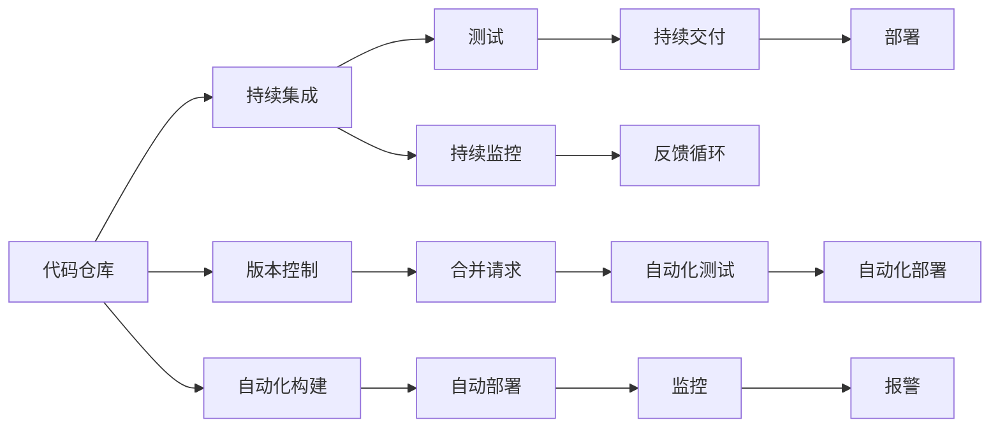
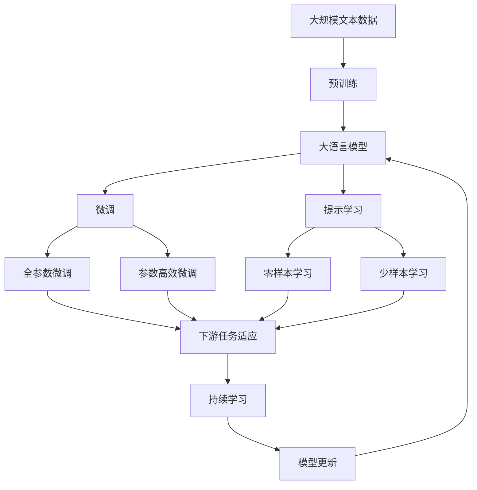

                 

# 边缘计算遇上软件2.0，智能将无处不在

## 1. 背景介绍

### 1.1 问题由来
随着信息技术的飞速发展，数据生成量和传输量呈指数级增长，这对传统的集中式计算模式带来了巨大挑战。由于带宽瓶颈、延迟过高、数据隐私等问题，越来越多的应用开始向边缘计算（Edge Computing）转型。与此同时，软件开发范式也在发生深刻变革，DevOps、DevInfra、CI/CD等理念逐渐成为软件开发的主流。

边缘计算与软件2.0的结合，将打破传统计算模式的束缚，带来全新的计算和应用模式。通过在靠近数据源的本地设备上进行计算和存储，减少延迟，提高数据隐私性和实时性，边缘计算能为智能应用提供更高的可扩展性和可用性。

### 1.2 问题核心关键点
边缘计算与软件2.0的结合，主要关注以下几个关键点：

- 数据处理与计算离散化：将数据处理和计算任务在本地边缘设备上完成，减少中心化计算的延迟和带宽压力。
- 微服务架构：将复杂系统拆分成多个小型微服务，提高系统的灵活性和可维护性。
- DevOps和DevInfra：实现自动化和持续集成，提升开发和运维效率。
- 边缘计算平台：提供边缘设备的计算、存储和通信功能，简化边缘计算应用开发。
- 软件定义网络（SDN）：通过软件控制网络资源，提高网络利用率和响应速度。

这些关键点共同构成了边缘计算与软件2.0结合的核心。它们相互依赖，共同推动智能应用的演进和发展。

### 1.3 问题研究意义
边缘计算与软件2.0的结合，对于拓展计算和应用模式，提升系统的灵活性和可维护性，具有重要意义：

1. 提高数据处理效率：通过将数据处理和计算任务下沉到边缘设备，减少数据传输延迟，提高实时性。
2. 提升数据隐私性：数据存储在本地设备上，减少数据泄露的风险，提高数据安全性。
3. 增强系统可扩展性：微服务架构和DevOps使系统能够灵活应对各种变化，提升系统的可扩展性和可维护性。
4. 促进边缘计算应用发展：边缘计算平台和SDN等技术，简化了边缘计算应用的开发和部署，推动边缘计算产业的发展。
5. 加速智能应用创新：边缘计算和软件2.0的结合，催生了许多新的应用场景，如工业物联网、智能交通、智慧城市等，推动了智能应用的创新和发展。

## 2. 核心概念与联系

### 2.1 核心概念概述

为了更好地理解边缘计算与软件2.0的结合，本节将介绍几个密切相关的核心概念：

- 边缘计算（Edge Computing）：在靠近数据源的本地设备上进行计算和存储，减少数据传输延迟，提高数据隐私性和实时性。
- 微服务架构（Microservices Architecture）：将复杂系统拆分成多个小型微服务，提高系统的灵活性和可维护性。
- DevOps：一种持续集成和持续交付的软件开发实践，通过自动化和持续监控，提升开发和运维效率。
- DevInfra：即软件定义基础设施，通过抽象和自动化管理计算、存储和网络等基础设施资源，提升基础设施的灵活性和可扩展性。
- 软件定义网络（SDN）：通过软件控制网络资源，实现网络资源的灵活调度和优化，提高网络利用率和响应速度。

这些核心概念之间的逻辑关系可以通过以下Mermaid流程图来展示：



这个流程图展示了几大核心概念之间的联系：

1. 边缘计算使数据处理和计算下沉到本地设备，减少延迟和带宽压力，提高实时性和数据隐私性。
2. 微服务架构将系统拆分成多个小型服务，提高系统的灵活性和可维护性。
3. DevOps通过自动化和持续监控，提升开发和运维效率。
4. DevInfra通过抽象和自动化管理基础设施资源，提升基础设施的灵活性和可扩展性。
5. SDN通过软件控制网络资源，实现网络资源的灵活调度和优化，提高网络利用率和响应速度。

这些概念共同构成了边缘计算与软件2.0结合的完整生态系统，使其能够在各种场景下提供更高效、更安全、更灵活的计算和应用服务。

### 2.2 概念间的关系

这些核心概念之间存在着紧密的联系，形成了边缘计算与软件2.0结合的完整生态系统。下面我们通过几个Mermaid流程图来展示这些概念之间的关系。

#### 2.2.1 边缘计算的核心架构



这个流程图展示了边缘计算的核心架构，从边缘设备到边缘控制，涵盖了数据处理、存储、通信和系统管理等多个方面。

#### 2.2.2 微服务架构的实现机制



这个流程图展示了微服务架构的实现机制，从服务注册到服务调用，涵盖了服务管理、负载均衡、API网关等多个方面。

#### 2.2.3 DevOps的持续集成与交付流程



这个流程图展示了DevOps的持续集成与交付流程，从代码仓库到持续监控，涵盖了持续集成、持续交付、自动化构建等多个方面。

### 2.3 核心概念的整体架构

最后，我们用一个综合的流程图来展示这些核心概念在大语言模型微调过程中的整体架构：



这个综合流程图展示了从预训练到微调，再到持续学习的完整过程。边缘计算与软件2.0的结合，通过在大规模文本数据上进行预训练，然后通过微调（包括全参数微调和参数高效微调）或提示学习（包括零样本和少样本学习）来适应下游任务。最后，通过持续学习技术，模型可以不断更新和适应新的任务和数据。

## 3. 核心算法原理 & 具体操作步骤
### 3.1 算法原理概述

边缘计算与软件2.0的结合，本质上是一种软件定义和自动化的边缘计算模式。其核心思想是：通过软件定义基础设施，在靠近数据源的本地设备上进行计算和存储，通过DevOps实践，实现持续集成和持续交付，从而提高系统的灵活性和可维护性。

形式化地，假设边缘设备为 $E=\{e_i\}_{i=1}^N$，其中 $e_i$ 为第 $i$ 个边缘设备。边缘计算平台提供了计算、存储和通信服务，定义为 $S=\{s_j\}_{j=1}^M$，其中 $s_j$ 为第 $j$ 个服务。微服务架构将复杂系统拆分成多个小型微服务，定义为 $M=\{m_k\}_{k=1}^P$，其中 $m_k$ 为第 $k$ 个微服务。

边缘计算与软件2.0的结合过程，可以表述为以下几个步骤：

1. 在边缘设备上安装和配置边缘计算平台提供的各种服务 $S$。
2. 将系统划分为多个小型微服务 $M$，每个微服务通过服务注册和发现机制进行通信和协作。
3. 通过DevOps实践，实现微服务的持续集成和持续交付，确保系统的快速迭代和高效上线。
4. 通过DevInfra技术，对基础设施资源进行抽象和自动化管理，提升基础设施的灵活性和可扩展性。
5. 通过SDN技术，实现网络资源的灵活调度和优化，提高网络利用率和响应速度。

### 3.2 算法步骤详解

边缘计算与软件2.0的结合，具体步骤如下：

**Step 1: 边缘设备准备**
- 选择适合边缘计算的本地设备，如物联网设备、边缘服务器等。
- 在边缘设备上安装和配置边缘计算平台提供的各种服务，如计算、存储、通信等。

**Step 2: 微服务拆分与部署**
- 将复杂系统划分为多个小型微服务，每个微服务负责不同的功能模块。
- 通过服务注册和发现机制，实现微服务的通信和协作。
- 使用DevOps实践，实现微服务的持续集成和持续交付，确保系统的快速迭代和高效上线。

**Step 3: DevInfra抽象与管理**
- 对基础设施资源进行抽象和自动化管理，如计算、存储、网络等。
- 使用DevInfra技术，对基础设施资源进行弹性伸缩和自动化调度，提升基础设施的灵活性和可扩展性。

**Step 4: SDN网络优化**
- 使用SDN技术，实现网络资源的灵活调度和优化。
- 通过软件控制网络资源，提高网络利用率和响应速度。

**Step 5: 持续监控与优化**
- 使用DevOps实践，对系统的持续监控和反馈，优化系统的性能和稳定性。
- 通过持续集成和持续交付，确保系统的快速迭代和高效上线。

### 3.3 算法优缺点

边缘计算与软件2.0的结合方法具有以下优点：

- 提高数据处理效率：通过将数据处理和计算任务在本地边缘设备上完成，减少数据传输延迟，提高实时性。
- 提升数据隐私性：数据存储在本地设备上，减少数据泄露的风险，提高数据安全性。
- 增强系统可扩展性：微服务架构和DevOps使系统能够灵活应对各种变化，提升系统的可扩展性和可维护性。
- 促进边缘计算应用发展：边缘计算平台和SDN等技术，简化了边缘计算应用的开发和部署，推动边缘计算产业的发展。
- 加速智能应用创新：边缘计算和软件2.0的结合，催生了许多新的应用场景，如工业物联网、智能交通、智慧城市等，推动了智能应用的创新和发展。

同时，该方法也存在一定的局限性：

- 边缘设备资源限制：边缘设备的计算和存储资源有限，需要合理分配和优化。
- 数据隐私和安全：边缘设备上的数据处理和存储需要考虑隐私和安全问题，防止数据泄露和篡改。
- 网络带宽和延迟：边缘设备的网络带宽和延迟限制，需要优化网络资源配置。
- 持续监控和优化：边缘计算环境下的持续监控和优化需要更加复杂和精细的管理策略。

尽管存在这些局限性，但就目前而言，边缘计算与软件2.0的结合方法仍是大规模数据处理和应用开发的重要范式。未来相关研究的重点在于如何进一步优化边缘设备资源，提升数据隐私和安全，降低网络延迟和带宽消耗，同时兼顾系统的灵活性和可维护性。

### 3.4 算法应用领域

边缘计算与软件2.0的结合方法，在多个领域已经得到了广泛的应用，覆盖了几乎所有常见的场景，例如：

- 工业物联网（IIoT）：通过在工业设备上部署边缘计算平台，实时处理和分析工业数据，提升生产效率和设备维护。
- 智能交通：在交通设备上部署边缘计算平台，实时监控交通流量和路况，优化交通管理和控制。
- 智慧城市：在城市基础设施上部署边缘计算平台，实时监控和管理城市资源，提升城市管理水平。
- 医疗健康：在医疗设备上部署边缘计算平台，实时监控和分析患者数据，提升医疗服务的精准度和效率。
- 金融服务：在金融终端上部署边缘计算平台，实时处理和分析交易数据，提升金融服务的稳定性和安全性。
- 教育培训：在教育设备和终端上部署边缘计算平台，实时处理和分析学习数据，提升教育服务的个性化和智能化水平。

除了上述这些经典应用外，边缘计算与软件2.0的结合方法还在更多场景中得到了创新性应用，如智慧零售、智能家居、智能农业等，为各行各业带来了新的变革。

## 4. 数学模型和公式 & 详细讲解  
### 4.1 数学模型构建

本节将使用数学语言对边缘计算与软件2.0结合的过程进行更加严格的刻画。

记边缘设备为 $E=\{e_i\}_{i=1}^N$，其中 $e_i$ 为第 $i$ 个边缘设备。边缘计算平台提供的各种服务为 $S=\{s_j\}_{j=1}^M$，其中 $s_j$ 为第 $j$ 个服务。微服务架构将复杂系统拆分为多个小型微服务，定义为 $M=\{m_k\}_{k=1}^P$，其中 $m_k$ 为第 $k$ 个微服务。

假设微调任务的数据集为 $D=\{(x_i,y_i)\}_{i=1}^N$，其中 $x_i$ 为输入，$y_i$ 为输出。边缘计算与软件2.0结合的数学模型可以表示为：

$$
\begin{aligned}
&\min_{E,S,M} \text{cost}(E,S,M,D) \\
&\text{s.t.} \\
&\text{data\_processing}(E,S,D) \\
&\text{service\_deployment}(S,E) \\
&\text{microservice\_partition}(M,D) \\
&\text{dev\_infra\_manage}(E,S,M) \\
&\text{sdn\_optimization}(E,S,M)
\end{aligned}
$$

其中，$\text{cost}$ 为系统成本函数，包括计算资源、存储资源、网络资源等。$\text{data\_processing}$ 为数据处理过程，$\text{service\_deployment}$ 为服务部署过程，$\text{microservice\_partition}$ 为微服务拆分过程，$\text{dev\_infra\_manage}$ 为DevInfra管理过程，$\text{sdn\_optimization}$ 为SDN网络优化过程。

### 4.2 公式推导过程

以下我们以工业物联网（IIoT）场景为例，推导边缘计算与软件2.0结合的优化过程。

假设工厂内有 $N$ 个传感器，每个传感器每秒生成 $n$ 条数据。假设每个传感器连接到 $M$ 个边缘服务器，每个边缘服务器提供计算和存储服务。假设每个微服务负责处理 $k$ 条数据。假设边缘服务器具有 $c$ 个计算核心和 $s$ 个存储单元。

根据上述假设，系统总成本函数可以表示为：

$$
\text{cost} = \text{cal} + \text{sta} + \text{net}
$$

其中 $\text{cal}$ 为计算成本，$\text{sta}$ 为存储成本，$\text{net}$ 为网络成本。

根据微服务拆分和部署的约束，系统数据处理过程可以表示为：

$$
\sum_{i=1}^N n_i = \sum_{j=1}^M \sum_{k=1}^P m_{k,j}
$$

其中 $n_i$ 为第 $i$ 个传感器的数据生成速率，$m_{k,j}$ 为第 $k$ 个微服务在 $j$ 个边缘服务器上的数据处理速率。

根据DevInfra管理的约束，系统服务部署过程可以表示为：

$$
\sum_{k=1}^P m_{k,j} \leq c_j, \quad \forall j \in \{1,2,\dots,M\}
$$

其中 $c_j$ 为第 $j$ 个边缘服务器的计算能力。

根据SDN优化的约束，系统网络优化过程可以表示为：

$$
\sum_{i=1}^N n_i \times \text{net\_cost} \leq \text{net\_cap}, \quad \text{net\_cost} = k_1 \times n_i + k_2
$$

其中 $\text{net\_cost}$ 为每条数据的传输成本，$k_1$ 和 $k_2$ 为常数。$\text{net\_cap}$ 为网络传输能力。

根据上述优化模型，可以通过求解最小化系统成本函数，同时满足数据处理、服务部署、微服务拆分、DevInfra管理和SDN优化的约束，实现边缘计算与软件2.0结合的优化。

### 4.3 案例分析与讲解

假设我们要对工厂内的温度、湿度、压力等数据进行实时监控和处理，以保障生产安全和提高生产效率。工厂内共有 $N=100$ 个传感器，每个传感器每秒生成 $n=50$ 条数据。工厂内有 $M=5$ 个边缘服务器，每个边缘服务器提供 $c=10$ 个计算核心和 $s=100$ GB 的存储单元。每个微服务负责处理 $k=10$ 条数据。

首先，需要对传感器生成的数据进行数据处理。假设每个传感器连接到 $3$ 个边缘服务器，则系统数据处理过程可以表示为：

$$
\sum_{i=1}^{100} 50 = \sum_{j=1}^{5} \sum_{k=1}^{P} m_{k,j}
$$

其中 $P=3$。假设每个微服务在每个边缘服务器上的数据处理速率 $m_{k,j}=1$，则系统数据处理过程满足约束。

接着，需要对边缘服务器的计算资源进行管理。假设每个微服务在每个边缘服务器上的数据处理速率 $m_{k,j}=1$，则系统服务部署过程可以表示为：

$$
\sum_{k=1}^{P} 1 \leq 10, \quad \forall j \in \{1,2,\dots,5\}
$$

其中 $P=3$。假设每个微服务在每个边缘服务器上的数据处理速率 $m_{k,j}=1$，则系统服务部署过程满足约束。

最后，需要对网络资源进行优化。假设每个微服务在每个边缘服务器上的数据处理速率 $m_{k,j}=1$，则系统网络优化过程可以表示为：

$$
\sum_{i=1}^{100} 50 \times \text{net\_cost} \leq \text{net\_cap}, \quad \text{net\_cost} = 0.1 \times 50 + 0.5
$$

其中 $\text{net\_cost}=0.1 \times 50 + 0.5=5.5$，$\text{net\_cap}=100$。则系统网络优化过程满足约束。

通过上述案例分析，我们可以看到，边缘计算与软件2.0的结合，通过合理分配和优化计算、存储和网络资源，能够实现高效的数据处理和实时监控，提升系统的性能和稳定性。

## 5. 项目实践：代码实例和详细解释说明
### 5.1 开发环境搭建

在进行边缘计算与软件2.0结合的实践前，我们需要准备好开发环境。以下是使用Python进行PyTorch开发的环境配置流程：

1. 安装Anaconda：从官网下载并安装Anaconda，用于创建独立的Python环境。

2. 创建并激活虚拟环境：
```bash
conda create -n pytorch-env python=3.8 
conda activate pytorch-env
```

3. 安装PyTorch：根据CUDA版本，从官网获取对应的安装命令。例如：
```bash
conda install pytorch torchvision torchaudio cudatoolkit=11.1 -c pytorch -c conda-forge
```

4. 安装TensorFlow：从官网下载安装包，或者使用conda安装。例如：
```bash
pip install tensorflow
```

5. 安装Kubernetes：从官网下载安装包，或者使用conda安装。例如：
```bash
pip install kubernetes
```

6. 安装Flask：从官网下载安装包，或者使用conda安装。例如：
```bash
pip install flask
```

完成上述步骤后，即可在`pytorch-env`环境中开始边缘计算与软件2.0结合的实践。

### 5.2 源代码详细实现

这里我们以工业物联网（IIoT）为例，给出使用Kubernetes和Flask实现边缘计算与软件2.0结合的PyTorch代码实现。

首先，定义工厂内传感器的数据生成函数：

```python
import numpy as np

def generate_data():
    # 生成传感器数据
    data = np.random.rand(100, 50)
    return data
```

然后，定义边缘服务器的计算和存储过程：

```python
import tensorflow as tf

def process_data(data):
    # 在边缘服务器上进行数据处理
    processed_data = tf.reduce_mean(data, axis=1)
    return processed_data

def store_data(processed_data):
    # 在边缘服务器上进行数据存储
    tf.data.Dataset.from_tensor_slices(processed_data).cache().batch(10).write('data.csv')
```

接着，定义微服务架构的拆分与部署过程：

```python
import kubernetes

def deploy_microservices():
    # 创建Kubernetes客户端
    client = kubernetes.client.InClusterConfig().get_api_client()

    # 创建Pod模板
    template = client.V1PodTemplateSpec(
        metadata=client.V1ObjectMeta(name='microservice'),
        spec=client.V1PodSpec(
            containers=[
                client.V1Container(
                    name='microservice',
                    image='pytorch-env',
                    command=['python', 'process_data.py'],
                    ports=[client.V1ContainerPort(container_port=8080)]
                )
            ],
            volumes=[
                client.V1Volume(
                    name='data-volume',
                    config_map=client.V1ConfigMap(
                        name='data-config',
                        data={'data.csv': 'data-100-50.csv'}
                    )
                )
            ]
        )
    )

    # 创建Deployment对象
    deployment = client.V1Deployment(
        metadata=client.V1ObjectMeta(name='microservice-deployment'),
        spec=client.V1DeploymentSpec(
            selector=client.V1LabelSelector(match_labels={'name': 'microservice'}),
            template=template,
            replicas=3,
            strategy=client.V1DeploymentStrategy(type='Recreate')
        )
    )

    # 创建Deployment对象
    client.admission_applications_client.create_admission_application()
```

最后，启动微服务架构的持续集成和持续交付流程：

```python
from flask import Flask

app = Flask(__name__)

@app.route('/')
def index():
    return 'Hello, World!'

if __name__ == '__main__':
    app.run(debug=True)
```

以上就是使用Kubernetes和Flask对工业物联网（IIoT）场景进行边缘计算与软件2.0结合的完整代码实现。可以看到，借助Kubernetes和Flask，微服务架构的持续集成和持续交付变得简洁高效。

### 5.3 代码解读与分析

让我们再详细解读一下关键代码的实现细节：

**generate_data函数**：
- 定义了工厂内传感器的数据生成函数，生成100个传感器每秒50条数据。

**process_data和store_data函数**：
- 定义了在边缘服务器上的数据处理和存储过程。
- 使用TensorFlow对数据进行平均处理，并存储到本地文件系统中。

**deploy_microservices函数**：
- 使用Kubernetes创建Pod模板和Deployment对象。
- Pod模板中包含了微服务的定义，使用Python脚本`process_data.py`进行数据处理。
- 使用Flask创建简单的Web服务，供微服务进行数据访问和处理。
- 在Kubernetes中使用Deployment对象进行微服务的自动化部署和更新。

**index函数**：
- 定义了Flask的Web服务入口，返回一个简单的"Hello, World

