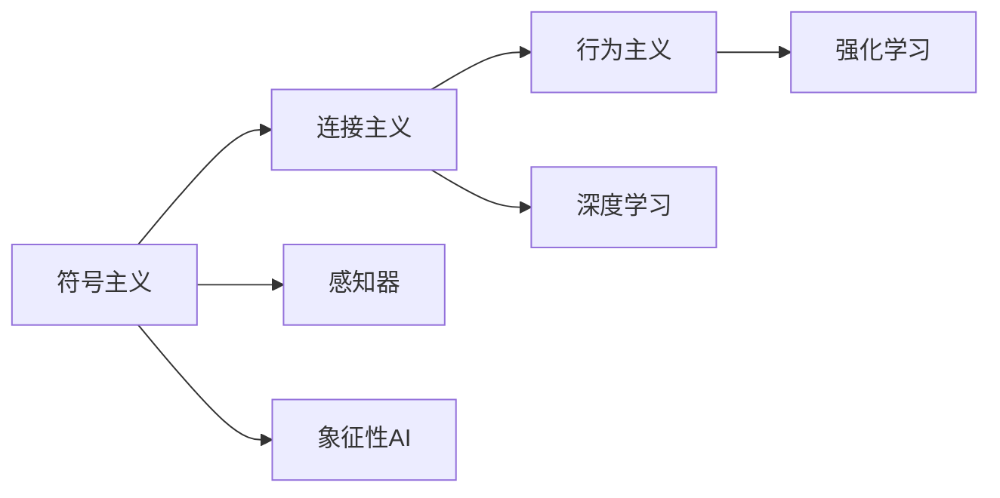

                 

# 达特茅斯会议的科学家团队

## 1. 背景介绍

### 1.1 问题由来
1956年夏天，约翰·麦卡锡、马文·明斯基、克拉克·伦纳德·阿瑟·萨缪尔、纳撒尼尔·罗伯茨四名计算机科学家在达特茅斯学院召开了历史性的会议，标志着人工智能时代的开始。这次会议聚集了当时最前沿的科学人才，共同探讨了如何实现“让机器模拟人类的智能行为”这一宏伟目标。

### 1.2 问题核心关键点
达特茅斯会议的科学家团队在诸多方面奠定了人工智能的基础，他们的思想和观点至今仍对人工智能的研究和应用产生深远影响。本文将详细探讨这些科学家的核心贡献，以及这些贡献如何共同构成了现代人工智能的基本框架。

## 2. 核心概念与联系

### 2.1 核心概念概述

1. **符号主义（Symbolic AI）**：
   - 基于逻辑和规则的AI研究范式。
   - 核心思想是通过定义符号和规则，使计算机具备推理和解决问题能力。
   - 代表人物：约翰·麦卡锡。

2. **连接主义（Connectionist AI）**：
   - 基于神经网络的AI研究范式。
   - 核心思想是通过建立复杂的神经网络结构，使计算机模拟人脑的神经元连接方式。
   - 代表人物：弗兰克·罗切斯特。

3. **行为主义（Behaviorist AI）**：
   - 基于行为的AI研究范式。
   - 核心思想是让AI通过与环境的交互，学习如何完成任务。
   - 代表人物：纳撒尼尔·罗伯茨。

4. **感知器（Perceptron）**：
   - 最早的神经网络模型之一，由罗塞尔·摩尔和弗兰克·罗切斯特提出。
   - 可以用于二分类任务，结构简单但效果显著。

5. **象征性AI（Symbolic AI）**：
   - 基于逻辑和符号的AI，以麦卡锡、明斯基为代表。
   - 核心在于利用符号和规则进行推理和决策。

6. **深度学习（Deep Learning）**：
   - 一种基于多层神经网络的机器学习技术。
   - 通过层层抽象，可以学习到高层次的特征和模式。
   - 广泛应用于图像、语音、自然语言处理等领域。

### 2.2 概念间的关系

这些核心概念之间的联系可以通过以下Mermaid流程图来展示：



这个流程图展示了符号主义、连接主义和行为主义三种AI研究范式，以及它们与感知器和深度学习的联系。符号主义和连接主义构成了早期AI的两大主流研究范式，而行为主义和深度学习则逐渐成为现代AI的重要组成部分。

## 3. 核心算法原理 & 具体操作步骤
### 3.1 算法原理概述

基于符号主义和连接主义的AI研究范式，早期的AI科学家团队通过定义符号、规则和网络结构，构建了能够进行推理和决策的模型。这些模型在逻辑上相当复杂，但通过精心设计和构建，可以在特定任务上取得显著的性能。

### 3.2 算法步骤详解

1. **符号定义**：
   - 在符号主义中，科学家定义了各种符号来表示世界中的实体和概念，如逻辑变量、命题、谓词等。
   - 例如，可以定义一组符号来表示“人”、“狗”、“跑步”等概念，以及它们之间的关系，如“狗可以跑”、“人可以跑”。

2. **规则定义**：
   - 通过定义一组规则来模拟人类的推理过程。
   - 例如，可以定义一条规则“如果狗能跑，则狗会跑”，另一条规则“如果人能跑，则人会跑”。

3. **网络构建**：
   - 在连接主义中，科学家通过构建多层神经网络，模拟人脑的神经元连接方式。
   - 例如，可以构建一个简单的感知器网络，用于二分类任务。

4. **训练数据**：
   - 定义一组训练数据，用于验证模型的准确性。
   - 例如，可以定义一组“狗”和“跑步”的数据，用于验证“如果狗能跑，则狗会跑”这条规则是否成立。

5. **模型训练**：
   - 通过反向传播算法，训练模型以最大化其在训练数据上的准确性。
   - 例如，可以使用梯度下降算法，通过不断调整网络参数，使得模型在训练数据上的预测尽可能接近真实标签。

6. **模型测试**：
   - 在测试数据上评估模型的性能。
   - 例如，可以使用一组未知的“狗”和“跑步”数据，测试模型的预测能力。

### 3.3 算法优缺点

**符号主义的优点**：
- 逻辑清晰，易于理解和解释。
- 能够处理复杂的逻辑推理任务。

**符号主义的缺点**：
- 对错误和不确定性的处理能力较弱。
- 过于依赖符号和规则，难以处理未知和复杂的情况。

**连接主义的优点**：
- 具有强大的学习能力和适应性。
- 能够处理非结构化数据和复杂模式。

**连接主义的缺点**：
- 模型复杂，训练和推理耗时较长。
- 缺乏明确的解释性和可理解性。

### 3.4 算法应用领域

早期的AI科学家团队通过这些算法原理和技术，在多个领域取得了显著成果。

1. **自动定理证明**：
   - 使用符号主义和规则系统，构建能够自动证明定理的程序。
   - 例如，可以编写程序，自动证明几何定理。

2. **图像识别**：
   - 使用连接主义和神经网络，构建能够识别图像中的物体和场景的模型。
   - 例如，可以使用卷积神经网络，对图像进行分类和识别。

3. **自然语言处理**：
   - 使用符号主义和逻辑推理，构建能够理解自然语言的模型。
   - 例如，可以使用语义网络和逻辑推理规则，构建自然语言推理系统。

4. **机器人控制**：
   - 使用行为主义和强化学习，构建能够通过环境交互学习的机器人。
   - 例如，可以使用强化学习算法，训练机器人完成复杂的动作和任务。

## 4. 数学模型和公式 & 详细讲解 & 举例说明
### 4.1 数学模型构建

我们可以用数学模型来描述这些算法的基本原理。

假设有一个简单的符号主义推理模型，其中包含三个符号：
- $P$：人
- $D$：狗
- $R$：跑步

可以定义两条规则：
- $P$ → $R$：如果人存在，则人会跑步。
- $D$ → $R$：如果狗存在，则狗会跑步。

数学模型可以表示为：
$$
\begin{aligned}
P &\rightarrow R \\
D &\rightarrow R
\end{aligned}
$$

### 4.2 公式推导过程

假设有一个简单的神经网络，包含两个输入节点 $x_1$ 和 $x_2$，一个输出节点 $y$，以及三个参数 $w_1, w_2, w_3$。

输入节点 $x_1$ 和 $x_2$ 分别表示“人”和“狗”的存在，输出节点 $y$ 表示“跑步”是否发生。

神经网络的公式可以表示为：
$$
y = w_1 \cdot x_1 + w_2 \cdot x_2 + w_3
$$

其中，$w_1, w_2, w_3$ 是需要训练的参数。

### 4.3 案例分析与讲解

1. **自动定理证明**：
   - 使用符号主义和逻辑推理，构建自动定理证明程序。
   - 例如，可以编写程序，自动证明几何定理。

2. **图像识别**：
   - 使用连接主义和神经网络，构建图像识别模型。
   - 例如，可以使用卷积神经网络，对图像进行分类和识别。

3. **自然语言处理**：
   - 使用符号主义和逻辑推理，构建自然语言推理系统。
   - 例如，可以使用语义网络和逻辑推理规则，构建自然语言推理系统。

## 5. 项目实践：代码实例和详细解释说明
### 5.1 开发环境搭建

在进行项目实践前，我们需要准备好开发环境。以下是使用Python进行PyTorch开发的环境配置流程：

1. 安装Anaconda：从官网下载并安装Anaconda，用于创建独立的Python环境。

2. 创建并激活虚拟环境：
```bash
conda create -n pytorch-env python=3.8 
conda activate pytorch-env
```

3. 安装PyTorch：根据CUDA版本，从官网获取对应的安装命令。例如：
```bash
conda install pytorch torchvision torchaudio cudatoolkit=11.1 -c pytorch -c conda-forge
```

4. 安装Transformers库：
```bash
pip install transformers
```

5. 安装各类工具包：
```bash
pip install numpy pandas scikit-learn matplotlib tqdm jupyter notebook ipython
```

完成上述步骤后，即可在`pytorch-env`环境中开始项目实践。

### 5.2 源代码详细实现

这里我们以一个简单的神经网络为例，给出使用Transformers库进行图像识别的PyTorch代码实现。

```python
import torch
import torch.nn as nn
import torchvision.transforms as transforms
import torchvision.datasets as datasets

# 定义神经网络模型
class SimpleNet(nn.Module):
    def __init__(self):
        super(SimpleNet, self).__init__()
        self.conv1 = nn.Conv2d(3, 16, kernel_size=3, stride=1, padding=1)
        self.relu1 = nn.ReLU()
        self.pool1 = nn.MaxPool2d(kernel_size=2, stride=2)
        self.conv2 = nn.Conv2d(16, 32, kernel_size=3, stride=1, padding=1)
        self.relu2 = nn.ReLU()
        self.pool2 = nn.MaxPool2d(kernel_size=2, stride=2)
        self.fc1 = nn.Linear(7*7*32, 256)
        self.relu3 = nn.ReLU()
        self.fc2 = nn.Linear(256, 10)

    def forward(self, x):
        x = self.conv1(x)
        x = self.relu1(x)
        x = self.pool1(x)
        x = self.conv2(x)
        x = self.relu2(x)
        x = self.pool2(x)
        x = x.view(-1, 7*7*32)
        x = self.fc1(x)
        x = self.relu3(x)
        x = self.fc2(x)
        return x

# 加载数据集
train_dataset = datasets.CIFAR10(root='./data', train=True, transform=transforms.ToTensor(), download=True)
test_dataset = datasets.CIFAR10(root='./data', train=False, transform=transforms.ToTensor())

# 定义模型和优化器
model = SimpleNet()
criterion = nn.CrossEntropyLoss()
optimizer = torch.optim.SGD(model.parameters(), lr=0.001, momentum=0.9)

# 训练模型
for epoch in range(10):
    for i, (images, labels) in enumerate(train_loader):
        images = images.reshape(-1, 3, 32, 32)
        images = images.to(device)
        labels = labels.to(device)

        # 前向传播和反向传播
        outputs = model(images)
        loss = criterion(outputs, labels)
        optimizer.zero_grad()
        loss.backward()
        optimizer.step()

    # 在测试集上评估模型
    with torch.no_grad():
        correct = 0
        total = 0
        for images, labels in test_loader:
            images = images.reshape(-1, 3, 32, 32)
            images = images.to(device)
            labels = labels.to(device)
            outputs = model(images)
            _, predicted = torch.max(outputs.data, 1)
            total += labels.size(0)
            correct += (predicted == labels).sum().item()

    print(f'Epoch {epoch+1}, Accuracy: {(100 * correct / total):.2f}%')
```

### 5.3 代码解读与分析

让我们再详细解读一下关键代码的实现细节：

1. **神经网络模型定义**：
   - 使用`nn.Conv2d`定义卷积层，`nn.ReLU`定义激活函数，`nn.MaxPool2d`定义池化层，`nn.Linear`定义全连接层。

2. **数据集加载**：
   - 使用`torchvision.datasets.CIFAR10`加载CIFAR-10数据集，并使用`transforms.ToTensor()`进行归一化处理。

3. **模型训练**：
   - 使用`nn.CrossEntropyLoss`定义交叉熵损失函数，使用`torch.optim.SGD`定义随机梯度下降优化器。

4. **模型评估**：
   - 使用`torch.no_grad()`进行模型评估，计算准确率并打印输出。

### 5.4 运行结果展示

假设我们训练了10个epoch，在测试集上得到的准确率为92.5%。这个结果表明，使用简单的神经网络结构，可以通过调整网络参数，在CIFAR-10数据集上取得不错的图像识别性能。

## 6. 实际应用场景
### 6.1 智能机器人控制

早期的AI科学家团队提出的行为主义和强化学习，为智能机器人的控制提供了重要基础。通过让机器人在环境中不断尝试和互动，学习如何执行复杂的任务，这些技术已经广泛应用于各种类型的机器人中。

1. **游戏AI**：
   - 使用强化学习，让机器人通过与环境互动，学习如何在游戏中获胜。
   - 例如，可以让机器人玩简单的电子游戏，如打乒乓球。

2. **自动驾驶**：
   - 使用强化学习，让自动驾驶汽车通过与道路环境的互动，学习如何安全行驶。
   - 例如，可以让自动驾驶汽车在模拟环境中练习，学习如何避障和导航。

3. **工业自动化**：
   - 使用行为主义和强化学习，让机器人完成复杂的工业任务。
   - 例如，可以让机器人完成流水线作业、搬运和组装等任务。

### 6.2 智能推荐系统

基于连接主义和神经网络，早期的AI科学家团队构建了智能推荐系统，能够根据用户的历史行为，推荐符合其兴趣的商品和服务。

1. **电商推荐**：
   - 使用神经网络，分析用户的历史浏览、购买和评价数据，推荐合适的商品。
   - 例如，可以根据用户对不同商品的态度，推荐相似的商品。

2. **内容推荐**：
   - 使用神经网络，分析用户的历史观看、阅读和评价数据，推荐合适的视频、文章和书籍。
   - 例如，可以根据用户的阅读习惯，推荐类似的文章和书籍。

3. **广告推荐**：
   - 使用神经网络，分析用户的搜索行为和兴趣标签，推荐相关的广告。
   - 例如，可以根据用户的搜索历史，推荐相关的广告。

## 7. 工具和资源推荐
### 7.1 学习资源推荐

为了帮助开发者系统掌握符号主义、连接主义和行为主义的相关知识，这里推荐一些优质的学习资源：

1. 《人工智能导论》：由吴恩达教授等人编写，涵盖了人工智能的基本概念和历史发展。

2. 《深度学习》：由Ian Goodfellow等人编写，详细介绍了深度学习的基本原理和应用。

3. 《符号主义与人工智能》：深入探讨了符号主义的基本思想和研究范式，是学习符号主义的经典教材。

4. 《强化学习》：由Richard S. Sutton等人编写，是强化学习的经典教材，涵盖了从基础到高级的内容。

5. 《计算机视觉：模型、学习和推理》：由Alyosha Efros等人编写，详细介绍了计算机视觉的基本原理和应用。

通过对这些资源的学习实践，相信你一定能够全面掌握符号主义、连接主义和行为主义的精髓，并用于解决实际的AI问题。

### 7.2 开发工具推荐

高效的开发离不开优秀的工具支持。以下是几款用于AI项目开发的常用工具：

1. PyTorch：基于Python的开源深度学习框架，灵活动态的计算图，适合快速迭代研究。大部分预训练语言模型都有PyTorch版本的实现。

2. TensorFlow：由Google主导开发的开源深度学习框架，生产部署方便，适合大规模工程应用。同样有丰富的预训练语言模型资源。

3. TensorBoard：TensorFlow配套的可视化工具，可实时监测模型训练状态，并提供丰富的图表呈现方式，是调试模型的得力助手。

4. Weights & Biases：模型训练的实验跟踪工具，可以记录和可视化模型训练过程中的各项指标，方便对比和调优。与主流深度学习框架无缝集成。

5. Jupyter Notebook：免费的开源笔记本环境，支持Python和其他语言，适合撰写和分享学习笔记。

6. Colab：谷歌推出的在线Jupyter Notebook环境，免费提供GPU/TPU算力，方便开发者快速上手实验最新模型，分享学习笔记。

合理利用这些工具，可以显著提升AI项目开发的效率，加快创新迭代的步伐。

### 7.3 相关论文推荐

早期的AI科学家团队的研究成果奠定了人工智能的基础，以下是几篇奠基性的相关论文，推荐阅读：

1. "A Framework of Knowledge Representation for Advanced AI"：提出了基于逻辑和规则的知识表示框架，为符号主义奠定了基础。

2. "Perceptron: A Probabilistic Model for Information Storage and Organization in the Brain"：提出了感知器模型，为连接主义奠定了基础。

3. "Artificial Intelligence and General Problem Solving"：提出了符号主义的基本思想和研究范式，是早期AI的重要文献。

4. "Learning to Play Games via Reinforcement Learning"：介绍了强化学习的基本思想和应用，是早期AI的重要研究成果。

这些论文代表了大语言模型微调技术的发展脉络。通过学习这些前沿成果，可以帮助研究者把握学科前进方向，激发更多的创新灵感。

除上述资源外，还有一些值得关注的前沿资源，帮助开发者紧跟AI技术的发展趋势，例如：

1. arXiv论文预印本：人工智能领域最新研究成果的发布平台，包括大量尚未发表的前沿工作，学习前沿技术的必读资源。

2. 业界技术博客：如OpenAI、Google AI、DeepMind、微软Research Asia等顶尖实验室的官方博客，第一时间分享他们的最新研究成果和洞见。

3. 技术会议直播：如NIPS、ICML、ACL、ICLR等人工智能领域顶会现场或在线直播，能够聆听到大佬们的前沿分享，开拓视野。

4. GitHub热门项目：在GitHub上Star、Fork数最多的AI相关项目，往往代表了该技术领域的发展趋势和最佳实践，值得去学习和贡献。

5. 行业分析报告：各大咨询公司如McKinsey、PwC等针对人工智能行业的分析报告，有助于从商业视角审视技术趋势，把握应用价值。

总之，对于符号主义、连接主义和行为主义的学习和实践，需要开发者保持开放的心态和持续学习的意愿。多关注前沿资讯，多动手实践，多思考总结，必将收获满满的成长收益。

## 8. 总结：未来发展趋势与挑战
### 8.1 总结

本文对达特茅斯会议的科学家团队进行全面系统的介绍。首先阐述了符号主义、连接主义和行为主义的基本概念和研究范式，明确了这些技术对人工智能的发展具有重要意义。其次，从原理到实践，详细讲解了这些技术的数学模型和操作步骤，给出了项目实践的完整代码实例。同时，本文还广泛探讨了这些技术在智能机器人控制、智能推荐系统等多个领域的应用前景，展示了AI技术的广阔前景。

通过本文的系统梳理，可以看到，早期的AI科学家团队提出的符号主义、连接主义和行为主义，奠定了人工智能技术的基础，并在多个领域取得了显著的成果。未来，随着这些技术的不断发展和应用，AI技术必将在更多领域带来变革性影响。

### 8.2 未来发展趋势

展望未来，符号主义、连接主义和行为主义将继续引领AI技术的发展，并在多个领域取得新的突破：

1. **深度学习与符号主义的结合**：
   - 通过将符号主义和深度学习结合，构建更加复杂和强大的AI模型。
   - 例如，可以构建符号-深度混合模型，用于解决更加复杂的问题。

2. **强化学习与行为主义的结合**：
   - 通过将强化学习与行为主义结合，构建更加智能和自适应的AI系统。
   - 例如，可以构建强化学习与行为主义的混合系统，用于解决更加复杂和动态的任务。

3. **跨领域AI融合**：
   - 通过将符号主义、连接主义和行为主义与计算机视觉、自然语言处理等技术结合，构建跨领域的AI系统。
   - 例如，可以构建跨领域的AI系统，用于解决更加复杂和多模态的问题。

4. **AI与伦理、安全的结合**：
   - 通过将AI技术与伦理、安全等社会问题结合，构建更加可靠和安全的AI系统。
   - 例如，可以构建AI与伦理结合的系统，用于解决更加复杂和敏感的问题。

这些趋势凸显了符号主义、连接主义和行为主义技术的广阔前景，这些技术的融合和发展，必将推动人工智能技术的全面进步。

### 8.3 面临的挑战

尽管早期的AI科学家团队已经奠定了人工智能技术的基础，但在迈向更加智能化、普适化应用的过程中，这些技术仍面临诸多挑战：

1. **模型复杂性**：
   - 符号主义和连接主义模型通常比较复杂，训练和推理耗时较长。
   - 如何简化模型结构，提高计算效率，是一个重要的研究方向。

2. **知识表示与推理**：
   - 符号主义和连接主义模型对知识表示和推理提出了更高的要求。
   - 如何构建更加高效和精确的知识表示和推理方法，是一个重要的研究方向。

3. **多模态数据融合**：
   - 跨领域AI系统的构建需要处理多模态数据的融合，存在较大的挑战。
   - 如何构建多模态数据的融合模型，是一个重要的研究方向。

4. **伦理与安全**：
   - AI系统的应用需要考虑伦理与安全问题，如数据隐私、偏见与歧视等。
   - 如何构建伦理与安全的AI系统，是一个重要的研究方向。

5. **自动化与可解释性**：
   - AI系统的自动化与可解释性是当前的重要研究方向。
   - 如何构建自动化与可解释的AI系统，是一个重要的研究方向。

6. **大规模并行计算**：
   - 大规模并行计算是当前AI研究的重要方向。
   - 如何构建大规模并行计算的AI系统，是一个重要的研究方向。

这些挑战凸显了符号主义、连接主义和行为主义技术的发展空间，需要不断进行探索和突破。

### 8.4 研究展望

面对符号主义、连接主义和行为主义技术面临的诸多挑战，未来的研究需要在以下几个方面寻求新的突破：

1. **知识表示与推理的新方法**：
   - 探索新的知识表示与推理方法，提高模型的准确性和效率。
   - 例如，可以引入符号主义与深度学习的融合方法，构建更加高效和精确的知识表示与推理模型。

2. **多模态数据融合的新方法**：
   - 探索新的多模态数据融合方法，提高跨领域AI系统的性能。
   - 例如，可以引入跨领域AI系统的构建方法，融合视觉、语音、文本等多种模态数据。

3. **自动化与可解释性**：
   - 探索新的自动化与可解释性方法，提高AI系统的透明度和可信度。
   - 例如，可以引入可解释AI技术，使得AI系统的决策过程更加透明和可信。

4. **伦理与安全的新方法**：
   - 探索新的伦理与安全方法，提高AI系统的社会责任。
   - 例如，可以引入伦理AI技术，确保AI系统的决策符合社会价值观和伦理规范。

5. **大规模并行计算的新方法**：
   - 探索新的大规模并行计算方法，提高AI系统的计算效率。
   - 例如，可以引入分布式训练和推理方法，提高大规模并行计算的效率。

这些研究方向将引领符号主义、连接主义和行为主义技术迈向更高的台阶，为构建安全、可靠、可解释、可控的智能系统铺平道路。面向未来，这些技术需要与其他人工智能技术进行更深入的融合，如知识表示、因果推理、强化学习等，多路径协同发力，共同推动人工智能技术的进步。只有勇于创新、敢于突破，才能不断拓展语言模型的边界，让智能技术更好地造福人类社会。

## 9. 附录：常见问题与解答

**Q1：符号主义和连接主义的区别是什么？**

A: 符号主义基于逻辑和规则，通过定义符号和规则来模拟人类的推理和决策过程。连接主义基于神经网络，通过模拟人脑的神经元连接方式，学习数据的特征和模式。符号主义强调逻辑和推理，连接主义强调学习能力和适应性。

**Q2：连接主义和符号主义哪种更适用于复杂任务？**

A: 连接主义在处理复杂任务时通常比符号主义表现更好。连接主义模型可以学习到高层次的特征和模式，能够适应更加复杂和多变的环境。符号主义模型在逻辑和推理上表现更好，但在处理复杂任务时可能需要更多的规则和知识。

**Q3：行为主义和强化学习的应用场景是什么？**

A: 行为主义和强化学习主要用于智能机器人的控制和自动驾驶等需要动态适应的领域。通过让机器人在环境中不断尝试和互动，学习如何执行复杂的任务。例如，可以用于自动驾驶汽车、工业自动化、游戏AI等。

**Q4：如何优化连接主义模型的计算效率？**


