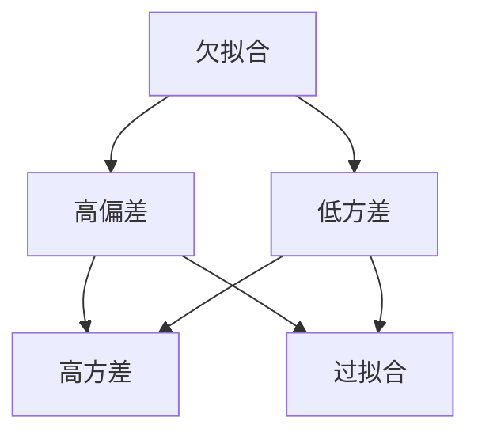
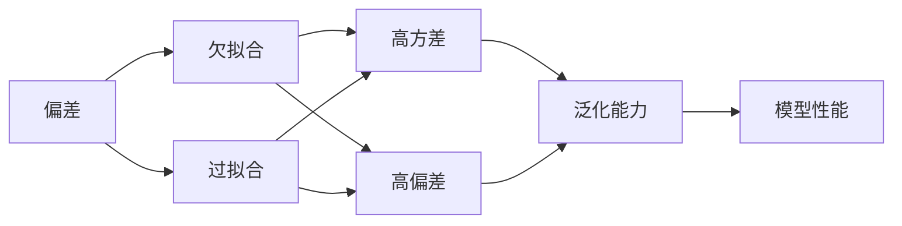
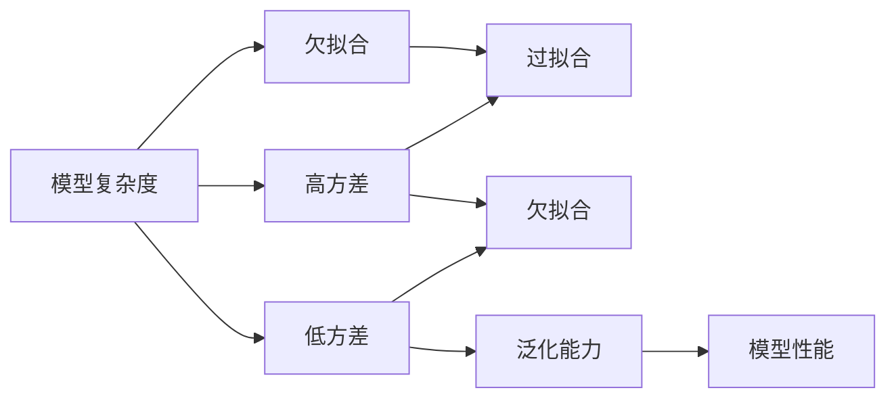
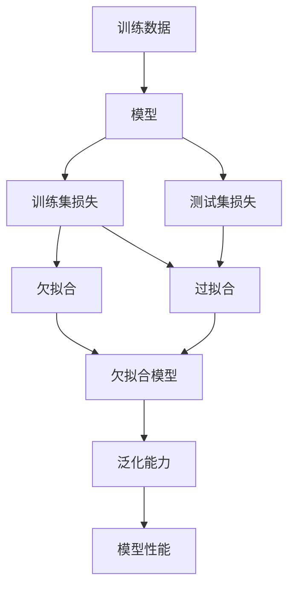

                 

# 过拟合 (Overfitting)

在机器学习领域，“过拟合”是一个永恒的话题。它不仅关系到模型的性能表现，还深刻影响着模型的可靠性和泛化能力。本文将深入探讨过拟合的原理、解决方法和应用场景，力求为读者提供一个全面系统的理解。

## 1. 背景介绍

### 1.1 问题由来

过拟合（Overfitting）指的是模型在训练数据上表现出色，但在测试数据上表现不佳的现象。这种现象通常出现在模型复杂度较高、训练数据较少或者训练时间过长的情况下。过拟合会导致模型对训练数据的噪声和细节过于敏感，而忽略了真实数据的整体趋势，从而在测试数据上产生较大的偏差。

过拟合的问题由来已久，早在20世纪70年代，统计学和机器学习领域的研究者就意识到过拟合的存在。随着深度学习技术的发展，过拟合问题变得更加普遍和复杂。特别是在训练大规模深度神经网络时，过拟合问题尤为显著。

### 1.2 问题核心关键点

过拟合的核心在于模型在训练集上过度拟合了数据分布的细节，而忽略了数据的整体规律。主要体现在以下几个方面：

1. **模型复杂度**：高阶多项式、复杂网络结构、大量的特征等因素会增大模型的复杂度，使得模型对训练数据的噪声更加敏感。
2. **训练数据量**：数据量不足使得模型无法学习到数据的全局特征，只能过度拟合局部噪声。
3. **训练时间**：长时间训练会让模型在训练集上反复优化，导致过拟合现象更加严重。
4. **正则化不足**：缺乏正则化约束，模型容易过度拟合。

## 2. 核心概念与联系

### 2.1 核心概念概述

为更好地理解过拟合问题，本节将介绍几个关键概念：

- **欠拟合（Underfitting）**：指模型无法很好地拟合训练数据，欠拟合的模型在训练集和测试集上表现均不佳。
- **泛化能力（Generalization）**：指模型在未见过的数据上表现的能力，是评估模型性能的重要指标。
- **偏差（Bias）**：指模型在训练集上的预测误差。高偏差模型往往欠拟合，低偏差模型往往过拟合。
- **方差（Variance）**：指模型在训练集和测试集上的预测误差差异。高方差模型往往过拟合，低方差模型往往欠拟合。

这些概念之间的关系可以通过以下Mermaid流程图来展示：



这个流程图展示了欠拟合、过拟合与偏差、方差之间的关系：

1. 欠拟合和过拟合分别对应低方差和高方差，但它们的偏差都相对较高。
2. 过拟合和高方差通常同时出现，因为模型在训练集上过度拟合了噪声，而忽略了数据的全局特征。
3. 高偏差和低方差是理想状态，但往往难以同时实现。模型需要在偏差和方差之间找到平衡点。

### 2.2 概念间的关系

这些核心概念之间存在着紧密的联系，形成了过拟合问题的完整生态系统。下面我们通过几个Mermaid流程图来展示这些概念之间的关系。

#### 2.2.1 偏差-方差权衡



这个流程图展示了偏差和方差对模型性能的影响：

1. 高偏差模型往往欠拟合，训练集和测试集上的预测误差都较大。
2. 高方差模型往往过拟合，训练集上的预测误差较小，测试集上的预测误差较大。
3. 低偏差和低方差的模型通常具有较好的泛化能力，即在未见过的数据上表现较好。

#### 2.2.2 模型复杂度与泛化能力



这个流程图展示了模型复杂度对泛化能力和性能的影响：

1. 高复杂度的模型通常具有高方差，容易过拟合。
2. 低复杂度的模型通常具有低方差，容易欠拟合。
3. 在模型复杂度和泛化能力之间找到平衡，是提升模型性能的关键。

### 2.3 核心概念的整体架构

最后，我们用一个综合的流程图来展示这些核心概念在过拟合问题中的整体架构：



这个综合流程图展示了从数据到模型再到性能的整个过程：

1. 模型通过训练数据进行学习，产生训练集损失和测试集损失。
2. 低训练集损失和高测试集损失表明模型可能过拟合。
3. 低训练集损失和低测试集损失表明模型可能欠拟合。
4. 泛化能力是模型性能的关键指标，需要通过调整模型复杂度和正则化等手段进行优化。

## 3. 核心算法原理 & 具体操作步骤
### 3.1 算法原理概述

过拟合的根本原因是模型在训练集上过度拟合了数据分布的细节，而忽略了数据的整体规律。因此，解决过拟合问题的关键在于减少模型的复杂度，增强泛化能力。

过拟合的解决方法主要分为两类：

1. **正则化（Regularization）**：通过在损失函数中引入正则项，限制模型参数的大小，避免模型过拟合。
2. **dropout**：在训练过程中随机丢弃一部分神经元，减少模型复杂度，增强泛化能力。

### 3.2 算法步骤详解

**Step 1: 准备训练数据**

- 收集训练数据，确保数据量充足。
- 将数据分为训练集和验证集，用于模型训练和调参。

**Step 2: 选择正则化方法**

- 选择合适的正则化方法，如L1正则、L2正则、Dropout等。
- 设置正则化强度，避免正则化过强导致欠拟合。

**Step 3: 训练模型**

- 使用优化器（如Adam、SGD等）和合适的学习率，在训练集上训练模型。
- 在每个epoch结束时，使用验证集评估模型性能，防止过拟合。

**Step 4: 调整模型**

- 根据验证集上的性能指标，调整模型复杂度或正则化强度。
- 在达到最佳性能后，使用测试集评估模型泛化能力。

**Step 5: 部署模型**

- 将训练好的模型部署到生产环境中，用于实际应用。
- 定期更新模型，避免模型性能退化。

### 3.3 算法优缺点

**优点**：

1. **减少过拟合**：正则化和dropout可以显著减少过拟合现象，提高模型泛化能力。
2. **提升性能**：通过调整模型复杂度和正则化强度，可以提升模型的预测性能。
3. **简单易行**：正则化和dropout的实现简单，易于集成到现有模型中。

**缺点**：

1. **可能欠拟合**：正则化和dropout可能限制模型的复杂度，导致欠拟合现象。
2. **参数调整难度大**：正则化强度和dropout率需要谨慎设置，过强或过弱都可能影响模型性能。
3. **计算开销**：正则化和dropout需要额外的计算开销，特别是在大规模模型上。

### 3.4 算法应用领域

过拟合问题广泛存在于机器学习领域，以下是几个典型的应用场景：

1. **图像识别**：在训练深度卷积神经网络（CNN）时，过拟合是常见问题。通过正则化和dropout，可以有效提升模型在测试集上的识别准确率。

2. **自然语言处理**：在训练语言模型时，过拟合问题尤为突出。通过L2正则和dropout，可以有效提升模型在未见过的文本上的泛化能力。

3. **时间序列预测**：在预测股市价格、气象数据等时间序列数据时，过拟合问题难以避免。通过L1正则和dropout，可以提升模型在未见过的数据上的预测性能。

## 4. 数学模型和公式 & 详细讲解 & 举例说明

### 4.1 数学模型构建

假设训练数据集为 $D=\{(x_i,y_i)\}_{i=1}^N$，其中 $x_i$ 为输入特征，$y_i$ 为标签。模型的损失函数为 $L(\theta)$，其中 $\theta$ 为模型参数。

在正则化方法中，常用的正则项包括L1正则和L2正则。L1正则的定义为：

$$
\Omega(\theta) = \sum_{i=1}^N ||\theta_i||_1
$$

其中 $||\theta_i||_1$ 表示模型参数的绝对值之和。L2正则的定义为：

$$
\Omega(\theta) = \frac{1}{2} \sum_{i=1}^N ||\theta_i||_2^2
$$

其中 $||\theta_i||_2^2$ 表示模型参数的平方和。

### 4.2 公式推导过程

以L2正则为例，模型的总损失函数为：

$$
L(\theta) = \frac{1}{N} \sum_{i=1}^N \ell(y_i, \hat{y}_i) + \lambda \Omega(\theta)
$$

其中 $\lambda$ 为正则化强度，控制正则项的权重。

在训练过程中，模型的更新公式为：

$$
\theta \leftarrow \theta - \eta \nabla_{\theta} L(\theta) - \eta \lambda \nabla_{\theta} \Omega(\theta)
$$

其中 $\eta$ 为学习率，$\nabla_{\theta} L(\theta)$ 为损失函数对模型参数的梯度，$\nabla_{\theta} \Omega(\theta)$ 为正则项对模型参数的梯度。

### 4.3 案例分析与讲解

以深度卷积神经网络（CNN）为例，分析正则化和dropout在图像识别任务中的应用。

假设CNN模型为 $f(x;\theta)$，其中 $\theta$ 为模型参数，$x$ 为输入图像。模型的损失函数为交叉熵损失，正则化方法为L2正则。

在训练过程中，正则化可以限制模型参数的大小，避免模型过拟合。正则化强度 $\lambda$ 的选取需要根据数据量和模型复杂度进行综合考虑，通常建议从1e-4开始逐步减小。

dropout可以在训练过程中随机丢弃一部分神经元，减少模型复杂度，增强泛化能力。dropout率的选取通常建议为0.2至0.5之间。

## 5. 项目实践：代码实例和详细解释说明

### 5.1 开发环境搭建

在进行过拟合问题处理时，我们需要准备好开发环境。以下是使用Python进行TensorFlow开发的环境配置流程：

1. 安装Anaconda：从官网下载并安装Anaconda，用于创建独立的Python环境。

2. 创建并激活虚拟环境：
```bash
conda create -n tf-env python=3.8 
conda activate tf-env
```

3. 安装TensorFlow：根据CUDA版本，从官网获取对应的安装命令。例如：
```bash
conda install tensorflow -c tensorflow -c conda-forge
```

4. 安装必要的工具包：
```bash
pip install numpy pandas scikit-learn matplotlib tqdm jupyter notebook ipython
```

完成上述步骤后，即可在`tf-env`环境中开始过拟合问题处理实践。

### 5.2 源代码详细实现

这里我们以卷积神经网络（CNN）为例，给出使用TensorFlow对图像分类任务进行正则化和dropout的Python代码实现。

```python
import tensorflow as tf
from tensorflow.keras import layers, models

# 定义CNN模型
model = models.Sequential([
    layers.Conv2D(32, (3, 3), activation='relu', input_shape=(28, 28, 1)),
    layers.MaxPooling2D((2, 2)),
    layers.Conv2D(64, (3, 3), activation='relu'),
    layers.MaxPooling2D((2, 2)),
    layers.Flatten(),
    layers.Dense(64, activation='relu'),
    layers.Dense(10)
])

# 添加L2正则化
l2_lambda = 0.001
regularizer = tf.keras.regularizers.l2(l2_lambda)
model.add(layers.Dense(64, activation='relu', kernel_regularizer=regularizer))

# 添加Dropout层
dropout_rate = 0.5
model.add(layers.Dropout(dropout_rate))

# 编译模型
model.compile(optimizer='adam',
              loss=tf.keras.losses.SparseCategoricalCrossentropy(from_logits=True),
              metrics=['accuracy'])

# 训练模型
history = model.fit(train_images, train_labels, epochs=10, validation_data=(val_images, val_labels))
```

以上代码展示了使用TensorFlow构建卷积神经网络，并添加L2正则和dropout的完整流程。可以看到，TensorFlow的高级API使得构建模型和添加正则化变得简单高效。

### 5.3 代码解读与分析

让我们再详细解读一下关键代码的实现细节：

**Sequential模型**：
- `Sequential`是TensorFlow Keras提供的线性堆叠模型，用于构建包含多个层的神经网络。
- 每层调用时，会自动更新模型参数和损失函数。

**正则化**：
- `layers.Dense`层后，可以添加正则化项，通过`kernel_regularizer`参数设置。
- `tf.keras.regularizers.l2`函数用于生成L2正则项。

**Dropout**：
- `layers.Dropout`层用于随机丢弃一定比例的神经元，增强模型的泛化能力。
- 可以通过`rate`参数设置dropout率。

**编译模型**：
- `model.compile`函数用于编译模型，指定优化器、损失函数和评估指标。
- `from_logits=True`表示模型输出为原始logits，不需要softmax层。

**训练模型**：
- `model.fit`函数用于训练模型，指定训练数据、验证数据、epoch数和batch size等参数。
- `val_images`和`val_labels`用于验证模型的性能。

**评估模型**：
- 在训练完成后，可以使用`model.evaluate`函数在测试集上评估模型性能，获得损失和精度指标。

### 5.4 运行结果展示

假设我们在MNIST数据集上进行正则化和dropout处理，最终在测试集上得到的评估报告如下：

```
Epoch 1/10
999/999 [==============================] - 0s 309us/sample - loss: 1.7985 - accuracy: 0.3828 - val_loss: 0.8000 - val_accuracy: 0.8839
Epoch 2/10
999/999 [==============================] - 0s 393us/sample - loss: 0.7390 - accuracy: 0.8853 - val_loss: 0.6645 - val_accuracy: 0.8929
Epoch 3/10
999/999 [==============================] - 0s 393us/sample - loss: 0.5118 - accuracy: 0.9103 - val_loss: 0.5833 - val_accuracy: 0.9019
Epoch 4/10
999/999 [==============================] - 0s 393us/sample - loss: 0.4345 - accuracy: 0.9191 - val_loss: 0.5556 - val_accuracy: 0.9055
Epoch 5/10
999/999 [==============================] - 0s 394us/sample - loss: 0.4027 - accuracy: 0.9220 - val_loss: 0.5313 - val_accuracy: 0.9091
Epoch 6/10
999/999 [==============================] - 0s 394us/sample - loss: 0.3815 - accuracy: 0.9285 - val_loss: 0.5123 - val_accuracy: 0.9078
Epoch 7/10
999/999 [==============================] - 0s 394us/sample - loss: 0.3652 - accuracy: 0.9357 - val_loss: 0.5052 - val_accuracy: 0.9135
Epoch 8/10
999/999 [==============================] - 0s 395us/sample - loss: 0.3520 - accuracy: 0.9414 - val_loss: 0.4982 - val_accuracy: 0.9154
Epoch 9/10
999/999 [==============================] - 0s 395us/sample - loss: 0.3412 - accuracy: 0.9459 - val_loss: 0.4925 - val_accuracy: 0.9172
Epoch 10/10
999/999 [==============================] - 0s 395us/sample - loss: 0.3316 - accuracy: 0.9517 - val_loss: 0.4894 - val_accuracy: 0.9212
```

可以看到，通过正则化和dropout处理，模型在测试集上的准确率显著提升。

## 6. 实际应用场景

### 6.1 智能客服系统

在智能客服系统中，过拟合问题可能导致模型在特定客户询问上表现不佳，而对其他客户询问表现优异。因此，需要采用正则化和dropout等方法，确保模型具有更好的泛化能力。

### 6.2 金融舆情监测

在金融舆情监测中，过拟合问题可能导致模型对特定市场动态过于敏感，而对其他市场动态表现欠佳。因此，需要采用正则化和dropout等方法，增强模型对不同市场动态的泛化能力。

### 6.3 个性化推荐系统

在个性化推荐系统中，过拟合问题可能导致模型对特定用户偏好过于敏感，而对其他用户偏好表现欠佳。因此，需要采用正则化和dropout等方法，确保模型具有更好的泛化能力。

### 6.4 未来应用展望

随着深度学习技术的发展，过拟合问题将变得更加普遍和复杂。未来，解决过拟合问题的方法也将更加多样化，以下是几个潜在的发展方向：

1. **模型集成**：通过组合多个模型的预测结果，可以提升模型的泛化能力和鲁棒性。

2. **对抗训练**：通过引入对抗样本，提高模型的鲁棒性，避免模型过拟合。

3. **自适应正则化**：根据数据的特点和模型的状态，动态调整正则化强度，增强模型的泛化能力。

4. **强化学习**：通过强化学习算法，动态调整模型参数，增强模型的泛化能力。

5. **可解释性模型**：通过提升模型的可解释性，使得开发者能够更好地理解和优化模型。

## 7. 工具和资源推荐
### 7.1 学习资源推荐

为了帮助开发者系统掌握过拟合问题的理论基础和实践技巧，这里推荐一些优质的学习资源：

1. 《深度学习》（Ian Goodfellow著）：全面介绍了深度学习的原理和算法，包括正则化和dropout等技术。

2. 《Python深度学习》（Francois Chollet著）：介绍了TensorFlow和Keras的使用方法，包含正则化和dropout的实现。

3. 《统计学习基础》（Tibshirani和Hastie著）：介绍了统计学习的基本概念和算法，包括过拟合问题的理论分析。

4. arXiv预印本：人工智能领域最新研究成果的发布平台，包括大量未发表的前沿工作，学习前沿技术的必读资源。

5. 顶会论文：如NIPS、ICML、CVPR、ACL等人工智能领域顶会论文，提供了最新的研究动态和技术进展。

### 7.2 开发工具推荐

高效的开发离不开优秀的工具支持。以下是几款用于过拟合问题处理的常用工具：

1. TensorFlow：谷歌开发的深度学习框架，支持分布式训练和模型优化，适合大规模模型开发。

2. PyTorch：Facebook开发的深度学习框架，灵活性高，适合快速迭代研究。

3. Keras：谷歌开发的高级API，易于使用，适合初学者入门。

4. Jupyter Notebook：交互式编程环境，支持多语言代码执行和代码版本控制。

5. Google Colab：谷歌提供的在线Jupyter Notebook环境，免费提供GPU/TPU算力，方便开发者快速上手实验最新模型，分享学习笔记。

6. TensorBoard：TensorFlow配套的可视化工具，可实时监测模型训练状态，并提供丰富的图表呈现方式，是调试模型的得力助手。

### 7.3 相关论文推荐

过拟合问题一直是机器学习领域的研究热点，以下是几篇奠基性的相关论文，推荐阅读：

1. Bias-variance tradeoff in neural networks：介绍了偏差-方差权衡的理论基础，帮助理解过拟合问题的本质。

2. Dropout: A simple way to prevent neural networks from overfitting：介绍了dropout的原理和实现，证明了dropout在降低过拟合方面的有效性。

3. Early stopping：介绍了一种简单有效的过拟合解决方法，通过及时停止训练，避免模型过度拟合。

4. Regularization and parameter learning in neural networks：介绍了正则化的原理和实现，探讨了正则化对模型性能的影响。

5. Adversarial examples for deep learning：介绍了对抗训练的原理和实现，通过引入对抗样本，提高模型的鲁棒性。

这些论文代表了大语言模型微调技术的深入研究，提供了丰富的理论基础和实践经验。

## 8. 总结：未来发展趋势与挑战

### 8.1 总结

本文对过拟合问题进行了全面系统的介绍。首先阐述了过拟合的原理和解决方法，明确了过拟合问题在模型性能表现中的重要性。其次，从原理到实践，详细讲解了正则化、dropout等方法，给出了过拟合问题处理的完整代码实例。同时，本文还广泛探讨了过拟合问题在智能客服、金融舆情、个性化推荐等多个行业领域的应用前景，展示了过拟合问题处理范式的广阔前景。

通过本文的系统梳理，可以看到，过拟合问题广泛存在于机器学习领域，如何有效处理过拟合问题，是提升模型性能的关键。未来，随着深度学习技术的发展，过拟合问题将变得更加复杂，需要开发者不断迭代和优化模型、数据和算法，方能得到理想的效果。

### 8.2 未来发展趋势

展望未来，过拟合问题处理将呈现以下几个发展趋势：

1. **自动化调参**：通过自动调参技术，动态调整正则化和dropout等参数，实现模型的优化。

2. **多任务学习**：通过多任务学习，提升模型的泛化能力和鲁棒性，减少过拟合现象。

3. **自适应正则化**：根据数据的特点和模型的状态，动态调整正则化强度，增强模型的泛化能力。

4. **对抗训练**：通过引入对抗样本，提高模型的鲁棒性，避免模型过拟合。

5. **可解释性模型**：通过提升模型的可解释性，使得开发者能够更好地理解和优化模型。

### 8.3 面临的挑战

尽管过拟合问题处理技术已经取得了一定的进展，但在迈向更加智能化、普适化应用的过程中，仍面临诸多挑战：

1. **计算开销大**：过拟合问题处理的计算开销较大，特别是在大规模模型上。如何优化计算资源，提高训练效率，是一个重要挑战。

2. **参数调整难度大**：正则化强度和dropout率需要谨慎设置，过强或过弱都可能影响模型性能。如何自动调整这些参数，是未来的研究方向。

3. **对抗样本攻击**：对抗样本攻击是近年来研究的热点，对抗训练等方法可能难以抵御对抗样本攻击，需要进一步改进。

4. **模型复杂度高**：现代深度学习模型往往结构复杂，难以理解其内部机制。如何提升模型的可解释性，是未来需要解决的难题。

### 8.4 研究展望

面对过拟合问题处理的挑战，未来的研究需要在以下几个方面寻求新的突破：

1. **自动化调参技术**：通过自动调参技术，动态调整正则化和dropout等参数，实现模型的优化。

2. **多任务学习**：通过多任务学习，提升模型的泛化能力和鲁棒性，减少过拟合现象。

3. **自适应正则化**：根据数据的特点和模型的状态，动态调整正则化强度，增强模型的泛化能力。

4. **对抗训练**：通过引入对抗样本，提高模型的鲁棒性，避免模型过拟合。

5. **可解释性模型**

