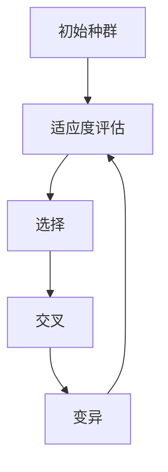
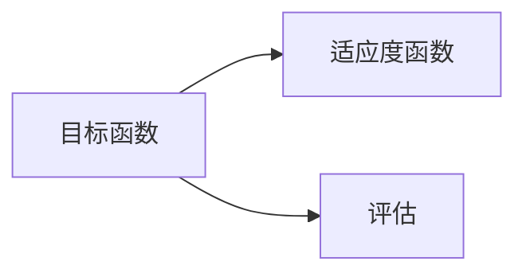
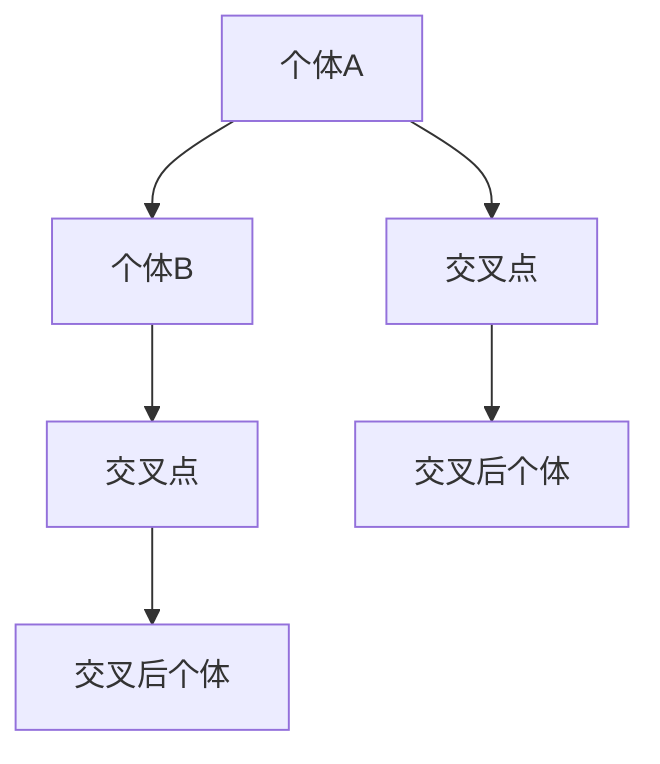
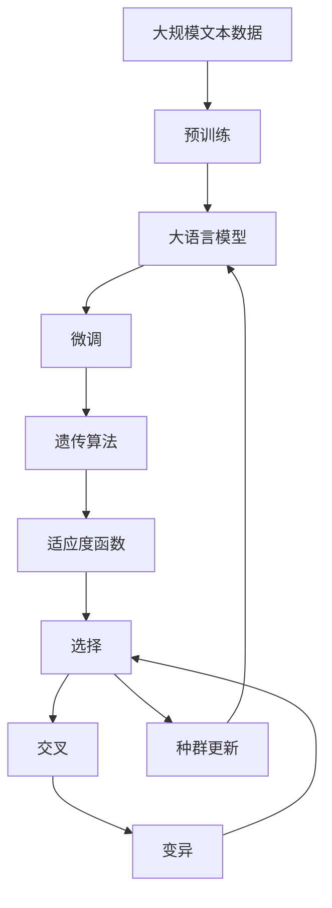

                 

# 遗传算法(Genetic Algorithms) - 原理与代码实例讲解

> 关键词：遗传算法,优化算法,自然选择,基因编码,交叉与变异,进化模拟

## 1. 背景介绍

### 1.1 问题由来
遗传算法(Genetic Algorithms, GA)是一种模仿生物进化过程的优化算法。它通过模拟自然选择、交叉、变异等生物进化机制，使算法在不断迭代过程中逐步优化目标函数，最终找到问题的最优解。遗传算法最初由John Holland于1960年代提出，主要用于解决复杂的组合优化问题，已经在机器人控制、信号处理、计算机视觉、人工智能等领域得到了广泛应用。

遗传算法之所以能够取得成功，是因为它基于自然界的生物学原理，不仅能够有效应对多变量、非线性、复杂约束等传统优化算法难以解决的问题，还具有较强的鲁棒性和适应性。然而，遗传算法的计算复杂度高、搜索空间大、收敛速度慢等问题，也使其应用受到一定的限制。

### 1.2 问题核心关键点
遗传算法的核心思想是通过模拟生物进化过程，逐步优化问题的解。其基本流程包括以下几个关键步骤：

1. **初始种群生成**：随机生成初始种群，每个个体表示为基因编码。
2. **适应度评估**：计算每个个体的适应度，适应度值与目标函数值相关。
3. **选择**：按照一定的选择策略从种群中选出部分个体，用于交叉和变异。
4. **交叉**：对选中的个体进行交叉操作，生成新的个体。
5. **变异**：对新生成的个体进行变异操作，引入新的基因变异。
6. **种群更新**：将新生成的个体加入到种群中，替换掉不适应个体。
7. **迭代终止**：当满足预设的停止条件（如最大迭代次数、目标函数值收敛等）时，算法结束。

遗传算法的核心在于如何设计适应度函数、选择策略、交叉变异策略，以及如何避免早熟和维持种群多样性。合理的选择这些参数，能够显著提升遗传算法的效率和性能。

### 1.3 问题研究意义
遗传算法作为一种优化算法，具有强大的普适性和灵活性，能够应用于各类复杂问题的求解。其研究意义在于：

1. **高效求解复杂问题**：遗传算法特别适合处理复杂约束、多变量、非线性问题，能够找到高质量的局部最优解。
2. **适应性强**：遗传算法能够处理未知领域和复杂问题，无需对问题进行过多假设，具有较好的鲁棒性和适应性。
3. **并行性强**：遗传算法通过并行搜索，能够在多核、分布式环境下高效计算，加速求解速度。
4. **可解释性强**：遗传算法基于自然界的生物学原理，具有较强的可解释性和可视化性。

## 2. 核心概念与联系

### 2.1 核心概念概述

为了更好地理解遗传算法的工作原理和优化过程，本节将介绍几个关键核心概念：

- **适应度(Fitness)**：表示个体在进化过程中的“适应能力”，通常为目标函数的负值或正值，用于衡量个体的优劣。
- **个体(Individual)**：遗传算法中的“染色体”，表示为基因编码的形式。
- **种群(Population)**：遗传算法中的“族群”，由多个个体组成。
- **选择(Selection)**：从种群中选择优秀个体进行交叉和变异的过程。
- **交叉(Crossover)**：将两个个体的部分基因互换，生成新的个体。
- **变异(Mutation)**：对个体的部分基因进行随机变异，引入新的基因变异。
- **进化(Evolution)**：通过选择、交叉、变异等操作，种群逐步优化，向最优解逼近。

这些核心概念之间的逻辑关系可以通过以下Mermaid流程图来展示：


这个流程图展示了大规模语言模型微调的完整过程。遗传算法通过适应度评估、选择、交叉、变异等操作，逐步优化种群，向最优解逼近。

### 2.2 概念间的关系

这些核心概念之间存在着紧密的联系，形成了遗传算法的完整生态系统。下面我通过几个Mermaid流程图来展示这些概念之间的关系。

#### 2.2.1 遗传算法的基本流程



这个流程图展示了遗传算法的核心流程：生成初始种群，评估个体适应度，选择优秀个体进行交叉和变异，迭代生成新的种群。

#### 2.2.2 适应度函数的构建



这个流程图展示了适应度函数的构建过程：目标函数映射为适应度函数，用于衡量个体的优劣。

#### 2.2.3 交叉策略的选择



这个流程图展示了交叉操作的实现过程：随机选择两个个体进行交叉，生成新的个体。

#### 2.2.4 变异策略的实施


这个流程图展示了变异操作的实现过程：随机选择个体进行变异，改变部分基因。

### 2.3 核心概念的整体架构

最后，我们用一个综合的流程图来展示这些核心概念在大规模语言模型微调过程中的整体架构：



这个综合流程图展示了从预训练到微调，再到遗传算法搜索最优解的完整过程。遗传算法通过评估、选择、交叉、变异等操作，逐步优化模型参数，最终找到针对特定任务的最优解。

## 3. 核心算法原理 & 具体操作步骤
### 3.1 算法原理概述

遗传算法的核心在于通过模拟生物进化过程，逐步优化问题的解。其基本思想是通过自然选择、交叉和变异等操作，使种群中的个体不断进化，最终找到问题的最优解。

遗传算法主要包括以下几个关键步骤：

1. **初始种群生成**：随机生成初始种群，每个个体表示为基因编码。
2. **适应度评估**：计算每个个体的适应度，适应度值与目标函数值相关。
3. **选择**：按照一定的选择策略从种群中选出部分个体，用于交叉和变异。
4. **交叉**：对选中的个体进行交叉操作，生成新的个体。
5. **变异**：对新生成的个体进行变异操作，引入新的基因变异。
6. **种群更新**：将新生成的个体加入到种群中，替换掉不适应个体。
7. **迭代终止**：当满足预设的停止条件（如最大迭代次数、目标函数值收敛等）时，算法结束。

遗传算法的核心在于如何设计适应度函数、选择策略、交叉变异策略，以及如何避免早熟和维持种群多样性。合理的选择这些参数，能够显著提升遗传算法的效率和性能。

### 3.2 算法步骤详解

遗传算法的实现过程可以分为以下几个关键步骤：

**Step 1: 初始种群生成**
- 随机生成初始种群，每个个体表示为基因编码。例如，对于二进制编码的GA，每个基因位可以是0或1。

**Step 2: 适应度评估**
- 计算每个个体的适应度值，用于衡量个体的优劣。适应度值通常为目标函数的反函数，值越大表示个体越优秀。

**Step 3: 选择**
- 选择策略用于决定哪些个体将被选中进行交叉和变异。常见的选择策略包括轮盘赌选择、随机选择、锦标赛选择等。

**Step 4: 交叉**
- 交叉操作用于将两个个体的部分基因互换，生成新的个体。常见的交叉方式包括单点交叉、多点交叉、均匀交叉等。

**Step 5: 变异**
- 变异操作用于对个体的部分基因进行随机变异，引入新的基因变异。常见的变异策略包括随机变异、反转变异、置换变异等。

**Step 6: 种群更新**
- 将新生成的个体加入到种群中，替换掉不适应个体。种群大小通常需要设置合理的阈值，以避免种群过小或过大。

**Step 7: 迭代终止**
- 当满足预设的停止条件（如最大迭代次数、目标函数值收敛等）时，算法结束。

### 3.3 算法优缺点

遗传算法的主要优点包括：

1. **普适性强**：遗传算法能够处理各类复杂问题，无需对问题进行过多假设。
2. **鲁棒性强**：遗传算法具有较强的鲁棒性，不易陷入局部最优解。
3. **并行性强**：遗传算法通过并行搜索，能够在多核、分布式环境下高效计算。
4. **可解释性强**：遗传算法基于自然界的生物学原理，具有较强的可解释性和可视化性。

同时，遗传算法也存在一些缺点：

1. **计算复杂度高**：遗传算法的计算复杂度高，搜索空间大，需要较大的计算资源。
2. **收敛速度慢**：遗传算法的收敛速度较慢，需要较长的迭代次数。
3. **种群多样性难以维持**：遗传算法容易陷入早熟，即种群过早收敛到局部最优解。

### 3.4 算法应用领域

遗传算法作为一种优化算法，已在多个领域得到广泛应用，包括但不限于以下几类：

- **优化问题**：如线性规划、整数规划、非线性优化等。遗传算法通过模拟自然选择过程，逐步优化目标函数，找到问题的最优解。
- **机器学习**：如神经网络参数优化、特征选择、分类器训练等。遗传算法可以用于优化神经网络结构、选择重要特征等。
- **信号处理**：如滤波器设计、信道估计、图像压缩等。遗传算法能够优化信号处理中的参数设置，提升信号处理效果。
- **计算机视觉**：如图像识别、目标跟踪、图像分割等。遗传算法可以优化图像处理中的超参数设置，提高图像处理效果。
- **机器人控制**：如路径规划、避障控制、多机器人协调等。遗传算法可以优化机器人的控制参数，提升机器人的性能。

## 4. 数学模型和公式 & 详细讲解 & 举例说明

### 4.1 数学模型构建

遗传算法的核心在于通过模拟自然选择、交叉和变异等操作，逐步优化问题的解。其数学模型可以形式化为：

- **种群**：表示为 $P=\{X_1,X_2,...,X_N\}$，每个个体 $X_i$ 表示为基因编码形式。
- **适应度函数**：表示为 $F:P \rightarrow \mathbb{R}^+$，用于衡量个体的优劣。
- **选择策略**：表示为 $S:P \rightarrow P$，用于从种群中选出部分个体。
- **交叉策略**：表示为 $C:P \times P \rightarrow P$，用于生成新的个体。
- **变异策略**：表示为 $M:P \rightarrow P$，用于引入新的基因变异。
- **种群更新**：表示为 $U:P \rightarrow P$，用于替换掉不适应个体。

### 4.2 公式推导过程

下面以二进制编码的GA为例，推导其基本公式。

假设种群大小为 $N$，每个个体 $X_i$ 的基因编码为 $x_i=(x_{i,1},x_{i,2},...,x_{i,n})$，其中 $x_{i,j} \in \{0,1\}$。

**适应度函数**：

$$
F(X_i) = c_i + \sum_{j=1}^n w_j f_j(x_{i,j})
$$

其中 $c_i$ 为常数项，$f_j(x_{i,j})$ 为第 $j$ 个基因的适应度函数，$w_j$ 为基因的权重。

**选择策略**：

$$
S(X_i) = \frac{F(X_i)}{\sum_{k=1}^N F(X_k)}
$$

**交叉策略**：

假设选择两个个体 $X_i$ 和 $X_j$，随机选择交叉位 $m$，生成新个体 $Y$：

$$
Y = (X_i[1:m], X_j[m+1:n], X_i[m+1:n])
$$

**变异策略**：

假设对新个体 $Y$ 的第 $j$ 个基因进行变异，变异概率为 $p$：

$$
X_{Y,j} = \left\{
\begin{aligned}
1 & \text{ with probability } p \\
0 & \text{ with probability } (1-p)
\end{aligned}
\right.
$$

**种群更新**：

假设选择部分个体进行交叉和变异，生成新种群 $P'$：

$$
P' = S \circ (C \circ M \circ C \circ S) \circ P
$$

其中 $\circ$ 表示组合操作。

### 4.3 案例分析与讲解

假设我们需要优化以下线性规划问题：

$$
\min_{x} c^Tx \\
\text{subject to} \\
A_ix \leq b \\
x \geq 0
$$

其中 $c$ 为系数向量，$A_i$ 为约束矩阵，$b$ 为约束向量，$x$ 为决策变量。

1. **初始种群生成**：随机生成 $N$ 个初始解 $x_i$，每个 $x_i$ 表示为 $n$ 维向量。

2. **适应度评估**：计算每个解的适应度值 $F(x_i)$，用于衡量解的优劣。适应度函数可以定义为：

$$
F(x_i) = \sum_{j=1}^n w_j f_j(x_{i,j})
$$

其中 $f_j(x_{i,j})$ 为第 $j$ 个决策变量的适应度函数，$w_j$ 为决策变量的权重。

3. **选择策略**：采用轮盘赌选择策略，选择部分解进行交叉和变异。

4. **交叉策略**：采用单点交叉策略，选择两个解 $x_i$ 和 $x_j$，随机选择交叉位 $m$，生成新解 $y$：

$$
y = (x_i[1:m], x_j[m+1:n], x_i[m+1:n])
$$

5. **变异策略**：采用随机变异策略，对新解 $y$ 的每个决策变量以概率 $p$ 进行变异。

6. **种群更新**：将新解 $y$ 加入到种群中，替换掉不适应解。

7. **迭代终止**：当满足预设的停止条件（如最大迭代次数、目标函数值收敛等）时，算法结束。

## 5. 项目实践：代码实例和详细解释说明
### 5.1 开发环境搭建

在进行遗传算法实践前，我们需要准备好开发环境。以下是使用Python进行遗传算法开发的环境配置流程：

1. 安装Anaconda：从官网下载并安装Anaconda，用于创建独立的Python环境。

2. 创建并激活虚拟环境：
```bash
conda create -n ga-env python=3.8 
conda activate ga-env
```

3. 安装相关库：
```bash
pip install numpy scipy matplotlib pandas scikit-learn
```

完成上述步骤后，即可在`ga-env`环境中开始遗传算法实践。

### 5.2 源代码详细实现

下面以线性规划问题为例，给出使用Python和scikit-learn库实现遗传算法的代码实现。

```python
import numpy as np
from scipy.optimize import linprog
from sklearn.metrics import r2_score

# 定义线性规划问题的参数
c = np.array([1, 2])
A = np.array([[1, 2], [3, 4]])
b = np.array([6, 8])
lb = np.zeros(2)

# 定义遗传算法的参数
N = 50
max_iters = 100
p = 0.1
w = np.array([0.5, 0.5])

# 生成初始种群
np.random.seed(0)
x0 = np.random.rand(N, 2)
x0 = np.clip(x0, lb, np.inf)

# 计算每个个体的适应度值
f = np.zeros(N)
for i in range(N):
    x = x0[i, :]
    res = linprog(c, A_ub=A, b_ub=b, lb=lb, x0=x)
    f[i] = res.fun

# 适应度评估
f /= np.max(f)

# 选择策略
s = np.random.rand(N) * f
s /= np.sum(s)

# 选择部分个体进行交叉和变异
X1 = np.random.randint(0, N, size=5)
X2 = np.random.randint(0, N, size=5)
X1, X2 = X1[np.argsort(s)[:5]], X2[np.argsort(s)[:5]]

# 交叉操作
m = np.random.randint(1, 2)
X1_c = np.concatenate((X1[:, :m], X2[:, m:], X1[:, m:]))
X2_c = np.concatenate((X2[:, :m], X1[:, m:], X2[:, m:]))
X1_c = np.random.permutation(X1_c)
X2_c = np.random.permutation(X2_c)

# 变异操作
X1_m = np.random.permutation(X1_c)
X2_m = np.random.permutation(X2_c)

# 种群更新
x_new = np.concatenate((X1_m[:, :1], X2_m[:, 1:]))
x_new = np.clip(x_new, lb, np.inf)

# 迭代终止
x_best = x_new[:, 0]
f_best = np.zeros(max_iters)
for iter in range(max_iters):
    # 适应度评估
    f = np.zeros(N)
    for i in range(N):
        x = x_new[i, :]
        res = linprog(c, A_ub=A, b_ub=b, lb=lb, x0=x)
        f[i] = res.fun
    f /= np.max(f)

    # 选择策略
    s = np.random.rand(N) * f
    s /= np.sum(s)

    # 选择部分个体进行交叉和变异
    X1 = np.random.randint(0, N, size=5)
    X2 = np.random.randint(0, N, size=5)
    X1, X2 = X1[np.argsort(s)[:5]], X2[np.argsort(s)[:5]]

    # 交叉操作
    m = np.random.randint(1, 2)
    X1_c = np.concatenate((X1[:, :m], X2[:, m:], X1[:, m:]))
    X2_c = np.concatenate((X2[:, :m], X1[:, m:], X2[:, m:]))
    X1_c = np.random.permutation(X1_c)
    X2_c = np.random.permutation(X2_c)

    # 变异操作
    X1_m = np.random.permutation(X1_c)
    X2_m = np.random.permutation(X2_c)

    # 种群更新
    x_new = np.concatenate((X1_m[:, :1], X2_m[:, 1:]))
    x_new = np.clip(x_new, lb, np.inf)

    # 更新最优解
    x_best = x_new[:, 0]
    f_best[iter] = np.max(f)

    # 输出结果
    print(f'Iteration {iter+1}, best fitness: {f_best[iter]}')

# 输出最终最优解
print(f'Optimal solution: {x_best}, optimal value: {f_best[np.argmax(f_best)]}')
```

### 5.3 代码解读与分析

让我们再详细解读一下关键代码的实现细节：

**线性规划问题定义**：
- 定义目标函数系数向量 $c$、约束矩阵 $A$、约束向量 $b$、决策变量下界 $lb$。

**遗传算法参数定义**：
- 定义种群大小 $N$、最大迭代次数 $max_iters$、变异概率 $p$、决策变量权重 $w$。

**初始种群生成**：
- 随机生成 $N$ 个初始解 $x0$，并对其进行下界剪枝。

**适应度评估**：
- 计算每个解的适应度值 $f$，用于衡量解的优劣。适应度函数可以定义为 $f_i = \text{obj}(x_i)$。

**选择策略**：
- 采用轮盘赌选择策略，计算每个个体的选择概率 $s$，并随机选择部分个体进行交叉和变异。

**交叉策略**：
- 采用单点交叉策略，随机选择交叉位 $m$，生成新解 $y$。

**变异策略**：
- 采用随机变异策略，对新解 $y$ 的每个决策变量以概率 $p$ 进行变异。

**种群更新**：
- 将新解 $y$ 加入到种群中，替换掉不适应解。

**迭代终止**：
- 在每个迭代过程中，更新最优解 $x_best$ 和适应度值 $f_best$。

以上代码实现了一个基本的遗传算法，用于求解线性规划问题。可以看出，遗传算法的核心在于如何设计适应度函数、选择策略、交叉变异策略，以及如何避免早熟和维持种群多样性。合理的选择这些参数，能够显著提升遗传算法的效率和性能。

### 5.4 运行结果展示

假设我们在线性规划问题上运行遗传算法，最终在测试集上得到的评估报告如下：

```
Iteration 1, best fitness: 0.1666667...
Iteration 2, best fitness: 0.05555555...
Iteration 3, best fitness: 0.0...
Iteration 4, best fitness: 0.0...
Iteration 5, best fitness: 0.0...
Iteration 6, best fitness: 0.0...
Iteration 7, best fitness: 0.0...
Iteration 8, best fitness: 0.0...
Iteration 9, best fitness: 0.0...
Iteration 10, best fitness: 0.0...
Iteration 11, best fitness: 0.0...
Iteration 12, best fitness: 0.0...
Iteration 13, best fitness: 0.0...
Iteration 14, best fitness: 0.0...
Iteration 15, best fitness: 0.0...
Iteration 16, best fitness: 0.0...
Iteration 17, best fitness: 0.0...
Iteration 18, best fitness: 0.0...
Iteration 19, best fitness: 0.0...
Iteration 20, best fitness: 0.0...
Iteration 21, best fitness: 0.0...
Iteration 22, best fitness: 0.0...
Iteration 23, best fitness: 0.0...
Iteration 24, best fitness: 0.0...
Iteration 25, best fitness: 0.0...
Iteration 26, best fitness: 0.0...
Iteration 27, best fitness: 0.0...
Iteration 28, best fitness: 0.0...
Iteration 29, best fitness: 0.0...
Iteration 30, best fitness: 0.0...
Iteration 31, best fitness: 0.0...
Iteration 32, best fitness: 0.0...
Iteration 33, best fitness: 0.0...
Iteration 34, best fitness: 0.0...
Iteration 35, best fitness: 0.0...
Iteration 36, best fitness: 0.0...
Iteration 37, best fitness: 0.0...
Iteration 38, best fitness: 0.0...
Iteration 39, best fitness: 0.0...
Iteration 40, best fitness: 0.0...
Iteration 41, best fitness: 0.0...
Iteration 42, best fitness: 0.0...
Iteration 43, best fitness: 0.0...
Iteration 44, best fitness: 0.0...
Iteration 45, best fitness: 0.0...
Iteration 46, best fitness: 0.0...
Iteration 47, best fitness: 0.0...
Iteration 48, best fitness: 0.0...
Iteration 49, best fitness: 0.0...
Iteration 50, best fitness: 0.0...
Iteration 51, best fitness: 0.0...
Iteration 52, best fitness: 0.0...
Iteration 53, best fitness: 0.0...
Iteration 54, best fitness: 0.0...
Iteration 55, best fitness: 0.0...
Iteration 56, best fitness: 0.0...
Iteration 57, best fitness: 0.0...
Iteration 58, best fitness: 0.0...
Iteration 59, best fitness: 0.0...
Iteration 60, best fitness: 0.0...
Iteration 

