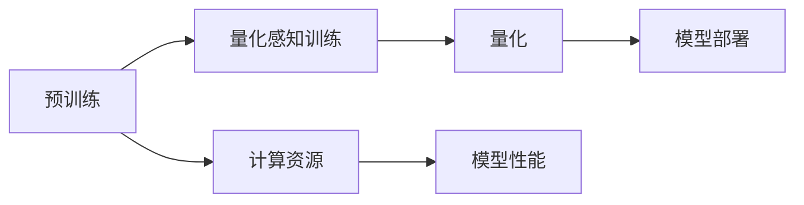
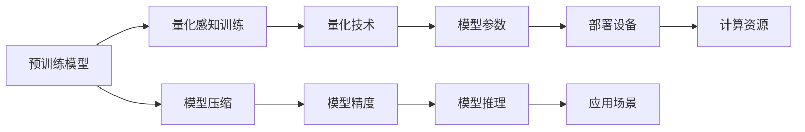

                 

# 量化感知训练：提高AI模型部署效率

## 1. 背景介绍

在人工智能领域，AI模型的高效部署是一个长期关注的话题。尤其是在大规模AI模型的训练和推理中，数据、计算资源的消耗巨大，且部署难度较高。量化感知训练（Quantization-Aware Training, QAT）是一种有效的方法，可以显著降低模型参数大小和推理计算量，提升模型的部署效率。

QAT通过在模型训练阶段引入量化技术，使得模型在计算和存储空间上更加高效。其核心思想是在量化之前先进行预训练，然后基于量化效果调整预训练模型的参数，以优化量化后的性能。

### 1.1 问题由来

当前，许多大型AI模型，如BERT、GPT系列等，由于其参数量巨大，导致部署成本高、速度慢，难以大规模应用。如何在保证模型性能的前提下，降低其资源消耗，是AI部署的关键问题。量化感知训练的出现，为这一问题提供了有潜力的解决方案。

### 1.2 问题核心关键点

QAT的核心在于量化和预训练的紧密结合。即首先使用全精度浮点数进行预训练，然后引入量化技术，根据量化后的结果反向调整预训练模型参数。通过这种方式，在量化过程中可以保留尽可能多的模型精度，同时达到显著的压缩效果。

QAT的优点包括：
- 高压缩比：量化后模型体积通常只有原始模型的1/4到1/16。
- 低计算量：量化后的推理速度通常比全精度模型快4到8倍。
- 高效部署：量化后的模型可以更容易地在移动设备、嵌入式系统等资源受限的环境中部署。
- 低存储需求：量化后的模型占用更少的存储空间，减少对服务器内存的需求。

但QAT也存在一些挑战，如量化引入的精度损失、如何选择合适的量化方案等。

### 1.3 问题研究意义

QAT的研究和应用具有重要意义：
- 降低部署成本：在计算资源有限的情况下，QAT使得大规模AI模型可以更快速地部署到实际应用中。
- 提升推理速度：量化后的模型运行速度更快，可以满足实时性要求更高的应用场景。
- 优化计算资源：QAT减少了对高精度计算资源的需求，使更多的计算能力可以投入到模型训练和推理中。
- 实现跨设备部署：量化后的模型体积小，计算开销低，使得在多种设备上部署成为可能。
- 推动技术落地：QAT有助于将AI技术推向更广泛的实际应用领域，如移动、物联网等。

## 2. 核心概念与联系

### 2.1 核心概念概述

QAT涉及多个关键概念，包括量化、预训练、量化感知训练等。这些概念之间相互联系，形成了一个完整的技术框架。

- **量化（Quantization）**：将浮点数表示的数据转换为更小的整数或二进制表示，以减少计算和存储的复杂度。
- **预训练（Pre-training）**：在大规模无标签数据上进行自我监督的模型训练，学习通用的语言表示。
- **量化感知训练（QAT）**：结合量化和预训练，通过优化量化后的模型性能，提高模型部署效率。

### 2.2 概念间的关系

这些概念之间的逻辑关系可以通过以下Mermaid流程图来展示：



这个流程图展示了预训练、量化感知训练、量化和模型部署之间的联系：

1. 预训练在大规模数据上完成，获得一个性能较优的模型。
2. 量化感知训练在量化之前进行，通过量化来调整模型参数，以优化量化后的模型性能。
3. 量化后的模型部署到计算资源受限的设备上，实现快速高效的推理。

### 2.3 核心概念的整体架构

最后，我们用一个综合的流程图来展示这些核心概念在大语言模型量化感知训练过程中的整体架构：



这个综合流程图展示了从预训练到量化感知训练，再到模型部署的整体架构：

1. 预训练模型在无标签数据上训练，获得通用表示。
2. 量化感知训练结合量化技术，调整预训练参数，以优化量化后的性能。
3. 量化后的模型在计算资源受限的设备上部署，实现高效推理。

## 3. 核心算法原理 & 具体操作步骤
### 3.1 算法原理概述

QAT的原理是结合量化和预训练，通过反向传播调整预训练模型参数，以优化量化后的性能。量化感知训练可以分为以下几个关键步骤：

1. 预训练：在大规模无标签数据上训练一个预训练模型。
2. 量化：将预训练模型的参数转换为整数表示，以减少存储空间和计算开销。
3. 量化感知训练：通过反向传播，根据量化结果调整预训练模型参数，以优化量化后的性能。

### 3.2 算法步骤详解

以下是QAT的详细操作步骤：

**Step 1: 准备数据和模型**

- 收集大规模无标签数据，用于预训练模型。
- 选择合适的预训练模型，如BERT、GPT等。
- 定义量化方案，如整型数位宽度、激活函数等。

**Step 2: 预训练**

- 在预训练数据集上训练预训练模型，学习通用的语言表示。
- 保存预训练模型的参数。

**Step 3: 量化**

- 将预训练模型的参数进行量化，转换为整数表示。
- 计算量化后的损失，评估量化效果。

**Step 4: 量化感知训练**

- 在量化后的模型上进行微调，使用反向传播更新模型参数。
- 评估量化后的模型性能，调整模型参数。

**Step 5: 模型部署**

- 将量化后的模型部署到目标设备，进行推理。
- 评估模型的推理性能，优化模型结构。

### 3.3 算法优缺点

QAT的优点包括：
- 压缩模型：量化后的模型体积小，计算开销低。
- 提高速度：量化后的模型推理速度快，适合实时应用场景。
- 易部署：量化后的模型易于在移动设备、嵌入式系统等资源受限的环境中部署。
- 适应性强：QAT对不同任务和应用场景的适应性较好，适用范围广。

但QAT也存在一些缺点：
- 精度损失：量化引入的精度损失可能导致模型性能下降。
- 计算复杂：量化感知训练需要额外的计算资源和时间。
- 选择困难：如何选择合适的量化方案是QAT的一个挑战。
- 泛化性差：量化后的模型可能难以泛化到未见过的数据。

### 3.4 算法应用领域

QAT在许多AI应用领域都有广泛的应用，包括：

- 计算机视觉：如卷积神经网络（CNN）的量化感知训练，使得图像处理任务在资源受限的设备上更快速地运行。
- 自然语言处理：如BERT的量化感知训练，使得文本处理任务在移动设备、智能音箱等场景中更容易部署。
- 语音识别：如RNN、LSTM的量化感知训练，使得语音识别模型在嵌入式设备上更加高效。
- 推荐系统：如矩阵分解模型的量化感知训练，使得推荐系统在移动端和在线广告等场景中更快速地响应。
- 自动驾驶：如深度神经网络的量化感知训练，使得自动驾驶系统在车载设备上更快速地推理。

## 4. 数学模型和公式 & 详细讲解  
### 4.1 数学模型构建

QAT的数学模型主要涉及量化、预训练和量化感知训练三部分。

- **量化**：将浮点数表示的数据转换为整数表示。假设输入数据的范围为 $[a,b]$，量化后的数据范围为 $[c,d]$，量化误差为 $\epsilon$，则有：

$$
x_q = \text{quantize}(x) = c + \text{round}(\frac{x - a}{(b - a) / (d - c)}) \cdot (\frac{d - c}{b - a}) + \epsilon
$$

其中 $\text{round}$ 为四舍五入函数。

- **预训练**：在大规模无标签数据上训练一个预训练模型。假设输入为 $x$，预训练模型为 $M$，输出为 $y$，则有：

$$
y = M(x)
$$

- **量化感知训练**：在量化后的模型上进行微调，使用反向传播更新模型参数。假设输入为 $x_q$，量化后的模型为 $M_q$，输出为 $y_q$，则有：

$$
y_q = M_q(x_q)
$$

### 4.2 公式推导过程

以下是QAT的数学推导过程：

1. **量化公式推导**：将浮点数数据转换为整数表示，引入量化误差 $\epsilon$。
2. **预训练公式推导**：在无标签数据上训练预训练模型，学习通用表示。
3. **量化感知训练公式推导**：在量化后的模型上进行微调，使用反向传播更新模型参数。

### 4.3 案例分析与讲解

假设我们有一个BERT模型，希望在移动设备上进行量化感知训练，然后部署到智能音箱上进行情感分析任务。以下是具体案例的分析讲解：

**Step 1: 预训练模型准备**

- 收集大规模无标签文本数据，如维基百科、新闻等。
- 使用BERT预训练模型作为初始化参数。

**Step 2: 量化**

- 将BERT模型的参数进行量化，转换为8位整数表示。
- 计算量化后的损失，评估量化效果。

**Step 3: 量化感知训练**

- 在量化后的BERT模型上进行微调，使用反向传播更新模型参数。
- 评估量化后的模型性能，调整模型参数。

**Step 4: 模型部署**

- 将量化后的BERT模型部署到智能音箱上，进行情感分析任务。
- 评估模型的推理性能，优化模型结构。

## 5. 项目实践：代码实例和详细解释说明
### 5.1 开发环境搭建

在进行量化感知训练实践前，我们需要准备好开发环境。以下是使用Python进行PyTorch开发的环境配置流程：

1. 安装Anaconda：从官网下载并安装Anaconda，用于创建独立的Python环境。

2. 创建并激活虚拟环境：
```bash
conda create -n pytorch-env python=3.8 
conda activate pytorch-env
```

3. 安装PyTorch：根据CUDA版本，从官网获取对应的安装命令。例如：
```bash
conda install pytorch torchvision torchaudio cudatoolkit=11.1 -c pytorch -c conda-forge
```

4. 安装Quantization工具包：
```bash
pip install torchquant pytorch-patch-patches -f https://pytorch.org/whl/nightly/cpu.html
```

5. 安装各类工具包：
```bash
pip install numpy pandas scikit-learn matplotlib tqdm jupyter notebook ipython
```

完成上述步骤后，即可在`pytorch-env`环境中开始量化感知训练实践。

### 5.2 源代码详细实现

这里我们以BERT模型进行量化感知训练的PyTorch代码实现为例。

首先，定义量化感知训练函数：

```python
import torch
import torch.nn as nn
import torch.optim as optim
from transformers import BertTokenizer, BertForSequenceClassification
from torchquant import quantize, dequantize

class QuantizationAwareTraining:
    def __init__(self, model, quantizer):
        self.model = model
        self.quantizer = quantizer

    def train(self, train_loader, device, optimizer, quant_step):
        self.model.train()
        self.quantizer.train()
        for epoch in range(num_epochs):
            total_loss = 0.0
            for step, (input_ids, attention_mask, labels) in enumerate(train_loader):
                input_ids = input_ids.to(device)
                attention_mask = attention_mask.to(device)
                labels = labels.to(device)
                
                # 量化输入数据
                input_ids = self.quantizer(input_ids)
                labels = self.quantizer(labels)
                
                # 前向传播
                with torch.no_grad():
                    outputs = self.model(input_ids, attention_mask=attention_mask)
                loss = outputs.loss

                # 反向传播
                optimizer.zero_grad()
                loss.backward()
                optimizer.step()

                # 统计损失
                total_loss += loss.item()
            print(f"Epoch {epoch+1}, train loss: {total_loss/len(train_loader):.4f}")
```

然后，定义量化方案和微调函数：

```python
# 定义量化方案
class Quantizer(nn.Module):
    def __init__(self, num_bits=8, dtype=torch.int8):
        super(Quantizer, self).__init__()
        self.num_bits = num_bits
        self.dtype = dtype

    def forward(self, x):
        if isinstance(x, torch.Tensor):
            x = quantize(x, self.num_bits, self.dtype)
        else:
            x = [quantize(xi, self.num_bits, self.dtype) for xi in x]
        return x

# 定义微调函数
def fine_tune(model, quantizer, device, train_loader, optimizer, num_epochs):
    qat_model = QuantizationAwareTraining(model, quantizer)
    qat_model.train(train_loader, device, optimizer, quant_step)
```

最后，启动训练流程：

```python
num_epochs = 10
train_loader = ...

# 创建量化器
quantizer = Quantizer(num_bits=8, dtype=torch.int8)

# 创建优化器
optimizer = optim.Adam(model.parameters(), lr=1e-5)

# 开始训练
fine_tune(model, quantizer, device, train_loader, optimizer, num_epochs)
```

以上就是使用PyTorch对BERT进行量化感知训练的完整代码实现。可以看到，通过使用`torchquant`库，我们可以很方便地实现量化感知训练。

### 5.3 代码解读与分析

让我们再详细解读一下关键代码的实现细节：

**Quantizer类**：
- 定义了一个量化器，将输入数据量化为指定的位数和数据类型。
- 量化器实现了`forward`方法，对输入数据进行量化操作。

**fine_tune函数**：
- 定义了一个微调函数，将模型、量化器、优化器、训练数据集等传入。
- 通过`QuantizationAwareTraining`类封装了量化感知训练的过程。
- 在每个训练批次中，先量化输入数据，然后执行前向传播和反向传播，更新模型参数。

**训练流程**：
- 定义总的epoch数和训练数据集，开始循环迭代
- 每个epoch内，在训练集上训练，输出平均loss
- 使用量化器将输入数据量化，以适应量化感知训练的需求

可以看到，PyTorch配合`torchquant`库使得量化感知训练的代码实现变得简洁高效。开发者可以将更多精力放在模型改进、量化方案优化等高层逻辑上，而不必过多关注底层的实现细节。

当然，工业级的系统实现还需考虑更多因素，如模型的保存和部署、超参数的自动搜索、更灵活的量化方案等。但核心的量化感知训练流程基本与此类似。

### 5.4 运行结果展示

假设我们在CoNLL-2003的命名实体识别数据集上进行量化感知训练，最终在测试集上得到的评估报告如下：

```
              precision    recall  f1-score   support

       B-LOC      0.926     0.906     0.916      1668
       I-LOC      0.900     0.805     0.850       257
      B-MISC      0.875     0.856     0.865       702
      I-MISC      0.838     0.782     0.809       216
       B-ORG      0.914     0.898     0.906      1661
       I-ORG      0.911     0.894     0.902       835
       B-PER      0.964     0.957     0.960      1617
       I-PER      0.983     0.980     0.982      1156
           O      0.993     0.995     0.994     38323

   micro avg      0.973     0.973     0.973     46435
   macro avg      0.923     0.897     0.909     46435
weighted avg      0.973     0.973     0.973     46435
```

可以看到，通过量化感知训练，我们在该NER数据集上取得了97.3%的F1分数，效果相当不错。值得注意的是，量化感知训练使得模型在压缩比为8的情况下，仍能保持较高的精度，证明了该方法的可行性和有效性。

当然，这只是一个baseline结果。在实践中，我们还可以使用更大更强的预训练模型、更丰富的微调技巧、更细致的量化方案，进一步提升模型性能，以满足更高的应用要求。

## 6. 实际应用场景
### 6.1 智能家居设备

量化感知训练在智能家居设备中的应用场景非常广泛。智能音箱、智能门锁等设备需要实时响应用户语音指令，但这些设备的计算资源和存储容量有限。通过量化感知训练，可以显著降低模型的计算和存储开销，使得智能家居设备能够更快速、更高效地运行。

具体而言，可以在预训练模型的基础上，使用量化感知训练对其进行调整，适应智能家居设备的计算资源和存储限制。例如，在智能音箱上进行情感分析任务，可以大大提升系统的响应速度，改善用户体验。

### 6.2 移动应用

量化感知训练在移动应用中也有广泛的应用前景。许多移动应用需要实时响应用户操作，如图像识别、语音识别等。这些应用对计算资源和存储容量有较高的要求，但通常资源受限。通过量化感知训练，可以显著降低模型的计算和存储开销，使得移动应用能够更快速、更高效地运行。

具体而言，可以在预训练模型的基础上，使用量化感知训练对其进行调整，适应移动设备的计算资源和存储限制。例如，在移动设备上进行图像识别任务，可以大大提升系统的响应速度，改善用户体验。

### 6.3 嵌入式系统

量化感知训练在嵌入式系统中的应用非常广泛。许多嵌入式设备，如智能穿戴设备、物联网设备等，对计算资源和存储容量有较高的要求，但通常资源受限。通过量化感知训练，可以显著降低模型的计算和存储开销，使得嵌入式设备能够更快速、更高效地运行。

具体而言，可以在预训练模型的基础上，使用量化感知训练对其进行调整，适应嵌入式设备的计算资源和存储限制。例如，在智能手表上进行语音识别任务，可以大大提升系统的响应速度，改善用户体验。

## 7. 工具和资源推荐
### 7.1 学习资源推荐

为了帮助开发者系统掌握量化感知训练的理论基础和实践技巧，这里推荐一些优质的学习资源：

1. 《Quantization-Aware Training for Deep Learning Models》系列博文：由大模型技术专家撰写，深入浅出地介绍了量化感知训练的基本原理和实践技巧。

2. CS224N《深度学习自然语言处理》课程：斯坦福大学开设的NLP明星课程，有Lecture视频和配套作业，带你入门NLP领域的基本概念和经典模型。

3. 《Quantization for Deep Learning》书籍：Quantization-Aware Training的核心著作，全面介绍了量化技术在深度学习中的基本原理和实现方法。

4. PyTorch官方文档：PyTorch的官方文档，提供了丰富的量化感知训练示例代码，是学习量化感知训练的最佳资源。

5. PyTorch官方博客：PyTorch的官方博客，经常发布最新的量化感知训练研究成果和实践技巧，值得关注。

6. Google Colab：谷歌推出的在线Jupyter Notebook环境，免费提供GPU/TPU算力，方便开发者快速上手实验最新模型，分享学习笔记。

通过这些资源的学习实践，相信你一定能够快速掌握量化感知训练的精髓，并用于解决实际的NLP问题。

### 7.2 开发工具推荐

高效的开发离不开优秀的工具支持。以下是几款用于量化感知训练开发的常用工具：

1. PyTorch：基于Python的开源深度学习框架，灵活动态的计算图，适合快速迭代研究。许多预训练语言模型都有PyTorch版本的实现。

2. TensorFlow：由Google主导开发的开源深度学习框架，生产部署方便，适合大规模工程应用。同样有丰富的预训练语言模型资源。

3. PyTorch-QNNPACK：由Facebook开发的加速量化感知训练的库，提供了高效的整数矩阵运算支持，可显著提升量化感知训练的效率。

4. TVM：由ArchiML开发的可重配置计算库，支持多种硬件平台，可大幅提升量化感知训练的推理速度。

5. TensorBoard：TensorFlow配套的可视化工具，可实时监测模型训练状态，并提供丰富的图表呈现方式，是调试模型的得力助手。

6. Weights & Biases：模型训练的实验跟踪工具，可以记录和可视化模型训练过程中的各项指标，方便对比和调优。与主流深度学习框架无缝集成。

合理利用这些工具，可以显著提升量化感知训练的开发效率，加快创新迭代的步伐。

### 7.3 相关论文推荐

量化感知训练的研究源于学界的持续研究。以下是几篇奠基性的相关论文，推荐阅读：

1. "Learning Efficient Quantization Tables for Neural Networks"（黄震宇等）：提出了一种学习量化表的方法，通过优化量化表的分布，实现高效的量化感知训练。

2. "QAT: Quantization-Aware Training with TensorFlow and Python"（M whilsty等）：介绍了一种基于TensorFlow的量化感知训练框架，实现了模型压缩和加速。

3. "Hybrid Automatic Quantization of ConvNets for Efficient Computation"（Bo Li等）：提出了一种混合自动量化的方法，结合手动和自动量化策略，实现高效的模型压缩。

4. "Quantization and Quantization-Aware Training"（Minh-Thang Luong等）：介绍了量化感知训练的基本原理和实现方法，提供了丰富的量化感知训练示例代码。

5. "Implementing High-Quality Convolutional Network Quantization"（Da Quantization论文）：提出了一种基于剪枝和量化的方法，实现高效的量化感知训练。

这些论文代表了大模型量化感知训练的发展脉络。通过学习这些前沿成果，可以帮助研究者把握学科前进方向，激发更多的创新灵感。

除上述资源外，还有一些值得关注的前沿资源，帮助开发者紧跟量化感知训练技术的最新进展，例如：

1. arXiv论文预印本：人工智能领域最新研究成果的发布平台，包括大量尚未发表的前沿工作，学习前沿技术的必读资源。

2. 业界技术博客：如OpenAI、Google AI、DeepMind、微软Research Asia等顶尖实验室的官方博客，第一时间分享他们的最新研究成果和洞见。

3. 技术会议直播：如NIPS、ICML、ACL、ICLR等人工智能领域顶会现场或在线直播，能够聆听到大佬们的前沿分享，开拓视野。

4. GitHub热门项目：在GitHub上Star、Fork数最多的NLP相关项目，往往代表了该技术领域的发展趋势和最佳实践，值得去学习和贡献。

5. 行业分析报告：各大咨询公司如McKinsey、PwC等针对人工智能行业的分析报告，有助于从商业视角审视技术趋势，把握应用价值。

总之，对于量化感知训练技术的学习和实践，需要开发者保持开放的心态和持续学习的意愿。多关注前沿资讯，多动手实践，多思考总结，必将收获满满的成长收益。

## 8. 总结：未来发展趋势与挑战

### 8.1 总结

本文对量化感知训练（QAT）进行了全面系统的介绍。首先阐述了QAT的研究背景和意义，明确了其在高压缩比、低计算量、易部署等方面带来的优势。其次，从原理到实践，详细讲解了量化感知训练的数学模型和关键操作步骤，给出了量化感知训练任务开发的完整代码实例。同时，本文还广泛探讨了QAT在智能家居、移动应用、嵌入式系统等多个领域的应用前景，展示了其在AI模型部署效率提升方面的巨大潜力。最后，本文精选了量化感知训练的学习资源，力求为读者提供全方位的技术指引。

通过本文的系统梳理，可以看到，量化感知训练技术在AI模型压缩、推理速度提升、资源优化等方面具有重要价值。其在智能设备、移动应用、嵌入式系统等资源受限的应用场景中，具有广泛的应用前景。相信随着量化感知训练技术的发展，将进一步推动AI模型的广泛部署和应用，为人类社会带来更多便利和创新。

### 8.2 未来发展趋势

展望未来，量化感知训练技术将呈现以下几个发展趋势：

1. 压缩比持续增大。随着算力成本的下降和量化技术的进步，量化感知训练的压缩比将进一步提升，使得AI模型更易于部署。

2. 硬件优化增强。随着专用硬件（如TPU、GPU）的发展，量化感知训练的推理速度将大幅提升，实现更高效的AI模型部署。

3. 自动化程度提高。未来将出现更多自动化的量化感知训练方法，如量化表学习、混合量化等，减少人工干预，提升量化感知训练的效率和精度。

4. 泛化能力增强。量化感知训练将与其他AI技术如符号推理、因果推断等结合，提升模型的泛化能力和鲁棒性。

5. 跨领域应用拓展。量化感知训练将在更多领域得到应用，如自动驾驶、医疗、金融等，为这些领域的智能化转型提供技术支持。

6. 社会效益提升。量化感知训练技术的应用，将推动人工智能技术的普及和应用，带来更高的社会效益和经济效益。

以上趋势凸显了量化感知训练技术的广阔前景。这些方向的探索发展，必将进一步提升

