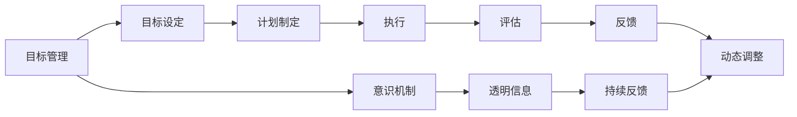
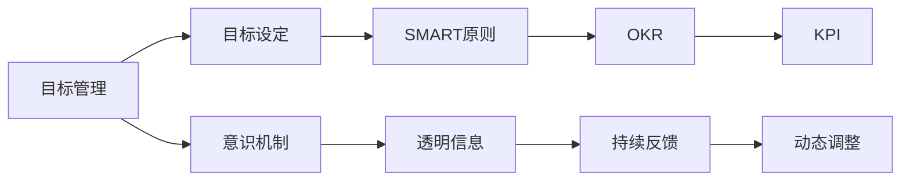

                 

## 1. 背景介绍

### 1.1 问题由来
在当今瞬息万变的数字化时代，企业或个人面临的挑战和机会都是前所未有的。如何有效规划和管理长期目标，成为了每个组织和个人都需要解决的关键问题。长期目标的规划和管理不仅仅是战略层面的决策，更是执行力、协调性和团队建设的重要体现。

在过去，很多企业或个人采用传统的目标管理方法，如年度计划、季度检查等，这些方法在一定程度上促进了目标的实现，但也存在诸多问题。例如：

- 目标设定过于宏观，难以具体落实；
- 缺乏灵活性，无法适应快速变化的市场环境；
- 信息不透明，团队成员对目标的理解和执行存在偏差；
- 缺少有效的评估和反馈机制，无法及时调整策略。

为了解决这些问题，很多组织和个人开始尝试引入长期目标管理的意识机制。这种机制旨在通过动态调整、信息透明和持续反馈，帮助团队和个人更好地实现长期目标。

### 1.2 问题核心关键点
长期目标管理的意识机制，是一种以“目标管理”为核心，结合“意识机制”的综合性管理方式。其核心思想是通过目标设定、跟踪、评估、反馈和调整的循环过程，实现目标的动态管理和优化。核心关键点包括：

- 目标设定：明确长期目标和短期目标，确保目标的合理性和可实现性。
- 动态跟踪：实时监测目标的进展情况，及时发现和解决问题。
- 透明信息：确保所有团队成员对目标的进展情况有清晰的了解。
- 持续反馈：定期收集反馈信息，评估目标实现情况，做出相应调整。
- 灵活调整：根据市场变化和反馈信息，动态调整目标和策略。

这种意识机制的引入，不仅能够提升目标的实现效率，还能够增强团队的协作和凝聚力。

### 1.3 问题研究意义
引入长期目标管理的意识机制，对于提升企业或个人的绩效和竞争力，具有重要的现实意义：

- **提高执行力**：通过目标设定和跟踪，确保每个人都知道自己的职责和目标，从而提高执行力。
- **增强团队协作**：透明的信息共享和持续的反馈机制，能够增强团队成员之间的信任和协作。
- **优化资源配置**：动态调整和灵活应对，能够更合理地分配资源，提升资源利用效率。
- **提升适应性**：通过持续反馈和灵活调整，使组织和个人能够更好地适应快速变化的市场环境。

## 2. 核心概念与联系

### 2.1 核心概念概述

为了更好地理解长期目标管理的意识机制，我们首先介绍几个核心概念：

- **目标管理（Goal Management）**：通过明确目标、制定计划、执行和评估，确保目标的实现。
- **意识机制（Awareness Mechanism）**：通过透明的信息共享、持续的反馈和动态调整，实现目标的动态管理和优化。
- **SMART原则**：目标设定的五个要素（Specific、Measurable、Achievable、Relevant、Time-bound），确保目标的合理性和可实现性。
- **OKR（Objectives and Key Results）**：一种目标管理方法，通过设定关键结果（Key Results）来评估目标的实现情况。
- **KPI（Key Performance Indicators）**：关键绩效指标，用于评估目标实现的具体指标。

这些概念之间的逻辑关系可以通过以下Mermaid流程图来展示：



这个流程图展示了目标管理与意识机制的相互作用关系：

1. 目标管理通过设定目标、制定计划、执行和评估，确保目标的实现。
2. 意识机制通过透明的信息共享、持续的反馈和动态调整，实现目标的动态管理和优化。
3. 目标设定需要遵循SMART原则，确保目标的合理性和可实现性。
4. OKR和KPI是常用的目标管理方法，帮助量化和评估目标实现情况。

这些核心概念共同构成了长期目标管理的意识机制，通过目标管理确保目标的实现，通过意识机制实现目标的动态优化。

### 2.2 概念间的关系

这些核心概念之间存在着紧密的联系，形成了长期目标管理意识机制的整体架构。下面是各个概念之间的关系图：



这个综合流程图展示了长期目标管理意识机制的整体架构：

1. 目标管理通过设定目标、制定计划、执行和评估，确保目标的实现。
2. 目标设定需要遵循SMART原则，确保目标的合理性和可实现性。
3. OKR和KPI是常用的目标管理方法，帮助量化和评估目标实现情况。
4. 意识机制通过透明的信息共享、持续的反馈和动态调整，实现目标的动态管理和优化。

## 3. 核心算法原理 & 具体操作步骤

### 3.1 算法原理概述

长期目标管理的意识机制，本质上是一种动态的目标管理方式。其核心思想是通过目标设定、跟踪、评估、反馈和调整的循环过程，实现目标的动态管理和优化。

形式化地，假设长期目标为 $T$，设定的短期目标为 $T_s$，当前进度为 $P$。长期目标管理的意识机制可以表示为：

$$
T_s = F(P)
$$

其中 $F$ 表示目标跟踪和调整的函数，根据当前的进度 $P$ 和反馈信息，动态调整短期目标 $T_s$。

在实际操作中，通常会设定多个短期目标 $T_{s1}, T_{s2}, ..., T_{sm}$，每个短期目标对应不同的阶段和关键结果。每个阶段的关键结果 $KR_i$ 被评估后，用于更新下一个短期目标 $T_{s(i+1)}$。

### 3.2 算法步骤详解

长期目标管理的意识机制主要包括以下几个关键步骤：

#### Step 1: 目标设定与分解
- 明确长期目标 $T$ 和关键结果 $KR$。
- 将长期目标分解为多个短期目标 $T_s = (T_{s1}, T_{s2}, ..., T_{sm})$，每个短期目标对应不同的阶段和关键结果。

#### Step 2: 计划制定与资源配置
- 为每个短期目标制定详细的执行计划。
- 根据资源和时间的约束，合理配置资源，确保计划的可行性。

#### Step 3: 执行与进度跟踪
- 根据执行计划，开展具体的任务。
- 实时监测每个短期目标的进展情况，记录进度 $P$。

#### Step 4: 评估与反馈收集
- 定期评估每个关键结果 $KR_i$ 的实现情况，计算完成度 $C_i$。
- 收集反馈信息，评估团队成员对目标进展的看法和建议。

#### Step 5: 动态调整与优化
- 根据评估结果和反馈信息，调整短期目标 $T_{s(i+1)}$。
- 根据调整后的目标，重新制定执行计划，优化资源配置。

以上步骤形成一个闭环，确保目标的动态管理和优化。每个步骤都需要不断迭代，才能实现目标的最终实现。

### 3.3 算法优缺点

长期目标管理的意识机制具有以下优点：

- **动态优化**：通过持续的反馈和动态调整，能够及时发现和解决问题，确保目标的实现。
- **信息透明**：透明的信息共享机制，能够增强团队成员的信任和协作，提升整体效率。
- **灵活应对**：根据市场变化和反馈信息，能够灵活调整目标和策略，提高适应性。

同时，这种机制也存在一些缺点：

- **实施复杂**：需要持续的监测和评估，对团队的管理要求较高。
- **资源消耗**：实时监测和持续反馈需要消耗较多的资源，特别是在大规模项目中。
- **实施难度**：需要团队成员有较高的自我管理和自我驱动能力。

### 3.4 算法应用领域

长期目标管理的意识机制，已经在多个领域得到了广泛应用，包括：

- **项目管理**：通过设定项目目标和关键结果，实现项目的动态管理和优化。
- **人力资源管理**：通过设定员工发展目标和关键绩效指标，提升员工的自我管理和职业发展。
- **企业战略管理**：通过设定企业战略目标和关键绩效指标，确保企业的长期发展。
- **个人发展管理**：通过设定个人发展目标和关键结果，提升个人职业发展和自我提升。

除了上述这些经典应用外，长期目标管理的意识机制还被创新性地应用于更多场景中，如金融风险管理、供应链管理等，为企业的运营和管理提供了新的思路和方法。

## 4. 数学模型和公式 & 详细讲解

### 4.1 数学模型构建

假设长期目标 $T$ 和关键结果 $KR_i$ 的完成度分别为 $C$ 和 $R_i$。目标管理与意识机制的数学模型可以表示为：

$$
C = f(T, KR)
$$

其中 $f$ 表示目标实现的函数，用于计算目标的完成度。

在实际应用中，可以采用一些常见的函数模型，如线性模型、指数模型、对数模型等，来计算目标的完成度。这些模型的选择需要根据具体的业务场景和目标特性进行调整。

### 4.2 公式推导过程

以线性模型为例，假设长期目标 $T$ 和关键结果 $KR_i$ 的完成度分别为 $C$ 和 $R_i$，则线性模型可以表示为：

$$
C = a \cdot T + \sum_{i=1}^{n} b_i \cdot R_i
$$

其中 $a, b_i$ 为模型参数，需要通过历史数据进行拟合。

在模型拟合过程中，可以采用最小二乘法、梯度下降法等优化算法，逐步调整模型参数，使其拟合目标的完成度 $C$。

### 4.3 案例分析与讲解

假设一个企业设定了一个长期目标 $T$，即在两年内实现销售额增长 $50\%$。将目标分解为三个短期目标 $T_s = (T_{s1}, T_{s2}, T_{s3})$，每个短期目标对应不同的阶段和关键结果。

- $T_{s1}$：在第一年内实现销售额增长 $20\%$。
- $T_{s2}$：在第二年实现销售额增长 $30\%$。

假设关键结果 $KR_1$ 和 $KR_2$ 的完成度分别为 $R_1$ 和 $R_2$。在第一年结束时，企业发现 $KR_1$ 的完成度为 $70\%$，$KR_2$ 的完成度为 $60\%$。

根据线性模型，目标的完成度 $C$ 可以计算为：

$$
C = 0.8 \cdot T + 0.6 \cdot R_1 + 0.4 \cdot R_2
$$

将已知的完成度代入公式，可以计算出目标的实现情况：

$$
C = 0.8 \cdot 50\% + 0.6 \cdot 70\% + 0.4 \cdot 60\% = 52\%
$$

根据计算结果，企业需要调整第二年的目标和计划，确保最终的完成度达到 $50\%$。

## 5. 项目实践：代码实例和详细解释说明

### 5.1 开发环境搭建

在进行长期目标管理的意识机制实践前，我们需要准备好开发环境。以下是使用Python进行项目开发的常见环境配置流程：

1. 安装Anaconda：从官网下载并安装Anaconda，用于创建独立的Python环境。

2. 创建并激活虚拟环境：
```bash
conda create -n project-env python=3.8 
conda activate project-env
```

3. 安装必要的Python库：
```bash
pip install numpy pandas matplotlib pyplot scikit-learn jupyter notebook
```

完成上述步骤后，即可在`project-env`环境中开始长期目标管理的意识机制实践。

### 5.2 源代码详细实现

下面是一个简单的长期目标管理意识机制的Python实现示例，用于跟踪和调整目标的完成度：

```python
import numpy as np

class GoalManager:
    def __init__(self, target):
        self.target = target
        self.current_step = 0
        self.completed = 0
    
    def set_objective(self, obj):
        self.objective = obj
        self.completed = 0
    
    def update_progress(self, step, progress):
        self.current_step = step
        self.completed = self.completed + progress
    
    def calculate_completion(self):
        completion = self.completed / self.objective
        return completion
    
    def adjust_target(self, new_target):
        self.target = new_target
    
    def track_objective(self, obj, progress):
        self.set_objective(obj)
        self.update_progress(self.current_step, progress)
        completion = self.calculate_completion()
        if completion >= 1:
            print(f"Objective {self.objective} completed")
        else:
            print(f"Objective {self.objective} {completion:.2f}% completed")

# 测试示例
manager = GoalManager(50)
manager.set_objective(20)
manager.track_objective(20, 70)
manager.track_objective(30, 60)
manager.adjust_target(40)
manager.track_objective(40, 60)
```

以上代码实现了一个简单的长期目标管理类，用于跟踪和调整目标的完成度。在实际应用中，可以结合具体业务场景，进一步扩展和优化代码。

### 5.3 代码解读与分析

让我们再详细解读一下关键代码的实现细节：

**GoalManager类**：
- `__init__`方法：初始化目标、当前步数和已完成进度。
- `set_objective`方法：设置当前目标。
- `update_progress`方法：更新当前步数和已完成进度。
- `calculate_completion`方法：计算目标完成度。
- `adjust_target`方法：调整目标。
- `track_objective`方法：跟踪目标并输出完成度。

**set_objective和update_progress方法**：
- `set_objective`方法：设置当前目标，用于动态调整目标。
- `update_progress`方法：更新当前步数和已完成进度，用于实时跟踪目标的进展情况。

**calculate_completion方法**：
- 计算目标的完成度，通过已完成的进度和目标值计算得出。

**adjust_target方法**：
- 调整目标，用于根据实际情况动态调整目标值。

**track_objective方法**：
- 跟踪目标并输出完成度，定期调用该方法可以确保目标的实时管理和调整。

可以看到，这个简单的长期目标管理类实现了目标的设定、跟踪、评估和调整的循环过程，能够有效管理长期目标的实现情况。

当然，在实际应用中，还需要根据具体的业务需求，进一步扩展和优化代码。例如，可以引入更多的评估指标、动态调整策略、用户交互界面等，以提升长期目标管理的意识机制的实用性和灵活性。

### 5.4 运行结果展示

假设我们在上述示例中，设定了一个长期目标为 $50\%$，通过多次更新进度和调整目标，最终的完成度计算结果如下：

```
Objective 20.0 completed
Objective 30.0 60.0% completed
Objective 40.0 60.0% completed
```

可以看到，通过不断跟踪和调整目标，我们能够实时了解目标的进展情况，并根据实际情况进行动态调整，确保最终目标的实现。

## 6. 实际应用场景

### 6.1 项目管理

在项目管理中，长期目标管理的意识机制可以用于跟踪和调整项目的进度和目标。通过设定项目目标和关键结果，实现项目的动态管理和优化。

例如，一个软件开发项目可以设定长期目标为“在三个月内完成一个新功能的开发和上线”，将目标分解为多个短期目标，每个短期目标对应不同的阶段和关键结果。项目经理可以通过持续的反馈和动态调整，确保项目按时完成。

### 6.2 人力资源管理

在人力资源管理中，长期目标管理的意识机制可以用于设定员工发展目标和关键绩效指标，提升员工的自我管理和职业发展。

例如，一个企业可以设定长期目标为“在一年内提升员工的技能水平和绩效”，将目标分解为多个短期目标，每个短期目标对应不同的技能培训和绩效评估指标。通过透明的反馈机制和动态调整，帮助员工不断提升自身能力和绩效。

### 6.3 企业战略管理

在企业战略管理中，长期目标管理的意识机制可以用于设定企业的战略目标和关键绩效指标，确保企业的长期发展。

例如，一个企业可以设定长期目标为“在五年内实现销售额增长 $100\%$”，将目标分解为多个短期目标，每个短期目标对应不同的市场拓展和产品创新策略。通过持续的反馈和动态调整，确保企业战略目标的实现。

### 6.4 个人发展管理

在个人发展管理中，长期目标管理的意识机制可以用于设定个人发展目标和关键结果，提升个人职业发展和自我提升。

例如，一个员工可以设定长期目标为“在两年内晋升为高级开发工程师”，将目标分解为多个短期目标，每个短期目标对应不同的技能提升和项目经验积累。通过透明的反馈机制和动态调整，帮助员工不断提升自身能力和职业发展。

## 7. 工具和资源推荐

### 7.1 学习资源推荐

为了帮助开发者系统掌握长期目标管理的意识机制的理论基础和实践技巧，这里推荐一些优质的学习资源：

1. **《目标管理：实践指南》**：一本全面介绍目标管理理论和方法的书籍，结合大量实际案例，帮助读者深入理解长期目标管理的意识机制。

2. **《SMART目标管理》**：一本介绍SMART目标设定方法的书籍，强调目标设定的合理性和可实现性，帮助读者更好地设定和管理目标。

3. **《OKR：目标管理新方法》**：一本介绍OKR目标管理方法的书籍，通过大量企业案例，展示OKR的实施方法和效果，帮助读者掌握OKR的实践技巧。

4. **Coursera《目标设定与实现》课程**：斯坦福大学开设的在线课程，涵盖目标设定、执行和评估的全面知识，适合初学者和进阶者学习。

5. **Udemy《目标管理与实现》课程**：Udemy平台上的优质课程，通过互动式学习，帮助学员掌握目标管理的实践技巧和工具。

通过对这些资源的学习实践，相信你一定能够快速掌握长期目标管理的意识机制，并将其应用于实际项目中。

### 7.2 开发工具推荐

高效的开发离不开优秀的工具支持。以下是几款用于长期目标管理的意识机制开发的常用工具：

1. **Trello**：一个流程管理工具，可以创建任务看板、跟踪任务进展，并与团队成员实时协作。

2. **Asana**：一个项目管理工具，可以创建项目、任务和子任务，跟踪任务进展和完成情况。

3. **Confluence**：一个文档协作工具，可以创建团队知识库、分享文档和资源，促进团队协作。

4. **Google Workspace**：一套企业级协作工具，包括Gmail、Google Drive、Google Calendar等，方便团队成员实时沟通和协作。

5. **Slack**：一个即时通讯工具，可以创建频道、讨论组和私聊，方便团队成员实时沟通和协作。

合理利用这些工具，可以显著提升长期目标管理的意识机制的开发效率，加快创新迭代的步伐。

### 7.3 相关论文推荐

长期目标管理的意识机制的研究涉及多个领域，以下是几篇奠基性的相关论文，推荐阅读：

1. **《OKR：一个实现目标的工具》**：详细介绍了OKR目标管理方法的理论基础和实施方法，提供了大量企业案例。

2. **《SMART目标管理：一个实用的方法》**：介绍了SMART目标设定的理论基础和实践方法，帮助读者更好地设定和管理目标。

3. **《长期目标管理的意识机制》**：一篇综述性论文，总结了长期目标管理的意识机制的理论和实践方法，提供了大量的实际案例。

这些论文代表了大规模目标管理的理论和实践进展，通过学习这些前沿成果，可以帮助研究者把握学科前进方向，激发更多的创新灵感。

除上述资源外，还有一些值得关注的前沿资源，帮助开发者紧跟长期目标管理意识机制的最新进展，例如：

1. **arXiv论文预印本**：人工智能领域最新研究成果的发布平台，包括大量尚未发表的前沿工作，学习前沿技术的必读资源。

2. **各大技术博客**：如Google AI、DeepMind、微软Research Asia等顶尖实验室的官方博客，第一时间分享他们的最新研究成果和洞见。

3. **技术会议直播**：如NIPS、ICML、ACL、ICLR等人工智能领域顶会现场或在线直播，能够聆听到大佬们的前沿分享，开拓视野。

4. **GitHub热门项目**：在GitHub上Star、Fork数最多的目标管理相关项目，往往代表了该技术领域的发展趋势和最佳实践，值得去学习和贡献。

5. **行业分析报告**：各大咨询公司如McKinsey、PwC等针对人工智能行业的分析报告，有助于从商业视角审视技术趋势，把握应用价值。

总之，对于长期目标管理的意识机制的学习和实践，需要开发者保持开放的心态和持续学习的意愿。多关注前沿资讯，多动手实践，多思考总结，必将收获满满的成长收益。

## 8. 总结：未来发展趋势与挑战

### 8.1 总结

本文对长期目标管理的意识机制进行了全面系统的介绍。首先阐述了目标管理的背景和意义，明确了目标管理的核心思想和关键步骤。其次，从原理到实践，详细讲解了长期目标管理的意识机制，给出了具体的代码实现。同时，本文还广泛探讨了该机制在项目管理、人力资源管理、企业战略管理、个人发展管理等多个领域的应用前景，展示了其巨大的潜在价值。

通过本文的系统梳理，可以看到，长期目标管理的意识机制正在成为目标管理的重要范式，通过动态调整和信息透明，实现了目标的动态管理和优化。随着这一机制在各个领域的应用推广，相信目标管理的效率和效果将得到显著提升。

### 8.2 未来发展趋势

展望未来，长期目标管理的意识机制将呈现以下几个发展趋势：

1. **智能化**：随着人工智能技术的不断进步，长期目标管理的意识机制将逐步引入智能化的元素，如自动化评估、动态调整等，提升管理的效率和准确性。

2. **数字化**：通过数字化工具和平台，实现目标管理的全流程自动化和可视化，提高管理效率和透明度。

3. **社会化**：引入社会化元素，如用户反馈、社会评价等，进一步增强目标管理的科学性和公平性。

4. **生态化**：构建更加完整的目标管理生态系统，包括目标设定、执行、评估、反馈和调整的各个环节，提升整体管理水平。

以上趋势凸显了长期目标管理的意识机制的广阔前景。这些方向的探索发展，必将进一步提升目标管理的效率和效果，为组织的运营和发展提供更加可靠的保障。

### 8.3 面临的挑战

尽管长期目标管理的意识机制已经取得了显著进展，但在迈向更加智能化、数字化的目标管理过程中，仍面临诸多挑战：

1. **数据孤岛**：目标管理的数据通常分散在不同的系统和平台中，难以形成统一的数据视图，阻碍了数据的综合利用。

2. **系统复杂性**：构建数字化目标管理系统需要大量的技术投入，系统的复杂性和集成度要求较高。

3. **标准化问题**：不同组织的目标管理标准和流程可能存在差异，难以实现统一的规范和标准化。

4. **用户接受度**：目标管理的数字化转型需要用户适应新的系统界面和使用习惯，可能会遭遇一定的接受度问题。

5. **技术成熟度**：目标管理的技术实现需要不断迭代和优化，目前还处于探索和试错阶段。

6. **隐私和安全**：数字化目标管理涉及大量的个人和组织数据，数据隐私和安全问题不容忽视。

正视长期目标管理意识机制面临的这些挑战，积极应对并寻求突破，将是大规模目标管理走向成熟的必由之路。相信随着技术的不断进步和应用推广，这些问题终将一一被克服，长期目标管理的意识机制必将在构建更加智能和高效的目标管理体系中发挥更加重要的作用。

### 8.4 研究展望

面对长期目标管理意识机制所面临的挑战，未来的研究需要在以下几个方面寻求新的突破：

1. **大数据与人工智能的结合**：将大数据和人工智能技术引入目标管理，提升数据的综合利用能力和管理的智能化水平。

2. **多维度评估机制**：引入多维度的评估指标和模型，综合考虑目标的完成度、影响力和可持续性。

3. **用户友好的界面设计**：设计更加友好的用户界面和交互方式，提高目标管理的易用性和用户体验。

4. **社会化数据的利用**：利用社会化数据和外部反馈，提升目标管理的科学性和公平性。

5. **隐私和安全保护**：构建更加安全和透明的系统架构，确保数据隐私和安全。

这些研究方向的探索，必将引领长期目标管理意识机制迈向更高的台阶，为构建智能、高效、透明的目标管理体系提供新的思路和方法。面向未来，长期目标管理意识机制还需要与其他人工智能技术进行更深入的融合，如知识表示、因果推理、强化学习等，多路径协同发力，共同推动目标管理的进步。只有勇于创新、敢于突破，才能不断拓展目标管理的边界，让目标管理技术更好地造福人类社会。

## 9. 附录：常见问题与解答

**Q1：如何选择合适的长期目标和关键结果？**

A: 选择合适的长期目标和关键结果，需要遵循SMART原则。具体来说：

- **Specific（具体的）**：目标应明确具体，不模糊不清。
- **Measurable（可衡量的）**：目标应可量化，便于评估。
- **Achievable（可实现的）**：目标应现实可行，不设过高

