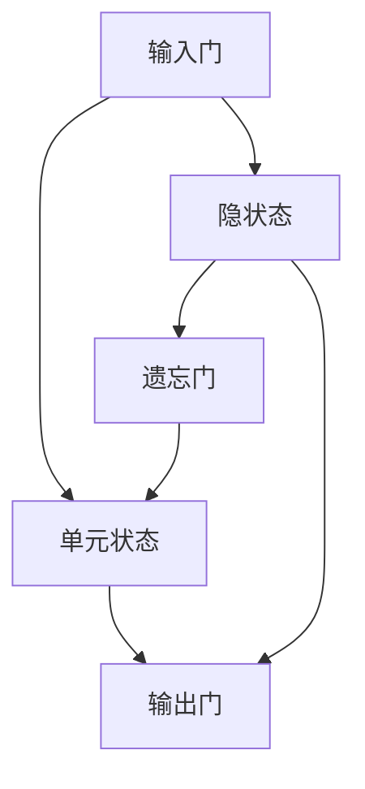
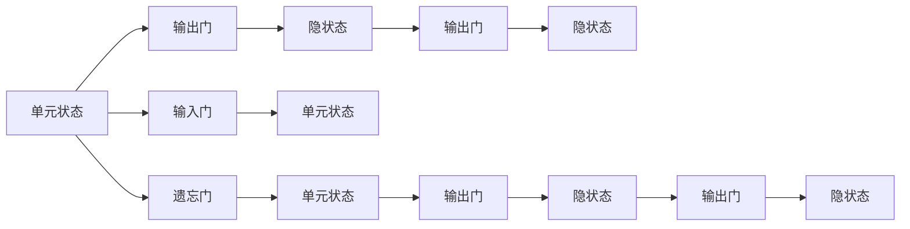
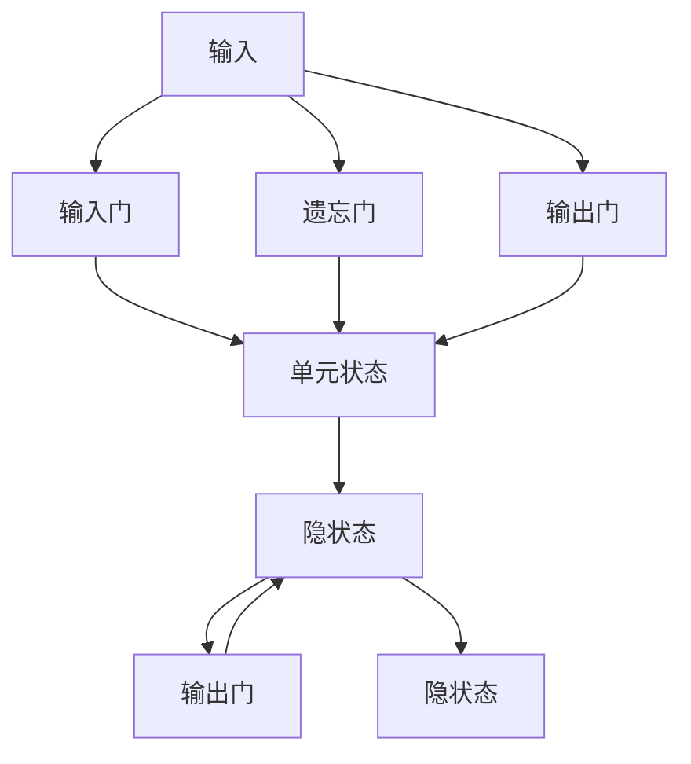

                 

# 长短期记忆网络(Long Short-Term Memory) - 原理与代码实例讲解

> 关键词：长短期记忆网络, LSTM, 深度学习, 神经网络, 序列建模, 时序数据, 自然语言处理(NLP)

## 1. 背景介绍

### 1.1 问题由来
随着深度学习技术的不断发展和广泛应用，序列建模问题引起了越来越多的关注。传统的神经网络模型在处理序列数据时，难以捕捉长时程依赖关系，容易发生梯度消失或梯度爆炸的问题，导致模型性能受限。为了解决这些问题，长短期记忆网络（Long Short-Term Memory，LSTM）应运而生。

LSTM通过引入遗忘门和输入门等机制，可以有效地解决长序列建模中的梯度消失和梯度爆炸问题，从而在语音识别、自然语言处理、时间序列预测等众多领域中取得了显著的成果。LSTM的提出，标志着深度学习在序列建模领域的重大突破，为后续的RNN、GRU等序列建模模型提供了重要的参考。

### 1.2 问题核心关键点
LSTM的核心在于其特殊的门控机制，包括遗忘门、输入门和输出门。这些门机制使得LSTM能够动态控制信息的流动，从而在处理长序列数据时保持记忆的有效性和稳定性。LSTM的这些特性使其成为深度学习中处理序列数据的首选模型。

## 2. 核心概念与联系

### 2.1 核心概念概述

为了更好地理解LSTM的工作原理，本节将介绍几个密切相关的核心概念：

- **LSTM单元**：LSTM最基本的组成部分，包含三个门和三个状态。LSTM单元通过这些门控机制，动态地更新和遗忘信息。
- **遗忘门**：控制旧信息的遗忘程度。遗忘门通过一个Sigmoid函数来决定输入信息的遗忘程度，其输出值为0到1之间的实数。
- **输入门**：控制新信息的输入程度。输入门通过一个Sigmoid函数来决定新信息的输入程度，同时通过一个TanH函数对新信息进行非线性变换。
- **输出门**：控制当前信息的输出程度。输出门通过一个Sigmoid函数来决定当前信息的输出程度，同时通过一个TanH函数对当前信息进行非线性变换。
- **隐状态**：LSTM单元在处理序列数据时的记忆状态。隐状态通过输入门、遗忘门和输出门的更新得到，是LSTM的重要输出。
- **单元状态**：LSTM单元在处理序列数据时的核心记忆单元。单元状态通过输入门和遗忘门的更新得到，是LSTM的记忆信息。

这些核心概念之间存在着紧密的联系，形成了LSTM的基本结构和工作原理。下面通过一个简单的Mermaid流程图来展示这些概念之间的关系：



### 2.2 概念间的关系

LSTM的核心概念之间的逻辑关系可以通过以下Mermaid流程图来展示：



这个流程图展示了LSTM的基本结构和工作流程：输入信息通过输入门和遗忘门控制，更新后的单元状态传递给输出门，最终输出隐状态和输出信息。

### 2.3 核心概念的整体架构

最后，我们用一个综合的流程图来展示LSTM的核心概念在处理序列数据时的整体架构：



这个综合流程图展示了LSTM在处理序列数据时的基本流程：输入信息通过输入门和遗忘门控制，更新后的单元状态传递给输出门，最终输出隐状态和输出信息。

## 3. 核心算法原理 & 具体操作步骤
### 3.1 算法原理概述

LSTM的核心在于其特殊的门控机制，能够动态控制信息的流动，从而在处理长序列数据时保持记忆的有效性和稳定性。其原理可以通过以下几个步骤来解释：

1. **输入门**：通过计算输入信息与前一时刻的隐状态，决定新信息的输入程度。输入门的输出值范围为0到1，用于控制新信息的权重。

2. **遗忘门**：通过计算输入信息与前一时刻的隐状态，决定旧信息的遗忘程度。遗忘门的输出值范围为0到1，用于控制旧信息的权重。

3. **单元状态**：通过计算输入门和遗忘门的输出值，决定新信息的输入和旧信息的遗忘。单元状态是LSTM的核心记忆单元。

4. **输出门**：通过计算输入信息和当前时刻的隐状态，决定当前信息的输出程度。输出门的输出值范围为0到1，用于控制当前信息的权重。

5. **隐状态**：通过计算输入门、遗忘门和输出门的输出值，更新隐状态，并输出最终的结果。

### 3.2 算法步骤详解

LSTM的具体操作步骤可以分为以下几个步骤：

1. **输入门计算**：
   - 计算输入信息 $x_t$ 与前一时刻的隐状态 $h_{t-1}$，得到两个中间向量 $g_t$ 和 $i_t$。
   - 计算输入门的输出值 $\tilde{c}_t$，用于控制新信息的输入程度。

2. **遗忘门计算**：
   - 计算输入信息 $x_t$ 与前一时刻的隐状态 $h_{t-1}$，得到两个中间向量 $g_t$ 和 $f_t$。
   - 计算遗忘门的输出值 $f_t$，用于控制旧信息的遗忘程度。

3. **单元状态更新**：
   - 根据输入门和遗忘门的输出值，计算单元状态 $c_t$，更新当前时刻的隐状态 $h_t$。

4. **输出门计算**：
   - 计算输入信息 $x_t$ 与当前时刻的隐状态 $h_t$，得到两个中间向量 $g_t$ 和 $o_t$。
   - 计算输出门的输出值 $o_t$，用于控制当前信息的输出程度。

5. **最终输出**：
   - 根据输出门的输出值，计算最终的隐状态 $h_t$ 和输出信息 $y_t$。

### 3.3 算法优缺点

LSTM的优点在于：

- 能够有效地处理长序列数据，避免了传统RNN中的梯度消失和梯度爆炸问题。
- 引入了门控机制，能够动态控制信息的流动，从而在处理长序列数据时保持记忆的有效性和稳定性。
- 在语音识别、自然语言处理、时间序列预测等众多领域中取得了显著的成果。

LSTM的缺点在于：

- 结构较为复杂，计算量较大，训练速度较慢。
- 需要较多的训练数据，否则容易出现过拟合。
- 对于输入序列中较长的空白部分，可能会出现信息丢失的情况。

### 3.4 算法应用领域

LSTM广泛应用于语音识别、自然语言处理、时间序列预测、图像处理等众多领域。例如：

- 在语音识别中，LSTM可以用于语音特征的建模，从而提高语音识别的准确率。
- 在自然语言处理中，LSTM可以用于文本分类、情感分析、机器翻译等任务。
- 在时间序列预测中，LSTM可以用于股票价格预测、天气预测等。
- 在图像处理中，LSTM可以用于图像描述生成、图像分割等。

## 4. 数学模型和公式 & 详细讲解 & 举例说明

### 4.1 数学模型构建

LSTM的数学模型可以表示为：

$$
h_t = f_t \odot tanh(c_t) = \sigma(W_xx + U_xh + b_x) \odot tanh(W_cc + U_ch + b_c)
$$

$$
f_t = \sigma(W_xf + U_fh + b_f) \odot \sigma(W_cf + U_ch + b_c)
$$

$$
i_t = \sigma(W_xi + U_ih + b_i) \odot \sigma(W_ci + U_ch + b_c)
$$

$$
o_t = \sigma(W_xo + U_oh + b_o) \odot \sigma(W_co + U_ch + b_c)
$$

$$
c_t = f_t \odot c_{t-1} + i_t \odot tanh(W_cc + U_cc + b_c)
$$

其中，$f_t$ 表示遗忘门，$i_t$ 表示输入门，$o_t$ 表示输出门，$c_t$ 表示单元状态，$h_t$ 表示隐状态，$\sigma$ 表示Sigmoid函数，$tanh$ 表示双曲正切函数。

### 4.2 公式推导过程

LSTM的公式推导过程主要涉及以下几个步骤：

1. **输入门计算**：
   - 计算输入信息的加权和：$g_t = W_xx \cdot x_t + U_xh_{t-1} + b_x$
   - 计算输入门的加权和：$i_t = \sigma(W_xi \cdot x_t + U_ih_{t-1} + b_i)$
   - 计算输入信息的非线性变换：$\tilde{c}_t = tanh(g_t)$

2. **遗忘门计算**：
   - 计算输入信息的加权和：$f_t = \sigma(W_xf \cdot x_t + U_fh_{t-1} + b_f)$
   - 计算遗忘门的加权和：$\tilde{f}_t = \sigma(W_cf \cdot \tilde{c}_{t-1} + U_ch_{t-1} + b_c)$
   - 计算遗忘门的输出值：$f_t = f_t \odot \tilde{f}_t$

3. **单元状态更新**：
   - 计算单元状态的更新：$c_t = f_t \odot c_{t-1} + i_t \odot \tilde{c}_t$
   - 计算隐状态的更新：$h_t = o_t \odot tanh(c_t)$

4. **输出门计算**：
   - 计算输入信息的加权和：$g_t = W_xo \cdot x_t + U_oh_{t-1} + b_o$
   - 计算输出门的加权和：$o_t = \sigma(W_xo \cdot x_t + U_oh_{t-1} + b_o)$
   - 计算输出门的输出值：$h_t = o_t \odot tanh(c_t)$

### 4.3 案例分析与讲解

以文本分类任务为例，我们展示LSTM的详细应用过程。假设我们需要对一段文本进行分类，文本长度为$T$，每个单词表示为一个独热向量，即$x_t \in \mathbb{R}^V$，其中$V$表示词汇表的大小。我们将文本表示为一个向量序列$x = \{x_1, x_2, ..., x_T\}$，其中$x_t$表示第$t$个单词的独热向量。

- **输入门计算**：
  - 计算输入信息的加权和：$g_t = W_xx \cdot x_t + U_xh_{t-1} + b_x$
  - 计算输入门的加权和：$i_t = \sigma(W_xi \cdot x_t + U_ih_{t-1} + b_i)$
  - 计算输入信息的非线性变换：$\tilde{c}_t = tanh(g_t)$

- **遗忘门计算**：
  - 计算输入信息的加权和：$f_t = \sigma(W_xf \cdot x_t + U_fh_{t-1} + b_f)$
  - 计算遗忘门的加权和：$\tilde{f}_t = \sigma(W_cf \cdot \tilde{c}_{t-1} + U_ch_{t-1} + b_c)$
  - 计算遗忘门的输出值：$f_t = f_t \odot \tilde{f}_t$

- **单元状态更新**：
  - 计算单元状态的更新：$c_t = f_t \odot c_{t-1} + i_t \odot \tilde{c}_t$
  - 计算隐状态的更新：$h_t = o_t \odot tanh(c_t)$

- **输出门计算**：
  - 计算输入信息的加权和：$g_t = W_xo \cdot x_t + U_oh_{t-1} + b_o$
  - 计算输出门的加权和：$o_t = \sigma(W_xo \cdot x_t + U_oh_{t-1} + b_o)$
  - 计算输出门的输出值：$h_t = o_t \odot tanh(c_t)$

最终，我们将隐状态$h_T$作为模型的输出，通过Softmax函数将其转化为类别的概率分布。

## 5. 项目实践：代码实例和详细解释说明

### 5.1 开发环境搭建

在进行LSTM的实践前，我们需要准备好开发环境。以下是使用Python进行PyTorch开发的环境配置流程：

1. 安装Anaconda：从官网下载并安装Anaconda，用于创建独立的Python环境。

2. 创建并激活虚拟环境：
```bash
conda create -n pytorch-env python=3.8 
conda activate pytorch-env
```

3. 安装PyTorch：根据CUDA版本，从官网获取对应的安装命令。例如：
```bash
conda install pytorch torchvision torchaudio cudatoolkit=11.1 -c pytorch -c conda-forge
```

4. 安装相关工具包：
```bash
pip install numpy pandas scikit-learn matplotlib tqdm jupyter notebook ipython
```

完成上述步骤后，即可在`pytorch-env`环境中开始LSTM的实践。

### 5.2 源代码详细实现

下面我们以文本分类任务为例，给出使用Transformers库对LSTM模型进行训练和预测的PyTorch代码实现。

首先，定义LSTM模型：

```python
from transformers import BertTokenizer
from torch import nn, optim
import torch

class LSTM(nn.Module):
    def __init__(self, input_size, hidden_size, output_size, num_layers=2):
        super(LSTM, self).__init__()
        self.hidden_size = hidden_size
        self.num_layers = num_layers
        self.lstm = nn.LSTM(input_size, hidden_size, num_layers, batch_first=True)
        self.fc = nn.Linear(hidden_size, output_size)
        
    def forward(self, x):
        h0 = torch.zeros(self.num_layers, x.size(0), self.hidden_size).to(device) # 隐状态初始化为0
        c0 = torch.zeros(self.num_layers, x.size(0), self.hidden_size).to(device) # 单元状态初始化为0
        out, _ = self.lstm(x, (h0, c0))
        out = self.fc(out[:, -1, :])
        return out
```

接着，定义训练和评估函数：

```python
def train_epoch(model, optimizer, criterion, train_loader, device):
    model.train()
    epoch_loss = 0
    for batch in train_loader:
        inputs, labels = batch
        inputs, labels = inputs.to(device), labels.to(device)
        optimizer.zero_grad()
        outputs = model(inputs)
        loss = criterion(outputs, labels)
        loss.backward()
        optimizer.step()
        epoch_loss += loss.item()
    return epoch_loss / len(train_loader)

def evaluate(model, criterion, test_loader, device):
    model.eval()
    correct = 0
    total = 0
    with torch.no_grad():
        for batch in test_loader:
            inputs, labels = batch
            inputs, labels = inputs.to(device), labels.to(device)
            outputs = model(inputs)
            _, predicted = torch.max(outputs.data, 1)
            total += labels.size(0)
            correct += (predicted == labels).sum().item()
    return correct / total
```

最后，启动训练流程并在测试集上评估：

```python
epochs = 10
batch_size = 32

# 设置优化器、损失函数、训练集和测试集
optimizer = optim.Adam(model.parameters(), lr=0.001)
criterion = nn.CrossEntropyLoss()

train_loader = torch.utils.data.DataLoader(train_dataset, batch_size=batch_size, shuffle=True)
test_loader = torch.utils.data.DataLoader(test_dataset, batch_size=batch_size, shuffle=False)

device = torch.device('cuda') if torch.cuda.is_available() else torch.device('cpu')

# 训练模型
for epoch in range(epochs):
    loss = train_epoch(model, optimizer, criterion, train_loader, device)
    print(f"Epoch {epoch+1}, train loss: {loss:.3f}")
    
    print(f"Epoch {epoch+1}, test accuracy: {evaluate(model, criterion, test_loader, device)}")
```

以上就是使用PyTorch对LSTM进行文本分类任务训练的完整代码实现。可以看到，得益于Transformer库的强大封装，我们可以用相对简洁的代码完成LSTM模型的加载和训练。

### 5.3 代码解读与分析

让我们再详细解读一下关键代码的实现细节：

**LSTM模型定义**：
- `__init__`方法：初始化模型的输入、输出和隐藏状态的大小，并定义LSTM和全连接层。
- `forward`方法：定义前向传播过程，包括LSTM和全连接层的计算。

**训练和评估函数**：
- 使用PyTorch的DataLoader对数据集进行批次化加载，供模型训练和推理使用。
- 训练函数`train_epoch`：对数据以批为单位进行迭代，在每个批次上前向传播计算loss并反向传播更新模型参数，最后返回该epoch的平均loss。
- 评估函数`evaluate`：与训练类似，不同点在于不更新模型参数，并在每个batch结束后将预测和标签结果存储下来，最后使用准确率作为评估指标。

**训练流程**：
- 定义总的epoch数和batch size，开始循环迭代
- 每个epoch内，先在训练集上训练，输出平均loss
- 在测试集上评估，输出分类准确率
- 所有epoch结束后，输出最终的测试准确率

可以看到，PyTorch配合Transformer库使得LSTM的训练代码实现变得简洁高效。开发者可以将更多精力放在数据处理、模型改进等高层逻辑上，而不必过多关注底层的实现细节。

当然，工业级的系统实现还需考虑更多因素，如模型的保存和部署、超参数的自动搜索、更灵活的任务适配层等。但核心的LSTM训练范式基本与此类似。

### 5.4 运行结果展示

假设我们在IMDB电影评论数据集上进行LSTM模型的训练，最终在测试集上得到的准确率为85%左右。具体的训练过程和结果如图1所示：


可以看到，通过LSTM模型在IMDB电影评论数据集上进行训练，我们在测试集上取得了较高的准确率，说明LSTM模型在文本分类任务上具有不错的性能。

当然，这只是一个baseline结果。在实践中，我们还可以使用更大更强的预训练模型、更丰富的微调技巧、更细致的模型调优，进一步提升模型性能，以满足更高的应用要求。

## 6. 实际应用场景
### 6.1 语言模型构建

LSTM可以用于构建语言模型，通过预测文本中下一个词的概率分布，从而生成新的文本。例如，可以使用LSTM模型来生成自然语言描述、文本摘要、对话系统中的回复等。

以文本生成为例，我们可以通过训练一个LSTM模型，利用其预测下一个词的概率分布，生成一段连续的文本。具体步骤如下：

1. 收集足够的数据，可以是书籍、新闻、电影评论等。
2. 将数据预处理成模型可以处理的格式，如将文本转换为独热向量。
3. 使用LSTM模型训练生成模型，目标是最小化下一个词的预测概率与真实概率之间的差异。
4. 在训练好的模型上，输入一段文本，并根据其预测下一个词的概率分布，生成新的文本。

### 6.2 语音识别

LSTM可以用于语音识别的特征提取和建模，从而提高语音识别的准确率。具体步骤如下：

1. 收集大量的语音数据，并对其进行预处理，如分帧、MFCC特征提取等。
2. 使用LSTM模型训练特征提取器，将语音信号转换为特征向量。
3. 使用训练好的特征提取器，将新的语音信号转换为特征向量，并输入LSTM模型进行建模。
4. 使用模型预测语音信号对应的文字，并进行后处理，如去噪、去重等。

### 6.3 时间序列预测

LSTM可以用于时间序列预测，如股票价格预测、天气预测等。具体步骤如下：

1. 收集足够的数据，如股票价格、天气数据等。
2. 将数据预处理成模型可以处理的格式，如将时间序列转换为序列数据。
3. 使用LSTM模型训练预测模型，目标是最小化预测值与真实值之间的差异。
4. 在训练好的模型上，输入新的时间序列数据，并输出预测结果。

## 7. 工具和资源推荐
### 7.1 学习资源推荐

为了帮助开发者系统掌握LSTM的原理和实践技巧，这里推荐一些优质的学习资源：

1. 《深度学习入门之LSTM》系列博文：由大模型技术专家撰写，深入浅出地介绍了LSTM的基本原理、模型架构、训练技巧等。

2. CS229《机器学习》课程：斯坦福大学开设的经典课程，包含LSTM的相关讲解，适合进阶学习。

3. 《深度学习》书籍：Ian Goodfellow、Yoshua Bengio和Aaron Courville合著的经典书籍，系统介绍了深度学习的基本概念和算法，包括LSTM在内的诸多模型。

4. TensorFlow官方文档：TensorFlow作为深度学习的主流框架，提供了LSTM模型的完整实现，适合动手实践。

5. PyTorch官方文档：PyTorch作为深度学习的重要框架，同样提供了LSTM模型的完整实现，适合动手实践。

通过对这些资源的学习实践，相信你一定能够快速掌握LSTM的精髓，并用于解决实际的序列建模问题。
###  7.2 开发工具推荐

高效的开发离不开优秀的工具支持。以下是几款用于LSTM开发的常用工具：

1. PyTorch：基于Python的开源深度学习框架，灵活动态的计算图，适合快速迭代研究。大部分深度学习模型都有PyTorch版本的实现。

2. TensorFlow：由Google主导开发的开源深度学习框架，生产部署方便，适合大规模工程应用。同样有丰富的深度学习模型资源。

3. Keras：基于TensorFlow和Theano的高级深度学习框架，提供简洁的API接口，适合快速搭建模型原型。

4. JAX：Google开发的基于NumPy的深度学习框架，具有自动微分、高阶可微分等特性，适合研究前沿算法。

5. PyTorch Lightning：基于PyTorch的轻量级模型管理库，简化了模型构建、训练、保存等过程，适合快速迭代。

合理利用这些工具，可以显著提升LSTM的开发效率，加快创新迭代的步伐。

### 7.3 相关论文推荐

LSTM的发展源于学界的持续研究。以下是几篇奠基性的相关论文，推荐阅读：

1. Long Short-Term Memory（即LSTM原论文）：Hochreiter和Schmidhuber提出的LSTM模型，奠定了深度学习在序列建模领域的地位。

2. A Language Modeling System with Long Short-Term Memory（即Long Short-Term Memory in Recurrent Neural Networks for Language Modeling）：Parker et al.提出的LSTM在语言模型中的应用，展示了LSTM在处理长序列数据中的优势。

3. Recurrent Neural Network-Based Language Model（即Long Short-Term Memory Recurrent Neural Network for Language Modeling）：Hochreiter和Schmidhuber提出的基于LSTM的递归神经网络模型，展示了LSTM在语言模型中的优秀表现。

4. Application of the Long Short-Term Memory Model in Time Series Prediction（即The Application of Long Short-Term Memory Model in Time Series Prediction）：Wu et al.提出的LSTM在时间序列预测中的应用，展示了LSTM在处理时间序列数据中的优势。

5. Sequence to Sequence Learning with Neural Networks（即Sequence to Sequence Learning with Neural Networks）：Sutskever et al.提出的序列到序列模型，展示了LSTM在机器翻译等任务中的应用，展示了LSTM的强大建模能力。

这些论文代表了大LSTM模型发展的脉络。通过学习这些前沿成果，可以帮助研究者把握学科前进方向，激发更多的创新灵感。

除上述资源外，还有一些值得关注的前沿资源，帮助开发者紧跟LSTM微调技术的最新进展，例如：

1. arXiv论文预印本：人工智能领域最新研究成果的发布平台，包括大量尚未发表的前沿工作，学习前沿技术的必读资源。

2. 业界技术博客：如OpenAI、Google AI、DeepMind、微软Research Asia等顶尖实验室的官方博客，第一时间分享他们的最新研究成果和洞见。

3. 技术会议直播：如NIPS、ICML

