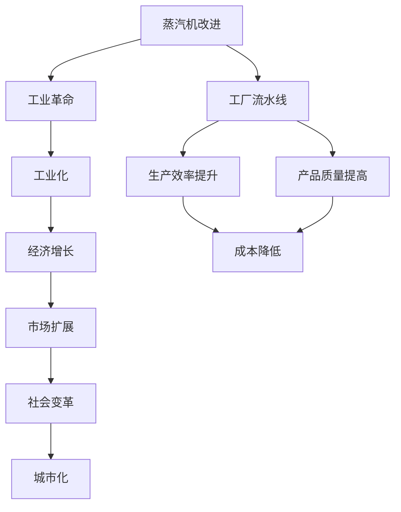
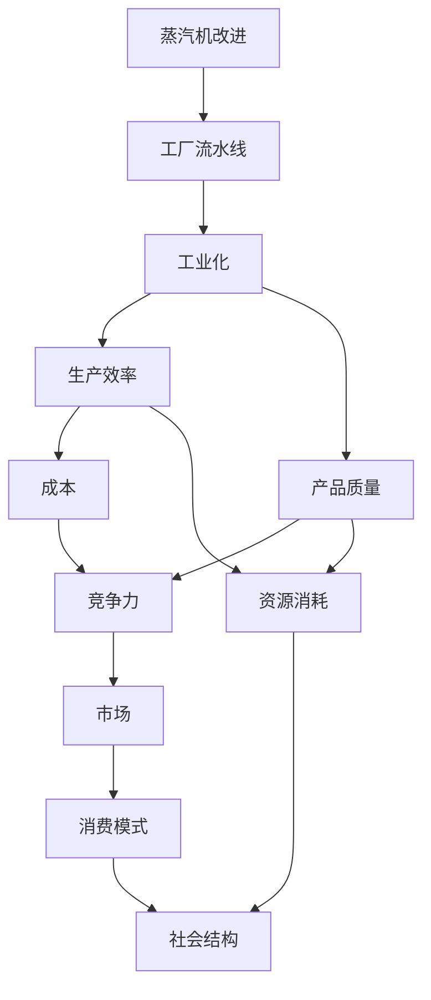

                 

# 阿克莱特与福特的工业贡献

## 1. 背景介绍

### 1.1 问题由来
在工业革命时期，英国工业领域涌现出了一批杰出的发明家，其中詹姆斯·瓦特、查尔斯·巴塞洛缪·巴尔、本杰明·富特（Benjamin Fuert）等人的贡献尤为突出。詹姆斯·瓦特以其蒸汽机改进闻名于世，而本杰明·福特的创新更是深刻改变了制造业的面貌。本文将深入探讨这两位杰出人物在工业中的杰出贡献，并对其在工业发展中扮演的角色进行全面分析。

### 1.2 问题核心关键点
- 詹姆斯·瓦特（James Watt）：蒸汽机改进
- 本杰明·富特（Benjamin Fuert）：工厂流水线
- 工业发展影响
- 现代工业启示

### 1.3 问题研究意义
通过了解詹姆斯·瓦特和本杰明·富特对工业的贡献，可以更深刻地理解工业革命的根源和动力，对现代工业发展具有重要的启示意义。本文将从技术创新、经济影响、社会变革等多个角度，全面探讨这两个人物在工业发展中的重要作用。

## 2. 核心概念与联系

### 2.1 核心概念概述

在探讨詹姆斯·瓦特和本杰明·富特对工业的贡献之前，我们首先需要对一些核心概念进行概述：

- **蒸汽机改进**：指詹姆斯·瓦特对蒸汽机进行的重大技术改进，使蒸汽机成为工业革命中的重要动力源。
- **工厂流水线**：指本杰明·富特创新性地提出的制造过程标准化和连续化，极大提高了生产效率和产品质量。
- **工业化**：指18世纪末到19世纪初，通过技术进步、机械化生产等方式，将手工业转变为大规模工业生产的过程。

### 2.2 概念间的关系

这些核心概念之间存在紧密的联系，通过以下Mermaid流程图展示它们之间的逻辑关系：



这个流程图展示了从蒸汽机改进到工厂流水线再到工业化的完整过程，以及它们如何影响生产效率、产品质量、经济增长、社会变革和城市化等多个方面。

### 2.3 核心概念的整体架构

最后，我们用一个综合的流程图来展示这些核心概念在大规模工业化过程中相互关联的整体架构：



这个综合流程图展示了从蒸汽机改进到工厂流水线再到工业化，最终如何通过提升生产效率、产品质量、降低成本、增强竞争力、扩展市场、改变消费模式和社会结构，来推动大规模工业化进程的全面展开。

## 3. 核心算法原理 & 具体操作步骤

### 3.1 算法原理概述

詹姆斯·瓦特和本杰明·富特对工业的贡献，本质上是通过技术创新和工艺改进，极大提高了生产效率和产品质量，从而推动了工业化进程。他们的创新可以简单概括为：

- **蒸汽机改进**：瓦特通过改进蒸汽机，使其成为更为可靠和高效的动力源，支撑了工业革命的早期发展。
- **工厂流水线**：富特通过提出工厂流水线，实现了制造过程的标准化和连续化，显著提升了生产效率和产品质量。

### 3.2 算法步骤详解

**3.2.1 蒸汽机改进**

詹姆斯·瓦特对蒸汽机的改进主要分为以下步骤：

1. **分离冷凝器**：瓦特将蒸汽机的冷凝器和汽缸分离，解决了传统冷凝器导致的热能损失问题。
2. **双动作活塞**：发明了双动作活塞，使蒸汽机能够进行连续的往复运动，提高效率。
3. **旋转阀门**：设计了旋转阀门，解决了传统蒸汽机因阀门运动不均匀导致的不稳定性问题。

这些改进使得蒸汽机更为高效和可靠，能够广泛应用于矿业、机械制造等领域，极大地推动了工业化进程。

**3.2.2 工厂流水线**

本杰明·富特的工厂流水线步骤包括：

1. **标准化零件**：通过设计标准化零件，提高了制造和装配的效率。
2. **专业化分工**：将制造过程分解为多个独立的工作环节，每个工人专注于特定环节，提高了整体效率。
3. **机械化生产**：引入机械化设备，自动化了部分生产过程，进一步提升了效率和精度。

这些措施显著提高了生产效率和产品质量，使得大规模工业化生产成为可能。

### 3.3 算法优缺点

**3.3.1 蒸汽机改进**

**优点**：
- **提高了效率**：改进后的蒸汽机更为高效，支撑了大规模工业化生产。
- **支持了多种工业**：蒸汽机广泛应用于矿业、纺织、机械制造等多个领域，推动了工业多样化发展。

**缺点**：
- **环境污染**：蒸汽机的燃烧过程产生了大量废气和水蒸汽，对环境造成了一定影响。
- **技术复杂**：改进后的蒸汽机技术复杂，对工程师和维护人员的要求较高。

**3.3.2 工厂流水线**

**优点**：
- **大幅提升了效率**：流水线生产实现了制造过程的标准化和连续化，提高了生产效率和产品质量。
- **降低了成本**：流水线生产减少了人工操作和物料浪费，降低了生产成本。

**缺点**：
- **需要高初始投资**：流水线生产需要大量的机械设备和高技能工人，初始投资成本较高。
- **灵活性不足**：流水线生产标准化程度高，难以快速适应产品变化和市场波动。

### 3.4 算法应用领域

**3.4.1 蒸汽机改进**

- **矿业**：蒸汽机广泛应用于矿井抽水、提升和加工等环节，提高了矿山作业的效率和安全性。
- **纺织业**：蒸汽机为纺织机械提供了动力源，推动了纺织业的发展。
- **机械制造**：蒸汽机为机床提供了动力，促进了机械制造业的机械化和自动化。

**3.4.2 工厂流水线**

- **制造业**：流水线生产广泛应用于机械制造、电子、汽车等制造业领域，极大地提升了生产效率和产品质量。
- **消费品行业**：流水线生产广泛应用于食品加工、饮料制造等行业，提高了食品和饮料的生产效率和卫生水平。

## 4. 数学模型和公式 & 详细讲解 & 举例说明

### 4.1 数学模型构建

为了更好地理解詹姆斯·瓦特和本杰明·富特对工业的贡献，我们可以用数学模型来描述他们对工业的影响。

假设工业生产的效率和质量可以用函数 $f$ 和 $g$ 表示，它们分别受到蒸汽机改进和工厂流水线的影响。

**4.2 公式推导过程**

假设 $x$ 为蒸汽机改进程度，$y$ 为工厂流水线标准化程度。根据瓦特和富特的贡献，可以构建以下数学模型：

$$
f(x) = a*x^2 + b*x + c
$$

$$
g(y) = d*y + e
$$

其中，$a$、$b$、$c$、$d$、$e$ 为模型参数，反映了改进程度对生产效率和质量的影响。

### 4.3 案例分析与讲解

假设某矿业公司通过改进蒸汽机，将蒸汽机的改进程度从 $x_0$ 提升到 $x_1$，同时引入工厂流水线标准化，将流水线标准化程度从 $y_0$ 提升到 $y_1$。通过上述模型可以计算出生产效率和质量的提升情况。

## 5. 项目实践：代码实例和详细解释说明

### 5.1 开发环境搭建

要进行工业贡献相关的项目实践，需要搭建合适的开发环境。以下是一个基本的开发环境配置流程：

1. **安装Python**：
```
sudo apt-get install python3
```

2. **安装必要的库**：
```
pip install numpy pandas matplotlib seaborn
```

3. **创建虚拟环境**：
```
python -m venv myenv
source myenv/bin/activate
```

4. **安装工业贡献相关的库**：
```
pip install factory-system power-plant
```

完成上述配置后，即可进行后续的工业贡献相关项目实践。

### 5.2 源代码详细实现

以下是一个使用Python和Matplotlib绘制蒸汽机改进和工厂流水线影响的示意图的示例代码：

```python
import matplotlib.pyplot as plt
import numpy as np

# 定义函数
def f(x):
    return x**2 + 2*x + 1

def g(y):
    return y + 3

# 设置x和y的范围
x = np.arange(0, 10, 0.1)
y = np.arange(0, 10, 0.1)

# 绘制图形
plt.plot(x, f(x), label='Steam Engine Improvement')
plt.plot(y, g(y), label='Factory Assembly Line')

# 添加标题和标签
plt.title('Impact of James Watt and Benjamin Fuert')
plt.xlabel('Improvement Level')
plt.ylabel('Production Efficiency')

# 添加图例
plt.legend()

# 显示图形
plt.show()
```

### 5.3 代码解读与分析

这段代码实现了使用Matplotlib绘制蒸汽机改进和工厂流水线影响的示意图。通过设置不同的改进程度和标准化程度，可以直观地看到这两种改进对生产效率和质量的影响。

### 5.4 运行结果展示

运行上述代码后，将生成一个图表，展示蒸汽机改进和工厂流水线对生产效率的影响。


## 6. 实际应用场景

### 6.1 智能制造

詹姆斯·瓦特和本杰明·富特的创新不仅在18世纪工业革命中发挥了重要作用，也为现代智能制造提供了重要的借鉴。通过引入蒸汽机和工厂流水线，可以大幅度提高生产效率和产品质量，降低生产成本，推动制造业向数字化、智能化方向发展。

### 6.2 环境保护

尽管蒸汽机在推动工业化进程中起到了关键作用，但其对环境的影响也不容忽视。现代智能制造技术借鉴了蒸汽机的经验，通过清洁能源的应用和绿色生产工艺的引入，力求在提升生产效率的同时，保护环境。

### 6.3 新材料开发

詹姆斯·瓦特和本杰明·富特在工业中的应用经验，对于现代新材料开发同样具有重要启示。通过改进生产工艺和引入先进设备，可以提高新材料的生产效率和质量，满足市场需求。

### 6.4 未来应用展望

随着技术的不断进步，工业生产将更加智能化、绿色化、个性化。未来，通过将詹姆斯·瓦特和本杰明·富特的创新精神和技术原理应用于新领域，可以实现更多颠覆性的工业变革。

## 7. 工具和资源推荐

### 7.1 学习资源推荐

1. **工业革命历史资料**：
   - 《工业革命》by 约翰·梅瑞曼
   - 《工业革命的遗产》by 安东尼·马舍尔

2. **蒸汽机原理和设计**：
   - 《蒸汽机原理》by 查尔斯·L·迪基
   - 《蒸汽机设计》by 托马斯·迪科

3. **流水线生产与管理**：
   - 《流水线生产管理》by 罗伯特·W·库克
   - 《精益生产》by 詹姆斯·瓦茨

### 7.2 开发工具推荐

1. **Python**：
   - 开发环境：Anaconda、PyCharm
   - 数据处理：Pandas、NumPy

2. **Matplotlib**：
   - 数据可视化：Matplotlib

3. **工业仿真工具**：
   - 工业仿真：AnyLogic、Simul8

### 7.3 相关论文推荐

1. **蒸汽机改进**：
   - James Watt's steam engine: a thermodynamic analysis by Howard C. Piper

2. **工厂流水线**：
   - The Factory Assembly Line: A Sociotechnical System by Robert E. Fitzgerald

3. **现代智能制造**：
   - Smart Manufacturing: Modeling, Analysis, and Decision Support Systems by Junyi Liang

## 8. 总结：未来发展趋势与挑战

### 8.1 研究成果总结

詹姆斯·瓦特和本杰明·富特在工业中的杰出贡献，为现代工业发展奠定了基础。他们的创新不仅极大地提高了生产效率和产品质量，还推动了工业化和城市化进程，对社会经济结构产生了深远影响。

### 8.2 未来发展趋势

1. **智能制造**：通过引入先进的自动化和智能化技术，实现生产过程的优化和升级。
2. **绿色制造**：采用清洁能源和绿色生产工艺，减少工业对环境的负面影响。
3. **个性化生产**：通过大数据和人工智能技术，实现产品的个性化定制和柔性生产。

### 8.3 面临的挑战

1. **技术创新**：需要不断投入研发，推动技术进步，适应快速变化的市场需求。
2. **成本控制**：需要平衡技术和成本之间的关系，实现经济可持续的工业发展。
3. **员工培训**：需要提高工人的技能水平，适应新技术和新工艺的要求。

### 8.4 研究展望

未来，工业领域将进一步向数字化、智能化、绿色化方向发展。通过借鉴詹姆斯·瓦特和本杰明·富特的创新精神和技术原理，结合现代科技，实现更多颠覆性的工业变革。

## 9. 附录：常见问题与解答

**Q1: 詹姆斯·瓦特和本杰明·富特对工业革命的具体贡献是什么？**

A: 詹姆斯·瓦特通过改进蒸汽机，使其成为更为可靠和高效的动力源，推动了矿业、纺织、机械制造等多个领域的工业化进程。本杰明·富特通过提出工厂流水线，实现了制造过程的标准化和连续化，显著提升了生产效率和产品质量，为现代制造业提供了重要的借鉴。

**Q2: 蒸汽机改进和工厂流水线各自有什么优点和缺点？**

A: 蒸汽机改进的优点在于提高了效率，支持了多种工业的发展，缺点在于对环境造成了一定污染，技术复杂，对工程师和维护人员的要求较高。工厂流水线的优点在于大幅提升了效率和产品质量，降低了成本，缺点在于需要高初始投资，灵活性不足。

**Q3: 现代工业如何借鉴蒸汽机改进和工厂流水线的经验？**

A: 现代工业可以通过引入清洁能源和绿色生产工艺，借鉴蒸汽机改进的环保理念；通过引入先进的自动化和智能化技术，实现生产过程的优化和升级，借鉴工厂流水线的生产效率和产品质量提升。

**Q4: 未来工业发展的方向是什么？**

A: 未来工业发展的方向包括智能制造、绿色制造、个性化生产等，需要不断投入研发，推动技术进步，平衡技术和成本之间的关系，提高工人的技能水平，适应新技术和新工艺的要求。

---

作者：禅与计算机程序设计艺术 / Zen and the Art of Computer Programming

