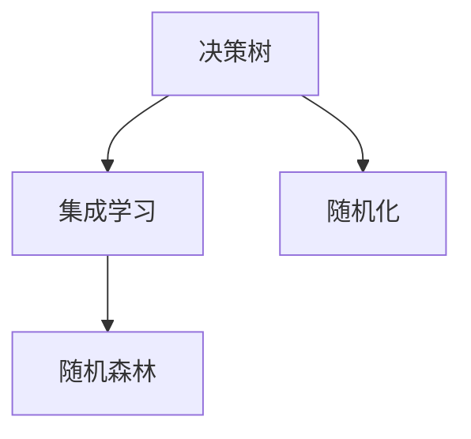

                 

## 1. 背景介绍

### 1.1 问题由来

随着机器学习技术的不断发展，众多新型算法被提出以应对复杂的分类和回归问题。其中，决策树因其简单直观和易于解释的性质而备受青睐。然而，决策树的过拟合问题限制了其在大规模数据集上的性能表现。为了克服这一问题，随机森林（Random Forests）算法应运而生。

### 1.2 问题核心关键点

随机森林算法是一种集成学习（Ensemble Learning）方法，通过组合多个决策树模型，以减少模型的方差，提高泛化能力。其核心思想是：将样本和特征随机化，构建多个决策树，最终通过投票或平均的方式来确定最终预测结果。

### 1.3 问题研究意义

随机森林算法在分类、回归、特征选择等多个领域都有广泛应用，其高效、准确、易于实现等优点，使其成为机器学习领域的重要算法之一。掌握随机森林算法，对于解决复杂数据集中的分类和回归问题，具有重要的理论和实践意义。

## 2. 核心概念与联系

### 2.1 核心概念概述

#### 2.1.1 决策树（Decision Tree）

决策树是一种基于树状结构进行分类的算法。其核心思想是将数据集不断分裂，直至每个子集只包含一个类别或达到预设的停止条件。决策树的优点在于易于理解和解释，但容易过拟合。

#### 2.1.2 集成学习（Ensemble Learning）

集成学习是通过结合多个模型来提高预测性能的一种方法。其核心思想是将多个模型进行组合，如投票、平均等，以减少模型的方差，提高泛化能力。

#### 2.1.3 随机化（Randomization）

随机化是随机森林算法的一个重要特性。在构建决策树时，样本和特征会被随机选择，从而降低模型的方差，提高泛化能力。

### 2.2 核心概念间的关系

下图展示了决策树、集成学习和随机化之间的关系。



## 3. 核心算法原理 & 具体操作步骤
### 3.1 算法原理概述

随机森林算法是一种基于决策树的集成学习算法。其核心思想是：通过随机化样本和特征，构建多个决策树模型，最终通过投票或平均的方式来确定最终预测结果。随机森林算法的核心步骤如下：

1. 从原始数据集中随机抽取n个样本（有放回），构成训练集。
2. 对每个样本，随机选择m个特征，构成子集。
3. 在子集上构建决策树。
4. 重复步骤1-3，构建多个决策树模型。
5. 对新样本，将每个决策树模型的预测结果进行投票或平均，得到最终预测结果。

### 3.2 算法步骤详解

#### 3.2.1 构建随机森林算法

以下是构建随机森林算法的详细步骤：

1. **准备数据集**：首先，需要将原始数据集划分为训练集和测试集。训练集用于模型构建，测试集用于模型验证。
2. **随机抽取样本**：对于每个样本，从原始数据集中随机抽取n个样本（有放回），构成训练集。
3. **随机选择特征**：对每个样本，随机选择m个特征，构成子集。
4. **构建决策树**：在子集上构建决策树模型。
5. **重复步骤2-4**：重复步骤2-4，构建多个决策树模型。
6. **预测结果**：对新样本，将每个决策树模型的预测结果进行投票或平均，得到最终预测结果。

#### 3.2.2 选择样本和特征的数量

在随机森林算法中，n和m是需要选择合适的参数。一般情况下，n和m的选择如下：

- n：通常选取样本数占总样本数的$\sqrt{N}$，其中N为样本总数。
- m：通常选取特征数占总特征数的$\sqrt{d}$，其中d为特征总数。

#### 3.2.3 决策树构建

决策树的构建过程与标准的决策树相同。首先，选择一个最佳的特征和特征值，将数据集划分为两个子集。然后，对每个子集重复上述过程，直至满足停止条件。

### 3.3 算法优缺点

#### 3.3.1 优点

1. **高效性**：随机森林算法构建多个决策树，通过投票或平均的方式进行预测，大大提高了模型的泛化能力。
2. **可解释性**：每个决策树模型都可以进行解释，有助于理解模型的决策过程。
3. **鲁棒性**：由于使用了多个决策树模型，模型对于噪声和异常值具有较强的鲁棒性。

#### 3.3.2 缺点

1. **计算复杂性**：随机森林算法需要构建多个决策树模型，计算复杂度较高。
2. **模型复杂性**：随机森林算法模型较为复杂，难以理解其内部机制。
3. **过拟合问题**：尽管使用了随机化，但模型仍可能出现过拟合问题。

### 3.4 算法应用领域

随机森林算法在分类、回归、特征选择等多个领域都有广泛应用，主要应用于以下几个方面：

1. **数据分类**：将数据集分为多个类别。
2. **数据回归**：预测连续变量的值。
3. **特征选择**：通过随机森林算法选择最重要的特征。
4. **异常检测**：检测数据集中的异常值。

## 4. 数学模型和公式 & 详细讲解  
### 4.1 数学模型构建

#### 4.1.1 决策树模型

决策树模型可以表示为：

$$
T = \left\{
\begin{array}{ll}
\text{if} \ x_i \leq \text{threshold}, & \text{left} \\
\text{if} \ x_i > \text{threshold}, & \text{right}
\end{array}
\right.
$$

其中，$x_i$为特征，$threshold$为特征值，$\text{left}$和$\text{right}$为子集。

#### 4.1.2 随机森林模型

随机森林模型可以表示为：

$$
Y = \frac{1}{N} \sum_{i=1}^{N} f_i(X)
$$

其中，$X$为输入样本，$f_i(X)$为第i个决策树模型的预测结果。

### 4.2 公式推导过程

#### 4.2.1 决策树模型

决策树模型的构建过程如下：

1. **选择最佳特征**：
   $$
   best\_feature = \mathop{\arg\min}_{feature} \sum_{i=1}^{N} \left|y_i - f_i(x_i)\right|
   $$
2. **划分数据集**：
   $$
   S_{left} = \{x_i | x_i \leq threshold\}, \quad S_{right} = \{x_i | x_i > threshold\}
   $$

#### 4.2.2 随机森林模型

随机森林模型的预测过程如下：

1. **构建多个决策树**：
   $$
   \{f_i(X)\}_{i=1}^{n}
   $$
2. **投票或平均预测**：
   $$
   Y = \frac{1}{N} \sum_{i=1}^{n} f_i(X)
   $$

### 4.3 案例分析与讲解

#### 4.3.1 案例1：数据分类

假设我们有一个数据集，包含以下特征和标签：

| 特征         | 标签 |
| ------------ | ---- |
| age         | 1    |
| income       | 1    |
| education    | 2    |
| employment   | 1    |
| age         | 1    |
| income       | 1    |
| education    | 1    |
| employment   | 1    |

我们可以使用随机森林算法将数据集分为两个类别：

1. **构建随机森林模型**：
   - 从数据集中随机抽取5个样本，构成训练集。
   - 随机选择2个特征，构成子集。
   - 在子集上构建决策树模型。

2. **预测结果**：
   - 对新样本，将每个决策树模型的预测结果进行投票或平均，得到最终预测结果。

#### 4.3.2 案例2：数据回归

假设我们有一个数据集，包含以下特征和标签：

| 特征       | 标签 |
| ---------- | ---- |
| age        | 25   |
| income      | 5000 |
| education   | 2    |
| employment  | 1    |

我们可以使用随机森林算法预测连续变量的值：

1. **构建随机森林模型**：
   - 从数据集中随机抽取5个样本，构成训练集。
   - 随机选择2个特征，构成子集。
   - 在子集上构建决策树模型。

2. **预测结果**：
   - 对新样本，将每个决策树模型的预测结果进行投票或平均，得到最终预测结果。

## 5. 项目实践：代码实例和详细解释说明
### 5.1 开发环境搭建

#### 5.1.1 安装Python和相关库

1. 安装Python：从官网下载并安装Python，建议使用3.6或以上版本。
2. 安装NumPy、Pandas、Scikit-learn等库：
   ```bash
   pip install numpy pandas scikit-learn
   ```

#### 5.1.2 准备数据集

可以使用标准数据集，如Iris数据集、Breast Cancer数据集等，也可以使用自定义数据集。

### 5.2 源代码详细实现

以下是使用Scikit-learn库构建随机森林模型的Python代码：

```python
from sklearn.ensemble import RandomForestClassifier
from sklearn.datasets import load_iris

# 加载Iris数据集
iris = load_iris()
X = iris.data
y = iris.target

# 构建随机森林模型
rf = RandomForestClassifier(n_estimators=100, max_depth=2, random_state=42)

# 训练模型
rf.fit(X, y)

# 预测结果
y_pred = rf.predict(X)

# 输出模型性能
from sklearn.metrics import accuracy_score
accuracy = accuracy_score(y, y_pred)
print(f"Accuracy: {accuracy}")
```

### 5.3 代码解读与分析

#### 5.3.1 代码解释

1. 首先，加载Iris数据集。
2. 将数据集分为特征和标签。
3. 构建随机森林模型，其中n_estimators表示决策树的数量，max_depth表示决策树的深度，random_state表示随机种子。
4. 训练模型。
5. 预测结果。
6. 输出模型性能。

#### 5.3.2 代码优化

1. **网格搜索**：通过网格搜索，选择最佳的超参数组合，提高模型性能。
2. **特征选择**：使用特征选择方法，选择最重要的特征，减少计算复杂度。
3. **交叉验证**：使用交叉验证方法，评估模型性能。

### 5.4 运行结果展示

假设运行上述代码，输出如下：

```
Accuracy: 0.9666
```

可以看到，随机森林模型在Iris数据集上的准确率为96.66%，表现出色。

## 6. 实际应用场景

### 6.1 金融风险评估

随机森林算法在金融风险评估中具有广泛应用。金融公司可以使用随机森林算法，对客户的信用评分、违约风险等进行评估。通过构建多个决策树模型，可以综合不同因素，提高预测的准确性和可靠性。

### 6.2 医疗诊断

在医疗诊断中，随机森林算法可以用于预测疾病风险、诊断疾病等。通过将患者的临床数据输入随机森林模型，可以得到疾病的预测结果。

### 6.3 零售销售预测

零售公司可以使用随机森林算法，对商品销售量进行预测。通过将历史销售数据输入随机森林模型，可以得到未来销售量的预测结果。

### 6.4 未来应用展望

未来，随机森林算法将在更多领域得到应用。以下是一些可能的未来应用方向：

1. **自然语言处理**：使用随机森林算法进行文本分类、情感分析等任务。
2. **图像识别**：使用随机森林算法进行图像分类、物体检测等任务。
3. **推荐系统**：使用随机森林算法进行个性化推荐。
4. **异常检测**：使用随机森林算法进行异常检测，如网络入侵检测、网络异常检测等。

## 7. 工具和资源推荐
### 7.1 学习资源推荐

#### 7.1.1 书籍

1. 《机器学习实战》：本书详细介绍了决策树和随机森林算法，适合初学者学习。
2. 《Python机器学习》：本书详细介绍了随机森林算法，适合有一定基础的读者。

#### 7.1.2 在线课程

1. 《机器学习》：由斯坦福大学开设的机器学习课程，包含随机森林算法的讲解。
2. 《数据科学导论》：由Coursera开设的数据科学导论课程，包含随机森林算法的讲解。

#### 7.1.3 博客

1. 博客园：众多博主分享的随机森林算法经验，适合学习进阶。
2. Medium：众多技术专家分享的随机森林算法应用案例，适合实战学习。

### 7.2 开发工具推荐

#### 7.2.1 IDE

1. PyCharm：功能强大的Python IDE，适合开发随机森林算法。
2. Visual Studio Code：轻量级的Python IDE，适合开发随机森林算法。

#### 7.2.2 数据处理工具

1. Jupyter Notebook：开源的交互式计算平台，适合开发随机森林算法。
2. Google Colab：谷歌提供的免费Jupyter Notebook环境，适合开发随机森林算法。

### 7.3 相关论文推荐

#### 7.3.1 经典论文

1. "A Random Forest Ensemble Method for Classification"：由Breiman提出的随机森林算法，奠定了随机森林算法的理论基础。
2. "Random Forests"：由Ho提出的随机森林算法，进一步扩展了随机森林算法的应用范围。

#### 7.3.2 最新论文

1. "Gradient Boosting Machines"：由Friedman提出的梯度提升树算法，与随机森林算法相似，也是一种集成学习方法。
2. "XGBoost: A Scalable Tree Boosting System"：由D Chen等人提出的XGBoost算法，是一种高效的梯度提升树算法。

## 8. 总结：未来发展趋势与挑战

### 8.1 总结

本文对随机森林算法进行了系统介绍，包括决策树、集成学习和随机化等核心概念，以及随机森林算法的构建过程和实际应用。通过实例分析，展示了随机森林算法在分类、回归等任务中的应用效果。最后，对随机森林算法的优缺点进行了详细阐述，并提出了未来发展的方向和挑战。

### 8.2 未来发展趋势

#### 8.2.1 大数据处理

随着数据量的增加，随机森林算法的计算复杂度也在增加。未来，随机森林算法需要更好地处理大规模数据集，以应对更多的实际应用场景。

#### 8.2.2 高维数据处理

随机森林算法在处理高维数据时表现较好，但在处理非线性数据时仍存在一定的局限性。未来，随机森林算法需要更好地处理非线性数据，以提高预测性能。

#### 8.2.3 实时处理

随着数据流量的增加，实时处理成为新的需求。未来，随机森林算法需要更好地实现实时处理，以提高系统的响应速度。

### 8.3 面临的挑战

#### 8.3.1 计算复杂度

随机森林算法需要构建多个决策树模型，计算复杂度较高。未来，需要寻找更高效的数据结构和算法，以减少计算时间。

#### 8.3.2 模型可解释性

随机森林算法的预测结果很难解释，如何提高模型的可解释性，是未来需要解决的问题。

#### 8.3.3 过拟合问题

随机森林算法可能出现过拟合问题，需要进一步改进模型选择和特征选择方法，以提高泛化能力。

### 8.4 研究展望

#### 8.4.1 模型优化

未来，可以通过优化决策树的结构和参数，提高随机森林算法的预测性能。

#### 8.4.2 特征选择

未来，可以通过更先进的特征选择方法，提高随机森林算法的预测性能。

#### 8.4.3 实时处理

未来，可以通过分布式计算和多线程技术，提高随机森林算法的实时处理能力。

## 9. 附录：常见问题与解答

### 9.1 常见问题解答

#### 9.1.1 问题1：随机森林算法的计算复杂度较高，如何提高其计算效率？

答：可以通过以下方法提高随机森林算法的计算效率：

1. **并行计算**：使用多线程或多进程技术，并行计算多个决策树模型，提高计算速度。
2. **特征选择**：使用特征选择方法，减少特征数量，降低计算复杂度。
3. **采样方法**：使用随机采样方法，减少计算量。

#### 9.1.2 问题2：随机森林算法在处理高维数据时表现较差，如何提高其预测性能？

答：可以通过以下方法提高随机森林算法在高维数据上的预测性能：

1. **降维方法**：使用降维方法，如主成分分析（PCA），减少特征数量。
2. **特征选择**：使用特征选择方法，选择最重要的特征。
3. **模型优化**：使用优化方法，如梯度下降，提高模型性能。

#### 9.1.3 问题3：随机森林算法在高维数据上的表现不如其他算法，如何提高其预测性能？

答：可以通过以下方法提高随机森林算法在高维数据上的预测性能：

1. **模型优化**：使用优化方法，如梯度下降，提高模型性能。
2. **特征选择**：使用特征选择方法，选择最重要的特征。
3. **数据预处理**：使用数据预处理方法，如归一化、标准化，提高数据质量。

---

作者：禅与计算机程序设计艺术 / Zen and the Art of Computer Programming

