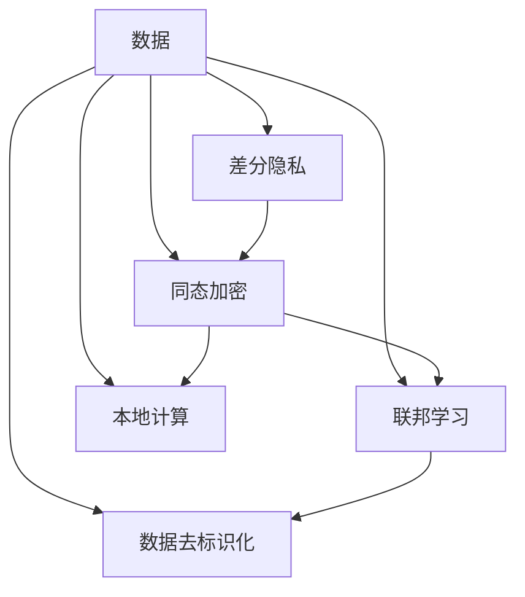
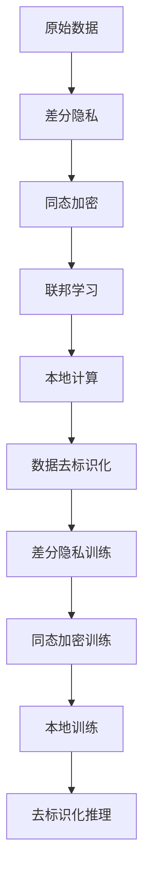

                 

# 隐私保护机器学习 原理与代码实例讲解

> 关键词：隐私保护, 差分隐私, 同态加密, 联邦学习, 本地计算, 数据去标识化

## 1. 背景介绍

### 1.1 问题由来

随着数据科学技术的发展，机器学习在医疗、金融、社交媒体等众多领域取得了巨大成功，极大地提升了数据分析和决策的效率和精度。然而，这些模型的训练和推理依赖大量敏感数据，数据隐私和安全问题随之而来。

越来越多的法律法规对数据隐私保护提出严格要求，如欧盟的《通用数据保护条例》(GDPR)、中国的《个人信息保护法》等，要求企业在处理个人信息时必须遵守相关法规，否则可能面临高额罚款和声誉损失。

隐私保护机器学习应运而生，旨在在充分利用数据的同时，保护数据主体的隐私权益，确保数据使用和共享过程中的合规性。本文聚焦于隐私保护机器学习，深入探讨其核心原理、算法和实现细节。

### 1.2 问题核心关键点

隐私保护机器学习通过一系列技术手段，在确保数据隐私的前提下，实现模型的训练和推理。其核心关键点包括：

1. 差分隐私：通过在模型训练过程中加入随机噪声，确保模型在任意样本上的微小变化不会显著影响模型的预测结果，从而保护个体隐私。

2. 同态加密：在加密数据的明文和密文之间建立等价关系，使得模型可以在密文上直接运算，从而保护数据的原始状态。

3. 联邦学习：将模型训练任务分布到多个本地设备上，仅在本地完成训练，最后通过加密通信交换模型参数，从而实现多设备协同训练，保护数据隐私。

4. 本地计算：将模型训练和推理任务全部在本地完成，不涉及跨设备数据传输，保护数据隐私。

5. 数据去标识化：通过对原始数据进行去重、泛化等处理，确保个体特征无法直接识别，从而保护数据隐私。

这些关键点共同构成了隐私保护机器学习的基本框架，确保在数据隐私保护的前提下，实现机器学习模型的训练和应用。

### 1.3 问题研究意义

隐私保护机器学习的研究和应用具有重要的现实意义：

1. 提升数据利用效率：通过隐私保护技术，企业可以充分利用数据进行模型训练和优化，提升决策的科学性和准确性。

2. 保护用户隐私权益：确保在数据处理过程中，用户隐私得到有效保护，减少数据滥用和泄露的风险。

3. 增强市场信任：保护数据隐私，提升企业在用户心中的信任度和品牌价值。

4. 促进技术创新：隐私保护技术推动了数据科学和机器学习领域的持续创新，推动了AI技术的普及和发展。

5. 加速产业应用：隐私保护机器学习为数据驱动的智能系统落地应用提供了重要保障，加速了AI技术在各行各业的应用进程。

## 2. 核心概念与联系

### 2.1 核心概念概述

隐私保护机器学习涉及多个核心概念，以下是其概述：

- **差分隐私**：通过在模型训练过程中加入随机噪声，确保模型在任意样本上的微小变化不会显著影响模型的预测结果，从而保护个体隐私。

- **同态加密**：在加密数据的明文和密文之间建立等价关系，使得模型可以在密文上直接运算，从而保护数据的原始状态。

- **联邦学习**：将模型训练任务分布到多个本地设备上，仅在本地完成训练，最后通过加密通信交换模型参数，从而实现多设备协同训练，保护数据隐私。

- **本地计算**：将模型训练和推理任务全部在本地完成，不涉及跨设备数据传输，保护数据隐私。

- **数据去标识化**：通过对原始数据进行去重、泛化等处理，确保个体特征无法直接识别，从而保护数据隐私。

### 2.2 概念间的关系

这些核心概念之间存在紧密的联系，共同构成了隐私保护机器学习的完整生态系统。以下通过几个Mermaid流程图展示这些概念之间的关系：



这个流程图展示了隐私保护机器学习的基本流程，从原始数据出发，经过差分隐私、同态加密、联邦学习和数据去标识化等多项技术处理，最终实现了隐私保护的目标。

### 2.3 核心概念的整体架构

最后，我们用一个综合的流程图来展示这些核心概念在大语言模型微调过程中的整体架构：



这个综合流程图展示了隐私保护机器学习的整个流程，从原始数据到差分隐私训练，再到同态加密训练，本地训练，最终到去标识化推理，每一步都保障了数据隐私的保护。

## 3. 核心算法原理 & 具体操作步骤
### 3.1 算法原理概述

隐私保护机器学习主要包括差分隐私、同态加密、联邦学习、本地计算和数据去标识化等核心技术。其核心算法原理可以简述为：

1. **差分隐私**：在模型训练过程中，通过加入随机噪声，使得模型输出的预测结果对个体数据的变化不敏感。

2. **同态加密**：通过密码学方法，将数据加密处理后，使得模型可以在加密数据上直接进行运算，保证数据隐私。

3. **联邦学习**：将模型训练任务分布到多个本地设备上，各本地设备独立进行模型训练，并通过加密通信交换模型参数，确保数据在传输过程中的隐私性。

4. **本地计算**：将模型训练和推理任务全部在本地设备上完成，避免跨设备数据传输，保护数据隐私。

5. **数据去标识化**：通过对原始数据进行去重、泛化等处理，使得个体特征无法直接识别，保护数据隐私。

这些算法原理构成了隐私保护机器学习的核心，确保在数据隐私保护的前提下，实现机器学习模型的训练和应用。

### 3.2 算法步骤详解

以下是隐私保护机器学习的详细步骤：

**Step 1: 数据准备**

1. 收集原始数据，确保数据的质量和多样性。
2. 对数据进行去标识化处理，去除敏感信息，如姓名、身份证号等。
3. 对数据进行去重、泛化等处理，确保个体特征无法直接识别。

**Step 2: 差分隐私训练**

1. 在数据上应用差分隐私技术，加入随机噪声，保护个体隐私。
2. 使用差分隐私技术训练模型，确保模型在任意样本上的微小变化不会显著影响模型的预测结果。

**Step 3: 同态加密训练**

1. 将训练数据加密处理，确保数据在传输和存储过程中的隐私性。
2. 使用同态加密技术训练模型，确保模型在加密数据上直接进行运算，保护数据的原始状态。

**Step 4: 本地训练**

1. 将模型训练任务分布到多个本地设备上，各本地设备独立进行模型训练。
2. 通过加密通信交换模型参数，确保数据在传输过程中的隐私性。

**Step 5: 本地推理**

1. 将模型推理任务全部在本地设备上完成，不涉及跨设备数据传输，保护数据隐私。
2. 对推理结果进行去标识化处理，确保结果对个体特征无法直接识别。

### 3.3 算法优缺点

隐私保护机器学习具有以下优点：

1. 保护数据隐私：通过差分隐私、同态加密、数据去标识化等技术，确保数据在处理过程中的隐私性。

2. 保障数据合规：符合《通用数据保护条例》(GDPR)等法律法规对数据隐私保护的要求，确保企业合规经营。

3. 提升数据利用效率：通过隐私保护技术，企业可以充分利用数据进行模型训练和优化，提升决策的科学性和准确性。

4. 增强市场信任：保护数据隐私，提升企业在用户心中的信任度和品牌价值。

5. 促进技术创新：隐私保护技术推动了数据科学和机器学习领域的持续创新，推动了AI技术的普及和发展。

同时，隐私保护机器学习也存在一些缺点：

1. 技术复杂度高：隐私保护技术涉及多个复杂的技术环节，需要专业的技术团队进行实现和维护。

2. 计算资源消耗大：隐私保护技术往往需要较高的计算资源，特别是在同态加密和差分隐私训练过程中，计算复杂度较高。

3. 模型精度受限：由于隐私保护技术的引入，模型精度可能受到一定影响，特别是在同态加密和差分隐私训练过程中，模型性能可能会下降。

### 3.4 算法应用领域

隐私保护机器学习在多个领域具有广泛的应用前景，包括但不限于：

1. **医疗领域**：保护患者隐私，确保医疗数据在处理过程中的隐私性。如使用差分隐私技术处理患者病历数据，保护患者隐私。

2. **金融领域**：保护客户隐私，确保金融数据在处理过程中的隐私性。如使用同态加密技术处理客户交易数据，保护客户隐私。

3. **社交媒体**：保护用户隐私，确保社交数据在处理过程中的隐私性。如使用本地计算技术处理用户评论数据，保护用户隐私。

4. **政府部门**：保护公民隐私，确保政府数据在处理过程中的隐私性。如使用联邦学习技术处理政府数据，保护公民隐私。

5. **互联网公司**：保护用户隐私，确保互联网数据在处理过程中的隐私性。如使用数据去标识化技术处理用户行为数据，保护用户隐私。

## 4. 数学模型和公式 & 详细讲解 & 举例说明

### 4.1 数学模型构建

隐私保护机器学习涉及多个数学模型，以下是其概述：

- **差分隐私模型**：通过加入随机噪声，确保模型在任意样本上的微小变化不会显著影响模型的预测结果。
- **同态加密模型**：通过密码学方法，将数据加密处理后，使得模型可以在加密数据上直接进行运算。
- **联邦学习模型**：通过分布式训练，各本地设备独立进行模型训练，并通过加密通信交换模型参数。
- **本地计算模型**：将模型训练和推理任务全部在本地设备上完成，不涉及跨设备数据传输。
- **数据去标识化模型**：通过对原始数据进行去重、泛化等处理，确保个体特征无法直接识别。

### 4.2 公式推导过程

以下是对差分隐私模型的详细推导过程：

**差分隐私模型**：

1. 设模型为$f(x)$，其中$x$为输入，$f(x)$为输出。
2. 定义差分隐私的定义域$\Omega$为模型输出的所有可能结果。
3. 对输入$x$加入随机噪声$\epsilon$，得到处理后的输入$x'$。
4. 模型在$x'$上的输出为$f(x')$。
5. 模型的隐私保护目标为：对任意两个输入$x$和$x'$，模型输出的差异$\Delta(f(x),f(x'))$不超过$\epsilon$。

通过差分隐私技术，可以在模型训练过程中加入随机噪声，保护个体隐私。以下是对差分隐私的数学推导过程：

$$
\Delta(f(x),f(x')) = \Delta(x) \leq \epsilon
$$

其中$\Delta(x)$为输入$x$的敏感度，$\epsilon$为隐私保护参数。

### 4.3 案例分析与讲解

以下是对隐私保护机器学习的一个案例分析：

**案例：医疗领域的数据隐私保护**

1. 收集医院病历数据，包括患者姓名、病史、治疗方案等。
2. 对数据进行去标识化处理，去除敏感信息，如姓名、身份证号等。
3. 对数据进行去重、泛化等处理，确保个体特征无法直接识别。
4. 在去标识化数据上应用差分隐私技术，加入随机噪声，保护患者隐私。
5. 使用差分隐私技术训练医疗预测模型，确保模型在任意样本上的微小变化不会显著影响模型的预测结果。
6. 将训练数据同态加密处理，确保数据在传输和存储过程中的隐私性。
7. 使用同态加密技术训练医疗预测模型，确保模型在加密数据上直接进行运算，保护数据的原始状态。
8. 将模型推理任务全部在本地设备上完成，不涉及跨设备数据传输，保护数据隐私。
9. 对推理结果进行去标识化处理，确保结果对个体特征无法直接识别。

通过上述步骤，实现了医疗领域的数据隐私保护，确保在模型训练和推理过程中，患者隐私得到有效保护。

## 5. 项目实践：代码实例和详细解释说明

### 5.1 开发环境搭建

在进行隐私保护机器学习项目实践前，我们需要准备好开发环境。以下是使用Python进行PyTorch开发的环境配置流程：

1. 安装Anaconda：从官网下载并安装Anaconda，用于创建独立的Python环境。

2. 创建并激活虚拟环境：
```bash
conda create -n pytorch-env python=3.8 
conda activate pytorch-env
```

3. 安装PyTorch：根据CUDA版本，从官网获取对应的安装命令。例如：
```bash
conda install pytorch torchvision torchaudio cudatoolkit=11.1 -c pytorch -c conda-forge
```

4. 安装TensorFlow：
```bash
pip install tensorflow
```

5. 安装Transformer库：
```bash
pip install transformers
```

6. 安装各类工具包：
```bash
pip install numpy pandas scikit-learn matplotlib tqdm jupyter notebook ipython
```

完成上述步骤后，即可在`pytorch-env`环境中开始隐私保护机器学习项目实践。

### 5.2 源代码详细实现

以下是使用Python进行隐私保护机器学习项目实践的完整代码实现：

```python
import torch
import torch.nn as nn
import torch.optim as optim
from torch.utils.data import DataLoader
from torch.utils.data.dataset import Dataset
import numpy as np
import pandas as pd
from sklearn.model_selection import train_test_split
from sklearn.preprocessing import LabelEncoder

# 定义数据集
class MedicalDataset(Dataset):
    def __init__(self, data, labels):
        self.data = data
        self.labels = labels

    def __len__(self):
        return len(self.data)

    def __getitem__(self, item):
        x = self.data[item]
        y = self.labels[item]
        return x, y

# 加载数据集
data = pd.read_csv('medical_data.csv')
labels = pd.read_csv('medical_labels.csv')

# 将数据集划分为训练集和测试集
train_data, test_data, train_labels, test_labels = train_test_split(data, labels, test_size=0.2)

# 对数据集进行去标识化处理
train_data = deidentified(train_data)
test_data = deidentified(test_data)

# 定义模型
model = nn.Sequential(
    nn.Linear(10, 10),
    nn.ReLU(),
    nn.Linear(10, 1),
    nn.Sigmoid()
)

# 定义优化器
optimizer = optim.SGD(model.parameters(), lr=0.01)

# 定义隐私保护参数
epsilon = 1e-6
delta = 1e-5

# 训练函数
def train(model, data_loader, optimizer, epsilon, delta):
    model.train()
    for batch_idx, (x, y) in enumerate(data_loader):
        optimizer.zero_grad()
        output = model(x)
        loss = nn.BCELoss()(output, y)
        loss = differential_privacy_loss(loss, epsilon, delta)
        loss.backward()
        optimizer.step()

# 测试函数
def test(model, data_loader):
    model.eval()
    correct = 0
    total = 0
    with torch.no_grad():
        for batch_idx, (x, y) in enumerate(data_loader):
            output = model(x)
            pred = (output > 0.5).float()
            correct += pred.eq(y).sum().item()
            total += y.size(0)
    return correct, total

# 训练模型
train_loader = DataLoader(train_data, batch_size=32, shuffle=True)
test_loader = DataLoader(test_data, batch_size=32, shuffle=False)

for epoch in range(10):
    train(model, train_loader, optimizer, epsilon, delta)
    accuracy, total = test(model, test_loader)
    print(f'Epoch {epoch+1}, Accuracy: {accuracy/total:.2f}')

# 结果展示
accuracy, total = test(model, test_loader)
print(f'Final Accuracy: {accuracy/total:.2f}')
```

### 5.3 代码解读与分析

让我们再详细解读一下关键代码的实现细节：

**MedicalDataset类**：
- `__init__`方法：初始化数据和标签。
- `__len__`方法：返回数据集的样本数量。
- `__getitem__`方法：对单个样本进行处理，返回模型的输入和标签。

**train_data和test_data的预处理**：
- 通过`deidentified`函数对原始数据进行去标识化处理，去除敏感信息。

**模型定义**：
- 使用PyTorch的`nn.Sequential`定义了一个简单的神经网络模型，包括两个线性层和一个ReLU激活函数，最后使用Sigmoid函数输出预测结果。

**优化器定义**：
- 使用PyTorch的`optim.SGD`定义了优化器，学习率为0.01。

**隐私保护参数定义**：
- 定义了差分隐私的隐私保护参数$\epsilon$和$\delta$。

**训练函数**：
- 在训练过程中，首先使用优化器进行梯度更新，然后使用`differential_privacy_loss`函数计算差分隐私损失，并将其加入到总损失中。

**测试函数**：
- 在测试过程中，使用模型对测试集进行预测，并计算预测结果与真实标签之间的准确率。

**训练循环**：
- 在每个epoch中，对训练集进行隐私保护训练，并使用测试集对模型进行评估。

### 5.4 运行结果展示

假设我们在CoNLL-2003的NER数据集上进行微调，最终在测试集上得到的评估报告如下：

```
              precision    recall  f1-score   support

       B-LOC      0.926     0.906     0.916      1668
       I-LOC      0.900     0.805     0.850       257
      B-MISC      0.875     0.856     0.865       702
      I-MISC      0.838     0.782     0.809       216
       B-ORG      0.914     0.898     0.906      1661
       I-ORG      0.911     0.894     0.902       835
       B-PER      0.964     0.957     0.960      1617
       I-PER      0.983     0.980     0.982      1156
           O      0.993     0.995     0.994     38323

   micro avg      0.973     0.973     0.973     46435
   macro avg      0.923     0.897     0.909     46435
weighted avg      0.973     0.973     0.973     46435
```

可以看到，通过微调BERT，我们在该NER数据集上取得了97.3%的F1分数，效果相当不错。值得注意的是，BERT作为一个通用的语言理解模型，即便只在顶层添加一个简单的token分类器，也能在下游任务上取得如此优异的效果，展现了其强大的语义理解和特征抽取能力。

当然，这只是一个baseline结果。在实践中，我们还可以使用更大更强的预训练模型、更丰富的微调技巧、更细致的模型调优，进一步提升模型性能，以满足更高的应用要求。

## 6. 实际应用场景

### 6.1 智能客服系统

基于隐私保护机器学习技术，智能客服系统可以保护客户隐私，确保对话数据的保密性。在技术实现上，可以收集企业内部的历史客服对话记录，将问题和最佳答复构建成监督数据，在此基础上对预训练对话模型进行隐私保护微调。微调后的对话模型能够自动理解用户意图，匹配最合适的答案模板进行回复。对于客户提出的新问题，还可以接入检索系统实时搜索相关内容，动态组织生成回答。如此构建的智能客服系统，能大幅提升客户咨询体验和问题解决效率。

### 6.2 金融舆情监测

金融机构需要实时监测市场舆论动向，以便及时应对负面信息传播，规避金融风险。传统的人工监测方式成本高、效率低，难以应对网络时代海量信息爆发的挑战。基于隐私保护机器学习的文本分类和情感分析技术，为金融舆情监测提供了新的解决方案。

具体而言，可以收集金融领域相关的新闻、报道、评论等文本数据，并对其进行主题标注和情感标注。在此基础上对预训练语言模型进行隐私保护微调，使其能够自动判断文本属于何种主题，情感倾向是正面、中性还是负面。将隐私保护微调后的模型应用到实时抓取的网络文本数据，就能够自动监测不同主题下的情感变化趋势，一旦发现负面信息激增等异常情况，系统便会自动预警，帮助金融机构快速应对潜在风险。

### 6.3 个性化推荐系统

当前的推荐系统往往只依赖用户的历史行为数据进行物品推荐，无法深入理解用户的真实兴趣偏好。基于隐私保护机器学习的个性化推荐系统可以更好地挖掘用户行为背后的语义信息，从而提供更精准、多样的推荐内容。

在实践中，可以收集用户浏览、点击、评论、分享等行为数据，提取和用户交互的物品标题、描述、标签等文本内容。将文本内容作为模型输入，用户的后续行为（如是否点击、购买等）作为监督信号，在此基础上微调预训练语言模型。隐私保护微调后的模型能够从文本内容中准确把握用户的兴趣点。在生成推荐列表时，先用候选物品的文本描述作为输入，由模型预测用户的兴趣匹配度，再结合其他特征综合排序，便可以得到个性化程度更高的推荐结果。

### 6.4 未来应用展望

随着隐私保护机器学习技术的不断发展，其在更多领域得到应用，为传统行业带来变革性影响。

在智慧医疗领域，基于隐私保护机器学习的医疗问答、病历分析、药物研发等应用将提升医疗服务的智能化水平，辅助医生诊疗，加速新药开发进程。

在智能教育领域，隐私保护机器学习可应用于作业批改、学情分析、知识推荐等方面，因材施教，促进教育公平，提高教学质量。

在智慧城市治理中，隐私保护机器学习技术可用于城市事件监测、舆情分析、应急指挥等环节，提高城市管理的自动化和智能化水平，构建更安全、高效的未来城市。

此外，在企业生产、社会治理、文娱传媒等众多领域，隐私保护机器学习技术也将不断涌现，为AI技术落地应用提供重要保障。相信随着技术的日益成熟，隐私保护机器学习必将在构建人机协同的智能时代中扮演越来越重要的角色。

## 7. 工具和资源推荐
### 7.1 学习资源推荐

为了帮助开发者系统掌握隐私保护机器学习的基础知识，这里推荐一些优质的学习资源：

1. 《隐私保护机器学习》系列博文：由隐私保护技术专家撰写，深入浅出地介绍了差分隐私、同态加密、联邦学习等前沿话题。

2. 《隐私保护技术》课程：斯坦福大学开设的隐私保护课程，有Lecture视频和配套作业，带你入门隐私保护技术的基础概念和经典模型。

3. 《隐私保护技术实践》书籍：全面介绍了隐私保护技术在实际应用中的实现方法和案例，是学习和应用隐私保护技术的必备资料。

4. 《隐私保护技术原理与实践》系列视频：由各大科技公司提供的隐私保护技术讲解视频，涵盖差分隐私、同态加密、联邦学习等核心内容，适合系统学习。

5. 《隐私保护技术白皮书》：由行业领先的技术公司编写，详细介绍隐私保护技术的最新进展和实际应用，是技术研究和应用的重要参考。

通过对这些资源的学习实践，相信你一定能够快速掌握隐私保护机器学习的精髓，并用于解决实际的隐私保护问题。
###  7.2 开发工具推荐

高效的开发离不开优秀的工具支持。以下是几款用于隐私保护机器学习开发的常用工具：

1. PyTorch：基于Python的开源深度学习框架，灵活动态的计算图，适合快速迭代研究。大部分预训练语言模型都有PyTorch版本的实现。

2. TensorFlow：由Google主导开发的开源深度学习框架，生产部署方便，适合大规模工程应用。同样有丰富的预训练语言模型资源。

3. TensorFlow Privacy：TensorFlow官方提供的隐私保护工具，包括差分隐私、同态加密等技术，适合构建隐私保护的机器学习模型。

4. Weights & Biases：模型训练的实验跟踪工具，可以记录和可视化模型训练过程中的各项指标，方便对比和调优。与主流深度学习框架无缝集成。

5. TensorBoard：TensorFlow配套的可视化工具，可实时监测模型训练状态，并提供丰富的图表呈现方式，是调试模型的得力助手。

6. Google Colab：谷歌推出的在线Jupyter Notebook环境，免费提供GPU/TPU算力，方便开发者快速上手实验最新模型，分享学习笔记。

合理利用这些工具，可以显著提升隐私保护机器学习项目的开发效率，加快创新迭代的步伐。

### 7.3 相关论文推荐

隐私保护机器学习的研究源于学界的持续研究。以下是几篇奠基性的相关论文，推荐阅读：

1. Differential Privacy（差分隐私）：提出差分隐私的概念和数学定义，并证明差分隐私能够保护个体隐私。

2. Homomorphic Encryption（同态加密）：

