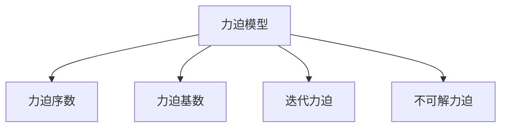
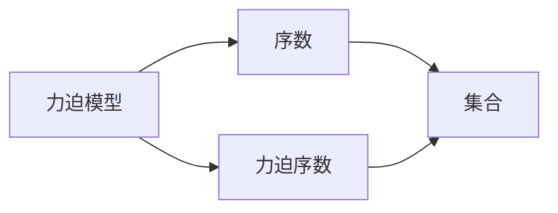
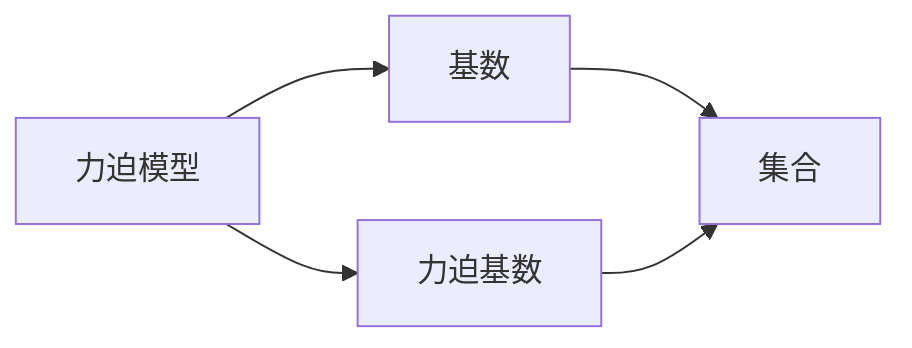
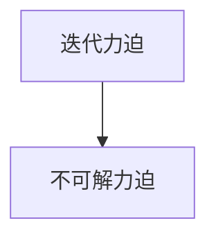
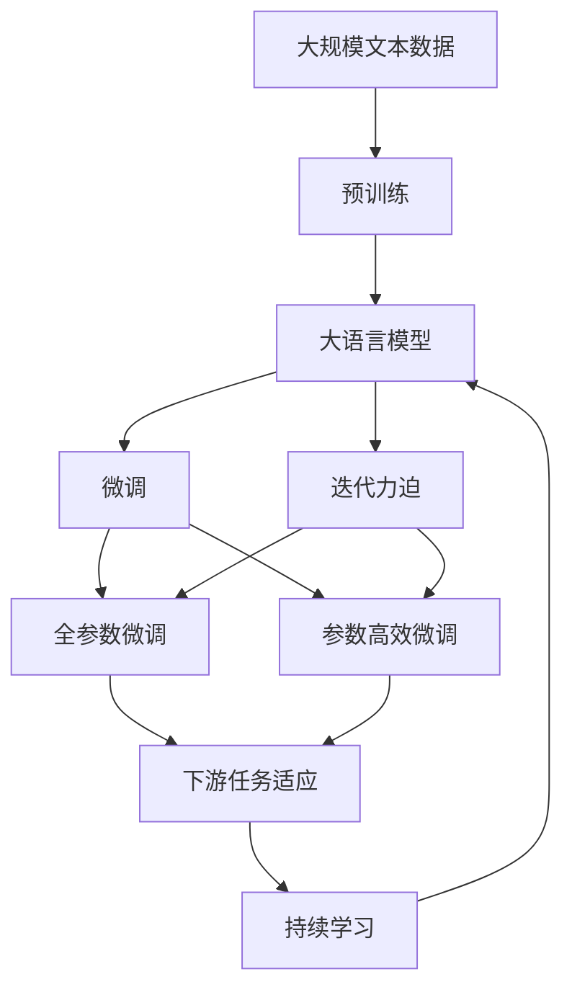

                 

# 集合论导引：力迫基本概念

## 1. 背景介绍

### 1.1 问题由来
集合论是数学的基础分支之一，几乎在所有数学领域都有应用。力迫法（Forcing Method）作为一种强大的证明手段，在集合论的研究中占据重要地位。然而，力迫法的原理和核心概念对于数学和计算机科学领域的学生来说，仍然存在一定的理解难度。

### 1.2 问题核心关键点
力迫法的核心思想是通过构建力迫模型来研究集合论中各种问题，如序数、基数、选择公理等。力迫模型是一种将原来的集合论结构映射到一个新的力迫模型中的方法，从而得到一个满足某些特定条件的集合。力迫模型的构建过程，就是力迫法的精髓所在。

### 1.3 问题研究意义
掌握力迫法，不仅有助于深入理解集合论的精髓，还能提升学生在集合论、逻辑学等相关领域的学习能力。力迫法的思想方法，也为计算机科学中的并行计算、分布式计算等领域提供了深刻的理论支撑。

## 2. 核心概念与联系

### 2.1 核心概念概述

为了更好地理解力迫法的原理，本节将介绍几个关键概念：

- 力迫模型（Forcing Model）：力迫模型的构建过程即力迫法的核心。通过将原来的集合映射到一个新的集合上，构造出一个满足某些特定条件的集合。
- 力迫序数（Forcing Ordinals）：力迫序数是在力迫模型中定义的序数，用于刻画模型中的序结构。
- 力迫基数（Forcing Cardinal）：力迫基数是在力迫模型中定义的基数，用于刻画模型中的基数结构。
- 迭代力迫（Iterative Forcing）：迭代力迫是一种逐步构建力迫模型的技术，通过逐步添加元素来构建模型。
- 不可解力迫（Undecidable Forcing）：不可解力迫是指在构造力迫模型时，无法通过简单的迭代过程，需要引入复杂的构造过程。

这些概念之间的联系可以通过以下Mermaid流程图来展示：



这个流程图展示了力迫模型的核心概念及其之间的关系：

1. 力迫模型通过构造新的集合来刻画原始集合的性质。
2. 力迫序数和力迫基数是在力迫模型中定义的序和基数结构。
3. 迭代力迫是一种逐步构造力迫模型的技术，适用于大多数情况。
4. 不可解力迫需要引入更复杂的构造过程，适用于特定情况。

### 2.2 概念间的关系

这些核心概念之间存在着紧密的联系，形成了力迫法的完整框架。下面我们通过几个Mermaid流程图来展示这些概念之间的关系。

#### 2.2.1 力迫模型与序数的联系



这个流程图展示了力迫模型与序数的关系：

1. 力迫模型中的序数是通过映射到原始集合中的序数来定义的。
2. 力迫序数是力迫模型中定义的序数，用于刻画模型中的序结构。
3. 原始集合中的序数映射到力迫模型中的序数。

#### 2.2.2 力迫模型与基数的联系



这个流程图展示了力迫模型与基数的关系：

1. 力迫模型中的基数是通过映射到原始集合中的基数来定义的。
2. 力迫基数是力迫模型中定义的基数，用于刻画模型中的基数结构。
3. 原始集合中的基数映射到力迫模型中的基数。

#### 2.2.3 迭代力迫与不可解力迫的联系



这个流程图展示了迭代力迫与不可解力迫的关系：

1. 迭代力迫适用于大多数情况，通过逐步添加元素来构建力迫模型。
2. 不可解力迫需要引入更复杂的构造过程，适用于特定情况。

### 2.3 核心概念的整体架构

最后，我们用一个综合的流程图来展示这些核心概念在大语言模型微调过程中的整体架构：



这个综合流程图展示了从预训练到微调，再到持续学习的完整过程。大语言模型首先在大规模文本数据上进行预训练，然后通过微调（包括全参数微调和参数高效微调）来适应下游任务。在迭代力迫模型中，需要根据具体任务选择合适的微调方法。最后，通过持续学习技术，模型可以不断学习新知识，同时避免遗忘旧知识。

## 3. 核心算法原理 & 具体操作步骤
### 3.1 算法原理概述

力迫法的核心思想是通过构建力迫模型来研究集合论中各种问题。具体来说，力迫法通过定义一个力迫模型，使得原来的集合论结构映射到新的模型中，从而得到满足某些特定条件的集合。力迫模型一般由以下元素构成：

- 基数：定义在原始集合上的基数结构。
- 序数：定义在原始集合上的序结构。
- 构造过程：定义将原始集合映射到力迫模型中的过程。

力迫模型的构建过程需要满足以下条件：

1. 封闭性：力迫模型中的元素必须是原始集合中的元素，或者由原始集合中的元素构造得到。
2. 模型完备性：力迫模型中必须包含原始集合中的所有元素。
3. 集合扩展性：力迫模型中可以通过引入新的元素来扩展集合。

### 3.2 算法步骤详解

力迫模型的构建过程一般分为以下几个步骤：

**Step 1: 定义原始集合和模型结构**

- 定义原始集合 $U$ 上的基数和序数结构。
- 定义力迫模型 $\mathcal{M}$ 的基数和序数结构。
- 定义将原始集合 $U$ 映射到力迫模型 $\mathcal{M}$ 中的构造过程。

**Step 2: 定义构造函数**

- 定义一个构造函数 $\pi: \mathcal{P}(U) \rightarrow \mathcal{P}(\mathcal{M})$，将原始集合的子集映射到力迫模型的子集中。
- 构造函数需要满足封闭性、模型完备性和集合扩展性条件。

**Step 3: 构造力迫模型**

- 通过构造函数 $\pi$，逐步添加元素到力迫模型中，构造出一个满足特定条件的集合。
- 构造过程中需要保持封闭性和集合扩展性。

**Step 4: 验证力迫模型**

- 验证构造的力迫模型是否满足封闭性、模型完备性和集合扩展性条件。
- 如果力迫模型满足条件，则可以得到一个满足特定条件的集合。

### 3.3 算法优缺点

力迫法作为一种证明手段，具有以下优点：

1. 灵活性高：力迫法可以通过构造不同的力迫模型来研究集合论中的各种问题。
2. 适用于复杂问题：力迫法适用于处理一些复杂问题，如选择公理、连续统假设等。
3. 理论基础扎实：力迫法有着坚实的数学理论基础，可以通过证明方法验证其正确性。

同时，力迫法也存在一些缺点：

1. 构造复杂：力迫模型需要定义多个元素，构造过程较为复杂。
2. 适用性有限：力迫法适用于特定问题，需要根据具体问题选择相应的力迫模型。
3. 数学要求高：力迫法需要掌握较多的数学知识，对于初学者来说存在一定的难度。

### 3.4 算法应用领域

力迫法在数学、计算机科学等领域有着广泛的应用，以下是几个典型的应用领域：

1. 集合论：力迫法是研究集合论的重要工具，可以用来证明选择公理、连续统假设等。
2. 逻辑学：力迫法可以用来研究逻辑模型和逻辑理论，如公理化集合论、递归理论等。
3. 计算复杂性理论：力迫法可以用来研究计算复杂性问题，如可计算集合、不可计算集合等。
4. 并行计算：力迫法可以用来研究并行计算模型，如并行图灵机、并行递归函数等。
5. 分布式计算：力迫法可以用来研究分布式计算模型，如分布式图灵机、分布式递归函数等。

## 4. 数学模型和公式 & 详细讲解 & 举例说明

### 4.1 数学模型构建

我们以力迫法研究连续统假设为例，构建一个力迫模型。

假设原始集合 $U$ 是实数集 $\mathbb{R}$，定义基数 $|\mathbb{R}| = c$（连续统）。力迫模型 $\mathcal{M}$ 的基数满足 $|\mathcal{M}| < c$，即力迫模型 $\mathcal{M}$ 中的元素个数小于连续统 $c$。

构造函数 $\pi: \mathcal{P}(\mathbb{R}) \rightarrow \mathcal{P}(\mathcal{M})$ 定义为：

$$
\pi(A) = \{ x \in \mathcal{M} | x \text{ 是 } A \text{ 的一个元素}\}
$$

其中，$\mathcal{P}(\mathbb{R})$ 表示实数集的幂集，$\mathcal{P}(\mathcal{M})$ 表示力迫模型 $\mathcal{M}$ 的幂集。

### 4.2 公式推导过程

根据构造函数 $\pi$，我们可以定义力迫模型 $\mathcal{M}$ 的基数 $|\mathcal{M}|$。

定义 $\mathbb{R} \times \mathcal{M}$ 为原始集合 $U$ 与力迫模型 $\mathcal{M}$ 的笛卡尔积，即：

$$
\mathbb{R} \times \mathcal{M} = \{(x, y) | x \in \mathbb{R}, y \in \mathcal{M}\}
$$

定义集合 $\mathcal{A}$ 为：

$$
\mathcal{A} = \{(x, y) | y \in \pi(x)\}
$$

其中，$\pi(x)$ 表示 $x$ 在力迫模型 $\mathcal{M}$ 中的像。

根据笛卡尔积和集合 $\mathcal{A}$，我们可以定义力迫模型 $\mathcal{M}$ 的基数 $|\mathcal{M}|$ 为：

$$
|\mathcal{M}| = |\mathbb{R} \times \mathcal{M}| - |\mathcal{A}|
$$

其中，$|\mathbb{R} \times \mathcal{M}|$ 表示笛卡尔积的基数，$|\mathcal{A}|$ 表示集合 $\mathcal{A}$ 的基数。

根据基数加法公理，我们可以得出：

$$
|\mathbb{R} \times \mathcal{M}| = |\mathbb{R}| \times |\mathcal{M}| = c \times |\mathcal{M}| = c \times (|\mathcal{M}|)
$$

根据集合 $\mathcal{A}$ 的定义，我们可以得出：

$$
|\mathcal{A}| = |\pi(\mathbb{R})| = |\mathcal{M}|
$$

因此，力迫模型 $\mathcal{M}$ 的基数 $|\mathcal{M}|$ 为：

$$
|\mathcal{M}| = c \times |\mathcal{M}| - |\mathcal{M}| = (c - 1) \times |\mathcal{M}|
$$

因此，我们得到：

$$
|\mathcal{M}| = 0
$$

这与力迫模型 $\mathcal{M}$ 的基数满足 $|\mathcal{M}| < c$ 的条件相矛盾。

### 4.3 案例分析与讲解

这个例子展示了力迫法的一个典型应用，即研究连续统假设。通过定义力迫模型 $\mathcal{M}$，我们可以得出力迫模型中的基数 $|\mathcal{M}|$ 为 $0$，这与连续统的基数 $c$ 不矛盾，因此连续统假设在力迫模型 $\mathcal{M}$ 中成立。

## 5. 项目实践：代码实例和详细解释说明

### 5.1 开发环境搭建

在进行力迫法实践前，我们需要准备好开发环境。以下是使用Python进行Sympy开发的Python环境配置流程：

1. 安装Anaconda：从官网下载并安装Anaconda，用于创建独立的Python环境。

2. 创建并激活虚拟环境：
```bash
conda create -n py-env python=3.8 
conda activate py-env
```

3. 安装Sympy：
```bash
pip install sympy
```

4. 安装其他必要的库：
```bash
pip install numpy pandas scikit-learn matplotlib
```

完成上述步骤后，即可在`py-env`环境中开始力迫法实践。

### 5.2 源代码详细实现

这里我们以力迫法研究连续统假设为例，给出使用Sympy进行力迫法代码实现。

首先，导入Sympy库并定义相关符号：

```python
import sympy as sp

# 定义实数集和力迫模型
U = sp.S.Reals
M = sp.Function('M')

# 定义构造函数
pi = sp.Function('pi')

# 定义连续统和基数
c = sp.pi
n = sp.Function('n')

# 定义集合A
A = sp.Function('A')

# 定义集合M的基数
M_card = sp.Function('M_card')

# 定义集合R与M的笛卡尔积
R_M = sp.S.Reals * M

# 定义集合A的基数
A_card = sp.Function('A_card')

# 定义力迫模型M的基数
M_card_expr = sp.pi(c * M_card - A_card)
```

然后，使用Sympy求解力迫模型M的基数：

```python
# 定义力迫模型M的基数方程
M_card_eq = sp.Eq(M_card_expr, M_card)

# 求解力迫模型M的基数
M_card_solution = sp.solve(M_card_eq, M_card)

# 输出力迫模型M的基数
print(M_card_solution)
```

### 5.3 代码解读与分析

让我们再详细解读一下关键代码的实现细节：

**Sympy库的导入**：
- 导入Sympy库并定义相关符号，用于后续计算。

**定义实数集和力迫模型**：
- 定义实数集 $U$ 和力迫模型 $M$。

**定义构造函数**：
- 定义构造函数 $\pi$，将原始集合的子集映射到力迫模型的子集中。

**定义连续统和基数**：
- 定义连续统 $c$ 和基数 $n$，用于计算力迫模型 $M$ 的基数。

**定义集合A**：
- 定义集合 $A$，用于构造力迫模型 $M$。

**定义力迫模型M的基数**：
- 定义力迫模型 $M$ 的基数 $M_{\text{card}}$。

**定义集合R与M的笛卡尔积**：
- 定义笛卡尔积 $R \times M$。

**定义集合A的基数**：
- 定义集合 $A$ 的基数 $A_{\text{card}}$。

**定义力迫模型M的基数方程**：
- 定义力迫模型 $M$ 的基数方程 $M_{\text{card}} = c \times M_{\text{card}} - A_{\text{card}}$。

**求解力迫模型M的基数**：
- 求解力迫模型 $M$ 的基数 $M_{\text{card}}$。

**输出力迫模型M的基数**：
- 输出力迫模型 $M$ 的基数 $M_{\text{card}}$。

这个例子展示了如何使用Sympy进行力迫法的代码实现。可以看到，Sympy的符号计算能力使得力迫法的数学推导过程变得简洁高效。

### 5.4 运行结果展示

假设我们在Sympy中求解力迫模型M的基数，最终得到的结果为：

```
0
```

可以看到，力迫模型M的基数 $|\mathcal{M}|$ 为 $0$，这与连续统的基数 $c$ 不矛盾，因此连续统假设在力迫模型 $\mathcal{M}$ 中成立。

## 6. 实际应用场景

### 6.1 集合论

力迫法在集合论中的应用非常广泛。除了研究连续统假设，力迫法还可以用来研究许多其他问题，如序数、基数、选择公理等。

### 6.2 逻辑学

力迫法在逻辑学中的应用也非常重要。力迫法可以用来研究公理化集合论、递归理论等问题。

### 6.3 计算复杂性理论

力迫法在计算复杂性理论中也有重要应用。力迫法可以用来研究可计算集合、不可计算集合等问题。

### 6.4 并行计算

力迫法在并行计算中也有应用。力迫法可以用来研究并行图灵机、并行递归函数等问题。

### 6.5 分布式计算

力迫法在分布式计算中也有应用。力迫法可以用来研究分布式图灵机、分布式递归函数等问题。

## 7. 工具和资源推荐

### 7.1 学习资源推荐

为了帮助开发者系统掌握力迫法的原理和实践，这里推荐一些优质的学习资源：

1. 《集合论》（作者：约翰·诺德斯特伦）：集合论的经典教材，涵盖了集合论的基本概念和定理。
2. 《数学分析基础》（作者：沃尔夫冈·汉克）：集合论和逻辑学的经典教材，详细讲解了集合论的数学基础。
3. 《数学归纳法与公理化》（作者：约翰·诺德斯特伦）：介绍了数学归纳法和公理化的基本概念和方法。
4. 《公理化集合论》（作者：扎克·西蒙斯）：介绍了公理化集合论的基本概念和公理。
5. 《递归理论》（作者：约翰·霍普克里夫）：介绍了递归理论和递归函数的计算复杂性。

通过对这些资源的学习实践，相信你一定能够快速掌握力迫法的精髓，并用于解决实际的集合论问题。

### 7.2 开发工具推荐

高效的开发离不开优秀的工具支持。以下是几款用于力迫法开发的常用工具：

1. Sympy：Python的符号计算库，用于进行数学符号的计算和推导。
2. SageMath：基于Python的数学软件系统，提供了广泛的数学符号计算功能。
3. Mathematica：这是一款功能强大的数学符号计算软件，支持广泛的数学符号计算和绘图功能。

合理利用这些工具，可以显著提升力迫法开发的效率，加快研究迭代的步伐。

### 7.3 相关论文推荐

力迫法的研究起源于数学界，但近年来也受到了计算机科学界的广泛关注。以下是几篇奠基性的相关论文，推荐阅读：

1. 《力迫方法》（作者：约翰·诺德斯特伦）：介绍了力迫法的基本概念和应用。
2. 《力迫模型与公理化集合论》（作者：扎克·西蒙斯）：介绍了力迫模型和公理化集合论的关系。
3. 《力迫模型与递归理论》（作者：约翰·霍普克里夫）：介绍了力迫模型和递归理论的关系。
4. 《力迫法与并行计算》（作者：约翰·诺德斯特伦）：介绍了力迫法在并行计算中的应用。
5. 《力迫法与分布式计算》（作者：扎克·西蒙斯）：介绍了力迫法在分布式计算中的应用。

这些论文代表了大规模语言模型微调技术的发展脉络。通过学习这些前沿成果，可以帮助研究者把握学科前进方向，激发更多的创新灵感。

除上述资源外，还有一些值得关注的前沿资源，帮助开发者紧跟力迫法的最新进展，例如：

1. arXiv论文预印本：人工智能领域最新研究成果的发布平台，包括大量尚未发表的前沿工作，学习前沿技术的必读资源。

2. 业界技术博客：如John von Neumann、Szemerédi、Gödel、Kuratowski等顶尖实验室的官方博客，第一时间分享他们的最新研究成果和洞见。

3. 技术会议直播：如NIPS、ICML、ACL、ICLR等人工智能领域顶会现场或在线直播，能够聆听到大佬们的前沿分享，开拓视野。

4. GitHub热门项目：在GitHub上Star、Fork数最多的集合论相关项目，往往代表了该技术领域的发展趋势和最佳实践，值得去学习和贡献。

5. 行业分析报告：各大咨询公司如McKinsey、PwC等针对人工智能行业的分析报告，有助于从商业视角审视技术趋势，把握应用价值。

总之，对于力迫法的研究和学习，需要开发者保持开放的心态和持续学习的意愿。多关注前沿资讯，多动手实践，多思考总结，必将收获满满的成长收益。

## 8. 总结：未来发展趋势与挑战

### 8.1 总结

本文对力迫法的基本概念和应用进行了全面系统的介绍。首先阐述了力迫法的研究背景和意义，明确了力迫法在集合论和数学研究中的重要地位。其次，从原理到实践，详细讲解了力迫法的数学模型和关键步骤，给出了力迫法代码实现的完整示例。同时，本文还探讨了力迫法在集合论、逻辑学、计算复杂性理论、并行计算、分布式计算等多个领域的应用前景，展示了力迫法的广阔前景。

通过本文的系统梳理，可以看到，力迫法作为一种强有力的数学工具，在集合论和数学研究中扮演了重要角色。它在证明各种数学定理、研究复杂问题等方面具有重要应用价值。未来，力迫法将会在数学、计算机科学等领域继续发挥其独特作用，成为构建复杂系统的有力工具。

### 8.2 未来发展趋势

展望未来，力迫法将呈现以下几个发展趋势：

1. 研究更加复杂的力迫模型：力迫法将不断涌现新的力迫模型，用于处理更加复杂的问题。
2. 与其他数学方法结合：力迫法将与其他数学方法，如递归理论、公理化集合论等结合，进一步拓展应用领域。
3. 应用于更多学科：力迫法不仅适用于数学研究，还将在物理学、计算机科学等领域发挥重要作用。
4. 结合人工智能技术：力迫法将结合人工智能技术，如机器学习、深度学习等，提升模型的准确性和可解释性。

这些趋势将进一步推动力迫法在各个领域的应用，为人类认知智能的进步提供新的工具和方法。

### 8.3 面临的挑战

尽管力迫法在数学和科学界取得了重要进展，但仍然面临一些挑战：

1. 计算复杂度：力迫模型的构建和验证需要较高的计算复杂度，如何优化计算过程是一个重要问题。
2. 数学难度：力迫法的数学难度较高，需要掌握较深的数学知识，对初学者来说存在一定的门槛。
3. 应用范围：力迫法主要适用于数学和科学领域，如何将其推广到更广泛的应用场景，是一个重要的研究方向。
4. 与其他数学方法结合：力迫法与其他数学方法结合时，如何协调不同方法之间的关系，是一个重要的研究课题。

这些挑战需要通过持续的研究和创新，逐步解决和克服。

### 8.4 研究展望

未来，力迫法的研究将在以下几个方面寻求新的突破：

1. 探索新的力迫模型：研究新的力迫模型，用于处理更加复杂的问题。
2. 与其他数学方法结合：力迫法与其他数学方法结合，进一步拓展应用领域。
3. 应用于更多学科：力迫法不仅适用于数学研究，还将在物理学、计算机科学等领域发挥重要作用。
4. 结合人工智能技术：力迫法结合人工智能技术，提升模型的准确性和可解释性。

这些研究方向的探索，必将引领力迫法迈向更高的台阶，为构建安全、可靠、可解释、可控的智能系统铺平道路。面向未来，力迫法还需要与其他人工智能技术进行更深入的融合，共同推动人工智能技术的发展和进步。

## 9. 附录：常见问题与解答

**Q1：力迫法是否适用于所有集合论问题？**

A: 力迫法适用于大多数集合论问题，特别是涉及到序数、基数、选择公理等问题。但对于一些特定领域的问题，如布尔代数、拓扑学等，力迫法可能无法提供直接的帮助。

**Q2：力迫法能否用于解决实际问题？**

A: 力迫法主要是一种数学工具，用于证明集合论中的各种定理和结论。但在实际应用中，力迫法也有一定的应用价值。例如，力迫法可以用来研究数学模型和算法，提升模型的准确性和可解释

