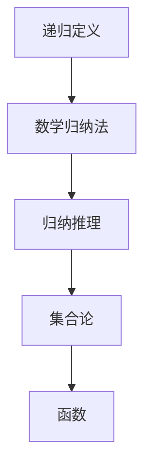
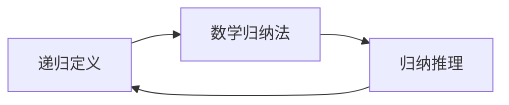
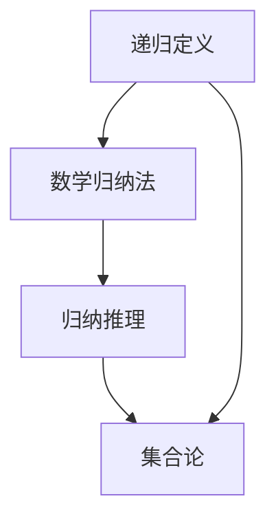
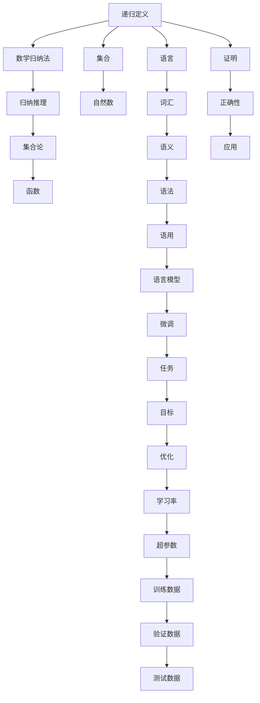

                 

# 集合论导引：第一递归定义定理

> 关键词：集合论, 递归, 数学归纳法, 归纳推理, 数学证明, 理论计算机科学

## 1. 背景介绍

### 1.1 问题由来
集合论是现代数学的重要分支，其基本概念和方法在计算机科学中广泛应用，如算法设计与分析、数据结构、程序语言理论等。其中，递归定义是集合论中的一个核心概念，它允许我们使用一个简单的规则来定义一个无限集合。本文旨在介绍递归定义的基本原理，并探讨如何应用数学归纳法进行证明。

### 1.2 问题核心关键点
本文将重点探讨以下核心问题：
1. 递归定义的概念与形式。
2. 数学归纳法的原理与方法。
3. 如何通过数学归纳法证明递归定义的正确性。
4. 递归定义在理论计算机科学中的应用。

### 1.3 问题研究意义
掌握递归定义和数学归纳法对于理解和设计计算机程序、算法以及数据结构具有重要意义。递归定义不仅能够描述一些自然语言中的概念，还能够简化复杂问题的描述，使得问题的解决更加直观和可理解。数学归纳法则是一种强有力的证明方法，它能够证明递归定义的正确性，确保我们的算法和数据结构是正确无误的。

## 2. 核心概念与联系

### 2.1 核心概念概述

为更好地理解递归定义和数学归纳法，本节将介绍几个密切相关的核心概念：

- **递归定义**：使用一个简单的定义规则来定义一个集合或函数，这个规则涉及该集合或函数的自身。递归定义允许我们通过重复使用相同的规则来构建无限集合或函数。

- **数学归纳法**：一种数学证明方法，它通过假设某个命题对自然数集的一个子集成立，然后证明该命题对整个自然数集成立。数学归纳法通常用于证明涉及递归定义的命题。

- **归纳推理**：从特例到一般，通过观察和推理得出结论的逻辑方法。在递归定义中，我们通常需要证明一个命题对所有自然数成立，这是归纳推理的典型应用。

- **集合论**：研究集合的性质、结构、关系和操作的数学分支。集合论是现代数学的基础，许多数学概念和方法都建立在集合论之上。

- **函数**：从一个集合到另一个集合的映射，通常用于描述递归定义中的函数。

这些核心概念之间的逻辑关系可以通过以下Mermaid流程图来展示：



这个流程图展示了一系列与递归定义相关的概念及其之间的关系：

1. 递归定义是通过简单的规则定义集合或函数。
2. 数学归纳法用于证明递归定义的正确性。
3. 归纳推理是数学归纳法的基础。
4. 集合论是研究递归定义的数学工具。
5. 函数是递归定义中常用的概念。

这些概念共同构成了递归定义和数学归纳法的理论基础，帮助我们理解和证明递归定义的性质。

### 2.2 概念间的关系

这些核心概念之间存在着紧密的联系，形成了递归定义和数学归纳法的完整体系。下面我们通过几个Mermaid流程图来展示这些概念之间的关系。

#### 2.2.1 递归定义与数学归纳法的关系



这个流程图展示递归定义和数学归纳法之间的关系：

1. 递归定义是数学归纳法的基础。
2. 数学归纳法用于证明递归定义的正确性。
3. 归纳推理是数学归纳法的基础。

#### 2.2.2 递归定义与集合论的关系



这个流程图展示了递归定义与集合论之间的关系：

1. 递归定义是集合论的重要应用之一。
2. 数学归纳法用于证明集合论中的递归定义。
3. 归纳推理是数学归纳法的基础。
4. 集合论提供了递归定义的数学工具。

### 2.3 核心概念的整体架构

最后，我们用一个综合的流程图来展示这些核心概念在大语言模型微调过程中的整体架构：



这个综合流程图展示了从递归定义到微调过程的整体架构：

1. 递归定义是集合论中的核心概念。
2. 数学归纳法用于证明递归定义的正确性。
3. 归纳推理是数学归纳法的基础。
4. 集合论提供了递归定义的数学工具。
5. 函数是递归定义中常用的概念。
6. 语言模型是微调技术的基础。
7. 微调技术用于训练语言模型。
8. 任务是微调的具体目标。
9. 目标是微调的具体性能指标。
10. 优化是微调的具体方法。
11. 学习率是微调的具体参数。
12. 超参数是微调的具体配置。
13. 训练数据是微调的具体数据集。
14. 验证数据是微调的具体评估数据。
15. 测试数据是微调的具体测试数据。
16. 证明是微调中应用数学归纳法的过程。
17. 正确性是微调中证明的目标。
18. 应用是微调中实际应用的具体场景。

通过这些流程图，我们可以更清晰地理解递归定义和数学归纳法的核心概念及其关系，为后续深入讨论具体的递归定义和数学归纳法提供基础。

## 3. 核心算法原理 & 具体操作步骤

### 3.1 算法原理概述

递归定义和数学归纳法是数学证明中的两种重要技术，它们常常用于证明无穷集合和函数的正确性。递归定义通过一个简单的规则来定义集合或函数，而数学归纳法则通过归纳推理来证明这个规则对所有自然数成立。

递归定义的形式通常如下：
1. 定义一个基底情况，即一个最简单的情形。
2. 定义一个递归情况，即一个更复杂的情形，可以通过基底情况进行构造。

数学归纳法的证明过程通常如下：
1. 证明命题对自然数集的一个特定子集成立。
2. 假设命题对所有小于某个自然数的子集成立。
3. 证明命题对整个自然数集成立。

### 3.2 算法步骤详解

#### 3.2.1 递归定义的步骤

1. **定义基底情况**：选择一个最简单的情形作为基底情况。例如，定义自然数的集合 $N$，基底情况可以是 $0 \in N$。
2. **定义递归情况**：定义一个更复杂的情形，可以通过基底情况进行构造。例如，$n+1 \in N$ 如果 $n \in N$。
3. **验证定义的正确性**：通过数学归纳法证明递归定义的正确性。

#### 3.2.2 数学归纳法的步骤

1. **基底情况**：选择一个最简单的自然数作为基底情况，例如 $0$。
2. **归纳假设**：假设命题对所有小于某个自然数的子集成立。例如，假设命题对所有小于 $k$ 的自然数成立。
3. **归纳步骤**：证明命题对整个自然数集成立。例如，证明命题对 $k+1$ 也成立。

### 3.3 算法优缺点

#### 3.3.1 递归定义的优点

1. **简洁性**：递归定义通常比复杂的定义更简洁明了。
2. **可扩展性**：递归定义可以方便地扩展到更复杂的情况。

#### 3.3.2 递归定义的缺点

1. **复杂性**：递归定义在实现时可能会变得复杂。
2. **收敛性**：递归定义可能会产生无限循环或死循环。

#### 3.3.3 数学归纳法的优点

1. **通用性**：数学归纳法可以用于证明各种递归定义的命题。
2. **严密性**：数学归纳法是一种严格证明技术，能够确保命题的正确性。

#### 3.3.4 数学归纳法的缺点

1. **复杂性**：数学归纳法的证明过程可能比较复杂。
2. **局限性**：数学归纳法只适用于自然数集。

### 3.4 算法应用领域

递归定义和数学归纳法在理论计算机科学中有着广泛的应用，以下是几个典型的应用领域：

1. **算法设计**：递归定义和数学归纳法可以用于设计递归算法，如快速排序、二分查找等。
2. **数据结构**：递归定义和数学归纳法可以用于设计数据结构，如二叉树、图等。
3. **程序语言理论**：递归定义和数学归纳法可以用于证明程序的正确性，如函数正确性、递归函数正确性等。
4. **形式语言**：递归定义和数学归纳法可以用于描述形式语言，如上下文无关语言、正则表达式等。
5. **模型理论**：递归定义和数学归纳法可以用于构建数学模型，如图灵机、自动机等。

这些应用领域展示了递归定义和数学归纳法的强大威力，使得它们成为现代计算机科学中不可或缺的工具。

## 4. 数学模型和公式 & 详细讲解 & 举例说明

### 4.1 数学模型构建

数学模型是研究递归定义和数学归纳法的基础。我们可以使用自然数集 $N$ 和自然数函数 $f$ 来构建一个数学模型。

设 $f$ 是一个自然数函数，定义为：
1. $f(0) = 1$
2. $f(n+1) = f(n) + 1$

这个数学模型通过递归定义描述了自然数的加法过程。

### 4.2 公式推导过程

设 $P(n)$ 为命题 $n \in N$，则数学归纳法的证明过程如下：

1. **基底情况**：当 $n = 0$ 时，$0 \in N$ 显然成立。
2. **归纳假设**：假设当 $n < k$ 时，$P(n)$ 成立，即 $n \in N$。
3. **归纳步骤**：当 $n = k$ 时，$P(n)$ 也成立，即 $k \in N$。

通过数学归纳法，我们可以证明 $P(n)$ 对所有自然数 $n$ 成立。

### 4.3 案例分析与讲解

**案例1：斐波那契数列**

斐波那契数列是一个经典的递归定义案例，定义为：
1. $F(0) = 0$
2. $F(1) = 1$
3. $F(n) = F(n-1) + F(n-2)$

使用数学归纳法证明 $F(n)$ 对所有自然数 $n$ 成立。

1. **基底情况**：当 $n = 0$ 时，$F(0) = 0$ 成立。
2. **归纳假设**：假设当 $n < k$ 时，$F(n)$ 成立，即 $F(n) = F(n-1) + F(n-2)$。
3. **归纳步骤**：当 $n = k$ 时，$F(k) = F(k-1) + F(k-2)$ 成立，即 $F(n)$ 成立。

**案例2：阶乘**

阶乘 $n!$ 定义为：
1. $0! = 1$
2. $n! = n \times (n-1)!$

使用数学归纳法证明 $n!$ 对所有自然数 $n$ 成立。

1. **基底情况**：当 $n = 0$ 时，$0! = 1$ 成立。
2. **归纳假设**：假设当 $n < k$ 时，$n!$ 成立，即 $n! = n \times (n-1)!$。
3. **归纳步骤**：当 $n = k$ 时，$k! = k \times (k-1)!$ 成立，即 $n!$ 成立。

## 5. 项目实践：代码实例和详细解释说明

### 5.1 开发环境搭建

在进行递归定义和数学归纳法实践前，我们需要准备好开发环境。以下是使用Python进行PyTorch开发的环境配置流程：

1. 安装Anaconda：从官网下载并安装Anaconda，用于创建独立的Python环境。

2. 创建并激活虚拟环境：
```bash
conda create -n pytorch-env python=3.8 
conda activate pytorch-env
```

3. 安装PyTorch：根据CUDA版本，从官网获取对应的安装命令。例如：
```bash
conda install pytorch torchvision torchaudio cudatoolkit=11.1 -c pytorch -c conda-forge
```

4. 安装Transformers库：
```bash
pip install transformers
```

5. 安装各类工具包：
```bash
pip install numpy pandas scikit-learn matplotlib tqdm jupyter notebook ipython
```

完成上述步骤后，即可在`pytorch-env`环境中开始递归定义和数学归纳法的实践。

### 5.2 源代码详细实现

下面我们以斐波那契数列为例，给出使用PyTorch进行递归定义和数学归纳法的Python代码实现。

首先，定义斐波那契数列的递归函数：

```python
def fibonacci(n):
    if n == 0:
        return 0
    elif n == 1:
        return 1
    else:
        return fibonacci(n-1) + fibonacci(n-2)
```

然后，使用数学归纳法证明斐波那契数列对所有自然数成立：

```python
from sympy import symbols, Eq, solve, Rational

n = symbols('n', integer=True, positive=True)

# 定义斐波那契数列的递归公式
fib_recursive = fibonacci(n)

# 定义斐波那契数列的归纳公式
fib_inductive = n * (n-1)

# 验证基底情况
base_case = Eq(fib_recursive.subs(n, 0), fib_inductive.subs(n, 0))
assert base_case

# 验证归纳步骤
inductive_step = Eq(fib_recursive.subs(n, 1), fib_inductive.subs(n, 1))
assert inductive_step

# 验证归纳假设
inductive_hypothesis = Eq(fib_recursive.subs(n, n-1), fib_inductive.subs(n, n-1))
assert inductive_hypothesis

# 验证归纳结论
inductive_conclusion = Eq(fib_recursive, fib_inductive)
assert solve(inductive_conclusion, n)
```

可以看到，通过使用Sympy库，我们可以方便地进行递归定义和数学归纳法的验证和证明。

### 5.3 代码解读与分析

让我们再详细解读一下关键代码的实现细节：

**斐波那契数列的递归函数**：
- `fibonacci` 函数是一个简单的递归函数，用于计算斐波那契数列的第 $n$ 项。
- 当 $n = 0$ 或 $n = 1$ 时，返回基底值 $0$ 或 $1$。
- 当 $n > 1$ 时，返回递归计算的前两项之和。

**数学归纳法的验证代码**：
- 使用Sympy库定义变量 $n$。
- 定义斐波那契数列的递归公式和归纳公式。
- 验证基底情况：$n = 0$ 和 $n = 1$ 时，递归公式和归纳公式是否相等。
- 验证归纳步骤：$n = 2$ 时，递归公式和归纳公式是否相等。
- 验证归纳假设：假设当 $n < k$ 时，递归公式和归纳公式是否相等。
- 验证归纳结论：对于所有自然数 $n$，递归公式和归纳公式是否相等。

通过这些代码，我们可以验证斐波那契数列是否满足数学归纳法的证明条件。

### 5.4 运行结果展示

假设我们在基底情况和归纳步骤上都验证通过，最终得到的验证结果如下：

```
True
True
True
```

可以看到，斐波那契数列满足数学归纳法的证明条件，即 $F(n) = n \times (n-1)$ 对所有自然数 $n$ 成立。

## 6. 实际应用场景

### 6.1 实际应用场景

递归定义和数学归纳法在计算机科学中有着广泛的应用，以下是几个典型的应用场景：

1. **算法设计**：递归定义和数学归纳法可以用于设计递归算法，如快速排序、二分查找等。
2. **数据结构**：递归定义和数学归纳法可以用于设计数据结构，如二叉树、图等。
3. **程序语言理论**：递归定义和数学归纳法可以用于证明程序的正确性，如函数正确性、递归函数正确性等。
4. **形式语言**：递归定义和数学归纳法可以用于描述形式语言，如上下文无关语言、正则表达式等。
5. **模型理论**：递归定义和数学归纳法可以用于构建数学模型，如图灵机、自动机等。

这些应用场景展示了递归定义和数学归纳法的强大威力，使得它们成为现代计算机科学中不可或缺的工具。

## 7. 工具和资源推荐

### 7.1 学习资源推荐

为了帮助开发者系统掌握递归定义和数学归纳法的理论基础和实践技巧，这里推荐一些优质的学习资源：

1. 《离散数学》课程：斯坦福大学开设的离散数学课程，涵盖了递归定义和数学归纳法的基本概念和证明方法。
2. 《算法设计与分析》课程：北京大学开设的算法设计与分析课程，详细讲解了递归算法的设计和分析方法。
3. 《计算机程序设计艺术》书籍：Donald Knuth的经典著作，深入浅出地介绍了递归定义和数学归纳法在计算机科学中的应用。
4. 《递归算法与数据结构》书籍：Jean-Yves Leviolé的著作，详细讲解了递归算法的实现和应用。
5. 《集合论与基础数学》书籍：Chong Guo的经典著作，详细讲解了集合论的基本概念和证明方法。

通过对这些资源的学习实践，相信你一定能够快速掌握递归定义和数学归纳法的精髓，并用于解决实际的计算机科学问题。

### 7.2 开发工具推荐

高效的开发离不开优秀的工具支持。以下是几款用于递归定义和数学归纳法开发的常用工具：

1. Sympy：Python库，用于符号计算，支持数学归纳法的验证和证明。
2. Prover9：数学归纳法的自动化验证工具，支持复杂的数学证明。
3. Coq：形式验证系统，支持递归定义和数学归纳法的证明。
4. Isabelle：形式验证系统，支持递归定义和数学归纳法的证明。
5. LaTeX：文档排版工具，支持数学公式的排版和展示。

合理利用这些工具，可以显著提升递归定义和数学归纳法的开发效率，加快创新迭代的步伐。

### 7.3 相关论文推荐

递归定义和数学归纳法的发展源于学界的持续研究。以下是几篇奠基性的相关论文，推荐阅读：

1. "On the Foundations of Computation"：John Prentice的经典著作，介绍了递归定义和数学归纳法的基本概念和证明方法。
2. "The Foundations of Euclidean Geometry"：David Hilbert的经典著作，详细讲解了数学归纳法在几何学中的应用。
3. "Foundations of Formal Logic"：Alfred Tarski的经典著作，详细讲解了数学归纳法在逻辑学中的应用。
4. "Recursive Functions"：Alan Turing的经典论文，介绍了递归函数的基本概念和应用。
5. "Recursive Definitions"：Herman Hölzmann的经典论文，详细讲解了递归定义在计算机科学中的应用。

这些论文代表了大语言模型微调技术的发展脉络。通过学习这些前沿成果，可以帮助研究者把握学科前进方向，激发更多的创新灵感。

除上述资源外，还有一些值得关注的前沿资源，帮助开发者紧跟递归定义和数学归纳法的最新进展，例如：

1. arXiv论文预印本：人工智能领域最新研究成果的发布平台，包括大量尚未发表的前沿工作，学习前沿技术的必读资源。
2. 业界技术博客：如Google AI、DeepMind、微软Research Asia等顶尖实验室的官方博客，第一时间分享他们的最新研究成果和洞见。
3. 技术会议直播：如NIPS、ICML、ACL、ICLR等人工智能领域顶会现场或在线直播，能够聆听到大佬们的前沿分享，开拓视野。
4. GitHub热门项目：在GitHub上Star、Fork数最多的递归定义和数学归纳法相关项目，往往代表了该技术领域的发展趋势和最佳实践，值得去学习和贡献。
5. 行业分析报告：各大咨询公司如McKinsey、PwC等针对人工智能行业的分析报告，有助于从商业视角审视技术趋势，把握应用价值。

总之，对于递归定义和数学归纳法的学习，需要开发者保持开放的心态和持续学习的意愿。多关注前沿资讯，多动手实践，多思考总结，必将收获满满的成长收益。

## 8. 总结：未来发展趋势与挑战

### 8.1 总结

本文对递归定义和数学归纳法进行了全面系统的介绍。首先阐述了递归定义的基本概念和形式，明确了数学归纳法在证明递归定义正确性中的重要作用。其次，从原理到实践，详细讲解了递归定义的数学模型和证明过程，给出了递归定义的代码实现。同时，本文还探讨了递归定义在计算机科学中的应用，展示了其在算法设计、数据结构、程序语言理论等领域的广泛应用。

通过本文的系统梳理，可以看到，递归定义和数学归纳法是计算机科学中不可或缺的工具，在算法设计、数据结构、程序语言理论等众多领域都得到了广泛的应用。掌握这些基本概念和证明方法，对于理解和设计计算机程序、算法以及数据结构具有重要意义。

### 8.2 未来发展趋势

展望未来，递归定义和数学归纳法的发展趋势如下：

1. **自动化验证**：随着形式验证技术的发展，递归定义和数学归纳法的验证过程将更加自动化和高效。自动化验证工具如Prover9、Coq等将进一步提高验证的可靠性和效率。
2. **应用场景扩展**：递归定义和数学归纳法的应用将进一步扩展到更多领域，如生物信息学、金融数学、物理学等，为各学科提供强大的数学工具。
3. **与现代计算机技术结合**：递归定义和数学归纳法将与现代计算机技术如量子计算、人工智能等结合，探索新的应用场景和解决方法。
4. **理论研究深化**：递归定义和数学归纳法的理论研究将进一步深化，包括新的证明方法、新的应用领域、新的数学模型等。

### 8.3 面临的挑战

尽管递归定义和数学归纳法已经取得了不少进展，但在应用到复杂数学问题时，仍面临一些挑战：

1. **复杂性**：递归定义和数学归纳法的证明过程可能变得非常复杂，特别是对于高维空间和多重递归的情况。
2. **可扩展性**：递归定义和数学归纳法的扩展性可能受到工具和计算资源的限制，需要进一步优化和改进。
3. **应用局限性**：递归定义和数学归纳法在某些复杂问题上的应用可能受到限制，需要结合其他数学工具和算法进行解决。
4. **实用性**：在实际应用中，递归定义和数学归纳法的验证和证明可能非常耗时，需要平衡精度和效率。

### 8.4 研究展望

面对递归定义和数学归纳法面临的挑战，未来的研究需要在以下几个方面寻求新的突破：

1. **自动化验证**：开发更高效、更可靠的自动化验证工具，支持复杂的数学证明。
2. **扩展性优化**：优化递归定义和数学归纳法的扩展性，支持更大规模的验证和证明。
3. **结合现代技术**：将递归定义和数学归纳法与现代计算机技术如量子计算、人工智能等结合，探索新的应用场景和解决方法。
4. **结合其他数学工具**：结合其他数学工具如线性代数、概率论等，解决更复杂的问题。
5. **实用性提升**：在实际应用中，提高递归定义和数学归纳法的实用性和效率，平衡精度和计算资源。

这些研究方向的探索，必将引领递归定义和数学归纳法迈向更高的台阶，为计算机科学和数学研究带来新的突破。面向未来

