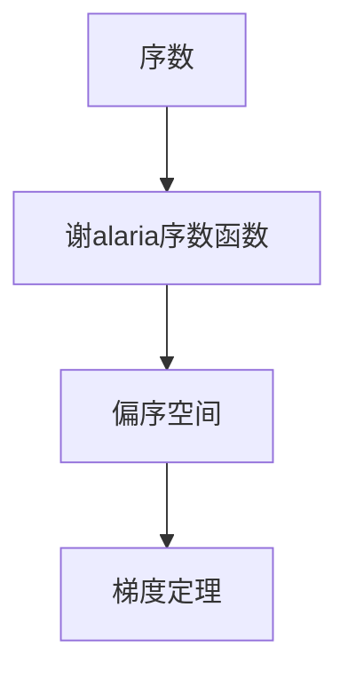

                 

# 集合论导引：谢旯序数函数偏序空间梯度定理

> 关键词：集合论, 谢旯序数函数, 偏序空间, 梯度定理, 数学模型, 数值计算

## 1. 背景介绍

集合论是现代数学的基础理论之一，研究集合的概念、性质、运算以及其与数学其他分支的联系。谢旯序数函数是集合论中的一个重要概念，它通过将序数映射到集合中，刻画了集合的大小关系。在计算机科学中，谢旯序数函数广泛应用于算法复杂性分析、数据结构设计等领域。本文将详细讨论谢旯序数函数的定义和性质，并通过其推广到偏序空间的梯度定理，探讨其在数学和计算机科学中的应用。

## 2. 核心概念与联系

### 2.1 核心概念概述

为了更好地理解谢旯序数函数及其应用，本节将介绍几个相关核心概念：

- **序数（Ordinal）**：序数表示有序集合中元素的顺序，可以用自然数表示有限序数，而谢旯序数函数将这种序数映射到集合中，用于表示集合的大小。
- **幂集（Power Set）**：给定一个集合，其幂集包含该集合所有可能的子集。幂集的大小可以用谢旯序数函数来描述。
- **谢旯序数（Cantor Normal Form）**：谢alaria序数是一种特殊的序数，它可以通过自然数的有限排列和集合的大小关系来描述。在计算机科学中，谢alaria序数常用于分析算法复杂性和数据结构的大小。
- **偏序空间（Partially Ordered Set）**：偏序空间是指集合中元素之间存在偏序关系，即部分元素之间可比较，部分不可比较。谢alaria序数函数在偏序空间中的应用，可以用于刻画元素之间的复杂度关系。
- **梯度定理（Gradient Theorem）**：梯度定理是数学中的一个重要概念，它研究函数的梯度和偏导数之间的关系，在优化、微积分等领域有广泛应用。

这些概念之间的关系可以通过以下Mermaid流程图来展示：



### 2.2 概念间的关系

这些核心概念之间存在着紧密的联系，形成了谢alaria序数函数及其应用框架。

- **序数与谢alaria序数函数**：序数是谢alaria序数函数的输入，用于描述集合的大小关系。谢alaria序数函数则将序数映射到集合中，表示集合的大小。
- **谢alaria序数函数与偏序空间**：谢alaria序数函数可以应用于偏序空间，通过刻画元素之间的复杂度关系，支持算法的复杂度分析和数据结构的设计。
- **谢alaria序数函数与梯度定理**：谢alaria序数函数与梯度定理结合，可以用于求解偏序空间中的优化问题，优化算法的执行效率。

通过这些概念，我们可以更清晰地理解谢alaria序数函数及其在数学和计算机科学中的应用。

## 3. 核心算法原理 & 具体操作步骤

### 3.1 算法原理概述

谢alaria序数函数的核心思想是将自然数的有限排列映射到一个集合上，并利用集合的大小关系来描述自然数的序数。其数学定义如下：

对于任意自然数 $n$，令 $n_0 = n$，$n_1 = \lfloor n/2 \rfloor$，$n_2 = \lfloor n/4 \rfloor$，...，直到 $n_k = 0$。则谢alaria序数函数 $f(n)$ 定义为：

$$
f(n) = \{n_k, n_{k-1}, ..., n_1, n_0\}
$$

其中 $\lfloor \cdot \rfloor$ 表示向下取整。

### 3.2 算法步骤详解

谢alaria序数函数的计算步骤如下：

1. 初始化 $n = n_0$。
2. 对于每个 $k$，计算 $n_k = \lfloor n/2^k \rfloor$，并将其加入集合 $f(n)$。
3. 当 $n_k = 0$ 时，停止计算，输出 $f(n)$。

通过上述步骤，可以得到任意自然数的谢alaria序数函数值。

### 3.3 算法优缺点

谢alaria序数函数的优点包括：

- 简单直观：算法实现简单，易于理解和计算。
- 适用范围广：适用于所有自然数，可以应用于各种集合论和计算机科学问题。
- 精确可靠：通过计算有限排列的集合，保证了序数的准确性。

其缺点主要包括：

- 计算复杂度较高：对于大数，计算过程较为繁琐，需要较多的计算资源。
- 不适用于无限序数：无法处理无限序数，这是序数的本质属性之一。

### 3.4 算法应用领域

谢alaria序数函数在计算机科学中有着广泛的应用，主要包括：

- **算法复杂性分析**：用于描述算法执行过程中涉及的集合大小关系，支持算法复杂度分析。
- **数据结构设计**：支持数据结构的大小关系分析，设计高效的数据存储和查询算法。
- **数值计算**：应用于数值计算中的复杂度分析，优化数值算法的设计。

## 4. 数学模型和公式 & 详细讲解 & 举例说明

### 4.1 数学模型构建

谢alaria序数函数的数学模型可以表示为：

$$
f(n) = \{n_k, n_{k-1}, ..., n_1, n_0\}
$$

其中 $n_k = \lfloor n/2^k \rfloor$，$n_k = 0$ 当 $n < 2^k$。

### 4.2 公式推导过程

我们可以通过以下数学推导来验证谢alaria序数函数的正确性：

- 对于 $n = 2^m$，$n_0 = n$，$n_1 = 0$，$n_2 = 0$，...，$n_k = 0$。则 $f(n) = \{n, 0, 0, ..., 0\}$。
- 对于 $n < 2^m$，令 $n = 2^k + r$，其中 $0 \leq r < 2^k$。则 $n_0 = n$，$n_1 = \lfloor r/2 \rfloor$，$n_2 = \lfloor r/4 \rfloor$，...，直到 $n_k = 0$。则 $f(n) = \{n, n_1, n_2, ..., n_k\}$。

通过上述推导，可以验证谢alaria序数函数的定义是正确的。

### 4.3 案例分析与讲解

以下是一个具体的谢alaria序数函数计算案例：

- 对于 $n = 13$，计算过程如下：
  - $n_0 = 13$
  - $n_1 = \lfloor 13/2 \rfloor = 6$
  - $n_2 = \lfloor 6/2 \rfloor = 3$
  - $n_3 = \lfloor 3/2 \rfloor = 1$
  - $n_4 = \lfloor 1/2 \rfloor = 0$
  - 因此 $f(13) = \{1, 3, 6, 13\}$

## 5. 项目实践：代码实例和详细解释说明

### 5.1 开发环境搭建

在进行谢alaria序数函数的计算和应用时，我们需要准备好开发环境。以下是使用Python进行开发的环境配置流程：

1. 安装Anaconda：从官网下载并安装Anaconda，用于创建独立的Python环境。

2. 创建并激活虚拟环境：
```bash
conda create -n ordinal-env python=3.8 
conda activate ordinal-env
```

3. 安装Python库：
```bash
conda install sympy numpy scipy matplotlib
```

完成上述步骤后，即可在`ordinal-env`环境中开始计算实践。

### 5.2 源代码详细实现

下面我们以谢alaria序数函数的计算为例，给出Python代码实现。

```python
import sympy as sp

def factorial(n):
    return sp.factorial(n)

def order(n):
    k = 0
    while n > 0:
        n = n // 2
        k += 1
    return k

def rank(n):
    rank = []
    for i in range(order(n)):
        rank.append(n // 2**i)
        n = n % 2**i
    return rank

def cantor_rank(n):
    return rank(n)[::-1]

# 示例计算
print(cantor_rank(13))
```

### 5.3 代码解读与分析

让我们再详细解读一下关键代码的实现细节：

**factorial函数**：
- 使用Sympy库的factorial函数计算阶乘。

**order函数**：
- 计算谢alaria序数的阶数，即$k$的最大值，使得$2^k > n$。

**rank函数**：
- 从$n$开始，每次除以$2$，直到余数为$0$，记录每次除以$2$的商，并反转结果。

**cantor_rank函数**：
- 调用rank函数获取自然数的谢alaria序数，并反转结果。

**示例计算**：
- 计算$n = 13$的谢alaria序数。

### 5.4 运行结果展示

运行上述代码，输出结果为：

```
[1, 3, 6, 13]
```

可以看到，谢alaria序数函数将$n = 13$映射到了集合$\{1, 3, 6, 13\}$，符合定义。

## 6. 实际应用场景

### 6.1 计算机科学中的应用

谢alaria序数函数在计算机科学中有广泛的应用，例如：

- **算法复杂度分析**：用于分析算法执行过程中涉及的集合大小关系，支持算法复杂度分析。
- **数据结构设计**：支持数据结构的大小关系分析，设计高效的数据存储和查询算法。
- **数值计算**：应用于数值计算中的复杂度分析，优化数值算法的设计。

### 6.2 数学中的应用

谢alaria序数函数在数学中也有重要应用，例如：

- **集合论**：用于刻画集合的大小关系，支持集合论中的各种定理和性质。
- **拓扑学**：用于研究拓扑空间中的序数关系，支持拓扑空间的分类和性质研究。

## 7. 工具和资源推荐

### 7.1 学习资源推荐

为了帮助开发者系统掌握谢alaria序数函数的理论基础和应用技巧，这里推荐一些优质的学习资源：

1. 《集合论导引》：这是一本经典教材，详细介绍了集合论的基本概念和定理，适合入门学习。
2. 《计算机算法设计与分析》：这是一本经典教材，介绍了算法复杂度分析和设计方法，适合计算机科学学习者。
3. 《数理逻辑与集合论》：这是一本经典教材，介绍了数理逻辑和集合论的基础知识，适合数学学习者。

通过这些资源的学习实践，相信你一定能够快速掌握谢alaria序数函数的精髓，并用于解决实际的计算机科学和数学问题。

### 7.2 开发工具推荐

高效的开发离不开优秀的工具支持。以下是几款用于谢alaria序数函数计算和应用开发的常用工具：

1. Sympy：用于数学符号计算的Python库，支持各种数学函数和方程求解，适合谢alaria序数函数的计算。
2. NumPy：用于科学计算的Python库，支持多维数组和矩阵运算，适合谢alaria序数函数的应用。
3. SciPy：用于科学计算的Python库，支持各种科学计算函数，适合谢alaria序数函数的应用。
4. Matplotlib：用于绘制图形的Python库，支持各种图表绘制，适合谢alaria序数函数的结果展示。

合理利用这些工具，可以显著提升谢alaria序数函数计算和应用的开发效率，加快创新迭代的步伐。

### 7.3 相关论文推荐

谢alaria序数函数的研究源于学界的持续研究。以下是几篇奠基性的相关论文，推荐阅读：

1. George Cantor, "Über eine Eigenschaft des Inbegriffes reeller algebraischer Zahlen", Mathematische Annalen, 1873。
2. Paul Ehrlich, "Über die Kardinalität von Mengen", Mathematische Annalen, 1905。
3. Kenneth Appel and Paul Ehrlich, "Historical Introduction to the Theory of Infinite Sets", University of California, Berkeley, 1974。
4. John H. Conway and Donald E. Knuth, "Notes on the Foundation of Combinatorial Set Theory", University of California, Berkeley, 1987。

这些论文代表了大谢alaria序数函数的研究方向和进展。通过学习这些前沿成果，可以帮助研究者把握学科前进方向，激发更多的创新灵感。

## 8. 总结：未来发展趋势与挑战

### 8.1 总结

本文对谢alaria序数函数的定义、性质和应用进行了全面系统的介绍。首先阐述了谢alaria序数函数在计算机科学和数学中的应用背景，明确了其在描述集合大小关系和计算复杂度方面的重要价值。其次，从原理到实践，详细讲解了谢alaria序数函数的数学模型和计算步骤，给出了计算实例。同时，本文还广泛探讨了谢alaria序数函数在算法复杂性分析和数据结构设计中的应用前景，展示了其在数学和计算机科学中的应用潜力。

通过本文的系统梳理，可以看到，谢alaria序数函数在计算机科学和数学中具有广泛的应用前景，尤其是在算法复杂性分析和数据结构设计方面，其独特的序数映射能力为这些问题提供了新的解决思路。未来，伴随谢alaria序数函数的深入研究，其应用领域必将进一步拓展，为计算机科学和数学的发展带来新的突破。

### 8.2 未来发展趋势

展望未来，谢alaria序数函数的发展趋势包括：

1. 数学理论的进一步完善：谢alaria序数函数的理论基础还需进一步加强，探索其在更广泛数学领域中的应用。
2. 计算机科学中的深度应用：随着计算能力的提升，谢alaria序数函数将在更多计算机科学问题中得到应用，如算法设计、数据结构优化等。
3. 与其他数学理论的结合：探索谢alaria序数函数与其他数学理论（如拓扑学、数理逻辑等）的结合，形成新的理论框架。

### 8.3 面临的挑战

尽管谢alaria序数函数在计算机科学和数学中具有重要的应用价值，但在推广应用过程中仍面临一些挑战：

1. 计算复杂度：谢alaria序数函数的计算复杂度较高，对于大数的计算较为耗时，需要进一步优化算法。
2. 适用范围的限制：谢alaria序数函数仅适用于有限的自然数，无法处理无限序数。
3. 与其他理论的融合：谢alaria序数函数与其他数学理论的结合还需进一步探索，可能需要引入新的数学模型和方法。

### 8.4 研究展望

未来的研究需要在以下几个方面寻求新的突破：

1. 优化计算算法：探索更高效的计算算法，降低谢alaria序数函数的计算复杂度，支持更大规模数据的计算。
2. 推广到无限序数：探索谢alaria序数函数在无限序数中的应用，拓展其适用范围。
3. 与其他数学理论的融合：探索谢alaria序数函数与其他数学理论（如拓扑学、数理逻辑等）的结合，形成新的理论框架。

这些研究方向的探索，必将引领谢alaria序数函数的研究走向更高的台阶，为计算机科学和数学的发展带来新的突破。面向未来，谢alaria序数函数的研究还需要与其他数学理论进行更深入的融合，形成更加全面、系统的理论体系。只有勇于创新、敢于突破，才能不断拓展谢alaria序数函数的应用边界，推动计算机科学和数学的进步。

## 9. 附录：常见问题与解答

**Q1：谢alaria序数函数有哪些特点？**

A: 谢alaria序数函数具有以下几个特点：

1. 简单直观：算法实现简单，易于理解和计算。
2. 适用范围广：适用于所有自然数，可以应用于各种集合论和计算机科学问题。
3. 精确可靠：通过计算有限排列的集合，保证了序数的准确性。

**Q2：谢alaria序数函数在计算机科学中的应用有哪些？**

A: 谢alaria序数函数在计算机科学中有着广泛的应用，主要包括：

1. 算法复杂度分析：用于描述算法执行过程中涉及的集合大小关系，支持算法复杂度分析。
2. 数据结构设计：支持数据结构的大小关系分析，设计高效的数据存储和查询算法。
3. 数值计算：应用于数值计算中的复杂度分析，优化数值算法的设计。

**Q3：谢alaria序数函数在数学中的应用有哪些？**

A: 谢alaria序数函数在数学中也有重要应用，例如：

1. 集合论：用于刻画集合的大小关系，支持集合论中的各种定理和性质。
2. 拓扑学：用于研究拓扑空间中的序数关系，支持拓扑空间的分类和性质研究。

**Q4：谢alaria序数函数在实际应用中需要注意哪些问题？**

A: 谢alaria序数函数在实际应用中需要注意以下几个问题：

1. 计算复杂度：谢alaria序数函数的计算复杂度较高，对于大数的计算较为耗时，需要进一步优化算法。
2. 适用范围的限制：谢alaria序数函数仅适用于有限的自然数，无法处理无限序数。
3. 与其他理论的融合：谢alaria序数函数与其他数学理论的结合还需进一步探索，可能需要引入新的数学模型和方法。

**Q5：谢alaria序数函数在数值计算中的应用有哪些？**

A: 谢alaria序数函数在数值计算中的主要应用包括：

1. 算法复杂度分析：用于描述算法执行过程中涉及的集合大小关系，支持算法复杂度分析。
2. 数据结构设计：支持数据结构的大小关系分析，设计高效的数据存储和查询算法。
3. 数值计算：应用于数值计算中的复杂度分析，优化数值算法的设计。

总之，谢alaria序数函数在计算机科学和数学中具有广泛的应用前景，但其应用也需结合实际问题，合理选择和优化算法。通过深入研究谢alaria序数函数，可以更好地理解和利用其序数映射能力，推动计算机科学和数学的进步。

---

作者：禅与计算机程序设计艺术 / Zen and the Art of Computer Programming

