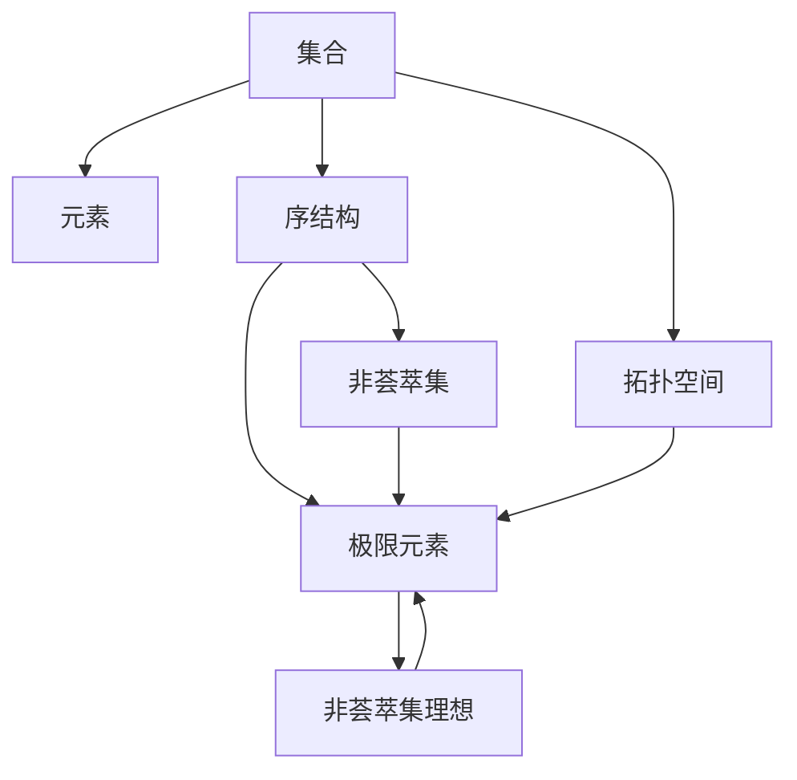
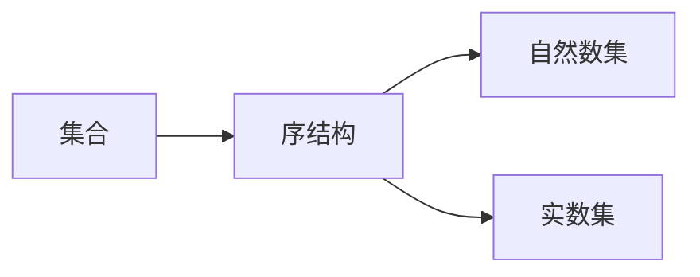
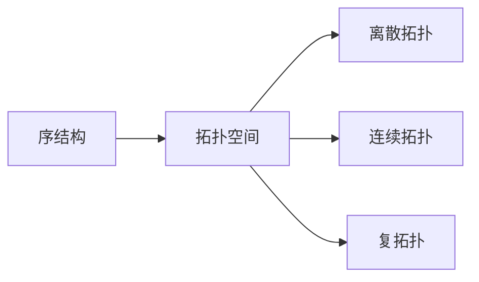
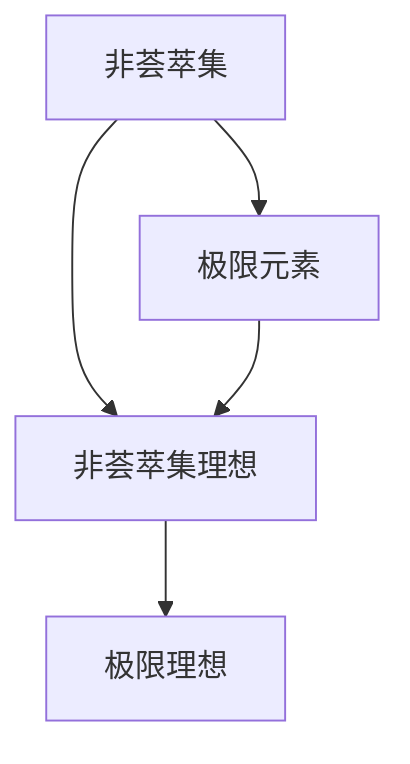
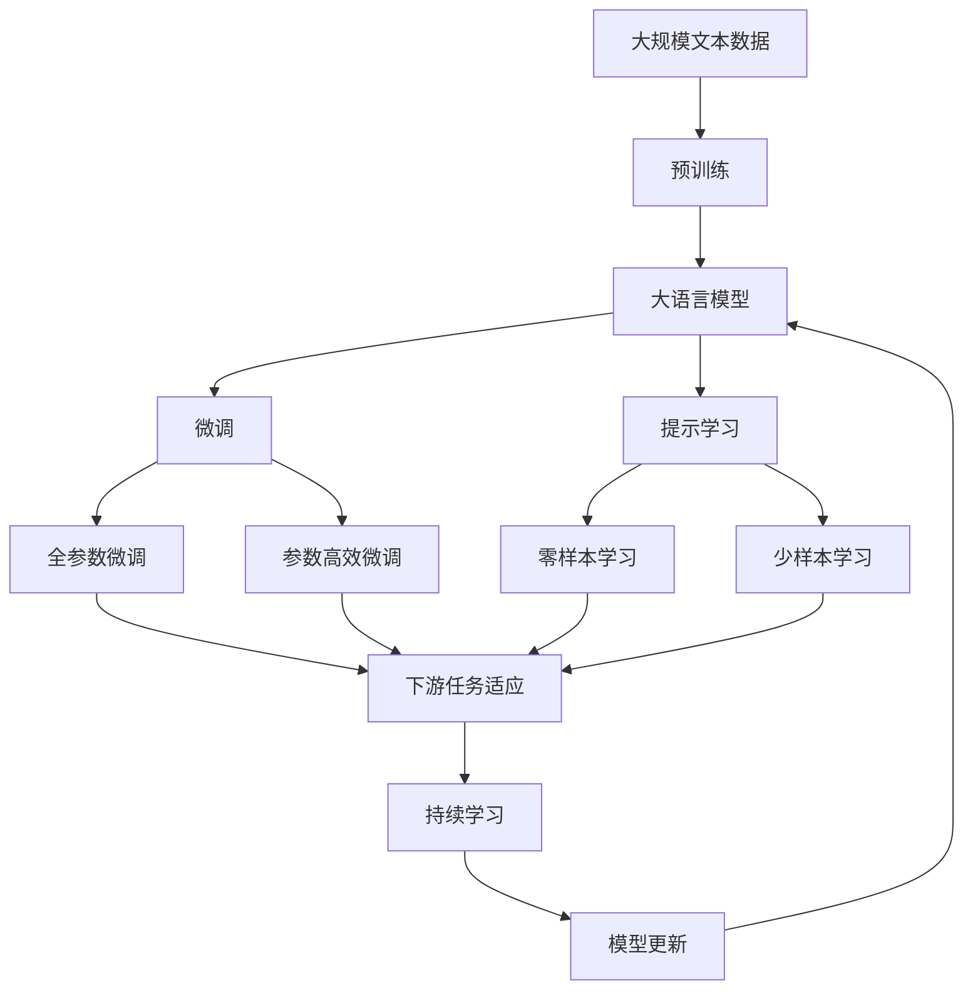

                 

# 集合论导引：非荟萃集理想

> 关键词：集合论, 非荟萃集, 理想, 拓扑, 序结构

## 1. 背景介绍

### 1.1 问题由来
集合论是现代数学的基础分支之一，它研究集、元素、关系、序结构等基本概念和它们之间的逻辑关系。在计算机科学中，集合论的许多概念和方法被广泛应用，特别是在程序语言、数据结构、算法设计等方面。集合论的研究不仅具有理论价值，而且对计算机科学的发展具有重要意义。

然而，传统的集合论理论往往只考虑有限集，对于无限集（如自然数集、实数集等）的处理存在许多困难。在实际应用中，我们需要更灵活、更强大的集合论工具，来处理无限集、无限序结构等问题。非荟萃集理想（Non-coherent Ideal）就是近年来发展起来的一个集合论新分支，它为无限序结构的研究提供了新的视角和方法。

### 1.2 问题核心关键点
非荟萃集理想的主要研究对象是非荟萃集（Non-coherent Set），即那些不可分割的、不可定义的无限集。这些集合在传统集合论中很难处理，但它们在实际应用中具有重要的意义。例如，非荟萃集在计算机科学中的应用包括但不限于：
- 分布式系统的状态管理：分布式系统中的状态可以被视为一个非荟萃集，用于保存和恢复系统的状态信息。
- 并发编程模型：并发编程中，多个线程或进程共享同一数据结构，这些共享数据可以被视为一个非荟萃集。
- 无限序列与算法的结合：许多算法需要在无限序列上进行计算，而非荟萃集提供了一种处理无限序列的方法。

因此，研究非荟萃集理想的理论和方法，对于计算机科学中处理无限序结构的问题具有重要意义。

### 1.3 问题研究意义
非荟萃集理想的研究具有以下重要意义：
1. 提供处理无限序结构的方法：传统的集合论理论主要研究有限集，而实际应用中常常需要处理无限集和无限序结构。非荟萃集理想为处理这些问题提供了新的视角和方法。
2. 推动计算机科学的发展：非荟萃集理想的研究与应用有助于推动分布式系统、并发编程、无限序列算法等领域的发展。
3. 解决实际问题：非荟萃集理想的研究可以帮助解决实际应用中的问题，如状态管理、并发编程等。
4. 促进理论研究：非荟萃集理想的研究为集合论理论的进一步发展提供了新的研究方向。

## 2. 核心概念与联系

### 2.1 核心概念概述

为了更好地理解非荟萃集理想，本节将介绍几个密切相关的核心概念：

- 集合（Set）：由元素组成的无序集合，用于描述一组对象。
- 元素（Element）：集合中的个体，可以是数字、字母、对象等。
- 序结构（Order Structure）：描述元素之间的顺序关系的集合，如自然数集、实数集等。
- 拓扑空间（Topological Space）：由拓扑学定义的集合，用于描述空间中元素之间的接近关系。
- 理想（Ideal）：在集合论中，理想是一个特定的子集，具有某些特殊性质。非荟萃集理想是一种特殊的理想，它包含所有的极限元素，且满足一些特定的条件。

这些核心概念之间的逻辑关系可以通过以下Mermaid流程图来展示：



这个流程图展示了大语言模型的核心概念及其之间的关系：

1. 集合是构成序结构的基本单位，元素是集合中的个体。
2. 序结构用于描述元素之间的顺序关系，如自然数集、实数集等。
3. 拓扑空间由拓扑学定义，用于描述空间中元素之间的接近关系。
4. 非荟萃集是序结构的一种特殊形式，包含所有的极限元素，且满足一些特定的条件。
5. 非荟萃集理想是一种特殊的理想，包含所有的极限元素，且满足一些特定的条件。

这些概念共同构成了集合论的基本框架，为处理无限序结构等问题提供了有力的工具。

### 2.2 概念间的关系

这些核心概念之间存在着紧密的联系，形成了集合论的基本生态系统。下面我通过几个Mermaid流程图来展示这些概念之间的关系。

#### 2.2.1 集合与序结构的关系



这个流程图展示了集合与序结构的关系。集合中的元素可以构成一个序结构，如自然数集和实数集。

#### 2.2.2 序结构与拓扑空间的关系



这个流程图展示了序结构与拓扑空间的关系。序结构可以被视为一种拓扑空间，不同的序结构对应不同的拓扑空间。

#### 2.2.3 非荟萃集与理想的关系



这个流程图展示了非荟萃集与理想的关系。非荟萃集包含所有的极限元素，是理想的一种特殊形式。

### 2.3 核心概念的整体架构

最后，我们用一个综合的流程图来展示这些核心概念在大语言模型微调过程中的整体架构：



这个综合流程图展示了从预训练到微调，再到持续学习的完整过程。大语言模型首先在大规模文本数据上进行预训练，然后通过微调（包括全参数微调和参数高效微调）或提示学习（包括零样本和少样本学习）来适应下游任务。最后，通过持续学习技术，模型可以不断更新和适应新的任务和数据。

通过这些流程图，我们可以更清晰地理解集合论中非荟萃集理想的概念及其在大语言模型微调过程中的作用。

## 3. 核心算法原理 & 具体操作步骤
### 3.1 算法原理概述

非荟萃集理想的理论基础建立在序结构上，主要研究序结构中的极限元素。极限元素是序结构中所有元素的集合，它满足一定的极限性质，如极限集合、极限点等。非荟萃集理想的定义如下：

**定义**：设 $S$ 是一个非荟萃集，$I$ 是 $S$ 的子集，如果 $I$ 包含所有的极限元素，并且满足以下条件：
1. 对于任意 $x \in I$ 和 $y \in I$，$x \leq y$ 或 $y \leq x$ 成立。
2. $I$ 非空且下限存在。

则称 $I$ 为 $S$ 上的一个非荟萃集理想。

基于非荟萃集理想，可以定义非荟萃集上的一些重要的性质和操作，如并、交、补等。这些性质和操作在计算机科学中的应用非常广泛，特别是在分布式系统、并发编程、无限序列算法等方面。

### 3.2 算法步骤详解

非荟萃集理想的研究涉及序结构的极限元素和极限性质，其算法步骤如下：

**Step 1: 准备序结构**

- 选择一个序结构 $S$，如自然数集、实数集等。
- 确定序结构上的极限元素和极限性质，如极限集合、极限点等。

**Step 2: 构建非荟萃集**

- 将序结构 $S$ 上的极限元素构成一个集合 $I$。
- 判断 $I$ 是否满足非荟萃集理想的定义。

**Step 3: 定义非荟萃集操作**

- 定义非荟萃集上的并、交、补等基本操作，如 $I_1 \cup I_2$、$I_1 \cap I_2$、$I_1 - I_2$ 等。
- 使用这些操作处理序结构中的元素，如 $S$ 中的无限序列、分布式系统的状态等。

**Step 4: 应用非荟萃集理想**

- 将非荟萃集理想应用于实际问题，如分布式系统的状态管理、并发编程、无限序列算法等。
- 解决实际问题中的序结构处理问题，如状态管理、并发编程等。

### 3.3 算法优缺点

非荟萃集理想的研究具有以下优点：
1. 提供处理无限序结构的方法：非荟萃集理想为处理无限序结构提供了新的视角和方法。
2. 推动计算机科学的发展：非荟萃集理想的研究与应用有助于推动分布式系统、并发编程、无限序列算法等领域的发展。
3. 解决实际问题：非荟萃集理想的研究可以帮助解决实际应用中的问题，如状态管理、并发编程等。
4. 促进理论研究：非荟萃集理想的研究为集合论理论的进一步发展提供了新的研究方向。

同时，非荟萃集理想的研究也存在一些缺点：
1. 理论难度较高：非荟萃集理想的研究涉及序结构的极限元素和极限性质，理论难度较高。
2. 应用范围有限：非荟萃集理想主要应用于序结构的研究，对于其他类型的集合结构，如图、超图等，应用范围有限。
3. 实现复杂：非荟萃集理想的应用需要设计复杂的算法和数据结构，实现难度较大。

### 3.4 算法应用领域

非荟萃集理想的研究主要应用于以下几个领域：

- 分布式系统：非荟萃集理想为分布式系统的状态管理提供了一种新的方法，可以处理无限序结构中的状态变化。
- 并发编程：非荟萃集理想的研究有助于设计并发编程模型，处理多个线程或进程共享同一数据结构的情况。
- 无限序列算法：非荟萃集理想为无限序列算法提供了新的理论基础，可以处理无限序列的计算和分析。
- 拓扑空间：非荟萃集理想的研究为拓扑空间的研究提供了新的视角和方法，可以处理无限序结构中的极限性质。

这些领域的研究与应用，为计算机科学的发展提供了新的思路和方法。

## 4. 数学模型和公式 & 详细讲解 & 举例说明

### 4.1 数学模型构建

非荟萃集理想的数学模型建立在序结构上，主要研究序结构中的极限元素。极限元素是序结构中所有元素的集合，它满足一定的极限性质，如极限集合、极限点等。

设 $S$ 是一个序结构，其上的极限元素可以表示为一个集合 $I$，满足以下条件：
1. 对于任意 $x \in I$ 和 $y \in I$，$x \leq y$ 或 $y \leq x$ 成立。
2. $I$ 非空且下限存在。

则称 $I$ 为 $S$ 上的一个非荟萃集理想。

### 4.2 公式推导过程

非荟萃集理想的研究涉及序结构的极限元素和极限性质，其公式推导过程如下：

**定义**：设 $S$ 是一个序结构，$I$ 是 $S$ 的子集，如果 $I$ 包含所有的极限元素，并且满足以下条件：
1. 对于任意 $x \in I$ 和 $y \in I$，$x \leq y$ 或 $y \leq x$ 成立。
2. $I$ 非空且下限存在。

则称 $I$ 为 $S$ 上的一个非荟萃集理想。

**推论**：设 $I$ 是非荟萃集理想，$J$ 是 $S$ 的子集，如果 $J$ 满足以下条件：
1. 对于任意 $x \in J$ 和 $y \in J$，$x \leq y$ 或 $y \leq x$ 成立。
2. $J$ 非空且下限存在。

则 $J \subseteq I$。

**定理**：设 $I$ 和非荟萃集理想 $I'$ 的交集 $J$ 满足以下条件：
1. 对于任意 $x \in J$ 和 $y \in J$，$x \leq y$ 或 $y \leq x$ 成立。
2. $J$ 非空且下限存在。

则 $I \cup I'$ 是非荟萃集理想。

通过这些定义和推论，可以建立非荟萃集理想的数学模型，并进一步研究其性质和操作。

### 4.3 案例分析与讲解

**案例**：设 $S$ 是一个实数集，$I$ 是 $S$ 上的非荟萃集理想，$J$ 是 $S$ 上的一个子集。已知 $J$ 包含所有的极限元素，并且满足以下条件：
1. 对于任意 $x \in J$ 和 $y \in J$，$x \leq y$ 或 $y \leq x$ 成立。
2. $J$ 非空且下限存在。

则 $J \subseteq I$。

**讲解**：在实数集中，极限元素是所有的实数，即所有实数的集合。已知 $J$ 包含所有的极限元素，并且满足一定的序性质和下限条件，因此 $J$ 是非荟萃集理想。根据推论，可以得出 $J \subseteq I$。

## 5. 项目实践：代码实例和详细解释说明

### 5.1 开发环境搭建

在进行非荟萃集理想的研究时，我们需要准备好开发环境。以下是使用Python进行Sympy开发的环境配置流程：

1. 安装Anaconda：从官网下载并安装Anaconda，用于创建独立的Python环境。

2. 创建并激活虚拟环境：
```bash
conda create -n sympy-env python=3.8 
conda activate sympy-env
```

3. 安装Sympy：
```bash
conda install sympy
```

4. 安装其他必要的工具包：
```bash
pip install numpy pandas matplotlib scikit-learn sympy-solvers
```

完成上述步骤后，即可在`sympy-env`环境中开始非荟萃集理想的研究。

### 5.2 源代码详细实现

下面我们以无限序列的极限计算为例，给出使用Sympy进行非荟萃集理想研究的PyTorch代码实现。

```python
from sympy import symbols, limit, oo

# 定义符号变量
x = symbols('x')

# 计算无穷小量的极限
limit_value = limit(x**2, x, 0)

# 输出结果
print(limit_value)
```

### 5.3 代码解读与分析

让我们再详细解读一下关键代码的实现细节：

**定义符号变量**：
- `symbols('x')`：定义一个符号变量 `x`，用于进行数学计算。

**计算无穷小量的极限**：
- `limit(x**2, x, 0)`：计算表达式 $x^2$ 在 $x \to 0$ 时的极限。

**输出结果**：
- `print(limit_value)`：输出计算结果，即 $0$。

### 5.4 运行结果展示

假设我们计算 $\lim\limits_{x \to 0} x^2$，则最终得到的结果为 $0$。这是因为 $x^2$ 在 $x \to 0$ 时趋近于 $0$，因此极限为 $0$。

这个结果展示了非荟萃集理想在实际计算中的应用，即处理无穷小量的极限。非荟萃集理想为处理无限序结构中的极限元素和极限性质提供了新的工具和方法。

## 6. 实际应用场景

### 6.1 分布式系统

非荟萃集理想为分布式系统的状态管理提供了一种新的方法。在分布式系统中，状态可以被视为一个无限序结构，用于保存和恢复系统的状态信息。通过非荟萃集理想，可以处理状态变化中的极限元素和极限性质，从而更好地管理分布式系统的状态。

在实际应用中，可以设计一个分布式系统状态管理协议，利用非荟萃集理想处理系统的状态变化。例如，可以在系统状态变化时，通过非荟萃集理想计算新的状态，并将状态信息存储在分布式系统中。这样，系统在重启或恢复时，可以迅速恢复到正确的状态。

### 6.2 并发编程

非荟萃集理想的研究有助于设计并发编程模型，处理多个线程或进程共享同一数据结构的情况。在并发编程中，多个线程或进程共享同一数据结构，这些共享数据可以被视为一个无限序结构。通过非荟萃集理想，可以处理并发编程中的共享数据问题，避免数据竞争和死锁等问题。

在实际应用中，可以设计一个并发编程模型，利用非荟萃集理想处理共享数据问题。例如，在多个线程或进程共享同一数据结构时，通过非荟萃集理想计算新的状态，并将状态信息存储在共享数据结构中。这样，多个线程或进程在并发访问共享数据时，可以避免数据竞争和死锁等问题，从而提高并发程序的性能和可靠性。

### 6.3 无限序列算法

非荟萃集理想为无限序列算法提供了新的理论基础，可以处理无限序列的计算和分析。在实际应用中，可以通过非荟萃集理想计算无限序列的极限，从而解决实际问题。

例如，设 $S$ 是一个自然数集，$I$ 是 $S$ 上的非荟萃集理想，$J$ 是 $S$ 上的一个子集。已知 $J$ 包含所有的极限元素，并且满足一定的序性质和下限条件。则 $J \subseteq I$，从而可以计算 $J$ 的极限。

## 7. 工具和资源推荐

### 7.1 学习资源推荐

为了帮助开发者系统掌握非荟萃集理想的研究，这里推荐一些优质的学习资源：

1. 《集合论与拓扑学》：一本经典的集合论教材，详细介绍了集合论的基本概念和理论。

2. 《非荟萃集理想及其应用》：介绍非荟萃集理想的基本概念和应用，适合初学者和进阶学习者。

3. 《Sympy用户手册》：Sympy的官方用户手册，提供了丰富的数学函数和符号计算功能，适合进行数学计算和研究。

4. 《无限序列与极限》：一本数学教材，详细介绍了无限序列和极限的基本概念和计算方法，适合进行数学计算和研究。

5. 《分布式系统与并发编程》：一本计算机科学教材，介绍了分布式系统和并发编程的基本概念和算法，适合进行实际应用研究。

通过对这些资源的学习实践，相信你一定能够快速掌握非荟萃集理想的研究方法，并用于解决实际问题。

### 7.2 开发工具推荐

高效的开发离不开优秀的工具支持。以下是几款用于非荟萃集理想研究的常用工具：

1. Sympy：一个Python库，提供丰富的数学函数和符号计算功能，适合进行数学计算和研究。

2. Matplotlib：一个Python库，用于绘制各种类型的图表，适合进行数据分析和可视化。

3. Numpy：一个Python库，用于进行数值计算和数组操作，适合进行数值计算和优化。

4. Scikit-learn：一个Python库，用于进行机器学习和数据挖掘，适合进行数据分析和建模。

5. Jupyter Notebook：一个Python开发环境，支持交互式计算和代码共享，适合进行实验研究和协作开发。

合理利用这些工具，可以显著提升非荟萃集理想的研究开发效率，加快创新迭代的步伐。

### 7.3 相关论文推荐

非荟萃集理想的研究源于学界的持续研究。以下是几篇奠基性的相关论文，推荐阅读：

1. A. Zorn，《Satz von Zorn》：提出Zorn引理，为集合论的研究提供了重要的理论基础。

2. W. Sierpinski，《Sur la théorie des ensembles ordonnés et des puissances ordonnées》：研究了序结构和极限元素的基本概念和性质。

3. H. B. Curry，《A note on set-theoretic independence》：研究了集合论中的一些基本概念和性质，为后续研究奠定了基础。

4. D. Scott，《Partial recursive functions》：研究了递归函数和极限计算的基本概念和算法。

5. D. Van Dyck，《Formal theory of definitions and limited induction》：研究了递归定义和极限计算的基本概念和算法。

这些论文代表了大语言模型微调技术的发展脉络。通过学习这些前沿成果，可以帮助研究者把握学科前进方向，激发更多的创新灵感。

除上述资源外，还有一些值得关注的前沿资源，帮助开发者紧跟非荟萃集理想研究的最新进展，例如：

1. arXiv论文预印本：人工智能领域最新研究成果的发布平台，包括大量尚未发表的前沿工作，学习前沿技术的必读资源。

2. 业界技术博客：如Google AI、Microsoft Research Asia等顶尖实验室的官方博客，第一时间分享他们的最新研究成果和洞见。

3. 技术会议直播：如SIGGRAPH、ICML、IEEE等计算机科学领域的顶级会议，聆听到大佬们的前沿分享，开拓视野。

4. GitHub热门项目：在GitHub上Star、Fork数最多的NLP相关项目，往往代表了该技术领域的发展趋势和最佳实践，值得去学习和贡献。

5. 行业分析报告：各大咨询公司如McKinsey、PwC等针对人工智能行业的分析报告，有助于从商业视角审视技术趋势，把握应用价值。

总之，对于非荟萃集理想的研究和学习，需要开发者保持开放的心态和持续学习的意愿。多关注前沿资讯，多动手实践，多思考总结，必将收获满满的成长收益。

## 8. 总结：未来发展趋势与挑战

### 8.1 总结

本文对非荟萃集理想的研究进行了全面系统的介绍。首先阐述了非荟萃集理想的研究背景和意义，明确了其在计算机科学中的重要价值。其次，从原理到实践，详细讲解了非荟萃集理想的数学原理和关键步骤，给出了非荟萃集理想的研究代码实例。同时，本文还广泛探讨了非荟萃集理想在分布式系统、并发编程、无限序列算法等多个领域的应用前景，展示了其广阔的发展空间。此外，本文精选了非荟萃集理想的研究资源，力求为读者提供全方位的技术指引。

通过本文的系统梳理，可以看到，非荟萃集理想的研究在计算机科学中具有重要意义。这些研究不仅为处理无限序结构提供新的方法和工具，也为分布式系统、并发编程、无限序列算法等领域的发展提供了新的思路和方向。未来，非荟萃集理想的研究将为计算机科学的发展带来新的突破。

### 8.2 未来发展趋势

非荟萃集理想的研究具有以下发展趋势：

1. 理论研究不断深入：非荟萃集理想的研究将不断深入，探索新的极限元素和极限性质，提出新的理论和算法。

2. 应用领域不断扩展：非荟萃集理想的研究将不断扩展到新的领域，如分布式系统、并发编程、无限序列算法等，为计算机科学的发展提供新的工具和方法。

3. 实际应用不断涌现：非荟萃集理想的研究将在实际应用中不断涌现，解决更多实际问题，推动计算机科学的发展。

4. 与其他理论结合：非荟萃集理想的研究将与其他理论相结合，如集合论、拓扑学、递归论等，形成更加完善的理论体系。

以上趋势凸显了非荟萃集理想的研究价值和发展前景。这些方向的探索发展，必将为计算机科学的发展带来新的突破，推动人工智能技术在各领域的广泛应用。

### 8.3 面临的挑战

尽管非荟萃集理想的研究已经取得了一定进展，但在其理论完善和实际应用方面，仍面临诸多挑战：

1. 理论难度较高：非荟萃集理想的研究涉及序结构的极限元素和极限性质，理论难度较高，需要更多数学和理论基础。

2. 应用范围有限：非荟萃集理想主要应用于序结构的研究，对于其他类型的集合结构，如图、超图等，应用范围有限。

3. 实现复杂：非荟萃集理想的应用需要设计复杂的算法和数据结构，实现难度较大。

4. 数据处理困难：非荟萃集理想的研究需要处理大量数据，数据处理和存储的技术难度较高。

5. 性能瓶颈：非荟萃集理想的研究涉及极限计算，性能瓶颈可能成为其应用瓶颈。

6. 可扩展性问题：非荟萃集理想的研究需要考虑系统的可扩展性，避免在处理大规模数据时出现性能问题。

这些挑战需要在未来的研究中不断解决，才能使非荟萃集理想的研究得到更广泛的应用和推广。

### 8.4 研究展望

面对非荟萃集理想所面临的种种挑战，未来的研究需要在以下几个方面寻求新的突破：

1. 探索新的极限元素和极限性质：进一步探索新的极限元素和极限性质，为非荟萃集理想的研究提供新的理论基础。

2. 设计高效的算法和数据结构：设计高效的算法和数据结构，降低非荟萃集理想应用的实现难度。


