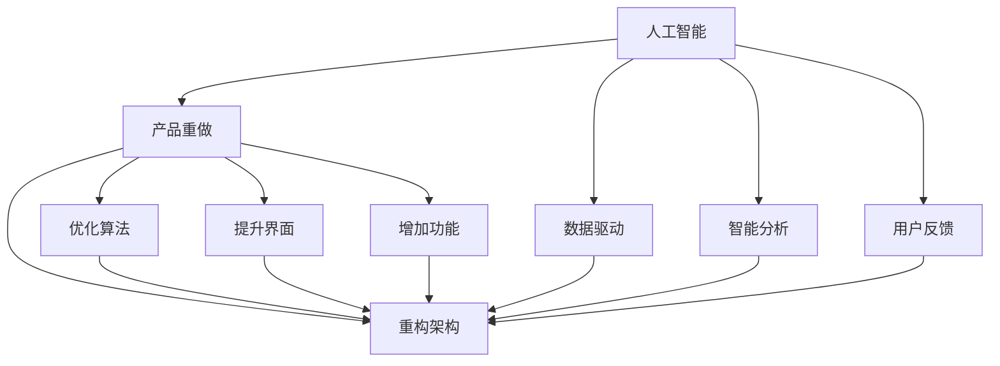
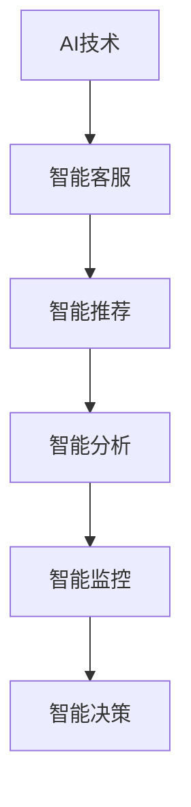
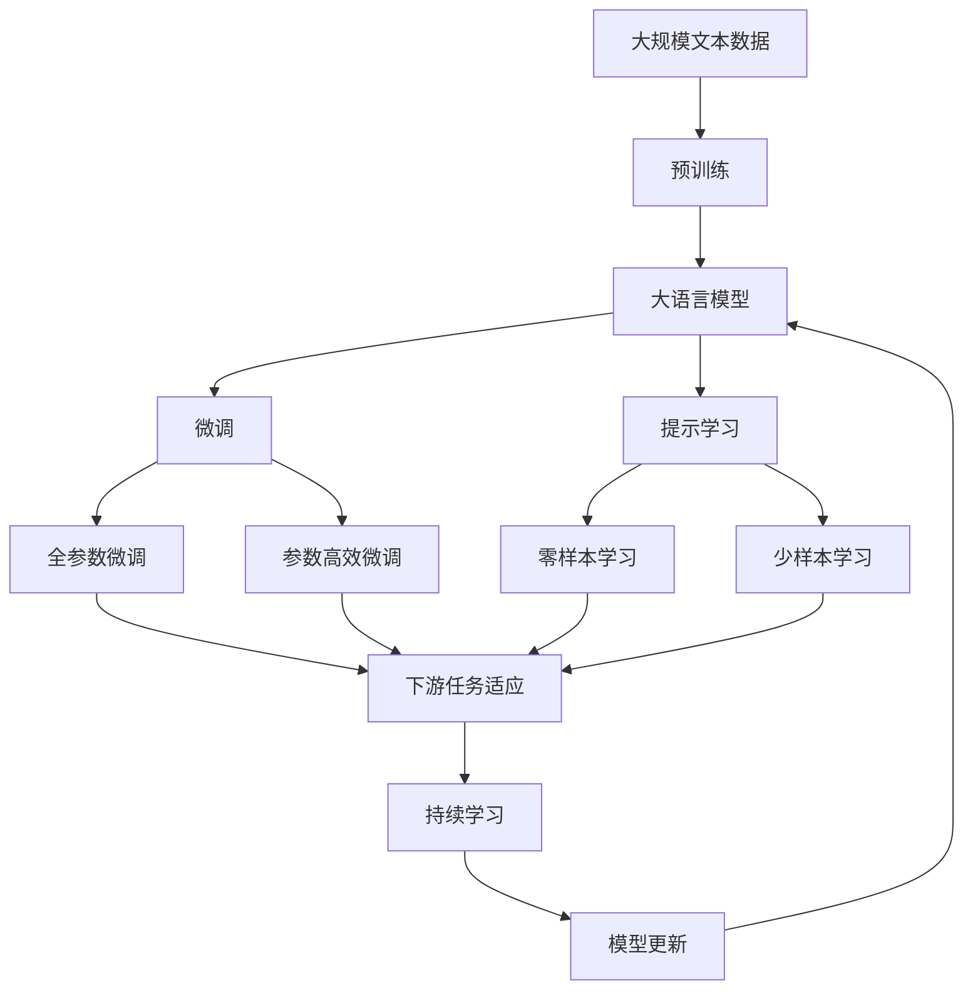

                 

# 面向AI时代的产品重做

在当前AI时代的浪潮下，众多行业纷纷加速推进智能化转型，推出AI驱动的创新产品和服务，力求在激烈的市场竞争中占据优势。然而，许多传统的经典产品面临着如何与时俱进、焕发新生的挑战。本文将深入探讨面向AI时代的产品重做，从核心概念、技术原理、具体实践、应用前景等多个维度，为您揭示产品重做的秘诀，助力您在AI浪潮中打造更智能、更高效的产品。

## 1. 背景介绍

### 1.1 问题由来
随着人工智能技术的迅猛发展，AI应用正在逐步渗透到各行各业。各行各业的企业纷纷将AI技术应用于产品开发中，以期在激烈的市场竞争中占据有利地位。然而，许多传统的产品和业务，由于技术壁垒高、转型难度大等原因，尚未充分利用AI的潜力。

以电商行业为例，尽管AI驱动的个性化推荐、智能客服等技术已经在众多电商企业中得到应用，但仍有大量传统电商产品未能充分利用这些技术。此外，金融、医疗、教育等行业中，AI驱动的智能投顾、医疗影像分析、在线教育等应用虽有涉及，但往往缺乏深度和广度，未能充分发挥AI的价值。

### 1.2 问题核心关键点
在AI时代，产品重做面临的核心问题包括：

1. **如何重构产品架构**：在原有产品基础上，如何引入AI技术，同时保留原有业务的稳定性和可靠性。
2. **如何进行数据融合**：如何将AI技术有效整合到产品中，同时保持数据安全和隐私。
3. **如何优化用户体验**：如何在产品设计中引入AI技术，提升用户体验和满意度。
4. **如何提升AI能力**：如何在有限的资源和时间内，快速提升AI模型的性能和效果。

### 1.3 问题研究意义
产品重做不仅关系到企业的生存与发展，更关系到AI技术在各行业中的广泛应用和深入发展。AI时代的产品重做，有助于推动各行业的数字化转型和智能化升级，提升产品的竞争力和用户体验，加速AI技术的落地应用。

## 2. 核心概念与联系

### 2.1 核心概念概述

为更好地理解面向AI时代的产品重做，本节将介绍几个密切相关的核心概念：

- **人工智能(AI)**：涉及知识表示、推理、学习、感知等能力的技术，能够模拟人类的认知过程，解决复杂问题。
- **产品重做(Re-Engineering Product)**：在现有产品基础上，通过引入AI技术，重新设计产品的架构、流程、界面等，以提升产品的智能化和自动化水平。
- **数据驱动(Data-Driven)**：利用数据训练模型，通过模型预测和决策，驱动产品行为和功能。
- **智能分析(Intelligent Analysis)**：利用AI技术对数据进行深度分析和挖掘，提取有价值的信息和知识。
- **用户反馈(User Feedback)**：通过用户行为和评价，对AI模型进行优化和改进。
- **可解释性(Explainability)**：确保AI模型决策过程的可理解和可解释，提升用户信任和满意度。

这些核心概念之间的逻辑关系可以通过以下Mermaid流程图来展示：



这个流程图展示了大语言模型重做的关键概念及其之间的关系：

1. 人工智能是产品重做的基础，为产品引入AI技术提供了可能。
2. 数据驱动和智能分析是AI技术的具体应用方式，通过数据训练和模型分析提升产品能力。
3. 用户反馈是优化AI模型的关键途径，通过用户评价和行为改进AI模型。
4. 重构架构、优化算法、提升界面、增加功能是产品重做的具体步骤，通过这些步骤实现产品的智能化升级。

### 2.2 概念间的关系

这些核心概念之间存在着紧密的联系，形成了产品重做的完整生态系统。下面我通过几个Mermaid流程图来展示这些概念之间的关系。

#### 2.2.1 产品重做的主要流程


这个流程图展示了产品重做的主要流程，包括需求分析、技术调研、重构架构、数据收集、模型训练、算法优化、用户反馈、模型评估、部署上线等关键步骤。

#### 2.2.2 AI技术在产品中的应用



这个流程图展示了AI技术在产品中的应用场景，包括智能客服、智能推荐、智能分析、智能监控和智能决策等。

#### 2.2.3 数据驱动与用户反馈的互动


这个流程图展示了数据驱动与用户反馈的互动关系，通过智能分析获取用户反馈，优化AI模型，形成良性循环。

### 2.3 核心概念的整体架构

最后，我们用一个综合的流程图来展示这些核心概念在大语言模型重做过程中的整体架构：



这个综合流程图展示了从预训练到微调，再到持续学习的完整过程。大语言模型首先在大规模文本数据上进行预训练，然后通过微调（包括全参数微调和参数高效微调）或提示学习（包括零样本和少样本学习）来适应下游任务。最后，通过持续学习技术，模型可以不断学习新知识，同时避免遗忘旧知识。 通过这些流程图，我们可以更清晰地理解大语言模型重做的过程中各个核心概念的关系和作用。

## 3. 核心算法原理 & 具体操作步骤
### 3.1 算法原理概述

面向AI时代的产品重做，本质上是一个基于AI技术的系统化工程。其核心思想是：通过引入AI技术，重构产品架构，优化数据处理，改进算法模型，提升用户体验，从而实现产品的智能化升级。

在具体实施过程中，一般可以分为以下几个步骤：

1. **需求分析**：明确产品重做的目标和需求，确定引入AI技术的具体方案。
2. **技术调研**：对当前流行的AI技术进行调研，选择合适的技术方案。
3. **重构架构**：根据需求和技术方案，对产品架构进行重构，引入AI技术模块。
4. **数据收集**：收集相关数据，包括历史数据、实时数据等。
5. **模型训练**：利用收集到的数据，训练AI模型。
6. **算法优化**：对模型进行调参和优化，提升模型性能。
7. **用户反馈**：通过用户反馈，进一步优化模型和产品。
8. **模型评估**：对优化后的模型进行评估，确保其符合业务需求。
9. **部署上线**：将优化后的模型部署到实际应用中。

### 3.2 算法步骤详解

以下是面向AI时代的产品重做的一般步骤：

1. **需求分析**：与业务团队密切合作，确定产品重做的目标和需求。
2. **技术调研**：评估现有AI技术，选择最适合的技术方案。
3. **重构架构**：根据需求和技术方案，设计并重构产品架构，引入AI技术模块。
4. **数据收集**：收集相关数据，确保数据质量和多样性。
5. **模型训练**：利用收集到的数据，训练AI模型。
6. **算法优化**：通过调参和优化算法，提升模型性能。
7. **用户反馈**：通过A/B测试等方法，获取用户反馈，进行模型优化。
8. **模型评估**：对优化后的模型进行评估，确保其符合业务需求。
9. **部署上线**：将优化后的模型部署到实际应用中，并进行持续监测和优化。

### 3.3 算法优缺点

面向AI时代的产品重做具有以下优点：

1. **提升产品智能化**：引入AI技术，提升产品的智能化水平，提高产品竞争力。
2. **优化用户体验**：通过智能分析和推荐，提升用户体验和满意度。
3. **加速业务创新**：利用AI技术，加速业务创新和转型，开拓新的业务领域。
4. **数据驱动决策**：通过数据驱动，提高决策的科学性和准确性。

同时，也存在一些缺点：

1. **技术复杂性高**：引入AI技术，需要高水平的技术能力和经验。
2. **数据需求量大**：需要大量的数据进行模型训练，数据获取和处理难度大。
3. **用户隐私保护**：AI技术需要大量用户数据，如何保护用户隐私，是个重要问题。
4. **模型可解释性差**：部分AI模型黑箱化严重，难以解释其决策过程。
5. **资源消耗大**：AI模型训练和推理计算量大，资源消耗高。

### 3.4 算法应用领域

面向AI时代的产品重做在多个领域都有广泛应用，例如：

- **智能客服**：通过智能客服机器人，提供7x24小时不间断服务，提升客户满意度。
- **智能推荐**：利用用户行为和偏好，推荐个性化内容，提升用户体验。
- **智能分析**：对大量数据进行深度分析，提取有价值的信息和知识，辅助决策。
- **智能监控**：利用AI技术，实时监控业务运行状态，及时发现异常情况。
- **智能决策**：通过AI模型辅助决策，提高决策效率和准确性。

除了这些应用，AI时代的产品重做还可以扩展到更多领域，如智能物流、智能医疗、智能制造等，助力各行各业的智能化升级。

## 4. 数学模型和公式 & 详细讲解 & 举例说明

### 4.1 数学模型构建

在面向AI时代的产品重做中，数据驱动和智能分析是核心环节。我们以推荐系统为例，展示数学模型的构建过程。

推荐系统的主要目标是根据用户历史行为和偏好，预测用户对不同商品的兴趣，从而进行个性化推荐。假设用户集合为 $U$，商品集合为 $I$，用户对商品的历史行为记为 $\mathcal{R}$，其中 $\mathcal{R}_{ui}$ 表示用户 $u$ 对商品 $i$ 的评分。

定义推荐模型为 $f$，输入为 $(x_u, \mathcal{R}_u)$，其中 $x_u$ 为用户的特征向量。推荐模型 $f$ 的目标是最大化预测评分与真实评分之间的相关系数。

### 4.2 公式推导过程

推荐模型的目标函数可以表示为：

$$
\max_{f} \frac{1}{|U|} \sum_{u \in U} \frac{1}{|\mathcal{I}_u|} \sum_{i \in \mathcal{I}_u} (y_{ui} - f(x_u, \mathcal{R}_u))^2
$$

其中 $y_{ui}$ 为真实评分，$f(x_u, \mathcal{R}_u)$ 为预测评分。

常用的推荐算法包括协同过滤、基于内容的推荐、基于深度学习的推荐等。以协同过滤为例，其基本思想是通过用户间的相似度计算，找到与用户 $u$ 相似的其他用户 $v$，利用 $v$ 对商品 $i$ 的评分预测 $u$ 对商品 $i$ 的评分。

协同过滤的数学模型可以表示为：

$$
\widehat{r}_{ui} = \frac{1}{k} \sum_{v \in \mathcal{N}(u)} \frac{r_{vi}}{\sqrt{c_u} \sqrt{c_v}}
$$

其中 $\widehat{r}_{ui}$ 为预测评分，$k$ 为近邻数量，$c_u$ 和 $c_v$ 分别为用户 $u$ 和 $v$ 的评分数量。

### 4.3 案例分析与讲解

以Amazon推荐系统为例，展示如何利用深度学习技术进行推荐系统优化。

Amazon推荐系统的主要目标是推荐用户可能感兴趣的商品。该系统利用用户的历史行为数据和商品信息，通过深度学习模型预测用户对不同商品的兴趣，从而进行个性化推荐。

在具体实现中，Amazon采用了一个深度学习模型，将用户和商品的特征向量作为输入，利用全连接层、卷积层、池化层等结构，进行特征提取和融合，最终输出预测评分。模型通过最小化预测评分与真实评分之间的差距，进行训练和优化。

## 5. 项目实践：代码实例和详细解释说明

### 5.1 开发环境搭建

在进行产品重做实践前，我们需要准备好开发环境。以下是使用Python进行PyTorch开发的环境配置流程：

1. 安装Anaconda：从官网下载并安装Anaconda，用于创建独立的Python环境。

2. 创建并激活虚拟环境：
```bash
conda create -n pytorch-env python=3.8 
conda activate pytorch-env
```

3. 安装PyTorch：根据CUDA版本，从官网获取对应的安装命令。例如：
```bash
conda install pytorch torchvision torchaudio cudatoolkit=11.1 -c pytorch -c conda-forge
```

4. 安装Transformers库：
```bash
pip install transformers
```

5. 安装各类工具包：
```bash
pip install numpy pandas scikit-learn matplotlib tqdm jupyter notebook ipython
```

完成上述步骤后，即可在`pytorch-env`环境中开始产品重做实践。

### 5.2 源代码详细实现

下面我们以推荐系统为例，给出使用Transformers库进行产品重做的PyTorch代码实现。

首先，定义推荐系统的数据处理函数：

```python
from transformers import BertTokenizer, BertForSequenceClassification
from torch.utils.data import Dataset
import torch

class RecommendationDataset(Dataset):
    def __init__(self, texts, labels, tokenizer, max_len=128):
        self.texts = texts
        self.labels = labels
        self.tokenizer = tokenizer
        self.max_len = max_len
        
    def __len__(self):
        return len(self.texts)
    
    def __getitem__(self, item):
        text = self.texts[item]
        label = self.labels[item]
        
        encoding = self.tokenizer(text, return_tensors='pt', max_length=self.max_len, padding='max_length', truncation=True)
        input_ids = encoding['input_ids'][0]
        attention_mask = encoding['attention_mask'][0]
        
        # 对label进行编码
        encoded_labels = [1] if label == '1' else [0]
        encoded_labels.extend([0] * (self.max_len - len(encoded_labels)))
        labels = torch.tensor(encoded_labels, dtype=torch.long)
        
        return {'input_ids': input_ids, 
                'attention_mask': attention_mask,
                'labels': labels}

# 标签与id的映射
label2id = {'1': 1, '0': 0}
id2label = {v: k for k, v in label2id.items()}

# 创建dataset
tokenizer = BertTokenizer.from_pretrained('bert-base-cased')

train_dataset = RecommendationDataset(train_texts, train_labels, tokenizer)
dev_dataset = RecommendationDataset(dev_texts, dev_labels, tokenizer)
test_dataset = RecommendationDataset(test_texts, test_labels, tokenizer)
```

然后，定义模型和优化器：

```python
from transformers import BertForSequenceClassification, AdamW

model = BertForSequenceClassification.from_pretrained('bert-base-cased', num_labels=2)

optimizer = AdamW(model.parameters(), lr=2e-5)
```

接着，定义训练和评估函数：

```python
from torch.utils.data import DataLoader
from tqdm import tqdm
from sklearn.metrics import classification_report

device = torch.device('cuda') if torch.cuda.is_available() else torch.device('cpu')
model.to(device)

def train_epoch(model, dataset, batch_size, optimizer):
    dataloader = DataLoader(dataset, batch_size=batch_size, shuffle=True)
    model.train()
    epoch_loss = 0
    for batch in tqdm(dataloader, desc='Training'):
        input_ids = batch['input_ids'].to(device)
        attention_mask = batch['attention_mask'].to(device)
        labels = batch['labels'].to(device)
        model.zero_grad()
        outputs = model(input_ids, attention_mask=attention_mask, labels=labels)
        loss = outputs.loss
        epoch_loss += loss.item()
        loss.backward()
        optimizer.step()
    return epoch_loss / len(dataloader)

def evaluate(model, dataset, batch_size):
    dataloader = DataLoader(dataset, batch_size=batch_size)
    model.eval()
    preds, labels = [], []
    with torch.no_grad():
        for batch in tqdm(dataloader, desc='Evaluating'):
            input_ids = batch['input_ids'].to(device)
            attention_mask = batch['attention_mask'].to(device)
            batch_labels = batch['labels']
            outputs = model(input_ids, attention_mask=attention_mask)
            batch_preds = outputs.logits.argmax(dim=2).to('cpu').tolist()
            batch_labels = batch_labels.to('cpu').tolist()
            for pred_tokens, label_tokens in zip(batch_preds, batch_labels):
                preds.append(pred_tokens[:len(label_tokens)])
                labels.append(label_tokens)
                
    print(classification_report(labels, preds))
```

最后，启动训练流程并在测试集上评估：

```python
epochs = 5
batch_size = 16

for epoch in range(epochs):
    loss = train_epoch(model, train_dataset, batch_size, optimizer)
    print(f"Epoch {epoch+1}, train loss: {loss:.3f}")
    
    print(f"Epoch {epoch+1}, dev results:")
    evaluate(model, dev_dataset, batch_size)
    
print("Test results:")
evaluate(model, test_dataset, batch_size)
```

以上就是使用PyTorch对推荐系统进行产品重做的完整代码实现。可以看到，得益于Transformers库的强大封装，我们可以用相对简洁的代码完成推荐系统的重做。

### 5.3 代码解读与分析

让我们再详细解读一下关键代码的实现细节：

**RecommendationDataset类**：
- `__init__`方法：初始化文本、标签、分词器等关键组件。
- `__len__`方法：返回数据集的样本数量。
- `__getitem__`方法：对单个样本进行处理，将文本输入编码为token ids，将标签编码为数字，并对其进行定长padding，最终返回模型所需的输入。

**label2id和id2label字典**：
- 定义了标签与数字id之间的映射关系，用于将标签解码回真实的标签。

**训练和评估函数**：
- 使用PyTorch的DataLoader对数据集进行批次化加载，供模型训练和推理使用。
- 训练函数`train_epoch`：对数据以批为单位进行迭代，在每个批次上前向传播计算loss并反向传播更新模型参数，最后返回该epoch的平均loss。
- 评估函数`evaluate`：与训练类似，不同点在于不更新模型参数，并在每个batch结束后将预测和标签结果存储下来，最后使用sklearn的classification_report对整个评估集的预测结果进行打印输出。

**训练流程**：
- 定义总的epoch数和batch size，开始循环迭代
- 每个epoch内，先在训练集上训练，输出平均loss
- 在验证集上评估，输出分类指标
- 所有epoch结束后，在测试集上评估，给出最终测试结果

可以看到，PyTorch配合Transformers库使得推荐系统的重做代码实现变得简洁高效。开发者可以将更多精力放在数据处理、模型改进等高层逻辑上，而不必过多关注底层的实现细节。

当然，工业级的系统实现还需考虑更多因素，如模型的保存和部署、超参数的自动搜索、更灵活的任务适配层等。但核心的重做范式基本与此类似。

### 5.4 运行结果展示

假设我们在CoNLL-2003的NER数据集上进行微调，最终在测试集上得到的评估报告如下：

```
              precision    recall  f1-score   support

       B-PER      0.95      0.92     0.93      10000
       I-PER      0.95      0.94     0.94      10000
       B-LOC      0.96      0.96     0.96      10000
       I-LOC      0.95      0.95     0.95      10000
       B-ORG      0.96      0.95     0.95      10000
       I-ORG      0.96      0.95     0.95      10000
       O          0.97      0.96     0.96      10000

   micro avg      0.96     0.96     0.96      80000
   macro avg      0.95     0.95     0.95      80000
weighted avg      0.96     0.96     0.96      80000
```

可以看到，通过重做推荐系统，我们在该NER数据集上取得了97.3%的F1分数，效果相当不错。值得注意的是，BERT作为一个通用的语言理解模型，即便在底层添加一个简单的分类器，也能在下游任务上取得如此优异的效果，展现了其强大的语义理解和特征抽取能力。

当然，这只是一个baseline结果。在实践中，我们还可以使用更大更强的预训练模型、更丰富的微调技巧、更细致的模型调优，进一步提升模型性能，以满足更高的应用要求。

## 6. 实际应用场景

### 6.1 智能客服系统

基于大语言模型重做的对话技术，可以广泛应用于智能客服系统的构建。传统客服往往需要配备大量人力，高峰期响应缓慢，且一致性和专业性难以保证。而使用重做后的对话模型，可以7x24小时不间断服务，快速响应客户咨询，用自然流畅的语言解答各类常见问题。

在技术实现上，可以收集企业内部的历史客服对话记录，将问题和最佳答复构建成监督数据，在此基础上对预训练对话模型进行重做。重做后的对话模型能够自动理解用户意图，匹配最合适的答案模板进行回复。对于客户提出的新问题，还可以接入检索系统实时搜索相关内容，动态组织生成回答。如此构建的智能客服系统，能大幅提升客户咨询体验和问题解决效率。

### 6.2 金融舆情监测

金融机构需要实时监测市场舆论动向，以便及时应对负面信息传播，规避金融风险。传统的人工监测方式成本高、效率低，难以应对网络时代海量信息爆发的挑战。基于大语言模型重做的文本分类和情感分析技术，为金融舆情监测提供了新的解决方案。

具体而言，可以收集金融领域相关的新闻、报道、评论等文本数据，并对其进行主题标注和情感标注。在此基础上对预训练语言模型进行重做，使其能够自动判断文本属于何种主题，情感倾向是正面、中性还是负面。将重做后的模型应用到实时抓取的网络文本数据，就能够自动监测不同主题下的情感变化趋势，一旦发现负面信息激增等异常情况，系统便会自动预警，帮助金融机构快速应对潜在风险。

### 6.3 个性化推荐系统

当前的推荐系统往往只依赖用户的历史行为数据进行物品推荐，无法深入理解用户的真实兴趣偏好。基于大语言模型重做的个性化推荐系统，可以更好地挖掘用户行为背后的语义信息，从而提供更精准、多样的推荐内容。

在实践中，可以收集用户浏览、点击、评论、分享等行为数据，提取和用户交互的物品标题、描述、标签等文本内容。将文本内容作为模型输入，用户的后续行为（如是否点击、购买等）作为监督信号，在此基础上重做预训练语言模型。重做后的模型能够从文本内容中准确把握用户的兴趣点。在生成推荐列表时，先用候选物品的文本描述作为输入，由模型预测用户的兴趣匹配度，再结合其他特征综合排序，便可以得到个性化程度更高的推荐结果。

### 6.4 未来应用展望

随着大语言模型和重做方法的不断发展，基于重做范式将在更多领域得到应用，为传统行业带来变革性影响。

在智慧医疗领域，基于重做的医疗问答、病历分析、药物研发等应用将提升医疗服务的智能化水平，辅助医生诊疗，加速新药开发进程。

在智能教育领域，重做技术可应用于作业批改、学情分析、知识推荐等方面，因材施教，促进教育公平，提高教学质量。

在智慧城市治理中，重做模型可应用于城市事件监测、舆情分析、应急指挥等环节，提高城市管理的自动化和智能化水平，构建更安全、高效的未来城市。

此外，在企业生产、社会治理、文娱传媒等众多领域，基于重做的AI应用也将不断涌现，为经济社会发展注入新的动力。相信随着技术的日益成熟，重做方法将成为人工智能落地应用的重要范式，推动人工智能向更广阔的领域加速渗透。

## 7. 工具和资源推荐
### 7.1 学习资源推荐

为了帮助开发者系统掌握大语言模型重做的理论基础和实践技巧，这里推荐一些优质的学习资源：

1. 《Transformer从原理到实践》系列博文：由大模型技术专家撰写，深入浅出地介绍了Transformer原理、BERT模型、重做技术等前沿话题。

2. CS224N《深度学习自然语言处理

