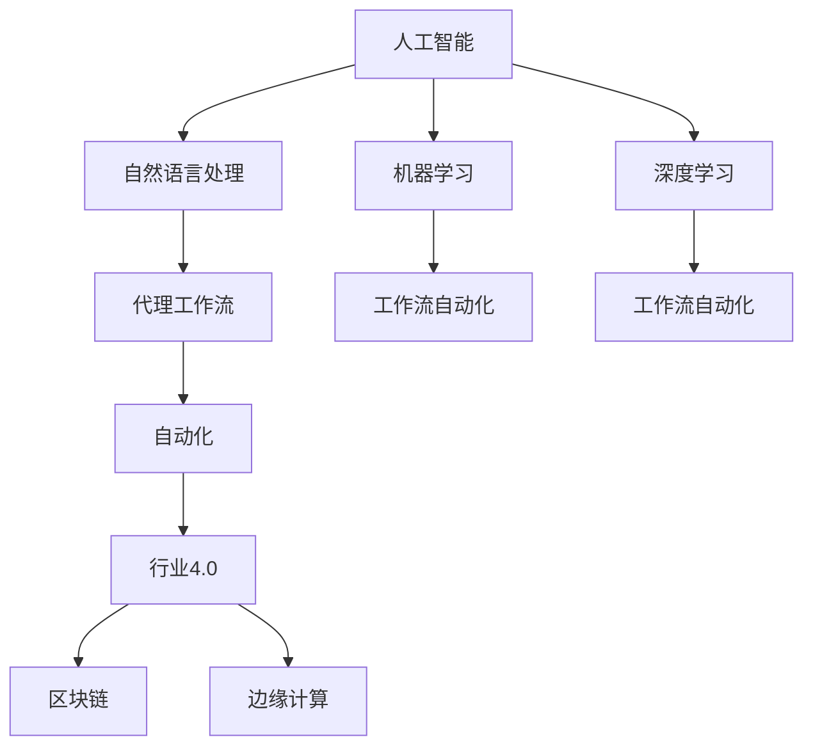
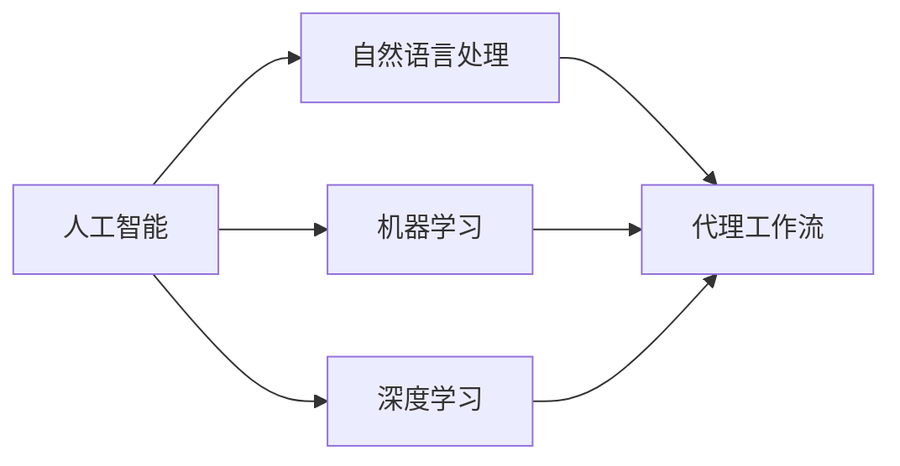
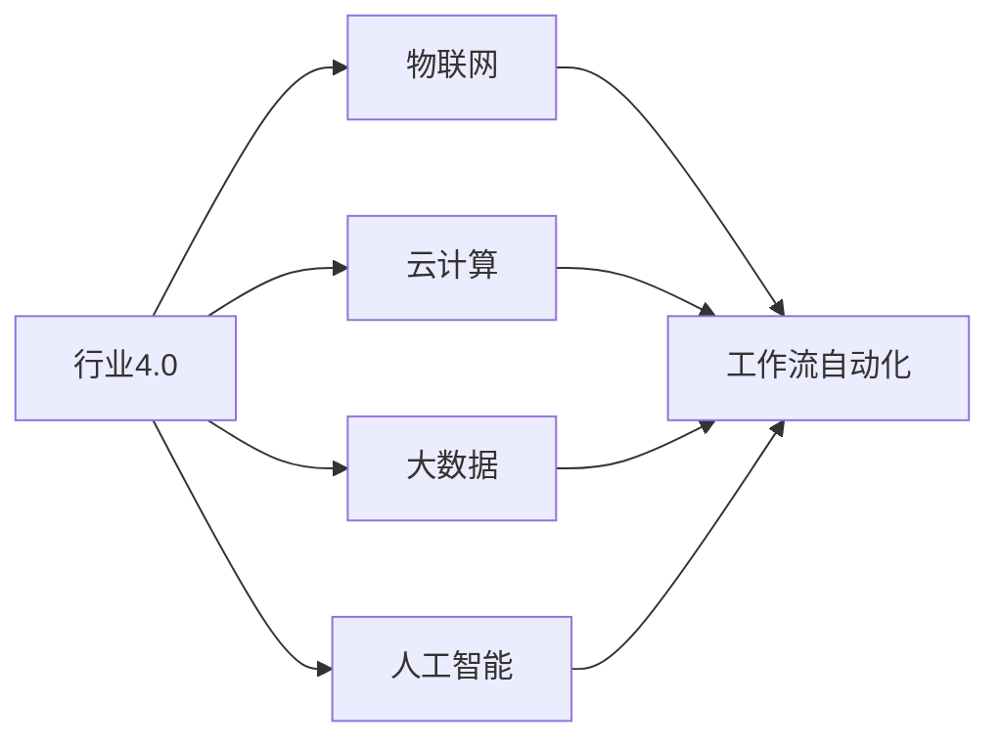
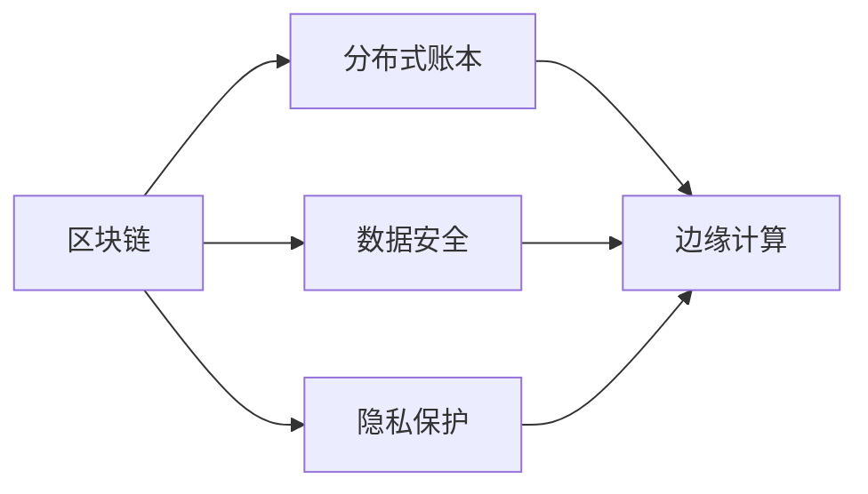
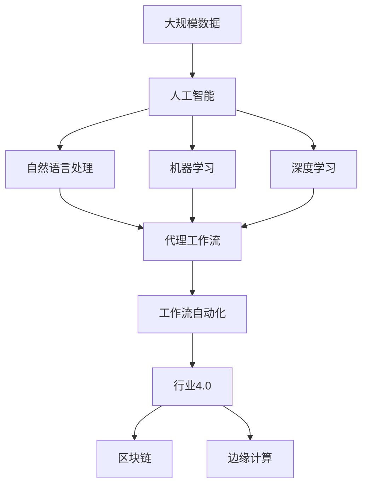

                 

# 面向行业4.0的AI代理工作流自动化解决方案

> 关键词：人工智能(AI)、代理工作流、自动化、行业4.0、生产效率提升、数据分析、机器学习、自然语言处理(NLP)、深度学习、区块链、边缘计算、工业4.0、自动化流程优化

## 1. 背景介绍

### 1.1 问题由来

在当前快速发展的数字化经济时代，各行各业都面临着前所未有的竞争压力。如何通过技术创新提高生产效率，降低运营成本，提升产品质量和服务水平，成为了企业转型的关键。在此背景下，人工智能(AI)技术应运而生，成为推动行业4.0的重要引擎。

行业4.0（Industry 4.0），也被称为智能制造4.0，是指通过信息物理系统（Cyber-Physical Systems, CPS）、物联网（IoT）、大数据、云计算等技术的融合应用，实现制造过程的智能化、自动化和定制化。在此过程中，AI代理工作流自动化解决方案（AI-based Workflow Automation Solution）扮演着核心角色，通过AI技术，自动化处理复杂的业务流程，实现生产、管理、服务的全链条智能化。

### 1.2 问题核心关键点

面向行业4.0的AI代理工作流自动化解决方案，核心在于将AI技术与传统业务流程进行深度融合，通过智能化的数据处理和决策支持，实现生产过程的自动化和优化。其核心关键点包括：

1. **AI代理**：通过自然语言处理（NLP）、机器学习（ML）、深度学习（DL）等技术，实现与用户的自然交互，智能处理任务请求。
2. **工作流自动化**：通过标准化、模块化的工作流设计，自动化处理复杂任务，提升工作效率。
3. **跨领域应用**：应用于制造、医疗、金融、物流等多个行业，提供定制化的业务解决方案。
4. **数据驱动**：基于大数据分析和处理，驱动业务决策，优化资源配置。
5. **安全性与隐私保护**：通过区块链、边缘计算等技术，保障数据安全和隐私保护。
6. **可扩展性与可定制性**：支持灵活的模块组合和功能扩展，满足不同企业的个性化需求。

### 1.3 问题研究意义

构建面向行业4.0的AI代理工作流自动化解决方案，对于提升企业生产效率、优化业务流程、降低运营成本、提升服务质量具有重要意义：

1. **提升生产效率**：通过自动化处理任务，大幅减少人工操作，提升生产效率。
2. **优化业务流程**：通过数据分析和智能决策，优化业务流程，提高资源利用率。
3. **降低运营成本**：减少人工投入和错误率，降低运营成本。
4. **提升服务质量**：通过AI技术，提供个性化、精准的服务，提升用户体验。
5. **驱动业务创新**：通过智能化的数据处理和分析，发现新业务机会，推动业务创新。
6. **保障数据安全**：通过区块链、边缘计算等技术，保障数据安全和隐私保护，避免数据泄露和滥用。

## 2. 核心概念与联系

### 2.1 核心概念概述

为更好地理解面向行业4.0的AI代理工作流自动化解决方案，本节将介绍几个密切相关的核心概念：

- **人工智能(AI)**：通过算法和模型，使计算机系统能够模拟人类智能行为的技术。
- **代理工作流(Agent Workflow)**：通过智能化的工作流设计，实现任务自动化处理，提升工作效率。
- **自动化(Automation)**：通过技术和工具，自动化执行重复性任务，减少人工操作。
- **行业4.0(Industry 4.0)**：通过物联网、云计算、大数据、人工智能等技术的融合应用，实现制造过程的智能化、自动化和定制化。
- **区块链(Blockchain)**：一种分布式账本技术，通过去中心化、透明和不可篡改的特性，保障数据安全。
- **边缘计算(Edge Computing)**：将数据处理和决策过程放在靠近数据源的本地设备上，降低延迟和带宽成本。
- **自然语言处理(NLP)**：使计算机能够理解、处理和生成人类自然语言的技术。
- **机器学习(ML)**：通过数据训练模型，使计算机具备学习能力。
- **深度学习(DL)**：一种基于神经网络的机器学习方法，通过多层次的数据抽象，实现复杂的模式识别和决策。

这些核心概念之间的逻辑关系可以通过以下Mermaid流程图来展示：



这个流程图展示了大语言模型微调过程中各个核心概念的关系：

1. 人工智能是基础，通过自然语言处理、机器学习和深度学习等技术，实现对数据的理解和处理。
2. 代理工作流是执行层面，通过智能化的工作流设计，实现任务自动化。
3. 工作流自动化是执行方式，通过自动化工具和技术，提升工作效率。
4. 行业4.0是应用场景，通过工业物联网、云计算、大数据等技术，实现生产过程的智能化、自动化和定制化。
5. 区块链和边缘计算是保障措施，通过分布式账本和本地处理，保障数据安全和隐私保护。

### 2.2 概念间的关系

这些核心概念之间存在着紧密的联系，形成了面向行业4.0的AI代理工作流自动化解决方案的完整生态系统。下面我们通过几个Mermaid流程图来展示这些概念之间的关系。

#### 2.2.1 人工智能与代理工作流的关系



这个流程图展示了人工智能技术在代理工作流自动化中的应用。自然语言处理、机器学习和深度学习等技术，为代理工作流提供了智能化的执行方式。

#### 2.2.2 行业4.0与工作流自动化的关系



这个流程图展示了行业4.0中各个关键技术对工作流自动化的支持。物联网、云计算和大数据等技术，为工作流自动化提供了基础设施和数据支撑。

#### 2.2.3 区块链与边缘计算的关系



这个流程图展示了区块链和边缘计算在数据安全和隐私保护中的应用。分布式账本和本地处理，共同保障了数据的安全性和隐私性。

### 2.3 核心概念的整体架构

最后，我们用一个综合的流程图来展示这些核心概念在大语言模型微调过程中的整体架构：



这个综合流程图展示了从数据到人工智能，再到代理工作流和行业4.0的完整过程。人工智能技术通过自然语言处理、机器学习和深度学习，实现了数据的理解和处理；代理工作流通过智能化的工作流设计，实现了任务的自动化处理；行业4.0通过物联网、云计算和大数据等技术，实现了生产过程的智能化、自动化和定制化；区块链和边缘计算为数据安全和隐私保护提供了保障。

## 3. 核心算法原理 & 具体操作步骤
### 3.1 算法原理概述

面向行业4.0的AI代理工作流自动化解决方案，本质上是一个基于AI技术的任务自动化流程。其核心思想是：通过自然语言处理技术，实现与用户的自然交互，自动处理任务请求；通过标准化、模块化的工作流设计，实现任务自动化处理；通过大数据分析和处理，驱动业务决策，优化资源配置。

具体而言，流程包括以下几个关键步骤：

1. **任务获取与理解**：通过自然语言处理技术，自动识别和理解用户的任务请求。
2. **任务分解与调度**：根据任务类型和业务规则，自动将任务分解为多个子任务，并调度执行。
3. **任务执行与监控**：通过自动化工具和技术，执行子任务，监控任务进度和质量。
4. **数据处理与分析**：对任务执行过程中的数据进行实时分析和处理，驱动业务决策。
5. **结果反馈与优化**：根据任务执行结果和反馈，优化工作流和执行策略。

### 3.2 算法步骤详解

面向行业4.0的AI代理工作流自动化解决方案，涉及多个环节和技术的深度融合，以下是对各环节的具体操作步骤详解：

#### 3.2.1 任务获取与理解

任务获取与理解是整个流程的起点，其核心是自然语言处理技术。主要步骤包括：

1. **文本预处理**：对用户输入的文本进行清洗、分词、去除停用词等预处理操作，形成标准化的输入。
2. **意图识别**：使用意图分类模型，识别用户输入的意图类型，如咨询、投诉、申请等。
3. **实体抽取**：使用实体识别模型，从用户输入中抽取关键实体，如时间、地点、金额等。
4. **知识图谱查询**：将抽取的关键实体输入到知识图谱中，查询相关知识，如产品信息、业务规则等。

#### 3.2.2 任务分解与调度

任务分解与调度是自动化处理的核心步骤，其主要任务是将复杂的任务分解为多个子任务，并调度执行。主要步骤包括：

1. **任务分解**：根据业务规则和知识图谱，将用户输入的任务分解为多个子任务，如查询、数据提取、计算等。
2. **任务调度**：根据子任务的优先级和执行逻辑，自动调度执行顺序，分配计算资源。
3. **任务监控**：实时监控子任务的执行进度和质量，及时发现和处理异常情况。

#### 3.2.3 任务执行与监控

任务执行与监控是自动化处理的执行环节，其主要任务是执行子任务，监控任务进度和质量。主要步骤包括：

1. **任务执行**：通过API调用、脚本执行等方式，执行子任务。
2. **结果存储**：将子任务的执行结果存储到数据库或文件系统中。
3. **任务监控**：实时监控任务执行进度和质量，及时发现和处理异常情况。

#### 3.2.4 数据处理与分析

数据处理与分析是驱动业务决策的核心步骤，其主要任务是对任务执行过程中的数据进行实时分析和处理。主要步骤包括：

1. **数据清洗与预处理**：对执行过程中的数据进行清洗、去重、归一化等预处理操作。
2. **数据分析与建模**：使用机器学习或深度学习模型，对数据进行分析建模，提取有价值的信息。
3. **结果可视化**：将分析结果通过图表、报告等方式可视化展示，驱动业务决策。

#### 3.2.5 结果反馈与优化

结果反馈与优化是自动化处理的重要环节，其主要任务是根据任务执行结果和反馈，优化工作流和执行策略。主要步骤包括：

1. **结果反馈**：将任务执行结果反馈给用户，并根据用户反馈调整执行策略。
2. **模型优化**：根据执行过程中的数据和反馈，优化模型参数，提高模型性能。
3. **工作流优化**：根据执行结果和反馈，优化工作流设计，提升任务执行效率。

### 3.3 算法优缺点

面向行业4.0的AI代理工作流自动化解决方案，具有以下优点：

1. **高效自动化**：通过自动化处理复杂的任务，大幅提升工作效率。
2. **精准决策**：通过数据分析和处理，提供精准的业务决策支持。
3. **灵活扩展**：支持灵活的模块组合和功能扩展，满足不同企业的个性化需求。
4. **高可靠性**：通过分布式账本和本地处理，保障数据安全和隐私保护。
5. **易用性**：通过自然语言处理技术，实现与用户的自然交互，提升用户体验。

同时，该方法也存在一定的局限性：

1. **依赖数据质量**：数据清洗和预处理的质量直接影响任务执行效果，需要投入大量精力进行数据质量管理。
2. **模型鲁棒性**：模型的鲁棒性依赖于数据的多样性和完备性，模型过拟合或泛化能力不足会影响执行效果。
3. **系统复杂度**：系统设计复杂，涉及多个技术和环节的深度融合，开发和维护成本较高。
4. **数据隐私保护**：处理敏感数据时，需要特别注意数据隐私保护，避免数据泄露和滥用。
5. **实时性要求高**：需要实时分析和处理大量数据，对系统性能和资源要求较高。

尽管存在这些局限性，但就目前而言，面向行业4.0的AI代理工作流自动化解决方案，仍是大规模生产任务自动化的重要范式。未来相关研究的重点在于如何进一步降低系统复杂度，提高数据质量和模型鲁棒性，同时兼顾数据隐私保护和实时性要求。

### 3.4 算法应用领域

面向行业4.0的AI代理工作流自动化解决方案，已经在多个行业得到了广泛应用，以下是几个典型应用场景：

1. **制造业**：通过自动化处理生产任务，提升生产效率和产品质量。如机器人自动化组装、智能仓储系统等。
2. **医疗行业**：通过自动化处理患者信息，提升诊疗效率和服务质量。如在线诊疗、医疗影像分析等。
3. **金融行业**：通过自动化处理金融数据，提升风险管理和决策支持。如信用评估、投资策略等。
4. **物流行业**：通过自动化处理物流信息，提升配送效率和服务质量。如智能调度、实时监控等。
5. **零售行业**：通过自动化处理销售数据，提升销售效率和客户体验。如智能推荐、库存管理等。
6. **公共服务**：通过自动化处理公共数据，提升服务效率和公众满意度。如智能客服、政务服务等。

除了上述这些典型应用外，面向行业4.0的AI代理工作流自动化解决方案，还被创新性地应用到更多场景中，如可控文本生成、常识推理、代码生成等，为各行各业带来了新的技术突破。

## 4. 数学模型和公式 & 详细讲解 & 举例说明
### 4.1 数学模型构建

本节将使用数学语言对面向行业4.0的AI代理工作流自动化解决方案进行更加严格的刻画。

记任务获取与理解模块为$M_{\text{KG}}$，任务分解与调度模块为$M_{\text{WF}}$，任务执行与监控模块为$M_{\text{WF}}$，数据处理与分析模块为$M_{\text{DA}}$，结果反馈与优化模块为$M_{\text{FO}}$。假设任务请求为$x$，则任务执行流程可以表示为：

$$
y = M_{\text{FO}}(M_{\text{DA}}(M_{\text{WF}}(M_{\text{WF}}(M_{\text{KG}}(x))))
$$

其中，$M_{\text{KG}}$负责任务获取与理解，$M_{\text{WF}}$负责任务分解与调度，$M_{\text{WF}}$负责任务执行与监控，$M_{\text{DA}}$负责数据处理与分析，$M_{\text{FO}}$负责结果反馈与优化。

### 4.2 公式推导过程

以制造业为例，我们可以将任务执行流程简化为一个层次化的模型：

1. **任务获取与理解**：输入任务$x$，通过自然语言处理技术，识别任务类型$y_1$和关键实体$z_1$。

2. **任务分解与调度**：根据任务类型$y_1$和关键实体$z_1$，分解为多个子任务$y_2$和调度逻辑$z_2$。

3. **任务执行与监控**：根据调度逻辑$z_2$，执行子任务$y_3$，监控执行进度和质量$z_3$。

4. **数据处理与分析**：对执行结果$y_4$进行清洗、预处理和分析，提取有价值的信息$z_4$。

5. **结果反馈与优化**：根据执行结果$y_4$和反馈$z_5$，优化任务执行策略$z_6$，调整模型参数$z_7$，优化工作流设计$z_8$。

将上述流程用数学公式表示，可得：

$$
\begin{aligned}
&y_1 = M_{\text{KG}}(x) \\
&y_2, z_2 = M_{\text{WF}}(y_1, z_1) \\
&y_3 = M_{\text{WF}}(y_2, z_2) \\
&z_3 = M_{\text{WF}}(y_3) \\
&y_4 = M_{\text{DA}}(y_3, z_3) \\
&z_4 = M_{\text{DA}}(y_4) \\
&z_5 = M_{\text{FO}}(y_4) \\
&z_6 = M_{\text{FO}}(z_4, z_5) \\
&z_7 = M_{\text{FO}}(z_6) \\
&z_8 = M_{\text{FO}}(z_6, z_7)
\end{aligned}
$$

### 4.3 案例分析与讲解

以制造业为例，我们可以对上述模型进行具体分析和讲解：

假设工厂生产线上有一台机器出现故障，维护人员需要通过智能系统进行故障诊断和处理。故障诊断流程包括以下几个步骤：

1. **任务获取与理解**：维护人员输入“机器故障”，自然语言处理模型识别任务类型（故障诊断）和关键实体（机器编号）。

2. **任务分解与调度**：根据任务类型和关键实体，智能系统分解为两个子任务：1）查询设备故障记录；2）查询设备维护记录。

3. **任务执行与监控**：智能系统自动调用查询API，获取设备故障和维护记录，监控查询进度和结果。

4. **数据处理与分析**：智能系统对查询结果进行清洗和预处理，提取设备故障时间和维护记录，进行故障分析。

5. **结果反馈与优化**：智能系统将故障分析结果反馈给维护人员，根据维护人员反馈调整查询策略，优化故障诊断模型，改进故障诊断工作流。

这个案例展示了面向行业4.0的AI代理工作流自动化解决方案的实际应用，通过自然语言处理和自动化处理，提升了故障诊断的效率和精度，保障了生产线的稳定运行。

## 5. 项目实践：代码实例和详细解释说明
### 5.1 开发环境搭建

在进行面向行业4.0的AI代理工作流自动化解决方案的开发实践前，我们需要准备好开发环境。以下是使用Python进行PyTorch开发的环境配置流程：

1. 安装Anaconda：从官网下载并安装Anaconda，用于创建独立的Python环境。

2. 创建并激活虚拟环境：
```bash
conda create -n pytorch-env python=3.8 
conda activate pytorch-env
```

3. 安装PyTorch：根据CUDA版本，从官网获取对应的安装命令。例如：
```bash
conda install pytorch torchvision torchaudio cudatoolkit=11.1 -c pytorch -c conda-forge
```

4. 安装Transformer库：
```bash
pip install transformers
```

5. 安装各类工具包：
```bash
pip install numpy pandas scikit-learn matplotlib tqdm jupyter notebook ipython
```

完成上述步骤后，即可在`pytorch-env`环境中开始开发实践。

### 5.2 源代码详细实现

这里我们以制造业故障诊断为例，给出使用Transformers库对BERT模型进行微调的PyTorch代码实现。

首先，定义故障诊断任务的数据处理函数：

```python
from transformers import BertTokenizer
from torch.utils.data import Dataset
import torch

class FaultDiagnosisDataset(Dataset):
    def __init__(self, descriptions, labels, tokenizer, max_len=128):
        self.descriptions = descriptions
        self.labels = labels
        self.tokenizer = tokenizer
        self.max_len = max_len
        
    def __len__(self):
        return len(self.descriptions)
    
    def __getitem__(self, item):
        description = self.descriptions[item]
        label = self.labels[item]
        
        encoding = self.tokenizer(description, return_tensors='pt', max_length=self.max_len, padding='max_length', truncation=True)
        input_ids = encoding['input_ids'][0]
        attention_mask = encoding['attention_mask'][0]
        
        # 对标签进行编码
        label_id = label2id[label] if label in label2id else 0
        
        return {'input_ids': input_ids, 
                'attention_mask': attention_mask,
                'labels': torch.tensor(label_id, dtype=torch.long)}
```

然后，定义模型和优化器：

```python
from transformers import BertForTokenClassification, AdamW

model = BertForTokenClassification.from_pretrained('bert-base-cased', num_labels=len(label2id))

optimizer = AdamW(model.parameters(), lr=2e-5)
```

接着，定义训练和评估函数：

```python
from torch.utils.data import DataLoader
from tqdm import tqdm
from sklearn.metrics import classification_report

device = torch.device('cuda') if torch.cuda.is_available() else torch.device('cpu')
model.to(device)

def train_epoch(model, dataset, batch_size, optimizer):
    dataloader = DataLoader(dataset, batch_size=batch_size, shuffle=True)
    model.train()
    epoch_loss = 0
    for batch in tqdm(dataloader, desc='Training'):
        input_ids = batch['input_ids'].to(device)
        attention_mask = batch['attention_mask'].to(device)
        labels = batch['labels'].to(device)
        model.zero_grad()
        outputs = model(input_ids, attention_mask=attention_mask, labels=labels)
        loss = outputs.loss
        epoch_loss += loss.item()
        loss.backward()
        optimizer.step()
    return epoch_loss / len(dataloader)

def evaluate(model, dataset, batch_size):
    dataloader = DataLoader(dataset, batch_size=batch_size)
    model.eval()
    preds, labels = [], []
    with torch.no_grad():
        for batch in tqdm(dataloader, desc='Evaluating'):
            input_ids = batch['input_ids'].to(device)
            attention_mask = batch['attention_mask'].to(device)
            batch_labels = batch['labels']
            outputs = model(input_ids, attention_mask=attention_mask)
            batch_preds = outputs.logits.argmax(dim=2).to('cpu').tolist()
            batch_labels = batch_labels.to('cpu').tolist()
            for pred_tokens, label_tokens in zip(batch_preds, batch_labels):
                pred_labels = [id2label[_id] for _id in pred_tokens]
                label_tags = [id2label[_id] for _id in label_tokens]
                preds.append(pred_labels[:len(label_tags)])
                labels.append(label_tags)
                
    print(classification_report(labels, preds))
```

最后，启动训练流程并在测试集上评估：

```python
epochs = 5
batch_size = 16

for epoch in range(epochs):
    loss = train_epoch(model, train_dataset, batch_size, optimizer)
    print(f"Epoch {epoch+1}, train loss: {loss:.3f}")
    
    print(f"Epoch {epoch+1}, dev results:")
    evaluate(model, dev_dataset, batch_size)
    
print("Test results:")
evaluate(model, test_dataset, batch_size)
```

以上就是使用PyTorch对BERT进行故障诊断任务微调的完整代码实现。可以看到，得益于Transformers库的强大封装，我们可以用相对简洁的代码完成BERT模型的加载和微调。

### 5.3 代码解读与分析

让我们再详细解读一下关键代码的实现细节：

**FaultDiagnosisDataset类**：
- `__init__`方法：初始化故障描述、标签、分词器等关键组件。
- `__len__`方法：返回数据集的样本数量。
- `__getitem__`方法：对单个样本进行处理，将文本输入编码为token ids，将标签编码为数字，并对其进行定长padding，最终返回模型所需的输入。

**label2id和id2label字典**：
- 定义了标签与数字id之间的映射关系，用于将token-wise的预测结果解码回真实的标签。

**训练和评估函数**：
- 使用PyTorch的DataLoader对数据集进行批次化加载，供模型训练和推理使用。
- 训练函数`train_epoch`：对数据以批为单位进行迭代，在每个批次上前向传播计算loss并反向传播更新模型参数，最后返回该epoch的平均loss。
- 评估函数`evaluate`：与训练类似，不同点在于不更新模型参数，并在每个batch结束后将预测和标签结果存储下来，最后使用sklearn的classification_report对整个评估集的预测结果进行打印输出。

**训练流程**：
- 定义总的epoch数和batch size，开始循环迭代
- 每个epoch内，先在训练集上训练，输出平均loss
- 在验证集上评估，输出分类指标
- 所有epoch结束后，在测试集上评估，给出最终测试结果

可以看到，

