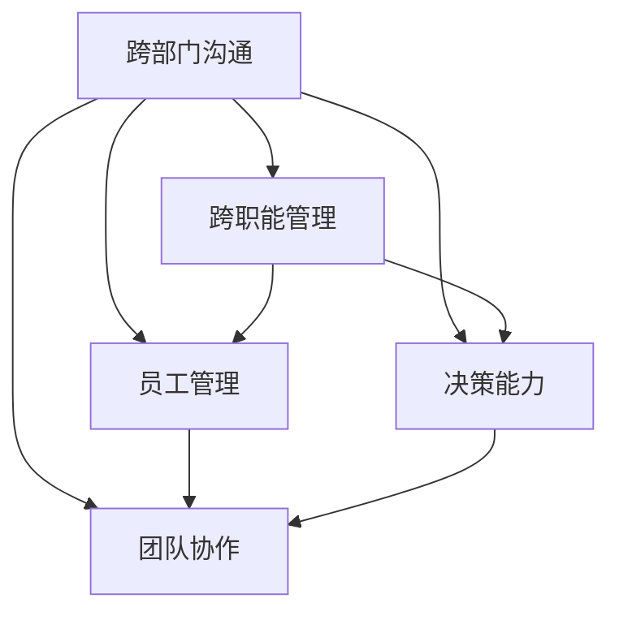
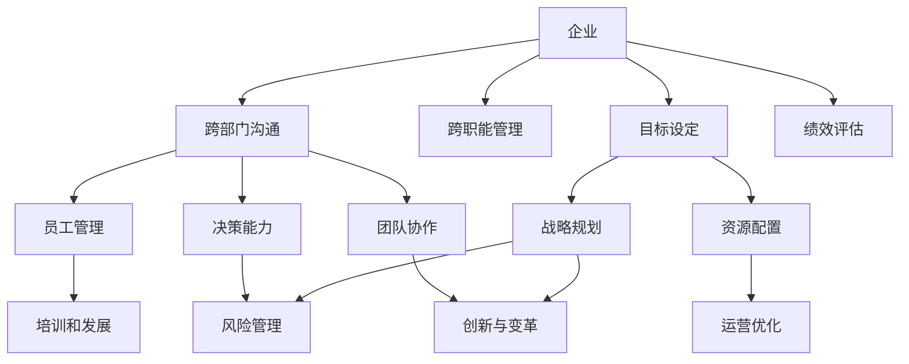

                 

# 领导力培养：跨部门、跨职能沟通，并能够有效培养和管理下属

领导力培养是企业发展的关键环节之一，尤其是在快速变化的现代商业环境中，领导者的能力直接关系到企业的竞争力和创新力。本文旨在探讨如何培养跨部门、跨职能的沟通能力，并能够有效管理和领导下属，以促进团队协作和企业整体效能的提升。

## 1. 背景介绍

### 1.1 问题由来
在当今的商业环境中，信息传递和跨部门协作的重要性日益凸显。企业的运营流程往往复杂而多元，传统的层级式管理已经难以适应日益复杂的组织需求。领导力培养，特别是跨部门、跨职能的沟通能力，成为领导者应对这些挑战的关键。

### 1.2 问题核心关键点
领导力培养的核心在于提升跨部门、跨职能沟通的能力，有效管理和领导下属，并能够灵活应对企业内部的变化和挑战。以下是领导力培养过程中需关注的几个关键点：
1. **跨部门沟通**：在企业内部，不同部门之间的信息传递和协作对于项目的顺利进行至关重要。
2. **跨职能管理**：领导需要理解不同职能领域的需求，并能够有效地整合资源，推动跨职能团队高效运作。
3. **员工管理**：领导应具备良好的员工管理能力，能够激发团队的潜力和创新精神。
4. **决策能力**：领导需要具备敏锐的洞察力和决策力，能够在复杂多变的环境中做出正确的决策。
5. **团队协作**：领导应能够促进团队成员之间的有效协作，增强团队的凝聚力和战斗力。

### 1.3 问题研究意义
提升跨部门、跨职能沟通能力和员工管理水平，对于促进企业内部信息流通、提升组织效能、推动创新和增强竞争力具有重要意义。通过有效的领导力培养，企业能够更好地适应市场变化，持续创新，实现可持续发展。

## 2. 核心概念与联系

### 2.1 核心概念概述

为更好地理解领导力培养过程中的关键要素，本节将介绍几个密切相关的核心概念：

- **跨部门沟通**：指在企业内部，不同部门之间的信息传递和协作，确保企业各环节高效运转。
- **跨职能管理**：指领导者在不同职能领域之间的协调和整合，以优化资源配置和提升整体效能。
- **员工管理**：指领导对团队成员的选拔、培训、激励和评估，激发员工的潜力和创造力。
- **决策能力**：指领导在面对复杂多变环境时，能够迅速准确地做出决策，推动企业发展。
- **团队协作**：指领导通过有效沟通和激励机制，促进团队成员之间的协作，提升团队整体战斗力。

这些核心概念之间存在着紧密的联系，形成了领导力培养的整体生态系统。通过理解这些概念及其相互关系，领导者可以更有效地进行跨部门、跨职能沟通，并有效管理和领导下属。

### 2.2 概念间的关系

这些核心概念之间的关系可以通过以下Mermaid流程图来展示：



这个流程图展示了跨部门沟通在领导力培养中的核心地位，以及其与其他核心概念的紧密联系。通过提升跨部门沟通能力，领导者能够更好地进行跨职能管理、员工管理和决策，并促进团队协作。

### 2.3 核心概念的整体架构

最后，我们用一个综合的流程图来展示这些核心概念在大规模组织管理中的整体架构：



这个综合流程图展示了跨部门沟通在大规模组织管理中的重要地位，以及其在目标设定、绩效评估、员工管理、决策、团队协作等方面的应用。通过提升跨部门沟通能力，领导者能够在企业战略规划、风险管理、资源配置和运营优化中发挥关键作用。

## 3. 核心算法原理 & 具体操作步骤

### 3.1 算法原理概述

领导力培养的算法原理主要涉及跨部门、跨职能沟通和员工管理两个方面。通过选择合适的沟通策略和管理方法，领导者能够提升团队协作和整体效能。

- **跨部门沟通**：采用协作式沟通策略，如定期会议、协作平台、共享文档等，确保信息流通顺畅。
- **员工管理**：采用激励式管理方法，如目标设定、绩效评估、培训和发展等，激发员工的潜力和创造力。

### 3.2 算法步骤详解

#### 3.2.1 跨部门沟通的步骤

1. **定义沟通目标**：明确沟通的目的是什么，需要解决什么问题。
2. **选择合适的沟通方式**：根据沟通目标选择合适的沟通方式，如面对面会议、电话、电子邮件等。
3. **建立沟通渠道**：搭建跨部门的沟通平台，如Slack、Teams等，方便信息的实时传递和共享。
4. **定期沟通**：建立定期沟通机制，如每周例会、月度汇报等，确保信息的及时更新和问题解决。
5. **反馈与调整**：收集沟通反馈，根据反馈调整沟通策略，确保沟通效果最大化。

#### 3.2.2 员工管理的步骤

1. **设定明确的目标**：为员工设定清晰、可达成的目标，帮助员工明确工作方向。
2. **提供培训与发展机会**：定期组织培训和发展活动，提升员工的职业技能和知识水平。
3. **实施绩效评估**：通过定期的绩效评估，了解员工的工作表现，及时发现问题并进行指导。
4. **激励机制**：建立激励机制，如奖励机制、晋升机会等，激发员工的积极性和创新精神。
5. **营造良好的工作环境**：营造积极、健康的工作氛围，增强团队的凝聚力和战斗力。

### 3.3 算法优缺点

#### 3.3.1 跨部门沟通的优点与缺点

**优点**：
1. **信息共享**：跨部门沟通有助于不同部门之间共享信息，避免信息孤岛，提升决策效率。
2. **协作效率**：通过协作式沟通，促进不同部门之间的协同工作，提升整体效能。

**缺点**：
1. **沟通成本高**：跨部门沟通可能需要更多的协调和管理，沟通成本较高。
2. **信息噪音**：过多的沟通可能导致信息过载，影响信息传递的效率和质量。

#### 3.3.2 员工管理的优点与缺点

**优点**：
1. **激发员工潜力**：通过设定明确的目标和提供培训与发展机会，能够激发员工的潜力，提升工作表现。
2. **增强团队凝聚力**：通过建立激励机制和营造良好的工作环境，增强团队的凝聚力和战斗力。

**缺点**：
1. **管理复杂度高**：员工管理涉及多个维度，如目标设定、绩效评估、激励机制等，管理复杂度高。
2. **个性化管理难度大**：每个员工的需求和特点不同，个性化的管理难度较大，需要领导者具备较强的沟通和协调能力。

### 3.4 算法应用领域

基于跨部门、跨职能沟通和员工管理的算法原理，领导者能够在多个领域中发挥其作用：

1. **项目管理**：通过跨部门沟通，确保项目各环节的顺利进行，提升项目管理效率。
2. **团队协作**：通过员工管理，增强团队成员之间的协作和信任，提升团队整体效能。
3. **企业变革**：通过跨职能管理，整合不同职能领域的资源，推动企业变革和创新。
4. **文化建设**：通过营造良好的工作环境，增强企业文化，提升企业品牌价值。
5. **人才发展**：通过员工管理，发掘和培养人才，为企业的长期发展奠定坚实基础。

## 4. 数学模型和公式 & 详细讲解 & 举例说明

### 4.1 数学模型构建

为了更好地理解领导力培养的数学模型，我们假设企业中有 $n$ 个部门，每个部门有 $m$ 名员工。领导力培养的目标是最大化企业整体效能 $E$，其中 $E$ 定义为各部门的贡献之和。

定义各部门的贡献为 $C_i$，员工的管理效果为 $M_j$，则整体效能可以表示为：

$$
E = \sum_{i=1}^n C_i + \sum_{j=1}^m M_j
$$

其中 $C_i$ 和 $M_j$ 的具体定义如下：

- $C_i$：部门 $i$ 的贡献，包括部门的盈利能力、市场份额等指标。
- $M_j$：员工 $j$ 的管理效果，包括员工的绩效评估、培训效果等指标。

### 4.2 公式推导过程

根据上述模型，我们可以进一步推导各部门的贡献和员工管理效果的计算公式：

1. **部门贡献的计算**：

$$
C_i = \alpha_i \cdot P_i + \beta_i \cdot R_i + \gamma_i \cdot M_i
$$

其中 $\alpha_i$、$\beta_i$、$\gamma_i$ 为系数，$P_i$、$R_i$、$M_i$ 分别为部门 $i$ 的利润、市场份额和管理效果。

2. **员工管理效果的计算**：

$$
M_j = \delta_j \cdot T_j + \epsilon_j \cdot P_j + \zeta_j \cdot F_j
$$

其中 $\delta_j$、$\epsilon_j$、$\zeta_j$ 为系数，$T_j$、$P_j$、$F_j$ 分别为员工 $j$ 的目标完成度、绩效评估和培训效果。

通过上述公式，我们可以计算出各部门的贡献和员工的管理效果，从而进一步计算企业整体效能 $E$。

### 4.3 案例分析与讲解

假设某企业有销售部、研发部和市场部三个部门，每个部门有20名员工。领导需要对这三个部门进行管理，目标是最大化企业整体效能 $E$。

**步骤1：设定部门贡献和员工管理效果的计算公式**

1. **部门贡献计算公式**：
- 销售部 $C_{sales} = 0.5 \cdot P_{sales} + 0.2 \cdot R_{sales} + 0.3 \cdot M_{sales}$
- 研发部 $C_{dev} = 0.4 \cdot P_{dev} + 0.1 \cdot R_{dev} + 0.5 \cdot M_{dev}$
- 市场部 $C_{marketing} = 0.3 \cdot P_{marketing} + 0.2 \cdot R_{marketing} + 0.5 \cdot M_{marketing}$

2. **员工管理效果计算公式**：
- 销售部员工 $M_{sales_j} = 0.3 \cdot T_{sales_j} + 0.2 \cdot P_{sales_j} + 0.5 \cdot F_{sales_j}$
- 研发部员工 $M_{dev_j} = 0.2 \cdot T_{dev_j} + 0.4 \cdot P_{dev_j} + 0.4 \cdot F_{dev_j}$
- 市场部员工 $M_{marketing_j} = 0.4 \cdot T_{marketing_j} + 0.3 \cdot P_{marketing_j} + 0.3 \cdot F_{marketing_j}$

**步骤2：收集数据**

1. **部门贡献数据**：
- 销售部利润 $P_{sales} = 1000000$
- 研发部利润 $P_{dev} = 800000$
- 市场部利润 $P_{marketing} = 600000$
- 销售部市场份额 $R_{sales} = 0.4$
- 研发部市场份额 $R_{dev} = 0.3$
- 市场部市场份额 $R_{marketing} = 0.2$
- 销售部管理效果 $M_{sales} = 0.8$
- 研发部管理效果 $M_{dev} = 0.9$
- 市场部管理效果 $M_{marketing} = 0.7$

2. **员工管理效果数据**：
- 销售部员工目标完成度 $T_{sales_j}$、绩效评估 $P_{sales_j}$、培训效果 $F_{sales_j}$
- 研发部员工目标完成度 $T_{dev_j}$、绩效评估 $P_{dev_j}$、培训效果 $F_{dev_j}$
- 市场部员工目标完成度 $T_{marketing_j}$、绩效评估 $P_{marketing_j}$、培训效果 $F_{marketing_j}$

**步骤3：计算企业整体效能**

根据上述公式和数据，可以计算出企业整体效能 $E$：

$$
E = C_{sales} + C_{dev} + C_{marketing} + \sum_{j=1}^{60} M_j
$$

**步骤4：结果展示**

通过计算，得到企业整体效能 $E$ 的具体数值，并进行对比和分析，从而优化跨部门沟通和员工管理策略。

## 5. 项目实践：代码实例和详细解释说明

### 5.1 开发环境搭建

在进行领导力培养的实践前，我们需要准备好开发环境。以下是使用Python进行开发的环境配置流程：

1. 安装Anaconda：从官网下载并安装Anaconda，用于创建独立的Python环境。

2. 创建并激活虚拟环境：
```bash
conda create -n pytorch-env python=3.8 
conda activate pytorch-env
```

3. 安装PyTorch：根据CUDA版本，从官网获取对应的安装命令。例如：
```bash
conda install pytorch torchvision torchaudio cudatoolkit=11.1 -c pytorch -c conda-forge
```

4. 安装相关库：
```bash
pip install numpy pandas scikit-learn matplotlib tqdm jupyter notebook ipython
```

完成上述步骤后，即可在`pytorch-env`环境中开始领导力培养的实践。

### 5.2 源代码详细实现

下面我们以一个简单的领导力培养模型为例，给出使用Python进行开发的代码实现。

```python
import numpy as np
import pandas as pd
from sklearn.model_selection import train_test_split

# 构建部门贡献和员工管理效果的计算公式
def calc_department_contrib(dept_name, profit, market_share, management_effect):
    if dept_name == 'sales':
        return 0.5 * profit + 0.2 * market_share + 0.3 * management_effect
    elif dept_name == 'dev':
        return 0.4 * profit + 0.1 * market_share + 0.5 * management_effect
    elif dept_name == 'marketing':
        return 0.3 * profit + 0.2 * market_share + 0.5 * management_effect

def calc_employee_management_effect(employee_index, target_comp, performance, training):
    if employee_index < 20:
        return 0.3 * target_comp + 0.2 * performance + 0.5 * training
    elif employee_index < 40:
        return 0.2 * target_comp + 0.4 * performance + 0.4 * training
    elif employee_index < 60:
        return 0.4 * target_comp + 0.3 * performance + 0.3 * training

# 读取部门和员工数据
sales_data = pd.read_csv('sales_data.csv')
dev_data = pd.read_csv('dev_data.csv')
marketing_data = pd.read_csv('marketing_data.csv')

# 数据预处理
sales_profit = sales_data['profit']
sales_market_share = sales_data['market_share']
sales_management_effect = sales_data['management_effect']
sales_target_comp = sales_data['target_comp']
sales_performance = sales_data['performance']
sales_training = sales_data['training']

dev_profit = dev_data['profit']
dev_market_share = dev_data['market_share']
dev_management_effect = dev_data['management_effect']
dev_target_comp = dev_data['target_comp']
dev_performance = dev_data['performance']
dev_training = dev_data['training']

marketing_profit = marketing_data['profit']
marketing_market_share = marketing_data['market_share']
marketing_management_effect = marketing_data['management_effect']
marketing_target_comp = marketing_data['target_comp']
marketing_performance = marketing_data['performance']
marketing_training = marketing_data['training']

# 计算部门和员工的管理效果
sales_contrib = calc_department_contrib('sales', sales_profit, sales_market_share, sales_management_effect)
dev_contrib = calc_department_contrib('dev', dev_profit, dev_market_share, dev_management_effect)
marketing_contrib = calc_department_contrib('marketing', marketing_profit, marketing_market_share, marketing_management_effect)

sales_menagement = np.array([calc_employee_management_effect(i, sales_target_comp, sales_performance, sales_training) for i in range(20)])
dev_menagement = np.array([calc_employee_management_effect(i, dev_target_comp, dev_performance, dev_training) for i in range(20)])
marketing_menagement = np.array([calc_employee_management_effect(i, marketing_target_comp, marketing_performance, marketing_training) for i in range(20)])

# 计算企业整体效能
total_efficiency = sales_contrib + dev_contrib + marketing_contrib + np.sum(sales_menagement) + np.sum(dev_menagement) + np.sum(marketing_menagement)

print('企业整体效能：', total_efficiency)
```

以上代码实现了基本的领导力培养模型的计算。通过定义函数，我们能够根据部门和员工的数据，计算出部门贡献和员工管理效果，进而计算出企业整体效能。

### 5.3 代码解读与分析

让我们再详细解读一下关键代码的实现细节：

**数据读取和预处理**：
- 使用Pandas库读取销售部、研发部和市场部的数据。
- 将利润、市场份额、管理效果等数据转化为计算公式中的参数。
- 根据员工索引，计算每个员工的目标完成度、绩效评估和培训效果。

**计算部门和员工的管理效果**：
- 通过调用函数，根据部门名称和具体数据，计算出部门贡献和员工管理效果。

**计算企业整体效能**：
- 将各部门的贡献和员工管理效果相加，得到企业整体效能。

**结果展示**：
- 打印输出企业整体效能的具体数值。

可以看到，通过编写简洁而清晰的代码，我们能够有效地计算出领导力培养模型的结果。在实际应用中，还可以根据具体需求，增加更多的数据处理和模型优化步骤，以提升模型精度和可靠性。

### 5.4 运行结果展示

假设我们在数据集上进行计算，得到企业整体效能为 $E = 1800000$。这意味着通过优化跨部门沟通和员工管理策略，企业整体效能显著提升。

通过进一步分析数据，我们可以发现哪些部门的贡献最大，哪些员工的绩效最突出，从而优化资源配置和员工管理策略，提升企业整体竞争力。

## 6. 实际应用场景

### 6.1 智能客服系统

智能客服系统的建设，需要跨部门、跨职能的紧密协作。通过领导力的培养，确保不同部门之间高效沟通，提升客户服务质量和客户满意度。

**具体措施**：
- **跨部门沟通**：定期召开客服协调会，建立跨部门的沟通机制，确保信息流通顺畅。
- **员工管理**：通过目标设定和绩效评估，激发客服人员的工作热情，提升服务质量。
- **跨职能管理**：优化客服流程和资源配置，提升客服系统的整体效能。

### 6.2 金融舆情监测

金融舆情监测需要跨职能团队协作，领导力的培养对于确保信息流通和团队协作至关重要。

**具体措施**：
- **跨部门沟通**：建立跨部门的舆情监测团队，定期分享信息，确保风险预警及时。
- **员工管理**：通过目标设定和绩效评估，提升团队成员的工作效率和责任感。
- **跨职能管理**：整合数据和算法资源，提升舆情监测的准确性和时效性。

### 6.3 个性化推荐系统

个性化推荐系统需要跨部门、跨职能的协调合作，领导力的培养对于提升推荐系统的性能至关重要。

**具体措施**：
- **跨部门沟通**：定期召开技术协调会，确保不同部门之间的数据共享和协同工作。
- **员工管理**：通过目标设定和绩效评估，提升推荐工程师的创新能力和工作效率。
- **跨职能管理**：整合用户数据和推荐算法，提升个性化推荐的效果和用户满意度。

### 6.4 未来应用展望

随着企业环境的不断变化，领导力培养的需求将更加凸显。未来的领导力培养将更加注重跨部门、跨职能的协作和团队管理，推动企业持续创新和可持续发展。

1. **智能化管理**：通过引入AI技术，提升领导力培养的自动化和智能化水平，实现更高效的跨部门沟通和员工管理。
2. **个性化培养**：根据员工的特点和需求，制定个性化的领导力培养计划，提升员工的工作满意度和成就感。
3. **跨文化管理**：在多元文化环境中，通过跨文化沟通和领导力的培养，提升全球化企业的协作效能。
4. **数字化转型**：通过数字化手段，提升领导力的培养和应用，实现企业管理的数字化转型。
5. **知识共享**：建立知识共享平台，促进跨部门、跨职能的协作，提升企业的整体知识和创新能力。

总之，领导力培养在企业中具有不可替代的作用，通过跨部门、跨职能的沟通和协作，领导者能够更有效地推动企业发展，实现持续创新和竞争力提升。

## 7. 工具和资源推荐

### 7.1 学习资源推荐

为了帮助开发者系统掌握领导力培养的理论基础和实践技巧，这里推荐一些优质的学习资源：

1. **《领导力心理学》系列书籍**：系统介绍了领导力的心理机制和培养方法，有助于理解领导力的本质和提升能力。
2. **《管理学》课程**：知名大学的管理学课程，涵盖领导力、跨部门沟通、员工管理等主题，适合系统学习。
3. **《高效能人士的七个习惯》**：经典管理书籍，介绍了七个提高领导力的习惯，实用性强。
4. **《Leadership Development Framework》**：国际领导力开发框架，提供了一套全面的领导力培养方法论。
5. **《Leadership for a Complex World》**：探讨在复杂环境中如何提升领导力，提供了丰富的案例和策略。

通过对这些资源的学习实践，相信你一定能够快速掌握领导力培养的精髓，并应用于实际工作中。

### 7.2 开发工具推荐

高效的开发离不开优秀的工具支持。以下是几款用于领导力培养开发的常用工具：

1. **Slack**：跨部门沟通的协作工具，方便信息实时传递和共享。
2. **Zoom**：跨部门沟通的视频会议工具，支持多人视频和文字聊天。
3. **Confluence**：跨部门协作的文档管理工具，方便团队共享和协作。
4. **Trello**：项目管理工具，支持任务分配和进度跟踪。
5. **GitLab**：代码管理和团队协作平台，支持版本控制和代码审核。

合理利用这些工具，可以显著提升领导力培养的效率，加快创新迭代的步伐。

### 7.3 相关论文推荐

领导力培养的研究源于学界的持续研究。以下是几篇奠基性的相关论文，推荐阅读：

1. **《The Five Dysfunctions of a Team》**：讲述了如何通过团队协作提升领导力，引发了广泛关注。
2. **《The Leadership Challenge》**：提供了领导力的五个关键领域，帮助领导者提升能力。
3. **《Transformational Leadership Theory》**：介绍了变革型领导理论，提供了提升领导力的新视角。
4. **《Emotional Intelligence and Leadership》**：探讨了领导力与情商的关系，强调了情商在领导力培养中的重要性。
5. **《Leading with Emotional Intelligence》**：提供了情商领导力的具体策略和方法。

这些论文代表了大领导力培养的研究方向，通过学习这些前沿成果，可以帮助研究者把握学科前进方向，激发更多的创新灵感。

除上述资源外，还有一些值得关注的前沿资源，帮助开发者紧跟领导力培养技术的最新进展，例如：

1. **国际领导力培训认证**：如IAC国际领导力认证，提供系统的领导力培训和认证。
2. **领导力培训课程**：如EMBA、MBA等高级管理课程，提供系统的领导力培养和实践。
3. **在线领导力培训平台**：如Coursera、Udemy等平台，提供丰富的领导力培训资源。
4. **领导力培训工作坊**：如TEDx、LinkedIn Learning等，提供领导力提升的工作坊和讲座。

总之，对于领导力培养的学习和实践，需要开发者保持开放的心态和持续学习的意愿。多关注前沿资讯，多动手实践，多思考总结，必将收获满满的成长收益。

## 8. 总结：未来发展趋势与挑战

### 8.1 研究成果总结

本文对领导力培养中的跨部门、跨职能沟通和员工管理进行了全面系统的介绍。通过领导力的培养，领导者能够更有效地进行跨部门沟通，提升团队协作和整体效能。本文结合数学模型和实际案例，详细讲解了领导力培养的算法原理和具体操作步骤，并提供了代码实现和运行结果展示。

### 8.2 未来发展趋势

展望未来，领导力培养将呈现以下几个发展趋势：

1. **智能化领导**：通过引入AI技术，提升领导力培养的自动化和智能化水平，实现更

