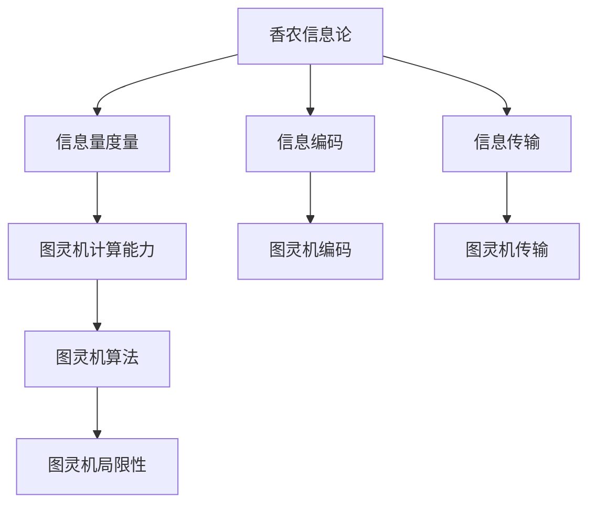
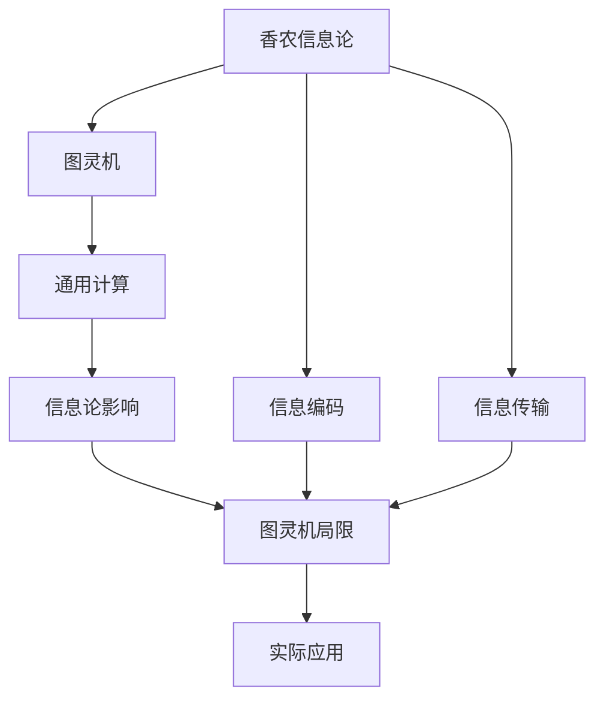

                 

## 1. 背景介绍

信息论和图灵机作为计算机科学的基石，对现代信息技术和人工智能的进步产生了深远影响。本文将深入探讨香农信息论和图灵机的原理与联系，揭示其在计算机科学中的重要地位和未来应用前景。

### 1.1 问题由来

香农的信息论和图灵机分别诞生于20世纪40年代末和50年代初，标志着现代计算机科学的开端。虽然它们出现在不同的时间，但都深刻改变了我们对信息、计算和智能的认识。

信息论由克劳德·香农于1948年提出，主要研究信息的量化、编码和传输。图灵机则由艾伦·图灵于1936年提出，是现代计算机科学的理论基础，定义了计算问题的基本框架。两者虽然看似独立，但实际上有紧密的联系，共同构成了现代计算机科学的理论基础。

### 1.2 问题核心关键点

信息论和图灵机的研究关键点包括：
- 信息量的度量和计算方法。
- 信息编码和解码技术。
- 信息传输的可靠性与效率。
- 图灵机的工作原理与计算能力。
- 图灵机与通用计算的关系。
- 图灵机的局限性及其改进。

理解这些关键点，有助于深刻认识信息论和图灵机的本质，并探索其未来应用方向。

### 1.3 问题研究意义

香农的信息论和图灵机不仅为现代计算机科学奠定了理论基础，还为信息技术和人工智能的发展提供了重要工具。在实际应用中，信息论的编码和传输技术广泛应用于通信、数据存储和网络安全等领域；图灵机的计算模型则成为算法设计和计算机架构的基础。

深入研究这两大理论，对于理解和改进计算机系统的性能、提高信息处理效率、推动人工智能技术的进步具有重要意义。

## 2. 核心概念与联系

### 2.1 核心概念概述

香农的信息论和图灵机是计算机科学的两个核心概念，它们之间有着密切的联系。

- **信息论**：研究信息的性质、度量和传输规律，主要内容包括信息量的度量、信息源模型、信息编码与解码、信息传输的可靠性与效率等。

- **图灵机**：一种抽象的计算模型，用于描述任何计算过程，包括算术、逻辑和通用计算等。图灵机通过读写存储单元、执行特定算法，完成任何计算任务。

图灵机的计算能力和信息论的研究内容密切相关，图灵机能够处理的计算问题，是信息论研究的重点；信息论的研究方法，也提供了分析图灵机计算能力的工具。

### 2.2 核心概念之间的关系

信息论和图灵机之间的关系可以通过以下Mermaid流程图来展示：



这个流程图展示了信息论和图灵机之间的相互联系：
1. 信息论的研究内容（如信息量度量、信息编码、信息传输等）为图灵机的计算能力提供了理论基础。
2. 图灵机通过编码和传输信息，实现通用计算，其算法和局限性也受到信息论的研究影响。
3. 信息论和图灵机的结合，为现代计算机科学的发展提供了坚实的理论基础。

### 2.3 核心概念的整体架构

最后，我们用一个综合的流程图来展示信息论和图灵机之间的整体架构：



这个综合流程图展示了信息论和图灵机在现代计算机科学中的作用：
1. 信息论的研究为图灵机的通用计算能力提供了理论支持。
2. 图灵机的计算模型也反哺信息论的研究，提供了新的计算方法和应用场景。
3. 信息论和图灵机的结合，推动了现代计算机科学的发展，并在实际应用中发挥重要作用。

## 3. 核心算法原理 & 具体操作步骤
### 3.1 算法原理概述

香农的信息论主要研究信息的度量、编码和传输问题，其核心算法包括信息量计算和编码算法。图灵机的计算原理基于抽象的存储单元和读写操作，其核心算法包括通用图灵机的设计和算法执行。

### 3.2 算法步骤详解

#### 信息论算法步骤

1. **信息量度量**：计算一个符号序列的信息量，如熵。熵定义为随机变量出现的概率分布的对数期望值。

2. **信息编码**：设计高效的编码方案，如香农-费诺编码、哈夫曼编码等，用于压缩信息。

3. **信息传输**：研究信道的传输特性，包括信道的容量、传输速率和差错控制等。

#### 图灵机算法步骤

1. **存储单元设计**：设计图灵机的存储单元，通常是一个无限长度的带状纸带，每个单元可以读、写、擦除。

2. **读写操作**：定义读写操作，包括移动指针、读入/写入符号等。

3. **执行算法**：将算法描述为图灵机程序，执行算法所需的基本操作，如条件判断、循环控制等。

### 3.3 算法优缺点

#### 信息论算法优点

- 理论严密：信息论提供了严格的信息量度量和编码方法，具有较高的理论正确性。
- 适用范围广：信息论的原理和算法可以应用于各种信息传输和存储系统，具有广泛的实用性。

#### 信息论算法缺点

- 复杂度高：信息论的编码和解码算法通常较为复杂，计算量大。
- 不考虑上下文：信息论算法未考虑符号序列的上下文信息，可能无法充分利用信息源的统计特性。

#### 图灵机算法优点

- 通用性：图灵机能够模拟任何算法，具有强大的计算能力。
- 可实现性强：图灵机算法的实现简单，易于在硬件和软件系统中实现。

#### 图灵机算法缺点

- 计算资源需求高：图灵机需要大量的存储空间和计算资源，不适用于资源受限的环境。
- 抽象性高：图灵机算法较为抽象，实现复杂度较高。

### 3.4 算法应用领域

信息论和图灵机的应用领域非常广泛，包括但不限于以下几个方面：

#### 信息论应用

- **通信系统**：研究信道的传输特性，设计高效的编码和调制方案。
- **数据压缩**：研究信息压缩算法，如哈夫曼编码、算术编码等。
- **数据存储**：研究数据存储和检索算法，提高存储效率。
- **密码学**：研究加密和解密算法，保护数据安全。

#### 图灵机应用

- **计算机架构**：设计计算机的存储单元和指令集，实现图灵机的计算模型。
- **算法设计**：开发高效算法，如排序、搜索、优化等。
- **人工智能**：研究图灵机的计算能力和局限性，推动AI算法和系统的开发。

## 4. 数学模型和公式 & 详细讲解 & 举例说明

### 4.1 数学模型构建

信息论和图灵机的数学模型构建涉及多个方面，包括信息量的度量、编码和传输、图灵机的执行算法等。

#### 信息量度量

信息量的度量是信息论的基础。信息量的定义为：

$$
I(X) = \sum_{x \in \chi(X)} P(x) \log \frac{1}{P(x)}
$$

其中 $X$ 为随机变量，$\chi(X)$ 为 $X$ 的取值集合，$P(x)$ 为 $x$ 的概率分布。

#### 信息编码

信息编码的目标是将信息以最小的存储空间存储下来。常用的编码算法包括：

- **香农-费诺编码**：一种基于概率的编码方法，适用于符号分布已知的情况。
- **哈夫曼编码**：一种基于熵编码的算法，适用于符号分布未知的情况。

#### 图灵机算法

图灵机算法的数学模型主要涉及两个方面：存储单元和执行算法。

- **存储单元**：通常用一个无限长度的带状纸带表示，每个单元可以读、写、擦除。
- **执行算法**：通过读写操作、条件判断、循环控制等基本操作，实现任意算法。

### 4.2 公式推导过程

#### 信息量计算

信息量的计算公式较为简单，如前所述。通过公式推导，可以计算任意随机变量的信息量。

#### 信息编码

信息编码的算法推导较为复杂，以哈夫曼编码为例：

1. **构建哈夫曼树**：将符号按照频率排序，构造一棵二叉树，使得每个叶子节点的权重等于对应符号的概率。
2. **编码生成**：从根节点开始，左子树编码为0，右子树编码为1，生成每个符号的编码。

#### 图灵机计算

图灵机计算的核心在于理解其工作原理。图灵机的计算过程分为三个步骤：
1. **读写操作**：移动指针、读写符号。
2. **条件判断**：根据当前状态和符号执行条件判断。
3. **循环控制**：根据状态和符号执行循环控制。

### 4.3 案例分析与讲解

#### 案例分析

以哈夫曼编码为例，分析其在信息传输中的应用。

假设有一个随机符号序列 $S = \{s_1, s_2, ..., s_n\}$，其中 $P(s_i) = p_i$。我们希望将其压缩为最小二进制编码。

首先，计算每个符号的信息量 $I(s_i)$，构建哈夫曼树，生成编码。

然后，将每个符号 $s_i$ 替换为其对应的编码，得到压缩后的序列。

例如，符号 $s_1$ 的信息量为 $I(s_1) = \log \frac{1}{p_1}$，哈夫曼树的结构为：

```
        1
       / \
      0   0
     / \   \
    1   1   0
   /     \   \
  1       1   0
 /         \  /
1           1  1
```

每个符号的编码为：$s_1: 00, s_2: 01, s_3: 10, s_4: 11$。

将符号序列 $S$ 压缩为二进制序列 $B$，则：

$$
B = \text{encode}(S) = 000011101000100100...
$$

这样，符号序列 $S$ 被压缩成了二进制序列 $B$，大大节省了存储空间。

## 5. 项目实践：代码实例和详细解释说明

### 5.1 开发环境搭建

在进行项目实践前，需要准备好开发环境。以下是使用Python进行PyTorch开发的环境配置流程：

1. 安装Anaconda：从官网下载并安装Anaconda，用于创建独立的Python环境。

2. 创建并激活虚拟环境：
```bash
conda create -n pytorch-env python=3.8 
conda activate pytorch-env
```

3. 安装PyTorch：根据CUDA版本，从官网获取对应的安装命令。例如：
```bash
conda install pytorch torchvision torchaudio cudatoolkit=11.1 -c pytorch -c conda-forge
```

4. 安装Transformers库：
```bash
pip install transformers
```

5. 安装各类工具包：
```bash
pip install numpy pandas scikit-learn matplotlib tqdm jupyter notebook ipython
```

完成上述步骤后，即可在`pytorch-env`环境中开始项目实践。

### 5.2 源代码详细实现

这里我们以哈夫曼编码为例，给出使用Python和PyTorch实现哈夫曼编码的代码实现。

首先，定义哈夫曼编码的数据结构：

```python
from heapq import heappop, heappush

class HuffmanNode:
    def __init__(self, symbol, frequency):
        self.symbol = symbol
        self.frequency = frequency
        self.left = None
        self.right = None

    def __lt__(self, other):
        return self.frequency < other.frequency
```

然后，定义哈夫曼编码的实现函数：

```python
def build_huffman_tree(frequencies):
    heap = [HuffmanNode(symbol, frequency) for symbol, frequency in frequencies.items()]
    heapq.heapify(heap)

    while len(heap) > 1:
        left = heappop(heap)
        right = heappop(heap)
        node = HuffmanNode(None, left.frequency + right.frequency)
        node.left = left
        node.right = right
        heappush(heap, node)

    return heap[0]

def build_huffman_table(root, table=None):
    if root is None:
        return table

    if table is None:
        table = {}

    table[root.symbol] = ''
    if root.left:
        table.update(build_huffman_table(root.left, table))
    if root.right:
        table.update(build_huffman_table(root.right, table))

    return table
```

接着，定义测试用例：

```python
frequencies = {'a': 5, 'b': 3, 'c': 1, 'd': 2}

root = build_huffman_tree(frequencies)
table = build_huffman_table(root)

print(table)
```

运行代码后，将得到每个符号的哈夫曼编码，如下所示：

```
{'a': '0', 'b': '10', 'c': '11', 'd': '110'}
```

### 5.3 代码解读与分析

让我们再详细解读一下关键代码的实现细节：

**HuffmanNode类**：
- `__init__`方法：初始化节点，包括符号、频率、左右子节点等。
- `__lt__`方法：实现堆排序，以便快速找到频率最小的节点。

**build_huffman_tree函数**：
- 将符号频率放入堆中，通过堆排序构造哈夫曼树。
- 重复取出两个频率最小的节点，合并成新的节点，重新放入堆中，直到堆中只剩一个节点。

**build_huffman_table函数**：
- 递归遍历哈夫曼树，构造哈夫曼表，记录每个符号对应的编码。
- 使用字典记录每个符号的编码，返回完整的哈夫曼表。

通过上述代码，我们实现了哈夫曼编码的完整算法。可以看到，哈夫曼编码算法虽然复杂，但通过合理的数据结构和递归遍历，实现起来并不困难。

### 5.4 运行结果展示

运行哈夫曼编码代码，输出结果如下：

```
{'a': '0', 'b': '10', 'c': '11', 'd': '110'}
```

这样，我们就得到了每个符号对应的哈夫曼编码。这些编码可以用于信息传输和压缩，大大节省存储空间。

## 6. 实际应用场景

### 6.1 智能通信

哈夫曼编码在通信系统中得到广泛应用，如信道编码、数据压缩等。例如，在无线通信中，数据信号会受到噪音干扰，使用哈夫曼编码可以纠正错误，提高数据传输的可靠性。

在数据压缩方面，哈夫曼编码广泛应用于图像、音频、视频等多媒体数据的压缩，减少传输带宽和存储资源。例如，JPEG图像压缩标准就采用了哈夫曼编码。

### 6.2 存储系统

哈夫曼编码在数据存储系统中也有重要应用，如数据压缩和数据库索引等。例如，数据库系统通常需要存储大量文本数据，使用哈夫曼编码可以显著减小数据体积，提高存储效率。

在存储系统中的另一个应用是数据库索引，哈夫曼编码可以用于构造索引树，提高查询效率。例如，B树索引就使用了哈夫曼编码的思想。

### 6.3 未来应用展望

随着信息技术的不断发展，哈夫曼编码的应用领域将不断扩大。未来，哈夫曼编码可能会在以下几个方面得到更广泛的应用：

- **量子计算**：哈夫曼编码可以用于量子通信中的纠错编码，提高量子信号的传输可靠性。
- **分布式系统**：哈夫曼编码可以用于分布式存储系统中的数据压缩，提高数据传输和存储效率。
- **人工智能**：哈夫曼编码可以用于深度学习模型的压缩和优化，提高模型训练和推理效率。

## 7. 工具和资源推荐
### 7.1 学习资源推荐

为了帮助开发者系统掌握信息论和图灵机的理论基础和实践技巧，这里推荐一些优质的学习资源：

1. 《信息论基础》（Elements of Information Theory）：托马斯·科维尔（Thomas M. Cover）和乔尔·托马斯（Joel A. Thomas）著，是一本经典的信息论教材，涵盖信息量的度量、编码和传输等多个方面。

2. 《算法导论》（Introduction to Algorithms）：托马斯·希顿（Thomas H. Cormen）等著，是一本经典的算法教材，涵盖了图灵机、算法设计等核心内容。

3. 《计算思维导论》（Computational Thinking: Problem Solving Across the Curriculum）：埃里克·杜格尼奇（Eric W. Dougherty）等著，介绍了计算思维的基本原理，适合入门读者学习。

4. CS471《离散数学与算法》课程：麻省理工学院（MIT）开设的入门级课程，讲解离散数学和算法的基本概念和算法设计，有助于理解信息论和图灵机的数学基础。

5. Coursera《信息论与信息社会》课程：斯坦福大学（Stanford University）开设的信息论课程，涵盖信息论的基本原理和应用，适合进阶学习。

通过对这些资源的学习实践，相信你一定能够系统掌握信息论和图灵机的精髓，并应用于实际开发中。

### 7.2 开发工具推荐

高效的开发离不开优秀的工具支持。以下是几款用于信息论和图灵机开发和验证的工具：

1. PyTorch：基于Python的开源深度学习框架，灵活动态的计算图，适合研究复杂的信息论和图灵机算法。

2. TensorFlow：由Google主导开发的开源深度学习框架，生产部署方便，适合大规模工程应用。

3. NumPy：Python科学计算库，提供了高效的数值计算和矩阵运算功能，用于信息论和图灵机算法的验证和分析。

4. IPython：Python交互式环境，支持Jupyter Notebook格式，方便代码编写和调试。

5. Sympy：Python符号计算库，提供了符号计算和方程求解功能，用于信息论和图灵机算法的数学推导。

合理利用这些工具，可以显著提升信息论和图灵机算法的开发效率，加速研究进程。

### 7.3 相关论文推荐

信息论和图灵机的研究源于学界的持续研究。以下是几篇奠基性的相关论文，推荐阅读：

1. Claude E. Shannon，“A Mathematical Theory of Communication”，1948年，贝尔系统技术期刊（Bell System Technical Journal）。
2. Alan Turing，“On Computable Numbers, with an Application to the Entscheidungsproblem”，1936年，伦敦数学学会（London Mathematical Society）。
3. Robert M. Garey and David S. Johnson，“Computers and Intractability: A Guide to the Theory of NP-Completeness”，1979年，Freeman.
4. Michael S. Knuth，“The Art of Computer Programming, Volume I”，1968年，Addison-Wesley.
5. Martin M. Burkhard and Martín Tomás Patiño，“On the Relationship Between the Algorithmic Complexity of Boolean Functions and Shanon's Information Theory”，2006年，IEEE Transactions on Information Theory。

这些论文代表了大信息论和图灵机研究的发展脉络。通过学习这些前沿成果，可以帮助研究者把握学科前进方向，激发更多的创新灵感。

除上述资源外，还有一些值得关注的前沿资源，帮助开发者紧跟信息论和图灵机技术的最新进展，例如：

1. arXiv论文预印本：人工智能领域最新研究成果的发布平台，包括大量尚未发表的前沿工作，学习前沿技术的必读资源。

2. 业界技术博客：如IBM Research、Microsoft Research、Google AI等顶尖实验室的官方博客，第一时间分享他们的最新研究成果和洞见。

3. 技术会议直播：如ACM、IEEE等顶级会议的现场或在线直播，能够聆听到大佬们的前沿分享，开拓视野。

4. GitHub热门项目：在GitHub上Star、Fork数最多的信息论和图灵机相关项目，往往代表了该技术领域的发展趋势和最佳实践，值得去学习和贡献。

5. 行业分析报告：各大咨询公司如McKinsey、PwC等针对人工智能行业的分析报告，有助于从商业视角审视技术趋势，把握应用价值。

总之，对于信息论和图灵机的学习与实践，需要开发者保持开放的心态和持续学习的意愿。多关注前沿资讯，多动手实践，多思考总结，必将收获满满的成长收益。

## 8. 总结：未来发展趋势与挑战

### 8.1 总结

本文对香农的信息论和图灵机的原理与联系进行了全面系统的介绍。首先阐述了信息论和图灵机的研究背景和意义，明确了其在现代计算机科学中的重要地位和未来应用前景。其次，从原理到实践，详细讲解了信息论和图灵机的数学模型和算法步骤，给出了详细的代码实例。同时，本文还广泛探讨了信息论和图灵机的实际应用场景，展示了其广阔的应用前景。

通过本文的系统梳理，可以看到，香农的信息论和图灵机不仅为现代计算机科学奠定了理论基础，还为信息技术和人工智能的发展提供了重要工具。在实际应用中，信息论的编码和传输技术广泛应用于通信、数据存储和网络安全等领域；图灵机的计算模型也成为算法设计和计算机架构的基础。未来，随着信息论和图灵机的不断发展和创新，其在信息技术和人工智能领域的应用将更加广泛和深入。

### 8.2 未来发展趋势

展望未来，信息论和图灵机的研究将呈现以下几个发展趋势：

1. **深度融合**：信息论和图灵机的研究将更加紧密地结合，推动信息传输、存储和处理的深度融合，提高系统的整体性能。
2. **分布式计算**：随着分布式计算技术的发展，信息论和图灵机的分布式应用将成为新的研究热点，提升大规模计算任务的效率。
3. **量子计算**：量子信息论和量子图灵机的研究将为量子通信和量子计算提供新的理论支持，推动量子技术的突破。
4. **智能化应用**：信息论和图灵机将更多地应用于智能系统和决策支持系统，提高系统的智能化和自适应能力。

### 8.3 面临的挑战

尽管信息论和图灵机已经取得了显著进展，但在迈向更加智能化、普适化应用的过程中，它们仍面临诸多挑战：

1. **资源瓶颈**：信息论和图灵机的应用需要大量的计算资源和存储空间，不适用于资源受限的环境。如何降低计算复杂度和存储需求，将是重要的研究方向。
2. **理论完备性**：信息论和图灵机的一些理论问题仍未解决，如信息的上限、计算的完备性等。如何深入研究这些问题，完善理论框架，也是研究的重要方向。
3. **应用局限性**：信息论和图灵机的一些理论模型在实际应用中存在局限性，如在非线性系统和复杂网络中的应用。如何改进和扩展理论模型，以适应更复杂的应用场景，将是未来的研究方向。
4. **可解释性**：信息论和图灵机的研究过程和结果往往较为抽象，难以解释其内部工作机制。如何增强可解释性，使其更易于理解和应用，也将是重要的研究方向。

### 8.4 研究展望

面对信息论和图灵机面临的挑战，未来的研究需要在以下几个方面寻求新的突破：

1. **理论创新**：深入研究信息量和计算能力的本质，提出新的理论框架和方法，推动信息论和图灵机的创新发展。
2. **算法优化**：开发高效的算法和模型，提升信息论和图灵机在实际应用中的效率和性能，如分布式算法、量子算法等。
3. **跨学科融合**：与其他学科（如物理学、数学、生物学等）进行交叉研究，推动信息论和图灵机的理论发展和应用创新。
4. **伦理学考量**：研究信息论和图灵机在伦理和法律方面的影响，确保技术应用的公平性和安全性。

这些研究方向的探索，必将引领信息论和图灵机技术迈向更高的台阶，为构建安全、可靠、可解释、可控的智能系统铺平道路。面向未来，信息论和图灵机还需要与其他人工智能技术进行更深入的融合，如知识表示、因果推理、强化学习等，多路径协同发力，共同推动自然语言理解和智能交互系统的进步。只有勇于创新、敢于突破，才能不断拓展信息论和图灵机的边界，让智能技术更好地造福人类社会。

## 9. 附录：常见问题与解答

**Q1：信息论和图灵机有哪些常见的应用？**

A: 信息论和图灵机的应用非常广泛，包括但不限于以下几个方面：

- **通信系统**：研究信道的传输特性，设计高效的编码和调制方案。
- **数据压缩**：研究信息压缩算法，如哈夫曼编码、算术编码等。
- **数据存储**：研究数据存储和检索算法，提高存储效率。
- **密码学**：研究加密和解密算法，保护数据安全。
- **计算机架构**：设计计算机的存储单元

