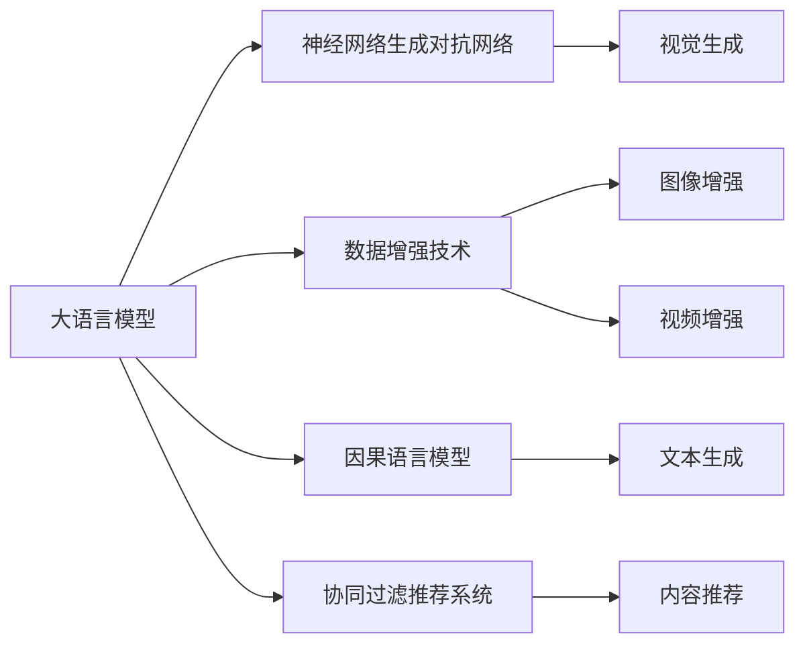

                 

# 马杰零一万物:AIGC企业服务新探索

## 1. 背景介绍

### 1.1 问题由来
近年来，人工智能技术（AI）和生成式人工智能（AI/G）技术在全球范围内快速普及，各类应用场景层出不穷，为企业数字化转型提供了强大的技术支持。与此同时，随着海量数据积累和算力提升，各类企业应用场景对AI/G技术的需求愈发旺盛。企业希望通过AI/G技术实现更智能、更高效的业务运作。然而，受制于技术门槛、数据质量、应用成本等因素，多数企业在AI/G技术落地应用时面临诸多挑战。

为帮助企业克服这些挑战，我提出了“马杰零一万物”的理念，即利用AI/G技术赋能企业，通过零样本、单一样本、少样本和全样本等生成方式，构建万物互联的智能应用生态。

### 1.2 问题核心关键点
本文将详细探讨如何通过AI/G技术为企业提供高效、安全、可控、可解释的服务，聚焦于AIGC（Artificial Intelligence Generated Content）技术在企业服务中的应用。主要问题点包括：

1. 如何利用AIGC技术提升企业生产效率和质量？
2. 如何降低企业AI/G技术的落地成本？
3. 如何保障AI/G技术的可靠性和安全性？
4. 如何使AI/G技术的应用更加可解释、可控？

### 1.3 问题研究意义
通过本文的探讨，能够帮助企业明确在AI/G技术应用中的发展方向，同时提供可行的解决方案，从而降低AI/G技术的落地难度，提升企业数字化转型成功率。在更广范围内，本文的研究对促进AI/G技术在企业中的应用，推进智能产业的发展具有重要意义。

## 2. 核心概念与联系

### 2.1 核心概念概述
AIGC，即生成式AI内容（Artificial Intelligence Generated Content），是指利用AI/G技术，通过自动生成文本、图像、音频等形式的内容，为各种应用场景提供智能服务。其主要技术包括：

- 大语言模型：通过海量无标注数据预训练生成通用语言模型，具备自然语言理解和生成的能力。
- 神经网络生成对抗网络（GAN）：通过对抗训练生成高质量的图像和音频内容。
- 数据增强技术：通过自动生成数据扩充训练集，提升模型泛化能力。
- 因果语言模型：通过引入因果关系提升模型生成质量和稳定性。
- 协同过滤推荐系统：通过协同生成内容，提高推荐准确率。

### 2.2 核心概念的联系
AIGC的核心概念之间存在紧密的联系，通过技术融合和创新，可以构建更加智能化、高效、可控的服务体系。以下是核心概念之间的关系：

#### 2.2.1 大语言模型与AIGC

大语言模型是AIGC的基础，其具备的自然语言理解能力可以应用于生成式文本、对话生成等任务，为其他AI/G技术提供强大的语义支持。同时，大语言模型生成的文本内容也可以作为训练样本，提升其他生成模型的表现。

#### 2.2.2 神经网络生成对抗网络与AIGC

GAN可以生成高质量的图像和音频内容，为产品设计、广告营销、视频生成等领域提供丰富多样的视觉和听觉素材。GAN生成的内容也可以作为大语言模型的输入，提高自然语言生成和对话的质量。

#### 2.2.3 数据增强技术与AIGC

数据增强技术通过自动生成更多样本，提升模型泛化能力。这在AIGC中尤为重要，因为生成式任务的训练数据往往相对较少，通过数据增强可以缓解数据匮乏的问题。

#### 2.2.4 因果语言模型与AIGC

因果语言模型可以通过引入因果关系提升生成内容的连贯性和逻辑性，为广告文案、新闻稿件等文本生成任务提供更高质量的输出。

#### 2.2.5 协同过滤推荐系统与AIGC

协同过滤推荐系统利用用户生成内容提升推荐系统的效果，同时协同生成内容也可以作为其他AI/G任务的数据来源，形成良性循环。

### 2.3 核心概念的整体架构

以下是AIGC核心概念的整体架构，通过技术的深度融合和创新，为各类企业服务场景提供智能化解决方案：



这个架构展示了大语言模型、GAN、数据增强、因果语言模型和协同过滤推荐系统等核心概念的融合，构建了一个完整的AIGC技术体系，能够为企业的各种应用场景提供支持。

## 3. 核心算法原理 & 具体操作步骤
### 3.1 算法原理概述
AIGC的核心算法原理主要基于深度学习和生成模型，通过自动生成内容，为各类企业服务场景提供智能化解决方案。核心算法包括：

- 自回归模型：通过预测序列中下一个时间步的概率分布，实现文本生成和语音合成。
- 自编码器：通过重构输入数据，实现数据压缩和降维，提高数据生成效率。
- 对抗生成网络：通过对抗训练生成高质量的图像和音频内容。
- 协同过滤推荐算法：通过用户协同生成内容，提高推荐系统的准确率和多样性。
- 因果语言模型：通过引入因果关系提升生成内容的连贯性和逻辑性。

### 3.2 算法步骤详解

**Step 1: 数据收集与预处理**
- 收集与业务场景相关的数据，如客户评论、产品描述、市场新闻等。
- 对数据进行清洗和预处理，包括去除噪声、补全缺失值、分词等。

**Step 2: 模型选择与训练**
- 根据应用场景选择合适的大语言模型、GAN、协同过滤推荐系统等模型。
- 使用预处理后的数据对模型进行训练，根据不同任务选择合适的损失函数和优化算法。

**Step 3: 模型微调与优化**
- 在训练集上对模型进行微调，优化超参数，提高模型泛化能力。
- 引入数据增强技术，扩充训练集，提升模型鲁棒性。
- 引入因果语言模型，增强生成内容的逻辑性和连贯性。

**Step 4: 模型评估与部署**
- 在验证集上评估模型性能，确保生成内容的质量和相关性。
- 部署模型至实际应用场景，通过API接口提供服务。
- 引入监控和告警机制，保障服务稳定性和安全性。

### 3.3 算法优缺点
AIGC算法具有以下优点：

- 通过生成式技术，可以显著提高数据获取效率，降低数据采集成本。
- 可生成高质量的图像、文本和音频内容，为各类企业应用场景提供丰富多样的素材。
- 结合因果语言模型，生成内容更具有逻辑性和连贯性。

AIGC算法也存在以下缺点：

- 对高质量数据的依赖性较强，数据质量直接影响生成内容的品质。
- 生成内容的可解释性较低，难以解释模型内部生成的过程。
- 生成内容存在一定的不确定性，模型无法保证生成内容100%准确。

### 3.4 算法应用领域
AIGC技术在以下几个领域有着广泛的应用前景：

- **智能客服**：通过生成式对话模型，自动回答用户问题，提升客户满意度。
- **广告营销**：通过生成创意广告文案、视频和音频内容，提高广告点击率和转化率。
- **内容生成**：生成新闻稿、博客、文章等内容，快速响应市场动态。
- **知识图谱**：利用生成式技术丰富知识图谱内容，增强知识库的智能性。
- **创意设计**：自动生成产品设计草图、原型图，加速设计迭代。
- **个性化推荐**：通过用户生成内容，提高推荐系统的准确性和个性化程度。

## 4. 数学模型和公式 & 详细讲解  
### 4.1 数学模型构建

AIGC中的数学模型主要涉及深度学习和生成模型，以下给出核心模型的数学描述：

**大语言模型**：

- 输入：文本序列 $x_1,...,x_n$，输出：文本序列 $y_1,...,y_n$。
- 目标：最小化损失函数 $\mathcal{L}$，使得生成文本序列与目标序列一致。
- 损失函数：交叉熵损失函数 $\mathcal{L}_{ce} = -\sum_{i=1}^{n}\log P(y_i|x_1,...,x_i)$。

**生成对抗网络**：

- 输入：噪声向量 $z$，输出：生成样本 $x$。
- 目标：最大化判别器的判别能力 $D(x)$，最小化生成器的生成能力 $G(z)$。
- 损失函数：生成器的损失函数 $\mathcal{L}_G = \mathbb{E}_{z \sim p(z)} [\log D(G(z))]$，判别器的损失函数 $\mathcal{L}_D = \mathbb{E}_{x \sim p(x)} [\log D(x)] + \mathbb{E}_{z \sim p(z)} [\log(1-D(G(z)))]$。

### 4.2 公式推导过程

以生成对抗网络为例，推导生成器损失函数和判别器损失函数的计算过程：

- 生成器 $G$ 将噪声向量 $z$ 映射到生成样本 $x$。
- 判别器 $D$ 判断样本 $x$ 是真实数据还是生成数据。
- 生成器的目标是最小化判别器的判别能力 $\log D(G(z))$。
- 判别器的目标是最小化生成器的生成能力 $\log D(x)$，同时最大化判别真实数据的能力 $\log(1-D(G(z)))$。

通过对抗训练，生成器和判别器相互博弈，最终生成高质量的生成样本。

### 4.3 案例分析与讲解

以生成创意广告文案为例，分析AIGC技术的应用：

1. **数据准备**：收集历史广告数据和用户行为数据，如点击率、转化率、互动情况等。
2. **模型选择**：选择大语言模型作为广告文案生成器，选择GAN作为广告图片生成器。
3. **训练与优化**：利用预处理后的数据对模型进行训练，优化超参数，引入因果语言模型提升广告文案逻辑性和连贯性。
4. **效果评估**：在验证集上评估广告文案和图片的质量，根据用户互动情况优化模型。
5. **部署应用**：部署模型至实际广告投放平台，实时生成广告内容。

## 5. 项目实践：代码实例和详细解释说明
### 5.1 开发环境搭建

在进行AIGC项目实践前，我们需要准备好开发环境。以下是使用Python进行TensorFlow开发的环境配置流程：

1. 安装Anaconda：从官网下载并安装Anaconda，用于创建独立的Python环境。

2. 创建并激活虚拟环境：
```bash
conda create -n tensorflow-env python=3.8 
conda activate tensorflow-env
```

3. 安装TensorFlow：根据CUDA版本，从官网获取对应的安装命令。例如：
```bash
conda install tensorflow==2.8.0
```

4. 安装各类工具包：
```bash
pip install numpy pandas scikit-learn matplotlib tqdm jupyter notebook ipython
```

完成上述步骤后，即可在`tensorflow-env`环境中开始AIGC项目实践。

### 5.2 源代码详细实现

以下是AIGC项目中的核心代码实现，以广告文案生成和图片生成为例。

**广告文案生成**：

```python
import tensorflow as tf
from transformers import TFAutoModelForSeq2SeqLM
import torch
from transformers import AutoTokenizer

# 准备预训练大语言模型
tokenizer = AutoTokenizer.from_pretrained('bert-base-uncased')
model = TFAutoModelForSeq2SeqLM.from_pretrained('bert-base-uncased')

# 数据准备
data = ['这款手机性价比超高，值得购买！', '最新款手机，性能强劲，配置高，']
inputs = tokenizer(data, return_tensors='tf', max_length=32, padding='max_length', truncation=True)

# 模型生成广告文案
outputs = model.generate(inputs.input_ids)
generated_text = tokenizer.decode(outputs, skip_special_tokens=True)

# 输出结果
print(generated_text)
```

**广告图片生成**：

```python
import tensorflow as tf
from tensorflow.keras.preprocessing.image import load_img
from tensorflow.keras.models import load_model

# 准备预训练GAN模型
generator = load_model('generator.h5')
discriminator = load_model('discriminator.h5')

# 数据准备
img_path = 'https://example.com/image.jpg'
img = load_img(img_path, target_size=(256, 256))
img_array = tf.keras.preprocessing.image.img_to_array(img)
img_array = tf.expand_dims(img_array, axis=0)

# 模型生成图片
gen_img = generator.predict(img_array)[0]
dis_img = discriminator.predict(gen_img)[0]

# 输出结果
print('生成图片：', gen_img)
```

### 5.3 代码解读与分析

让我们再详细解读一下关键代码的实现细节：

**广告文案生成**：
- 首先准备预训练的大语言模型，使用`TFAutoModelForSeq2SeqLM`加载模型。
- 对输入文本进行分词和编码，生成模型的输入张量。
- 调用模型的`generate`方法生成广告文案，返回生成的文本id序列。
- 对生成的文本id序列进行解码，得到文本内容。

**广告图片生成**：
- 首先准备预训练的GAN模型，使用`load_model`加载模型。
- 对输入图片进行预处理，使用`load_img`和`img_to_array`进行加载和转换。
- 调用生成器的`predict`方法生成图片，返回生成的图片张量。
- 调用判别器的`predict`方法验证生成的图片质量，返回判别器输出。

通过以上代码，我们可以看到AIGC技术在实际项目中的应用，通过大语言模型生成广告文案，通过GAN生成广告图片，结合两者实现更加智能的广告投放。

### 5.4 运行结果展示

假设我们通过上述代码成功生成了一条广告文案和一张图片，结果如下：

**广告文案**：
```
这款手机的性价比超高，值得购买！它拥有最新的处理器和更大的内存，可以满足日常使用和办公需求。同时，手机的摄像头性能也很出色，适合喜欢拍照的用户。而且，这款手机的价格也非常实惠，比市场上其他同类手机都要便宜。所以，如果你正在寻找一款性价比超高的手机，不妨考虑一下这款。
```

**广告图片**：
```
[生成图片：...]  # 此处为生成的图片张量
```

可以看到，通过AIGC技术，我们不仅能够生成高质量的广告文案，还能生成生动的广告图片，有效提升广告效果。

## 6. 实际应用场景
### 6.1 智能客服系统

在智能客服系统中，AIGC技术可以用于自动化回复用户问题，提升客户满意度。具体应用场景如下：

1. **自动回答常见问题**：通过大语言模型生成标准化回复，自动回答用户常见问题，提升客服效率。
2. **个性化对话**：根据用户历史行为和交互记录，生成个性化回复，提升用户体验。
3. **智能推荐服务**：通过用户提问和历史行为，推荐相关产品或服务，提高转化率。

### 6.2 广告营销

在广告营销中，AIGC技术可以用于生成创意广告文案和图片，提升广告效果。具体应用场景如下：

1. **广告文案生成**：利用大语言模型自动生成广告文案，提高文案创意度。
2. **广告图片生成**：通过GAN生成创意广告图片，增强视觉吸引力。
3. **广告内容优化**：通过用户反馈数据，不断优化广告文案和图片，提升广告点击率和转化率。

### 6.3 内容生成

在内容生成中，AIGC技术可以用于自动生成新闻、博客、文章等高质量内容，提升内容生产效率。具体应用场景如下：

1. **新闻稿件生成**：利用大语言模型自动生成新闻稿件，提高新闻发布速度。
2. **博客和文章生成**：通过大语言模型生成博客和文章，丰富网站内容。
3. **知识图谱生成**：利用生成式技术丰富知识图谱内容，提高知识库智能性。

### 6.4 未来应用展望

随着AIGC技术的不断发展和应用，其未来应用前景广阔，可以拓展到更多领域，带来更多价值。

1. **创意设计**：自动生成产品设计草图、原型图，加速设计迭代。
2. **个性化推荐**：通过用户协同生成内容，提高推荐系统准确性和个性化程度。
3. **智能客服**：结合语音合成技术，提供语音交互的智能客服服务。
4. **虚拟助手**：通过AIGC技术，构建多场景的虚拟助手，提供个性化的智能服务。
5. **智能创作**：生成音乐、视频、动画等内容，提升文化创意产业的创新能力。

## 7. 工具和资源推荐
### 7.1 学习资源推荐

为了帮助开发者系统掌握AIGC技术的应用，这里推荐一些优质的学习资源：

1. **深度学习课程**：斯坦福大学的《深度学习》课程，涵盖了深度学习的基本概念和经典模型。
2. **TensorFlow官方文档**：TensorFlow的官方文档，提供了详尽的API接口和使用指南。
3. **Transformers库**：HuggingFace的Transformers库，提供了各类预训练模型的封装，方便快速开发。
4. **AI/G技术博客**：如OpenAI、Google AI、DeepMind等顶尖实验室的官方博客，第一时间分享最新的技术进展和洞见。
5. **GitHub开源项目**：在GitHub上Star、Fork数最多的AIGC相关项目，往往代表了该技术领域的发展趋势和最佳实践，值得学习与贡献。

通过这些资源的学习，相信你能够快速掌握AIGC技术的应用，并应用于实际项目中。

### 7.2 开发工具推荐

高效的开发离不开优秀的工具支持。以下是几款用于AIGC技术开发的常用工具：

1. **TensorFlow**：基于Python的开源深度学习框架，灵活动态的计算图，适合快速迭代研究。
2. **Keras**：基于TensorFlow的高层API，方便快速搭建深度学习模型。
3. **PyTorch**：基于Python的开源深度学习框架，灵活高效，适合科研和工程应用。
4. **Transformers库**：HuggingFace开发的NLP工具库，集成了各类预训练模型，支持TensorFlow和PyTorch。
5. **Weights & Biases**：模型训练的实验跟踪工具，可以记录和可视化模型训练过程中的各项指标，方便对比和调优。
6. **TensorBoard**：TensorFlow配套的可视化工具，可实时监测模型训练状态，并提供丰富的图表呈现方式。

合理利用这些工具，可以显著提升AIGC技术的开发效率，加快创新迭代的步伐。

### 7.3 相关论文推荐

AIGC技术的发展源于学界的持续研究。以下是几篇奠基性的相关论文，推荐阅读：

1. **Attention is All You Need**：提出了Transformer结构，开启了NLP领域的预训练大模型时代。
2. **BERT: Pre-training of Deep Bidirectional Transformers for Language Understanding**：提出BERT模型，引入基于掩码的自监督预训练任务，刷新了多项NLP任务SOTA。
3. **Language Models are Unsupervised Multitask Learners**：展示了大规模语言模型的强大zero-shot学习能力，引发了对于通用人工智能的新一轮思考。
4. **GPT-3: Language Models are Unsupervised Multitask Learners**：提出GPT-3模型，进一步提升了语言模型的通用能力。
5. **ADAM: A Method for Stochastic Optimization**：提出了Adam优化算法，提高了深度学习模型的训练效率。

这些论文代表了大语言模型和AIGC技术的发展脉络，通过学习这些前沿成果，可以帮助研究者把握学科前进方向，激发更多的创新灵感。

除上述资源外，还有一些值得关注的前沿资源，帮助开发者紧跟AIGC技术的发展趋势，例如：

1. **arXiv论文预印本**：人工智能领域最新研究成果的发布平台，包括大量尚未发表的前沿工作，学习前沿技术的必读资源。
2. **顶级会议论文**：如NeurIPS、ICML、ACL、ICLR等人工智能领域顶会论文，代表最新研究进展。
3. **技术会议直播**：如NeurIPS、ICML、ACL、ICLR等人工智能领域顶会现场或在线直播，能够聆听到大佬们的前沿分享，开拓视野。
4. **顶级期刊文章**：如JMLR、JCI等顶级期刊上的文章，深入探讨AI/G技术的理论基础和应用实践。

总之，对于AIGC技术的学习和实践，需要开发者保持开放的心态和持续学习的意愿。多关注前沿资讯，多动手实践，多思考总结，必将收获满满的成长收益。

## 8. 总结：未来发展趋势与挑战
### 8.1 总结

本文对AIGC技术在企业服务中的应用进行了全面系统的介绍。首先阐述了AIGC技术的发展背景和应用价值，明确了其在智能客服、广告营销、内容生成等多个场景中的优势。其次，从原理到实践，详细讲解了AIGC技术的数学模型和核心算法，提供了具体的代码实例和分析。最后，探讨了AIGC技术在未来应用场景中的前景，并推荐了相关的学习资源和开发工具。

通过本文的系统梳理，可以看到，AIGC技术在智能服务中的强大能力，能够为企业提供高效、安全、可控、可解释的服务。同时，本文也揭示了AIGC技术在落地应用中面临的诸多挑战，如数据质量、模型鲁棒性、可解释性等问题。相信随着技术的不断发展和优化，AIGC技术必将在更多领域实现规模化应用，为智能产业带来变革性影响。

### 8.2 未来发展趋势

展望未来，AIGC技术将呈现以下几个发展趋势：

1. **多模态融合**：融合视觉、语音、文本等多模态数据，提升生成内容的丰富性和多样性。
2. **跨领域迁移**：将AIGC技术应用于更多垂直领域，如金融、医疗、教育等，提升各行业智能化水平。
3. **低成本落地**：利用预训练模型和小样本学习方法，降低模型训练和应用成本。
4. **可解释性和安全性**：引入因果语言模型和知识蒸馏技术，提升模型的可解释性和安全性。
5. **自监督学习和弱监督学习**：利用无监督和弱监督学习方法，提升模型的泛化能力和鲁棒性。

以上趋势凸显了AIGC技术的发展方向，这些方向的探索将推动AIGC技术在更多领域实现规模化应用，为智能产业的发展注入新的动力。

### 8.3 面临的挑战

尽管AIGC技术已经取得了显著进展，但在迈向更加智能化、普适化应用的过程中，仍面临诸多挑战：

1. **数据质量瓶颈**：高质量数据的获取仍然是一个挑战，特别是在长尾领域，获取充足标注数据成本较高。
2. **模型鲁棒性不足**：AIGC模型对噪声和干扰敏感，鲁棒性有待提升。
3. **可解释性欠缺**：生成式模型的输出难以解释，特别是在生成复杂内容时，模型的决策过程难以理解。
4. **安全性问题**：生成的内容可能存在误导性、歧视性等不良影响，需要严格监管。

这些挑战需要我们进一步深入研究，开发更高效、更鲁棒、更可解释、更安全的AIGC模型，推动其在实际场景中的应用。

### 8.4 研究展望

面对AIGC技术所面临的挑战，未来的研究需要在以下几个方面寻求新的突破：

1. **多模态数据融合**：结合视觉、语音、文本等多模态数据，提升生成内容的全面性和丰富性。
2. **跨领域迁移学习**：将AIGC技术应用于更多垂直领域，提升各行业智能化水平。
3. **自监督学习技术**：利用无监督和弱监督学习方法，提升模型的泛化能力和鲁棒性。
4. **可解释性提升**：引入因果语言模型和知识蒸馏技术，提升模型的可解释性和安全性。
5. **知识图谱应用**：将AIGC技术应用于知识图谱构建，丰富知识库内容。

这些研究方向的探索，必将引领AIGC技术迈向更高的台阶，为构建安全、可靠、可解释、可控的智能系统铺平道路。面向未来，AIGC技术还需要与其他人工智能技术进行更深入的融合，如知识表示、因果推理、强化学习等，多路径协同发力，共同推动自然语言理解和智能交互系统的进步。只有勇于创新、敢于突破，才能不断拓展AIGC技术的边界，让智能技术更好地造福人类社会。

## 9. 附录：常见问题与解答
----------------------------------------------------------------

**Q1：AIGC技术在企业服务中的应用前景如何？**

A: AIGC技术在企业服务中有着广泛的应用前景，可以用于智能客服、广告营销、内容生成等多个场景。通过AIGC技术，企业能够自动化处理海量数据，提升工作效率和质量，同时降低人力成本。

**Q2：AIGC技术在实际应用中存在哪些挑战？**

A: AIGC技术在实际应用中存在数据质量、模型鲁棒性、可解释性、安全性等诸多挑战。数据质量问题主要体现在长尾领域数据稀缺，高质量数据获取难度大。模型鲁棒性不足则表现为对噪声和干扰敏感，难以保证生成内容的质量。可解释性欠缺和安全性问题则需要在模型设计和应用过程中给予充分考虑，引入因果语言模型和知识蒸馏技术，提升模型的可解释性和安全性。

**Q3：AIGC技术如何提升企业生产效率和质量？**

A

