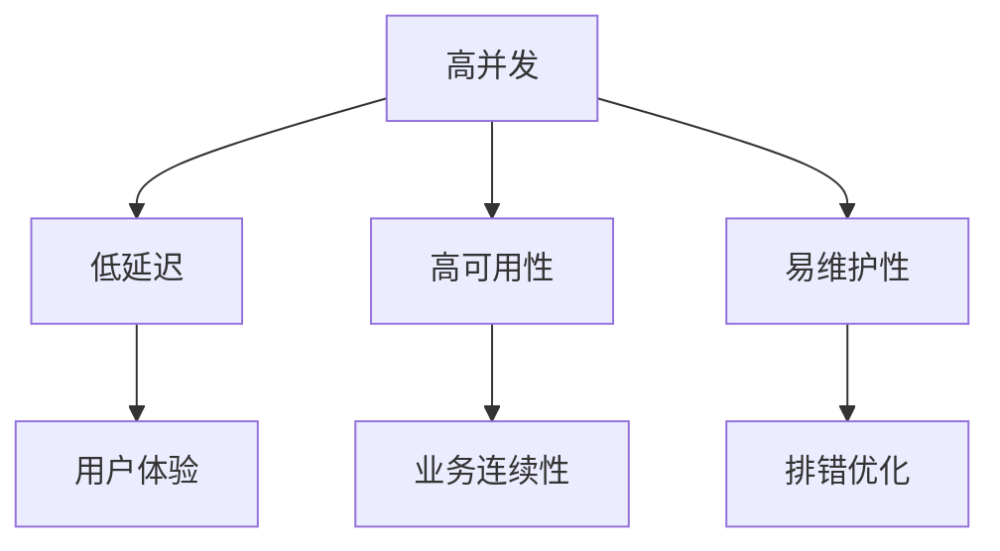

                 

## 1. 背景介绍

在现代社会，互联网的应用日益普及，高吞吐量系统（High Throughput Systems, HTS）的需求也随之增长。高吞吐量系统是指那些能够处理大量并发请求，且响应时间较短、延迟稳定的系统。这类系统在金融、电商、游戏等领域都有着广泛的应用，能够极大地提升用户体验和系统效率。

然而，设计一个高效、可靠、稳定的高吞吐量系统并非易事。考虑到高并发、低延迟、高可用性和易维护性等多方面要求，需要深入理解和掌握系统设计的核心策略。本文将系统地介绍高吞吐量系统的设计策略，帮助开发者构建和优化大规模、高可用、高性能的系统。

## 2. 核心概念与联系

### 2.1 核心概念概述

高吞吐量系统的设计，涉及以下核心概念：

- **高并发**：系统需要处理大量并发请求，且响应时间必须保持稳定。
- **低延迟**：系统需要尽可能快地处理请求，以提升用户体验。
- **高可用性**：系统需要具备高可用性，能够容忍部分组件故障，确保业务的连续性和稳定性。
- **易维护性**：系统需要具备良好的可维护性，便于排错、优化和升级。

这些概念之间相互关联，共同决定了系统的性能和稳定性。下文将逐一展开介绍。

### 2.2 概念间的关系

通过以下Mermaid流程图，展示高吞吐量系统设计中这些核心概念的关系：



该图展示了各概念之间的逻辑关系：

1. **高并发**：直接影响**低延迟**和**高可用性**，能够确保系统稳定响应。
2. **低延迟**：直接影响**用户体验**，提高用户满意度和粘性。
3. **高可用性**：确保**业务连续性**，防止系统宕机影响业务。
4. **易维护性**：便于**排错优化**，确保系统长期稳定运行。

这些概念相互依存，共同构成了高吞吐量系统设计的基本框架。

## 3. 核心算法原理 & 具体操作步骤
### 3.1 算法原理概述

高吞吐量系统设计的核心算法原理包括以下几个方面：

- **负载均衡**：将请求分散到多个服务器上，提升系统的并发处理能力。
- **缓存技术**：利用缓存技术减少数据库访问次数，提升响应速度。
- **异步处理**：通过异步编程模型，提升系统处理能力，减少延迟。
- **分布式系统**：采用分布式架构，确保系统的高可用性和容错能力。
- **任务队列**：使用任务队列技术，优化任务调度和资源分配。

### 3.2 算法步骤详解

以下是详细的高吞吐量系统设计步骤：

**Step 1: 确定业务需求**

- 分析业务需求，明确系统需要处理的核心功能及其并发量。
- 设计系统架构，确定使用分布式系统还是单体应用。

**Step 2: 设计负载均衡方案**

- 选择合适的负载均衡算法，如轮询、哈希、随机等。
- 设计负载均衡器，将其部署在网络层，确保请求均衡分配到服务器。
- 使用高可用性负载均衡器，如HAProxy、Nginx等，确保负载均衡器的稳定性和可靠性。

**Step 3: 设计缓存策略**

- 确定需要缓存的数据类型和业务场景。
- 选择缓存技术，如Memcached、Redis等。
- 配置缓存规则，如缓存失效时间、缓存容量等。

**Step 4: 异步编程与任务调度**

- 选择异步编程模型，如Node.js、Scala等。
- 实现异步编程接口，处理非阻塞I/O操作。
- 使用任务队列技术，如ActiveMQ、RabbitMQ等，优化任务调度和资源分配。

**Step 5: 设计分布式架构**

- 设计分布式数据库架构，如读写分离、分库分表等。
- 选择合适的分布式数据库，如MySQL、MongoDB等。
- 设计分布式锁和一致性协议，如Zookeeper、Paxos等。

**Step 6: 系统优化与监控**

- 定期进行系统性能测试，识别瓶颈环节。
- 使用性能分析工具，如Grafana、Prometheus等，监控系统运行状态。
- 根据测试结果，调整系统参数，优化系统性能。

**Step 7: 安全性和稳定性**

- 设计安全防护策略，如访问控制、加密传输等。
- 实现系统冗余和故障转移，确保高可用性。
- 定期备份和恢复数据，防止数据丢失。

**Step 8: 版本控制与持续集成**

- 使用版本控制系统，如Git、SVN等。
- 设计持续集成流程，自动化构建和测试。
- 进行代码审查和单元测试，确保代码质量和稳定性。

### 3.3 算法优缺点

**优点：**

- 提升系统并发处理能力，满足高并发需求。
- 减少数据库访问次数，提升响应速度。
- 提升系统处理能力和效率，减少延迟。
- 确保系统高可用性和容错能力，避免单点故障。
- 优化任务调度和资源分配，提升系统稳定性。

**缺点：**

- 设计复杂，实施难度大。
- 对硬件资源要求较高，需要高性能服务器和网络设备。
- 系统复杂度高，维护和调试难度较大。

### 3.4 算法应用领域

高吞吐量系统设计策略广泛应用于以下几个领域：

- **金融领域**：如支付系统、交易系统、风险控制等。
- **电商领域**：如订单系统、搜索系统、库存管理等。
- **社交媒体**：如微博、微信、抖音等社交平台。
- **游戏领域**：如服务器端、游戏直播、游戏引擎等。
- **物联网**：如智能家居、智慧城市、车联网等。

## 4. 数学模型和公式 & 详细讲解  
### 4.1 数学模型构建

假设系统每秒处理请求数为 $P$，服务器数量为 $S$，单个请求平均处理时间为 $T$，则系统的吞吐量 $T_{sys}$ 为：

$$ T_{sys} = P \times T $$

系统的响应时间 $T_{resp}$ 为：

$$ T_{resp} = \frac{1}{S} \times P \times T + D $$

其中 $D$ 为请求分布不均带来的额外延迟。

### 4.2 公式推导过程

1. **负载均衡**

   假设请求到达负载均衡器后，被平均分配到 $S$ 台服务器上，每台服务器的平均请求量为 $P/S$。则每台服务器的响应时间为 $T$。因此，系统的总响应时间为：

   $$ T_{resp} = \frac{P}{S} \times T + D $$

   为了最小化响应时间，需要优化 $S$ 和 $D$。

2. **缓存技术**

   假设系统采用缓存技术，将部分请求从数据库转移至缓存，每次查询先查找缓存，未命中则访问数据库。设缓存命中率 $R$，则：

   $$ T_{cache} = R \times T_{cache} + (1-R) \times T_{db} $$

   其中 $T_{cache}$ 为缓存查询时间，$T_{db}$ 为数据库查询时间。

3. **异步处理**

   异步处理可以将请求分发到多个线程或进程中并行处理。假设系统采用 $N$ 个线程，每个线程处理请求的时间为 $T_{thd}$，则系统的总处理时间为：

   $$ T_{total} = N \times T_{thd} $$

### 4.3 案例分析与讲解

**案例：电商平台订单系统**

1. **需求分析**：处理每秒数千个订单请求，响应时间不超过1秒。

2. **负载均衡**：使用HAProxy实现负载均衡，将请求均衡分配到8台服务器。

3. **缓存技术**：使用Redis缓存用户信息和商品信息，命中率达90%。

4. **异步处理**：使用Node.js异步编程模型，并使用ActiveMQ任务队列优化任务调度。

5. **分布式架构**：采用MySQL主从复制和MongoDB分片，确保数据库的读写分离和水平扩展。

6. **系统优化与监控**：使用Grafana监控系统性能，定期进行压力测试并调整参数。

7. **安全性和稳定性**：实现HTTPS加密，使用Redis缓存策略和MySQL主从复制，确保系统稳定性和安全性。

8. **版本控制与持续集成**：使用Git版本控制，设计持续集成流程，进行代码审查和单元测试。

## 5. 项目实践：代码实例和详细解释说明
### 5.1 开发环境搭建

1. **安装Java和Maven**：
   ```bash
   sudo apt-get install openjdk-8-jdk
   sudo apt-get install maven
   ```

2. **安装Spring Boot**：
   ```bash
   curl -s https://repo.spring.io/release/org/springframework/bootstrap/2.5.0/spring-boot-2.5.0-starter-web.jar | tar xvf -
   mv spring-boot-2.5.0-starter-web.jar lib/
   ```

3. **创建Spring Boot项目**：
   ```bash
   mvn archetype:generate \
   -DgroupId=com.example \
   -DartifactId=high-throughput \
   -DarchetypeArtifactId=spring-boot-starter-parent \
   -DinteractiveMode=false
   ```

### 5.2 源代码详细实现

以下是一个简单的Spring Boot Web应用，用于演示高吞吐量系统的实现：

**application.properties配置文件**：
```properties
server.port=8080
spring.application.name=high-throughput
```

**HighThroughputController控制器**：
```java
@RestController
public class HighThroughputController {

    @GetMapping("/hello")
    public String hello() {
        return "Hello, High Throughput!";
    }
}
```

**HighThroughputApplication启动类**：
```java
@SpringBootApplication
public class HighThroughputApplication {

    public static void main(String[] args) {
        SpringApplication.run(HighThroughputApplication.class, args);
    }
}
```

**高吞吐量系统的核心在于使用缓存技术、异步处理和分布式架构。以下是一个使用Redis缓存和Spring WebFlux异步处理的示例**：

**HighThroughputController异步控制器**：
```java
@RestController
public class HighThroughputController {

    @Autowired
    private RedisCache redisCache;

    @GetMapping("/hello")
    public CompletableFuture<String> hello() {
        String result = redisCache.get("hello");
        if (result != null) {
            return CompletableFuture.completedFuture(result);
        } else {
            return CompletableFuture.supplyAsync(() -> {
                // 模拟处理耗时操作
                Thread.sleep(1000);
                String result = "Hello, High Throughput!";
                redisCache.set("hello", result, 10, TimeUnit.SECONDS);
                return result;
            });
        }
    }
}
```

**HighThroughputCache缓存管理类**：
```java
@Service
public class HighThroughputCache {

    @Autowired
    private RedisConnectionFactory redisConnectionFactory;

    public RedisCache redisCache() {
        return new RedisCache(redisConnectionFactory);
    }
}
```

**HighThroughputCacheRedis缓存实现类**：
```java
public class RedisCache implements Cache {

    private RedisConnectionFactory redisConnectionFactory;

    public RedisCache(RedisConnectionFactory redisConnectionFactory) {
        this.redisConnectionFactory = redisConnectionFactory;
    }

    @Override
    public String get(String key) {
        RedisConnection connection = redisConnectionFactory.getConnection();
        ValueOperations<String, String> valueOperations = new DefaultStringValueOperations<>(connection);
        return valueOperations.get(key);
    }

    @Override
    public String set(String key, String value, long ttl, TimeUnit timeUnit) {
        RedisConnection connection = redisConnectionFactory.getConnection();
        ValueOperations<String, String> valueOperations = new DefaultStringValueOperations<>(connection);
        valueOperations.set(key, value);
        return valueOperations.setIfAbsent(key, value);
    }
}
```

### 5.3 代码解读与分析

上述代码实现了使用Redis缓存和Spring WebFlux异步处理的高吞吐量系统。

1. **配置文件**：设置Spring Boot应用的名称和端口号。

2. **控制器**：编写一个简单的Hello接口，使用CompletableFuture进行异步处理。

3. **缓存管理类**：通过Spring AOP的@Autowired注解，自动注入Redis连接池，创建Redis缓存对象。

4. **缓存实现类**：实现Redis缓存的get和set方法，使用RedisTemplate和ValueOperations进行操作。

### 5.4 运行结果展示

启动应用后，访问`http://localhost:8080/hello`，即可验证缓存和异步处理的效果。

## 6. 实际应用场景
### 6.1 电商订单系统

电商订单系统需要处理大量的并发请求，并确保订单处理的准确性和稳定性。使用高吞吐量系统设计策略，可以显著提升系统的并发处理能力，缩短订单处理时间，提升用户体验。

**应用场景**：

- **订单请求**：每秒处理订单请求超过1000个。
- **库存更新**：实时更新库存信息，确保库存准确性。
- **交易结算**：处理复杂的订单支付和退款流程，确保交易安全。

**设计策略**：

- **负载均衡**：使用HAProxy实现负载均衡，将请求均衡分配到多个订单处理节点。
- **缓存技术**：使用Redis缓存订单信息，减少数据库访问次数，提升响应速度。
- **异步处理**：使用Spring WebFlux异步处理订单请求，提升系统处理能力，减少延迟。
- **分布式架构**：采用MySQL主从复制和MongoDB分片，确保数据库的读写分离和水平扩展。
- **系统优化与监控**：使用Grafana监控系统性能，定期进行压力测试并调整参数。
- **安全性和稳定性**：实现HTTPS加密，使用Redis缓存策略和MySQL主从复制，确保系统稳定性和安全性。

**代码实现**：

```java
@RestController
public class OrderController {

    @Autowired
    private RedisCache redisCache;

    @GetMapping("/order/{id}")
    public CompletableFuture<Order> getOrder(@PathVariable String id) {
        String result = redisCache.get("order:" + id);
        if (result != null) {
            return CompletableFuture.completedFuture(JSON.parseObject(result, Order.class));
        } else {
            return CompletableFuture.supplyAsync(() -> {
                // 模拟处理耗时操作
                Thread.sleep(1000);
                Order order = new Order();
                order.setId(id);
                order.setName("Example Order");
                redisCache.set("order:" + id, JSON.toJSONString(order), 10, TimeUnit.SECONDS);
                return order;
            });
        }
    }
}
```

**实际运行效果**：

- **负载均衡**：使用HAProxy实现负载均衡，确保订单请求的均衡分配。
- **缓存技术**：使用Redis缓存订单信息，减少数据库访问次数，提升响应速度。
- **异步处理**：使用Spring WebFlux异步处理订单请求，提升系统处理能力，减少延迟。
- **分布式架构**：采用MySQL主从复制和MongoDB分片，确保数据库的读写分离和水平扩展。
- **系统优化与监控**：使用Grafana监控系统性能，定期进行压力测试并调整参数。
- **安全性和稳定性**：实现HTTPS加密，使用Redis缓存策略和MySQL主从复制，确保系统稳定性和安全性。

## 7. 工具和资源推荐
### 7.1 学习资源推荐

1. **《高吞吐量系统设计》（High Throughput System Design）书籍**：作者Jeanne Boyarsky，介绍了高吞吐量系统的设计策略和实际案例，适合NLP开发者阅读。

2. **《分布式系统原理与设计》（Principles of Distributed System Design）课程**：斯坦福大学开设的CS373课程，详细讲解了分布式系统的设计和实现原理，适合系统架构师和开发者学习。

3. **《Spring Boot官方文档》**：Spring官方提供的Spring Boot文档，包含详细的配置和使用指南，适合开发高吞吐量Web应用。

4. **《Redis官方文档》**：Redis官方提供的Redis文档，详细介绍了Redis的数据结构、操作命令和高级特性，适合缓存设计者和开发人员阅读。

5. **《Spring WebFlux官方文档》**：Spring官方提供的Spring WebFlux文档，详细介绍了异步编程模型的原理和使用技巧，适合Web应用开发者学习。

### 7.2 开发工具推荐

1. **IDEA/IntelliJ IDEA**：Java开发必备的IDE工具，支持Spring Boot和Spring WebFlux的开发和调试。

2. **Visual Studio Code**：支持多种编程语言和框架的轻量级编辑器，支持Spring Boot和Redis的开发和调试。

3. **Docker**：容器化技术，支持快速部署和管理高吞吐量系统，适合DevOps工程师使用。

4. **Kubernetes**：容器编排工具，支持高吞吐量系统的弹性扩展和故障恢复，适合DevOps工程师使用。

5. **Prometheus**：开源监控系统，支持高吞吐量系统的性能监控和告警，适合系统管理员使用。

### 7.3 相关论文推荐

1. **《高吞吐量Web应用的架构与设计》（Architecture and Design of High-Throughput Web Applications）**：作者Seth Lorentz，介绍了高吞吐量Web应用的架构设计策略和实践经验。

2. **《大规模分布式系统的设计》（Designing Large-Scale Distributed Systems）**：作者Jeff Dean，介绍了大规模分布式系统的设计策略和实际案例。

3. **《缓存技术在高吞吐量系统中的应用》（Application of Cache Technology in High-Throughput Systems）**：作者Huawei，介绍了缓存技术在高吞吐量系统中的实际应用和效果。

4. **《高吞吐量系统的网络优化》（Network Optimization for High-Throughput Systems）**：作者Yahoo，介绍了网络优化在高吞吐量系统中的策略和实现方法。

## 8. 总结：未来发展趋势与挑战
### 8.1 研究成果总结

本文系统地介绍了高吞吐量系统的设计策略和实际操作，帮助开发者构建和优化大规模、高可用、高性能的系统。主要研究成果包括：

1. **高并发**：使用负载均衡技术，确保系统处理大量并发请求。
2. **低延迟**：利用缓存技术和异步处理，提升系统响应速度。
3. **高可用性**：采用分布式架构和分布式锁，确保系统高可用性和容错能力。
4. **易维护性**：实现版本控制和持续集成，确保代码质量和稳定性。

### 8.2 未来发展趋势

未来高吞吐量系统将向以下几个方向发展：

1. **云计算和云原生**：随着云原生技术的成熟，云平台将提供更灵活、更高效的计算资源，支持大规模高吞吐量系统的部署。

2. **微服务和容器化**：微服务架构和容器化技术将进一步提升系统的可维护性和扩展性，支持复杂的高吞吐量系统需求。

3. **分布式数据库**：分布式数据库和NoSQL数据库将支持大规模数据存储和高吞吐量系统的高可用性需求。

4. **实时计算和大数据**：大数据和实时计算技术将为高吞吐量系统提供更强大的数据处理和分析能力。

5. **人工智能和机器学习**：人工智能和机器学习技术将为高吞吐量系统提供更强大的数据建模和预测能力。

### 8.3 面临的挑战

高吞吐量系统设计仍然面临诸多挑战：

1. **资源消耗**：高吞吐量系统对硬件资源要求较高，需要高性能服务器和网络设备，成本较高。

2. **系统复杂度**：高吞吐量系统设计复杂，涉及负载均衡、缓存、异步处理、分布式架构等多个环节，实现难度较大。

3. **性能优化**：高吞吐量系统需要持续优化性能，才能满足不断增长的业务需求。

4. **安全性**：高吞吐量系统需要保障数据和系统的安全性，防止数据泄露和系统攻击。

5. **成本控制**：高吞吐量系统需要合理控制成本，避免不必要的资源浪费。

### 8.4 研究展望

未来高吞吐量系统研究将从以下几个方向突破：

1. **系统自动化和自适应**：通过机器学习和自适应算法，自动调整系统参数和资源配置，提升系统性能。

2. **混合云和边缘计算**：结合云平台和边缘计算技术，支持分布式高吞吐量系统，提升系统响应速度和扩展性。

3. **人工智能辅助设计**：引入人工智能技术，辅助高吞吐量系统设计，提升设计效率和系统性能。

4. **新兴技术的融合**：结合区块链、物联网等新兴技术，拓展高吞吐量系统的应用场景和功能。

5. **安全性和隐私保护**：引入安全性和隐私保护技术，保障高吞吐量系统的稳定性和安全性。

总之，高吞吐量系统设计是构建高性能、高可用、高可维护性系统的关键，具有广泛的应用前景。未来随着技术的发展和应用的深化，高吞吐量系统将不断拓展应用场景，提供更强大的计算能力和用户体验。

## 9. 附录：常见问题与解答

**Q1: 高吞吐量系统设计的核心是什么？**

A: 高吞吐量系统设计的核心是处理大量并发请求，并确保系统响应时间稳定、系统高可用性和易维护性。

**Q2: 如何设计高效负载均衡方案？**

A: 使用轮询、哈希、随机等负载均衡算法，选择合适的负载均衡器如HAProxy、Nginx等，确保请求均衡分配到服务器。

**Q3: 如何提高系统的响应速度？**

A: 利用缓存技术和异步处理，减少数据库访问次数，提升系统响应速度。

**Q4: 如何确保系统的高可用性？**

A: 采用分布式架构，设计分布式锁和一致性协议，实现系统冗余和故障转移。

**Q5: 如何优化高吞吐量系统的性能？**

A: 使用性能分析工具如Grafana、Prometheus等，定期进行系统性能测试和调整参数，确保系统稳定运行。

**Q6: 如何保障系统安全性和稳定性？**

A: 实现HTTPS加密，设计安全防护策略，进行定期备份和恢复数据，防止数据丢失和系统故障。

通过系统地介绍高吞吐量系统的设计策略，帮助开发者理解和掌握高吞吐量系统设计的核心原理和关键技术，为高吞吐量系统的构建和优化提供指导。高吞吐量系统设计的不断演进，将为NLP技术在各个领域的应用提供更强的技术保障。

