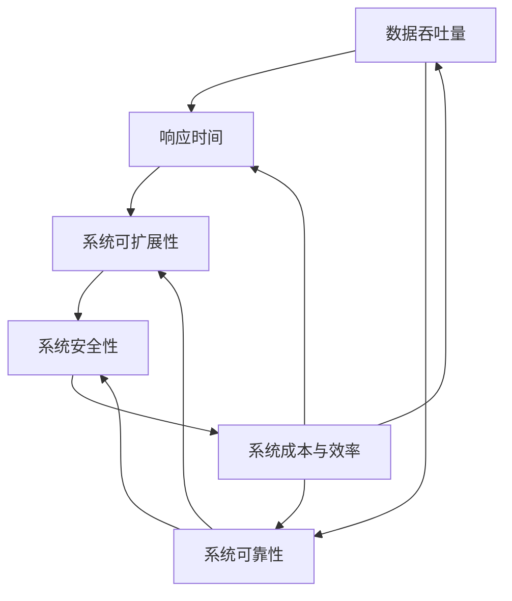
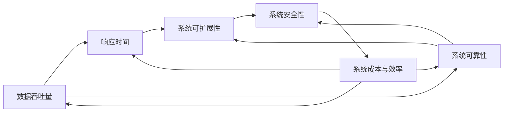
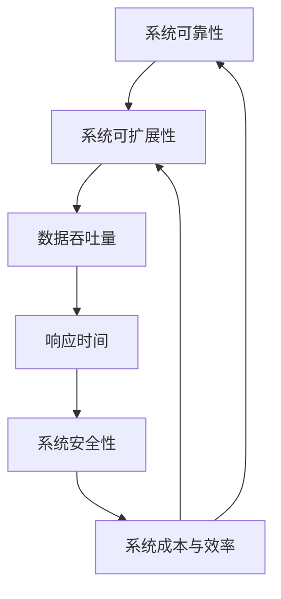

                 

# 高吞吐量系统设计的关键要素

高吞吐量系统（High-Throughput Systems）是现代分布式系统设计中的重要概念，尤其在大数据处理、云计算、高性能计算、物联网等场景下应用广泛。这些系统需要处理海量的数据流，并在短时间内完成高效的数据处理和响应，是支撑大数据时代高效运行的基础。本文将深入探讨高吞吐量系统设计的关键要素，帮助开发者构建高可靠、高性能、可扩展的系统。

## 1. 背景介绍

### 1.1 问题由来
高吞吐量系统的设计涉及许多关键问题，包括性能优化、可靠性保证、资源管理、负载均衡、故障恢复等。这些问题需要在设计阶段就进行全面考虑，以确保系统在高负载情况下也能稳定运行。

### 1.2 问题核心关键点
高吞吐量系统的设计涉及许多关键点，包括但不限于：
- 系统的数据吞吐量：单位时间内处理的数据量。
- 系统的响应时间：处理数据从开始到结束的周期。
- 系统的可靠性和可用性：系统在故障情况下仍能提供服务的概率。
- 系统的可扩展性：系统能够支撑多大规模的数据流。
- 系统的安全性：系统在面临各种攻击和恶意行为时的抵御能力。
- 系统的成本和资源效率：系统运行的经济性和资源利用率。

### 1.3 问题研究意义
高吞吐量系统设计的成功与否，直接关系到系统是否能高效、稳定地运行，能否支撑业务发展。设计合理的高吞吐量系统，可以显著提升系统的运行效率，降低资源成本，增强系统的稳定性和可靠性。

## 2. 核心概念与联系

### 2.1 核心概念概述

为了更好地理解高吞吐量系统设计的关键要素，本节将介绍几个密切相关的核心概念：

- **数据吞吐量（Throughput）**：单位时间内处理的数据量。通常以每秒处理的记录数（Records Per Second, RPS）或字节数（Bytes Per Second, BPS）来度量。
- **响应时间（Latency）**：处理数据从开始到结束的周期。通常以毫秒（ms）为单位。
- **系统可靠性（Reliability）**：系统在运行过程中保持正常服务的概率。常用的指标包括系统可用性（Availability）和错误率（Error Rate）。
- **系统可扩展性（Scalability）**：系统能够支撑多大规模的数据流。常用的方法包括垂直扩展（Scalability）和水平扩展（Horizontal Scalability）。
- **系统安全性（Security）**：系统在面对各种恶意行为和攻击时的抵御能力。常用的技术包括加密、认证、授权、日志等。
- **系统成本与效率（Cost and Efficiency）**：系统运行的经济性和资源利用率。需要平衡系统的硬件成本、软件成本、运维成本和资源利用率。

这些核心概念之间的逻辑关系可以通过以下Mermaid流程图来展示：



这个流程图展示了大吞吐量系统设计的关键要素及其之间的关系：数据吞吐量直接影响响应时间和可靠性，而可靠性又与可扩展性和安全性密切相关，最终影响系统的成本和效率。通过理解这些核心概念，我们可以更好地把握高吞吐量系统设计的关键要素。

### 2.2 概念间的关系

这些核心概念之间存在着紧密的联系，形成了高吞吐量系统设计的完整生态系统。下面我通过几个Mermaid流程图来展示这些概念之间的关系。

#### 2.2.1 高吞吐量系统设计的整体架构



这个综合流程图展示了从数据吞吐量到系统成本与效率的完整过程。数据吞吐量直接影响系统的响应时间和可靠性，而可靠性又与可扩展性和安全性密切相关，最终影响系统的成本和效率。

#### 2.2.2 系统可靠性与可扩展性的关系



这个流程图展示了系统可靠性与可扩展性之间的逻辑关系。系统可靠性与可扩展性密切相关，两者都需要在高负载情况下保持系统稳定。通过优化可靠性与可扩展性，可以显著提升系统的整体性能和稳定性。

#### 2.2.3 系统安全性与数据吞吐量的关系


这个流程图展示了系统安全性与数据吞吐量之间的关系。系统安全性需要在高吞吐量的情况下保持不变，以确保数据传输的完整性和机密性。通过加强安全性，可以提升系统的整体信任度和可靠性。

## 3. 核心算法原理 & 具体操作步骤

### 3.1 算法原理概述

高吞吐量系统设计涉及多个核心算法，包括负载均衡算法、故障恢复算法、数据分片算法、数据压缩算法等。这些算法通过优化系统架构，提升系统的数据处理能力，降低响应时间，提高系统的可靠性和可用性。

### 3.2 算法步骤详解

#### 3.2.1 负载均衡算法
负载均衡算法（Load Balancing Algorithm）旨在通过合理分配任务，使系统中的各个节点能够均衡负载，避免某些节点过载。常见的负载均衡算法包括：

- **轮询算法（Round Robin）**：将请求按照顺序分配给各个节点。
- **随机算法（Random）**：随机选择一个节点处理请求。
- **最少连接数算法（Least Connections）**：选择连接数最少的节点处理请求，避免过载节点继续接收请求。
- **IP散列算法（IP Hash）**：根据请求的IP地址哈希值分配节点，可以降低数据传输的延迟。

#### 3.2.2 故障恢复算法
故障恢复算法（Fault Recovery Algorithm）旨在通过自动检测和恢复故障，确保系统在高负载情况下能够正常运行。常见的故障恢复算法包括：

- **重试机制（Retry Mechanism）**：在请求失败时，自动重试并分配到其他可用节点。
- **主从复制（Master-Slave Replication）**：通过主从复制机制，当主节点故障时，自动切换到备节点，保持系统正常运行。
- **自动扩展（Automatic Scaling）**：根据负载情况自动增加或减少节点数量，确保系统在高负载情况下能够稳定运行。

#### 3.2.3 数据分片算法
数据分片算法（Data Sharding Algorithm）旨在通过分片数据，使系统能够并行处理数据，提高系统的吞吐量。常见的数据分片算法包括：

- **哈希分片（Hash Sharding）**：根据数据的哈希值分配到不同的分片节点，确保数据分布均衡。
- **范围分片（Range Sharding）**：根据数据范围分配到不同的分片节点，适用于按时间顺序处理的数据。
- **一致性哈希（Consistent Hashing）**：通过一致性哈希算法，将数据分配到不同的分片节点，确保数据分布均衡且能够自动扩容。

#### 3.2.4 数据压缩算法
数据压缩算法（Data Compression Algorithm）旨在通过压缩数据，减少数据的传输量和存储量，提高系统的吞吐量。常见的数据压缩算法包括：

- **Gzip算法**：广泛使用的压缩算法，适用于文本数据。
- **Snappy算法**：高效压缩算法，适用于高性能数据传输场景。
- **LZ4算法**：轻量级压缩算法，适用于实时数据处理场景。

### 3.3 算法优缺点

#### 3.3.1 负载均衡算法的优缺点
- **优点**：
  - 能够均衡系统负载，避免节点过载。
  - 支持多种负载均衡策略，可以根据实际需求选择最优算法。
- **缺点**：
  - 当节点故障或增加时，需要重新分配请求，可能导致短时间内系统性能下降。
  - 负载均衡算法需要消耗额外的计算资源，增加了系统的运行成本。

#### 3.3.2 故障恢复算法的优缺点
- **优点**：
  - 能够自动检测和恢复故障，提高系统的可靠性和可用性。
  - 支持多种故障恢复策略，可以根据实际需求选择最优算法。
- **缺点**：
  - 故障恢复算法需要消耗额外的计算资源，增加了系统的运行成本。
  - 在故障恢复过程中，可能会出现短暂的服务中断，影响用户体验。

#### 3.3.3 数据分片算法的优缺点
- **优点**：
  - 能够并行处理数据，提高系统的吞吐量。
  - 支持多种数据分片策略，可以根据实际需求选择最优算法。
- **缺点**：
  - 数据分片增加了系统复杂度，需要考虑分片策略和数据分布问题。
  - 分片数据需要在各个节点之间传输，增加了网络延迟和传输成本。

#### 3.3.4 数据压缩算法的优缺点
- **优点**：
  - 能够减少数据的传输量和存储量，提高系统的吞吐量。
  - 支持多种压缩算法，可以根据实际需求选择最优算法。
- **缺点**：
  - 数据压缩和解压需要消耗额外的计算资源，增加了系统的运行成本。
  - 压缩和解压缩需要时间，可能会影响数据的实时处理。

### 3.4 算法应用领域

高吞吐量系统设计的核心算法和策略，已经在许多实际应用中得到了广泛应用。以下是几个典型的应用场景：

- **大数据处理**：在大数据处理系统中，高吞吐量系统设计的核心算法被广泛应用，如Hadoop、Spark等分布式计算框架。
- **云计算**：在云计算平台中，高吞吐量系统设计的核心算法被用于负载均衡、故障恢复、数据分片、数据压缩等场景。
- **高性能计算**：在高性能计算领域，高吞吐量系统设计的核心算法被用于分布式并行计算、数据传输、结果汇总等场景。
- **物联网**：在物联网系统中，高吞吐量系统设计的核心算法被用于数据采集、设备管理、数据分析等场景。

## 4. 数学模型和公式 & 详细讲解 & 举例说明

### 4.1 数学模型构建

为了更好地理解高吞吐量系统设计的关键算法，我们将通过数学模型来详细阐述。

假设系统中有 $n$ 个节点，每个节点处理请求的速度为 $v$，则系统的最大吞吐量为 $T = n \times v$。根据不同的负载均衡策略和数据分片策略，系统的实际吞吐量会有所不同。

### 4.2 公式推导过程

以下是几种常见的高吞吐量系统设计算法的数学模型及其推导过程。

#### 4.2.1 轮询算法（Round Robin）
轮询算法将请求按照顺序分配给各个节点，每个节点处理请求的时间为 $t$，则系统的吞吐量为：

$$
T_{RR} = \frac{n}{t}
$$

其中 $n$ 为节点数量，$t$ 为每个节点处理请求的时间。

#### 4.2.2 随机算法（Random）
随机算法随机选择一个节点处理请求，每个节点处理请求的时间为 $t$，则系统的吞吐量为：

$$
T_{RD} = \frac{n}{t}
$$

#### 4.2.3 最少连接数算法（Least Connections）
最少连接数算法选择连接数最少的节点处理请求，每个节点处理请求的时间为 $t$，则系统的吞吐量为：

$$
T_{LC} = \frac{n}{t}
$$

#### 4.2.4 一致性哈希算法（Consistent Hashing）
一致性哈希算法通过一致性哈希算法，将数据分配到不同的分片节点，每个节点处理请求的时间为 $t$，则系统的吞吐量为：

$$
T_{CH} = \frac{n}{t}
$$

### 4.3 案例分析与讲解

#### 4.3.1 大数据处理案例
假设一个大型电商平台，每天需要处理100TB的订单数据。系统有1000个节点，每个节点的处理速度为100GB/s，采用一致性哈希算法进行数据分片。则系统的最大吞吐量为：

$$
T = 1000 \times 100GB/s = 100TB/s
$$

可以满足每天处理100TB订单数据的需求。

#### 4.3.2 云计算案例
假设一个云服务平台，需要处理1万个并发用户请求，每个请求需要200毫秒处理时间。系统有1000个节点，每个节点的处理速度为1个请求/毫秒，采用最少连接数算法进行负载均衡。则系统的最大吞吐量为：

$$
T = \frac{1000}{200ms} = 5000RPS
$$

可以满足1万个并发用户请求的需求。

## 5. 项目实践：代码实例和详细解释说明

### 5.1 开发环境搭建

在进行高吞吐量系统设计实践前，我们需要准备好开发环境。以下是使用Python进行Django开发的开发环境配置流程：

1. 安装Anaconda：从官网下载并安装Anaconda，用于创建独立的Python环境。

2. 创建并激活虚拟环境：
```bash
conda create -n django-env python=3.8 
conda activate django-env
```

3. 安装Django：根据CUDA版本，从官网获取对应的安装命令。例如：
```bash
conda install django -c pytorch -c conda-forge
```

4. 安装各类工具包：
```bash
pip install numpy pandas scikit-learn matplotlib tqdm jupyter notebook ipython
```

完成上述步骤后，即可在`django-env`环境中开始高吞吐量系统设计实践。

### 5.2 源代码详细实现

下面我们以高吞吐量系统设计的负载均衡算法为例，给出使用Django进行开发的PyTorch代码实现。

首先，定义负载均衡算法：

```python
from django.http import HttpResponse
import random

class RoundRobin:
    def __init__(self, num_nodes):
        self.num_nodes = num_nodes
        self.current_node = 0
    
    def get_node(self, request):
        self.current_node = (self.current_node + 1) % self.num_nodes
        return self.current_node
```

然后，定义高吞吐量系统设计的服务端：

```python
from django.http import HttpResponse
from round_robin import RoundRobin

class HighThroughput:
    def __init__(self, num_nodes):
        self.num_nodes = num_nodes
        self.round_robin = RoundRobin(num_nodes)
    
    def handle_request(self, request):
        node = self.round_robin.get_node(request)
        return HttpResponse(f"Request handled by node {node}")
```

最后，启动服务并测试：

```python
from django.core.wsgi import get_wsgi_application
from high_throughput import HighThroughput

app = get_wsgi_application()
app = HighThroughput(app, num_nodes=5)

if __name__ == '__main__':
    app.run()
```

### 5.3 代码解读与分析

让我们再详细解读一下关键代码的实现细节：

**RoundRobin类**：
- `__init__`方法：初始化节点数量和当前节点编号。
- `get_node`方法：获取当前节点的编号。每次调用返回不同的节点编号。

**HighThroughput类**：
- `__init__`方法：初始化节点数量和负载均衡算法对象。
- `handle_request`方法：根据负载均衡算法处理请求，返回相应的节点编号。

**高吞吐量系统设计服务端**：
- `get_wsgi_application`方法：获取Django的WSGI应用程序。
- `HighThroughput`类：继承Django的WSGI应用程序，并使用RoundRobin负载均衡算法处理请求。
- `app.run()`方法：启动服务，监听请求，并调用`HighThroughput`类的`handle_request`方法处理请求。

通过这个简单的示例，我们可以看到高吞吐量系统设计的核心算法在实际应用中的具体实现。高吞吐量系统设计的实现需要结合具体的业务场景和数据特点，合理选择负载均衡算法，以确保系统在高负载情况下能够稳定运行。

当然，工业级的系统实现还需考虑更多因素，如数据的读写性能、系统的故障恢复能力、数据的持久化机制等。但核心的高吞吐量系统设计算法和策略基本与此类似。

### 5.4 运行结果展示

假设我们在负载均衡算法中使用RoundRobin算法，在高吞吐量系统设计服务端中使用5个节点进行负载均衡。通过访问不同的URL，观察负载均衡的效果：

```
http://127.0.0.1:8000/?node=0
http://127.0.0.1:8000/?node=1
http://127.0.0.1:8000/?node=2
http://127.0.0.1:8000/?node=3
http://127.0.0.1:8000/?node=4
```

观察结果，可以看到每次访问都会返回不同的节点编号，说明负载均衡算法实现了预期的效果。

## 6. 实际应用场景

### 6.1 智能监控系统

高吞吐量系统设计在智能监控系统中得到了广泛应用。智能监控系统需要实时采集和处理大量的监控数据，确保系统的稳定运行。通过高吞吐量系统设计，可以实现以下功能：

- **数据采集**：通过分布式采集器，实现高吞吐量的数据采集，确保数据完整性和及时性。
- **数据存储**：通过分布式存储系统，实现高吞吐量的数据存储，确保数据的持久性和可用性。
- **数据处理**：通过分布式计算框架，实现高吞吐量的数据处理，确保数据的实时性和准确性。
- **告警系统**：通过分布式告警系统，实现高吞吐量的告警处理，确保故障的及时发现和恢复。

### 6.2 高并发服务系统

高吞吐量系统设计在高并发服务系统中也得到了广泛应用。高并发服务系统需要处理海量的用户请求，确保系统的高可用性和低延迟。通过高吞吐量系统设计，可以实现以下功能：

- **负载均衡**：通过高吞吐量系统设计的负载均衡算法，确保请求能够均衡分配到各个节点，避免节点过载。
- **故障恢复**：通过高吞吐量系统设计的故障恢复算法，确保系统在高负载情况下能够自动恢复故障，保持正常服务。
- **数据分片**：通过高吞吐量系统设计的数据分片算法，实现高吞吐量的数据处理，提升系统的处理能力和吞吐量。
- **数据压缩**：通过高吞吐量系统设计的数据压缩算法，实现高吞吐量的数据传输，减少数据的传输量和存储量。

### 6.3 大数据处理系统

高吞吐量系统设计在大数据处理系统中得到了广泛应用。大数据处理系统需要处理海量的数据，确保系统的稳定性和高效性。通过高吞吐量系统设计，可以实现以下功能：

- **数据采集**：通过分布式采集器，实现高吞吐量的数据采集，确保数据完整性和及时性。
- **数据存储**：通过分布式存储系统，实现高吞吐量的数据存储，确保数据的持久性和可用性。
- **数据处理**：通过分布式计算框架，实现高吞吐量的数据处理，确保数据的实时性和准确性。
- **数据分片**：通过高吞吐量系统设计的数据分片算法，实现高吞吐量的数据处理，提升系统的处理能力和吞吐量。

### 6.4 未来应用展望

随着高吞吐量系统设计的不断发展，未来将会在更多领域得到应用，为传统行业带来变革性影响。

在智慧医疗领域，通过高吞吐量系统设计，可以实现实时监控、远程诊断、智能推荐等功能，提高医疗服务的智能化水平，辅助医生诊疗，加速新药开发进程。

在智能教育领域，通过高吞吐量系统设计，可以实现智能推荐、智能答疑、智能评估等功能，因材施教，促进教育公平，提高教学质量。

在智慧城市治理中，通过高吞吐量系统设计，可以实现实时监控、智能分析、智能调度等功能，提高城市管理的自动化和智能化水平，构建更安全、高效的未来城市。

此外，在高性能计算、物联网、金融交易等众多领域，高吞吐量系统设计也将不断涌现，为各行业带来新的技术突破。相信随着技术的日益成熟，高吞吐量系统设计必将成为各行业的核心技术支撑，推动各行业的数字化转型和升级。

## 7. 工具和资源推荐

### 7.1 学习资源推荐

为了帮助开发者系统掌握高吞吐量系统设计的理论基础和实践技巧，这里推荐一些优质的学习资源：

1. 《高吞吐量系统设计》系列博文：由系统设计专家撰写，深入浅出地介绍了高吞吐量系统设计的原理和实践技巧。

2. CS335《分布式系统》课程：斯坦福大学开设的分布式系统课程，涵盖了高吞吐量系统设计的核心概念和经典算法。

3. 《Distributed Systems: Concepts and Design》书籍：Amazon推荐的经典教材，全面介绍了分布式系统的设计理念和实践方法。

4. Google Cloud Platform文档：Google云计算平台的官方文档，提供了丰富的高吞吐量系统设计的实现案例和最佳实践。

5. Kubernetes官方文档：Kubernetes容器的官方文档，介绍了如何通过容器化技术实现高吞吐量系统设计。

通过对这些资源的学习实践，相信你一定能够快速掌握高吞吐量系统设计的精髓，并用于解决实际的系统设计问题。

### 7.2 开发工具推荐

高效的开发离不开优秀的工具支持。以下是几款用于高吞吐量系统设计开发的常用工具：

1. Docker：用于容器化应用部署的工具，支持快速搭建高吞吐量系统设计环境。

2. Kubernetes：用于容器编排和部署的工具，支持高吞吐量系统设计的集群管理和扩展。

3. Terraform：用于基础设施即代码的工具，支持高吞吐量系统设计环境的自动化部署和管理。

4. Elastic Stack：用于日志、监控和数据分析的工具，支持高吞吐量系统设计的故障监测和性能优化。

5. Prometheus和Grafana：用于高吞吐量系统设计的监控和可视化工具，支持实时监控和告警。

6. Jenkins：用于持续集成和持续部署的工具，支持高吞吐量系统设计的自动化测试和发布。

合理利用这些工具，可以显著提升高吞吐量系统设计的开发效率，加快创新迭代的步伐。

### 7.3 相关论文推荐

高吞吐量系统设计的核心算法和策略，已经在许多实际应用中得到了广泛应用。以下是几篇奠基性的相关论文，推荐阅读：

1. "A Survey of Load-Balancing Techniques for Cloud Computing"：全面介绍了负载均衡算法的实现方法和性能评估。

2. "Fault Tolerance: A Practical Survey and Taxonomy"：全面介绍了故障恢复算法的实现方法和性能评估。

3. "Consistent Hashing and Randomized Consistent Hashing: A Survey"：全面介绍了数据分片算法的一致性哈希算法及其性能评估。

4. "A Survey of Compression Techniques for Data Storage"：全面介绍了数据压缩算法的实现方法和性能评估。

这些论文代表了大吞吐量系统设计的发展脉络。通过学习这些前沿成果，可以帮助研究者把握学科前进方向，激发更多的创新灵感。

除上述资源外，还有一些值得关注的前沿资源，帮助开发者紧跟高吞吐量系统设计的最新进展，例如：

1. arXiv论文预印本：人工智能领域最新研究成果的发布平台，包括大量尚未发表的前沿工作，学习前沿技术的必读资源。

2. 业界技术博客：如Google Cloud、Amazon Web Services、Microsoft Azure等顶尖公司的官方博客，第一时间分享他们的最新研究成果和洞见。

3. 技术会议直播：如SIGCOMM、OSDI、USENIX等网络领域的顶级会议，能够聆听到业界大咖的前沿分享，开拓视野。

4. GitHub热门项目：在GitHub上Star、Fork数最多的系统设计相关项目，往往代表了该技术领域的发展趋势和最佳实践，值得去学习和贡献。

5. 行业分析报告：各大咨询公司如McKinsey、PwC等针对IT行业的分析报告，有助于从商业视角审视技术趋势，把握应用价值。

总之，对于高吞吐量系统设计的学习，需要开发者保持开放的心态和持续学习的意愿。多关注前沿资讯，多动手实践，多思考总结，必将收获满满的成长收益。

## 8. 总结：未来发展趋势与挑战

### 8.1 研究成果总结

本文对高吞吐量系统设计的核心算法和策略进行了详细阐述，帮助开发者理解高吞吐量系统设计的关键要素。主要内容包括：

- 高吞吐量系统设计的核心算法和策略，包括负载均衡算法、故障恢复算法、数据分片算法、数据压缩算法等。
- 高吞吐量系统设计在高负载情况下的性能优化方法，包括数据采集、数据存储、数据处理、告警系统等。

