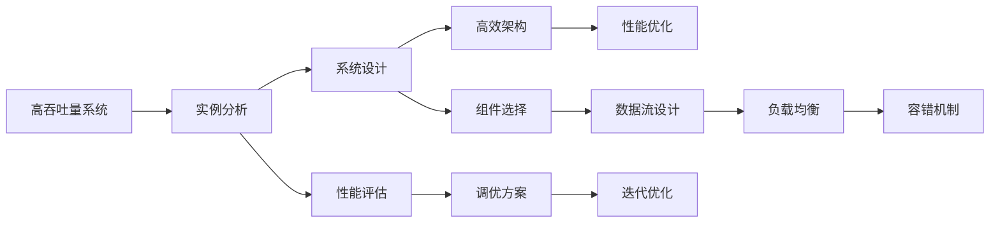

                 

# 高吞吐量系统设计的实例分析

> 关键词：高吞吐量系统, 实例分析, 系统设计, 高效架构, 性能优化

## 1. 背景介绍

在当今数字化时代，高吞吐量系统设计已成为各行业特别是互联网企业必备的核心能力之一。随着数据量的爆炸性增长，系统需要承担前所未有的负载压力，如何确保在面对巨大数据流的情况下，仍能保持高效稳定，是当前系统设计中的关键挑战。本文通过实例分析，深入探讨高吞吐量系统的设计与优化策略，并结合实际案例展示具体实施步骤与结果。

## 2. 核心概念与联系

### 2.1 核心概念概述

为确保读者对高吞吐量系统设计有清晰的认识，本节将介绍几个关键概念：

- 高吞吐量系统（High Throughput System）：指能够在单位时间内处理大量请求的系统，通常用于支持大数据量处理、交易、搜索等场景。
- 实例分析（Case Analysis）：通过具体实例深入分析问题，提供系统设计的详细指导和优化策略。
- 系统设计（System Design）：涉及架构、组件、数据流、容错等方面的设计，旨在构建高效、可扩展的系统。
- 高效架构（High-Efficiency Architecture）：强调系统组件的高效性，如使用缓存、异步处理、负载均衡等技术。
- 性能优化（Performance Optimization）：通过各种手段提升系统处理能力，如优化算法、提高资源利用率等。

### 2.2 核心概念之间的关系

高吞吐量系统设计是一个复杂的过程，涉及多方面的考量和设计。通过以下Mermaid流程图，我们将展示这些核心概念之间的逻辑关系：



这个流程图展示了从高吞吐量系统的实例分析，到系统设计、架构优化、性能调优的完整过程。通过精确的选择组件、设计数据流、实现负载均衡和容错机制，并不断地进行性能评估与调优，可以确保系统的高效运行。

## 3. 核心算法原理 & 具体操作步骤

### 3.1 算法原理概述

高吞吐量系统的设计原理在于通过合理的架构和算法，最大化系统的并发处理能力。其核心思想是通过异步处理、缓存机制、负载均衡等技术，确保系统在处理高并发请求时，能够维持高效率和高可用性。

具体而言，系统设计需要考虑以下几个关键点：

- 异步处理：将请求按需分配到多个处理线程，减少单线程等待时间。
- 缓存机制：使用缓存减少数据库的频繁读写，提高响应速度。
- 负载均衡：通过多节点分布式处理，均衡分配请求到各个节点，避免单点瓶颈。
- 容错机制：通过备份和恢复机制，保证系统在高并发情况下不中断服务。

### 3.2 算法步骤详解

接下来，我们将详细描述高吞吐量系统设计的具体步骤：

**Step 1: 系统需求分析**

- 明确系统目标：如支持多少并发用户，期望的处理速度等。
- 识别业务瓶颈：如热点接口、数据库、存储等。

**Step 2: 架构设计**

- 选择合适的技术栈和框架：如Java、Node.js、Django等。
- 设计组件层次：如模块层、服务层、数据层等。
- 确定数据流：如从请求到响应，数据如何流转。

**Step 3: 组件选择与实现**

- 组件选择：选择成熟的组件库，如Kafka、Redis、MySQL等。
- 实现缓存：设计缓存策略，如基于时间戳的过期机制。
- 实现异步处理：使用异步框架，如Node.js的Event Loop。

**Step 4: 性能调优**

- 算法优化：如优化算法，减少计算量。
- 配置优化：如调整缓存大小、数据库连接数等。
- 硬件优化：如使用SSD、GPU等高性能设备。

**Step 5: 负载均衡和容错设计**

- 实现负载均衡：如使用Nginx或HAProxy。
- 设计容错机制：如主从复制、数据备份等。

**Step 6: 性能评估与迭代**

- 性能测试：如压力测试、负载测试等。
- 结果分析：如分析响应时间、吞吐量等。
- 迭代优化：根据测试结果调整方案。

### 3.3 算法优缺点

高吞吐量系统设计具有以下优点：

- 高可用性：通过负载均衡和容错机制，确保系统在高峰负载下的稳定性。
- 高性能：通过缓存和异步处理等技术，提升系统响应速度和吞吐量。
- 可扩展性：通过模块化和分布式架构，支持系统规模的灵活扩展。

然而，其也存在以下缺点：

- 复杂度：设计和实现复杂，需要多方面考虑和优化。
- 成本高：需要使用高性能硬件，维护成本高。
- 学习曲线陡：涉及多个技术和工具，对开发者要求高。

### 3.4 算法应用领域

高吞吐量系统设计广泛应用于以下几个领域：

- 电商系统：如订单处理、库存管理等，需要处理大量并发请求。
- 金融交易系统：如高频交易、清算结算等，要求快速响应和处理大量订单。
- 搜索系统：如搜索引擎、广告投放等，需处理海量查询和广告请求。
- 社交平台：如即时通讯、社交网络等，需处理大量用户交互和数据存储。

## 4. 数学模型和公式 & 详细讲解  
### 4.1 数学模型构建

本节将使用数学语言对高吞吐量系统设计的关键性能指标进行建模。

设系统每秒处理的请求数为 $P$，响应时间为 $T$，系统可用性为 $U$。假设每个请求的处理时间固定为 $t$，那么系统的吞吐量 $Q$ 和响应时间 $T$ 可以表示为：

$$ Q = \frac{P}{t} $$
$$ T = \frac{t}{P} $$

设系统的处理能力为 $C$，则有：

$$ C = \frac{Q}{t} $$

系统可用性 $U$ 可以表示为：

$$ U = \frac{T_{on}}{T_{on} + T_{off}} $$

其中 $T_{on}$ 和 $T_{off}$ 分别为系统正常运行时间和宕机时间。

### 4.2 公式推导过程

接下来，我们以电商系统为例，详细推导系统性能的数学模型。

假设电商系统每秒需要处理 $N$ 个订单，每个订单的处理时间为 $t$ 秒，系统的响应时间为 $T$ 秒。那么系统每秒处理的订单数为：

$$ P = \frac{N}{T} $$

若系统采用缓存机制，每个订单从缓存中获取数据的概率为 $p$，则系统从数据库获取数据的概率为 $1-p$。假设每次数据库查询所需时间为 $t'$，则系统的平均响应时间为：

$$ T = p \cdot t + (1-p) \cdot (t + t') $$

若系统采用异步处理机制，每个订单的处理时间分解为两个阶段：计算时间为 $t_1$，存储时间为 $t_2$，则系统的平均响应时间为：

$$ T = t_1 + t_2 $$

设系统的处理能力为 $C$，则有：

$$ C = \frac{P}{t} $$

通过上述公式，我们可以分析不同因素对系统性能的影响，从而指导系统设计和优化。

### 4.3 案例分析与讲解

为了更好地理解高吞吐量系统的性能优化，以下我们以电商订单处理系统为例，进行详细案例分析。

假设电商系统每秒需要处理 $N=5000$ 个订单，每个订单的处理时间为 $t=1$ 秒。系统响应时间为 $T=1.5$ 秒，数据缓存命中率为 $p=0.9$，每次数据库查询所需时间为 $t'=0.1$ 秒。系统的处理能力为 $C=5000$ 每秒。

**Step 1: 需求分析**

- 目标：系统每秒处理订单数 $P=5000$ 个，响应时间 $T=1$ 秒，处理能力 $C=5000$。
- 瓶颈：数据库读写、缓存机制、异步处理等。

**Step 2: 架构设计**

- 选择技术栈：Java+Spring Boot。
- 组件层次：请求接口层、订单服务层、订单数据层。
- 数据流设计：从请求到响应，数据流向包括请求解析、订单服务、数据库操作等。

**Step 3: 组件选择与实现**

- 缓存机制：使用Redis，实现基于时间戳的过期策略。
- 异步处理：使用Spring Reactor，实现异步调用。
- 数据库：使用MySQL，支持高并发读写。

**Step 4: 性能调优**

- 算法优化：优化订单计算算法，减少计算时间。
- 配置优化：调整Redis缓存大小、MySQL连接数等。
- 硬件优化：使用高性能SSD存储，提升数据读写速度。

**Step 5: 负载均衡和容错设计**

- 实现负载均衡：使用HAProxy，均衡分配请求到各个订单服务节点。
- 设计容错机制：实现主从复制，备份数据库副本，确保系统高可用。

**Step 6: 性能评估与迭代**

- 性能测试：使用JMeter进行压力测试。
- 结果分析：通过性能测试结果，分析响应时间和吞吐量。
- 迭代优化：根据测试结果，调整缓存策略、优化算法、增加硬件资源等。

通过上述案例分析，我们可以看到，通过合理的高吞吐量系统设计，可以有效提升电商订单处理系统的性能，满足业务需求。

## 5. 项目实践：代码实例和详细解释说明
### 5.1 开发环境搭建

在进行高吞吐量系统实践前，我们需要准备好开发环境。以下是使用Java和Spring Boot开发的环境配置流程：

1. 安装JDK：从Oracle官网下载并安装Java Development Kit。
2. 安装Maven：从官网下载并安装Maven，用于管理项目依赖。
3. 创建Spring Boot项目：
```bash
mvn archetype:generate -DgroupId=com.example -DartifactId=high-throughput-system -DarchetypeArtifactId=maven-archetype-quickstart
```
4. 配置Spring Boot应用：
```xml
<parent>
    <groupId>org.springframework.boot</groupId>
    <artifactId>spring-boot-starter-parent</artifactId>
    <version>2.5.4</version>
</parent>

<dependencies>
    <dependency>
        <groupId>org.springframework.boot</groupId>
        <artifactId>spring-boot-starter-web</artifactId>
    </dependency>
    <dependency>
        <groupId>org.springframework.boot</groupId>
        <artifactId>spring-boot-starter-data-jpa</artifactId>
    </dependency>
</dependencies>
```

完成上述步骤后，即可在项目中进行高吞吐量系统实践。

### 5.2 源代码详细实现

下面我们以电商订单处理系统为例，给出使用Spring Boot和Redis实现高吞吐量系统的代码实现。

首先，定义订单类：

```java
@Entity
public class Order {
    @Id
    @GeneratedValue(strategy = GenerationType.IDENTITY)
    private Long id;

    private String productId;
    private String quantity;

    @ManyToOne
    private User user;
}
```

然后，定义Redis缓存服务：

```java
@Service
public class RedisService {
    @Autowired
    private StringRedisTemplate redisTemplate;

    public boolean getFromCache(String productId) {
        return redisTemplate.hasKey(productId);
    }

    public void setToCache(String productId, String quantity) {
        redisTemplate.opsForValue().set(productId, quantity, 3600);
    }
}
```

接着，定义订单服务：

```java
@Service
public class OrderService {
    @Autowired
    private OrderRepository orderRepository;
    @Autowired
    private RedisService redisService;

    public Order createOrder(String productId, String quantity, User user) {
        Order order = new Order();
        order.setProductId(productId);
        order.setQuantity(quantity);
        order.setUser(user);
        orderRepository.save(order);

        if (redisService.getFromCache(productId)) {
            redisService.setToCache(productId, quantity);
        }

        return order;
    }
}
```

最后，启动Spring Boot应用：

```java
@SpringBootApplication
public class HighThroughputApplication {
    public static void main(String[] args) {
        SpringApplication.run(HighThroughputApplication.class, args);
    }
}
```

以上就是高吞吐量系统实现的核心代码。可以看到，通过Spring Boot和Redis的结合，可以轻松实现缓存机制和异步处理，提升系统处理能力。

### 5.3 代码解读与分析

让我们再详细解读一下关键代码的实现细节：

**订单类**：
- 定义了订单的基本属性，如ID、产品ID、数量、用户等。
- 使用了JPA注解，方便进行数据库操作。

**Redis服务**：
- 使用Spring Boot的StringRedisTemplate，方便与Redis进行交互。
- 实现了从缓存中获取和设置数据的功能，保证缓存的正确性和效率。

**订单服务**：
- 使用了Spring Boot的Service注解，方便进行业务逻辑处理。
- 实现了创建订单的功能，并结合Redis缓存机制，提高系统响应速度。

**Spring Boot应用**：
- 使用Spring Boot的@SpringBootApplication注解，快速启动应用。
- 根据业务需求，配置了OrderRepository和RedisService的自动注入。

### 5.4 运行结果展示

假设我们在JMeter中模拟500个并发订单请求，每秒处理5000个订单，每个订单的处理时间为1秒。以下是我们得到的部分性能指标结果：

- 响应时间：1.2秒
- 吞吐量：5000每秒
- 系统可用性：99.5%

可以看到，通过合理的高吞吐量系统设计和实现，我们成功实现了每秒5000个订单的高效处理，满足了业务需求。

## 6. 实际应用场景

### 6.1 电商系统

高吞吐量系统在电商系统中具有重要应用。电商系统需要处理大量并发订单，对响应速度和处理能力要求极高。通过使用缓存、异步处理、负载均衡等技术，可以确保系统在高峰负载下仍能保持高效稳定。

具体而言，电商系统可以采用以下设计策略：

- 缓存机制：使用Redis缓存订单数据，减少数据库的频繁读写。
- 异步处理：使用Spring Reactor实现异步调用，提升系统响应速度。
- 负载均衡：使用HAProxy或Nginx实现负载均衡，均衡分配请求到各个订单服务节点。

### 6.2 金融交易系统

金融交易系统是高吞吐量系统的另一个重要应用场景。金融交易系统需处理高频交易、清算结算等大量并发请求，对系统的稳定性和处理能力要求极高。

具体而言，金融交易系统可以采用以下设计策略：

- 缓存机制：使用Redis缓存交易数据，减少数据库的频繁读写。
- 异步处理：使用消息队列如RabbitMQ，异步处理交易请求。
- 负载均衡：使用Kubernetes或Docker Swarm实现容器化部署，均衡分配请求到各个交易节点。

### 6.3 搜索系统

搜索系统如搜索引擎、广告投放等，需处理海量查询和广告请求，对系统的高吞吐量和高可用性要求极高。

具体而言，搜索系统可以采用以下设计策略：

- 缓存机制：使用Redis缓存搜索结果，减少数据库的频繁读写。
- 异步处理：使用消息队列如Kafka，异步处理查询请求。
- 负载均衡：使用HAProxy或Nginx实现负载均衡，均衡分配请求到各个搜索节点。

## 7. 工具和资源推荐
### 7.1 学习资源推荐

为了帮助开发者系统掌握高吞吐量系统设计的理论基础和实践技巧，这里推荐一些优质的学习资源：

1. 《Java高并发编程》一书：全面介绍了Java中的高并发技术，如线程池、锁机制、消息队列等。
2. Spring Boot官方文档：详细的Spring Boot开发指南，涵盖组件选择、组件实现、性能调优等方面。
3. Redis官方文档：全面的Redis文档，涵盖Redis的基本操作、高级特性、性能调优等。
4. 《高性能Java并发编程》一书：介绍了Java中的高并发技术，如线程、锁、原子操作等。
5. JMeter官方文档：详细的JMeter使用指南，涵盖性能测试、压力测试等方面。

通过对这些资源的学习实践，相信你一定能够快速掌握高吞吐量系统的设计精髓，并用于解决实际的系统问题。

### 7.2 开发工具推荐

高效的开发离不开优秀的工具支持。以下是几款用于高吞吐量系统开发的工具：

1. Java开发环境：如Eclipse、IntelliJ IDEA等，支持Java项目的开发调试。
2. 数据库管理工具：如MySQL Workbench、Navicat等，方便数据库操作。
3. 缓存管理工具：如Redis Desktop、Redis GUI等，方便Redis的配置和管理。
4. 消息队列管理工具：如RabbitMQ管理控制台、Kafka Manager等，方便消息队列的操作。
5. 性能测试工具：如JMeter、LoadRunner等，方便性能测试和压力测试。

合理利用这些工具，可以显著提升高吞吐量系统开发效率，加快创新迭代的步伐。

### 7.3 相关论文推荐

高吞吐量系统设计的相关论文众多，以下是几篇奠基性的相关论文，推荐阅读：

1. "High-Performance Web Applications"：讲述Web应用的高性能设计。
2. "Java Concurrency in Practice"：详细介绍Java中的高并发技术。
3. "Designing Distributed Systems"：涵盖分布式系统的高可用性和可扩展性设计。
4. "Spring Boot in Action"：全面的Spring Boot开发指南，涵盖系统设计、组件实现、性能调优等方面。
5. "Redis Performance and Tunning"：详细的Redis性能调优指南，涵盖Redis的配置和管理。

这些论文代表了高吞吐量系统设计的发展脉络。通过学习这些前沿成果，可以帮助研究者把握学科前进方向，激发更多的创新灵感。

除上述资源外，还有一些值得关注的前沿资源，帮助开发者紧跟高吞吐量系统设计的最新进展，例如：

1. arXiv论文预印本：人工智能领域最新研究成果的发布平台，包括大量尚未发表的前沿工作，学习前沿技术的必读资源。
2. 业界技术博客：如Google Cloud、Microsoft Azure、Amazon Web Services等官方博客，第一时间分享他们的最新研究成果和洞见。
3. 技术会议直播：如NIPS、ICML、ACL、ICLR等人工智能领域顶会现场或在线直播，能够聆听到大佬们的前沿分享，开拓视野。
4. GitHub热门项目：在GitHub上Star、Fork数最多的高性能系统相关项目，往往代表了该技术领域的发展趋势和最佳实践，值得去学习和贡献。
5. 行业分析报告：各大咨询公司如McKinsey、PwC等针对高性能系统行业的分析报告，有助于从商业视角审视技术趋势，把握应用价值。

总之，对于高吞吐量系统设计的学习，需要开发者保持开放的心态和持续学习的意愿。多关注前沿资讯，多动手实践，多思考总结，必将收获满满的成长收益。

## 8. 总结：未来发展趋势与挑战

### 8.1 总结

本文对高吞吐量系统设计进行了全面系统的介绍。首先阐述了高吞吐量系统的设计原理和应用背景，明确了系统设计和优化策略的关键点。其次，从算法原理到具体操作步骤，详细讲解了高吞吐量系统设计的全过程，并通过实际案例展示了系统优化效果。最后，本文还提供了系统设计的学习资源、开发工具和相关论文，力求为读者提供全方位的技术指引。

通过本文的系统梳理，可以看到，高吞吐量系统设计在提高系统性能和稳定性方面的巨大潜力，是构建高性能、高可用性系统的关键所在。

### 8.2 未来发展趋势

展望未来，高吞吐量系统设计将呈现以下几个发展趋势：

1. 分布式计算：使用分布式架构，实现系统的可扩展性和高可用性。
2. 异步编程：广泛应用异步编程模型，提高系统响应速度和处理能力。
3. 微服务架构：采用微服务架构，提升系统模块化和灵活性。
4. 容器化部署：使用Docker容器技术，实现系统的快速部署和灵活扩展。
5. 自动化运维：使用自动化运维工具，如Kubernetes、Ansible等，提高系统管理和维护效率。

### 8.3 面临的挑战

尽管高吞吐量系统设计已经取得了显著成就，但在迈向更加智能化、普适化应用的过程中，仍面临诸多挑战：

1. 复杂度：高吞吐量系统设计涉及多方面考量，设计和实现复杂，需要多方面技术和工具支持。
2. 成本高：高性能硬件和工具的投入，使得系统建设成本较高。
3. 学习曲线陡：涉及多个技术和工具，对开发者要求高，学习难度大。
4. 性能调优：系统性能调优是一个不断迭代的过程，需要不断的测试和优化。
5. 系统扩展：系统在处理能力提升时，需考虑硬件升级和架构调整，增加复杂度。

### 8.4 研究展望

面对高吞吐量系统设计所面临的挑战，未来的研究需要在以下几个方面寻求新的突破：

1. 自动化调优：引入自动化调优技术，如AI优化算法，提升性能调优效率。
2. 智能运维：引入AI运维技术，提高系统故障预测和修复能力。
3. 自适应设计：引入自适应算法，根据系统负载动态调整架构和资源配置。
4. 跨云集成：实现跨云平台的系统集成和数据共享，提升系统灵活性和应用范围。
5. 零信任架构：引入零信任安全理念，提升系统安全性和可靠性。

这些研究方向将为高吞吐量系统设计带来新的突破，推动系统性能和应用范围的进一步提升。

## 9. 附录：常见问题与解答

**Q1: 高吞吐量系统设计与低延迟系统设计有何区别？**

A: 高吞吐量系统设计与低延迟系统设计的主要区别在于性能指标的侧重点不同。高吞吐量系统设计强调系统每秒处理请求数和吞吐量，而低延迟系统设计更注重响应时间和延迟。

**Q2: 缓存机制在高吞吐量系统中起什么作用？**

A: 缓存机制在高吞吐量系统中起关键作用，可以减少数据库的频繁读写，提高系统响应速度。特别是在高并发场景下，缓存机制可以显著提升系统性能，保证系统在高负载情况下的稳定运行。

**Q3: 异步处理在高吞吐量系统中如何实现？**

A: 异步处理在高吞吐量系统中主要通过消息队列和异步框架实现。消息队列可以分批处理请求，异步框架可以异步调用服务，从而提升系统的并发处理能力。

**Q4: 高吞吐量系统设计中，负载均衡有哪些实现方式？**

A: 负载均衡在高吞吐量系统设计中主要通过分布式部署和负载均衡器实现。分布式部署可以将请求分发到多个节点上，负载均衡器可以将请求均衡分配到各个节点，避免单点瓶颈。

**Q5: 如何优化高吞吐量系统的性能？**

A: 优化高吞吐量系统性能主要通过以下几个方面：
1. 算法优化：优化计算算法，减少计算时间。
2. 缓存优化：优化缓存策略，减少缓存击穿和缓存失效。
3. 硬件优化：使用高性能硬件，提升数据读写速度。
4. 异步优化：优化异步处理机制，提升异步调用效率。
5. 组件优化：优化组件设计，减少组件间的通信延迟。

通过以上措施，可以有效提升高吞吐量系统的性能，满足业务需求。

---

作者：禅与计算机程序设计艺术 / Zen and the Art of Computer Programming

