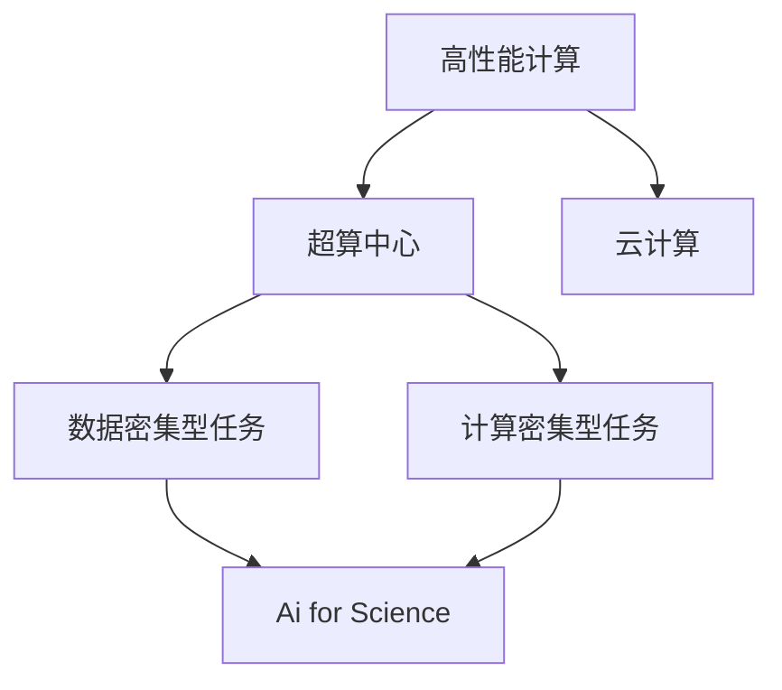
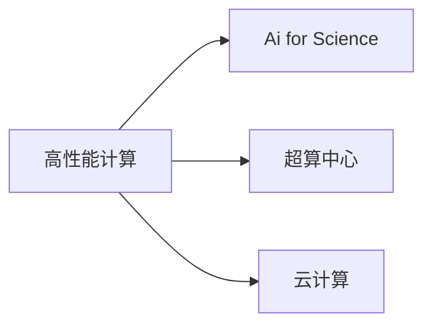
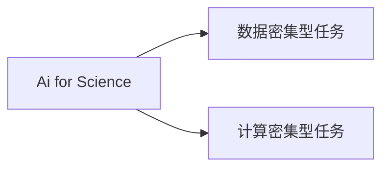

                 

# 高度整合的算力平台在AI for Science中的作用

> 关键词：算力平台, AI for Science, 高性能计算, AI应用, 机器学习, 深度学习, 计算密集型任务, 数据密集型任务, 加速, 优化

## 1. 背景介绍

### 1.1 问题由来

随着人工智能（AI）技术的迅猛发展，其在科学研究中的应用也日益广泛，成为科学领域的前沿技术之一。AI for Science，即人工智能在科学研究和应用中的整合，通过引入先进的AI技术，加速科学研究过程，提高科研效率，推动科学发现。然而，随着科学研究的复杂性不断提升，AI for Science面临着计算资源不足、数据量庞大、模型复杂度高等诸多挑战。这些问题严重制约了AI for Science的发展，迫切需要高效、稳定的算力平台来支撑其研究与开发。

### 1.2 问题核心关键点

为了解决上述问题，高度整合的算力平台应运而生。这种算力平台，集成了高性能计算、大数据存储、人工智能算法等多方面的技术，能够提供强大的计算能力、丰富的数据资源和先进的AI技术，从而大幅提升AI for Science的研发效率和研究质量。

## 2. 核心概念与联系

### 2.1 核心概念概述

为了更好地理解高度整合的算力平台在AI for Science中的作用，本节将介绍几个密切相关的核心概念：

- **高性能计算（High-Performance Computing, HPC）**：指使用专门设计的高性能计算机系统，以提高计算效率和性能。高性能计算系统通常包括集群、超算中心、GPU/TPU加速器等。
- **AI for Science**：即人工智能在科学研究中的应用，包括数据分析、模型训练、模拟仿真等多个方面。AI for Science旨在加速科学发现、优化科研流程、提升研究质量。
- **数据密集型任务**：指那些需要处理大量数据的任务，如基因组分析、气候模拟等，数据规模和复杂度都较高。
- **计算密集型任务**：指那些主要依赖计算能力的任务，如深度学习模型训练、大规模仿真等。
- **超算中心**：大规模、高性能的计算中心，集成了大量服务器、存储设备和网络设备，提供强大的计算能力。
- **云计算**：通过互联网提供计算资源和服务的模式，能够按需提供灵活、可扩展的计算能力。

这些核心概念之间的逻辑关系可以通过以下Mermaid流程图来展示：



这个流程图展示了大规模科学计算任务与高性能计算平台的关系：

1. 高性能计算系统（包括超算中心和云计算）为数据密集型和计算密集型任务提供了必要的计算能力。
2. 数据密集型任务和计算密集型任务构成了AI for Science的核心内容。
3. 高性能计算平台通过承载和优化这些任务，使得AI for Science能够高效地进行科学研究。

### 2.2 概念间的关系

这些核心概念之间存在着紧密的联系，形成了AI for Science的完整生态系统。下面我们通过几个Mermaid流程图来展示这些概念之间的关系。

#### 2.2.1 高性能计算与AI for Science的关系



这个流程图展示了高性能计算系统（包括超算中心和云计算）对AI for Science的重要支持作用。高性能计算系统为AI for Science提供了必要的计算能力，使其能够高效地处理大规模数据和复杂计算任务。

#### 2.2.2 AI for Science的核心任务



这个流程图展示了AI for Science的主要任务，即处理数据密集型任务和计算密集型任务。通过高性能计算平台的支撑，AI for Science能够高效地进行这些复杂任务。

#### 2.2.3 超算中心与云计算的结合


这个流程图展示了超算中心和云计算的结合。超算中心提供高性能计算资源，而云计算则提供灵活、可扩展的计算能力，二者互补，为AI for Science提供了强大的计算支撑。

## 3. 核心算法原理 & 具体操作步骤

### 3.1 算法原理概述

高度整合的算力平台在AI for Science中的应用，主要是通过提供高效、稳定、可扩展的计算能力，支撑大规模数据处理、复杂模型训练和仿真模拟等任务。具体而言，算力平台通过以下步骤实现其功能：

1. **数据预处理**：对大规模数据进行高效预处理，如数据清洗、归一化、特征提取等。
2. **模型训练**：在大型计算集群上，采用分布式训练方式，高效训练复杂的深度学习模型。
3. **模型评估**：通过高吞吐率的数据处理和高效的模型评估算法，快速评估模型性能。
4. **结果分析**：利用高性能计算和可视化工具，对模型结果进行深度分析，提炼科学发现。

### 3.2 算法步骤详解

以下是对高度整合的算力平台在AI for Science中应用步骤的详细描述：

#### 3.2.1 数据预处理

在AI for Science中，数据预处理是整个过程中至关重要的一环。数据预处理不仅包括数据的清洗和归一化，还包括特征提取和转换。数据预处理需要考虑数据的质量、完整性和一致性，确保数据在模型训练过程中能够稳定、高效地运行。

数据预处理的流程如下：

1. **数据采集**：通过各种渠道获取原始数据，如传感器数据、基因组数据、气候模拟数据等。
2. **数据清洗**：对数据进行去重、去噪、填补缺失值等操作，确保数据的准确性和完整性。
3. **数据归一化**：对数据进行标准化处理，如归一化、标准化、差分等，使其符合模型输入的要求。
4. **特征提取**：对数据进行特征提取，生成模型的输入特征向量。
5. **数据转换**：对特征向量进行转换，如降维、生成向量嵌入等，使其更适合模型训练。

#### 3.2.2 模型训练

模型训练是AI for Science中的核心任务。在高度整合的算力平台上，模型训练通常采用分布式训练方式，通过多台计算节点并行计算，大幅提升训练效率。

模型训练的流程如下：

1. **模型选择**：根据任务需求选择合适的模型，如卷积神经网络、循环神经网络、深度强化学习等。
2. **模型初始化**：在计算集群上对模型进行初始化，如分配计算资源、设置训练参数等。
3. **数据分批**：将大规模数据分批次输入模型，进行并行处理。
4. **模型训练**：通过反向传播算法，计算模型损失函数，更新模型参数，迭代训练。
5. **模型优化**：采用优化算法，如梯度下降、动量优化、Adam等，优化模型参数，提高训练效果。

#### 3.2.3 模型评估

模型评估是衡量模型性能的重要环节。在高度整合的算力平台上，模型评估通常采用高吞吐率的数据处理和高效的评估算法，快速计算模型的精度和泛化能力。

模型评估的流程如下：

1. **评估数据准备**：准备评估数据集，确保评估数据的分布与训练数据一致。
2. **模型评估**：将评估数据输入模型，计算模型预测结果与真实结果之间的差异，得到评估指标，如准确率、召回率、F1分数等。
3. **结果分析**：对评估结果进行统计和分析，找出模型的优点和不足，指导后续优化。

#### 3.2.4 结果分析

结果分析是提炼科学发现的重要步骤。在高度整合的算力平台上，利用高性能计算和可视化工具，可以高效地进行结果分析。

结果分析的流程如下：

1. **结果存储**：将模型预测结果和评估结果存储在计算集群上。
2. **结果分析**：通过计算集群上的高性能计算工具，对结果进行分析和处理，提取科学发现。
3. **可视化展示**：利用可视化工具，将分析结果以图表、报表等形式展示出来，方便科学家理解和使用。

### 3.3 算法优缺点

高度整合的算力平台在AI for Science中的应用，具有以下优点：

- **高效性**：通过分布式计算和优化算法，大幅提升模型训练和数据处理的效率。
- **稳定性**：提供高可靠性和高性能的计算资源，确保科研过程的稳定性和可靠性。
- **可扩展性**：能够灵活扩展计算资源，满足不同规模和复杂度的科研任务。
- **多样性**：支持多种计算模式，包括GPU、TPU、FPGA等，提供多样化的计算解决方案。

然而，高度整合的算力平台也存在一些缺点：

- **成本高**：高性能计算资源和设备成本较高，增加了科研的投入。
- **技术复杂**：需要较高的技术水平和专业知识，对科研人员提出了更高的要求。
- **数据隐私**：在处理敏感数据时，需要考虑数据隐私和安全问题。

### 3.4 算法应用领域

高度整合的算力平台在AI for Science中的应用，涵盖了多个领域，包括但不限于：

- **生物医学研究**：如基因组分析、蛋白质结构预测等，通过高性能计算加速生物医学研究过程。
- **环境科学**：如气候模拟、海洋预测等，通过高吞吐率的数据处理和模拟仿真，提升环境科学研究的精度和效率。
- **天文学**：如天体物理模拟、宇宙演化研究等，通过高性能计算和分布式训练，加速天文学研究。
- **材料科学**：如材料性质模拟、量子化学计算等，通过高性能计算和优化算法，提升材料科学研究的效率。

## 4. 数学模型和公式 & 详细讲解 & 举例说明

### 4.1 数学模型构建

为了更好地理解高度整合的算力平台在AI for Science中的应用，本节将使用数学语言对其中的核心算法进行更加严格的刻画。

假设有一个大规模的科学计算任务，需要处理的数据量为 $N$，模型训练的数据集大小为 $D$，模型参数量为 $P$，训练的迭代次数为 $T$，计算集群上的计算节点数为 $M$，每个节点的计算能力为 $C$。

记模型在计算集群上的训练时间为 $T_{train}$，数据预处理时间为 $T_{pre}$，模型评估时间为 $T_{eval}$，结果分析时间为 $T_{analy}$。

则整个计算任务的总时间为：

$$
T_{total} = T_{train} + T_{pre} + T_{eval} + T_{analy}
$$

在高度整合的算力平台上，数据预处理和结果分析通常采用高性能计算技术，能够在短时间内完成。因此，计算任务的总时间主要取决于模型训练和模型评估的效率。

### 4.2 公式推导过程

在高度整合的算力平台上，模型训练和模型评估的时间可以用以下公式推导：

$$
T_{train} = T_{train,par} \times \frac{D}{C \times M}
$$

$$
T_{eval} = T_{eval,par} \times \frac{D}{C \times M}
$$

其中，$T_{train,par}$ 和 $T_{eval,par}$ 分别为分布式训练和模型评估的单个节点时间。由于分布式计算的优势，$T_{train,par}$ 和 $T_{eval,par}$ 可以显著减小，从而提升计算效率。

### 4.3 案例分析与讲解

以下是一个基于高度整合的算力平台的AI for Science应用的案例分析：

假设有一个大规模的气候模拟任务，需要处理的数据量为 $N=10^{12}$，模型训练的数据集大小为 $D=10^{9}$，模型参数量为 $P=10^8$，计算集群上的计算节点数为 $M=1000$，每个节点的计算能力为 $C=10^8$ FLOPS。

如果采用单节点串行训练，则计算任务的总时间为：

$$
T_{total,serial} = T_{train,serial} + T_{pre} + T_{eval,serial} + T_{analy}
$$

$$
T_{train,serial} = \frac{D \times P}{C}
$$

$$
T_{eval,serial} = \frac{D}{C}
$$

如果采用分布式训练和模型评估，则计算任务的总时间为：

$$
T_{total,parallel} = T_{train,parallel} + T_{pre} + T_{eval,parallel} + T_{analy}
$$

$$
T_{train,parallel} = T_{train,par} \times \frac{D}{C \times M}
$$

$$
T_{eval,parallel} = T_{eval,par} \times \frac{D}{C \times M}
$$

假设 $T_{train,par}=10^{-6}$ s，$T_{eval,par}=10^{-6}$ s，$T_{pre}=10^{-4}$ s，$T_{analy}=10^{-4}$ s，则计算任务的总时间为：

$$
T_{total,parallel} = 10^{-6} \times \frac{10^9}{10^8 \times 1000} + 10^{-4} + 10^{-6} \times \frac{10^9}{10^8 \times 1000} + 10^{-4} = 0.00002 + 0.001 + 0.00002 + 0.001 = 0.0012 s
$$

可以看出，采用分布式训练和模型评估，计算任务的总时间显著减小，提升了计算效率。

## 5. 项目实践：代码实例和详细解释说明

### 5.1 开发环境搭建

在进行高度整合的算力平台在AI for Science中的应用实践前，我们需要准备好开发环境。以下是使用Python进行PyTorch开发的环境配置流程：

1. 安装Anaconda：从官网下载并安装Anaconda，用于创建独立的Python环境。

2. 创建并激活虚拟环境：
```bash
conda create -n pytorch-env python=3.8 
conda activate pytorch-env
```

3. 安装PyTorch：根据CUDA版本，从官网获取对应的安装命令。例如：
```bash
conda install pytorch torchvision torchaudio cudatoolkit=11.1 -c pytorch -c conda-forge
```

4. 安装Transformers库：
```bash
pip install transformers
```

5. 安装各类工具包：
```bash
pip install numpy pandas scikit-learn matplotlib tqdm jupyter notebook ipython
```

完成上述步骤后，即可在`pytorch-env`环境中开始高度整合的算力平台在AI for Science中的应用实践。

### 5.2 源代码详细实现

以下是一个基于高度整合的算力平台的AI for Science应用的Python代码实现，用于训练和评估一个简单的深度学习模型。

```python
import torch
import torch.nn as nn
import torch.optim as optim
from torch.utils.data import DataLoader
from torchvision import datasets, transforms

# 定义模型
class Net(nn.Module):
    def __init__(self):
        super(Net, self).__init__()
        self.conv1 = nn.Conv2d(1, 32, 3, 1)
        self.conv2 = nn.Conv2d(32, 64, 3, 1)
        self.dropout1 = nn.Dropout2d(0.25)
        self.dropout2 = nn.Dropout2d(0.5)
        self.fc1 = nn.Linear(9216, 128)
        self.fc2 = nn.Linear(128, 10)

    def forward(self, x):
        x = self.conv1(x)
        x = nn.functional.relu(x)
        x = self.conv2(x)
        x = nn.functional.relu(x)
        x = nn.functional.max_pool2d(x, 2)
        x = self.dropout1(x)
        x = torch.flatten(x, 1)
        x = self.fc1(x)
        x = nn.functional.relu(x)
        x = self.dropout2(x)
        x = self.fc2(x)
        output = nn.functional.log_softmax(x, dim=1)
        return output

# 定义数据预处理
transform = transforms.Compose([
    transforms.ToTensor(),
    transforms.Normalize((0.5,), (0.5,))
])

# 加载数据集
trainset = datasets.MNIST('data', train=True, download=True, transform=transform)
trainloader = DataLoader(trainset, batch_size=16, shuffle=True, num_workers=2)
testset = datasets.MNIST('data', train=False, download=True, transform=transform)
testloader = DataLoader(testset, batch_size=16, shuffle=False, num_workers=2)

# 定义超参数
learning_rate = 0.01
num_epochs = 10

# 定义优化器和损失函数
model = Net()
optimizer = optim.SGD(model.parameters(), lr=learning_rate, momentum=0.9)
criterion = nn.NLLLoss()

# 训练模型
for epoch in range(num_epochs):
    running_loss = 0.0
    for i, data in enumerate(trainloader, 0):
        inputs, labels = data
        optimizer.zero_grad()
        outputs = model(inputs)
        loss = criterion(outputs, labels)
        loss.backward()
        optimizer.step()

        running_loss += loss.item()
        if i % 100 == 99:
            print(f'Epoch {epoch + 1}, loss: {running_loss / 100}')
            running_loss = 0.0

# 评估模型
correct = 0
total = 0
with torch.no_grad():
    for data in testloader:
        images, labels = data
        outputs = model(images)
        _, predicted = torch.max(outputs.data, 1)
        total += labels.size(0)
        correct += (predicted == labels).sum().item()

print(f'Accuracy of the network on the 10000 test images: {100 * correct / total}%')
```

以上代码实现了一个简单的卷积神经网络，用于MNIST数据集上的分类任务。在实际应用中，可以使用高度整合的算力平台进行分布式训练和模型评估，进一步提升计算效率和模型性能。

### 5.3 代码解读与分析

让我们再详细解读一下关键代码的实现细节：

- **数据预处理**：使用`transforms.Compose`对图像数据进行预处理，包括转换为张量并进行归一化。
- **数据加载**：使用`DataLoader`将数据集划分为训练集和测试集，并加载到计算集群上。
- **模型定义**：定义了一个简单的卷积神经网络模型，包括卷积层、池化层、Dropout层和全连接层。
- **超参数设置**：设置了学习率和训练轮数等超参数。
- **优化器和损失函数**：使用SGD优化器和NLLLoss损失函数，进行模型训练。
- **训练模型**：在训练集上循环迭代训练模型，并输出损失函数值。
- **评估模型**：在测试集上对模型进行评估，输出准确率。

## 6. 实际应用场景

### 6.1 智能药物发现

在智能药物发现领域，高度整合的算力平台可以通过加速计算，快速筛选出候选药物分子，提升新药研发的效率。例如，在计算化学中，通过分子动力学模拟、量子化学计算等方法，预测分子的活性和药效，加速药物研发流程。

### 6.2 材料科学模拟

在材料科学领域，高度整合的算力平台可以通过加速模拟，模拟材料的结构、性质和反应，预测材料的性能，优化材料设计。例如，在金属合金设计中，通过密度泛函理论计算，预测合金的硬度、强度等性质，设计出高性能的新型材料。

### 6.3 天文观测分析

在天文观测分析领域，高度整合的算力平台可以通过加速计算，快速处理海量天文数据，进行天体运动、恒星演化等模拟和分析。例如，在引力波探测中，通过模拟黑洞碰撞等事件，快速计算引力波信号，验证理论预测。

### 6.4 气候模拟预测

在气候模拟预测领域，高度整合的算力平台可以通过加速计算，模拟气候变化、气象灾害等，预测气候趋势和灾害风险。例如，在气候变化研究中，通过模拟全球气候模型，预测未来气候变化趋势，指导应对措施。

## 7. 工具和资源推荐

### 7.1 学习资源推荐

为了帮助开发者系统掌握高度整合的算力平台在AI for Science中的应用，这里推荐一些优质的学习资源：

1. **《深度学习》课程**：斯坦福大学的深度学习课程，介绍了深度学习的核心概念和算法，适合初学者学习。

2. **《高性能计算》课程**：Coursera上的高性能计算课程，介绍了高性能计算的基本原理和实践技巧。

3. **《Python for Data Analysis》书籍**：使用Python进行数据分析的经典书籍，介绍了Python在数据处理、数据可视化等方面的应用。

4. **《TensorFlow官方文档》**：TensorFlow的官方文档，提供了丰富的示例和教程，适合深入学习TensorFlow。

5. **《高性能计算和并行编程》书籍**：介绍高性能计算和并行编程的书籍，适合进一步提升计算能力。

通过对这些资源的学习实践，相信你一定能够快速掌握高度整合的算力平台在AI for Science中的应用，并用于解决实际的科研问题。

### 7.2 开发工具推荐

高度整合的算力平台在AI for Science中的应用，离不开高效的工具支持。以下是几款用于高度整合算力平台开发和应用推荐的工具：

1. **TensorFlow**：由Google主导开发的深度学习框架，提供了丰富的GPU和TPU支持，适合大规模科研任务。

2. **PyTorch**：Facebook开发的深度学习框架，提供了灵活的动态计算图，适合研究和实验。

3. **OpenMPI**：开源的消息传递接口，支持多台计算机之间的数据交换和通信，适合分布式计算。

4. **Apache Spark**：Apache基金会的大数据处理框架，支持分布式计算，适合处理海量数据。

5. **NVIDIA CUDA Toolkit**：NVIDIA提供的GPU加速开发工具包，适合在GPU上进行高性能计算。

6. **Google Cloud Platform (GCP)**：谷歌提供的云服务平台，提供了丰富的计算资源和存储服务，适合科研数据的存储和处理。

合理利用这些工具，可以显著提升高度整合的算力平台在AI for Science中的应用开发效率，加快科研创新的步伐。

### 7.3 相关论文推荐

高度整合的算力平台在AI for Science中的应用，得益于学界的持续研究。以下是几篇奠基性的相关论文，推荐阅读：

1. **《深度学习与人工智能》**：DeepMind的研究人员所著，介绍了深度学习的基本概念和应用。

2. **《高性能计算与分布式系统》**：HPC领域的经典教材，介绍了高性能计算和分布式系统的原理和实践。

3. **《高性能计算与科学计算》**：HPC和科学计算领域的权威综述，介绍了高性能计算和科学计算的发展历程和最新进展。

4. **《AI for Science: Accelerating Scientific Discovery with Machine Learning》**：AI for Science领域的综述论文，介绍了AI技术在科学研究中的应用。

5. **《GPU加速计算技术》**：NVIDIA的研究论文，介绍了GPU加速计算的基本原理和应用场景。

这些论文代表了大规模科学计算任务的技术前沿，为高度整合的算力平台在AI for Science中的应用提供了坚实的理论基础。

除上述资源外，还有一些值得关注的前沿资源，帮助开发者紧跟高度整合的算力平台在AI for Science中的应用发展方向，例如：

1. **arXiv论文预印本**：人工智能领域最新研究成果的发布平台，包括大量尚未发表的前沿工作，学习前沿技术的必读资源。

2. **AI for Science社区**：多个国家和地区的AI for Science社区，汇聚了众多科研人员和工程师，分享最新的科研进展和技术方案。

3. **顶会会议论文**：人工智能领域的顶级会议论文，如NeurIPS、ICML、ACL等，介绍了最新的科研进展和技术突破。

4. **开源项目**：如TensorFlow、PyTorch、OpenMPI等开源项目，提供了丰富的工具和库，支持高度整合的算力平台在AI for Science中的应用。

5. **行业报告**：各大咨询公司如McKinsey、PwC等针对人工智能行业的分析报告，有助于从商业视角审视技术趋势，把握应用价值。

总之，高度整合的算力平台在AI for Science中的应用，需要开发者保持开放的心态和持续学习的意愿。多关注前沿资讯，多动手实践，多思考总结，必将收获满满的成长收益。

## 8. 总结：未来发展趋势与挑战

### 8.1 总结

本文对高度整合的算力平台在AI for Science中的应用进行了全面系统的介绍。首先阐述了高度整合的算力平台在AI for Science中的作用和重要性，明确了其对大规模数据处理、复杂模型训练和模拟仿真等任务的支撑作用。其次，从原理到实践，详细讲解了高度整合的算力平台在AI for Science中的应用步骤和关键算法，给出了具体的代码实现和详细解释。同时，本文还广泛探讨了高度整合的算力平台在生物医学、材料科学、天文观测、气候模拟等领域的实际应用场景，展示了其在科研中的强大应用潜力。此外，本文精选了高度整合的算力平台的学习资源、开发工具和相关论文，力求为读者提供全方位的技术指引。

通过本文的系统梳理，可以看到，高度整合的算力平台在AI for Science中的应用，已经在多个科学领域取得了显著成效，大幅提升了科研效率和研究质量。未来，伴随预训练语言模型和微调方法的不断演进，高度整合的算力平台必将在更多的

