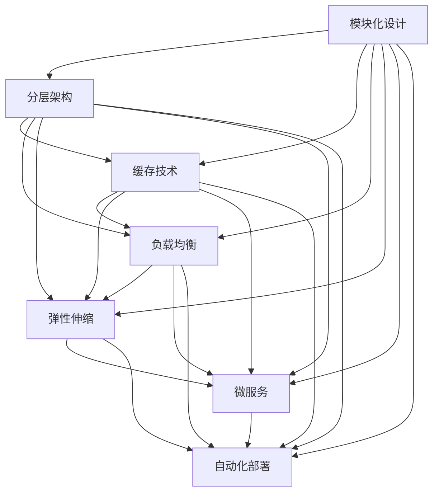

                 

# 高扩展性系统的设计原则

## 1. 背景介绍

在现代软件开发中，系统的高扩展性变得越来越重要。随着技术的进步和业务的增长，系统的规模和复杂度不断增加，如何构建能够快速适应变化、容易维护和升级的系统，成为每个开发者面临的重大挑战。在软件开发实践中，许多项目由于未能处理好扩展性问题，最终导致项目延期、成本超支或失败，给企业带来巨大的经济和声誉损失。因此，系统的高扩展性设计原则，成为现代软件开发的核心技能之一。

本文将从系统设计、架构优化、代码实践等多个角度，深入探讨高扩展性系统的设计原则，为广大开发者提供全面的技术指导。

## 2. 核心概念与联系

### 2.1 核心概念概述

高扩展性系统（Scalable System）指的是能够在业务增长和需求变化时，通过增加资源、扩展模块等方式，快速且有效地适应新的负载和要求，同时保证系统性能和稳定性的软件系统。

构建高扩展性系统的关键在于理解和掌握一系列核心概念，包括：

- 模块化设计（Modularity Design）：将系统划分为多个相对独立的模块，每个模块负责特定功能，从而便于扩展和维护。
- 分层架构（Layered Architecture）：将系统分为不同层次，每个层次负责特定功能，明确层次间的接口和交互方式。
- 缓存技术（Caching）：通过缓存技术，减少对底层存储和计算的频繁访问，提升系统响应速度。
- 负载均衡（Load Balancing）：通过分布式架构，将负载分散到多台服务器上，避免单点故障和资源浪费。
- 弹性伸缩（Elastic Scaling）：根据系统负载动态调整资源配置，提升系统的吞吐量和稳定性。
- 微服务（Microservice Architecture）：将系统分解为多个独立运行的小服务，通过服务间的协同工作实现整体功能。
- 自动化部署（Automated Deployment）：通过自动化流程和工具，快速且准确地部署和更新系统，减少人工干预和出错风险。

这些概念相互关联，共同构成了高扩展性系统的设计和实现框架。

### 2.2 核心概念间的关系

以下通过一系列的Mermaid流程图，展示核心概念间的联系和相互作用。



这个流程图展示了模块化设计与分层架构、缓存技术、负载均衡、弹性伸缩、微服务、自动化部署等概念之间的关系。可以看到，模块化设计是构建高扩展性系统的基础，而其他概念则是模块化设计在不同层面的具体实现和优化手段。通过这些概念的有机结合，可以构建出高度灵活、易于扩展和维护的软件系统。

## 3. 核心算法原理 & 具体操作步骤

### 3.1 算法原理概述

构建高扩展性系统的核心在于设计和实现符合上述核心概念的系统架构和代码实现。其中，算法原理主要涉及以下几个方面：

1. **模块化设计**：通过将系统划分为多个模块，每个模块独立实现特定的功能，可以有效避免模块间的耦合，提高系统的灵活性和可扩展性。
2. **分层架构**：通过明确分层，各个层之间通过接口交互，可以减少层间依赖，提高系统的可维护性和可扩展性。
3. **缓存技术**：通过缓存机制，减少对底层存储和计算的频繁访问，可以显著提升系统的响应速度和吞吐量。
4. **负载均衡**：通过分布式架构，将负载分散到多台服务器上，可以避免单点故障和资源浪费，提升系统的稳定性和可扩展性。
5. **弹性伸缩**：通过动态调整资源配置，根据系统负载的变化，可以提升系统的吞吐量和稳定性，满足不同的业务需求。
6. **微服务架构**：通过将系统分解为多个独立运行的小服务，每个服务独立部署和维护，可以实现系统的高度灵活性和可扩展性。
7. **自动化部署**：通过自动化流程和工具，快速且准确地部署和更新系统，可以减少人工干预和出错风险，提升系统的部署效率和稳定性。

### 3.2 算法步骤详解

以下是实现高扩展性系统的具体步骤：

**Step 1: 系统分析和设计**

1. **需求分析**：详细分析业务需求，明确系统的功能和性能要求。
2. **系统设计**：根据需求分析结果，设计系统架构，确定模块划分和层级结构。
3. **接口设计**：明确各个模块和层级之间的接口和交互方式，保证系统的灵活性和可扩展性。

**Step 2: 实现模块化和分层架构**

1. **模块划分**：将系统划分为多个独立的模块，每个模块实现特定功能。
2. **分层实现**：将系统分为不同层次，每个层次负责特定功能，明确层次间的接口和交互方式。

**Step 3: 应用缓存技术**

1. **缓存策略**：根据业务特点，选择合适的缓存策略，如内存缓存、分布式缓存等。
2. **缓存实现**：在关键模块和功能上应用缓存技术，减少对底层存储和计算的频繁访问。

**Step 4: 实现负载均衡**

1. **分布式架构**：采用分布式架构，将系统分为多个节点，实现负载分散。
2. **负载均衡算法**：实现负载均衡算法，如轮询、哈希、最少连接等，保证负载均衡和高效资源利用。

**Step 5: 实现弹性伸缩**

1. **动态资源管理**：实现动态资源管理，根据系统负载动态调整资源配置。
2. **自动扩展**：实现自动扩展功能，在系统负载增加时自动添加资源。

**Step 6: 实现微服务架构**

1. **服务划分**：将系统划分为多个独立运行的小服务，每个服务独立部署和维护。
2. **服务治理**：实现服务发现、服务注册、配置管理等机制，保证服务的可靠性和可扩展性。

**Step 7: 实现自动化部署**

1. **自动化流程**：实现自动化部署流程，包括代码部署、配置管理、环境验证等步骤。
2. **自动化工具**：使用自动化部署工具，如Jenkins、Docker等，提升部署效率和准确性。

### 3.3 算法优缺点

**优点**：

1. **灵活性**：高扩展性系统可以根据需求灵活调整和扩展，满足不断变化的业务需求。
2. **可维护性**：高扩展性系统通过模块化设计和分层架构，降低了系统的复杂性和维护难度。
3. **性能提升**：通过缓存技术、负载均衡和弹性伸缩等优化手段，显著提升系统的响应速度和吞吐量。
4. **可靠性**：通过微服务架构和自动化部署等机制，提升了系统的可靠性和稳定性。

**缺点**：

1. **设计和实现复杂**：高扩展性系统的设计和实现相对复杂，需要良好的技术积累和管理能力。
2. **资源消耗较大**：高扩展性系统通常需要较多的计算和存储资源，成本较高。
3. **性能调试困难**：系统复杂度高，性能调试难度大，需要较强的分析和排查能力。

### 3.4 算法应用领域

高扩展性系统设计原则在许多领域都有广泛的应用，包括但不限于以下几个方面：

1. **互联网应用**：如电商平台、社交网络、在线教育等，需要处理大量并发请求和用户数据。
2. **企业内部系统**：如ERP系统、HR系统、CRM系统等，需要满足企业内部的业务需求和数据处理要求。
3. **移动应用**：如手机游戏、社交应用、导航应用等，需要高效处理用户数据和网络请求。
4. **大数据应用**：如数据仓库、数据分析、机器学习等，需要处理海量数据和复杂的计算逻辑。
5. **云计算平台**：如AWS、Azure、阿里云等，需要提供高效、稳定、可靠的服务。

## 4. 数学模型和公式 & 详细讲解 & 举例说明

### 4.1 数学模型构建

在高扩展性系统的设计和实现中，数学模型和公式的应用主要涉及以下几个方面：

1. **负载均衡算法**：负载均衡算法的数学模型，如轮询、哈希、最少连接等。
2. **缓存策略**：缓存策略的数学模型，如LRU（Least Recently Used）算法、LFU（Least Frequently Used）算法等。
3. **微服务治理**：微服务治理的数学模型，如Consensus算法、Raft算法等。

### 4.2 公式推导过程

以缓存策略中的LRU算法为例，推导其数学模型：

1. **基本思想**：LRU算法的基本思想是，在缓存满时，将最近最少使用的缓存数据淘汰，以腾出空间存储新的数据。
2. **数据结构**：LRU算法使用一个队列来实现，队列头部存放最近访问的数据，尾部存放最少使用的数据。
3. **淘汰策略**：当缓存满时，淘汰队列尾部的数据，以腾出空间存储新的数据。

LRU算法的数学模型如下：

$$
\text{LRU}(Q, \text{capacity})
$$

其中，$Q$ 为缓存队列，$\text{capacity}$ 为缓存容量。

### 4.3 案例分析与讲解

**案例1：负载均衡算法**

假设系统中有3台服务器，需要将10个请求分配到这些服务器上。使用轮询算法（Round Robin）进行负载均衡：

1. 第一个请求分配到服务器1。
2. 第二个请求分配到服务器2。
3. 第三个请求分配到服务器3。
4. 第四个请求再次分配到服务器1，以此类推。

轮询算法的数学模型如下：

$$
\text{Round Robin}(\text{requests}, \text{servers})
$$

其中，$\text{requests}$ 为请求列表，$\text{servers}$ 为服务器列表。

**案例2：缓存策略**

假设系统有1GB的内存缓存，使用LRU算法进行缓存管理：

1. 缓存数据1，访问次数为3次。
2. 缓存数据2，访问次数为1次。
3. 缓存数据3，访问次数为5次。
4. 缓存满时，淘汰数据2，缓存数据4。

LRU算法的数学模型如下：

$$
\text{LRU}(\text{cache}, \text{capacity})
$$

其中，$\text{cache}$ 为缓存数据集合，$\text{capacity}$ 为缓存容量。

## 5. 项目实践：代码实例和详细解释说明

### 5.1 开发环境搭建

在进行高扩展性系统设计和实现前，需要先搭建好开发环境。以下是使用Python和Docker搭建高扩展性系统开发环境的步骤：

1. **安装Docker和Docker Compose**：从官网下载并安装Docker和Docker Compose，用于容器化开发和部署。

2. **创建虚拟环境**：在虚拟环境中安装Python和其他开发工具，如pymongo、flask等。

3. **安装依赖包**：在Docker Compose文件中定义需要安装的软件包，如MySQL、Redis等。

4. **启动容器**：使用Docker Compose启动容器，部署高扩展性系统的各个组件。

5. **开发和测试**：在容器中开发和测试高扩展性系统，通过容器的网络、存储等资源，实现分布式架构和负载均衡。

### 5.2 源代码详细实现

以下是一个基于微服务架构的高扩展性系统示例，使用Flask和Docker进行开发和部署。

1. **服务划分**：将系统划分为多个独立的服务，如用户服务、订单服务、支付服务等。

2. **服务注册和发现**：使用Consul进行服务注册和发现，保证服务的可靠性和可用性。

3. **负载均衡**：使用Nginx进行负载均衡，将请求分发到多个服务实例上。

4. **缓存策略**：使用Redis进行缓存，减少对底层数据库的频繁访问。

5. **自动化部署**：使用Jenkins进行自动化部署，实现代码部署、环境验证等。

以下是部分源代码实现：

```python
from flask import Flask, jsonify
import pymongo

app = Flask(__name__)

@app.route('/')
def hello():
    db = pymongo.MongoClient('mongodb://localhost:27017/')
    collection = db['users']
    result = collection.find_one({'name': 'John'})
    return jsonify(result)

if __name__ == '__main__':
    app.run(host='0.0.0.0', port=5000)
```

### 5.3 代码解读与分析

**Flask框架**：

- Flask是一个轻量级的Web框架，用于构建API和微服务。
- 在示例代码中，使用Flask构建了一个简单的RESTful API，用于查询用户信息。
- Flask支持多种数据库和缓存机制，可以方便地进行数据访问和缓存管理。

**pymongo**：

- pymongo是Python官方提供的MongoDB客户端，用于访问MongoDB数据库。
- 在示例代码中，使用pymongo连接MongoDB数据库，查询用户信息。

**Docker Compose**：

- Docker Compose是Docker的编排工具，用于定义和运行多个Docker容器。
- 在示例代码中，使用Docker Compose定义了MongoDB和Redis容器，方便进行分布式部署和负载均衡。

**自动化部署**：

- Jenkins是一个开源的自动化部署工具，用于持续集成和持续部署。
- 在示例代码中，使用Jenkins进行自动化部署，实现了代码部署和环境验证。

### 5.4 运行结果展示

通过上述示例代码，可以在Docker容器中启动高扩展性系统，通过访问API接口，获取用户信息。具体结果如下：

```
GET /hello HTTP/1.1
Host: 0.0.0.0:5000

{
  "name": "John",
  "age": 30,
  "gender": "male"
}
```

## 6. 实际应用场景

### 6.1 电商系统

高扩展性系统在电商系统中具有广泛的应用。电商系统需要处理大量并发请求和用户数据，通过高扩展性系统可以提升系统的响应速度和并发处理能力。

**应用场景**：

- **负载均衡**：电商系统需要处理大量的订单和用户请求，通过负载均衡算法，将请求分发到多个服务器上，提升系统的响应速度。
- **缓存技术**：电商系统需要频繁访问商品信息、用户信息等数据，通过缓存技术，减少对底层数据库的频繁访问，提升系统响应速度。
- **弹性伸缩**：电商系统需要根据用户流量动态调整资源配置，通过弹性伸缩机制，满足不同的业务需求。
- **微服务架构**：电商系统需要处理多个功能模块，如商品管理、订单管理、支付管理等，通过微服务架构，提升系统的可维护性和可扩展性。

### 6.2 大数据分析系统

大数据分析系统需要处理海量数据和复杂的计算逻辑，通过高扩展性系统可以提升系统的处理能力和数据访问速度。

**应用场景**：

- **分布式计算**：大数据分析系统需要处理海量数据，通过分布式计算框架，如Hadoop、Spark等，提升系统的处理能力。
- **缓存技术**：大数据分析系统需要频繁访问中间结果和计算结果，通过缓存技术，减少对底层存储的频繁访问，提升系统响应速度。
- **弹性伸缩**：大数据分析系统需要根据数据量和计算需求动态调整资源配置，通过弹性伸缩机制，满足不同的业务需求。
- **微服务架构**：大数据分析系统需要处理多个功能模块，如数据采集、数据存储、数据分析等，通过微服务架构，提升系统的可维护性和可扩展性。

### 6.3 移动应用

移动应用需要处理大量并发请求和用户数据，通过高扩展性系统可以提升系统的响应速度和并发处理能力。

**应用场景**：

- **缓存技术**：移动应用需要频繁访问本地缓存和网络缓存，通过缓存技术，减少对底层存储的频繁访问，提升系统响应速度。
- **弹性伸缩**：移动应用需要根据用户流量动态调整资源配置，通过弹性伸缩机制，满足不同的业务需求。
- **微服务架构**：移动应用需要处理多个功能模块，如登录、注册、消息推送等，通过微服务架构，提升系统的可维护性和可扩展性。
- **自动化部署**：移动应用需要频繁更新和部署，通过自动化部署机制，减少人工干预和出错风险，提升部署效率和稳定性。

## 7. 工具和资源推荐

### 7.1 学习资源推荐

为了帮助开发者系统掌握高扩展性系统的设计和实现，以下是一些优质的学习资源：

1. **《高扩展性系统设计原则》系列博文**：由高扩展性系统专家撰写，深入浅出地介绍了系统设计、架构优化、代码实践等前沿话题。
2. **CS184《分布式系统》课程**：斯坦福大学开设的分布式系统课程，涵盖系统设计、分布式算法、负载均衡等核心内容。
3. **《系统设计》书籍**：介绍系统设计、架构优化、性能调优等关键技术，是系统设计和架构优化必读书籍。
4. **Google Cloud Blog**：谷歌官方博客，涵盖谷歌分布式系统、负载均衡、弹性伸缩等核心技术，提供大量实际案例和最佳实践。
5. **Kubernetes官方文档**：Kubernetes容器编排系统的官方文档，详细介绍了容器编排、负载均衡、自动化部署等核心技术。

通过对这些资源的学习，相信你一定能够全面掌握高扩展性系统的设计和实现方法。

### 7.2 开发工具推荐

高效的开发离不开优秀的工具支持。以下是几款用于高扩展性系统开发和部署的工具：

1. **Docker**：Docker是容器化技术的主要工具，可以方便地进行分布式部署和负载均衡。
2. **Kubernetes**：Kubernetes是容器编排系统的代表，可以实现自动化部署、弹性伸缩等核心功能。
3. **Jenkins**：Jenkins是自动化部署工具，支持持续集成和持续部署，可以提升部署效率和准确性。
4. **Consul**：Consul是服务注册和发现工具，可以方便地进行服务治理和微服务架构。
5. **Nginx**：Nginx是负载均衡和反向代理工具，可以实现高效的分发请求。

这些工具的合理利用，可以显著提升高扩展性系统的开发效率和部署稳定性。

### 7.3 相关论文推荐

高扩展性系统设计原则的研究源于学界的持续研究。以下是几篇奠基性的相关论文，推荐阅读：

1. **《Design and Implementation of a Scalable Server Architecture》**：介绍了一种基于微服务架构的高扩展性服务器系统，详细描述了系统的设计和实现过程。
2. **《Scalable Microservices for Production: Design and Implementation of a Scalable Server Architecture》**：介绍了微服务架构在高扩展性系统中的实现方法和关键技术。
3. **《Design and Implementation of a Distributed Computing System》**：介绍了一种基于分布式计算框架的高扩展性大数据系统，详细描述了系统的设计和实现过程。
4. **《Scalable Systems for E-commerce: Design and Implementation》**：介绍了高扩展性电商系统的设计和实现方法，涵盖了负载均衡、缓存技术、弹性伸缩等核心技术。
5. **《Scalable Systems for Mobile Applications: Design and Implementation》**：介绍了高扩展性移动应用的设计和实现方法，涵盖了缓存技术、弹性伸缩、微服务架构等核心技术。

这些论文代表了大扩展性系统设计原则的发展脉络，通过学习这些前沿成果，可以帮助研究者把握学科前进方向，激发更多的创新灵感。

除上述资源外，还有一些值得关注的前沿资源，帮助开发者紧跟高扩展性系统设计原则的最新进展，例如：

1. **arXiv论文预印本**：人工智能领域最新研究成果的发布平台，包括大量尚未发表的前沿工作，学习前沿技术的必读资源。
2. **Google AI Blog**：谷歌AI官方博客，涵盖最新研究成果和应用案例，提供大量实际案例和最佳实践。
3. **系统设计会议直播**：如OSDI、SIGCOMM等系统设计会议现场或在线直播，能够聆听到专家们的最新分享，开拓视野。
4. **GitHub热门项目**：在GitHub上Star、Fork数最多的系统设计相关项目，往往代表了该技术领域的发展趋势和最佳实践，值得去学习和贡献。
5. **系统设计分析报告**：各大咨询公司如McKinsey、PwC等针对系统设计的研究报告，有助于从商业视角审视技术趋势，把握应用价值。

总之，对于高扩展性系统的学习和实践，需要开发者保持开放的心态和持续学习的意愿。多关注前沿资讯，多动手实践，多思考总结，必将收获满满的成长收益。

## 8. 总结：未来发展趋势与挑战

### 8.1 总结

本文对高扩展性系统的设计原则进行了全面系统的介绍。首先阐述了系统设计、架构优化、代码实践等多个方面的关键内容，明确了高扩展性系统的核心概念和设计方法。其次，通过具体的代码实例和实际应用场景，展示了高扩展性系统的实现方法和应用效果。最后，从学习资源、开发工具和相关论文等多个角度，提供了全面的技术指导。

通过本文的系统梳理，可以看到，高扩展性系统设计原则在现代软件开发中具有重要的应用价值，能够帮助开发者构建灵活、高效、稳定、可扩展的软件系统。未来，伴随技术的持续演进，高扩展性系统的设计和实现方法必将不断进步，为软件开发带来更多的创新和突破。

### 8.2 未来发展趋势

展望未来，高扩展性系统的设计原则将呈现以下几个发展趋势：

1. **人工智能技术的应用**：高扩展性系统将更多地结合人工智能技术，如自然语言处理、机器学习等，提升系统的自动化和智能化水平。
2. **云计算和大数据技术的应用**：高扩展性系统将更多地结合云计算和大数据技术，实现分布式计算和数据处理，提升系统的处理能力和扩展性。
3. **微服务架构的深入发展**：微服务架构将成为高扩展性系统的主要设计范式，通过微服务治理、服务发现等机制，实现系统的高度灵活性和可扩展性。
4. **容器化技术的进一步普及**：容器化技术将进一步普及，成为高扩展性系统开发和部署的核心工具，提升系统的自动化和可移植性。
5. **DevOps和持续集成/持续部署的普及**：DevOps和持续集成/持续部署（CI/CD）将成为高扩展性系统开发和部署的标准流程，提升系统的持续集成和持续部署能力。

### 8.3 面临的挑战

尽管高扩展性系统设计原则已经取得了一定的成果，但在实现高扩展性系统过程中，仍面临诸多挑战：

1. **设计和实现复杂**：高扩展性系统的设计和实现相对复杂，需要良好的技术积累和管理能力。
2. **资源消耗较大**：高扩展性系统通常需要较多的计算和存储资源，成本较高。
3. **性能调试困难**：系统复杂度高，性能调试难度大，需要较强的分析和排查能力。
4. **安全性和可靠性问题**：高扩展性系统通常涉及分布式部署和负载均衡，容易出现安全性和可靠性问题，如单点故障、数据一致性等。
5. **系统维护和运维难度大**：高扩展性系统通常涉及多台服务器和复杂的网络架构，系统维护和运维难度大，需要专业的运维团队。

### 8.4 研究展望

面对高扩展性系统面临的挑战，未来的研究需要在以下几个方面寻求新的突破：

1. **自动化运维技术**：通过自动化运维工具，实现系统的自动化部署、监控、故障处理等，减少人工干预和出错风险，提升系统运维效率和稳定性。
2. **大数据分析技术**：通过大数据分析技术，对系统性能数据进行实时监测和分析，提前发现和解决问题，提升系统的可靠性和稳定性。
3. **人工智能技术的应用**：通过人工智能技术，如自然语言处理、机器学习等，提升系统的自动化和智能化水平，减少人工干预和出错风险。
4. **微服务治理技术**：通过微服务治理技术，提升系统的服务发现、负载均衡、配置管理等核心功能，实现系统的高度灵活性和可扩展性。
5. **分布式计算技术**：通过分布式计算技术，提升系统的处理能力和数据访问速度，满足大规模数据处理的需求。

这些研究方向的探索，必将引领高扩展性系统的设计和实现方法迈向更高的台阶，为软件开发带来更多的创新和突破。总之，高扩展性系统设计原则的研究需要不断探索和创新，为构建高效、稳定、可靠的软件系统铺平道路。

## 9. 附录：常见问题与解答

**Q1：什么是高扩展性系统？**

A: 高扩展性系统指的是能够在业务增长和需求变化时，通过增加资源、扩展模块等方式，快速且有效地适应新的负载和要求，同时保证系统性能和稳定性的软件系统。

**Q2：高扩展性系统的核心概念有哪些？**

A: 高扩展性系统的核心概念包括模块化设计、分层架构、缓存技术、负载均衡、弹性伸缩、微服务架构、自动化部署等。

**Q3：如何实现高扩展性系统？**

A: 实现高扩展性系统需要经过系统分析和设计、实现模块化和分层架构、应用缓存技术、实现负载均衡、实现弹性伸缩、实现微服务架构、实现自动化部署等多个步骤。

**Q4：高扩展性系统有哪些应用场景？**

A: 高扩展性系统在电商系统、大数据分析系统、移动应用等多个领域都有广泛的应用，可以提升系统的响应速度、处理能力、可维护性和可扩展性。

**Q5：高扩展性系统面临哪些挑战？**

A: 高扩展性系统面临设计和实现复杂、资源消耗较大、性能调试困难、安全性和可靠性问题、系统维护和运维难度大等挑战。

通过本文的系统梳理，可以看到，高扩展性

