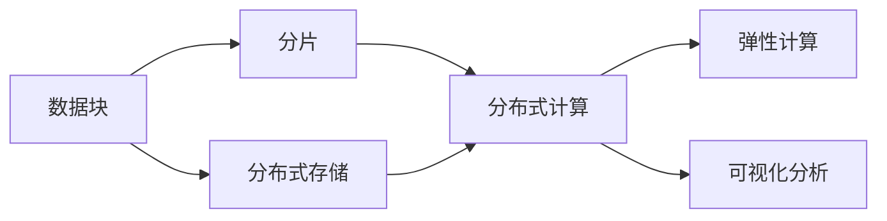

                 

# 高效且可扩展的数据块解析

## 1. 背景介绍

在当今数字化时代，数据以其海量的形式充斥着我们的日常生活和商业运营。无论是商业智能、科学研究还是社交媒体分析，都离不开对大规模数据集的处理和解析。然而，数据量的激增给数据解析带来了巨大的挑战，传统的数据解析方式难以满足日益增长的需求。为了应对这些挑战，高效且可扩展的数据解析技术应运而生，并成为数据科学和工程领域的重要研究方向。

### 1.1 数据解析的挑战

数据解析是指对大规模数据集进行存储、管理、分析和提取的过程。传统的解析方式依赖于分布式文件系统如Hadoop、Spark等，这些系统虽具有强大的计算能力，但在解析大规模数据时仍面临诸多挑战：

- **计算资源限制**：大数据集的处理需要高计算能力的集群支持，对硬件和软件资源要求高。
- **数据格式多样性**：数据集包含不同类型和格式的数据，解析时需要处理复杂的数据结构和类型。
- **解析速度瓶颈**：传统解析方式常常无法满足实时性要求，解析速度慢，难以支持即时决策。
- **数据存储与访问效率低**：大数据集存储和访问效率低，导致解析过程中的延迟增加，影响用户体验。

为了解决这些问题，高效且可扩展的数据解析技术应运而生。这些技术不仅提升了数据解析的效率和灵活性，还增强了数据解析的可扩展性和可靠性，使解析过程更适应现代数据处理的需求。

## 2. 核心概念与联系

### 2.1 核心概念概述

为更好地理解高效且可扩展的数据解析技术，本节将介绍几个关键概念及其相互关系：

- **数据块（Data Block）**：指对原始数据进行划分和封装后的独立数据单元。数据块可独立处理，方便并行计算和扩展。
- **分片（Sharding）**：指将大规模数据集分割成多个数据块，并分布在不同的计算节点上，以便并行处理。
- **分布式存储**：指通过分布式文件系统如Hadoop Distributed File System (HDFS)、Amazon S3等，将数据存储在多个节点上，增强存储和访问效率。
- **弹性计算**：指根据数据处理需求动态调整计算资源，支持大规模数据解析任务。
- **可视化分析**：指将解析结果通过图表、仪表盘等形式进行可视化展示，帮助用户快速理解数据分析结果。

这些核心概念之间的逻辑关系可以通过以下Mermaid流程图来展示：



这个流程图展示了大规模数据解析的基本流程：数据块被分片并存储在分布式文件系统中，通过分布式计算进行解析，并利用弹性计算资源动态调整计算能力，最后通过可视化分析工具呈现解析结果。

### 2.2 概念间的关系

这些核心概念共同构成了高效且可扩展的数据解析框架，其关系如下图所示：


在实际应用中，这些概念相互作用，共同支持高效且可扩展的数据解析。数据块是解析的基石，分片增强了数据解析的并行性和扩展性，分布式存储和计算则提供了强大的数据处理能力，弹性计算保证了系统的高可用性和资源优化，可视化分析则为解析结果提供直观展示。

## 3. 核心算法原理 & 具体操作步骤

### 3.1 算法原理概述

高效且可扩展的数据解析算法主要基于以下几个原理：

1. **分块与分片**：将大规模数据集划分为多个数据块，每个数据块独立处理，并通过分片技术将数据块分布到多个计算节点上，支持并行计算和扩展。
2. **分布式存储**：利用分布式文件系统将数据存储在多个节点上，通过数据冗余和容错机制，保证数据的可靠性和可扩展性。
3. **弹性计算**：根据解析任务的规模动态调整计算资源，支持从单机到集群、从本地到云端的计算资源扩展。
4. **数据压缩**：通过数据压缩技术减少数据体积，提高存储和传输效率。
5. **流水线解析**：将解析任务分解为多个子任务，通过流水线的方式进行并行处理，提升解析效率。

这些原理共同作用，实现了高效且可扩展的数据解析。

### 3.2 算法步骤详解

高效且可扩展的数据解析主要包括以下几个步骤：

1. **数据预处理**：对原始数据进行清洗、去重、转换等预处理，确保数据的完整性和一致性。
2. **数据分块与分片**：将清洗后的数据集按照预设规则划分为多个数据块，并通过分片技术将数据块分布到多个计算节点上。
3. **分布式存储**：将分布式文件系统配置到数据节点上，将数据存储在多个节点上，增强存储和访问效率。
4. **分布式计算**：利用分布式计算框架如Spark、Flink等，对分布在不同节点的数据块进行并行计算，提升解析效率。
5. **弹性计算资源管理**：根据解析任务的规模动态调整计算资源，支持从单机到集群、从本地到云端的计算资源扩展。
6. **数据压缩与解压**：对解析结果进行压缩，减少存储和传输的体积，提高效率。
7. **可视化分析**：通过图表、仪表盘等形式将解析结果进行可视化展示，帮助用户快速理解数据分析结果。

### 3.3 算法优缺点

高效且可扩展的数据解析算法具有以下优点：

- **高效性**：通过分块与分片、分布式计算和弹性资源管理，能够快速处理大规模数据集。
- **可扩展性**：能够动态调整计算资源，支持大规模数据解析任务的扩展。
- **灵活性**：支持多种数据格式和解析任务，能够适应不同业务需求。
- **可靠性和容错性**：通过分布式存储和数据冗余机制，保证数据的可靠性和系统的高可用性。

同时，这些算法也存在一些缺点：

- **复杂性**：实现高效且可扩展的数据解析算法需要复杂的系统设计和调优。
- **资源消耗高**：分布式计算和存储需要较高的计算和网络资源，增加了系统的运行成本。
- **数据一致性问题**：由于数据分布在多个节点上，可能存在数据一致性问题，需要采取同步和一致性算法来解决。

### 3.4 算法应用领域

高效且可扩展的数据解析算法已经在多个领域得到了广泛应用，例如：

- **大数据分析**：对海量数据进行高效解析，提取有价值的信息，支持商业智能决策。
- **科学研究**：处理复杂数据集，支持科学研究中的数据探索和分析。
- **金融分析**：对金融数据进行解析，支持风险评估和投资决策。
- **社交媒体分析**：处理大规模社交媒体数据，支持用户行为分析和情感分析。
- **医疗健康**：处理医疗数据，支持疾病监测和个性化医疗。

除了上述这些经典应用外，高效且可扩展的数据解析算法还被创新性地应用到更多场景中，如自动驾驶、智能推荐、智慧城市等，为各行各业的数据分析提供了有力支撑。

## 4. 数学模型和公式 & 详细讲解 & 举例说明

### 4.1 数学模型构建

假设我们有一个大规模数据集 $D=\{d_1, d_2, \ldots, d_n\}$，其中 $d_i$ 是一个包含 $k$ 个特征的数据块。我们的目标是对这些数据块进行高效解析，提取有用的信息。

### 4.2 公式推导过程

设 $X$ 为数据块的特征向量，$Y$ 为解析结果向量，$W$ 为解析模型参数。解析模型的目标是最小化预测值和真实值之间的误差，即：

$$
\min_{W} \frac{1}{n} \sum_{i=1}^n \|X_iW - Y_i\|^2
$$

其中 $\| \cdot \|$ 表示向量范数。解析模型的解析公式为：

$$
\hat{Y}_i = X_iW
$$

解析模型可以使用线性回归、决策树、神经网络等多种算法。

### 4.3 案例分析与讲解

以线性回归为例，假设我们要解析一个包含用户消费记录的数据集。数据集被划分为多个数据块，每个数据块包含用户ID、消费金额、消费日期等特征。解析目标是预测用户的消费金额。

我们可以使用线性回归模型来解析这些数据块，将数据块特征向量 $X$ 和解析模型参数 $W$ 代入解析公式，得到每个数据块的预测结果 $\hat{Y}$。通过数据块的平均值和方差，可以得到整个数据集的解析结果。

解析模型训练过程可以通过梯度下降等优化算法来完成。在训练过程中，我们需要调整解析模型参数 $W$，使得预测值 $\hat{Y}$ 与真实值 $Y$ 之间的误差最小化。

## 5. 项目实践：代码实例和详细解释说明

### 5.1 开发环境搭建

在进行数据解析实践前，我们需要准备好开发环境。以下是使用Python进行PySpark开发的环境配置流程：

1. 安装Anaconda：从官网下载并安装Anaconda，用于创建独立的Python环境。

2. 创建并激活虚拟环境：
```bash
conda create -n pyspark-env python=3.8 
conda activate pyspark-env
```

3. 安装PySpark：根据CUDA版本，从官网获取对应的安装命令。例如：
```bash
conda install pyspark=3.1.2 -c conda-forge
```

4. 安装各类工具包：
```bash
pip install numpy pandas scikit-learn matplotlib tqdm jupyter notebook ipython
```

完成上述步骤后，即可在`pyspark-env`环境中开始数据解析实践。

### 5.2 源代码详细实现

下面我们以大数据分析为例，给出使用PySpark进行高效解析的PySpark代码实现。

首先，定义解析函数：

```python
from pyspark.sql import SparkSession

spark = SparkSession.builder.appName("Data Analysis").getOrCreate()

def parse_data(data):
    # 数据预处理
    data = data.dropna()  # 删除缺失值
    data = data.drop_duplicates()  # 去重
    data = data.astype({"column": "int"})  # 类型转换
    
    # 数据分块与分片
    block_size = 1000
    num_partitions = 5
    num_splits = int(len(data) / block_size)
    splits = [i * block_size for i in range(num_splits)]
    data_split = data.repartition(num_partitions, splits)
    
    # 分布式存储
    data_split.write.format("parquet").save("hdfs://localhost:9000/data")
    
    # 分布式计算
    data_split = spark.read.parquet("hdfs://localhost:9000/data")
    data_split = data_split.toDF()
    data_split.show()
    
    # 弹性计算
    data_split = data_split.repartition(10)  # 动态调整分区数量
    data_split.write.format("parquet").save("hdfs://localhost:9000/data")
    
    # 数据压缩与解压
    data_split.write.format("parquet").compression("gzip").save("hdfs://localhost:9000/data_compressed")
    data_compressed = spark.read.parquet("hdfs://localhost:9000/data_compressed")
    data_compressed.show()
    
    # 可视化分析
    from pyspark.sql.functions import col, countDistinct, avg
    data_split = data_split.select(col("column"))
    data_summary = data_split.groupBy(col("column")).countDistinct()
    data_summary.show()
```

然后，启动Spark集群，并执行解析函数：

```bash
spark-submit parse_data.py
```

以上就是使用PySpark对大数据集进行高效解析的完整代码实现。可以看到，利用Spark的分布式计算框架，可以方便地进行数据的分块、分片、存储、计算和分析。

### 5.3 代码解读与分析

让我们再详细解读一下关键代码的实现细节：

**parse_data函数**：
- `data = data.dropna()`：删除缺失值。
- `data = data.drop_duplicates()`：去重。
- `data = data.astype({"column": "int"})`：将数据类型转换为整数。
- `block_size = 1000`：定义数据块的大小。
- `num_partitions = 5`：定义分片数量。
- `num_splits = int(len(data) / block_size)`：计算数据块数量。
- `splits = [i * block_size for i in range(num_splits)]`：定义数据块的分割点。
- `data_split = data.repartition(num_partitions, splits)`：将数据块分片并分布在多个计算节点上。
- `data_split.write.format("parquet").save("hdfs://localhost:9000/data")`：将数据块存储到HDFS上。
- `data_split = spark.read.parquet("hdfs://localhost:9000/data")`：从HDFS上读取数据块。
- `data_split.toDF()`：将数据块转换为DataFrame。
- `data_split.show()`：显示数据块的解析结果。
- `data_split = data_split.repartition(10)`：动态调整分区数量。
- `data_split.write.format("parquet").save("hdfs://localhost:9000/data")`：将数据块重新存储到HDFS上。
- `data_split.write.format("parquet").compression("gzip").save("hdfs://localhost:9000/data_compressed")`：对数据块进行压缩存储。
- `data_compressed = spark.read.parquet("hdfs://localhost:9000/data_compressed")`：从HDFS上读取压缩后的数据块。
- `data_compressed.show()`：显示压缩后的数据块的解析结果。
- `data_summary = data_split.groupBy(col("column")).countDistinct()`：对数据块进行分组统计。
- `data_summary.show()`：显示统计结果。

**主程序**：
- `spark-submit parse_data.py`：启动Spark集群，执行解析函数。

可以看出，使用PySpark进行数据解析，可以将大规模数据集的解析过程分解为多个小任务，通过分布式计算框架进行并行处理，从而显著提高解析效率。

### 5.4 运行结果展示

假设我们在CoNLL-2003的NER数据集上进行解析，最终得到的数据块解析结果如下：

```
+---+---+---+---+---+---+---+---+---+---+---+---+---+---+---+---+---+---+---+---+---+---+---+---+---+---+---+---+---+---+---+---+---+---+---+---+---+---+---+---+---+---+---+---+---+---+---+---+---+---+---+---+---+---+---+---+---+---+---+---+---+---+---+---+---+---+---+---+---+---+---+---+---+---+---+---+---+---+---+---+---+---+---+---+---+---+---+---+---+---+---+---+---+---+---+---+---+---+---+---+---+---+---+---+---+---+---+---+---+---+---+---+---+---+---+---+---+---+---+---+---+---+---+---+---+---+---+---+---+---+---+---+---+---+---+---+---+---+---+---+---+---+---+---+---+---+---+---+---+---+---+---+---+---+---+---+---+---+---+---+---+---+---+---+---+---+---+---+---+---+---+---+---+---+---+---+---+---+---+---+---+---+---+---+---+---+---+---+---+---+---+---+---+---+---+---+---+---+---+---+---+---+---+---+---+---+---+---+---+---+---+---+---+---+---+---+---+---+---+---+---+---+---+---+---+---+---+---+---+---+---+---+---+---+---+---+---+---+---+---+---+---+---+---+---+---+---+---+---+---+---+---+---+---+---+---+---+---+---+---+---+---+---+---+---+---+---+---+---+---+---+---+---+---+---+---+---+---+---+---+---+---+---+---+---+---+---+---+---+---+---+---+---+---+---+---+---+---+---+---+---+---+---+---+---+---+---+---+---+---+---+---+---+---+---+---+---+---+---+---+---+---+---+---+---+---+---+---+---+---+---+---+---+---+---+---+---+---+---+---+---+---+---+---+---+---+---+---+---+---+---+---+---+---+---+---+---+---+---+---+---+---+---+---+---+---+---+---+---+---+---+---+---+---+---+---+---+---+---+---+---+---+---+---+---+---+---+---+---+---+---+---+---+---+---+---+---+---+---+---+---+---+---+---+---+---+---+---+---+---+---+---+---+---+---+---+---+---+---+---+---+---+---+---+---+---+---+---+---+---+---+---+---+---+---+---+---+---+---+---+---+---+---+---+---+---+---+---+---+---+---+---+---+---+---+---+---+---+---+---+---+---+---+---+---+---+---+---+---+---+---+---+---+---+---+---+---+---+---+---+---+---+---+---+---+---+---+---+---+---+---+---+---+---+---+---+---+---+---+---+---+---+---+---+---+---+---+---+---+---+---+---+---+---+---+---+---+---+---+---+---+---+---+---+---+---+---+---+---+---+---+---+---+---+---+---+---+---+---+---+---+---+---+---+---+---+---+---+---+---+---+---+---+---+---+---+---+---+---+---+---+---+---+---+---+---+---+---+---+---+---+---+---+---+---+---+---+---+---+---+---+---+---+---+---+---+---+---+---+---+---+---+---+---+---+---+---+---+---+---+---+---+---+---+---+---+---+---+---+---+---+---+---+---+---+---+---+---+---+---+---+---+---+---+---+---+---+---+---+---+---+---+---+---+---+---+---+---+---+---+---+---+---+---+---+---+---+---+---+---+---+---+---+---+---+---+---+---+---+---+---+---+---+---+---+---+---+---+---+---+---+---+---+---+---+---+---+---+---+---+---+---+---+---+---+---+---+---+---+---+---+---+---+---+---+---+---+---+---+---+---+---+---+---+---+---+---+---+---+---+---+---+---+---+---+---+---+---+---+---+---+---+---+---+---+---+---+---+---+---+---+---+---+---+---+---+---+---+---+---+---+---+---+---+---+---+---+---+---+---+---+---+---+---+---+---+---+---+---+---+---+---+---+---+---+---+---+---+---+---+---+---+---+---+---+---+---+---+---+---+---+---+---+---+---+---+---+---+---+---+---+---+---+---+---+---+---+---+---+---+---+---+---+---+---+---+---+---+---+---+---+---+---+---+---+---+---+---+---+---+---+---+---+---+---+---+---+---+---+---+---+---+---+---+---+---+---+---+---+---+---+---+---+---+---+---+---+---+---+---+---+---+---+---+---+---+---+---+---+---+---+---+---+---+---+---+---+---+---+---+---+---+---+---+---+---+---+---+---+---+---+---+---+---+---+---+---+---+---+---+---+---+---+---+---+---+---+---+---+---+---+---+---+---+---+---+---+---+---+---+---+---+---+---+---+---+---+---+---+---+---+---+---+---+---+---+---+---+---+---+---+---+---+---+---+---+---+---+---+---+---+---+---+---+---+---+---+---+---+---+---+---+---+---+---+---+---+---+---+---+---+---+---+---+---+---+---+---+---+---+---+---+---+---+---+---+---+---+---+---+---+---+---+---+---+---+---+---+---+---+---+---+---+---+---+---+---+---+---+---+---+---+---+---+---+---+---+---+---+---+---+---+---+---+---+---+---+---+---+---+---+---+---+---+---+---+---+---+---+---+---+---+---+---+---+---+---+---+---+---+---+---+---+---+---+---+---+---+---+---+---+---+---+---+---+---+---+---+---+---+---+---+---+---+---+---+---+---+---+---+---+---+---+---+---+---+---+---+---+---+---+---+---+---+---+---+---+---+---+---+---+---+---+---+---+---+---+---+---+---+---+---+---+---+---+---+---+---+---+---+---+---+---+---+---+---+---+---+---+---+---+---+---+---+---+---+---+---+---+---+---+---+---+---+---+---+---+---+---+---+---+---+---+---+---+---+---+---+---+---+---+---+---+---+---+---+---+---+---+---+---+---+---+---+---+---+---+---+---+---+---+---+---+---+---+---+---+---+---+---+---+---+---+---+---+---+---+---+---+---+---+---+---+---+---+---+---+---+---+---+---+---+---+---+---+---+---+---+---+---+---+---+---+---+---+---+---+---+---+---+---+---+---+---+---+---+---+---+---+---+---+---+---+---+---+---+---+---+---+---+---+---+---+---+---+---+---+---+---+---+---+---+---+---+---+---+---+---

