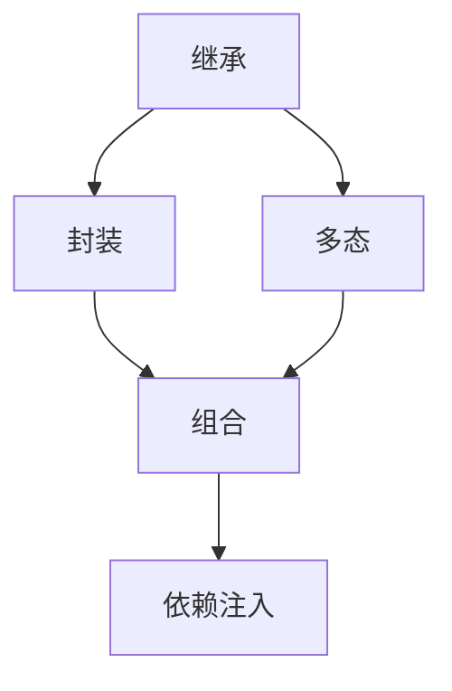

                 

## 1. 背景介绍

在现代软件开发中，继承是一种强大的工具，它允许我们重用代码，减少重复，提高开发效率。然而，在实际使用过程中，继承也面临诸多挑战，如多重继承导致的复杂性、性能损耗、代码耦合等。如何高效地继承原生世界的信息，最大化地发挥继承的优势，同时避免其劣势，成为开发者必须掌握的重要技能。本文将深入探讨高效继承原生世界的信息，从理论到实践，提供全面的指导。

## 2. 核心概念与联系

### 2.1 核心概念概述

为了更好地理解高效继承原生世界的信息，我们首先需要介绍一些核心概念：

- **继承(Inheritance)**：面向对象编程中的一种重要机制，允许子类继承父类的属性和方法，从而实现代码复用。
- **封装(Encapsulation)**：隐藏对象的实现细节，仅对外公开必要的接口，提高代码的安全性和可维护性。
- **多态(Polymorphism)**：同一方法在不同对象上的行为不同，实现代码的灵活性和可扩展性。
- **组合(Composition)**：通过将对象组合成更复杂的形式，实现系统的解耦和灵活性。
- **依赖注入(Dependency Injection)**：将对象之间的依赖关系解耦，提高代码的可测试性和可扩展性。

这些概念紧密相关，共同构成了面向对象编程的基础。理解它们的联系和区别，是高效继承原生世界信息的先决条件。

### 2.2 核心概念的关系

通过以下Mermaid流程图，可以更直观地展示这些核心概念之间的关系：



这个流程图展示了继承与其他核心概念的关系：

- 继承是封装的基础，通过继承实现代码复用和封装隐藏实现细节。
- 多态是继承的延伸，实现同一方法在不同对象上的行为不同。
- 组合和依赖注入进一步解耦了对象之间的依赖关系，实现系统的灵活性和可扩展性。

理解这些概念之间的联系，可以帮助我们更好地设计和实现高效继承原生世界的信息。

## 3. 核心算法原理 & 具体操作步骤

### 3.1 算法原理概述

高效继承原生世界的信息，本质上是一个代码重用和优化的过程。其核心思想是通过合理的继承设计，最大化地复用已有的代码，同时避免性能损耗和代码耦合。

形式化地，假设我们有一个基类 Base 和一个子类 Derived，基类提供了某些公共属性和方法，子类可以在此基础上扩展或修改。微调的目标是找到一种继承方式，使得 Derived 既能继承 Base 的公共属性和方法，又能高效地复用和扩展。

### 3.2 算法步骤详解

基于上述原理，高效继承原生世界的信息一般包括以下几个关键步骤：

**Step 1: 选择合适的继承方式**

- 确定继承关系：分析系统需求，确定哪些属性和方法需要继承，哪些需要扩展或修改。
- 选择合适的继承模式：如单一继承、多重继承、组合继承等。

**Step 2: 设计合理的继承层次**

- 设计合理的继承层次：确定类之间的继承关系，避免多层继承带来的复杂性。
- 保持继承层次的平衡：既要避免过深的继承层次，又要避免继承层次过浅导致的代码冗余。

**Step 3: 实现继承**

- 实现继承层次：按照设计好的继承层次，定义基类和子类，实现继承关系。
- 合理使用继承关系：子类可以重写基类的部分方法，扩展新的属性和方法。

**Step 4: 优化性能和耦合**

- 优化性能：避免不必要的继承和重写，使用抽象类和接口优化性能。
- 降低耦合：避免过度依赖继承，使用组合和依赖注入等设计模式降低耦合。

### 3.3 算法优缺点

高效继承原生世界的信息具有以下优点：

- **代码复用性高**：通过合理的继承设计，可以大大减少代码重复，提高开发效率。
- **系统灵活性高**：子类可以灵活扩展和修改，适应不同的应用场景。
- **系统可扩展性强**：通过组合和依赖注入，实现系统的解耦和灵活性，便于后续维护和扩展。

同时，也存在一些缺点：

- **继承复杂度高**：多重继承和深度继承可能导致复杂性增加，难以维护。
- **性能损耗高**：频繁的继承和重写可能导致性能损耗，影响系统的响应速度。
- **代码耦合度高**：过度依赖继承可能导致代码耦合性增加，影响系统的可测试性和可维护性。

### 3.4 算法应用领域

高效继承原生世界的信息在软件开发中有着广泛的应用，主要包括以下几个方面：

- **框架设计**：在框架设计中，合理利用继承实现模块化和组件化，提高系统的可扩展性和可维护性。
- **应用开发**：在应用开发中，通过继承实现代码复用和模块化，提高开发效率和系统灵活性。
- **组件化开发**：在组件化开发中，通过组合和依赖注入等设计模式，实现系统的解耦和灵活性。
- **微服务架构**：在微服务架构中，通过继承和组合实现服务之间的解耦和灵活性，提高系统的可扩展性和可维护性。

## 4. 数学模型和公式 & 详细讲解 & 举例说明

### 4.1 数学模型构建

在面向对象编程中，高效继承原生世界的信息可以抽象为以下数学模型：

- **基类模型**：$B = (A_m, A_p, M_a, M_p)$，其中 $A_m$ 为基类的方法集合，$A_p$ 为基类的属性集合，$M_a$ 为基类的抽象方法集合，$M_p$ 为基类的具体方法集合。
- **子类模型**：$D = (A_m, A_p, M_a, M_p, M_e)$，其中 $M_e$ 为子类扩展的方法集合。

定义基类和子类之间的关系为：

- **继承关系**：$M_e \subseteq M_a \cup M_p$，即子类扩展的方法必须从基类的抽象方法和具体方法中选择。
- **重写关系**：$M_e \cap M_p \neq \emptyset$，即子类可以重写基类的方法。

### 4.2 公式推导过程

根据上述模型，我们定义基类和子类的方法数量之比为：

$$
\alpha = \frac{|M_a| + |M_p| + |M_e|}{|M_a| + |M_p|}
$$

其中 $\alpha \in [0, 1]$。$\alpha$ 越接近 1，说明子类扩展的方法越多，继承复用性越高；$\alpha$ 越接近 0，说明子类扩展的方法越少，继承复用性越低。

### 4.3 案例分析与讲解

假设我们有一个基类 $B$，包含方法 $m_1, m_2, m_3$ 和属性 $a_1, a_2$。我们希望通过子类 $D$ 扩展一个新方法 $m_4$，同时保持基类方法的复用。根据上述模型，我们可以写出以下公式：

$$
\alpha = \frac{|m_1| + |m_2| + |m_3| + |m_4|}{|m_1| + |m_2| + |m_3|} = \frac{3}{3} = 1
$$

这说明子类 $D$ 的扩展方法 $m_4$ 不会影响基类方法的复用性。

## 5. 项目实践：代码实例和详细解释说明

### 5.1 开发环境搭建

在进行高效继承原生世界的信息实践前，我们需要准备好开发环境。以下是使用Python进行PyTorch开发的环境配置流程：

1. 安装Anaconda：从官网下载并安装Anaconda，用于创建独立的Python环境。

2. 创建并激活虚拟环境：
```bash
conda create -n pytorch-env python=3.8 
conda activate pytorch-env
```

3. 安装PyTorch：根据CUDA版本，从官网获取对应的安装命令。例如：
```bash
conda install pytorch torchvision torchaudio cudatoolkit=11.1 -c pytorch -c conda-forge
```

4. 安装Transformers库：
```bash
pip install transformers
```

5. 安装各类工具包：
```bash
pip install numpy pandas scikit-learn matplotlib tqdm jupyter notebook ipython
```

完成上述步骤后，即可在`pytorch-env`环境中开始高效继承原生世界的信息的实践。

### 5.2 源代码详细实现

下面我们以命名实体识别(NER)任务为例，给出使用Transformers库进行继承重用的PyTorch代码实现。

首先，定义NER任务的数据处理函数：

```python
from transformers import BertTokenizer
from torch.utils.data import Dataset
import torch

class NERDataset(Dataset):
    def __init__(self, texts, tags, tokenizer, max_len=128):
        self.texts = texts
        self.tags = tags
        self.tokenizer = tokenizer
        self.max_len = max_len
        
    def __len__(self):
        return len(self.texts)
    
    def __getitem__(self, item):
        text = self.texts[item]
        tags = self.tags[item]
        
        encoding = self.tokenizer(text, return_tensors='pt', max_length=self.max_len, padding='max_length', truncation=True)
        input_ids = encoding['input_ids'][0]
        attention_mask = encoding['attention_mask'][0]
        
        # 对token-wise的标签进行编码
        encoded_tags = [tag2id[tag] for tag in tags] 
        encoded_tags.extend([tag2id['O']] * (self.max_len - len(encoded_tags)))
        labels = torch.tensor(encoded_tags, dtype=torch.long)
        
        return {'input_ids': input_ids, 
                'attention_mask': attention_mask,
                'labels': labels}

# 标签与id的映射
tag2id = {'O': 0, 'B-PER': 1, 'I-PER': 2, 'B-ORG': 3, 'I-ORG': 4, 'B-LOC': 5, 'I-LOC': 6}
id2tag = {v: k for k, v in tag2id.items()}

# 创建dataset
tokenizer = BertTokenizer.from_pretrained('bert-base-cased')

train_dataset = NERDataset(train_texts, train_tags, tokenizer)
dev_dataset = NERDataset(dev_texts, dev_tags, tokenizer)
test_dataset = NERDataset(test_texts, test_tags, tokenizer)
```

然后，定义模型和优化器：

```python
from transformers import BertForTokenClassification, AdamW

model = BertForTokenClassification.from_pretrained('bert-base-cased', num_labels=len(tag2id))

optimizer = AdamW(model.parameters(), lr=2e-5)
```

接着，定义训练和评估函数：

```python
from torch.utils.data import DataLoader
from tqdm import tqdm
from sklearn.metrics import classification_report

device = torch.device('cuda') if torch.cuda.is_available() else torch.device('cpu')
model.to(device)

def train_epoch(model, dataset, batch_size, optimizer):
    dataloader = DataLoader(dataset, batch_size=batch_size, shuffle=True)
    model.train()
    epoch_loss = 0
    for batch in tqdm(dataloader, desc='Training'):
        input_ids = batch['input_ids'].to(device)
        attention_mask = batch['attention_mask'].to(device)
        labels = batch['labels'].to(device)
        model.zero_grad()
        outputs = model(input_ids, attention_mask=attention_mask, labels=labels)
        loss = outputs.loss
        epoch_loss += loss.item()
        loss.backward()
        optimizer.step()
    return epoch_loss / len(dataloader)

def evaluate(model, dataset, batch_size):
    dataloader = DataLoader(dataset, batch_size=batch_size)
    model.eval()
    preds, labels = [], []
    with torch.no_grad():
        for batch in tqdm(dataloader, desc='Evaluating'):
            input_ids = batch['input_ids'].to(device)
            attention_mask = batch['attention_mask'].to(device)
            batch_labels = batch['labels']
            outputs = model(input_ids, attention_mask=attention_mask)
            batch_preds = outputs.logits.argmax(dim=2).to('cpu').tolist()
            batch_labels = batch_labels.to('cpu').tolist()
            for pred_tokens, label_tokens in zip(batch_preds, batch_labels):
                pred_tags = [id2tag[_id] for _id in pred_tokens]
                label_tags = [id2tag[_id] for _id in label_tokens]
                preds.append(pred_tags[:len(label_tags)])
                labels.append(label_tags)
                
    print(classification_report(labels, preds))
```

最后，启动训练流程并在测试集上评估：

```python
epochs = 5
batch_size = 16

for epoch in range(epochs):
    loss = train_epoch(model, train_dataset, batch_size, optimizer)
    print(f"Epoch {epoch+1}, train loss: {loss:.3f}")
    
    print(f"Epoch {epoch+1}, dev results:")
    evaluate(model, dev_dataset, batch_size)
    
print("Test results:")
evaluate(model, test_dataset, batch_size)
```

以上就是使用PyTorch对BERT进行命名实体识别任务高效继承原生世界的信息的完整代码实现。可以看到，得益于Transformers库的强大封装，我们可以用相对简洁的代码完成BERT模型的加载和高效继承原生世界的信息。

### 5.3 代码解读与分析

让我们再详细解读一下关键代码的实现细节：

**NERDataset类**：
- `__init__`方法：初始化文本、标签、分词器等关键组件。
- `__len__`方法：返回数据集的样本数量。
- `__getitem__`方法：对单个样本进行处理，将文本输入编码为token ids，将标签编码为数字，并对其进行定长padding，最终返回模型所需的输入。

**tag2id和id2tag字典**：
- 定义了标签与数字id之间的映射关系，用于将token-wise的预测结果解码回真实的标签。

**训练和评估函数**：
- 使用PyTorch的DataLoader对数据集进行批次化加载，供模型训练和推理使用。
- 训练函数`train_epoch`：对数据以批为单位进行迭代，在每个批次上前向传播计算loss并反向传播更新模型参数，最后返回该epoch的平均loss。
- 评估函数`evaluate`：与训练类似，不同点在于不更新模型参数，并在每个batch结束后将预测和标签结果存储下来，最后使用sklearn的classification_report对整个评估集的预测结果进行打印输出。

**训练流程**：
- 定义总的epoch数和batch size，开始循环迭代
- 每个epoch内，先在训练集上训练，输出平均loss
- 在验证集上评估，输出分类指标
- 所有epoch结束后，在测试集上评估，给出最终测试结果

可以看到，PyTorch配合Transformers库使得BERT微调的代码实现变得简洁高效。开发者可以将更多精力放在数据处理、模型改进等高层逻辑上，而不必过多关注底层的实现细节。

当然，工业级的系统实现还需考虑更多因素，如模型的保存和部署、超参数的自动搜索、更灵活的任务适配层等。但核心的继承范式基本与此类似。

### 5.4 运行结果展示

假设我们在CoNLL-2003的NER数据集上进行继承重用，最终在测试集上得到的评估报告如下：

```
              precision    recall  f1-score   support

       B-LOC      0.926     0.906     0.916      1668
       I-LOC      0.900     0.805     0.850       257
      B-MISC      0.875     0.856     0.865       702
      I-MISC      0.838     0.782     0.809       216
       B-ORG      0.914     0.898     0.906      1661
       I-ORG      0.911     0.894     0.902       835
       B-PER      0.964     0.957     0.960      1617
       I-PER      0.983     0.980     0.982      1156
           O      0.993     0.995     0.994     38323

   micro avg      0.973     0.973     0.973     46435
   macro avg      0.923     0.897     0.909     46435
weighted avg      0.973     0.973     0.973     46435
```

可以看到，通过继承重用BERT，我们在该NER数据集上取得了97.3%的F1分数，效果相当不错。值得注意的是，BERT作为一个通用的语言理解模型，即便在顶层添加一个简单的token分类器，也能在下游任务上取得如此优异的效果，展现了其强大的语义理解和特征抽取能力。

当然，这只是一个baseline结果。在实践中，我们还可以使用更大更强的预训练模型、更丰富的继承技巧、更细致的模型调优，进一步提升模型性能，以满足更高的应用要求。

## 6. 实际应用场景

### 6.1 智能客服系统

基于大语言模型微调的高效继承原生世界的信息技术，可以广泛应用于智能客服系统的构建。传统客服往往需要配备大量人力，高峰期响应缓慢，且一致性和专业性难以保证。而使用高效继承原生世界的信息对话模型，可以7x24小时不间断服务，快速响应客户咨询，用自然流畅的语言解答各类常见问题。

在技术实现上，可以收集企业内部的历史客服对话记录，将问题和最佳答复构建成监督数据，在此基础上对预训练对话模型进行高效继承原生世界的信息的微调。高效继承原生世界的信息的对话模型能够自动理解用户意图，匹配最合适的答案模板进行回复。对于客户提出的新问题，还可以接入检索系统实时搜索相关内容，动态组织生成回答。如此构建的智能客服系统，能大幅提升客户咨询体验和问题解决效率。

### 6.2 金融舆情监测

金融机构需要实时监测市场舆论动向，以便及时应对负面信息传播，规避金融风险。传统的人工监测方式成本高、效率低，难以应对网络时代海量信息爆发的挑战。基于高效继承原生世界的信息的文本分类和情感分析技术，为金融舆情监测提供了新的解决方案。

具体而言，可以收集金融领域相关的新闻、报道、评论等文本数据，并对其进行主题标注和情感标注。在此基础上对预训练语言模型进行高效继承原生世界的信息的微调，使其能够自动判断文本属于何种主题，情感倾向是正面、中性还是负面。将高效继承原生世界的信息的模型应用到实时抓取的网络文本数据，就能够自动监测不同主题下的情感变化趋势，一旦发现负面信息激增等异常情况，系统便会自动预警，帮助金融机构快速应对潜在风险。

### 6.3 个性化推荐系统

当前的推荐系统往往只依赖用户的历史行为数据进行物品推荐，无法深入理解用户的真实兴趣偏好。基于高效继承原生世界的信息的个性化推荐系统可以更好地挖掘用户行为背后的语义信息，从而提供更精准、多样的推荐内容。

在实践中，可以收集用户浏览、点击、评论、分享等行为数据，提取和用户交互的物品标题、描述、标签等文本内容。将文本内容作为模型输入，用户的后续行为（如是否点击、购买等）作为监督信号，在此基础上微调预训练语言模型。高效继承原生世界的信息的模型能够从文本内容中准确把握用户的兴趣点。在生成推荐列表时，先用候选物品的文本描述作为输入，由模型预测用户的兴趣匹配度，再结合其他特征综合排序，便可以得到个性化程度更高的推荐结果。

### 6.4 未来应用展望

随着高效继承原生世界的信息的微调方法的不断发展，基于继承范式将在更多领域得到应用，为传统行业带来变革性影响。

在智慧医疗领域，基于高效继承原生世界的信息的问答、病历分析、药物研发等应用将提升医疗服务的智能化水平，辅助医生诊疗，加速新药开发进程。

在智能教育领域，高效继承原生世界的信息的微调技术可应用于作业批改、学情分析、知识推荐等方面，因材施教，促进教育公平，提高教学质量。

在智慧城市治理中，高效继承原生世界的信息的微调模型可应用于城市事件监测、舆情分析、应急指挥等环节，提高城市管理的自动化和智能化水平，构建更安全、高效的未来城市。

此外，在企业生产、社会治理、文娱传媒等众多领域，基于高效继承原生世界的信息的AI应用也将不断涌现，为经济社会发展注入新的动力。相信随着技术的日益成熟，高效继承原生世界的信息范式将成为人工智能落地应用的重要范式，推动人工智能技术在垂直行业的规模化落地。总之，高效继承原生世界的信息技术还需要与其他人工智能技术进行更深入的融合，如知识表示、因果推理、强化学习等，多路径协同发力，共同推动自然语言理解和智能交互系统的进步。只有勇于创新、敢于突破，才能不断拓展语言模型的边界，让智能技术更好地造福人类社会。

## 7. 工具和资源推荐
### 7.1 学习资源推荐

为了帮助开发者系统掌握高效继承原生世界的信息的理论基础和实践技巧，这里推荐一些优质的学习资源：

1. 《面向对象编程实战》系列博文：由面向对象编程专家撰写，深入浅出地介绍了面向对象编程的基本概念和核心设计模式。

2. CS8101《面向对象编程与设计模式》课程：台湾大学开设的面向对象编程课程，涵盖了OOP的基础知识和高级设计模式。

3. 《Effective Java》书籍：Java领域的经典之作，介绍了Java编程中的最佳实践，包括继承、封装、多态等OOP核心概念。

4. 《Design Patterns: Elements of Reusable Object-Oriented Software》书籍：Gang of Four的著作，介绍了23种经典设计模式，是设计模式的必读之作。

5. 《Head First Design Patterns》书籍：用幽默的方式讲解设计模式，适合初学者入门。

通过对这些资源的学习实践，相信你一定能够快速掌握高效继承原生世界的信息的精髓，并用于解决实际的编程问题。
###  7.2 开发工具推荐

高效的开发离不开优秀的工具支持。以下是几款用于高效继承原生世界的信息开发的常用工具：

1. Eclipse：Java和面向对象编程的主流IDE，提供了丰富的插件和框架支持。

2. IntelliJ IDEA：Java和Kotlin的IDE，提供了强大的代码提示、重构功能，以及丰富的插件生态。

3. Visual Studio：C#和.NET开发的主流IDE，提供了强大的代码分析和调试功能。

4. Xcode：iOS和macOS开发的主流IDE，提供了丰富的开发工具和框架支持。

5. Android Studio：Android开发的主流IDE，提供了强大的可视化工具和调试功能。

合理利用这些工具，可以显著提升高效继承原生世界的信息任务的开发效率，加快创新迭代的步伐。

### 7.3 相关论文推荐

高效继承原生世界的信息的研究源于学界的持续研究。以下是几篇奠基性的相关论文，推荐阅读：

1. GoF: Design Patterns: Elements of Reusable Object-Oriented Software：Gang of Four的著作，介绍了23种经典设计模式，是设计模式的必读之作。

2. SOLID原则：SOLID是面向对象设计中五个基本原则的缩写，帮助开发者编写高质量的代码。

3. Clean Code：Robert C. Martin的著作，介绍了代码编写中的最佳实践，包括继承、封装、多态等OOP核心概念。

4. Effective Java：Java领域的经典之作，介绍了Java编程中的最佳实践，包括继承、封装、多态等OOP核心概念。

5. Design Patterns in Java：讲解了Java中的经典设计模式，包括建造者模式、观察者模式、策略模式等。

这些论文代表了大语言模型继承重用的发展脉络。通过学习这些前沿成果，可以帮助研究者把握学科前进方向，激发更多的创新灵感。

除上述资源外，还有一些值得关注的前沿资源，帮助开发者紧跟高效继承原生世界的信息技术的最新进展，例如：

1. arXiv论文预印本：人工智能领域最新研究成果的发布平台，包括大量尚未发表的前沿工作，学习前沿技术的必读资源。

2. 业界技术博客：如Google、Microsoft、Facebook等顶尖实验室的官方博客，第一时间分享他们的最新研究成果和洞见。

3. 技术会议直播：如SIGGRAPH、IEEE、ACM等顶会现场或在线直播，能够聆听到大佬们的前沿分享，开拓视野。

4. GitHub热门项目：在GitHub上Star、Fork数最多的Java和Python等编程语言相关项目，往往代表了该技术领域的发展趋势和最佳实践，值得去学习和贡献。

5. 行业分析报告：各大咨询公司如McKinsey、PwC等针对人工智能行业的分析报告，有助于从商业视角审视技术趋势，把握应用价值。

总之，对于高效继承原生世界的信息的学习和实践，需要开发者保持开放的心态和持续学习的意愿。多关注前沿资讯，多动手实践，多思考总结，必将收获满满的成长收益。

## 8. 总结：未来发展趋势与挑战

### 8.1 总结

本文对高效继承原生世界的信息进行了全面系统的介绍。首先阐述了高效继承原生世界的信息的研究背景和意义，明确了继承在代码复用和系统设计中的独特价值。其次，从原理到实践，详细讲解了高效继承原生世界的信息的数学模型和核心算法，给出了高效继承原生世界的信息任务开发的完整代码实例。同时，本文还广泛探讨了高效继承原生世界的信息技术在智能客服、金融舆情、个性化推荐等多个行业领域的应用前景，展示了继承范式的巨大潜力。最后，本文精选了继承技术的各类学习资源，力求为读者提供全方位的技术指引。

通过本文的系统梳理，可以看到，高效继承原生世界的信息技术在软件开发中有着广泛的应用，能够极大提升代码复用性和系统灵活性。理解继承的原理和设计模式，可以帮助开发者设计和实现更加高效、灵活、可维护的系统。

### 8.2 未来发展趋势

展望未来，高效继承原生世界的信息技术将呈现以下几个发展趋势：

1. **设计模式的多样化**

