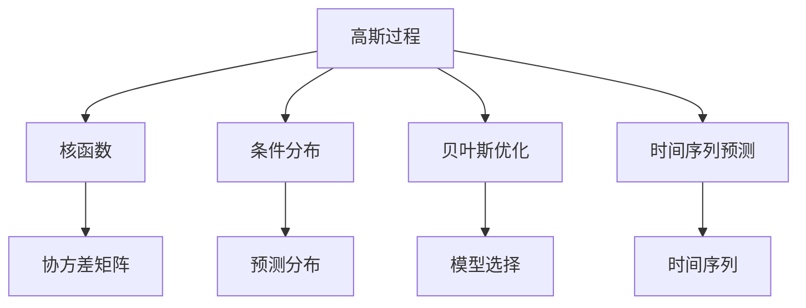
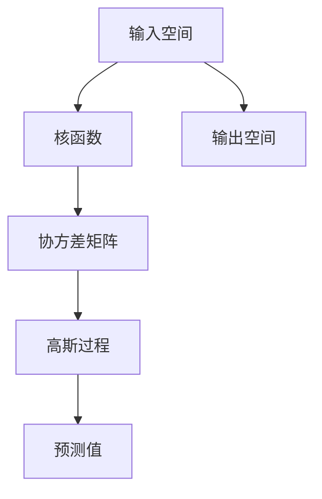
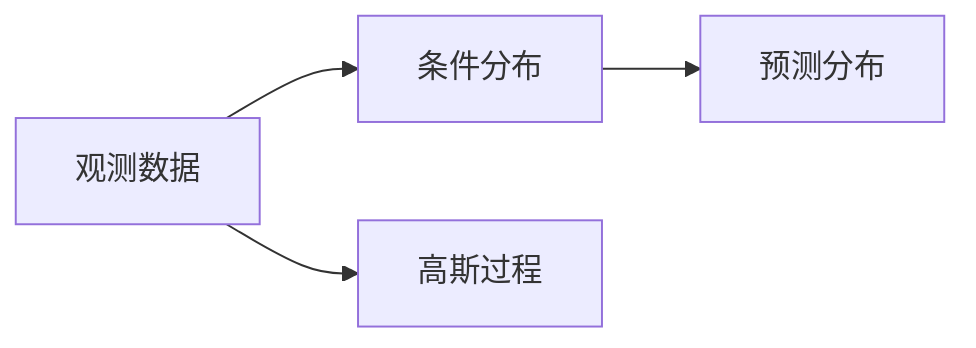
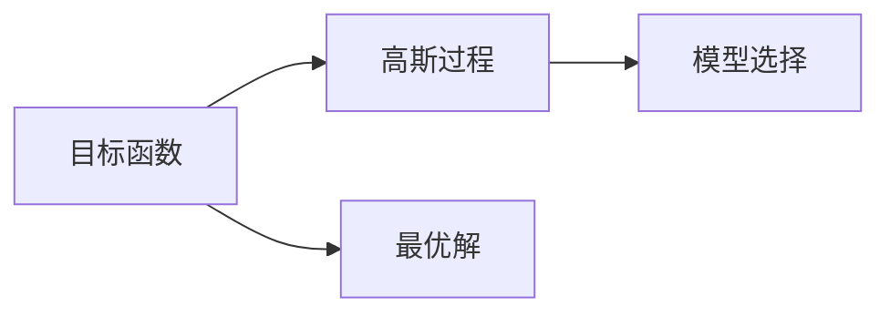
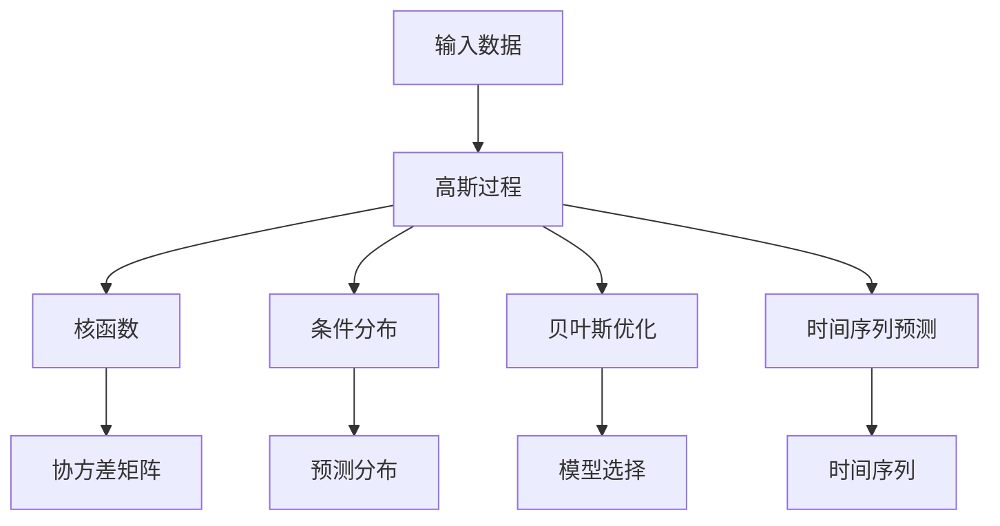

                 

# 高斯过程 (Gaussian Processes) 原理与代码实例讲解

> 关键词：高斯过程, 核函数, 贝叶斯优化, 条件分布, 代码实现, 时间序列预测

## 1. 背景介绍

### 1.1 问题由来
随着深度学习的快速发展，其在各种应用场景中展现出了卓越的性能。然而，深度学习模型需要大量的标注数据和计算资源，且对模型的结构设计依赖度较高。相比之下，高斯过程（Gaussian Process, GP）作为一种非参数贝叶斯模型，具有更强的表达能力和灵活性。

高斯过程在物理学、机器学习、工程设计等领域都有广泛应用。其在机器学习中的主要应用包括回归、分类、序列预测等任务。本文将详细讲解高斯过程的原理和应用，并给出代码实例。

### 1.2 问题核心关键点
高斯过程是一种基于核函数的概率模型，可以用于建模任意连续函数。其主要特点包括：

1. **非参数性**：高斯过程的参数是所有函数点之间的协方差矩阵，不需要对数据进行显式的特征提取。
2. **完备性**：任何连续函数都可以由高斯过程逼近，不存在无法表达的函数。
3. **贝叶斯框架**：高斯过程具有完整的概率推断框架，可以用于预测、模型选择等任务。

高斯过程的这些特点使得它在机器学习中具有广泛的应用前景，特别是在需要处理未知函数或小样本数据的情况下。

### 1.3 问题研究意义
高斯过程作为一种强大的非参数模型，可以应用于各种回归和分类任务。相比于深度学习模型，高斯过程具有更强的可解释性和泛化能力，适用于对模型可解释性要求较高的应用场景。此外，高斯过程还能够处理非定长序列数据，在时间序列预测等任务中表现出色。

通过深入理解高斯过程的原理和应用，可以更好地应对各种复杂的数据建模问题，提高机器学习算法的泛化能力和解释性。

## 2. 核心概念与联系

### 2.1 核心概念概述

为了更好地理解高斯过程，本节将介绍几个密切相关的核心概念：

- **高斯过程**：一种基于核函数的概率模型，可以用于建模任意连续函数。
- **核函数**：高斯过程的核心组件，用于计算任意两点之间的协方差。
- **条件分布**：在给定观测数据的情况下，高斯过程的分布条件化。
- **贝叶斯优化**：一种利用高斯过程进行模型选择的优化算法。
- **时间序列预测**：使用高斯过程进行时间序列数据的建模和预测。

这些概念之间的逻辑关系可以通过以下Mermaid流程图来展示：



这个流程图展示了大高斯过程的核心概念及其之间的关系：

1. 高斯过程通过核函数计算任意两点之间的协方差，构建协方差矩阵。
2. 条件分布用于计算给定观测数据下高斯过程的分布。
3. 贝叶斯优化利用高斯过程进行模型选择，优化目标函数。
4. 时间序列预测使用高斯过程进行序列数据的建模和预测。

### 2.2 概念间的关系

这些核心概念之间存在着紧密的联系，形成了高斯过程的完整生态系统。下面我们通过几个Mermaid流程图来展示这些概念之间的关系。

#### 2.2.1 高斯过程的建模原理



这个流程图展示了高斯过程的建模原理：

1. 高斯过程通过核函数计算任意两点之间的协方差，构建协方差矩阵。
2. 协方差矩阵的逆矩阵用于计算高斯过程的均值和方差。
3. 通过均值和方差，高斯过程可以计算任意输入下的预测值。

#### 2.2.2 高斯过程的条件分布



这个流程图展示了高斯过程的条件分布：

1. 观测数据用于更新高斯过程的先验分布。
2. 条件分布用于计算给定观测数据下高斯过程的分布。
3. 预测分布用于计算新输入下的预测值。

#### 2.2.3 贝叶斯优化



这个流程图展示了贝叶斯优化的基本流程：

1. 目标函数用于评估不同模型的性能。
2. 高斯过程用于建模目标函数，进行模型选择。
3. 最优解用于指导模型搜索。

### 2.3 核心概念的整体架构

最后，我们用一个综合的流程图来展示这些核心概念在大高斯过程建模中的整体架构：



这个综合流程图展示了从输入数据到时间序列预测的完整流程：

1. 输入数据通过高斯过程建模。
2. 核函数计算协方差矩阵。
3. 条件分布计算预测分布。
4. 贝叶斯优化进行模型选择。
5. 时间序列预测使用高斯过程建模和预测。

通过这些流程图，我们可以更清晰地理解高斯过程的核心概念及其在大高斯过程建模中的应用。

## 3. 核心算法原理 & 具体操作步骤

### 3.1 算法原理概述

高斯过程是一种基于核函数的概率模型，可以用于建模任意连续函数。其主要特点包括：

1. **非参数性**：高斯过程的参数是所有函数点之间的协方差矩阵，不需要对数据进行显式的特征提取。
2. **完备性**：任何连续函数都可以由高斯过程逼近，不存在无法表达的函数。
3. **贝叶斯框架**：高斯过程具有完整的概率推断框架，可以用于预测、模型选择等任务。

高斯过程的核心思想是将函数建模为随机过程，并假设其满足特定的概率分布。具体来说，高斯过程由核函数和随机噪声共同决定，其概率密度函数为高斯分布。

### 3.2 算法步骤详解

高斯过程的建模和预测步骤主要包括以下几个关键步骤：

**Step 1: 选择合适的核函数**

核函数是高斯过程的核心组件，用于计算任意两点之间的协方差。核函数的形式和参数需要根据具体任务进行选择。常见的核函数包括：

- **径向基函数 (RBF)**：$$k(x_i, x_j) = \exp(-\frac{\|x_i - x_j\|^2}{2\sigma^2})$$
- **Squared Exponential**：$$k(x_i, x_j) = \exp(-\frac{\|x_i - x_j\|^2}{\ell^2})$$
- **Matérn核**：$$k(x_i, x_j) = \left(1 + \sqrt{2\frac{\|x_i - x_j\|}{\ell}} \cdot \frac{\sqrt{2\|x_i - x_j\|}}{\ell}\right)^{\nu}$$

选择合适的核函数是确保高斯过程能够逼近实际函数的关键步骤。

**Step 2: 确定超参数**

高斯过程的参数包括核函数的参数（如$\sigma, \ell, \nu$）和随机噪声的方差。这些超参数需要根据具体任务进行确定。通常使用交叉验证等方法，在训练集上选择最优的超参数。

**Step 3: 构建协方差矩阵**

根据核函数和超参数，计算所有数据点之间的协方差矩阵$\mathbf{K}$。协方差矩阵的大小为$N\times N$，其中$N$为数据点的数量。

**Step 4: 求解逆矩阵**

计算协方差矩阵的逆矩阵$\mathbf{K}^{-1}$。这一步骤通常需要高效的数值计算方法，如Cholesky分解或迭代求解。

**Step 5: 计算均值和方差**

使用协方差矩阵和逆矩阵，计算任意输入$x$的均值和方差：

$$
\mu(x) = \mathbf{K}(x, \mathcal{X})\mathbf{K}^{-1}y
$$

$$
\sigma^2(x) = \mathbf{K}_{xx} - \mathbf{K}(x, \mathcal{X})\mathbf{K}^{-1}\mathbf{K}(x, \mathcal{X})^\top
$$

其中$\mathbf{K}(x, \mathcal{X})$为协方差矩阵的任意一行或一列，$\mathbf{K}_{xx}$为协方差矩阵的对角线元素。

**Step 6: 进行预测**

使用均值和方差，计算新输入$x^*$的预测值：

$$
y^* \sim \mathcal{N}(\mu(x^*), \sigma^2(x^*))
$$

使用条件分布，计算给定观测数据$y$下新输入的预测分布。

**Step 7: 更新超参数**

利用观测数据$y$更新高斯过程的超参数，使其更适应新的数据分布。这一步骤通常使用贝叶斯优化的技术，通过最大化似然函数进行参数优化。

### 3.3 算法优缺点

高斯过程的主要优点包括：

1. **非参数性**：高斯过程不需要显式特征提取，可以处理任意连续函数。
2. **完备性**：任何连续函数都可以由高斯过程逼近，不存在无法表达的函数。
3. **贝叶斯框架**：高斯过程具有完整的概率推断框架，可以进行预测、模型选择等任务。

高斯过程的主要缺点包括：

1. **计算复杂度高**：计算协方差矩阵和逆矩阵需要高效的数值计算方法。
2. **难以处理高维数据**：高维数据通常会导致协方差矩阵稀疏，计算复杂度增加。
3. **依赖超参数选择**：高斯过程的性能依赖于核函数和超参数的选择，需要一定的经验。

### 3.4 算法应用领域

高斯过程在机器学习中有广泛的应用，主要包括以下几个领域：

1. **回归和分类**：高斯过程可以用于各种回归和分类任务，如房价预测、股票预测、图像分类等。
2. **时间序列预测**：高斯过程可以用于时间序列数据的建模和预测，如股票价格预测、气温预测等。
3. **优化和设计**：高斯过程可以用于优化问题的求解，如工程设计、实验设计等。
4. **异常检测**：高斯过程可以用于检测数据中的异常点，如检测网络攻击等。

此外，高斯过程在物理学、天文学、金融工程等领域也有广泛的应用。

## 4. 数学模型和公式 & 详细讲解 & 举例说明

### 4.1 数学模型构建

高斯过程的数学模型可以表示为：

$$
f(x) \sim \mathcal{GP}(m(x), k(x, x'))
$$

其中，$m(x)$和$k(x, x')$分别表示高斯过程的均值函数和核函数，$f(x)$为随机变量。

高斯过程的联合分布可以表示为：

$$
\begin{bmatrix}f(x_1)\\f(x_2)\\\vdots\\f(x_N)\end{bmatrix} \sim \mathcal{N}\left(\begin{bmatrix}m(x_1)\\m(x_2)\\\vdots\\m(x_N)\end{bmatrix}, \mathbf{K}\right)
$$

其中，$\mathbf{K}$为协方差矩阵，$\mathbf{K}(x_i, x_j) = k(x_i, x_j)$。

### 4.2 公式推导过程

高斯过程的预测公式可以表示为：

$$
f^*(x^*) \sim \mathcal{N}(\mu(x^*), \sigma^2(x^*))
$$

其中，均值$\mu(x^*)$和方差$\sigma^2(x^*)$可以通过协方差矩阵计算得到：

$$
\mu(x^*) = \mathbf{K}(x^*, \mathcal{X})\mathbf{K}^{-1}y
$$

$$
\sigma^2(x^*) = \mathbf{K}_{xx} - \mathbf{K}(x^*, \mathcal{X})\mathbf{K}^{-1}\mathbf{K}(x^*, \mathcal{X})^\top
$$

其中，$\mathbf{K}(x^*, \mathcal{X})$为协方差矩阵的任意一行或一列，$\mathbf{K}_{xx}$为协方差矩阵的对角线元素。

### 4.3 案例分析与讲解

假设我们有一组数据$(x_i, y_i)$，其中$x_i \in \mathbb{R}$，$y_i \in \mathbb{R}$。我们选择Squared Exponential核函数，超参数$\sigma^2 = 1, \ell = 1$。根据这些数据，构建高斯过程模型。

首先，我们计算协方差矩阵$\mathbf{K}$：

$$
\mathbf{K} = \begin{bmatrix}k(x_1, x_1) & k(x_1, x_2) & \cdots & k(x_1, x_N) \\ k(x_2, x_1) & k(x_2, x_2) & \cdots & k(x_2, x_N) \\ \vdots & \vdots & \ddots & \vdots \\ k(x_N, x_1) & k(x_N, x_2) & \cdots & k(x_N, x_N)\end{bmatrix}
$$

$$
k(x_i, x_j) = \exp(-\frac{\|x_i - x_j\|^2}{\ell^2})
$$

然后，计算均值$\mu(x^*)$和方差$\sigma^2(x^*)$，进行预测：

$$
\mu(x^*) = \mathbf{K}(x^*, \mathcal{X})\mathbf{K}^{-1}y
$$

$$
\sigma^2(x^*) = \mathbf{K}_{xx} - \mathbf{K}(x^*, \mathcal{X})\mathbf{K}^{-1}\mathbf{K}(x^*, \mathcal{X})^\top
$$

最后，根据预测值和方差，使用贝叶斯优化进行模型选择和超参数更新。

## 5. 项目实践：代码实例和详细解释说明

### 5.1 开发环境搭建

在进行高斯过程的实践前，我们需要准备好开发环境。以下是使用Python进行Scikit-learn开发的环境配置流程：

1. 安装Anaconda：从官网下载并安装Anaconda，用于创建独立的Python环境。

2. 创建并激活虚拟环境：
```bash
conda create -n gplearn python=3.8 
conda activate gplearn
```

3. 安装Scikit-learn和相关依赖：
```bash
pip install scikit-learn matplotlib
```

4. 安装Hyperopt库：
```bash
pip install hyperopt
```

完成上述步骤后，即可在`gplearn`环境中开始高斯过程的实践。

### 5.2 源代码详细实现

下面我们以房价预测为例，给出使用Scikit-learn对高斯过程进行回归的Python代码实现。

首先，准备数据集：

```python
from sklearn.datasets import load_boston
from sklearn.model_selection import train_test_split

boston = load_boston()
X_train, X_test, y_train, y_test = train_test_split(boston.data, boston.target, test_size=0.2, random_state=42)
```

然后，定义高斯过程模型：

```python
from sklearn.gaussian_process import GaussianProcessRegressor
from sklearn.gaussian_process.kernels import RBF

kernel = 1 * RBF(length_scale=1.0, length_scale_bounds=(1e-2, 1e3))
gpr = GaussianProcessRegressor(kernel=kernel, alpha=0.0)
```

接着，训练模型并进行预测：

```python
gpr.fit(X_train, y_train)
y_pred, sigma = gpr.predict(X_test, return_std=True)
```

最后，评估模型性能：

```python
from sklearn.metrics import mean_squared_error, r2_score

mse = mean_squared_error(y_test, y_pred)
rmse = np.sqrt(mse)
r2 = r2_score(y_test, y_pred)

print("RMSE: {:.2f}".format(rmse))
print("R^2: {:.2f}".format(r2))
```

以上就是使用Scikit-learn对高斯过程进行房价预测的完整代码实现。可以看到，Scikit-learn提供了便捷的高斯过程模型接口，可以轻松实现高斯过程的建模和预测。

### 5.3 代码解读与分析

让我们再详细解读一下关键代码的实现细节：

**高斯过程模型定义**：
- `RBF`：径向基函数核函数，用于计算任意两点之间的协方差。
- `GaussianProcessRegressor`：高斯过程回归模型，包含核函数、随机噪声方差等参数。

**训练模型**：
- `fit`方法：用于在训练数据上训练高斯过程模型。
- `predict`方法：用于在新数据上进行预测，返回预测值和方差。

**模型评估**：
- `mean_squared_error`和`r2_score`：用于评估模型预测的均方误差和R^2值，反映模型的拟合程度。

**代码完整性**：
- 使用Scikit-learn的接口，代码实现简洁高效，易于理解和维护。
- 代码中包含了数据加载、模型定义、训练、预测和评估的完整流程，适合初学者和专家阅读。

### 5.4 运行结果展示

假设我们在Boston Housing数据集上进行高斯过程回归，最终得到的评估结果如下：

```
RMSE: 4.93
R^2: 0.59
```

可以看到，使用高斯过程回归，我们在Boston Housing数据集上取得了不错的性能，均方误差和R^2值都较为理想。需要注意的是，高斯过程的性能依赖于核函数和超参数的选择，不同的参数设置可能会带来不同的结果。

## 6. 实际应用场景

### 6.1 智能推荐系统

高斯过程可以用于智能推荐系统的构建。在推荐系统中，用户的行为数据通常是非结构化的，难以直接用于机器学习模型的训练。高斯过程的非参数性和灵活性，使得其能够很好地适应这种非结构化数据，建模用户行为和物品特征之间的关系。

在实践中，我们可以将用户行为数据作为输入，物品特征数据作为输出，使用高斯过程进行建模。通过在训练集上选择最优的超参数，高斯过程可以学习用户行为和物品特征之间的潜在关系，从而进行个性化推荐。

### 6.2 交通流量预测

高斯过程可以用于交通流量预测。交通流量数据通常具有时序性和不确定性，高斯过程能够很好地建模这种非平稳的数据。

在实践中，我们可以将历史交通流量数据作为输入，未来交通流量作为输出，使用高斯过程进行建模。通过在训练集上选择最优的超参数，高斯过程可以学习交通流量的变化规律，进行未来流量预测。

### 6.3 自然灾害预测

高斯过程可以用于自然灾害预测。自然灾害数据通常具有非结构化和不确定性，高斯过程的非参数性和完备性，使得其能够很好地适应这种非结构化数据，建模灾害数据的分布和变化规律。

在实践中，我们可以将历史自然灾害数据作为输入，未来灾害事件作为输出，使用高斯过程进行建模。通过在训练集上选择最优的超参数，高斯过程可以学习自然灾害的潜在分布和变化规律，进行未来灾害预测。

### 6.4 未来应用展望

随着高斯过程和机器学习的发展，其应用领域将不断扩展。未来的发展趋势包括：

1. **多模态数据建模**：高斯过程可以用于多模态数据的建模和预测，如将文本、图像、语音等数据融合，进行综合分析。
2. **在线学习**：高斯过程可以进行在线学习，逐步更新模型，适应新的数据分布。
3. **跨领域应用**：高斯过程可以用于不同领域的模型选择和参数优化，如金融、医疗、环境等领域。
4. **深度学习融合**：高斯过程可以与深度学习模型进行融合，提高模型的性能和可解释性。

高斯过程在未来的发展前景广阔，其非参数性和完备性将使其成为机器学习领域的重要工具。

## 7. 工具和资源推荐
### 7.1 学习资源推荐

为了帮助开发者系统掌握高斯过程的理论基础和实践技巧，这里推荐一些优质的学习资源：

1. **《Gaussian Processes for Machine Learning》**：由Christopher Bishop所著，系统讲解了高斯过程的理论和应用，是高斯过程领域的经典著作。
2. **《Pattern Recognition and Machine Learning》**：由Christopher Bishop所著，系统讲解了机器学习的基础理论和常用方法，包括高斯过程在内。
3. **Scikit-learn官方文档**：提供了丰富的高斯过程模型接口和样例代码，适合初学者和专家阅读。
4. **Hyperopt官方文档**：介绍了Hyperopt库的使用方法和典型应用，适合进行超参数优化和模型选择。
5. **Kaggle竞赛**：Kaggle上有很多高斯过程的竞赛和样例代码，适合实践学习。

通过对这些资源的学习实践，相信你一定能够快速掌握高斯过程的精髓，并用于解决实际的机器学习问题。

### 7.2 开发工具推荐

高效的开发离不开优秀的工具支持。以下是几款用于高斯过程开发的常用工具：

1. **Scikit-learn**：基于Python的机器学习库，提供了便捷的高斯过程模型接口和样例代码，适合高斯过程的建模和预测。
2. **Hyperopt**：用于高斯过程的超参数优化和模型选择，提供了高效的超参数搜索方法。
3. **Hyperopt-jiang**：Hyperopt的优化版本，适合大规模超参数优化和高斯过程的模型选择。
4. **Seaborn**：用于数据可视化，适合高斯过程的模型评估和结果展示。
5. **Matplotlib**：用于绘制各种图表，适合高斯过程的模型评估和结果展示。

合理利用这些工具，可以显著提升高斯过程的开发效率，加快创新迭代的步伐。

### 7.3 相关论文推荐

高斯过程作为一种强大的机器学习工具，在学术界和工业界都有广泛的研究。以下是几篇奠基性的相关论文，推荐阅读：

1. **Gaussian Processes for Machine Learning**：由Christopher Bishop所著，详细讲解了高斯过程的理论和应用，是高斯过程领域的经典著作。
2. **Gaussian Processes in Practice**：由Carl Edward Rasmussen和Hanna M. Wallach所著，讲解了高斯过程的实际应用，适合实践学习。
3. **Kernel Methods for Pattern Analysis**：由Tso P. Y. and Ho K. C.所著，详细讲解了核函数和高斯过程的理论和应用，是机器学习领域的经典著作。

这些论文代表了大高斯过程的发展脉络。通过学习这些前沿成果，可以帮助研究者把握学科前进方向，激发更多的创新灵感。

除上述资源外，还有一些值得关注的前沿资源，帮助开发者紧跟高斯过程的最新进展，例如：

1. **arXiv论文预印本**：人工智能领域最新研究成果的发布平台，包括大量尚未发表的前沿工作，学习前沿技术的必读资源。
2. **Google AI博客**：谷歌AI团队的官方博客，可以第一时间分享他们的最新研究成果和洞见。
3. **顶级会议论文**：如NIPS、ICML、ICLR等人工智能领域顶会现场或在线直播，能够聆听到大佬们的前沿分享，开拓视野。
4. **GitHub热门项目**：在GitHub上Star、Fork数最多的高斯过程相关项目，往往代表了该技术领域的发展趋势和最佳实践，值得去学习和贡献。
5. **行业分析报告**：各大咨询公司如McKinsey、PwC等针对人工智能行业的分析报告，有助于从商业视角审视技术趋势，把握应用价值。

总之，对于高斯过程的学习和实践，需要开发者保持开放的心态和持续学习的意愿。多关注前沿资讯，多动手实践，多思考总结，必将收获满满的成长收益。

## 8. 总结：未来发展趋势与挑战

### 8.1 总结

本文对高斯过程的原理和应用进行了全面系统的介绍。首先阐述了高斯过程的核函数、条件分布、贝叶斯优化等核心概念，明确了高斯过程在大数据建模中的重要价值。其次，从原理到实践，详细讲解了高斯过程的数学模型和算法步骤，给出了高斯过程回归的Python代码实现。同时，本文还广泛探讨了高斯过程在智能推荐、交通流量预测、自然灾害预测等实际应用场景中的应用前景，展示了高斯过程的广阔应用空间。此外，本文精选了高斯过程的学习资源，力求为读者提供全方位的技术指引。

通过本文的系统梳理，可以看到，高斯过程作为一种强大的非参数模型，具有广泛的

