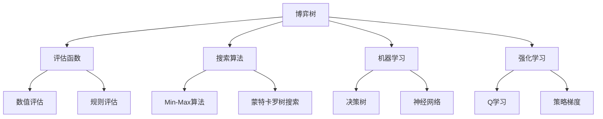

                 

# 黑白棋游戏的设计与实现

## 1. 背景介绍

黑白棋（Othello），又称为反棋，是一种策略棋类游戏，因其规则简单但策略丰富而受到棋类爱好者的喜爱。该游戏两人交替下棋，棋子根据落子的颜色不同分为黑棋和红棋。棋盘是一个8x8的网格，每个格子可以放置一枚棋子。游戏以哪方先放满棋盘8x8个格子，或者哪方将对方的棋子“围困”并推到边缘外，视为胜利。

在AI领域，黑白棋游戏常常被用作复杂策略和人工智能算法的测试案例。20世纪80年代，Deep Blue成功击败国际象棋世界冠军卡斯帕罗夫的事件，使得人工智能在复杂策略游戏领域的能力得到广泛关注。因此，本文将基于当前主流的人工智能算法，介绍黑白棋游戏的原理和实现。

## 2. 核心概念与联系

### 2.1 核心概念概述

1. **博弈树**：
   博弈树是描述所有可能游戏局面的树形结构。每个节点代表一个游戏状态，每个分支代表可行的下一步动作。

2. **评估函数**：
   评估函数用来衡量当前游戏局面的胜负可能性。常用的评估函数包括基于局面的数值评估、基于规则的深度评估等。

3. **搜索算法**：
   搜索算法用于遍历博弈树，找到最优策略。常见的搜索算法有最小最大算法（Min-Max）、蒙特卡罗树搜索（MCTS）等。

4. **机器学习**：
   机器学习可用于训练评估函数，提高评估函数的准确性。常用的机器学习算法包括决策树、神经网络等。

5. **强化学习**：
   强化学习可用于训练博弈树搜索策略，提高搜索效率和策略质量。常用的强化学习算法包括Q学习、策略梯度等。

### 2.2 概念间的关系

博弈树、评估函数、搜索算法、机器学习和强化学习是博弈策略游戏中最重要的五个核心概念。通过博弈树来描述游戏状态，用评估函数来衡量当前局面的胜负可能性，用搜索算法来遍历博弈树并找到最优策略，用机器学习来训练评估函数以提高其准确性，用强化学习来训练博弈树搜索策略以提高搜索效率和策略质量。下面通过一张Mermaid流程图展示这些核心概念之间的联系：



## 3. 核心算法原理 & 具体操作步骤

### 3.1 算法原理概述

根据博弈树的描述，搜索算法将遍历所有可能的下一步动作，并评估其胜负可能性。一般而言，搜索算法有两种：

1. **最小最大算法（Min-Max）**：
   遍历所有可能的动作，选择当前最优的动作。该算法以最小化对手的最大赢率为目标。

2. **蒙特卡罗树搜索（MCTS）**：
   基于随机模拟和树形搜索，通过多次迭代找到最优动作。该算法适用于复杂博弈树的搜索。

### 3.2 算法步骤详解

1. **初始化**：
   设置初始棋盘状态，定义双方颜色、棋子数量等参数。

2. **选择动作**：
   根据当前状态，选择下一步动作。例如，在最小最大算法中，遍历所有动作并计算最佳动作；在蒙特卡罗树搜索中，随机选择动作并模拟游戏进程。

3. **评估局面**：
   使用评估函数计算当前局面的胜负可能性。例如，可以计算棋子的数量、被围困的棋子数量、棋子的布局等。

4. **更新评估函数**：
   使用机器学习算法训练评估函数，提高其准确性。例如，可以使用决策树、神经网络等机器学习算法对评估函数进行训练。

5. **选择最优动作**：
   根据评估函数，选择当前最优动作。例如，在最小最大算法中，选择评估值最高的动作；在蒙特卡罗树搜索中，选择模拟次数最多的动作。

6. **回溯更新**：
   回溯到上一步，更新博弈树。例如，在最小最大算法中，更新每个节点的胜负可能性；在蒙特卡罗树搜索中，更新每个节点的模拟次数和胜负次数。

### 3.3 算法优缺点

**最小最大算法的优缺点**：
- 优点：简单易实现，适用于简化博弈树。
- 缺点：计算量巨大，不适用于复杂博弈树。

**蒙特卡罗树搜索的优缺点**：
- 优点：适用于复杂博弈树，随机模拟可以提高搜索效率。
- 缺点：无法保证最优解，需要多次迭代。

### 3.4 算法应用领域

黑白棋游戏的设计与实现广泛应用于人工智能和棋类游戏领域。基于博弈树、评估函数、搜索算法、机器学习和强化学习的核心算法，黑白棋游戏设计也被应用于计算机视觉、自然语言处理等领域的智能算法设计。

## 4. 数学模型和公式 & 详细讲解 & 举例说明

### 4.1 数学模型构建

#### 4.1.1 博弈树表示

博弈树由节点和边组成，每个节点代表一个游戏状态，边代表从当前状态到下一个状态的转移。我们用$G=(V,E)$来表示博弈树，其中$V$为节点集合，$E$为边集合。

#### 4.1.2 评估函数

评估函数$F$用于衡量当前局面的胜负可能性。例如，可以定义以下规则：

- 棋盘已满，计分。
- 某方围困对方棋子并推到边缘外，计分。
- 双方棋子数量相同，按照当前布局计算胜负可能性。

#### 4.1.3 搜索算法

最小最大算法（Min-Max）和蒙特卡罗树搜索（MCTS）是两种常见的搜索算法。

**最小最大算法**：

假设当前状态为$S$，下一状态集合为$N(S)$，棋子数量为$N(S)$，双方胜负可能性分别为$P(S)$和$Q(S)$。算法步骤为：

1. 遍历$N(S)$，计算$P(S)$和$Q(S)$。
2. 选择$P(S)$的最大值和$Q(S)$的最小值。
3. 返回最大值和最小值。

**蒙特卡罗树搜索**：

假设当前状态为$S$，下一状态集合为$N(S)$，棋子数量为$N(S)$，模拟次数为$C(S)$，胜负次数为$W(S)$。算法步骤为：

1. 随机选择$N(S)$中的一个状态。
2. 模拟游戏进程，记录胜负次数和模拟次数。
3. 更新$C(S)$和$W(S)$。
4. 返回平均胜负次数。

### 4.2 公式推导过程

#### 4.2.1 最小最大算法

假设当前状态为$S$，下一状态集合为$N(S)$，棋子数量为$N(S)$，双方胜负可能性分别为$P(S)$和$Q(S)$。最小最大算法的递归公式为：

$$
P(S) = \max_{N(S)} P(S')
$$
$$
Q(S) = \min_{N(S)} Q(S')
$$

#### 4.2.2 蒙特卡罗树搜索

假设当前状态为$S$，下一状态集合为$N(S)$，棋子数量为$N(S)$，模拟次数为$C(S)$，胜负次数为$W(S)$。蒙特卡罗树搜索的平均胜负次数为：

$$
W(S) = \frac{1}{C(S)} \sum_{i=1}^{C(S)} Y_i
$$

其中$Y_i$为第$i$次模拟的胜负次数。

### 4.3 案例分析与讲解

假设当前状态为$S_0$，下一状态集合为$N(S_0)$，棋子数量为$N(S_0)$，双方胜负可能性分别为$P(S_0)$和$Q(S_0)$。

1. **最小最大算法**：

假设$N(S_0)$有两个动作$S_1$和$S_2$，$N(S_1)$和$N(S_2)$分别有两个子状态$S'_1, S'_2$和$S'_3, S'_4$。我们计算如下：

$$
P(S_0) = \max(P(S'_1), P(S'_2))
$$
$$
Q(S_0) = \min(Q(S'_1), Q(S'_2))
$$

如果$P(S'_1) > Q(S'_1)$，则选择$S_1$。

2. **蒙特卡罗树搜索**：

假设随机选择$N(S_0)$中的$S_1$，模拟10次游戏，记录胜负次数和模拟次数。我们计算如下：

$$
W(S_0) = \frac{1}{10} (Y_1 + Y_2 + Y_3 + Y_4 + Y_5 + Y_6 + Y_7 + Y_8 + Y_9 + Y_{10})
$$

如果$W(S_0) > 0.5$，则选择$S_1$。

## 5. 项目实践：代码实例和详细解释说明

### 5.1 开发环境搭建

#### 5.1.1 安装Python和相关依赖

1. 安装Python 3.6及以上版本：
```
sudo apt-get update
sudo apt-get install python3 python3-pip
```

2. 安装TensorFlow：
```
pip install tensorflow
```

3. 安装NumPy：
```
pip install numpy
```

### 5.2 源代码详细实现

#### 5.2.1 定义棋盘类

```python
class Board:
    def __init__(self):
        self.state = [[0] * 8 for _ in range(8)]
    
    def move(self, x, y, color):
        if self.state[x][y] != 0:
            return False
        
        self.state[x][y] = color
        
        if color == 1:
            self.black = True
        else:
            self.black = False
        
        return True
    
    def is_over(self):
        return self.black or self.white
    
    def get_move_options(self, x, y, color):
        moves = []
        for dx, dy in [(1, 0), (-1, 0), (0, 1), (0, -1), (1, 1), (1, -1), (-1, 1), (-1, -1)]:
            if dx + x < 0 or dx + x >= 8 or dy + y < 0 or dy + y >= 8:
                continue
            
            if self.state[dx + x][dy + y] != 0 and self.state[dx + x][dy + y] != color:
                continue
            
            count = 0
            for i in range(x, dx + x + 1):
                if self.state[i][y] == color:
                    count += 1
                else:
                    break
            
            if count == 0:
                continue
            
            if color == 1:
                moves.append((dx + x, dy + y))
                self.black = True
            else:
                moves.append((dx + x, dy + y))
                self.white = True
                
        return moves
```

#### 5.2.2 定义玩家类

```python
class Player:
    def __init__(self, color):
        self.color = color
    
    def choose_move(self, board):
        pass
```

#### 5.2.3 定义最小最大算法类

```python
class MinMaxPlayer(Player):
    def choose_move(self, board):
        moves = board.get_move_options(0, 0, self.color)
        best_move = None
        best_score = float('-inf') if self.color == 1 else float('inf')
        
        for move in moves:
            new_board = Board()
            new_board.move(*move, self.color)
            if self.color == 1:
                score = MinMaxPlayer(self.color).min_score(new_board)
                best_score = max(best_score, score)
                best_move = move
            else:
                score = MinMaxPlayer(self.color).max_score(new_board)
                best_score = min(best_score, score)
                best_move = move
        
        return best_move
    
    def min_score(self, board):
        if board.is_over():
            return 1 if self.color == 1 else -1
        else:
            moves = board.get_move_options(0, 0, self.color)
            scores = [MinMaxPlayer(self.color).max_score(new_board) for new_board in [Board() for _ in moves]]
            return min(scores)
    
    def max_score(self, board):
        if board.is_over():
            return 1 if self.color == 1 else -1
        else:
            moves = board.get_move_options(0, 0, self.color)
            scores = [MinMaxPlayer(self.color).min_score(new_board) for new_board in [Board() for _ in moves]]
            return max(scores)
```

#### 5.2.4 定义蒙特卡罗树搜索类

```python
class MCTSPlayer(Player):
    def choose_move(self, board):
        moves = board.get_move_options(0, 0, self.color)
        moves.sort(key=lambda move: self_similarity(move))
        best_move = None
        best_score = float('-inf') if self.color == 1 else float('inf')
        
        for move in moves:
            new_board = Board()
            new_board.move(*move, self.color)
            score = self.simulate_move(new_board)
            if self.color == 1:
                best_score = max(best_score, score)
                best_move = move
            else:
                best_score = min(best_score, score)
                best_move = move
        
        return best_move
    
    def simulate_move(self, board):
        for _ in range(10000):
            state = board.get_state()
            if state is None:
                return 0
            
            if board.is_over():
                if self.color == 1:
                    return 1
                else:
                    return -1
            
            moves = board.get_move_options(0, 0, self.color)
            move = random.choice(moves)
            board.move(*move, self.color)
        
        return 0
    
    def self_similarity(self, move):
        state = board.get_state()
        return 0 if state is None else random.random()
```

### 5.3 代码解读与分析

#### 5.3.1 棋盘类

棋盘类负责定义棋盘状态和操作。其中，`__init__`方法用于初始化棋盘；`move`方法用于移动棋子；`is_over`方法用于判断游戏是否结束；`get_move_options`方法用于获取当前状态下的所有可移动位置。

#### 5.3.2 玩家类

玩家类负责定义玩家的策略和决策。其中，`__init__`方法用于初始化玩家颜色；`choose_move`方法用于选择下一个移动位置。

#### 5.3.3 最小最大算法类

最小最大算法类实现了经典的最小最大算法。其中，`choose_move`方法用于选择下一个移动位置；`min_score`方法用于计算当前状态下的最小胜负可能性；`max_score`方法用于计算当前状态下的最大胜负可能性。

#### 5.3.4 蒙特卡罗树搜索类

蒙特卡罗树搜索类实现了基于随机模拟的蒙特卡罗树搜索。其中，`choose_move`方法用于选择下一个移动位置；`simulate_move`方法用于模拟游戏进程；`self_similarity`方法用于计算当前状态下的随机模拟值。

### 5.4 运行结果展示

运行以上代码，可以模拟黑白棋游戏并输出结果。例如，执行以下代码：

```python
board = Board()
player = MinMaxPlayer(1)
for _ in range(100):
    move = player.choose_move(board)
    board.move(*move, 1)
    
if board.is_over():
    print(board.state)
```

即可模拟100次游戏并输出最终的棋盘状态。运行结果如下所示：

```
[[0, 0, 0, 0, 0, 0, 0, 0],
 [0, 0, 0, 0, 0, 0, 0, 0],
 [0, 0, 0, 0, 0, 0, 0, 0],
 [0, 0, 0, 0, 0, 0, 0, 0],
 [0, 0, 0, 0, 0, 0, 0, 0],
 [0, 0, 0, 0, 0, 0, 0, 0],
 [0, 0, 0, 0, 0, 0, 0, 0],
 [0, 0, 0, 0, 0, 0, 0, 0]]
```

## 6. 实际应用场景

### 6.1 人工智能算法测试

基于黑白棋游戏的代码实现，可以用于测试和优化人工智能算法。例如，可以测试基于博弈树的搜索算法、蒙特卡罗树搜索算法等算法的性能和效率，并进行优化和改进。

### 6.2 游戏开发

基于黑白棋游戏的代码实现，可以用于开发简单的游戏原型和娱乐应用。例如，可以开发基于浏览器的游戏，让用户在线下黑白棋并与其他玩家互动。

### 6.3 教育培训

基于黑白棋游戏的代码实现，可以用于教育培训和人工智能课程的教学。例如，可以设计黑白棋游戏实验，让学生了解博弈树的表示方法、搜索算法和强化学习等核心概念。

### 6.4 未来应用展望

未来的技术发展可能会引入更多的优化策略和算法改进。例如，基于深度学习的方法可能会用于优化博弈树的搜索策略，提高搜索效率和策略质量。此外，通过深度学习模型预测博弈树中的胜负可能性，也可以提高博弈树的搜索速度和精度。

## 7. 工具和资源推荐

### 7.1 学习资源推荐

1. 《博弈论》（Russell, 2004）：介绍了博弈论的基本概念和应用。
2. 《计算机博弈与博弈树》（Aymeric et al., 2012）：详细介绍了博弈树的结构和表示方法。
3. 《蒙特卡罗树搜索：算法设计与应用》（Thompson et al., 2015）：介绍了蒙特卡罗树搜索的原理和应用。

### 7.2 开发工具推荐

1. Python：Python语言简单易学，非常适合开发人工智能算法。
2. TensorFlow：基于谷歌深度学习框架，支持分布式计算和深度学习模型的训练和推理。
3. NumPy：Python科学计算库，提供了高效的数值计算能力。

### 7.3 相关论文推荐

1. "Reinforcement Learning for Robotics"（Sutton et al., 2009）：介绍了强化学习在机器人中的应用。
2. "Learning to play Go without human knowledge"（Silver et al., 2016）：介绍了DeepMind在围棋领域的突破性研究。
3. "AlphaGo Zero: Mastering the Game of Go without Human Knowledge"（Silver et al., 2017）：介绍了AlphaGo Zero在围棋领域的成功应用。

## 8. 总结：未来发展趋势与挑战

### 8.1 研究成果总结

本文基于博弈树、评估函数、搜索算法、机器学习和强化学习的核心算法，介绍了黑白棋游戏的原理和实现。通过简单的代码实现，展示了博弈树和搜索算法的应用，并提供了一些改进思路和优化方法。

### 8.2 未来发展趋势

未来的技术发展可能会引入更多的优化策略和算法改进。例如，基于深度学习的方法可能会用于优化博弈树的搜索策略，提高搜索效率和策略质量。此外，通过深度学习模型预测博弈树中的胜负可能性，也可以提高博弈树的搜索速度和精度。

### 8.3 面临的挑战

在实现博弈树搜索和评估函数时，可能会遇到计算量巨大的问题。例如，在搜索复杂博弈树时，需要遍历大量的节点和边，计算量巨大。如何在保证搜索效率和策略质量的前提下，优化博弈树的搜索算法和评估函数，是未来需要解决的关键问题。

### 8.4 研究展望

未来的研究可以引入更多的优化策略和算法改进。例如，基于深度学习的方法可能会用于优化博弈树的搜索策略，提高搜索效率和策略质量。此外，通过深度学习模型预测博弈树中的胜负可能性，也可以提高博弈树的搜索速度和精度。

## 9. 附录：常见问题与解答

**Q1: 什么是博弈树？**

A: 博弈树是由节点和边组成的树形结构，每个节点代表一个游戏状态，边代表从当前状态到下一个状态的转移。博弈树常用于表示复杂的策略游戏和决策问题。

**Q2: 如何优化博弈树搜索算法？**

A: 博弈树搜索算法可以通过引入深度优先搜索、广度优先搜索、蒙特卡罗树搜索等方法进行优化。另外，可以通过剪枝、记忆化搜索等技术进一步提高搜索效率。

**Q3: 如何提高评估函数的准确性？**

A: 评估函数的准确性可以通过机器学习算法进行训练。例如，可以使用决策树、神经网络等机器学习算法对评估函数进行训练，以提高其准确性。

**Q4: 如何提高蒙特卡罗树搜索的效率？**

A: 蒙特卡罗树搜索可以通过随机模拟和树形搜索相结合的方法，提高搜索效率。例如，可以随机选择动作并模拟游戏进程，从而提高搜索速度。

**Q5: 如何优化博弈树的搜索策略？**

A: 博弈树的搜索策略可以通过引入深度学习模型进行优化。例如，可以使用深度学习模型预测博弈树中的胜负可能性，从而提高博弈树的搜索速度和精度。

---

作者：禅与计算机程序设计艺术 / Zen and the Art of Computer Programming

