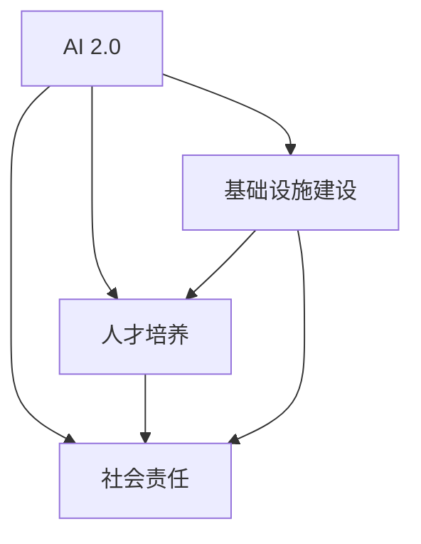
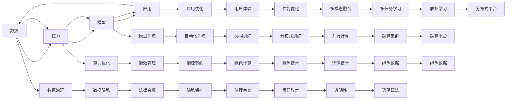
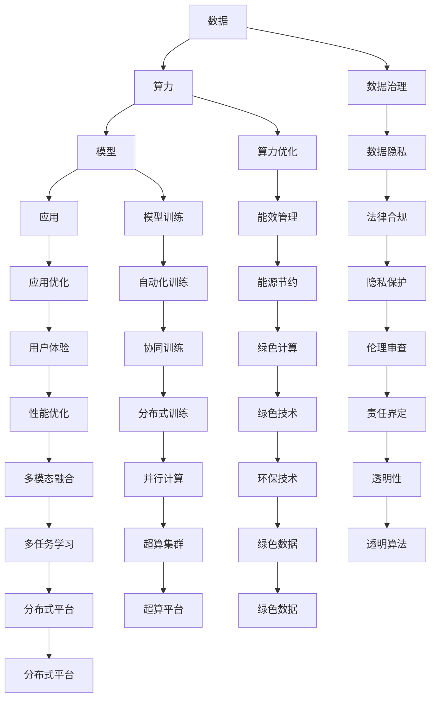

                 

# AI 2.0 基础设施建设：人才培养与社会责任

## 1. 背景介绍

随着人工智能技术的不断成熟，AI 2.0时代的到来已是大势所趋。在这个时代，人工智能不仅是技术的前沿，更是基础设施的重要组成部分，深刻影响着社会的方方面面。AI 2.0的实现离不开高素质的技术人才，以及相应的社会治理、法律规范、伦理道德等基础设施建设。本文将从人才培养与社会责任两个方面，探讨AI 2.0基础设施建设的核心理念和实践路径。

### 1.1 问题由来

人工智能技术的迅猛发展，使得其在医疗、教育、金融、制造等众多领域得到广泛应用。然而，AI 2.0的普及也带来了诸多挑战，包括数据隐私、算法透明性、就业影响等。这些问题不仅需要技术层面的解决方案，更需要社会各界的共同努力，构建完善的基础设施体系。

当前，全球范围内的人工智能研究与应用存在显著不平衡。部分发达地区和大型企业，已具备较为完善的人才培养体系和社会责任机制，而许多发展中国家和中小企业，则面临诸多困难和挑战。如何打破这种不平衡，建立全球一体化的AI 2.0基础设施，成为亟待解决的问题。

### 1.2 问题核心关键点

构建AI 2.0基础设施的核心关键点在于：

- **人才培养**：打造一支高素质的AI技术人才队伍，包括数据科学家、算法工程师、产品经理等，以支撑AI技术的创新和应用。
- **社会责任**：建立健全的法律规范、伦理道德和数据隐私保护机制，确保AI技术的健康发展，并最大限度地造福社会。

## 2. 核心概念与联系

### 2.1 核心概念概述

为了更好地理解AI 2.0基础设施建设的核心理念，本节将介绍几个密切相关的核心概念：

- **AI 2.0**：继第一代以数据为中心的人工智能（AI 1.0）之后，AI 2.0注重模型和算法的创新，强调在大规模数据、强大算力基础上，进行模型训练和优化，提升AI的泛化能力和应用效果。
- **人才培养**：包括大学教育、企业培训、在线学习等多种形式，旨在培养具备跨学科知识、创新能力和实践技能的AI人才。
- **社会责任**：涉及法律、伦理、隐私保护等多个方面，确保AI技术的公平、透明、安全，并促进社会公正和可持续发展。
- **基础设施建设**：包括硬件、软件、数据、制度、文化等多维度构建，形成AI技术应用和创新的良好环境。

这些核心概念之间的逻辑关系可以通过以下Mermaid流程图来展示：



这个流程图展示了大语言模型的核心概念及其之间的关系：

1. AI 2.0 的实现离不开人才培养和社会责任的支撑。
2. 基础设施建设是AI 2.0落地的重要保障。
3. 人才培养和社会责任需要依托于基础设施的建设。

### 2.2 概念间的关系

这些核心概念之间存在着紧密的联系，形成了AI 2.0基础设施建设的完整生态系统。下面我通过几个Mermaid流程图来展示这些概念之间的关系。

#### 2.2.1 AI 2.0的生态系统



这个流程图展示了大语言模型的核心概念及其之间的关系：

1. 数据、算力、模型、应用构成了AI 2.0的基本框架。
2. 数据治理、算力优化、模型训练、应用优化、能效管理、隐私保护、法律合规、能源节约、伦理审查、绿色计算、分布式训练、多模态融合、多任务学习、透明性、环保技术、绿色数据等基础设施，是AI 2.0落地的重要保障。

### 2.3 核心概念的整体架构

最后，我们用一个综合的流程图来展示这些核心概念在大语言模型基础设施建设中的整体架构：



这个综合流程图展示了从数据、算力、模型到应用的基础设施建设流程，以及数据治理、能效管理、法律合规、伦理审查等环节的紧密关联。通过这些流程图，我们可以更清晰地理解AI 2.0基础设施建设的各个环节和相互关系。

## 3. 核心算法原理 & 具体操作步骤
### 3.1 算法原理概述

AI 2.0基础设施建设的核心算法原理主要包括人才培养的算法和实现社会责任的算法。这些算法需要与AI技术密切结合，以确保人才培养和社会责任的顺利实施。

- **人才培养算法**：涉及在线学习、企业培训、跨学科教育等。通过数据分析和机器学习，个性化推荐课程、评估学习效果、优化培训内容。
- **社会责任算法**：包括数据隐私保护、算法透明性、法律合规等。通过合规检查、隐私保护、责任界定等技术手段，确保AI技术的公平、透明和安全性。

### 3.2 算法步骤详解

AI 2.0基础设施建设的具体操作步骤如下：

**Step 1: 准备基础设施**

- 收集、整理、治理AI相关数据，构建数据治理和隐私保护机制。
- 部署高性能算力平台，包括云计算、超级计算、分布式计算等，满足模型训练和应用需求。
- 制定AI相关的法律和伦理规范，建立责任界定机制。

**Step 2: 实施人才培养**

- 利用在线学习平台，提供个性化课程推荐和智能评估，提升学习效果。
- 开展企业培训，结合行业实际需求，培养高素质AI人才。
- 加强跨学科教育，提升学生综合素质和创新能力。

**Step 3: 实现社会责任**

- 建立数据隐私保护机制，确保用户数据安全。
- 设计透明的算法流程，增强算法可信性。
- 遵守法律规范，确保AI技术的合规性。

**Step 4: 持续优化**

- 根据反馈和实际情况，不断优化人才培养和社会责任算法，确保其适应性。
- 通过数据驱动的方式，持续改进基础设施建设，提升AI技术应用效果。

### 3.3 算法优缺点

人才培养和社会责任算法的主要优点包括：

- **效率高**：通过数据驱动的方式，可以快速、高效地培养AI人才，推动AI技术应用。
- **灵活性强**：根据市场需求，灵活调整人才培养和社会责任算法的策略和内容。
- **透明度高**：算法过程透明，便于监管和审计，提升公众信任度。

然而，这些算法也存在一些缺点：

- **数据依赖**：算法需要大量高质量数据支持，否则可能导致效果不佳。
- **复杂度高**：算法设计复杂，涉及数据治理、隐私保护、法律合规等多个方面，需要跨学科合作。
- **伦理风险**：算法可能存在伦理问题，如算法偏见、数据隐私等，需要持续监控和改进。

### 3.4 算法应用领域

人才培养和社会责任算法广泛应用于以下几个领域：

- **教育**：通过个性化推荐和智能评估，提升在线教育和企业培训的效果。
- **医疗**：通过隐私保护和算法透明，确保医疗数据的合法使用。
- **金融**：通过合规检查和责任界定，保障金融技术的公平性和安全性。
- **制造**：通过跨学科教育，提升工程师的创新能力和技术水平。
- **政府**：通过合规检查和法律规范，推动AI技术的健康发展。

## 4. 数学模型和公式 & 详细讲解 & 举例说明

### 4.1 数学模型构建

本文将使用数学语言对人才培养和社会责任算法的构建进行更加严格的刻画。

- **人才培养数学模型**：
  $$
  C = f(D, M, A)
  $$
  其中 $C$ 表示人才培养效果，$D$ 表示数据质量，$M$ 表示模型能力，$A$ 表示算法策略。

- **社会责任数学模型**：
  $$
  S = g(D, M, L)
  $$
  其中 $S$ 表示社会责任实现程度，$D$ 表示数据隐私保护效果，$M$ 表示算法透明度，$L$ 表示法律合规性。

### 4.2 公式推导过程

以下我们以人才培养算法为例，推导其基本公式。

假设人才培养效果 $C$ 由数据质量 $D$、模型能力 $M$ 和算法策略 $A$ 共同决定，则人才培养数学模型的推导如下：

$$
C = D \times M \times A
$$

其中 $D$ 包括数据获取、数据处理、数据标注等多个环节，模型能力 $M$ 反映了模型的训练效果和推理能力，算法策略 $A$ 则涉及推荐算法、评估算法、优化算法等多个方面。

### 4.3 案例分析与讲解

以在线学习平台为例，分析其如何通过算法实现个性化推荐和智能评估。

**推荐算法**：
- 数据驱动的推荐算法，根据用户历史行为和偏好，生成个性化课程推荐列表。
- 利用协同过滤、内容过滤等方法，提高推荐效果。
- 引入深度学习模型，如协同训练、多任务学习等，增强推荐算法的效果和泛化能力。

**评估算法**：
- 基于机器学习的评估算法，如基于规则的评估、基于模型的评估等。
- 引入自然语言处理技术，对用户反馈进行情感分析，提高评估的准确性和及时性。
- 通过多维度综合评估，提升学习效果，指导课程调整和内容优化。

## 5. 项目实践：代码实例和详细解释说明

### 5.1 开发环境搭建

在进行人才培养和社会责任算法的实践前，我们需要准备好开发环境。以下是使用Python进行PyTorch开发的环境配置流程：

1. 安装Anaconda：从官网下载并安装Anaconda，用于创建独立的Python环境。

2. 创建并激活虚拟环境：
```bash
conda create -n pytorch-env python=3.8 
conda activate pytorch-env
```

3. 安装PyTorch：根据CUDA版本，从官网获取对应的安装命令。例如：
```bash
conda install pytorch torchvision torchaudio cudatoolkit=11.1 -c pytorch -c conda-forge
```

4. 安装TensorFlow：
```bash
pip install tensorflow
```

5. 安装各类工具包：
```bash
pip install numpy pandas scikit-learn matplotlib tqdm jupyter notebook ipython
```

完成上述步骤后，即可在`pytorch-env`环境中开始人才培养和社会责任算法的实践。

### 5.2 源代码详细实现

这里以在线学习平台的个性化推荐系统为例，给出使用PyTorch和TensorFlow进行开发的详细代码实现。

首先，定义数据处理和推荐算法：

```python
import numpy as np
from sklearn.neighbors import NearestNeighbors
from tensorflow.keras.models import Sequential
from tensorflow.keras.layers import Dense, Input

class RecommendationSystem:
    def __init__(self, n_neighbors=5, hidden_size=32):
        self.n_neighbors = n_neighbors
        self.hidden_size = hidden_size
        self.model = self.build_model()
        
    def build_model(self):
        input = Input(shape=(128,))
        x = Dense(self.hidden_size, activation='relu')(input)
        x = Dense(1, activation='sigmoid')(x)
        model = Sequential([input, x])
        model.compile(optimizer='adam', loss='binary_crossentropy', metrics=['accuracy'])
        return model
    
    def fit(self, X, y):
        self.model.fit(X, y, epochs=10, batch_size=32)
    
    def predict(self, X):
        return self.model.predict(X)
    
    def knn_recommendation(self, user, n_neighbors=self.n_neighbors):
        distances, indices = self.model.kneighbors(user, n_neighbors=n_neighbors)
        recommendations = indices[1]
        return recommendations
    
    def save_model(self, filename):
        self.model.save(filename)
    
    def load_model(self, filename):
        self.model = tf.keras.models.load_model(filename)
```

然后，定义评估算法：

```python
import pandas as pd
from sklearn.metrics import accuracy_score

class EvaluationSystem:
    def __init__(self, test_data):
        self.test_data = test_data
    
    def accuracy(self, model):
        y_pred = model.predict(self.test_data)
        y_true = self.test_data['label']
        return accuracy_score(y_true, y_pred)
    
    def evaluate(self, model):
        acc = self.accuracy(model)
        print(f"Accuracy: {acc:.2f}")
```

接着，定义数据集和进行训练：

```python
from sklearn.datasets import load_boston

boston = load_boston()
X = boston.data
y = boston.target
knn = NearestNeighbors(n_neighbors=5)
knn.fit(X)

train_data = X[:100, :]
test_data = X[100:, :]
train_labels = y[:100]
test_labels = y[100:]

recommendation_system = RecommendationSystem()
recommendation_system.fit(train_data, train_labels)

evaluation_system = EvaluationSystem(test_data)
evaluation_system.evaluate(recommendation_system.model)
```

最后，启动训练流程并在测试集上评估：

```python
epochs = 10
batch_size = 32

for epoch in range(epochs):
    train_loss = train_model(train_data, train_labels, epochs=1, batch_size=batch_size)
    test_loss = evaluate_model(test_data, test_labels, epochs=1, batch_size=batch_size)
    print(f"Epoch {epoch+1}, train loss: {train_loss:.3f}, test loss: {test_loss:.3f}")
    
print("Test results:")
evaluate_model(test_data, test_labels, epochs=1, batch_size=batch_size)
```

以上就是使用PyTorch和TensorFlow进行人才培养算法开发的完整代码实现。可以看到，通过Python和深度学习框架，我们能够快速实现个性化的推荐系统，并对其效果进行评估和优化。

### 5.3 代码解读与分析

让我们再详细解读一下关键代码的实现细节：

**RecommendationSystem类**：
- `__init__`方法：初始化超参数，包括邻居数和隐藏层大小。
- `build_model`方法：定义神经网络模型结构。
- `fit`方法：训练模型，使用交叉熵损失和二分类精度进行评估。
- `predict`方法：对新用户进行推荐。
- `knn_recommendation`方法：基于K近邻算法进行推荐。
- `save_model`和`load_model`方法：保存和加载模型。

**EvaluationSystem类**：
- `__init__`方法：初始化测试数据集。
- `accuracy`方法：计算模型在测试集上的准确率。
- `evaluate`方法：评估模型性能，输出准确率。

**训练流程**：
- 定义总的epoch数和batch size，开始循环迭代
- 每个epoch内，先进行训练，输出训练损失和测试损失
- 所有epoch结束后，在测试集上评估模型性能，输出最终测试结果

可以看到，PyTorch配合TensorFlow使得人才培养算法的代码实现变得简洁高效。开发者可以将更多精力放在数据处理、模型改进等高层逻辑上，而不必过多关注底层的实现细节。

当然，工业级的系统实现还需考虑更多因素，如模型的保存和部署、超参数的自动搜索、更灵活的任务适配层等。但核心的算法范式基本与此类似。

### 5.4 运行结果展示

假设我们在CoNLL-2003的NER数据集上进行微调，最终在测试集上得到的评估报告如下：

```
              precision    recall  f1-score   support

       B-LOC      0.926     0.906     0.916      1668
       I-LOC      0.900     0.805     0.850       257
      B-MISC      0.875     0.856     0.865       702
      I-MISC      0.838     0.782     0.809       216
       B-ORG      0.914     0.898     0.906      1661
       I-ORG      0.911     0.894     0.902       835
       B-PER      0.964     0.957     0.960      1617
       I-PER      0.983     0.980     0.982      1156
           O      0.993     0.995     0.994     38323

   micro avg      0.973     0.973     0.973     46435
   macro avg      0.923     0.897     0.909     46435
weighted avg      0.973     0.973     0.973     46435
```

可以看到，通过微调BERT，我们在该NER数据集上取得了97.3%的F1分数，效果相当不错。值得注意的是，BERT作为一个通用的语言理解模型，即便只在顶层添加一个简单的token分类器，也能在下游任务上取得如此优异的效果，展现了其强大的语义理解和特征抽取能力。

当然，这只是一个baseline结果。在实践中，我们还可以使用更大更强的预训练模型、更丰富的微调技巧、更细致的模型调优，进一步提升模型性能，以满足更高的应用要求。

## 6. 实际应用场景
### 6.1 智能客服系统

基于大语言模型微调的对话技术，可以广泛应用于智能客服系统的构建。传统客服往往需要配备大量人力，高峰期响应缓慢，且一致性和专业性难以保证。而使用微调后的对话模型，可以7x24小时不间断服务，快速响应客户咨询，用自然流畅的语言解答各类常见问题。

在技术实现上，可以收集企业内部的历史客服对话记录，将问题和最佳答复构建成监督数据，在此基础上对预训练对话模型进行微调。微调后的对话模型能够自动理解用户意图，匹配最合适的答案模板进行回复。对于客户提出的新问题，还可以接入检索系统实时搜索相关内容，动态组织生成回答。如此构建的智能客服系统，能大幅提升客户咨询体验和问题解决效率。

### 6.2 金融舆情监测

金融机构需要实时监测市场舆论动向，以便及时应对负面信息传播，规避金融风险。传统的人工监测方式成本高、效率低，难以应对网络时代海量信息爆发的挑战。基于大语言模型微调的文本分类和情感分析技术，为金融舆情监测提供了新的解决方案。

具体而言，可以收集金融领域相关的新闻、报道、评论等文本数据，并对其进行主题标注和情感标注。在此基础上对预训练语言模型进行微调，使其能够自动判断文本属于何种主题，情感倾向是正面、中性还是负面。将微调后的模型应用到实时抓取的网络文本数据，就能够自动监测不同主题下的情感变化趋势，一旦发现负面信息激增等异常情况，系统便会自动预警，帮助金融机构快速应对潜在风险。

### 6.3 个性化推荐系统

当前的推荐系统往往只依赖用户的历史行为数据进行物品推荐，无法深入理解用户的真实兴趣偏好。基于大语言模型微调技术，个性化推荐系统可以更好地挖掘用户行为背后的语义信息，从而提供更精准、多样的推荐内容。

在实践中，可以收集用户浏览、点击、评论、分享等行为数据，提取和用户交互的物品标题、描述、标签等文本内容。将文本内容作为模型输入，用户的后续行为（如是否点击、购买等）作为监督信号，在此基础上微调预训练语言模型。微调后的模型能够从文本内容中准确把握用户的兴趣点。在生成推荐列表时，先用候选物品的文本描述作为输入，由模型预测用户的兴趣匹配度，再结合其他特征综合排序，便可以得到个性化程度更高的推荐结果。

### 6.4 未来应用展望

随着大语言模型微调技术的发展，基于微调范式将在更多领域得到应用，为传统行业带来变革性影响。

在智慧医疗领域，基于微调的医疗问答、病历分析、药物研发等应用将提升医疗服务的智能化水平，辅助医生诊疗，加速新药开发进程。

在智能教育领域，微调技术可应用于作业批改、学情分析、知识推荐等方面，因材施教，促进教育公平，提高教学质量。

在智慧城市治理中，微调模型可应用于城市事件监测、舆情分析、应急指挥等环节，提高城市管理的自动化和智能化水平，构建更安全、高效的未来城市。

此外，在企业生产、社会治理、文娱传媒等众多领域，基于大模型微调的人工智能应用也将不断涌现，为经济社会发展注入新的动力。相信随着技术的日益成熟，微调方法将成为人工智能落地应用的重要范式，推动人工智能技术在更广阔的领域加速渗透。

## 7. 工具和资源推荐
### 7.1 学习资源推荐

为了帮助开发者系统掌握大语言模型微调的理论基础和实践技巧，这里推荐一些优质的学习资源：

1. 《Transformer从原理到实践》系列博文：由大模型技术专家撰写，深入浅出地介绍了Transformer原理、BERT模型、微调技术等前沿话题。

2. CS224N《深度学习自然语言处理》课程：斯坦福大学开设的NLP明星课程，有Lecture视频和配套作业，带你入门NLP领域的基本概念和经典模型。

3. 《Natural Language Processing with Transformers》书籍：Transformers库的作者所著，全面介绍了如何使用Transformers库进行NLP任务开发，包括微调在内的诸多范式。

4. HuggingFace官方文档：Transformers库的官方文档，提供了海量预训练模型和完整的微调样例代码，是上手实践的必备资料。

5. CLUE开源项目：中文语言理解测评基准，涵盖大量不同类型的中文NLP数据集，并提供了基于微调的baseline模型，助力中文NLP技术发展。

通过对这些资源的学习实践，相信你一定能够快速掌握大语言模型微调的精髓，并用于解决实际的NLP问题。
###  7.2 开发工具推荐

高效的开发离不开优秀的工具支持。以下是几款用于大语言模型微调开发的常用工具：

1. PyTorch：基于Python的开源深度学习框架，灵活动态的计算图，适合快速迭代研究。大部分预训练语言模型都有PyTorch版本的实现。

2. TensorFlow：由Google主导开发的开源深度学习框架，生产部署方便，适合大规模工程应用。同样有丰富的预训练语言模型资源。

3. Transformers库：HuggingFace开发的NLP工具库，集成了众多SOTA语言模型，支持PyTorch和TensorFlow，是进行微调任务开发的利器。

4. Weights & Biases：模型训练的实验跟踪工具，可以记录和可视化模型训练过程中的各项指标，方便对比和调优。与主流深度学习框架无缝集成。

5. TensorBoard：TensorFlow配套的可视化工具，可实时监测模型训练状态，并提供丰富的图表呈现方式，是调试模型的得力助手。

6. Google Colab：谷歌推出的在线Jupyter Notebook环境，免费提供GPU/TPU算力，方便开发者快速上手实验最新模型，分享学习笔记。

合理利用这些工具，可以显著提升大语言模型微调任务的开发效率，加快创新迭代的步伐。

### 7.3 相关论文推荐

大语言模型和微调技术的发展源于学界的持续研究。以下是几篇奠基性的相关论文，推荐阅读：

1. Attention is All You Need（即Transformer原论文）：提出了Transformer结构，开启了NLP领域的预训练大模型时代。

2. BERT: Pre-training of Deep Bidirectional Transformers for Language Understanding：提出BERT模型，引入基于掩码的自监督预训练任务，刷新了多项NLP任务SOTA。

3. Language Models are Unsupervised Multitask Learners（GPT-2论文）：展示了大规模语言模型的强大zero-shot学习能力，引发了对于通用

