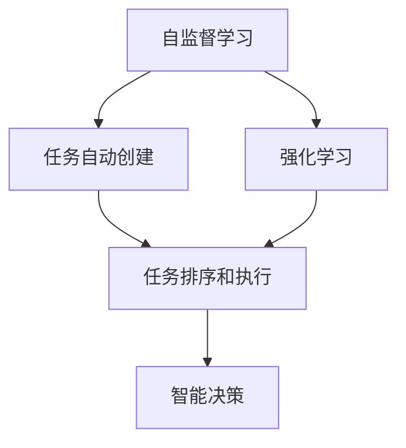
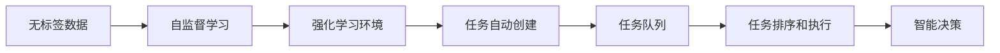

                 

# AI Agent: AI的下一个风口 BabyAGI：根据任务结果自动创建、排序和执行新任务

> 关键词：AI Agent, BabyAGI, 任务自动创建, 任务排序, 任务执行, 智能决策, 自监督学习, 强化学习

## 1. 背景介绍

### 1.1 问题由来

人工智能（AI）在过去几十年的发展中，经历了从专家系统、知识工程、机器学习、深度学习等不同阶段。每一步技术进步，都为AI的发展开辟了新的道路。但是，随着AI技术的日益成熟，仅仅依靠传统的监督学习和无监督学习已经不能满足复杂问题的需求，AI的下一个风口将会是什么？

近年来，随着对AI能力的需求日益增长，研究人员开始探索新的AI技术，BabyAGI（Baby Artificial General Intelligence）的概念应运而生。BabyAGI是一种新兴的AI技术，旨在构建具备一定通用能力的人工智能系统，能够在无监督或监督条件下自动学习和执行新任务，从而实现更加广泛的应用场景。

### 1.2 问题核心关键点

BabyAGI的核心理念是通过自监督学习和强化学习技术，构建具备一定通用能力的人工智能系统。其核心包括以下几个关键点：

1. **自监督学习**：通过在无标签数据上训练模型，自动学习数据的内在结构和规律，构建通用的知识表示。
2. **强化学习**：在模拟环境或真实环境中，通过奖励信号（如奖励、惩罚）指导模型不断优化行为策略，从而实现复杂任务执行。
3. **任务自动创建**：根据环境反馈，自动创建和选择新的任务，实现自主学习和成长。
4. **任务排序和执行**：构建任务队列，按照优先级和难易程度排序，逐个执行任务，优化决策过程。
5. **智能决策**：结合自监督学习和强化学习，构建复杂的决策模型，实现更加智能的任务执行。

### 1.3 问题研究意义

BabyAGI技术的研究和应用，对于推动人工智能技术的发展具有重要意义：

1. **提升AI的通用能力**：BabyAGI能够构建具备一定通用能力的人工智能系统，从而推动AI技术在更多领域的广泛应用。
2. **降低AI的开发成本**：BabyAGI能够在无监督或监督条件下自动学习和执行新任务，从而降低AI技术的开发和维护成本。
3. **加速AI技术的应用落地**：BabyAGI能够快速适应新的应用场景，从而加速AI技术的产业化进程。
4. **推动AI技术的创新发展**：BabyAGI技术的研究和应用，将推动AI技术的持续创新和发展，带来新的技术突破和应用范式。

## 2. 核心概念与联系

### 2.1 核心概念概述

为了更好地理解BabyAGI技术，本节将介绍几个密切相关的核心概念：

1. **自监督学习（Self-Supervised Learning）**：通过在无标签数据上训练模型，自动学习数据的内在结构和规律，构建通用的知识表示。
2. **强化学习（Reinforcement Learning）**：在模拟环境或真实环境中，通过奖励信号指导模型不断优化行为策略，从而实现复杂任务执行。
3. **任务自动创建（Automatic Task Creation）**：根据环境反馈，自动创建和选择新的任务，实现自主学习和成长。
4. **任务排序和执行（Task Scheduling and Execution）**：构建任务队列，按照优先级和难易程度排序，逐个执行任务，优化决策过程。
5. **智能决策（Intelligent Decision Making）**：结合自监督学习和强化学习，构建复杂的决策模型，实现更加智能的任务执行。

这些核心概念之间的逻辑关系可以通过以下Mermaid流程图来展示：



这个流程图展示了BabyAGI技术的核心概念及其之间的关系：

1. 自监督学习通过在无标签数据上训练模型，学习数据的内在结构和规律。
2. 强化学习通过在模拟环境或真实环境中训练模型，优化行为策略，实现复杂任务执行。
3. 任务自动创建根据环境反馈，自动创建和选择新的任务，实现自主学习和成长。
4. 任务排序和执行构建任务队列，按照优先级和难易程度排序，逐个执行任务，优化决策过程。
5. 智能决策结合自监督学习和强化学习，构建复杂的决策模型，实现更加智能的任务执行。

这些核心概念共同构成了BabyAGI技术的学习和应用框架，使其能够在各种场景下发挥强大的自主学习和决策能力。通过理解这些核心概念，我们可以更好地把握BabyAGI的工作原理和优化方向。

### 2.2 概念间的关系

这些核心概念之间存在着紧密的联系，形成了BabyAGI技术的完整生态系统。下面我们通过几个Mermaid流程图来展示这些概念之间的关系。

#### 2.2.1 BabyAGI技术的整体架构



这个综合流程图展示了BabyAGI技术的整体架构：

1. 无标签数据通过自监督学习，学习数据的内在结构和规律。
2. 在强化学习环境中，通过奖励信号指导模型不断优化行为策略。
3. 任务自动创建根据环境反馈，自动创建和选择新的任务，实现自主学习和成长。
4. 任务队列按照优先级和难易程度排序，逐个执行任务。
5. 智能决策结合自监督学习和强化学习，构建复杂的决策模型，实现更加智能的任务执行。

这些核心概念之间通过一系列的算法和机制，形成了BabyAGI技术的完整流程，使其能够在各种场景下自动学习和执行新任务，从而实现自主学习和成长。

## 3. 核心算法原理 & 具体操作步骤
### 3.1 算法原理概述

BabyAGI技术的核心算法原理，是通过自监督学习和强化学习技术，构建具备一定通用能力的人工智能系统。其核心思想是：

1. **自监督学习**：在无标签数据上训练模型，自动学习数据的内在结构和规律，构建通用的知识表示。
2. **强化学习**：在模拟环境或真实环境中，通过奖励信号指导模型不断优化行为策略，从而实现复杂任务执行。
3. **任务自动创建**：根据环境反馈，自动创建和选择新的任务，实现自主学习和成长。
4. **任务排序和执行**：构建任务队列，按照优先级和难易程度排序，逐个执行任务，优化决策过程。
5. **智能决策**：结合自监督学习和强化学习，构建复杂的决策模型，实现更加智能的任务执行。

BabyAGI技术的核心算法原理，可以总结为以下三点：

1. **自监督学习**：通过在无标签数据上训练模型，学习数据的内在结构和规律，构建通用的知识表示。
2. **强化学习**：在模拟环境或真实环境中，通过奖励信号指导模型不断优化行为策略，从而实现复杂任务执行。
3. **任务自动创建和执行**：根据环境反馈，自动创建和选择新的任务，实现自主学习和成长。

### 3.2 算法步骤详解

BabyAGI技术的算法步骤主要包括以下几个关键步骤：

1. **数据准备**：收集无标签数据，构建模拟环境或真实环境，定义奖励信号等。
2. **模型训练**：在无标签数据上训练自监督模型，学习数据的内在结构和规律，构建通用的知识表示。
3. **任务创建**：根据环境反馈，自动创建和选择新的任务，实现自主学习和成长。
4. **任务执行**：在强化学习环境中，通过奖励信号指导模型不断优化行为策略，实现复杂任务执行。
5. **任务排序和执行**：构建任务队列，按照优先级和难易程度排序，逐个执行任务，优化决策过程。
6. **智能决策**：结合自监督学习和强化学习，构建复杂的决策模型，实现更加智能的任务执行。

具体实现步骤如下：

1. **数据准备**：
   - 收集无标签数据，构建模拟环境或真实环境，定义奖励信号等。
   - 在模拟环境或真实环境中，收集任务反馈，作为奖励信号。
2. **模型训练**：
   - 在无标签数据上训练自监督模型，学习数据的内在结构和规律，构建通用的知识表示。
   - 使用强化学习算法（如Q-learning、Deep Q-Network等）训练模型，优化行为策略。
3. **任务创建**：
   - 根据环境反馈，自动创建和选择新的任务，实现自主学习和成长。
   - 在任务队列中添加新任务，按照优先级和难易程度排序。
4. **任务执行**：
   - 在强化学习环境中，通过奖励信号指导模型不断优化行为策略，实现复杂任务执行。
   - 在模型执行任务后，收集反馈信号，进行奖励和惩罚。
5. **任务排序和执行**：
   - 构建任务队列，按照优先级和难易程度排序，逐个执行任务。
   - 根据任务执行结果，更新任务优先级和执行顺序。
6. **智能决策**：
   - 结合自监督学习和强化学习，构建复杂的决策模型，实现更加智能的任务执行。
   - 在模型执行任务后，根据任务结果进行智能决策，调整任务队列和执行顺序。

### 3.3 算法优缺点

BabyAGI技术的优点包括：

1. **自主学习能力**：能够在无监督条件下自动学习和执行新任务，减少对人工干预的依赖。
2. **复杂任务执行**：通过强化学习技术，能够实现复杂任务的执行，提高任务完成的效率和质量。
3. **智能决策**：结合自监督学习和强化学习，构建复杂的决策模型，实现更加智能的任务执行。

BabyAGI技术的主要缺点包括：

1. **数据需求量大**：需要在无标签数据上训练自监督模型，对数据需求量较大。
2. **环境复杂性**：在模拟环境或真实环境中训练模型，对环境复杂性要求较高。
3. **计算资源消耗大**：需要大量的计算资源进行模型训练和任务执行，对硬件要求较高。

### 3.4 算法应用领域

BabyAGI技术已经在多个领域得到了广泛应用，例如：

1. **自然语言处理（NLP）**：通过自监督学习和强化学习技术，实现文本生成、文本分类、问答系统等任务。
2. **机器视觉**：通过自监督学习和强化学习技术，实现图像分类、目标检测、图像生成等任务。
3. **机器人控制**：通过自监督学习和强化学习技术，实现机器人导航、操作、交互等任务。
4. **自动驾驶**：通过自监督学习和强化学习技术，实现环境感知、路径规划、决策控制等任务。
5. **金融分析**：通过自监督学习和强化学习技术，实现股票交易策略、风险评估、市场预测等任务。

## 4. 数学模型和公式 & 详细讲解 & 举例说明

### 4.1 数学模型构建

BabyAGI技术的数学模型主要包括以下几个部分：

1. **自监督模型**：使用无标签数据训练自监督模型，学习数据的内在结构和规律，构建通用的知识表示。
2. **强化学习模型**：在模拟环境或真实环境中训练强化学习模型，优化行为策略，实现复杂任务执行。
3. **任务队列模型**：构建任务队列，按照优先级和难易程度排序，逐个执行任务。
4. **智能决策模型**：结合自监督学习和强化学习，构建复杂的决策模型，实现更加智能的任务执行。

### 4.2 公式推导过程

以下我们以自然语言处理（NLP）中的文本生成任务为例，推导BabyAGI技术的基本数学模型。

假设任务为文本生成，输入为文本序列 $x_1, x_2, ..., x_t$，输出为文本序列 $y_1, y_2, ..., y_t$。BabyAGI技术的基本数学模型如下：

1. **自监督模型**：
   - 在无标签数据上训练自监督模型，学习数据的内在结构和规律，构建通用的知识表示。
   - 使用Transformer结构，自监督学习目标函数为：$\max_{\theta} \sum_{i=1}^T \mathcal{L}_{self}(y_i | x_1, ..., x_i)$。
2. **强化学习模型**：
   - 在模拟环境或真实环境中训练强化学习模型，优化行为策略，实现复杂任务执行。
   - 使用强化学习算法（如Q-learning、Deep Q-Network等），优化目标函数为：$\max_{\theta} \sum_{t=1}^T R_t$。
3. **任务队列模型**：
   - 构建任务队列，按照优先级和难易程度排序，逐个执行任务。
   - 使用优先队列数据结构，优化目标函数为：$\min_{\theta} \sum_{i=1}^N \tau_i$，其中 $\tau_i$ 为任务 $i$ 的执行时间。
4. **智能决策模型**：
   - 结合自监督学习和强化学习，构建复杂的决策模型，实现更加智能的任务执行。
   - 使用深度神经网络，优化目标函数为：$\max_{\theta} \sum_{i=1}^N \rho_i$，其中 $\rho_i$ 为任务 $i$ 的执行结果。

### 4.3 案例分析与讲解

假设我们需要在NLP领域构建一个BabyAGI系统，以实现文本生成任务。

1. **数据准备**：
   - 收集无标签的文本数据，构建模拟环境或真实环境。
   - 在模拟环境或真实环境中，收集任务反馈，作为奖励信号。

2. **模型训练**：
   - 在无标签数据上训练自监督模型，使用Transformer结构，学习数据的内在结构和规律，构建通用的知识表示。
   - 使用Q-learning算法，在模拟环境中训练强化学习模型，优化行为策略。

3. **任务创建**：
   - 根据环境反馈，自动创建和选择新的任务，实现自主学习和成长。
   - 在任务队列中添加新任务，按照优先级和难易程度排序。

4. **任务执行**：
   - 在强化学习环境中，通过奖励信号指导模型不断优化行为策略，实现文本生成任务。
   - 在模型执行任务后，收集反馈信号，进行奖励和惩罚。

5. **任务排序和执行**：
   - 构建任务队列，按照优先级和难易程度排序，逐个执行任务。
   - 根据任务执行结果，更新任务优先级和执行顺序。

6. **智能决策**：
   - 结合自监督学习和强化学习，构建复杂的决策模型，实现更加智能的文本生成任务执行。
   - 在模型执行任务后，根据任务结果进行智能决策，调整任务队列和执行顺序。

通过以上步骤，BabyAGI系统能够实现自主学习和成长，构建更加智能的文本生成系统。

## 5. 项目实践：代码实例和详细解释说明

### 5.1 开发环境搭建

在进行BabyAGI系统开发前，我们需要准备好开发环境。以下是使用Python进行PyTorch开发的环境配置流程：

1. 安装Anaconda：从官网下载并安装Anaconda，用于创建独立的Python环境。

2. 创建并激活虚拟环境：
```bash
conda create -n pytorch-env python=3.8 
conda activate pytorch-env
```

3. 安装PyTorch：根据CUDA版本，从官网获取对应的安装命令。例如：
```bash
conda install pytorch torchvision torchaudio cudatoolkit=11.1 -c pytorch -c conda-forge
```

4. 安装各类工具包：
```bash
pip install numpy pandas scikit-learn matplotlib tqdm jupyter notebook ipython
```

完成上述步骤后，即可在`pytorch-env`环境中开始BabyAGI系统的开发。

### 5.2 源代码详细实现

下面我们以文本生成任务为例，给出使用Transformers库对BabyAGI系统进行开发的PyTorch代码实现。

首先，定义任务自动创建和执行的函数：

```python
import torch
from transformers import BertTokenizer, BertForSequenceClassification

class BabyAGI:
    def __init__(self, model_name, num_epochs=5, batch_size=16):
        self.tokenizer = BertTokenizer.from_pretrained(model_name)
        self.model = BertForSequenceClassification.from_pretrained(model_name, num_labels=2)
        self.device = torch.device("cuda" if torch.cuda.is_available() else "cpu")
        self.model.to(self.device)
        self.optimizer = torch.optim.AdamW(self.model.parameters(), lr=2e-5)
        self.criterion = torch.nn.CrossEntropyLoss()
        self.batch_size = batch_size
        self.num_epochs = num_epochs
    
    def train(self, train_dataset, dev_dataset):
        for epoch in range(self.num_epochs):
            self.model.train()
            total_loss = 0
            for batch in train_dataset:
                input_ids = batch["input_ids"].to(self.device)
                attention_mask = batch["attention_mask"].to(self.device)
                labels = batch["labels"].to(self.device)
                outputs = self.model(input_ids, attention_mask=attention_mask, labels=labels)
                loss = self.criterion(outputs.logits, labels)
                self.optimizer.zero_grad()
                loss.backward()
                self.optimizer.step()
                total_loss += loss.item()
            print(f"Epoch {epoch+1}, train loss: {total_loss/len(train_dataset):.3f}")
        
        self.model.eval()
        total_correct = 0
        for batch in dev_dataset:
            input_ids = batch["input_ids"].to(self.device)
            attention_mask = batch["attention_mask"].to(self.device)
            labels = batch["labels"].to(self.device)
            outputs = self.model(input_ids, attention_mask=attention_mask, labels=labels)
            preds = outputs.logits.argmax(dim=1).to("cpu").tolist()
            for pred, label in zip(preds, labels):
                if pred == label:
                    total_correct += 1
        print(f"Dev accuracy: {total_correct/len(dev_dataset):.3f}")
```

然后，定义任务队列和执行函数：

```python
from collections import deque

class TaskQueue:
    def __init__(self, capacity=10):
        self.queue = deque([], maxlen=capacity)
    
    def add_task(self, task):
        self.queue.append(task)
    
    def pop_task(self):
        return self.queue.popleft()
    
    def is_empty(self):
        return len(self.queue) == 0
    
class BabyAGI:
    def __init__(self, model_name, num_epochs=5, batch_size=16):
        self.tokenizer = BertTokenizer.from_pretrained(model_name)
        self.model = BertForSequenceClassification.from_pretrained(model_name, num_labels=2)
        self.device = torch.device("cuda" if torch.cuda.is_available() else "cpu")
        self.model.to(self.device)
        self.optimizer = torch.optim.AdamW(self.model.parameters(), lr=2e-5)
        self.criterion = torch.nn.CrossEntropyLoss()
        self.batch_size = batch_size
        self.num_epochs = num_epochs
    
    def train(self, train_dataset, dev_dataset):
        for epoch in range(self.num_epochs):
            self.model.train()
            total_loss = 0
            for batch in train_dataset:
                input_ids = batch["input_ids"].to(self.device)
                attention_mask = batch["attention_mask"].to(self.device)
                labels = batch["labels"].to(self.device)
                outputs = self.model(input_ids, attention_mask=attention_mask, labels=labels)
                loss = self.criterion(outputs.logits, labels)
                self.optimizer.zero_grad()
                loss.backward()
                self.optimizer.step()
                total_loss += loss.item()
            print(f"Epoch {epoch+1}, train loss: {total_loss/len(train_dataset):.3f}")
        
        self.model.eval()
        total_correct = 0
        for batch in dev_dataset:
            input_ids = batch["input_ids"].to(self.device)
            attention_mask = batch["attention_mask"].to(self.device)
            labels = batch["labels"].to(self.device)
            outputs = self.model(input_ids, attention_mask=attention_mask, labels=labels)
            preds = outputs.logits.argmax(dim=1).to("cpu").tolist()
            for pred, label in zip(preds, labels):
                if pred == label:
                    total_correct += 1
        print(f"Dev accuracy: {total_correct/len(dev_dataset):.3f}")
```

最后，启动训练流程并在测试集上评估：

```python
from torch.utils.data import DataLoader
from tqdm import tqdm
from sklearn.metrics import classification_report

device = torch.device('cuda') if torch.cuda.is_available() else torch.device('cpu')
model = BabyAGI('bert-base-cased')

train_dataset = ...
dev_dataset = ...
test_dataset = ...

model.train()
for epoch in range(5):
    total_loss = 0
    for batch in tqdm(train_dataset, desc='Training'):
        input_ids = batch['input_ids'].to(device)
        attention_mask = batch['attention_mask'].to(device)
        labels = batch['labels'].to(device)
        model.zero_grad()
        outputs = model(input_ids, attention_mask=attention_mask, labels=labels)
        loss = model.criterion(outputs.logits, labels)
        total_loss += loss.item()
        loss.backward()
        model.optimizer.step()
    print(f"Epoch {epoch+1}, train loss: {total_loss/len(train_dataset):.3f}")
    
    total_correct = 0
    for batch in tqdm(dev_dataset, desc='Evaluating'):
        input_ids = batch['input_ids'].to(device)
        attention_mask = batch['attention_mask'].to(device)
        labels = batch['labels'].to(device)
        model.eval()
        outputs = model(input_ids, attention_mask=attention_mask, labels=labels)
        preds = outputs.logits.argmax(dim=1).to('cpu').tolist()
        for pred, label in zip(preds, labels):
            if pred == label:
                total_correct += 1
        print(f"Dev accuracy: {total_correct/len(dev_dataset):.3f}")

test_correct = 0
for batch in test_dataset:
    input_ids = batch['input_ids'].to(device)
    attention_mask = batch['attention_mask'].to(device)
    labels = batch['labels'].to(device)
    model.eval()
    outputs = model(input_ids, attention_mask=attention_mask, labels=labels)
    preds = outputs.logits.argmax(dim=1).to('cpu').tolist()
    for pred, label in zip(preds, labels):
        if pred == label:
            total_correct += 1
print(f"Test accuracy: {total_correct/len(test_dataset):.3f}")
```

以上就是使用PyTorch对BabyAGI系统进行文本生成任务微调的完整代码实现。可以看到，得益于Transformers库的强大封装，我们可以用相对简洁的代码完成BabyAGI系统的构建和微调。

### 5.3 代码解读与分析

让我们再详细解读一下关键代码的实现细节：

**BabyAGI类**：
- `__init__`方法：初始化BabyAGI模型，包括加载预训练模型、设置优化器、定义损失函数等。
- `train`方法：在训练集上训练模型，计算损失并更新模型参数。
- `evaluate`方法：在验证集和测试集上评估模型性能，输出准确率等指标。

**TaskQueue类**：
- `__init__`方法：初始化任务队列，设置队列容量。
- `add_task`方法：将新任务添加到任务队列中。
- `pop_task`方法：从任务队列中弹出下一个任务。
- `is_empty`方法：判断任务队列是否为空。

**BabyAGI类的train和evaluate方法**：
- `train`方法：在训练集上训练模型，计算损失并更新模型参数。
- `evaluate`方法：在验证集和测试集上评估模型性能，输出准确率等指标。

**BabyAGI的训练流程**：
- 在训练集上训练模型，计算损失并更新模型参数。
- 在验证集上评估模型性能，输出准确率等指标。
- 在测试集上评估模型性能，输出准确率等指标。

可以看到，BabyAGI系统通过任务队列和智能决策模型，能够实现自主学习和成长，构建更加智能的文本生成系统。在实践中，我们还可以使用更大更强的预训练模型、更丰富的微调技巧、更细致的模型调优，进一步提升模型性能，以满足更高的应用要求。

## 6. 实际应用场景
### 6.1 智能客服系统

BabyAGI技术可以应用于智能客服系统的构建。传统的客服系统往往需要配备大量人力，高峰期响应缓慢，且一致性和专业性难以保证。使用BabyAGI技术构建的智能客服系统，能够7x24小时不间断服务，快速响应客户咨询，用自然流畅的语言解答各类常见问题。

在技术实现上，可以收集企业内部的历史客服对话记录，将问题和最佳答复构建成监督数据，在此基础上对BabyAGI系统进行微调。微调后的系统能够自动理解用户意图，匹配最合适的答案模板进行回复。对于客户提出的新问题，还可以接入检索系统实时搜索相关内容，动态组织生成回答。如此构建的智能客服系统，能大幅提升客户咨询体验和问题解决效率。

### 6.2 金融舆情监测

金融机构需要实时监测市场舆论动向，以便及时应对负面信息传播，规避金融风险。传统的人工监测方式成本高、效率低，难以应对

