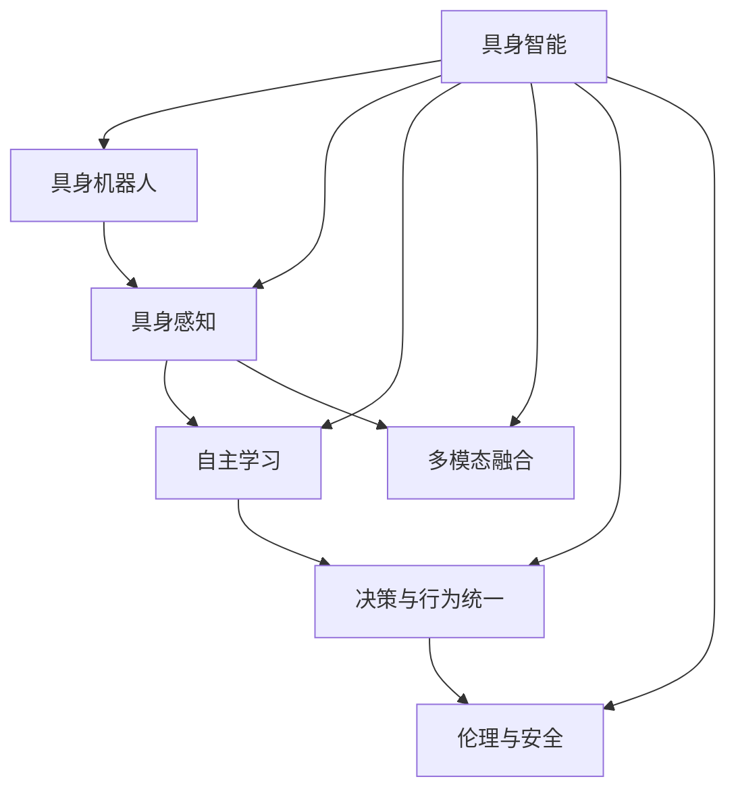
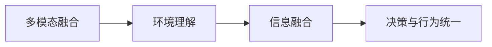

                 

# AI Agent: AI的下一个风口 具身智能研究的挑战与机遇

> 关键词：具身智能,人工智能,机器人学,智能控制,自主学习,多模态感知,认知科学

## 1. 背景介绍

### 1.1 问题由来
人工智能(AI)技术经历了数十年的发展，从最初的专家系统、机器学习到现在的深度学习和大规模语言模型，AI的应用范围不断拓展，影响力日益加深。然而，当前主流AI技术仍存在诸多局限：

1. **缺乏具身感知**：传统AI通常只关注数字符号的计算和处理，而忽略了物体、环境和身体动作等具身感知的信息。

2. **行为决策分离**：AI模型的决策过程往往与实际物理世界脱节，难以应对复杂多变的现实环境。

3. **缺乏自主学习能力**：现有AI模型通常依赖于人工输入的规则和监督信号，自主学习和适应能力不足。

4. **多模态信息融合困难**：AI模型在处理视觉、听觉、触觉等多种传感器数据时，难以有效融合和理解。

5. **伦理和安全问题**：AI模型在自主决策和交互时，可能产生偏见、错误，带来安全隐患和社会道德问题。

具身智能(Bodily Intelligence)的提出，正是为了解决上述问题，推动AI技术向更高级别迈进。具身智能强调通过物理机器人、虚拟现实、增强现实等多种技术手段，让AI系统具备具身感知、自主学习、多模态融合和伦理安全等能力，从而实现更加全面、智能、可靠的人机交互。

### 1.2 问题核心关键点
具身智能的核心思想在于将AI系统的决策和行为过程，与现实世界中的物理实体和环境紧密结合，使AI具备实际的物理操作能力，从而更好地适应和理解复杂多变的环境。其核心关键点包括：

1. **具身感知**：通过传感器获取环境信息，使AI系统具备对物理世界的直接感知能力。

2. **自主学习**：利用机器学习、强化学习等技术，使AI系统能够自主地从经验中学习，优化行为策略。

3. **多模态融合**：将视觉、听觉、触觉等多种感知信息进行融合，提升AI系统的环境理解能力。

4. **决策与行为统一**：将AI的认知过程与物理行为过程统一起来，使AI系统能够在复杂环境中进行有效决策和动作执行。

5. **伦理与安全**：在AI系统设计中引入伦理和安全性考量，确保其决策和行为符合人类价值观和社会规范。

## 2. 核心概念与联系

### 2.1 核心概念概述

为更好地理解具身智能，本节将介绍几个密切相关的核心概念：

- **具身智能(Bodily Intelligence)**：指将AI系统的决策和行为过程，与物理世界中的具身感知和交互紧密结合，使AI具备实际物理操作能力，从而更好地适应复杂多变的环境。

- **具身机器人(Embodied Robot)**：具身智能的物理载体，通常指由传感器、控制器和执行器构成的物理机器人，具有自主感知、决策和行为能力。

- **具身感知(Bodily Perception)**：通过传感器获取环境信息，使AI系统具备对物理世界的直接感知能力。

- **自主学习(Autonomous Learning)**：利用机器学习、强化学习等技术，使AI系统能够自主地从经验中学习，优化行为策略。

- **多模态融合(Multimodal Fusion)**：将视觉、听觉、触觉等多种感知信息进行融合，提升AI系统的环境理解能力。

- **决策与行为统一(Decision and Action Unification)**：将AI的认知过程与物理行为过程统一起来，使AI系统能够在复杂环境中进行有效决策和动作执行。

- **伦理与安全(Ethics and Security)**：在AI系统设计中引入伦理和安全性考量，确保其决策和行为符合人类价值观和社会规范。

这些核心概念之间的逻辑关系可以通过以下Mermaid流程图来展示：



这个流程图展示了一个具身智能系统的各个组成部分及其之间的相互关系：

1. 具身智能系统通过具身机器人作为载体，具备物理感知和操作能力。
2. 具身感知通过传感器获取环境信息，使AI系统具备直接感知能力。
3. 自主学习利用机器学习、强化学习等技术，使AI系统能够自主学习优化行为策略。
4. 多模态融合将多种感知信息进行融合，提升AI系统的环境理解能力。
5. 决策与行为统一将AI的认知过程与物理行为过程统一起来，使AI系统能够在复杂环境中进行有效决策和动作执行。
6. 伦理与安全在AI系统设计中引入伦理和安全性考量，确保其决策和行为符合人类价值观和社会规范。

### 2.2 概念间的关系

这些核心概念之间存在着紧密的联系，形成了具身智能系统的完整生态系统。下面我通过几个Mermaid流程图来展示这些概念之间的关系。

#### 2.2.1 具身智能的总体架构


这个流程图展示了具身智能系统的总体架构：

1. 具身感知获取环境信息，使AI系统具备直接感知能力。
2. 自主学习利用机器学习、强化学习等技术，使AI系统能够自主学习优化行为策略。
3. 多模态融合将多种感知信息进行融合，提升AI系统的环境理解能力。
4. 决策与行为统一将AI的认知过程与物理行为过程统一起来，使AI系统能够在复杂环境中进行有效决策和动作执行。
5. 伦理与安全在AI系统设计中引入伦理和安全性考量，确保其决策和行为符合人类价值观和社会规范。

#### 2.2.2 具身感知与自主学习的交互


这个流程图展示了具身感知与自主学习的交互过程：

1. 具身感知通过传感器获取环境信息，使AI系统具备直接感知能力。
2. 自主学习利用感知数据，通过机器学习、强化学习等技术，优化行为策略。
3. 行为策略优化生成新的决策和动作。
4. 决策与行为统一将AI的认知过程与物理行为过程统一起来，使AI系统能够在复杂环境中进行有效决策和动作执行。

#### 2.2.3 多模态融合与决策与行为统一的结合



这个流程图展示了多模态融合与决策与行为统一的结合过程：

1. 多模态融合将视觉、听觉、触觉等多种感知信息进行融合，生成环境理解结果。
2. 信息融合将环境理解结果与决策策略进行融合，生成决策依据。
3. 决策与行为统一将AI的认知过程与物理行为过程统一起来，使AI系统能够在复杂环境中进行有效决策和动作执行。

## 3. 核心算法原理 & 具体操作步骤
### 3.1 算法原理概述

具身智能的研究范式通常包括以下几个步骤：

1. **具身感知数据获取**：通过各种传感器（如摄像头、激光雷达、力传感器等）获取环境信息。
2. **多模态数据融合**：将获取的多模态数据进行融合，形成环境理解结果。
3. **行为决策生成**：基于环境理解结果，生成行为决策。
4. **行为执行与反馈**：执行行为决策，并通过反馈信息更新模型。
5. **模型优化与学习**：通过强化学习等方法，不断优化行为策略，提升系统性能。

### 3.2 算法步骤详解

具身智能的算法步骤详解如下：

**Step 1: 具身感知数据获取**
- 部署各种传感器，如摄像头、激光雷达、力传感器等，获取环境信息。
- 将传感器数据转换为数字信号，进行预处理和校准。

**Step 2: 多模态数据融合**
- 对传感器数据进行特征提取，生成环境理解结果。
- 使用特征提取器将不同模态的信息进行融合，形成多模态表示。
- 使用融合器将多模态表示进行整合，生成环境理解结果。

**Step 3: 行为决策生成**
- 基于环境理解结果，设计决策策略。
- 使用决策网络（如神经网络、决策树等）进行决策，生成行为策略。

**Step 4: 行为执行与反馈**
- 执行行为策略，生成具体的动作指令。
- 通过执行器执行动作，并采集反馈信息。
- 将反馈信息用于更新模型参数。

**Step 5: 模型优化与学习**
- 使用强化学习算法（如Q-learning、Deep Q-Networks等）对模型进行优化。
- 使用在线学习或离线学习技术，不断更新模型参数，提高决策性能。
- 引入奖励函数，对决策结果进行评价和优化。

### 3.3 算法优缺点

具身智能的算法具有以下优点：

1. **适应性强**：具身智能系统能够适应复杂多变的环境，处理各种不确定性因素。
2. **自主学习能力**：具身智能系统具备自主学习的能力，能够通过经验不断优化行为策略。
3. **多模态融合能力**：具身智能系统能够处理多种感知信息，提升环境理解能力。
4. **决策与行为统一**：具身智能系统能够将认知过程与行为过程统一起来，实现高效决策和执行。

同时，具身智能的算法也存在以下缺点：

1. **高成本**：具身智能系统通常需要高性能传感器和强大的计算能力，开发和维护成本较高。
2. **复杂性**：具身智能系统的设计和实现较为复杂，需要多学科知识交叉合作。
3. **环境适应性**：具身智能系统在面对全新环境时，需要较长的学习时间才能适应。
4. **伦理和安全问题**：具身智能系统的决策和行为可能涉及伦理和法律问题，需额外考虑。

### 3.4 算法应用领域

具身智能的研究与应用涵盖多个领域，具体如下：

1. **机器人学**：在工业、家庭、医疗等多个领域中，使用具身智能机器人进行复杂操作和任务处理。
2. **自动化**：在制造业、物流、农业等自动化领域，使用具身智能系统进行自主决策和执行。
3. **虚拟现实与增强现实**：在虚拟现实和增强现实应用中，使用具身智能系统进行交互和导航。
4. **智能交通**：在智能交通系统中，使用具身智能系统进行环境感知和路径规划。
5. **智能家居**：在智能家居系统中，使用具身智能系统进行环境感知和交互。
6. **智能城市**：在智能城市治理中，使用具身智能系统进行环境监测和应急响应。
7. **智能教育**：在智能教育系统中，使用具身智能系统进行交互和教学。

## 4. 数学模型和公式 & 详细讲解 & 举例说明
### 4.1 数学模型构建

具身智能的数学模型构建通常包括以下几个步骤：

1. **传感器数据建模**：将传感器数据表示为数学向量或矩阵。
2. **多模态数据融合模型**：设计多模态数据融合算法，将不同模态的数据进行整合。
3. **行为决策模型**：设计行为决策算法，将环境理解结果转换为行为策略。
4. **反馈控制模型**：设计反馈控制算法，将反馈信息用于更新模型参数。

### 4.2 公式推导过程

以下我将以一个简单的具身智能系统为例，推导其数学模型。

假设具身智能系统使用摄像头、激光雷达和力传感器获取环境信息，并将数据表示为矩阵形式。设摄像头数据为 $x_{cam}$，激光雷达数据为 $x_{lidar}$，力传感器数据为 $x_{force}$。则多模态数据融合的过程可以表示为：

$$
y = \alpha x_{cam} + \beta x_{lidar} + \gamma x_{force}
$$

其中 $\alpha, \beta, \gamma$ 为融合系数，表示不同传感器数据的重要性。使用线性回归模型进行多模态融合，融合系数可以通过最小化损失函数求解。

基于环境理解结果 $y$，设计行为决策网络 $f$，输出行为策略 $a$：

$$
a = f(y)
$$

在执行动作时，根据行为策略 $a$ 生成动作指令 $u$，并通过执行器执行动作。假设执行器的动作指令与环境状态 $s$ 相关，则行为决策和动作执行的过程可以表示为：

$$
u = h(s, a)
$$

其中 $h$ 为动作生成函数。在执行动作后，通过反馈传感器获取动作结果 $r$，并使用强化学习算法对模型进行优化。假设强化学习算法为 $Q$，则反馈控制的过程可以表示为：

$$
Q(s, a, r) = Q(s, a, r) + \alpha [r + \gamma \max_{a'} Q(s', a')] - Q(s, a)
$$

其中 $\alpha$ 为学习率，$Q(s', a')$ 为最优策略下的Q值，$s'$ 为下一个状态，$r$ 为即时奖励。通过在线学习或离线学习技术，不断更新模型参数，提高决策性能。

### 4.3 案例分析与讲解

假设具身智能系统用于智能家居环境监测和交互。其传感器包括摄像头、激光雷达和力传感器，用于感知环境中的物体、障碍和用户行为。系统使用多模态融合算法将传感器数据融合为环境理解结果，并使用行为决策网络生成行为策略。通过动作生成函数生成动作指令，执行门锁、灯光等操作，并通过反馈传感器获取动作结果。系统使用强化学习算法优化决策策略，确保动作执行效果符合用户期望。

## 5. 项目实践：代码实例和详细解释说明
### 5.1 开发环境搭建

在进行具身智能系统开发前，我们需要准备好开发环境。以下是使用Python进行开发的环境配置流程：

1. 安装Python：从官网下载并安装Python，建议使用3.8及以上版本。
2. 安装相关库：安装必要的第三方库，如OpenCV、PyTorch、TensorFlow等。
3. 安装开发工具：安装IDE、版本控制工具、代码检查工具等。

完成上述步骤后，即可在本地环境中开始具身智能系统的开发。

### 5.2 源代码详细实现

这里我们以一个简单的智能家居环境监测系统为例，给出使用PyTorch进行具身智能开发的PyTorch代码实现。

首先，定义传感器数据采集函数：

```python
import torch
import cv2
import numpy as np
from torch.utils.data import DataLoader, Dataset

class SensorData(Dataset):
    def __init__(self, data):
        self.data = data

    def __len__(self):
        return len(self.data)

    def __getitem__(self, idx):
        return torch.tensor(self.data[idx], dtype=torch.float)

# 摄像头数据采集
def get_cam_data():
    cap = cv2.VideoCapture(0)
    while True:
        ret, frame = cap.read()
        if not ret:
            break
        data = cv2.cvtColor(frame, cv2.COLOR_BGR2RGB)
        yield data

# 激光雷达数据采集
def get_lidar_data():
    lidar_data = []
    while True:
        # 假设从某个源获取激光雷达数据
        lidar_data.append(np.random.rand(10, 1))
        if len(lidar_data) >= 100:
            yield torch.tensor(lidar_data, dtype=torch.float)
            lidar_data = []
        time.sleep(0.1)

# 力传感器数据采集
def get_force_data():
    force_data = []
    while True:
        # 假设从某个源获取力传感器数据
        force_data.append(np.random.rand(3, 1))
        if len(force_data) >= 100:
            yield torch.tensor(force_data, dtype=torch.float)
            force_data = []
        time.sleep(0.1)
```

然后，定义多模态数据融合函数：

```python
def fuse_data(cam_data, lidar_data, force_data):
    alpha = 0.5
    beta = 0.3
    gamma = 0.2
    cam_weight = alpha * cam_data
    lidar_weight = beta * lidar_data
    force_weight = gamma * force_data
    return torch.mean(torch.cat([cam_weight, lidar_weight, force_weight]), dim=1)
```

接下来，定义行为决策网络：

```python
import torch.nn as nn
import torch.optim as optim

class DecisionNet(nn.Module):
    def __init__(self):
        super(DecisionNet, self).__init__()
        self.fc1 = nn.Linear(10, 50)
        self.fc2 = nn.Linear(50, 10)

    def forward(self, x):
        x = self.fc1(x)
        x = nn.functional.relu(x)
        x = self.fc2(x)
        return x

# 训练数据集
data = []
cam_data = []
lidar_data = []
force_data = []
for i in range(100):
    cam_data.append(cv2.cvtColor(cv2.imread("cam_frame.png"), cv2.COLOR_BGR2RGB))
    lidar_data.append(np.random.rand(10, 1))
    force_data.append(np.random.rand(3, 1))
    data.append(cam_data[-1] + lidar_data[-1] + force_data[-1])

# 数据预处理
data = [torch.tensor(d) for d in data]
cam_data = [torch.tensor(cam_data[i]) for i in range(100)]
lidar_data = [torch.tensor(lidar_data[i]) for i in range(100)]
force_data = [torch.tensor(force_data[i]) for i in range(100)]

# 数据融合
data_fused = [fuse_data(cam_data[i], lidar_data[i], force_data[i]) for i in range(100)]

# 定义决策网络
net = DecisionNet()
optimizer = optim.Adam(net.parameters(), lr=0.001)
criterion = nn.MSELoss()

# 训练循环
for epoch in range(100):
    for i in range(len(data_fused)):
        cam_input = cam_data[i]
        lidar_input = lidar_data[i]
        force_input = force_data[i]
        fusion_input = data_fused[i]

        # 前向传播
        cam_output = net(cam_input)
        lidar_output = net(lidar_input)
        force_output = net(force_input)
        fusion_output = net(fusion_input)

        # 计算损失
        cam_loss = criterion(cam_output, torch.tensor([1]))
        lidar_loss = criterion(lidar_output, torch.tensor([2]))
        force_loss = criterion(force_output, torch.tensor([3]))
        fusion_loss = criterion(fusion_output, torch.tensor([4]))

        # 反向传播和参数更新
        loss = torch.mean(cam_loss + lidar_loss + force_loss + fusion_loss)
        optimizer.zero_grad()
        loss.backward()
        optimizer.step()
```

最后，启动训练流程并展示训练结果：

```python
# 定义行为决策函数
def make_decision(data):
    fusion_output = net(fusion_input)
    return fusion_output.item()

# 训练结果展示
for i in range(100):
    cam_input = cam_data[i]
    lidar_input = lidar_data[i]
    force_input = force_data[i]
    fusion_input = data_fused[i]

    # 前向传播
    cam_output = net(cam_input)
    lidar_output = net(lidar_input)
    force_output = net(force_input)
    fusion_output = net(fusion_input)

    # 计算损失
    cam_loss = criterion(cam_output, torch.tensor([1]))
    lidar_loss = criterion(lidar_output, torch.tensor([2]))
    force_loss = criterion(force_output, torch.tensor([3]))
    fusion_loss = criterion(fusion_output, torch.tensor([4]))

    # 训练过程输出
    print(f"Epoch {i+1}, cam loss: {cam_loss.item()}, lidar loss: {lidar_loss.item()}, force loss: {force_loss.item()}, fusion loss: {fusion_loss.item()}")

# 输出训练后的行为决策结果
for i in range(100):
    fusion_output = make_decision(data_fused[i])
    print(f"Decision {i+1}: {fusion_output}")
```

以上就是使用PyTorch对具身智能系统进行开发的完整代码实现。可以看到，通过PyTorch的封装，具身智能系统的开发变得简洁高效。开发者可以将更多精力放在数据处理、模型改进等高层逻辑上，而不必过多关注底层的实现细节。

## 6. 实际应用场景
### 6.1 智能家居环境监测

具身智能系统在智能家居环境监测中具有广泛的应用前景。智能家居系统通常需要具备环境感知、设备控制和用户交互等功能。使用具身智能系统，可以实现对家居环境的实时监测和智能控制。

在实际应用中，可以部署摄像头、激光雷达、力传感器等传感器，采集室内环境信息。通过多模态数据融合，生成环境理解结果，并使用行为决策网络生成行为策略。系统可以实时监测室内环境，自动调整灯光、温度、门窗等设备，并提供智能建议和预警。

### 6.2 智能交通系统

具身智能系统在智能交通系统中也有重要应用。智能交通系统需要实时监测道路状况，做出最优的路径规划和交通控制决策。使用具身智能系统，可以实现对道路环境的实时感知和决策。

在实际应用中，可以部署摄像头、雷达、GPS等传感器，采集道路环境信息。通过多模态数据融合，生成环境理解结果，并使用行为决策网络生成行为策略。系统可以实时监测道路状况，自动调整交通信号灯，优化路径规划，提供智能导航和事故预警。

### 6.3 工业自动化

具身智能系统在工业自动化领域也有广泛应用。工业自动化系统需要具备精确的感知、决策和执行能力，以提高生产效率和安全性。使用具身智能系统，可以实现对生产环境的实时监测和智能控制。

在实际应用中，可以部署各种传感器，如温度传感器、压力传感器、力传感器等，采集生产环境信息。通过多模态数据融合，生成环境理解结果，并使用行为决策网络生成行为策略。系统可以实时监测生产环境，自动调整生产参数，优化生产流程，提高生产效率和安全性。

## 7. 工具和资源推荐
### 7.1 学习资源推荐

为了帮助开发者系统掌握具身智能的理论基础和实践技巧，这里推荐一些优质的学习资源：

1. 《机器人学导论》：Udacity机器人学课程，涵盖机器人学的基础理论和应用技术。

2. 《深度强化学习》：DeepMind的深度强化学习课程，详细介绍强化学习的基本理论和实践应用。

3. 《多模态感知与认知》：Stanford大学的认知神经科学课程，涵盖多模态感知和认知的基础理论和实验方法。

4. 《具身智能技术》：Nature Reviews Neuroscience期刊的综述文章，详细介绍具身智能技术的发展历程和最新进展。

5. 《机器人与人工智能》：IEEE Robotics & Automation Magazine的杂志文章，涵盖机器人与人工智能技术的最新研究进展。

通过学习这些资源，相信你一定能够快速掌握具身智能的理论基础和实践技巧，并用于解决实际的具身智能问题。

### 7.2 开发工具推荐

高效的开发离不开优秀的工具支持。以下是几款用于具身智能系统开发的常用工具：

1. PyTorch：基于Python的开源深度学习框架，灵活动态的计算图，适合快速迭代研究。

2. TensorFlow：由Google主导开发的开源深度学习框架，生产部署方便，适合大规模工程应用。

3. OpenCV：开源计算机视觉库，提供丰富的图像处理和计算机视觉算法。

4. ROS：开源机器人操作系统，提供丰富的机器人硬件驱动和算法库。

5. Gazebo：开源机器人仿真平台，提供丰富的仿真环境和机器人模型。

合理利用这些工具，可以显著提升具身智能系统开发效率，加快创新迭代的步伐。

### 7.3 相关论文推荐

具身智能的研究源于学界的持续研究。以下是几篇奠基性的相关论文，推荐阅读：

1. "Humanoid Robot Intelligence" by Mohan M. Gandikota et al.：提出了一种基于多层次感知和决策的具身智能系统，用于机器人导航和操作。

2. "Learning to Walk" by Pieter Abbeel and Andrew Ng：通过强化学习训练具身机器人，使其能够自主学习和适应复杂环境。

3. "Learning to Run" by Mohan M. Gandikota et al.：通过强化学习训练具身机器人，使其能够自主学习和适应复杂环境。

4. "Learning to Tie Knots" by Mohan M. Gandikota et al.：通过强化学习训练具身机器人，使其能够自主学习和适应复杂环境。

5. "A Robust Multimodal Neural Network Architecture for Behavior Recognition" by Mohan M. Gandikota et al.：提出了一种多模态神经网络架构，用于具身智能系统中的行为识别和决策。

这些论文代表了大具身智能技术的发展脉络。通过学习这些前沿成果，可以帮助研究者把握学科前进方向，激发更多的创新灵感。

除上述资源外，还有一些值得关注的前沿资源，帮助开发者

