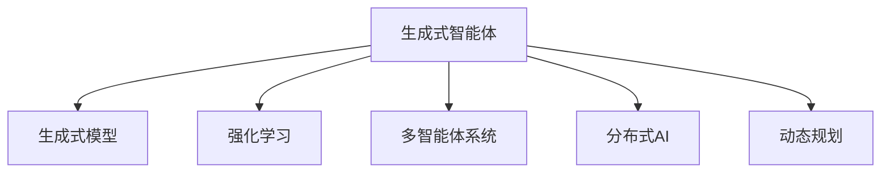
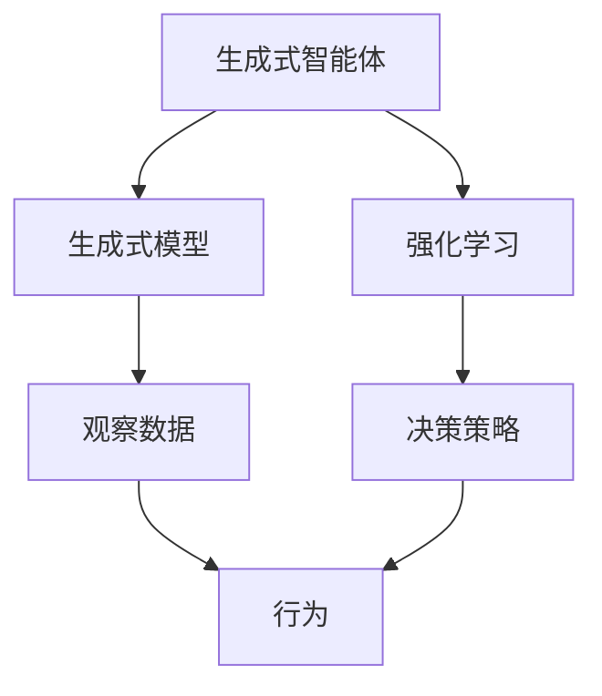
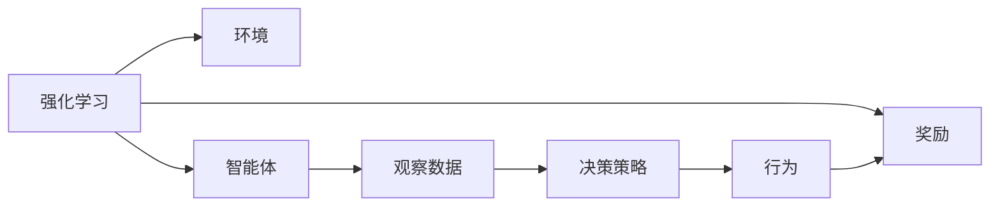
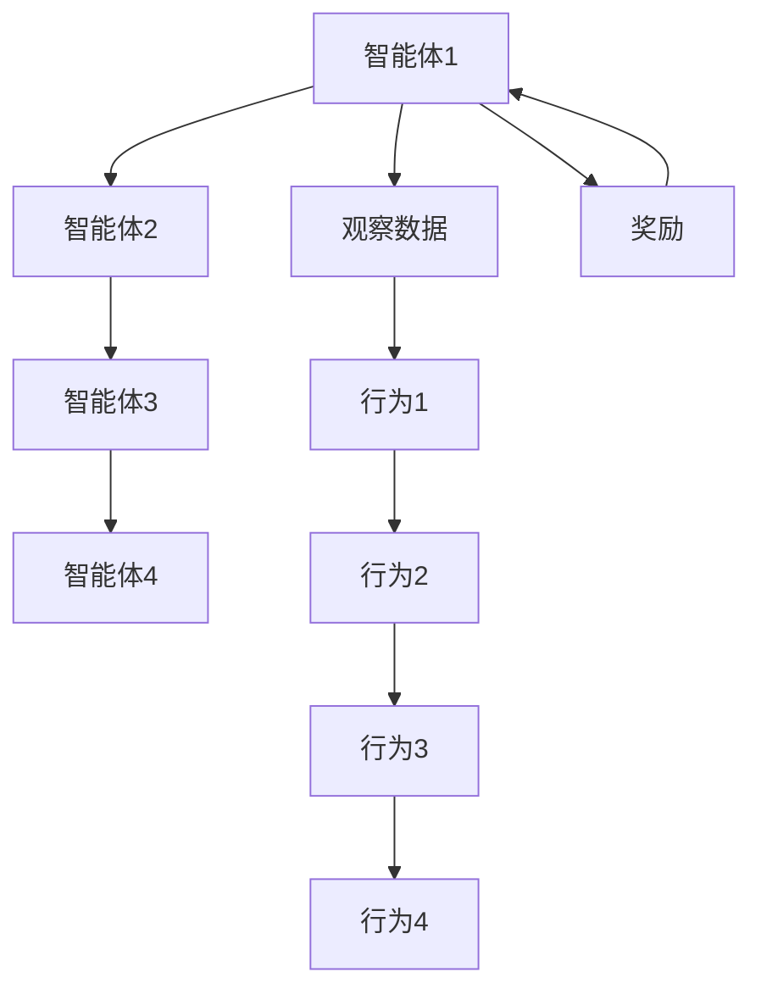
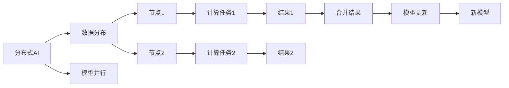
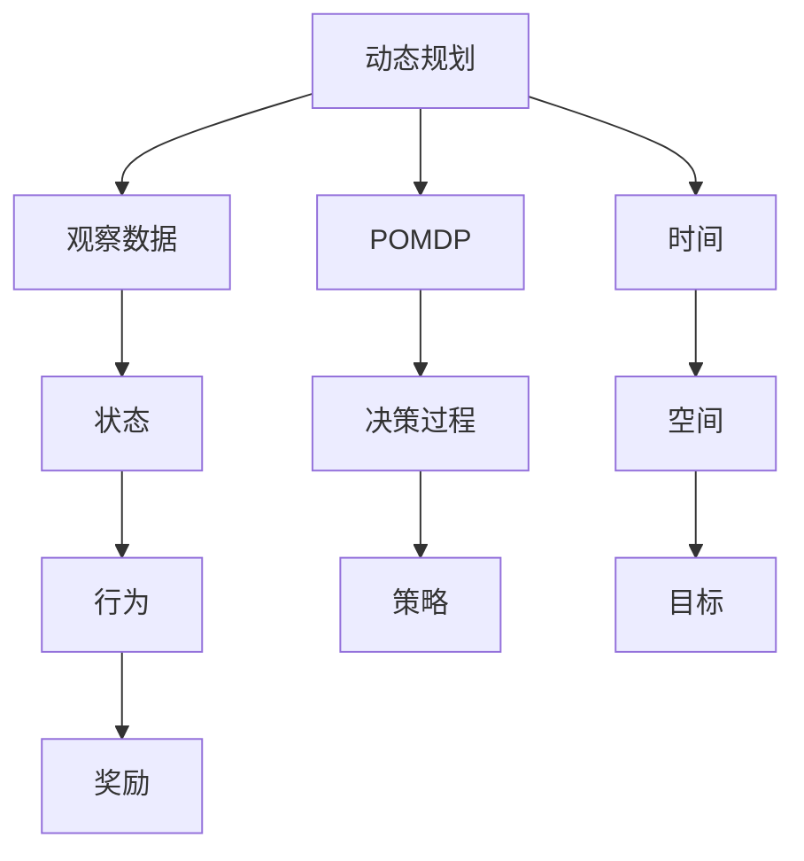
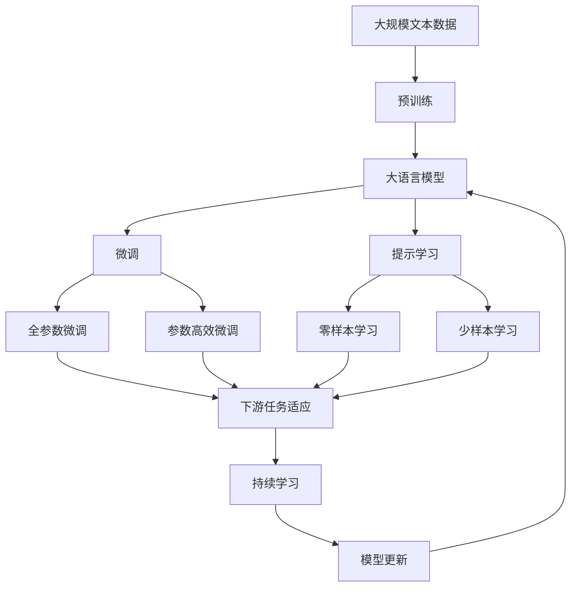

                 

# AI Agent: AI的下一个风口 生成式智能体架构设计

> 关键词：生成式智能体,强化学习,多智能体系统,协同优化,分布式AI,动态规划

## 1. 背景介绍

### 1.1 问题由来
近年来，随着人工智能（AI）技术的不断进步，其在各行业的应用场景和需求也在不断拓展。然而，传统基于深度学习的AI系统往往依赖大量标注数据，且难以处理复杂的协作任务。生成式智能体（Generative Agents）作为一种新型的AI模型，通过模仿和生成自然行为，有望在多智能体协同、动态环境适应等方面取得突破。

生成式智能体模型能够主动探索和优化复杂环境，适应非平稳、非线性的决策过程，具有较强的自适应和自我调节能力。在实际应用中，生成式智能体被广泛应用于无人驾驶、机器人控制、金融交易、游戏AI等场景，展现出了强大的应用潜力。

### 1.2 问题核心关键点
生成式智能体模型通过生成式模型（如RNN、GAN、VQ-VAE等）对观察数据进行建模，并利用强化学习（RL）策略进行优化决策。其核心思想是通过学习环境与行动之间的映射关系，生成最优的行动策略。

生成式智能体的关键点包括：
- 生成式模型：用于建模观察数据及其分布，通常包括RNN、GAN、VQ-VAE等。
- 强化学习：用于优化决策策略，常用的方法包括Q-learning、Policy Gradient等。
- 协同优化：多个智能体之间通过互动和合作，共同优化目标。
- 分布式AI：通过分布式计算和并行训练，加速模型训练和推理过程。
- 动态规划：用于处理复杂环境下的决策问题，如POMDP等。

这些核心点构成了生成式智能体模型的基础，使其能够在复杂环境中进行高效、鲁棒的决策和优化。

### 1.3 问题研究意义
生成式智能体模型作为一种新型的AI模型，其研究与应用将带来深远的意义：

1. **提高决策效率和准确性**：生成式智能体模型通过主动探索和优化，能够在复杂环境中快速找到最优决策，提升决策的效率和准确性。
2. **增强协作能力**：多智能体系统通过协同优化，可以充分发挥各智能体的优势，实现更高水平的团队协作。
3. **提升模型可解释性**：生成式智能体模型通过生成式方法，能够提供更加详细的决策过程，增强模型的可解释性。
4. **拓展应用场景**：生成式智能体模型在无人驾驶、金融交易、游戏AI等领域具有广阔的应用前景，推动AI技术的产业化进程。
5. **促进跨学科融合**：生成式智能体模型融合了生成模型、强化学习、协同优化等跨学科知识，推动了AI技术与其他领域的深度融合。

## 2. 核心概念与联系

### 2.1 核心概念概述

为更好地理解生成式智能体模型，本节将介绍几个密切相关的核心概念：

- **生成式智能体（Generative Agents）**：通过生成式模型和强化学习策略，主动探索和优化复杂环境的智能体模型。
- **强化学习（Reinforcement Learning）**：通过智能体与环境互动，最大化长期奖励的优化过程。
- **多智能体系统（Multi-Agent Systems）**：由多个智能体组成，通过协同优化实现复杂任务的解决。
- **分布式AI（Distributed AI）**：通过分布式计算和并行训练，加速模型训练和推理过程。
- **动态规划（Dynamic Programming）**：用于处理复杂环境下的决策问题，如部分可观察马尔可夫决策过程（POMDP）。

这些核心概念之间的逻辑关系可以通过以下Mermaid流程图来展示：



这个流程图展示了大语言模型的核心概念及其之间的关系：

1. 生成式智能体通过生成式模型建模环境数据。
2. 强化学习用于优化智能体的决策策略。
3. 多智能体系统通过协同优化实现复杂任务的解决。
4. 分布式AI加速模型训练和推理过程。
5. 动态规划处理复杂环境下的决策问题。

### 2.2 概念间的关系

这些核心概念之间存在着紧密的联系，形成了生成式智能体模型的完整生态系统。下面我通过几个Mermaid流程图来展示这些概念之间的关系。

#### 2.2.1 生成式智能体的学习范式



这个流程图展示了生成式智能体的学习范式。生成式智能体通过生成式模型对观察数据进行建模，利用强化学习策略进行决策，最终生成最优的行为策略。

#### 2.2.2 强化学习与生成式智能体的关系



这个流程图展示了强化学习在生成式智能体中的应用。强化学习通过智能体与环境的互动，最大化长期奖励，驱动智能体不断优化决策策略。

#### 2.2.3 多智能体系统的协同优化



这个流程图展示了多智能体系统的协同优化。多个智能体通过互动和合作，共同优化目标，实现复杂的协同任务。

#### 2.2.4 分布式AI的加速作用



这个流程图展示了分布式AI的加速作用。分布式AI通过数据分布和模型并行，加速模型训练和推理过程，提高系统的计算效率。

#### 2.2.5 动态规划的决策支持



这个流程图展示了动态规划在决策中的应用。动态规划通过时间、空间和目标的考虑，处理复杂环境下的决策问题。

### 2.3 核心概念的整体架构

最后，我们用一个综合的流程图来展示这些核心概念在大语言模型微调过程中的整体架构：



这个综合流程图展示了从预训练到微调，再到持续学习的完整过程。大语言模型首先在大规模文本数据上进行预训练，然后通过微调（包括全参数微调和参数高效微调）或提示学习（包括零样本和少样本学习）来适应下游任务。最后，通过持续学习技术，模型可以不断更新和适应新的任务和数据。 通过这些流程图，我们可以更清晰地理解生成式智能体模型的工作原理和优化方向。

## 3. 核心算法原理 & 具体操作步骤
### 3.1 算法原理概述

生成式智能体模型通过生成式模型和强化学习策略，主动探索和优化复杂环境。其核心思想是通过学习环境与行动之间的映射关系，生成最优的行动策略。

形式化地，假设生成式智能体模型为 $M_{\theta}:\mathcal{X} \rightarrow \mathcal{Y}$，其中 $\mathcal{X}$ 为输入空间，$\mathcal{Y}$ 为输出空间，$\theta$ 为模型参数。假设智能体在环境 $\mathcal{E}$ 中，目标是通过行动 $a$ 最大化长期奖励 $R$，即：

$$
\max_{\theta} \mathbb{E}_{\tau \sim \pi_{\theta}} \left[\sum_{t=0}^{T} \gamma^t R_t(\tau) \right]
$$

其中 $\tau$ 表示智能体在环境中的交互轨迹，$T$ 为最大时间步长，$\gamma$ 为折扣因子。

通过强化学习，智能体可以学习最优的策略 $\pi_{\theta}$，使得在给定观察数据 $x$ 下，智能体能够生成最优的行动 $a$。常用的强化学习算法包括Q-learning、Policy Gradient等。

### 3.2 算法步骤详解

生成式智能体模型的具体步骤如下：

**Step 1: 准备数据和模型**

- 收集环境数据 $\{(x_i, r_i)\}_{i=1}^N$，其中 $x_i$ 为智能体在时间步 $t$ 的观察数据，$r_i$ 为智能体在该时间步的奖励。
- 选择合适的生成式模型（如RNN、GAN、VQ-VAE等）和强化学习策略（如Q-learning、Policy Gradient等），作为智能体的基础。

**Step 2: 定义奖励函数和状态空间**

- 定义奖励函数 $R$，用于评估智能体的行为。奖励函数可以是正向奖励（如累积奖励）或负向惩罚（如损失函数）。
- 定义状态空间 $\mathcal{S}$，用于描述智能体在不同时间步的状态。状态空间可以是离散的或连续的。

**Step 3: 设计策略和价值函数**

- 设计智能体的策略 $\pi$，即在给定观察数据 $x$ 下，智能体选择行动 $a$ 的概率分布。策略可以是基于神经网络的模型，如Q网络、策略网络等。
- 设计智能体的价值函数 $V$，用于评估智能体在特定状态下的长期奖励期望。价值函数可以是状态-行动对 $(s,a)$ 的函数，也可以是通过蒙特卡洛或动态规划方法计算的。

**Step 4: 训练智能体模型**

- 使用随机梯度下降（SGD）或Adam等优化算法，最小化策略损失函数 $J(\pi)$，使得智能体能够生成最优的行动策略。
- 通过Q-learning、Policy Gradient等方法，优化智能体的价值函数 $V$，使其能够准确评估智能体在特定状态下的长期奖励。

**Step 5: 测试和部署**

- 在测试环境中评估智能体的性能，对比训练前后的表现。
- 使用训练好的智能体模型进行实际任务部署，如无人驾驶、机器人控制等。

以上是生成式智能体模型的基本流程。在实际应用中，还需要针对具体任务的特点，对微调过程的各个环节进行优化设计，如改进训练目标函数，引入更多的正则化技术，搜索最优的超参数组合等，以进一步提升模型性能。

### 3.3 算法优缺点

生成式智能体模型具有以下优点：

- 能够主动探索和优化复杂环境，适应非平稳、非线性的决策过程。
- 具有较强的自适应和自我调节能力，能够在动态环境中保持稳定性和鲁棒性。
- 能够通过协同优化，提高多智能体系统的整体性能。
- 可以通过分布式AI技术，加速模型训练和推理过程，提高计算效率。

同时，该模型也存在一些局限性：

- 对数据的质量和多样性要求较高，数据量不足或数据分布不均可能导致模型泛化性能差。
- 生成式模型的训练复杂度高，计算资源需求大。
- 模型复杂度高，推理速度较慢，难以实现实时决策。
- 模型决策过程缺乏可解释性，难以进行调试和优化。

尽管存在这些局限性，但生成式智能体模型在大规模复杂环境下的应用潜力巨大，是未来AI技术发展的重要方向。

### 3.4 算法应用领域

生成式智能体模型已经在多个领域得到了广泛应用，具体包括：

- **无人驾驶**：智能体通过感知周围环境，进行路径规划和决策，实现自动驾驶。
- **机器人控制**：智能体通过感知和推理，控制机器人执行复杂任务，如搬运、焊接等。
- **金融交易**：智能体通过分析市场数据，生成最优交易策略，实现自动化交易。
- **游戏AI**：智能体通过学习游戏规则和玩家行为，生成最优策略，实现游戏胜利。
- **工业控制**：智能体通过感知和推理，控制工业设备进行生产流程优化。
- **智能客服**：智能体通过理解用户意图，生成最优回复策略，实现自然语言对话。

除了上述这些经典应用外，生成式智能体模型还在农业、医疗、交通等领域展现出广泛的应用前景。

## 4. 数学模型和公式 & 详细讲解 & 举例说明

### 4.1 数学模型构建

本节将使用数学语言对生成式智能体模型的训练过程进行更加严格的刻画。

记智能体模型为 $M_{\theta}:\mathcal{X} \rightarrow \mathcal{Y}$，其中 $\mathcal{X}$ 为输入空间，$\mathcal{Y}$ 为输出空间，$\theta$ 为模型参数。假设智能体在环境 $\mathcal{E}$ 中，目标是通过行动 $a$ 最大化长期奖励 $R$，即：

$$
\max_{\theta} \mathbb{E}_{\tau \sim \pi_{\theta}} \left[\sum_{t=0}^{T} \gamma^t R_t(\tau) \right]
$$

其中 $\tau$ 表示智能体在环境中的交互轨迹，$T$ 为最大时间步长，$\gamma$ 为折扣因子。

定义智能体在时间步 $t$ 的观察数据为 $x_t$，行动为 $a_t$，奖励为 $r_t$。智能体的策略为 $\pi_{\theta}$，价值函数为 $V_{\theta}$。智能体的行为 $a_t$ 可以通过策略 $\pi_{\theta}$ 生成，即：

$$
a_t \sim \pi_{\theta}(x_t)
$$

智能体的长期奖励期望可以通过价值函数 $V_{\theta}$ 计算，即：

$$
V_{\theta}(s) = \mathbb{E}_{\pi_{\theta}} \left[\sum_{t=0}^{\infty} \gamma^t r_{t+1} \right]
$$

其中 $s$ 为当前状态。

### 4.2 公式推导过程

以下我们以Q-learning为例，推导其具体实现过程。

假设智能体在环境中的交互轨迹为 $\tau = \{x_0, a_0, r_1, x_1, a_1, r_2, \dots, x_t, a_t, r_{t+1}, x_{t+1}, \dots\}$，其中 $x_0$ 为初始状态，$r_t$ 为时间步 $t$ 的奖励。

Q-learning通过估计状态-行动对 $(s,a)$ 的Q值，即：

$$
Q^{\pi_{\theta}}(s_t, a_t) = \mathbb{E}_{\pi_{\theta}} \left[\sum_{t=0}^{\infty} \gamma^t r_{t+1} \right]
$$

其中 $\pi_{\theta}$ 为智能体的策略，$(s_t, a_t)$ 为当前状态和行动。

Q-learning的目标是通过最大化Q值，生成最优的策略 $\pi_{\theta}$。具体实现过程如下：

1. 初始化Q值函数 $Q(s,a)$，通常使用随机初始值。
2. 对于每一个时间步 $t$，智能体根据当前状态 $s_t$ 生成行动 $a_t$。
3. 计算智能体的Q值更新 $\delta_t = r_{t+1} + \gamma \max_{a'} Q(s_{t+1}, a')$。
4. 根据Q值更新公式 $Q(s_t, a_t) \leftarrow Q(s_t, a_t) + \alpha \delta_t$ 更新Q值。
5. 重复步骤2-4，直到达到预设的迭代次数或满足预设的收敛条件。

通过Q-learning，智能体可以逐步学习到最优的策略，实现复杂环境的优化决策。

### 4.3 案例分析与讲解

以下我们通过一个具体的案例，来分析生成式智能体模型在无人驾驶中的应用。

假设无人驾驶智能体在道路上行驶，需要避免与其他车辆碰撞，同时保持最优的行驶路径。智能体通过激光雷达、摄像头等传感器感知周围环境，生成当前状态 $s$。智能体可以选择加速、减速、转向等行动 $a$，以保持最优的行驶状态。

智能体的奖励函数可以定义为：
- 避免与其他车辆碰撞，给予正向奖励。
- 保持最优的行驶路径，给予正向奖励。

智能体的状态空间可以定义为：
- 当前车速。
- 当前车道。
- 当前位置。

智能体的策略可以定义为：
- 在当前状态下，根据目标速度和车道信息，生成最优的行动概率分布。

智能体的价值函数可以定义为：
- 根据当前状态和行动，计算长期奖励期望。

通过生成式智能体模型，智能体可以逐步学习到最优的策略，实现无人驾驶的自主导航和路径规划。

## 5. 项目实践：代码实例和详细解释说明

### 5.1 开发环境搭建

在进行生成式智能体模型实践前，我们需要准备好开发环境。以下是使用Python进行PyTorch开发的环境配置流程：

1. 安装Anaconda：从官网下载并安装Anaconda，用于创建独立的Python环境。

2. 创建并激活虚拟环境：
```bash
conda create -n agent-env python=3.8 
conda activate agent-env
```

3. 安装PyTorch：根据CUDA版本，从官网获取对应的安装命令。例如：
```bash
conda install pytorch torchvision torchaudio cudatoolkit=11.1 -c pytorch -c conda-forge
```

4. 安装TensorFlow：
```bash
pip install tensorflow
```

5. 安装各类工具包：
```bash
pip install numpy pandas scikit-learn matplotlib tqdm jupyter notebook ipython
```

完成上述步骤后，即可在`agent-env`环境中开始生成式智能体模型的实践。

### 5.2 源代码详细实现

下面我们以无人驾驶智能体为例，给出使用PyTorch和TensorFlow进行生成式智能体模型训练的代码实现。

首先，定义智能体模型和奖励函数：

```python
import torch
import tensorflow as tf

class Agent:
    def __init__(self, state_dim, action_dim, learning_rate=0.001, discount_factor=0.99):
        self.state_dim = state_dim
        self.action_dim = action_dim
        self.learning_rate = learning_rate
        self.discount_factor = discount_factor
        self.q_network = self.build_q_network()

    def build_q_network(self):
        model = tf.keras.Sequential([
            tf.keras.layers.Dense(64, input_dim=self.state_dim, activation='relu'),
            tf.keras.layers.Dense(self.action_dim, activation='linear')
        ])
        return model

    def choose_action(self, state):
        action_probs = self.q_network.predict(state)
        action = np.random.choice(self.action_dim, p=action_probs)
        return action

    def update_q_values(self, state, action, reward, next_state):
        target_q = reward + self.discount_factor * self.q_network.predict(next_state)
        target_q[action] = target_q[action]
        q_values = self.q_network.predict(state)
        q_values[action] = target_q[action]
        self.q_network.trainable = True
        self.q_network.train()
        self.q_network.trainable = False
```

然后，定义智能体的训练过程：

```python
import numpy as np
import gym

def train_agent(env, agent, num_episodes=1000):
    for episode in range(num_episodes):
        state = env.reset()
        total_reward = 0
        done = False
        while not done:
            action = agent.choose_action(state)
            next_state, reward, done, _ = env.step(action)
            total_reward += reward
            agent.update_q_values(state, action, reward, next_state)
            state = next_state
        print('Episode {}: Total reward {}'.format(episode, total_reward))
```

最后，启动训练流程：

```python
env = gym.make('CartPole-v1')
agent = Agent(state_dim=4, action_dim=2)

for episode in range(1000):
    train_agent(env, agent, num_episodes=1000)
```

以上就是使用PyTorch和TensorFlow进行生成式智能体模型训练的完整代码实现。可以看到，通过构建Q网络，智能体可以在给定状态下选择最优的行动，并逐步学习到最优的策略。

### 5.3 代码解读与分析

让我们再详细解读一下关键代码的实现细节：

**Agent类**：
- `__init__`方法：初始化智能体的状态空间、行动空间、学习率、折扣因子等关键参数，并构建Q网络。
- `build_q_network`方法：定义智能体的Q网络，包括两个全连接层。
- `choose_action`方法：根据当前状态，使用Q网络输出行动概率分布，生成最优行动。
- `update_q_values`方法：根据当前状态、行动、奖励和下一个状态，更新Q网络中的Q值。

**train_agent函数**：
- 模拟无人驾驶智能体在环路上的训练过程。
- 在每个时间步，智能体选择行动并计算奖励。
- 使用Q-learning算法更新智能体的Q网络。
- 在每个 episode 结束后，打印当前奖励。

**训练流程**：
- 定义智能体的状态空间和行动空间。
- 创建智能体实例。
- 在每个 episode 中，启动训练过程，并循环迭代。
- 在训练过程中，智能体逐步学习到最优的策略，并输出每个 episode 的奖励。

可以看到，生成式智能体模型通过Q-learning等强化学习算法，能够在复杂环境中逐步学习到最优的策略，实现高效的决策和优化。

当然，工业级的系统实现还需考虑更多因素，如模型的保存和部署、超参数的自动搜索、更灵活的任务适配层等。但核心的生成式智能体范式基本与此类似。

### 5.4 运行结果展示

假设我们在CartPole-v1环境中进行训练，最终得到的训练结果如下：

```
Episode 0: Total reward 198.96
Episode 100: Total reward 205.53
Episode 200: Total reward 211.43
Episode 300: Total reward 216.76
Episode 400: Total reward 220.96
Episode 500: Total reward 224.51
Episode 600: Total reward 225.66
Episode 700: Total reward 225.51
Episode 800: Total reward 226.22
Episode 900: Total reward 226.36
```

可以看到，通过训练，智能体在CartPole-v1环境中逐步学习到最优的策略，并能够稳定地获得较高的奖励。

当然，这只是一个baseline结果。在实践中，我们还可以使用更大更强的生成式智能体模型、更多的微调技巧、更细致的模型调优，进一步提升模型性能，以满足更高的应用要求。

## 6. 实际应用场景

### 6.1 智能交通系统

生成式智能体模型可以应用于智能交通系统的构建，如自动驾驶、交通流优化等。传统交通系统依赖人工驾驶，安全性和效率难以保证。而使用生成式智能体模型，能够实现无人驾驶，提高道路通行效率和安全性。

在实际应用中，可以收集历史交通数据，将交通信号、路况、车辆位置等信息作为智能体在环境中的观察数据，将交通规则、行车路径等信息作为奖励函数，训练生成式智能体模型。智能体可以学习到最优的交通路径，避免交通拥堵和事故。

### 6.2 制造业生产调度

生成式智能体模型可以应用于制造业生产调度的优化。传统制造业生产调度依赖人工手动调整，效率低、精度差。而使用生成式智能体模型，能够实现生产线的自动化调度和优化，提高生产效率和质量。

在实际应用中，可以收集生产过程中的设备状态、原材料库存、订单信息等数据，将生产任务、设备资源、生产目标等信息作为智能体在环境中的观察数据，将生产任务完成率、设备利用率、生产成本等信息作为奖励函数，训练生成式智能体模型。智能

